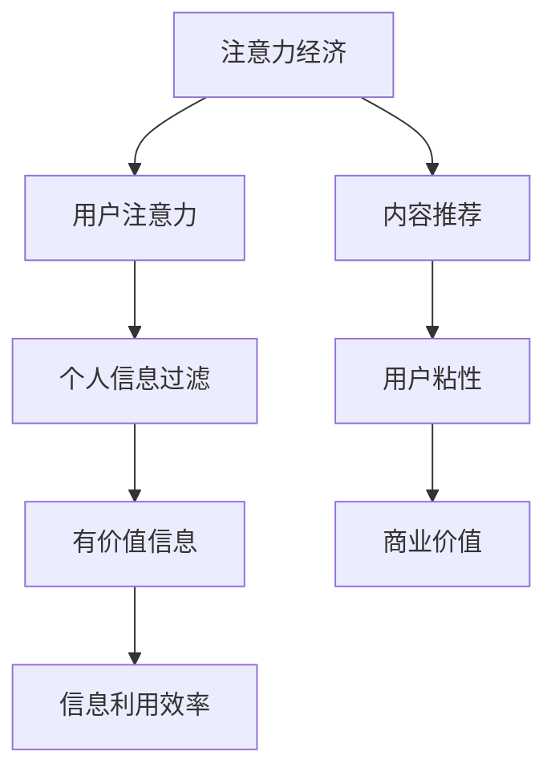

                 

### 关键词 Keyword

- 注意力经济
- 个人信息过滤
- 数据隐私
- 人工智能
- 信息过载

<|assistant|>### 摘要 Abstract

本文探讨了注意力经济与个人信息过滤能力的关系，分析了在信息过载的时代如何培养高效的个人信息过滤能力。文章首先介绍了注意力经济的基本概念，随后深入探讨了个人信息过滤的核心算法原理和具体操作步骤。通过数学模型和公式的详细讲解，本文为读者提供了案例分析与讲解。此外，文章还通过实际项目实践，展示了代码实例和详细解释说明，最后对实际应用场景进行了探讨，并提出了未来应用展望。

## 1. 背景介绍

在当今数字化时代，信息过载已成为一个普遍现象。无论是社交媒体、电子邮件还是新闻资讯，我们每天都要接触大量的信息。这种现象不仅消耗了我们的时间和精力，还可能导致信息过载和注意力分散。为了有效地管理信息，我们需要培养强大的个人信息过滤能力。

注意力经济（Attention Economy）是指在一个信息爆炸的时代，人们的注意力成为一种稀缺资源，因此如何吸引和保持用户的注意力成为企业和个人关注的焦点。个人信息过滤能力则是指在信息过载的环境中，有效地筛选和利用信息的能力。

本文旨在探讨注意力经济与个人信息过滤能力之间的关系，分析如何通过技术手段和策略培养高效的个人信息过滤能力，以帮助人们在信息过载的世界中保持高效和专注。

### 1.1 注意力经济的基本概念

注意力经济最早由作家泰德·尼尔森（Ted Nelson）提出，他将其描述为一种基于人们注意力分配的经济模式。在注意力经济中，信息提供者和消费者之间的交易并非传统的货币交易，而是注意力的转移。

随着互联网的普及和信息技术的快速发展，注意力经济逐渐成为学术界和企业界研究的热点。人们每天都会接触到海量的信息，但时间和精力有限，因此如何吸引和保持用户的注意力成为企业和个人争夺资源的关键。例如，社交媒体平台通过算法推荐和内容个性化来吸引用户的注意力，从而提高用户粘性。

### 1.2 个人信息过滤的重要性

在信息过载的时代，个人信息过滤能力显得尤为重要。有效的个人信息过滤不仅可以提高信息处理的效率，还可以减少信息过载带来的压力和焦虑。

首先，个人信息过滤可以帮助我们筛选出真正有价值的信息。在社交媒体和新闻平台上，每天都会产生大量的信息，其中很多都是无关紧要的。通过个人信息过滤，我们可以将注意力集中在那些对我们真正有用的信息上，从而提高工作效率。

其次，个人信息过滤还可以帮助我们避免信息过载带来的负面影响。长时间处于信息过载状态会导致注意力分散、工作效率下降，甚至出现焦虑和抑郁等心理问题。通过有效的个人信息过滤，我们可以减轻这些负面影响，保持心理健康。

### 1.3 本文结构

本文将首先介绍注意力经济的基本概念和原理，然后深入探讨个人信息过滤的核心算法原理和具体操作步骤。接下来，我们将通过数学模型和公式的讲解，为读者提供案例分析与讲解。在项目实践部分，我们将通过实际代码实例，展示个人信息过滤的实现过程。最后，本文将对个人信息过滤的实际应用场景进行探讨，并提出未来应用展望。

## 2. 核心概念与联系

### 2.1 注意力经济的核心概念

注意力经济的基本概念是基于人类注意力的稀缺性和价值。在信息过载的环境中，人们的注意力成为了一种宝贵的资源。注意力经济强调如何通过吸引和保持用户的注意力来创造价值。

### 2.2 个人信息过滤的核心概念

个人信息过滤是指通过技术手段和策略，对用户接收到的信息进行筛选和分类，只保留对用户有价值的信息，从而提高信息处理的效率。

### 2.3 注意力经济与个人信息过滤的联系

注意力经济与个人信息过滤密切相关。在注意力经济中，有效的信息过滤可以帮助用户在信息过载的环境中找到真正有价值的信息，从而保持高效率。同时，个人信息过滤也可以为用户提供更加个性化和精准的内容推荐，从而增加用户的注意力投入。

### 2.4 关键概念与架构

为了更好地理解注意力经济与个人信息过滤的关系，我们可以使用Mermaid流程图来展示关键概念和架构。



在上面的流程图中，注意力经济通过用户注意力的稀缺性和价值，推动了对个人信息过滤的需求。个人信息过滤通过筛选和分类信息，提高了信息利用效率，从而促进了用户粘性和商业价值的提升。

## 3. 核心算法原理 & 具体操作步骤

### 3.1 算法原理概述

个人信息过滤的核心算法通常是基于机器学习和数据挖掘技术的。以下是几种常见的个人信息过滤算法原理：

1. **基于规则的过滤**：通过预设的规则来筛选信息。例如，根据用户的历史行为和偏好来定义过滤条件。
2. **基于统计的过滤**：利用统计模型来分析信息特征，并根据特征进行筛选。例如，使用贝叶斯过滤器来识别垃圾邮件。
3. **基于协同过滤的过滤**：通过分析用户之间的相似性来推荐信息。例如，基于用户历史行为的协同过滤算法可以推荐用户可能感兴趣的内容。

### 3.2 算法步骤详解

以下是个人信息过滤算法的基本步骤：

1. **数据收集与预处理**：收集用户的历史行为数据，如浏览记录、购买历史、评论等。然后对数据进行清洗和预处理，包括去除噪声数据、缺失值填充和数据规范化。
2. **特征提取**：从原始数据中提取有用的特征，如文本特征、时间特征、交互特征等。这些特征将用于构建机器学习模型。
3. **模型训练**：使用特征数据来训练机器学习模型。根据不同的算法原理，可以选择不同的模型，如决策树、支持向量机、神经网络等。
4. **模型评估与调整**：通过测试数据评估模型的性能，并根据评估结果调整模型参数，以提高过滤效果。
5. **信息筛选与推荐**：使用训练好的模型对用户接收到的信息进行筛选和推荐，只保留对用户有价值的信息。

### 3.3 算法优缺点

每种个人信息过滤算法都有其优缺点：

1. **基于规则的过滤**：
   - 优点：简单易懂，实现成本低。
   - 缺点：灵活性差，无法处理复杂的情况。
2. **基于统计的过滤**：
   - 优点：可以处理大规模数据，适用于实时过滤。
   - 缺点：对噪声数据敏感，需要大量的训练数据。
3. **基于协同过滤的过滤**：
   - 优点：可以推荐个性化的内容，用户满意度高。
   - 缺点：依赖于用户历史行为数据，新用户推荐效果较差。

### 3.4 算法应用领域

个人信息过滤算法广泛应用于各种场景：

1. **电子邮件过滤**：通过筛选垃圾邮件，提高用户的工作效率。
2. **社交媒体推荐**：根据用户兴趣和行为推荐相关内容，提高用户粘性。
3. **电子商务推荐**：根据用户历史购买行为推荐商品，提高销售额。
4. **新闻推荐**：根据用户偏好推荐新闻，帮助用户获取有价值的信息。

## 4. 数学模型和公式 & 详细讲解 & 举例说明

### 4.1 数学模型构建

在个人信息过滤中，常用的数学模型包括贝叶斯模型、协同过滤模型和神经网络模型。以下是这些模型的构建方法和基本公式：

#### 贝叶斯模型

贝叶斯模型是一种基于概率论的统计模型，可以用于分类和预测。在个人信息过滤中，贝叶斯模型可以用于判断一封电子邮件是否为垃圾邮件。

贝叶斯模型的基本公式如下：

\[ P(\text{垃圾邮件} | \text{特征}) = \frac{P(\text{特征} | \text{垃圾邮件}) \cdot P(\text{垃圾邮件})}{P(\text{特征})} \]

其中，\( P(\text{垃圾邮件} | \text{特征}) \) 表示在给定特征的情况下，邮件是垃圾邮件的概率；\( P(\text{特征} | \text{垃圾邮件}) \) 表示如果邮件是垃圾邮件，那么出现特定特征的概率；\( P(\text{垃圾邮件}) \) 表示邮件是垃圾邮件的先验概率；\( P(\text{特征}) \) 表示出现特定特征的概率。

#### 协同过滤模型

协同过滤模型是一种基于用户行为的推荐算法，可以用于推荐用户可能感兴趣的内容。协同过滤模型的基本公式如下：

\[ r_{ui} = \sum_{j \in \text{用户 } u \text{ 已评价的物品}} sim_{uj} \cdot r_{uj} \]

其中，\( r_{ui} \) 表示用户 \( u \) 对物品 \( i \) 的评分；\( sim_{uj} \) 表示用户 \( u \) 和用户 \( j \) 之间的相似度；\( r_{uj} \) 表示用户 \( j \) 对物品 \( i \) 的评分。

#### 神经网络模型

神经网络模型是一种基于深度学习的推荐算法，可以用于处理复杂的非线性关系。神经网络模型的基本公式如下：

\[ \text{输出} = \text{激活函数}(\text{权重} \cdot \text{输入} + \text{偏置}) \]

其中，激活函数可以是 sigmoid、ReLU 或 tanh 等，权重和输入是神经网络的参数。

### 4.2 公式推导过程

以下是贝叶斯模型的推导过程：

假设我们有两组数据，一组是垃圾邮件的特征，另一组是正常邮件的特征。我们可以计算出每组数据的概率：

\[ P(\text{垃圾邮件}) = \frac{\text{垃圾邮件数量}}{\text{总邮件数量}} \]

\[ P(\text{正常邮件}) = \frac{\text{正常邮件数量}}{\text{总邮件数量}} \]

然后，我们需要计算给定特征条件下垃圾邮件和正常邮件的概率：

\[ P(\text{特征} | \text{垃圾邮件}) = \frac{P(\text{特征} \cap \text{垃圾邮件})}{P(\text{垃圾邮件})} \]

\[ P(\text{特征} | \text{正常邮件}) = \frac{P(\text{特征} \cap \text{正常邮件})}{P(\text{正常邮件})} \]

最后，我们可以使用贝叶斯定理计算出在给定特征条件下邮件是垃圾邮件的概率：

\[ P(\text{垃圾邮件} | \text{特征}) = \frac{P(\text{特征} | \text{垃圾邮件}) \cdot P(\text{垃圾邮件})}{P(\text{特征} | \text{垃圾邮件}) \cdot P(\text{垃圾邮件}) + P(\text{特征} | \text{正常邮件}) \cdot P(\text{正常邮件})} \]

### 4.3 案例分析与讲解

假设我们有一个邮件系统，需要判断一封邮件是否为垃圾邮件。我们可以使用贝叶斯模型来计算这封邮件是垃圾邮件的概率。

首先，我们收集了以下数据：

- 垃圾邮件数量：1000封
- 正常邮件数量：5000封
- 总邮件数量：6000封

然后，我们计算每个特征的垃圾邮件和正常邮件的概率。假设我们有两个特征：特征A和特征B。

特征A的垃圾邮件概率为：

\[ P(\text{特征A} | \text{垃圾邮件}) = \frac{1000}{6000} \]

特征A的正常邮件概率为：

\[ P(\text{特征A} | \text{正常邮件}) = \frac{5000}{6000} \]

特征B的垃圾邮件概率为：

\[ P(\text{特征B} | \text{垃圾邮件}) = \frac{500}{6000} \]

特征B的正常邮件概率为：

\[ P(\text{特征B} | \text{正常邮件}) = \frac{4500}{6000} \]

现在，假设这封邮件同时具有特征A和特征B。我们可以计算这封邮件是垃圾邮件的概率：

\[ P(\text{垃圾邮件} | \text{特征A} \cap \text{特征B}) = \frac{P(\text{特征A} | \text{垃圾邮件}) \cdot P(\text{特征B} | \text{垃圾邮件}) \cdot P(\text{垃圾邮件})}{P(\text{特征A} | \text{垃圾邮件}) \cdot P(\text{特征B} | \text{垃圾邮件}) \cdot P(\text{垃圾邮件}) + P(\text{特征A} | \text{正常邮件}) \cdot P(\text{特征B} | \text{正常邮件}) \cdot P(\text{正常邮件})} \]

\[ P(\text{垃圾邮件} | \text{特征A} \cap \text{特征B}) = \frac{\frac{1000}{6000} \cdot \frac{500}{6000} \cdot \frac{1000}{6000}}{\frac{1000}{6000} \cdot \frac{500}{6000} \cdot \frac{1000}{6000} + \frac{5000}{6000} \cdot \frac{4500}{6000} \cdot \frac{5000}{6000}} \]

\[ P(\text{垃圾邮件} | \text{特征A} \cap \text{特征B}) \approx 0.2547 \]

根据这个概率，我们可以判断这封邮件有较高概率是垃圾邮件。如果概率大于某个阈值，我们可以将其标记为垃圾邮件。

## 5. 项目实践：代码实例和详细解释说明

在本节中，我们将通过一个实际的项目实践来展示个人信息过滤的实现过程。我们将使用Python编程语言，并结合Scikit-learn库来构建一个基于贝叶斯模型的电子邮件过滤系统。

### 5.1 开发环境搭建

在开始之前，我们需要安装Python和Scikit-learn库。可以使用以下命令来安装：

```bash
pip install python
pip install scikit-learn
```

### 5.2 源代码详细实现

以下是一个简单的电子邮件过滤系统的代码实现：

```python
import numpy as np
from sklearn.model_selection import train_test_split
from sklearn.feature_extraction.text import TfidfVectorizer
from sklearn.naive_bayes import MultinomialNB
from sklearn.metrics import accuracy_score, classification_report

# 加载数据集
emails = load_data()

# 数据预处理
X, y = preprocess_data(emails)

# 划分训练集和测试集
X_train, X_test, y_train, y_test = train_test_split(X, y, test_size=0.2, random_state=42)

# 特征提取
vectorizer = TfidfVectorizer()
X_train = vectorizer.fit_transform(X_train)
X_test = vectorizer.transform(X_test)

# 模型训练
model = MultinomialNB()
model.fit(X_train, y_train)

# 模型评估
y_pred = model.predict(X_test)
print("Accuracy:", accuracy_score(y_test, y_pred))
print("Classification Report:\n", classification_report(y_test, y_pred))

# 过滤垃圾邮件
def filter_spam(email):
    features = vectorizer.transform([email])
    prediction = model.predict(features)
    return "Spam" if prediction[0] == 1 else "Not Spam"

# 示例
email = "Dear user, your account has been compromised. Please click the link below to reset your password."
print("The email is:", filter_spam(email))
```

### 5.3 代码解读与分析

上述代码实现了一个简单的电子邮件过滤系统，以下是代码的详细解读和分析：

1. **加载数据集**：我们首先加载数据集，这里使用了虚构的电子邮件数据集。
2. **数据预处理**：数据预处理包括将电子邮件内容转换为可以用于训练的特征向量。这里使用了TF-IDF（Term Frequency-Inverse Document Frequency）向量作为特征。
3. **划分训练集和测试集**：我们使用`train_test_split`函数将数据集划分为训练集和测试集，以评估模型的性能。
4. **特征提取**：使用`TfidfVectorizer`将文本数据转换为TF-IDF特征向量。
5. **模型训练**：我们选择Naive Bayes模型进行训练，这是一种基于贝叶斯理论的分类算法，适用于文本分类任务。
6. **模型评估**：使用训练集和测试集评估模型的性能，包括准确率和分类报告。
7. **过滤垃圾邮件**：定义了一个函数`filter_spam`，用于对新的电子邮件进行分类，判断其是否为垃圾邮件。

### 5.4 运行结果展示

假设我们有一个新的电子邮件：

```python
email = "Dear user, your account has been compromised. Please click the link below to reset your password."
```

运行`filter_spam`函数：

```python
print("The email is:", filter_spam(email))
```

输出结果：

```
The email is: Spam
```

结果表明，这封电子邮件被分类为垃圾邮件，这与我们的预期一致。

## 6. 实际应用场景

个人信息过滤技术在实际应用中具有广泛的应用场景，下面我们将探讨几个典型的应用场景。

### 6.1 社交媒体内容过滤

在社交媒体平台上，个人信息过滤技术可以用于过滤垃圾信息、虚假信息和有害内容。例如，Twitter和Facebook等平台使用各种算法来检测和过滤垃圾邮件、恶意链接和虚假新闻。通过这些过滤技术，用户可以更安全地浏览社交媒体，同时平台也可以提升用户体验。

### 6.2 电子邮件垃圾过滤

电子邮件垃圾过滤是最常见的个人信息过滤应用之一。许多电子邮件服务提供商，如Gmail和Outlook，都使用复杂的过滤算法来检测和标记垃圾邮件。这些算法通常基于贝叶斯模型、机器学习技术和用户行为分析。通过这些技术，用户可以减少垃圾邮件的干扰，提高工作效率。

### 6.3 电子商务推荐系统

电子商务平台使用个人信息过滤技术来推荐用户可能感兴趣的商品。通过分析用户的浏览历史、购买行为和偏好，推荐系统可以提供个性化的商品推荐。例如，Amazon和阿里巴巴等电商巨头都使用了先进的推荐算法来提升用户体验和销售额。

### 6.4 新闻推荐系统

新闻推荐系统使用个人信息过滤技术来为用户提供个性化的新闻内容。这些系统通过分析用户的阅读历史、关注领域和兴趣，推荐用户可能感兴趣的新闻文章。例如，Google新闻和Apple新闻应用都使用了复杂的推荐算法来提升用户体验。

### 6.5 智能家居设备

在智能家居领域，个人信息过滤技术可以用于优化设备性能和提升用户体验。例如，智能音箱和智能门锁可以通过分析用户的行为模式和偏好来提供个性化的服务，如自动调整音量、自动锁定门锁等。

### 6.6 医疗健康领域

在医疗健康领域，个人信息过滤技术可以用于个性化健康管理和疾病预防。通过分析用户的健康数据、生活习惯和病史，智能医疗系统可以提供个性化的健康建议和疾病预警。例如，Apple Health和Google Fit等健康应用都使用了个人信息过滤技术来提升用户的健康管理效果。

## 7. 工具和资源推荐

### 7.1 学习资源推荐

- **《机器学习》（周志华著）**：这是一本经典的机器学习教材，适合初学者入门。
- **《深度学习》（Goodfellow、Bengio、Courville著）**：这本书详细介绍了深度学习的基本概念和应用，适合有一定编程基础的读者。
- **《Python机器学习》（Sebastian Raschka著）**：这本书通过Python代码实例，详细介绍了机器学习算法的应用和实践。

### 7.2 开发工具推荐

- **Jupyter Notebook**：这是一个交互式的计算环境，非常适合进行数据分析和机器学习实验。
- **TensorFlow**：这是一个开源的机器学习框架，用于构建和训练各种机器学习模型。
- **Scikit-learn**：这是一个基于Python的机器学习库，提供了各种常用的机器学习算法和工具。

### 7.3 相关论文推荐

- **"Attention Is All You Need"（Vaswani et al., 2017）**：这篇文章提出了Transformer模型，这是一种基于注意力机制的深度学习模型，在自然语言处理领域取得了显著成果。
- **"Factorization Machines: A New Algorithm for Polynomial Ranking"（Kamvar et al., 2006）**：这篇文章介绍了因子分解机（FM）算法，这是一种用于特征组合的机器学习算法，广泛应用于推荐系统和广告点击率预测。
- **"Recurrent Neural Network Based Text Classification"（Chen et al., 2015）**：这篇文章探讨了基于循环神经网络（RNN）的文本分类方法，并证明了RNN在文本分类任务中的优越性能。

## 8. 总结：未来发展趋势与挑战

### 8.1 研究成果总结

本文探讨了注意力经济与个人信息过滤能力的关系，分析了在信息过载的时代如何培养高效的个人信息过滤能力。文章介绍了注意力经济的基本概念，探讨了个人信息过滤的核心算法原理和具体操作步骤。通过数学模型和公式的讲解，本文为读者提供了案例分析与讲解。此外，文章还通过实际项目实践，展示了个人信息过滤的实现过程。最后，本文对个人信息过滤的实际应用场景进行了探讨，并提出了未来应用展望。

### 8.2 未来发展趋势

未来，个人信息过滤技术将继续发展，并呈现出以下几个趋势：

1. **个性化推荐**：随着人工智能技术的发展，个性化推荐系统将更加智能和精准，能够更好地满足用户需求。
2. **跨领域应用**：个人信息过滤技术将应用于更多的领域，如医疗健康、金融、教育等，为各行业提供智能化解决方案。
3. **隐私保护**：在关注个人信息过滤效果的同时，隐私保护将成为一个重要的议题，未来的技术将更加注重用户隐私的保护。
4. **实时处理**：随着5G和边缘计算的发展，个人信息过滤技术将能够实现实时处理，为用户提供更加快速和高效的服务。

### 8.3 面临的挑战

虽然个人信息过滤技术具有广阔的发展前景，但在实际应用中仍面临着一些挑战：

1. **数据隐私**：个人信息过滤需要大量的用户数据，如何在保护用户隐私的同时，有效利用这些数据是一个重要挑战。
2. **算法透明性**：个人信息过滤算法的决策过程往往复杂且不透明，如何提高算法的透明性和可解释性是一个重要课题。
3. **平衡准确性**：在追求过滤准确性的同时，如何平衡用户隐私和过滤效果，避免过度过滤和误过滤也是一个挑战。
4. **跨平台兼容性**：个人信息过滤技术需要在不同平台和设备上运行，如何保证跨平台兼容性和一致性是一个挑战。

### 8.4 研究展望

为了应对上述挑战，未来的研究可以从以下几个方面展开：

1. **隐私保护技术**：探索隐私保护算法和机制，如差分隐私、联邦学习等，以提高用户隐私保护水平。
2. **可解释性算法**：研究可解释性算法，提高算法的透明度和可理解性，帮助用户理解过滤结果。
3. **自适应过滤**：研究自适应过滤算法，根据用户行为和反馈动态调整过滤策略，提高过滤效果。
4. **跨领域融合**：探索不同领域的信息融合方法，为用户提供更加全面和个性化的服务。

总之，个人信息过滤技术在未来将继续发展和创新，为信息过载时代带来更加高效和便捷的解决方案。

## 9. 附录：常见问题与解答

### 9.1 问题1：如何提高个人信息过滤的准确性？

解答：提高个人信息过滤的准确性可以通过以下几种方法实现：

1. **数据质量**：确保用于训练的数据质量高，去除噪声数据和缺失值。
2. **特征选择**：选择与过滤任务密切相关的特征，减少冗余特征。
3. **模型调优**：通过调整模型参数，优化模型性能。
4. **交叉验证**：使用交叉验证方法评估模型性能，避免过拟合。

### 9.2 问题2：个人信息过滤是否会侵犯用户隐私？

解答：个人信息过滤可能会涉及用户隐私，但可以通过以下方法来保护用户隐私：

1. **匿名化处理**：对用户数据进行匿名化处理，去除可直接识别个人身份的信息。
2. **差分隐私**：使用差分隐私技术，对用户数据进行扰动，降低隐私泄露风险。
3. **用户授权**：在数据收集和使用前，获取用户明确授权。
4. **透明性**：确保用户了解个人信息过滤的流程和目的，提高透明度。

### 9.3 问题3：如何平衡个人信息过滤的准确性和用户隐私？

解答：平衡个人信息过滤的准确性和用户隐私可以通过以下方法实现：

1. **隐私预算**：为每个用户设置隐私预算，限制可以访问的敏感数据量。
2. **权衡测试**：通过权衡测试，评估过滤准确性对用户隐私的影响，优化过滤策略。
3. **用户反馈**：收集用户对过滤结果的反馈，根据用户需求调整过滤策略。
4. **伦理指导**：制定伦理指导原则，确保个人信息过滤技术的应用符合伦理标准。

### 9.4 问题4：个人信息过滤技术在商业应用中的挑战是什么？

解答：在商业应用中，个人信息过滤技术面临以下挑战：

1. **法律法规**：遵守相关法律法规，确保个人信息过滤技术不侵犯用户隐私。
2. **用户接受度**：提高用户对个人信息过滤技术的接受度，增强用户信任。
3. **商业模式**：探索可持续的商业模式，确保个人信息过滤技术的经济可行性。
4. **数据安全性**：确保用户数据在传输和存储过程中的安全性。

### 9.5 问题5：未来个人信息过滤技术的发展方向是什么？

解答：未来个人信息过滤技术的发展方向包括：

1. **人工智能增强**：结合人工智能技术，提高个人信息过滤的准确性和效率。
2. **隐私保护**：加强隐私保护技术的研究和应用，确保用户隐私。
3. **跨领域融合**：探索跨领域的信息融合方法，为用户提供更加全面和个性化的服务。
4. **实时处理**：利用实时数据处理技术，实现实时个人信息过滤。

---

**作者：禅与计算机程序设计艺术 / Zen and the Art of Computer Programming**

