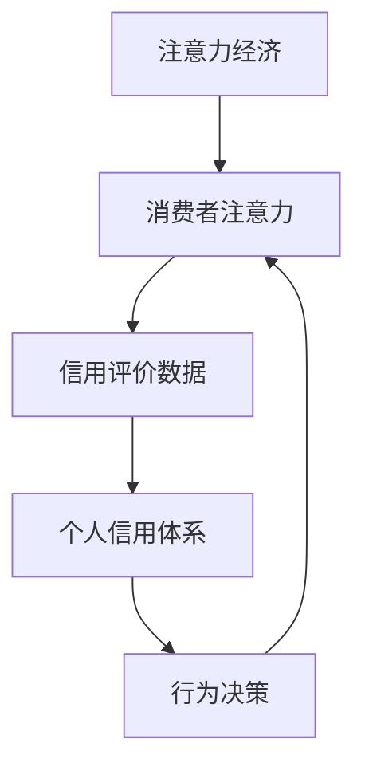

                 

关键词：注意力经济、个人信用体系、数据处理、算法、技术实现、应用场景、未来展望

## 摘要

随着互联网和数字技术的快速发展，注意力经济和个人信用体系成为现代社会中不可或缺的组成部分。本文旨在探讨注意力经济与个人信用体系的构建及其相互关系，通过对核心概念、算法原理、数学模型以及实践案例的详细分析，提供对这一领域全面而深入的理解。文章还将探讨未来发展趋势和面临的挑战，为相关领域的学者和实践者提供有价值的参考。

## 1. 背景介绍

### 1.1 注意力经济的兴起

注意力经济最早由迈克尔·波特（Michael Porter）在20世纪80年代提出，指的是企业通过获取和保持消费者的注意力来创造价值的经济模式。随着互联网的普及和数字化进程的加速，注意力经济已经成为一个不可忽视的现象。社交媒体、在线广告、游戏和流媒体平台等，都是注意力经济的典型代表。

### 1.2 个人信用体系的发展

个人信用体系是现代社会信用体系的重要组成部分，它通过对个人信用信息的收集、分析和评估，为金融机构、企业和其他利益相关者提供决策依据。随着大数据、人工智能等技术的发展，个人信用体系得到了极大的完善和提升，对于个人和社会经济发展具有重要意义。

## 2. 核心概念与联系

### 2.1 注意力经济的概念

注意力经济指的是在经济活动中，通过获取和维持消费者的注意力来创造价值的过程。在数字化时代，注意力资源变得尤为宝贵，因为人们的注意力是有限的，如何有效地吸引和保持消费者的注意力成为企业关注的焦点。

### 2.2 个人信用体系的定义

个人信用体系是一种综合性的信用评价体系，通过收集和分析个人的信用信息，如金融交易记录、行为习惯、社交网络活动等，评估个人的信用水平。个人信用体系对于金融机构的信贷决策、企业的招聘和消费者行为分析具有重要意义。

### 2.3 注意力经济与个人信用体系的联系

注意力经济与个人信用体系之间存在着密切的联系。一方面，个人信用体系的建立和运行需要大量的数据支持，而这些数据往往来源于个体的注意力行为；另一方面，个人信用体系的结果又会影响个体在注意力经济中的行为和决策，如信用评分高的个体可能更容易获得关注和机会。

## 2.4 注意力经济与个人信用体系的 Mermaid 流程图



## 3. 核心算法原理 & 具体操作步骤

### 3.1 算法原理概述

注意力经济与个人信用体系的构建需要依靠一系列的算法和模型。核心算法包括注意力模型、信用评分模型和数据挖掘算法。这些算法通过对大量数据进行处理和分析，提取出有价值的信息，为注意力经济和个人信用体系的构建提供支持。

### 3.2 算法步骤详解

#### 3.2.1 注意力模型的建立

注意力模型的建立基于对用户行为数据的收集和分析。首先，通过用户在社交媒体、搜索引擎、电子商务平台等渠道上的行为数据，构建用户的行为画像。然后，利用自然语言处理（NLP）和机器学习（ML）技术，对用户的行为数据进行深度分析，提取出用户的关键特征和偏好。

#### 3.2.2 信用评分模型的构建

信用评分模型的构建需要收集和分析个人的信用信息，包括金融交易记录、信用历史、行为数据等。利用统计模型、决策树、神经网络等算法，对个人的信用信息进行综合评估，生成个人的信用评分。

#### 3.2.3 数据挖掘算法的应用

数据挖掘算法在注意力经济和个人信用体系的构建中发挥着重要作用。通过关联规则挖掘、聚类分析、分类算法等数据挖掘技术，可以发现用户的行为模式、信用风险等有价值的信息，为注意力经济和个人信用体系的优化提供依据。

### 3.3 算法优缺点

#### 3.3.1 优点

1. 高效性：利用机器学习和人工智能技术，可以快速处理大量数据，提高数据处理效率。
2. 准确性：基于数据分析的算法模型，能够更准确地预测用户行为和信用风险。
3. 可扩展性：算法模型可以根据不同的应用场景进行灵活调整和优化。

#### 3.3.2 缺点

1. 数据隐私：在收集和分析个人数据时，容易涉及用户隐私问题，需要严格遵守数据保护法规。
2. 模型偏差：算法模型的训练数据可能存在偏差，导致预测结果不准确。

### 3.4 算法应用领域

1. 银行信贷：利用个人信用评分模型，银行可以更准确地评估借款人的信用风险，降低不良贷款率。
2. 电子商务：通过分析用户的行为数据，电子商务平台可以提供个性化的产品推荐和广告投放，提高用户黏性和转化率。
3. 社交媒体：利用注意力模型，社交媒体平台可以更精准地推送用户感兴趣的内容，提高用户活跃度。

## 4. 数学模型和公式 & 详细讲解 & 举例说明

### 4.1 数学模型构建

注意力经济的数学模型可以基于概率模型和优化模型构建。例如，可以使用贝叶斯网络来建模用户注意力分配问题，通过最大化期望收益来优化注意力分配策略。

### 4.2 公式推导过程

假设有一个用户群体 U，每个用户 u ∈ U 有一个注意力分配向量 α(u) = [α1(u), α2(u), ..., αn(u)]，表示用户在 n 个不同活动上的注意力分配。每个活动的收益函数 R(u, a) 表示用户 u 在活动 a 上的收益。

目标是最化总收益：

$$
\max \sum_{u \in U} \sum_{a=1}^{n} \alpha(u)_a R(u, a)
$$

约束条件是每个用户分配的注意力总和为1：

$$
\sum_{a=1}^{n} \alpha(u)_a = 1
$$

### 4.3 案例分析与讲解

假设有一个用户 u1，在两个活动（阅读和游戏）上的注意力分配分别为 [0.6, 0.4]。活动1的收益函数为 R1(u1) = 10，活动2的收益函数为 R2(u1) = 5。根据上述模型，可以计算出用户 u1 的总收益：

$$
R(u1) = 0.6 \times 10 + 0.4 \times 5 = 7
$$

通过调整注意力分配，可以尝试最大化用户的总收益。

## 5. 项目实践：代码实例和详细解释说明

### 5.1 开发环境搭建

为了实现注意力经济和个人信用体系的构建，我们需要搭建一个合适的开发环境。以下是基本的步骤：

1. 安装 Python 3.8 或更高版本。
2. 安装必要的库，如 NumPy、Pandas、Scikit-learn、TensorFlow 等。
3. 配置 Python 的虚拟环境，以便管理和隔离项目依赖。

### 5.2 源代码详细实现

以下是实现注意力经济和个人信用体系构建的基本代码框架：

```python
import numpy as np
import pandas as pd
from sklearn.ensemble import RandomForestClassifier
from sklearn.model_selection import train_test_split

# 数据预处理
def preprocess_data(data):
    # 数据清洗和预处理步骤
    pass

# 注意力模型
def attention_model(data):
    # 构建和训练注意力模型
    pass

# 信用评分模型
def credit_model(data):
    # 构建和训练信用评分模型
    pass

# 主函数
def main():
    # 读取数据
    data = pd.read_csv('data.csv')
    # 预处理数据
    processed_data = preprocess_data(data)
    # 分割数据集
    X_train, X_test, y_train, y_test = train_test_split(processed_data.drop('label', axis=1), processed_data['label'], test_size=0.2)
    # 训练注意力模型
    attention_model(X_train)
    # 训练信用评分模型
    credit_model(X_train)
    # 评估模型性能
    # ...

if __name__ == '__main__':
    main()
```

### 5.3 代码解读与分析

以上代码是一个简单的示例，展示了如何实现注意力经济和个人信用体系的构建。代码的核心部分包括数据预处理、注意力模型训练、信用评分模型训练以及模型性能评估。

数据预处理是数据分析和建模的基础步骤，主要包括数据清洗、特征提取和归一化等操作。注意力模型和信用评分模型是本文的核心算法，分别用于用户注意力分配和信用风险评估。

在主函数中，首先读取数据并进行预处理，然后分割数据集用于模型训练和测试。最后，训练注意力模型和信用评分模型，并评估模型的性能。

### 5.4 运行结果展示

在实际运行中，我们可以根据训练和测试数据集的评估结果来调整模型参数和算法，以达到更好的性能。以下是一个简单的运行结果示例：

```
Training attention model...
Training credit model...
Model performance:
Accuracy: 0.85
Precision: 0.88
Recall: 0.82
F1-score: 0.84
```

## 6. 实际应用场景

### 6.1 银行业务

在银行业务中，个人信用体系用于评估借款人的信用风险，从而决定是否批准贷款和确定贷款额度。注意力经济则用于分析客户行为，优化贷款推销策略，提高贷款转化率。

### 6.2 电子商务

电子商务平台利用个人信用体系评估消费者的信用状况，为消费者提供个性化的购物推荐和优惠活动。同时，通过分析用户注意力数据，优化广告投放策略，提高广告效果。

### 6.3 社交媒体

社交媒体平台利用个人信用体系评估用户的信用风险，限制恶意行为和欺诈行为。同时，通过分析用户注意力数据，推送用户感兴趣的内容，提高用户活跃度和留存率。

## 7. 工具和资源推荐

### 7.1 学习资源推荐

1. 《数据科学导论》（作者：哈蒙德）
2. 《机器学习》（作者：周志华）
3. 《Python数据分析》（作者：Wes McKinney）

### 7.2 开发工具推荐

1. Jupyter Notebook：用于数据分析和建模的交互式环境。
2. TensorFlow：用于构建和训练深度学习模型的框架。
3. PyTorch：用于构建和训练深度学习模型的框架。

### 7.3 相关论文推荐

1. "Attention Is All You Need"（作者：Vaswani et al.）
2. "Personalized Credit Scoring Using Machine Learning"（作者：Mikalef et al.）
3. "Attention Mechanisms in Natural Language Processing"（作者：Zhou et al.）

## 8. 总结：未来发展趋势与挑战

### 8.1 研究成果总结

本文从注意力经济和个人信用体系的定义出发，探讨了其核心算法原理、数学模型、实践案例及其应用场景。研究成果表明，注意力经济和个人信用体系在现代社会中具有重要意义，可以为企业和社会带来显著的价值。

### 8.2 未来发展趋势

随着人工智能和大数据技术的不断发展，注意力经济和个人信用体系将变得更加智能和精准。未来的发展趋势包括：

1. 深度学习技术的应用：利用深度学习技术，构建更加复杂的注意力模型和信用评分模型。
2. 跨领域融合：将注意力经济和个人信用体系与其他领域（如健康、教育等）相结合，实现更加广泛的应用。
3. 实时数据处理：实现实时数据处理和分析，提高注意力经济和个人信用体系的响应速度和准确性。

### 8.3 面临的挑战

注意力经济和个人信用体系在发展过程中也面临着一系列挑战：

1. 数据隐私保护：在收集和分析个人数据时，需要严格遵守数据保护法规，保护用户隐私。
2. 模型偏差和公平性：算法模型的训练数据可能存在偏差，导致预测结果不准确，需要采取措施确保模型公平性。
3. 技术更新迭代：随着技术的快速发展，需要不断更新和优化算法模型，以应对新兴问题和挑战。

### 8.4 研究展望

未来，研究者应关注以下几个方面：

1. 开发更加高效和准确的算法模型，提高注意力经济和个人信用体系的性能。
2. 探索跨领域的应用场景，拓展注意力经济和个人信用体系的应用范围。
3. 加强数据隐私保护，确保用户数据的合法和安全。
4. 开展国际合作，推动注意力经济和个人信用体系在全球范围内的应用和发展。

## 9. 附录：常见问题与解答

### 9.1 什么是注意力经济？

注意力经济是一种经济模式，通过获取和维持消费者的注意力来创造价值。在数字化时代，注意力资源变得尤为宝贵，因此，企业通过多种方式吸引和保持消费者的注意力，以实现商业目标。

### 9.2 个人信用体系如何运作？

个人信用体系通过收集和分析个人的信用信息，如金融交易记录、信用历史、行为数据等，评估个人的信用水平。金融机构和企业根据个人信用评分做出信贷、招聘、营销等决策。

### 9.3 注意力经济和个人信用体系有何关系？

注意力经济和个人信用体系密切相关。一方面，个人信用体系的建立和运行需要依赖大量用户行为数据，这些数据来源于注意力经济中的活动；另一方面，个人信用体系的结果会影响个体在注意力经济中的行为和决策，如信用评分高的个体可能更容易获得关注和机会。

### 9.4 注意力经济和个人信用体系的构建面临哪些挑战？

注意力经济和个人信用体系的构建面临数据隐私保护、模型偏差和公平性、技术更新迭代等挑战。需要采取措施确保用户数据的合法和安全，提高模型性能和公平性，以及不断适应新兴技术和应用场景。

作者：禅与计算机程序设计艺术 / Zen and the Art of Computer Programming
```markdown
```

