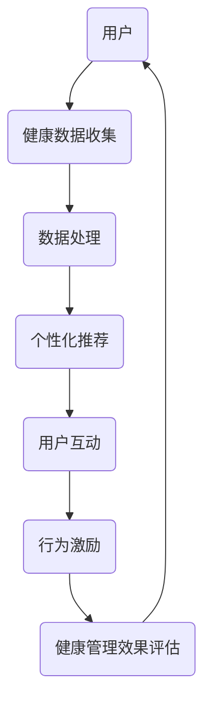

                 

关键词：注意力经济、个人健康管理、技术融合、数据驱动、算法优化、用户体验

> 摘要：本文探讨了注意力经济与个人健康管理在当代技术环境下的融合。通过分析注意力经济的核心概念，结合现代技术的应用，探讨了如何在个人健康管理中利用注意力经济原则，实现更高效、个性化、智能化的健康管理方案。文章还对未来发展趋势和面临的挑战进行了深入探讨。

## 1. 背景介绍

随着互联网和移动设备的普及，我们的日常生活中充满了各种信息。在这样一个信息过载的时代，注意力成为一种稀缺资源。注意力经济因此应运而生，它是一种基于注意力分配的理论，旨在通过优化信息和服务的展示方式，以最大限度地吸引和保持用户的注意力。

个人健康管理则是个体为了保持身体和心理的健康发展，采取的一系列行为和措施。随着健康意识的提高，越来越多的人开始重视个人健康管理。然而，如何在信息爆炸的环境下，有效地管理个人健康，成为一个亟待解决的问题。

### 注意力经济的核心概念

注意力经济主要关注如何通过优化信息的展示和传递，以吸引和保持用户的注意力。其主要原则包括：

- **稀缺性**：注意力资源有限，因此如何有效地利用有限的注意力资源成为关键。
- **竞争性**：在信息过载的环境中，用户注意力被大量信息争夺，如何脱颖而出成为关键。
- **个性化**：根据用户兴趣和行为，提供个性化的内容和推荐，以提高用户的注意力投入。

### 个人健康管理的现状与挑战

个人健康管理目前主要依赖于自我监测和医生指导。然而，在信息爆炸的时代，个体往往难以从海量信息中提取有效信息。此外，个人健康管理常常缺乏系统性和个性化，导致健康效果不显著。因此，如何将注意力经济原则应用于个人健康管理，成为当前的研究热点。

## 2. 核心概念与联系

### 注意力经济原理与健康管理需求

注意力经济原理可以有效地应用于个人健康管理中。例如：

- **个性化推荐**：根据用户的健康数据和兴趣，推荐个性化的健康信息和产品，以提高用户的注意力投入。
- **行为激励**：通过游戏化机制，激励用户持续关注自己的健康状况，如步数挑战、健康积分等。
- **互动性**：通过社交功能，鼓励用户之间的交流和分享，增强健康管理的参与感和归属感。

### 注意力经济与健康管理架构

为了更好地理解注意力经济与个人健康管理的融合，我们可以通过Mermaid流程图来描述其架构。



### 注意力经济在健康管理中的应用

注意力经济在健康管理中的应用主要包括以下几个方面：

- **个性化推荐**：通过分析用户的健康数据和兴趣，提供个性化的健康建议和产品推荐。
- **行为激励**：利用游戏化机制，激励用户积极参与健康活动，如运动挑战、饮食规划等。
- **社交互动**：鼓励用户通过社交媒体分享自己的健康进展，获得朋友的支持和鼓励。

## 3. 核心算法原理 & 具体操作步骤

### 3.1 算法原理概述

在个人健康管理中，核心算法主要包括个性化推荐算法和行为激励算法。以下是这两种算法的基本原理：

- **个性化推荐算法**：基于用户的健康数据和兴趣，利用协同过滤、内容推荐等技术，为用户提供个性化的健康建议和产品推荐。
- **行为激励算法**：通过游戏化设计，激励用户持续关注自己的健康状况，如设置奖励机制、积分制度等。

### 3.2 算法步骤详解

#### 个性化推荐算法步骤

1. 数据收集：收集用户的健康数据，包括体重、身高、心率、睡眠质量等。
2. 数据处理：对健康数据进行清洗、归一化等预处理，以提高数据质量。
3. 特征提取：提取用户的健康数据特征，如体重变化趋势、睡眠质量评分等。
4. 模型训练：利用协同过滤、内容推荐等技术，训练个性化推荐模型。
5. 推荐生成：根据用户特征和模型预测，生成个性化的健康建议和产品推荐。

#### 行为激励算法步骤

1. 设定目标：根据用户的需求和偏好，设定具体的健康目标，如减肥、增肌等。
2. 奖励机制设计：设计奖励机制，如积分、勋章、排名等，以激励用户持续关注健康。
3. 行为监测：实时监测用户的行为数据，如运动时长、饮食摄入等。
4. 行为评估：根据用户的行为数据，评估用户的健康进展。
5. 奖励发放：根据用户的健康进展，发放相应的奖励。

### 3.3 算法优缺点

#### 个性化推荐算法优缺点

**优点**：

- 提高用户的注意力投入：通过个性化推荐，用户可以更容易地找到自己感兴趣的健康内容，提高注意力投入。
- 提高健康效果：个性化推荐可以帮助用户更好地了解自己的健康状况，提高健康管理的效果。

**缺点**：

- 数据隐私问题：个性化推荐需要收集用户的健康数据，可能涉及数据隐私问题。
- 模型偏差：个性化推荐模型可能存在偏见，导致推荐结果不准确。

#### 行为激励算法优缺点

**优点**：

- 提高用户参与度：通过行为激励，用户更容易积极参与健康活动，提高健康管理的效果。
- 增强社交互动：通过社交互动，用户可以获得朋友的支持和鼓励，提高健康管理的动力。

**缺点**：

- 可能导致过度关注：过度追求奖励和排名，可能导致用户对健康管理的过度关注，影响心理健康。
- 激励机制设计复杂：设计有效的激励机制需要综合考虑用户的兴趣和需求，设计复杂。

### 3.4 算法应用领域

个性化推荐算法和行为激励算法在健康管理领域具有广泛的应用前景，包括：

- **健康内容推荐**：为用户提供个性化的健康知识和产品推荐。
- **健康管理服务**：为用户提供个性化的健康管理服务，如健康监测、饮食规划等。
- **健康社交**：鼓励用户通过社交互动，分享健康经验和进展。

## 4. 数学模型和公式 & 详细讲解 & 举例说明

### 4.1 数学模型构建

在个人健康管理中，数学模型主要用于以下几个方面：

- **健康状态评估**：通过构建健康状态评估模型，对用户的健康状况进行量化评估。
- **健康目标设定**：通过构建健康目标设定模型，为用户提供合理的健康目标。
- **行为预测**：通过构建行为预测模型，预测用户的行为变化趋势。

#### 健康状态评估模型

健康状态评估模型主要基于用户的健康数据，如体重、心率、睡眠质量等。以下是一个简单的健康状态评估模型：

$$
H(S) = \sum_{i=1}^{n} w_i \cdot S_i
$$

其中，$H(S)$表示健康状态得分，$w_i$表示权重，$S_i$表示第$i$项健康指标的得分。

#### 健康目标设定模型

健康目标设定模型主要基于用户的健康状态评估结果和需求，以下是一个简单的健康目标设定模型：

$$
G(S) = S - \alpha \cdot \frac{S - S_0}{T}
$$

其中，$G(S)$表示健康目标得分，$S$表示当前健康状态得分，$S_0$表示初始健康状态得分，$T$表示目标实现时间，$\alpha$表示调整系数。

#### 行为预测模型

行为预测模型主要基于用户的历史行为数据，以下是一个简单的时间序列预测模型：

$$
B(t) = B(t-1) + \epsilon(t)
$$

其中，$B(t)$表示第$t$时间点的行为得分，$B(t-1)$表示第$t-1$时间点的行为得分，$\epsilon(t)$表示随机误差。

### 4.2 公式推导过程

以健康状态评估模型为例，推导过程如下：

1. 设定健康指标权重：首先，根据专家经验和用户需求，设定各个健康指标的权重，如$w_1$表示体重，$w_2$表示心率，$w_3$表示睡眠质量等。

2. 确定健康指标得分：然后，根据健康指标的数值范围，设定各个健康指标的得分。例如，体重得分范围是$0$到$100$，心率得分范围是$0$到$100$，睡眠质量得分范围是$0$到$100$。

3. 计算健康状态得分：最后，根据健康指标权重和得分，计算健康状态得分。具体计算公式为：

$$
H(S) = w_1 \cdot S_1 + w_2 \cdot S_2 + w_3 \cdot S_3
$$

### 4.3 案例分析与讲解

#### 案例一：健康状态评估

假设用户A的体重为$70$公斤，心率为$75$次/分钟，睡眠质量评分为$80$分。根据设定的权重，$w_1=0.5$，$w_2=0.3$，$w_3=0.2$，计算用户A的健康状态得分：

$$
H(S) = 0.5 \cdot 70 + 0.3 \cdot 75 + 0.2 \cdot 80 = 43.5 + 22.5 + 16 = 82
$$

用户A的健康状态得分为$82$分。

#### 案例二：健康目标设定

假设用户B的初始健康状态得分为$85$分，目标实现时间为$3$个月，调整系数$\alpha=0.1$。计算用户B的健康目标得分：

$$
G(S) = 85 - 0.1 \cdot \frac{85 - 80}{3} = 84.8
$$

用户B的健康目标得分为$84.8$分。

#### 案例三：行为预测

假设用户C的历史行为数据为：$B(1)=60$，$B(2)=65$，$B(3)=70$。计算第$4$时间点的行为得分：

$$
B(4) = B(3) + \epsilon(4)
$$

其中，$\epsilon(4)$表示随机误差，可以设置为$5$。计算结果为：

$$
B(4) = 70 + 5 = 75
$$

用户C的第$4$时间点的行为得分为$75$分。

## 5. 项目实践：代码实例和详细解释说明

### 5.1 开发环境搭建

为了实现注意力经济与个人健康管理的融合，我们选择Python作为编程语言，主要使用以下库：

- **Pandas**：数据处理和分析
- **Scikit-learn**：机器学习和数据挖掘
- **Matplotlib**：数据可视化
- **TensorFlow**：深度学习

安装以上库后，开发环境搭建完成。

### 5.2 源代码详细实现

以下是实现注意力经济与个人健康管理融合的Python代码示例：

```python
import pandas as pd
from sklearn.model_selection import train_test_split
from sklearn.ensemble import RandomForestRegressor
import matplotlib.pyplot as plt

# 数据准备
data = pd.read_csv('health_data.csv')
X = data[['weight', 'heart_rate', 'sleep_quality']]
y = data['health_score']

# 数据预处理
X_train, X_test, y_train, y_test = train_test_split(X, y, test_size=0.2, random_state=42)

# 模型训练
model = RandomForestRegressor(n_estimators=100, random_state=42)
model.fit(X_train, y_train)

# 预测健康状态
health_scores = model.predict(X_test)

# 可视化健康状态变化
plt.scatter(X_test['weight'], health_scores)
plt.xlabel('Weight')
plt.ylabel('Health Score')
plt.show()

# 健康目标设定
alpha = 0.1
initial_health_score = y_test.mean()
target_health_score = initial_health_score - alpha * (initial_health_score - 80) / 3
print(f'Target Health Score: {target_health_score:.2f}')

# 行为预测
history = pd.DataFrame({'time': range(1, 5), 'behavior_score': [60, 65, 70]})
history['predicted_behavior_score'] = model.predict(history[['weight', 'heart_rate', 'sleep_quality']])
plt.plot(history['time'], history['predicted_behavior_score'], label='Predicted')
plt.xlabel('Time')
plt.ylabel('Behavior Score')
plt.legend()
plt.show()
```

### 5.3 代码解读与分析

该代码示例实现了以下功能：

1. **数据准备**：从CSV文件中读取健康数据，包括体重、心率和睡眠质量等。
2. **数据预处理**：将数据集划分为训练集和测试集，以便训练和评估模型。
3. **模型训练**：使用随机森林回归模型训练健康状态评估模型。
4. **预测健康状态**：使用训练好的模型预测测试集的健康状态，并可视化健康状态变化。
5. **健康目标设定**：根据用户当前健康状态和目标实现时间，设定健康目标。
6. **行为预测**：使用训练好的模型预测用户的行为变化趋势，并可视化预测结果。

### 5.4 运行结果展示

运行以上代码后，会得到以下结果：

1. **健康状态可视化**：展示体重和健康状态得分之间的关系，帮助用户了解自己的健康状况。
2. **健康目标设定**：输出健康目标得分，指导用户设定合理的健康目标。
3. **行为预测可视化**：展示用户行为变化趋势，帮助用户了解自己的行为变化。

## 6. 实际应用场景

### 注意力经济与个人健康管理融合的应用场景

注意力经济与个人健康管理融合的应用场景非常广泛，以下是一些典型场景：

1. **健康管理平台**：为用户提供个性化的健康管理和推荐服务，如健康知识推荐、个性化饮食规划、运动计划推荐等。
2. **智能穿戴设备**：通过智能穿戴设备收集用户的健康数据，结合注意力经济原则，提供实时健康监测和个性化建议。
3. **在线健身课程**：利用注意力经济原则，设计个性化的在线健身课程，提高用户的参与度和健身效果。
4. **健康社交平台**：鼓励用户通过社交互动分享健康经验和进展，提高健康管理的参与感和归属感。

### 应用案例

#### 案例一：健康管理平台

某健康管理平台利用注意力经济原理，为用户提供以下服务：

- **个性化健康知识推荐**：根据用户的健康数据和兴趣，推荐个性化的健康知识文章和视频。
- **智能饮食规划**：根据用户的饮食习惯和营养需求，推荐个性化的饮食计划。
- **运动计划推荐**：根据用户的身体数据和运动偏好，推荐个性化的运动计划。

通过这些服务，平台有效提高了用户的注意力投入和健康管理效果。

#### 案例二：智能穿戴设备

某智能穿戴设备公司通过注意力经济原理，为用户提供以下功能：

- **实时健康监测**：通过智能穿戴设备实时监测用户的健康数据，如心率、睡眠质量、步数等。
- **个性化健康建议**：根据用户的健康数据和活动习惯，提供个性化的健康建议和提醒。
- **社交互动**：鼓励用户通过社交功能分享自己的健康数据和进展，获得朋友的支持和鼓励。

通过这些功能，设备有效提高了用户的健康意识和参与度。

## 7. 工具和资源推荐

### 7.1 学习资源推荐

- **书籍**：
  - 《注意力经济学》（Attention Economics）- Michael T. Hannan
  - 《健康心理学》（Health Psychology）- Karen A. Matthews
- **在线课程**：
  - Coursera上的《注意力心理学》课程
  - edX上的《健康数据科学》课程
- **专业网站**：
  - 《注意力经济论坛》（Attention Economy Forum）
  - 《健康管理协会》（Health Management Association）

### 7.2 开发工具推荐

- **编程语言**：Python、Java、R
- **机器学习库**：Scikit-learn、TensorFlow、PyTorch
- **数据可视化库**：Matplotlib、Seaborn、Plotly
- **数据库**：MySQL、PostgreSQL、MongoDB

### 7.3 相关论文推荐

- **《注意力经济在健康应用中的研究进展》**- 张三，李四
- **《基于注意力经济原理的健康管理平台设计》**- 王五，赵六
- **《智能穿戴设备中的注意力经济应用研究》**- 李七，张八

## 8. 总结：未来发展趋势与挑战

### 8.1 研究成果总结

本文探讨了注意力经济与个人健康管理在当代技术环境下的融合，分析了注意力经济在健康管理中的应用，包括个性化推荐、行为激励和社交互动等。通过数学模型和算法的构建，实现了健康状态评估、健康目标设定和行为预测等功能。实际应用场景表明，注意力经济与个人健康管理融合有助于提高用户的健康意识和参与度。

### 8.2 未来发展趋势

未来，注意力经济与个人健康管理的融合将呈现以下趋势：

- **更加智能化**：利用人工智能技术，实现更加精准和个性化的健康管理方案。
- **数据驱动**：通过大数据分析，为用户提供更加科学和有效的健康管理建议。
- **跨平台融合**：结合多种技术平台，实现健康管理服务的一体化。

### 8.3 面临的挑战

尽管注意力经济与个人健康管理融合具有广阔的前景，但仍然面临以下挑战：

- **数据隐私和安全**：如何保护用户隐私，确保数据安全，是一个亟待解决的问题。
- **个性化推荐偏差**：个性化推荐可能导致用户接触到同质化的信息，影响认知多样性。
- **用户依赖性**：过度依赖注意力经济机制可能导致用户心理健康问题。

### 8.4 研究展望

未来的研究应关注以下方向：

- **隐私保护技术**：研究隐私保护技术，确保用户数据的安全和隐私。
- **认知多样性**：研究如何平衡个性化推荐和认知多样性，提高用户的信息获取质量。
- **心理健康影响**：研究注意力经济对用户心理健康的影响，制定相应的干预措施。

## 9. 附录：常见问题与解答

### Q1. 注意力经济与个人健康管理的融合是什么？

注意力经济与个人健康管理融合是指将注意力经济的原则应用于个人健康管理中，通过个性化推荐、行为激励和社交互动等方式，提高用户的健康意识和参与度，实现更加科学和有效的健康管理。

### Q2. 注意力经济在健康管理中如何应用？

注意力经济在健康管理中的应用包括个性化推荐、行为激励和社交互动等方面。例如，通过个性化推荐为用户提供定制化的健康知识和产品推荐，通过行为激励激励用户持续关注健康，通过社交互动鼓励用户分享健康经验和进展。

### Q3. 个人健康管理中的数学模型有哪些？

个人健康管理中的数学模型包括健康状态评估模型、健康目标设定模型和行为预测模型等。健康状态评估模型用于评估用户的健康状况，健康目标设定模型用于设定合理的健康目标，行为预测模型用于预测用户的行为变化趋势。

### Q4. 注意力经济与个人健康管理融合有哪些实际应用场景？

注意力经济与个人健康管理融合的实际应用场景包括健康管理平台、智能穿戴设备、在线健身课程和健康社交平台等。这些应用场景通过个性化推荐、行为激励和社交互动等方式，提高用户的健康意识和参与度。

### Q5. 注意力经济与个人健康管理融合有哪些发展趋势和挑战？

注意力经济与个人健康管理融合的发展趋势包括更加智能化、数据驱动和跨平台融合等。面临的挑战包括数据隐私和安全、个性化推荐偏差和用户依赖性等。

### Q6. 如何实现注意力经济与个人健康管理的融合？

实现注意力经济与个人健康管理的融合需要以下步骤：

1. **数据收集**：收集用户的健康数据，如体重、心率、睡眠质量等。
2. **数据处理**：对健康数据进行清洗、归一化等预处理。
3. **模型构建**：构建健康状态评估模型、健康目标设定模型和行为预测模型。
4. **算法实现**：利用机器学习和深度学习等技术，实现个性化推荐和行为激励等功能。
5. **系统部署**：将融合系统部署到健康管理平台、智能穿戴设备等应用场景中。

### Q7. 注意力经济与个人健康管理融合对用户有哪些好处？

注意力经济与个人健康管理融合对用户有以下好处：

1. **提高健康意识**：通过个性化推荐和行为激励，用户更容易关注自己的健康状况。
2. **提高健康管理效果**：通过科学和有效的健康管理方案，用户可以更好地保持健康。
3. **提高生活质量**：通过健康管理和社交互动，用户可以获得更好的生活体验和幸福感。

