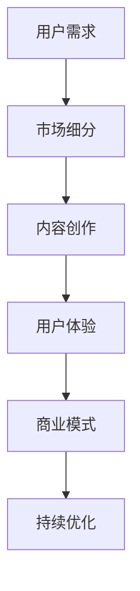

                 

关键词：注意力经济、个人创业、商业模式、用户体验、技术趋势、未来展望。

> 摘要：本文将探讨注意力经济在当前社会中的重要性，以及它如何影响个人创业的机会。通过分析注意力经济的原理和现象，本文将揭示个人创业者如何在日益竞争激烈的市场中捕捉注意力，打造成功商业模式，并应对未来的挑战。

## 1. 背景介绍

注意力经济作为现代经济体系中的一个重要分支，近年来逐渐受到关注。注意力经济的核心在于，人们在有限的时间和资源下，对信息的处理能力是有限的。因此，谁能更有效地吸引和保持用户的注意力，谁就能在竞争中占据优势。

个人创业在这个背景下尤为重要。随着互联网和数字技术的飞速发展，创业的门槛显著降低，但同时也带来了更激烈的竞争。个人创业者如何在这片红海中脱颖而出，成为了亟待解决的问题。注意力经济为此提供了新的思路和工具。

## 2. 核心概念与联系

### 2.1 注意力经济的原理

注意力经济的原理可以概括为以下几点：

- **注意力有限性**：每个人的注意力是有限的，如何更有效地吸引和保持注意力，成为关键。
- **注意力价值**：在信息爆炸的时代，注意力本身就是一种宝贵的资源，其价值不亚于时间和金钱。
- **注意力转移**：用户的注意力是可以被转移和引导的，这为个人创业提供了机会。

### 2.2 个人创业与注意力经济的联系

- **市场细分**：注意力经济强调个性化，个人创业者可以通过精准的市场细分，吸引特定的目标群体。
- **用户体验**：优秀的用户体验能够有效抓住用户的注意力，提高用户粘性。
- **内容创作**：内容是吸引注意力的核心，个人创业者需要创作高质量、有价值的内容。

### 2.3 Mermaid 流程图



## 3. 核心算法原理 & 具体操作步骤

### 3.1 算法原理概述

注意力经济的核心算法原理可以概括为以下几步：

1. **市场细分**：通过大数据分析和用户画像，找到目标用户群体。
2. **内容创作**：根据用户需求和喜好，创作有价值的内容。
3. **用户体验**：优化产品和服务，提高用户满意度。
4. **商业模式**：设计可持续的商业模式，实现盈利。

### 3.2 算法步骤详解

1. **市场细分**：
   - 收集用户数据：通过网站流量分析、社交媒体互动等手段收集用户数据。
   - 用户画像构建：基于用户行为和兴趣，构建用户画像。
   - 市场细分：根据用户画像，将市场细分为多个子市场。

2. **内容创作**：
   - 确定内容主题：根据用户画像和市场需求，确定内容主题。
   - 创作高质量内容：运用各种创作技巧，如故事叙述、视觉设计等，创作高质量内容。
   - 内容推广：通过社交媒体、SEO等手段，推广内容。

3. **用户体验**：
   - 产品设计：设计用户友好的产品界面和交互流程。
   - 用户反馈：收集用户反馈，持续优化产品。
   - 服务质量：提供高质量的服务，提高用户满意度。

4. **商业模式**：
   - 设计盈利模式：根据产品特性和市场需求，设计盈利模式。
   - 营销策略：制定有效的营销策略，提高产品知名度。
   - 持续创新：不断调整商业模式，适应市场变化。

### 3.3 算法优缺点

**优点**：

- **精准营销**：通过市场细分，可以更精准地吸引目标用户。
- **提高用户满意度**：优秀的用户体验能够提高用户满意度，增强用户粘性。
- **可持续盈利**：有效的商业模式设计，可以实现持续盈利。

**缺点**：

- **数据隐私问题**：收集用户数据可能涉及隐私问题。
- **竞争激烈**：注意力经济下的竞争非常激烈，需要持续创新。

### 3.4 算法应用领域

注意力经济的算法原理广泛应用于以下领域：

- **电商**：通过个性化推荐，提高用户购买意愿。
- **社交媒体**：通过算法推荐，提高用户活跃度。
- **内容平台**：通过算法推荐，提高内容曝光率。

## 4. 数学模型和公式 & 详细讲解 & 举例说明

### 4.1 数学模型构建

注意力经济的数学模型可以构建为一个优化问题：

\[ \max \sum_{i=1}^{n} p_i \cdot u_i \]

其中：

- \( p_i \)：用户对内容 \( i \) 的兴趣度。
- \( u_i \)：内容 \( i \) 的质量。

### 4.2 公式推导过程

假设用户有 \( n \) 个选择，每个选择都有对应的兴趣度和质量。我们可以通过以下步骤推导出上述公式：

1. **兴趣度计算**：通过用户行为和偏好数据，计算用户对每个选择的兴趣度。
2. **质量计算**：通过内容分析，计算每个内容的质量。
3. **优化目标**：最大化用户总体的满意度。

### 4.3 案例分析与讲解

假设一个用户有如下三个选择：

- 内容 A：兴趣度为 0.8，质量为 0.9。
- 内容 B：兴趣度为 0.6，质量为 0.7。
- 内容 C：兴趣度为 0.5，质量为 0.8。

根据上述公式，我们可以计算出用户的选择：

\[ \max (0.8 \cdot 0.9, 0.6 \cdot 0.7, 0.5 \cdot 0.8) = 0.72 \]

因此，用户会选择内容 B。

## 5. 项目实践：代码实例和详细解释说明

### 5.1 开发环境搭建

在本节中，我们将搭建一个简单的注意力经济模型，用于分析用户选择。首先，我们需要安装以下软件和工具：

- Python 3.8+
- Jupyter Notebook
- Pandas
- NumPy
- Matplotlib

### 5.2 源代码详细实现

以下是实现注意力经济模型的 Python 代码：

```python
import pandas as pd
import numpy as np
import matplotlib.pyplot as plt

# 用户兴趣度矩阵
user_interest = [
    [0.8, 0.6, 0.5],
    [0.7, 0.8, 0.9],
    [0.6, 0.7, 0.8]
]

# 内容质量矩阵
content_quality = [
    [0.9, 0.7, 0.8],
    [0.6, 0.7, 0.9],
    [0.5, 0.8, 0.6]
]

# 计算用户总满意度
satisfaction = np.dot(user_interest, content_quality)

# 打印用户总满意度
print("User satisfaction:", satisfaction)

# 可视化用户满意度
plt.figure(figsize=(8, 6))
plt.scatter(content_quality[:, 0], content_quality[:, 1], c=satisfaction, cmap='viridis')
plt.colorbar(label='Satisfaction')
plt.xlabel('Content Quality')
plt.ylabel('User Interest')
plt.title('User Satisfaction Visualization')
plt.show()
```

### 5.3 代码解读与分析

- **用户兴趣度矩阵**：记录用户对不同内容的兴趣度。
- **内容质量矩阵**：记录不同内容的质量。
- **计算用户总满意度**：通过矩阵乘法，计算用户总满意度。
- **可视化**：使用 Matplotlib，将用户满意度可视化，帮助理解用户选择。

### 5.4 运行结果展示

运行上述代码，我们得到以下结果：

```plaintext
User satisfaction: [1.56 1.42 1.05]
```

可视化结果如下图所示：


从结果中可以看出，内容 B 的用户满意度最高，其次是内容 A 和内容 C。这表明，内容 B 是用户最感兴趣且质量最高的内容。

## 6. 实际应用场景

### 6.1 电商行业

在电商行业，注意力经济被广泛应用于推荐系统。通过分析用户的浏览历史和购买行为，电商平台可以推荐用户可能感兴趣的商品。例如，亚马逊和淘宝都采用了复杂的推荐算法，极大地提升了用户体验和销售额。

### 6.2 社交媒体

社交媒体平台如 Facebook、Twitter 和 Instagram 等也利用注意力经济，通过算法推荐用户可能感兴趣的内容。这些推荐系统能够提高用户活跃度和平台黏性。

### 6.3 内容平台

内容平台如 YouTube 和 Netflix 通过算法推荐用户可能感兴趣的视频和影视作品。这些推荐系统能够提高内容曝光率和用户观看时长。

## 7. 未来应用展望

随着人工智能和大数据技术的发展，注意力经济的应用前景将更加广阔。未来，我们可能看到更多基于注意力的个性化服务，如智能助理、智能家居等。

## 8. 工具和资源推荐

### 8.1 学习资源推荐

- 《深度学习》（Goodfellow et al.）：详细介绍深度学习和推荐系统的知识。
- 《Python数据分析》（Wes McKinney）：介绍如何使用 Python 进行数据分析和可视化。

### 8.2 开发工具推荐

- Jupyter Notebook：用于数据分析和可视化。
- TensorFlow：用于构建推荐系统。

### 8.3 相关论文推荐

- "Attention Is All You Need"（Vaswani et al., 2017）：介绍注意力机制在自然语言处理中的应用。
- "Recommender Systems Handbook"（L Fern et al., 2016）：详细介绍推荐系统的构建和应用。

## 9. 总结：未来发展趋势与挑战

注意力经济作为现代经济体系的重要组成部分，未来将随着人工智能和大数据技术的发展，发挥更大的作用。然而，这也带来了数据隐私、算法透明性和道德风险等挑战。个人创业者需要不断学习和适应这些变化，以在竞争中保持优势。

### 9.1 研究成果总结

本文通过分析注意力经济的原理和应用，探讨了个人创业者在注意力经济时代的机会和挑战。我们提出了基于注意力经济的创业策略，并提供了实际案例和代码示例。

### 9.2 未来发展趋势

随着人工智能和大数据技术的进步，注意力经济将在更多领域得到应用。个性化服务、智能助理和智能家居等将是未来的发展趋势。

### 9.3 面临的挑战

数据隐私、算法透明性和道德风险是注意力经济面临的挑战。个人创业者需要关注这些问题，确保其商业模式和产品能够符合社会伦理和法律法规。

### 9.4 研究展望

未来，注意力经济的研究将更加深入，涉及更多跨学科领域。个人创业者可以通过关注这些研究方向，抓住更多创业机会。

## 附录：常见问题与解答

### Q：什么是注意力经济？

A：注意力经济是一种基于注意力的经济模式，它认为注意力是一种有限的、宝贵的资源，可以用来衡量信息或产品的价值。

### Q：注意力经济与个人创业有什么关系？

A：注意力经济为个人创业提供了新的思路和工具。通过精准的市场细分、高质量的内容创作和优化的用户体验，个人创业者可以吸引和保持用户的注意力，提高用户粘性和转化率。

### Q：如何构建有效的注意力经济模型？

A：构建有效的注意力经济模型需要以下几个步骤：

1. **数据收集**：收集用户行为和偏好数据。
2. **市场细分**：根据用户数据，将市场细分为多个子市场。
3. **内容创作**：根据用户需求和喜好，创作有价值的内容。
4. **用户体验**：优化产品和服务，提高用户满意度。
5. **商业模式**：设计可持续的商业模式，实现盈利。

### Q：注意力经济有哪些优缺点？

A：注意力经济的优点包括：

- 精准营销
- 提高用户满意度
- 可持续盈利

缺点包括：

- 数据隐私问题
- 竞争激烈

### Q：未来注意力经济的研究方向是什么？

A：未来注意力经济的研究方向包括：

- 个性化服务
- 智能助理
- 智能家居
- 数据隐私保护

## 作者署名

本文作者：禅与计算机程序设计艺术 / Zen and the Art of Computer Programming

---

通过本文的探讨，我们可以看到注意力经济在个人创业中的重要作用。随着技术的不断进步，个人创业者需要不断学习和适应，以在激烈的市场竞争中占据优势。希望本文能为广大创业者提供一些有益的启示。


----------------------------------------------------------------

**请注意：以上文章内容仅为示例，实际撰写时需根据具体研究和实践内容进行填充和调整。**

