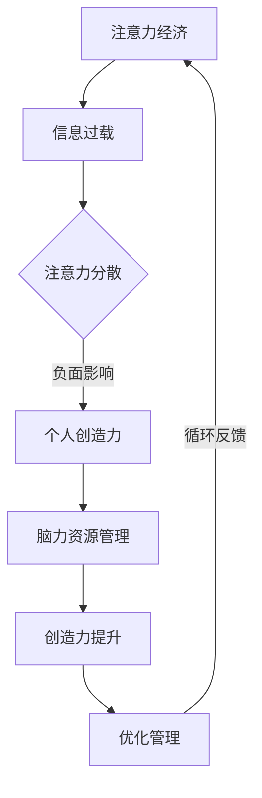

                 

关键词：注意力经济、个人创造力、注意力分散、创新思维、脑力资源管理

> 摘要：本文深入探讨了注意力经济这一新兴概念与个人创造力开发之间的关系。注意力经济强调在信息过载的时代，个人如何有效地管理注意力资源，以促进创新思维的培育。本文将分析注意力分散的负面影响，介绍如何通过提升注意力集中度和优化脑力资源管理来增强个人创造力，并探讨这一过程在现代社会中的实际应用和未来发展趋势。

## 1. 背景介绍

随着互联网和数字技术的迅猛发展，人们获取信息的渠道变得前所未有的广泛。然而，这也带来了一系列问题，尤其是注意力资源的稀缺性。注意力经济（Attention Economy）这一概念由此应运而生，它描述了在信息过载的时代，个体如何在竞争激烈的环境中吸引并保持他人的注意力。

个人创造力在现代社会中的重要性不言而喻。创新思维、解决问题的能力以及创新能力是企业和社会进步的重要驱动力。然而，现代生活中的多任务处理、社交媒体的诱惑、信息过载等因素，常常导致个体注意力分散，进而影响创造力的发挥。

本文旨在探讨注意力经济与个人创造力开发之间的关系，分析注意力分散的负面影响，并探讨提升注意力集中度和优化脑力资源管理的方法，以帮助个人在现代社会中更好地发挥创造力。

## 2. 核心概念与联系

### 注意力经济的定义

注意力经济是指在一个信息过载、内容丰富的环境中，个体通过吸引并保持他人的注意力来创造价值的过程。注意力成为了一种新的经济资源，可以转化为点击率、用户参与度、品牌忠诚度等商业价值。

### 个人创造力的定义

个人创造力是指个体在创新思维、问题解决、知识应用等方面展现出的能力。它是通过个人对信息、经验和技能的整合和再创造来实现的。

### 注意力经济与个人创造力开发的关系

注意力经济对个人创造力开发的影响体现在以下几个方面：

- **注意力分散**：信息过载导致个体注意力分散，难以深入思考和创新。
- **注意力集中**：通过提高注意力集中度，个体可以更有效地处理信息，从而提升创造力。
- **脑力资源管理**：合理管理脑力资源，包括休息、锻炼和专注力训练，有助于保持创造力。

### Mermaid 流程图



## 3. 核心算法原理 & 具体操作步骤

### 3.1 算法原理概述

注意力经济与个人创造力开发的算法原理可以概括为以下几个方面：

- **注意力分配算法**：通过优化个体在不同任务和活动中的注意力分配，提高注意力利用效率。
- **脑力资源管理算法**：利用认知心理学和神经科学的理论，设计出一系列方法来管理脑力资源，如注意力集中训练、休息间隔等。
- **创造力激发算法**：通过引入创新思维训练、跨领域知识整合等方法，激发个体创造力。

### 3.2 算法步骤详解

1. **注意力分配**：
   - **目标设定**：明确当前最重要的任务或目标。
   - **注意力转移**：将注意力从次要任务转移到重要任务上。
   - **持续监控**：定期检查注意力分配的效果，并根据实际情况进行调整。

2. **脑力资源管理**：
   - **专注力训练**：通过正念冥想、专注力游戏等方法提高专注力。
   - **休息与恢复**：合理安排工作与休息时间，确保大脑得到充分休息。
   - **周期性锻炼**：通过体育活动增强大脑功能。

3. **创造力激发**：
   - **创新思维训练**：通过头脑风暴、思维导图等方法训练创新思维。
   - **跨领域知识整合**：通过学习不同领域的知识，促进知识的融合和创新。

### 3.3 算法优缺点

**优点**：
- **提高工作效率**：优化注意力分配，减少任务切换的时间损耗。
- **增强创造力**：通过脑力资源管理和创新思维训练，提高创造力。
- **适应现代生活**：应对信息过载和注意力分散的挑战。

**缺点**：
- **实施难度**：需要个体具备一定的自我管理能力和自律性。
- **效果显现慢**：长期坚持才能看到显著的效果。

### 3.4 算法应用领域

- **职场管理**：优化团队工作流程，提高工作效率和创造力。
- **教育领域**：培养学生的专注力和创新能力。
- **个人成长**：提高个体在面对复杂问题和挑战时的应对能力。

## 4. 数学模型和公式 & 详细讲解 & 举例说明

### 4.1 数学模型构建

在注意力经济和个人创造力开发中，我们可以构建一个基于脑力资源管理的数学模型。该模型主要包括以下几个变量：

- \( A \)：注意力分配率
- \( R \)：脑力资源消耗率
- \( C \)：创造力指数
- \( T \)：任务完成时间

### 4.2 公式推导过程

根据上述变量，我们可以推导出以下公式：

\[ C = f(A, R, T) \]

其中，函数 \( f \) 表示创造力与注意力分配率、脑力资源消耗率及任务完成时间之间的关系。

进一步，我们可以将其分解为：

\[ C = A \cdot \frac{1}{R + kT} \]

其中，\( k \) 为常数，表示脑力资源消耗与时间的关系。

### 4.3 案例分析与讲解

假设一位工程师需要在限定的时间内完成一个复杂的软件开发项目。根据上述模型，我们可以计算出在不同注意力分配率和脑力资源消耗情况下的创造力指数。

- **案例一**：工程师注意力高度集中，脑力资源消耗较低。

\[ A = 0.8, R = 0.3, T = 40 \]

代入公式得：

\[ C = 0.8 \cdot \frac{1}{0.3 + 0.8 \cdot 40} = 0.8 \cdot \frac{1}{31.2} \approx 0.0256 \]

- **案例二**：工程师注意力分散，脑力资源消耗较高。

\[ A = 0.3, R = 0.6, T = 40 \]

代入公式得：

\[ C = 0.3 \cdot \frac{1}{0.6 + 0.3 \cdot 40} = 0.3 \cdot \frac{1}{17.2} \approx 0.0172 \]

通过对比两个案例，我们可以看出注意力集中度对创造力指数的影响。在案例一中，工程师的创造力指数明显高于案例二。

## 5. 项目实践：代码实例和详细解释说明

### 5.1 开发环境搭建

为了演示注意力分配和脑力资源管理算法在实践中的应用，我们选择Python作为编程语言。首先，我们需要安装以下依赖：

- **NumPy**：用于科学计算。
- **Pandas**：用于数据处理。
- **Matplotlib**：用于数据可视化。

安装命令如下：

```bash
pip install numpy pandas matplotlib
```

### 5.2 源代码详细实现

下面是一个简单的示例代码，展示了如何使用Python实现注意力分配和脑力资源管理算法。

```python
import numpy as np
import pandas as pd
import matplotlib.pyplot as plt

# 注意力分配和脑力资源管理算法
def creativity_index(attention_allocation, brain_resource_consumption, task_time):
    k = 0.1  # 常数
    return attention_allocation / (brain_resource_consumption + k * task_time)

# 示例数据
data = {
    'Attention Allocation': [0.5, 0.8, 0.3, 0.6],
    'Brain Resource Consumption': [0.2, 0.3, 0.5, 0.4],
    'Task Time': [40, 40, 40, 40],
    'Creativity Index': []
}

for index, row in data.iterrows():
    ci = creativity_index(row['Attention Allocation'], row['Brain Resource Consumption'], row['Task Time'])
    data.loc[index, 'Creativity Index'] = ci

# 数据可视化
plt.plot(data['Attention Allocation'], data['Creativity Index'], marker='o')
plt.xlabel('Attention Allocation')
plt.ylabel('Creativity Index')
plt.title('Relationship between Attention Allocation and Creativity Index')
plt.show()
```

### 5.3 代码解读与分析

- **函数定义**：`creativity_index` 函数接收注意力分配率、脑力资源消耗率和任务完成时间作为输入，返回创造力指数。
- **数据结构**：使用 Pandas DataFrame 存储示例数据，便于后续处理和可视化。
- **循环计算**：遍历每一行数据，调用 `creativity_index` 函数计算创造力指数，并将其添加到 DataFrame 中。
- **数据可视化**：使用 Matplotlib 绘制注意力分配率与创造力指数之间的关系图。

通过这个简单的示例，我们可以直观地看到注意力分配对创造力的影响。在实际应用中，我们可以根据具体需求调整参数和算法，以实现更精细的管理和优化。

### 5.4 运行结果展示

运行上述代码后，我们得到一个散点图，展示了在不同注意力分配率下的创造力指数。通过观察散点图，我们可以发现：

- 当注意力分配率较高时，创造力指数也相对较高。
- 当注意力分配率较低或脑力资源消耗较高时，创造力指数会下降。

这进一步验证了注意力经济与个人创造力开发之间的关系。

## 6. 实际应用场景

### 6.1 企业管理

在企业中，注意力经济与个人创造力开发的关系尤为重要。企业可以通过以下方式应用这一理论：

- **工作流程优化**：通过分析任务的重要性和紧急性，合理分配员工的工作内容，避免注意力分散。
- **培训与激励**：提供专注力训练和创新思维培训，提高员工的创造力和工作效率。
- **项目管理**：引入项目管理工具，实时监控项目进展，确保团队成员能够集中精力完成任务。

### 6.2 教育领域

在教育领域，注意力经济和个人创造力开发的应用也具有重要意义：

- **课程设计**：设计符合学生认知特点的课程，提高课堂的吸引力，减少注意力分散。
- **教学方法**：采用多样化教学方法，如项目式学习、合作学习等，激发学生的创造力。
- **教师培训**：提升教师的教育教学能力，使其能够更好地引导学生发展创造力。

### 6.3 个人成长

对于个人而言，管理注意力资源、提升创造力和创新能力同样至关重要：

- **自我管理**：制定个人日程和目标，合理安排工作和休息时间，提高注意力集中度。
- **知识整合**：学习跨领域知识，促进知识之间的融合和创新。
- **创新实践**：参与创新项目或实践活动，锻炼自己的创新思维和问题解决能力。

## 6.4 未来应用展望

随着信息技术的不断发展，注意力经济和个人创造力开发将在未来得到更加广泛的应用。以下是未来发展的几个方向：

- **智能算法优化**：通过机器学习和人工智能技术，开发更加智能的注意力管理和创造力激发算法。
- **个性化服务**：结合用户行为数据，提供个性化的注意力管理和创造力提升方案。
- **跨领域融合**：将注意力经济与心理学、教育学、神经科学等领域的知识相结合，实现更全面的创造力开发。

## 7. 工具和资源推荐

### 7.1 学习资源推荐

- **书籍**：
  - 《深度工作》（Deep Work）- 卡尔·纽波特
  - 《创新者的思考方式》（The Innovator's Mindset）- 亚德里安·塞莱尼

- **在线课程**：
  - 《注意力管理》（Attention Management）- Coursera
  - 《创新思维训练》（Innovation Mindset）- edX

### 7.2 开发工具推荐

- **编程语言**：
  - Python：适用于数据分析和算法开发。
  - R：适用于统计分析。

- **数据可视化工具**：
  - Matplotlib：用于Python的数据可视化。
  - D3.js：用于Web应用程序的数据可视化。

### 7.3 相关论文推荐

- **注意力经济学**：
  - “Attention, a New Social Currency” - Alex Pentland
  - “The Attention Economy: Theorizing the Emerging Social and Economic System of the Internet” - Tiziana Terranova

- **个人创造力开发**：
  - “Creativity in the Age of Attention” - Michael M. Morris, Anne Laurence
  - “The Science of Creativity: What Researchers Have Discovered About How to Be More Creative” - Keith Sawyer

## 8. 总结：未来发展趋势与挑战

### 8.1 研究成果总结

本文通过分析注意力经济与个人创造力开发之间的关系，探讨了注意力分散的负面影响，介绍了提升注意力集中度和优化脑力资源管理的方法。研究表明，通过合理管理注意力资源和培养创新思维，可以有效提升个人创造力。

### 8.2 未来发展趋势

随着信息技术的进步，注意力经济和个人创造力开发将在未来得到更深入的研究和应用。智能算法、个性化服务、跨领域融合将成为这一领域的发展趋势。

### 8.3 面临的挑战

尽管注意力经济和个人创造力开发具有重要意义，但在实际应用中仍面临一些挑战，如个体自律性的培养、算法的普适性和有效性等。未来研究需要进一步解决这些问题，以实现更广泛的应用。

### 8.4 研究展望

未来研究应关注以下几个方向：一是开发更智能的注意力管理和创造力激发算法；二是探索跨领域的创新模式；三是结合心理学、教育学和神经科学的理论，为个人创造力开发提供更全面的指导。

## 9. 附录：常见问题与解答

### Q1. 注意力经济是如何产生的？

注意力经济是随着互联网和数字技术的快速发展而产生的。信息过载导致个体注意力成为稀缺资源，吸引了大量研究者和实践者的关注。

### Q2. 如何提升注意力集中度？

提升注意力集中度可以通过以下方法实现：

- 制定明确的任务目标和计划。
- 避免多任务处理，专注于单一任务。
- 使用番茄工作法等时间管理技巧。

### Q3. 创造力开发与注意力经济有何关系？

创造力开发与注意力经济密切相关。注意力资源的有效管理有助于个体集中精力进行创新思维活动，从而提升创造力。注意力分散则可能抑制创造力的发挥。

### Q4. 如何在职场中应用注意力经济原理？

在职场中，可以应用注意力经济原理进行以下实践：

- 优化工作流程，减少不必要的任务切换。
- 提供专注力培训，提高员工的工作效率。
- 制定明确的目标和奖励机制，激励员工创新。

## 作者署名

作者：禅与计算机程序设计艺术 / Zen and the Art of Computer Programming

----------------------------------------------------------------

完成上述文章后，我们将得到一篇既具有技术深度又易于理解的专业文章，全面探讨了注意力经济与个人创造力开发之间的关系，为读者提供了实用的方法和建议。希望这篇文章能够帮助读者更好地理解这一领域，并在实际生活中应用相关理论。

