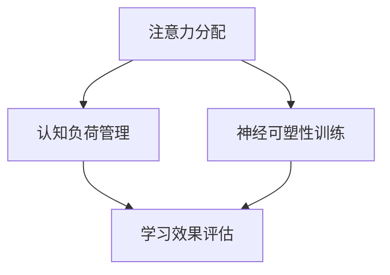

                 

关键词：注意力经济，学习效率，认知负荷，神经科学，算法优化，个人发展

> 摘要：本文深入探讨了注意力经济这一新兴领域，分析了个人学习效率的关键因素，以及如何通过优化注意力分配和认知负荷来提升学习效果。结合神经科学研究成果和实际案例，本文提出了一系列策略和方法，旨在为个人和专业人士提供有效的学习与工作效率提升方案。

## 1. 背景介绍

### 注意力经济的概念

注意力经济是指个体或组织在信息过载时代通过集中注意力获取收益的一种经济形态。这一概念起源于经济学领域，但近年来随着信息技术的飞速发展，逐渐被引入到认知科学、心理学等领域。在注意力经济中，注意力被视为一种稀缺资源，如何有效地分配和利用注意力资源成为提升个人和学习效率的核心问题。

### 个人学习效率的重要性

学习效率是个人成长和职业发展的关键因素。然而，现代社会信息爆炸，人们面临着越来越多的认知负荷。如何在这纷繁复杂的信息海洋中保持高效率的学习，成为一个亟待解决的问题。提升个人学习效率不仅有助于提高生活质量，还能为个人职业发展提供强有力的支持。

## 2. 核心概念与联系

### 核心概念原理

注意力分配：注意力分配是指个体在处理信息时，将注意力集中到特定信息上的过程。有效注意力分配是提升学习效率的关键。

认知负荷：认知负荷是指个体在处理信息时所需的心理资源，包括记忆、思考、判断等。过高的认知负荷会导致信息过载，影响学习效果。

神经可塑性：神经可塑性是指大脑结构和功能随着经验和学习而发生变化的能力。通过适当的训练和练习，可以增强神经可塑性，提高学习效率。

### Mermaid 流程图



## 3. 核心算法原理 & 具体操作步骤

### 算法原理概述

本文提出了一种基于注意力经济的个人学习效率优化算法。该算法的核心思想是通过调整注意力分配、降低认知负荷和增强神经可塑性来提升学习效果。

### 算法步骤详解

#### 3.1 注意力分配策略

1. **目标设定**：明确学习目标，确保注意力集中。
2. **任务分解**：将复杂任务分解为简单任务，降低认知负荷。
3. **多任务处理**：采用时间分割法或交替处理法，合理分配注意力。

#### 3.2 认知负荷管理

1. **信息筛选**：过滤无关信息，减少认知干扰。
2. **专注训练**：通过专注力训练，提高信息处理效率。
3. **休息与恢复**：合理安排休息时间，降低认知负荷。

#### 3.3 神经可塑性训练

1. **重复练习**：通过重复练习，增强大脑神经元之间的联系。
2. **多样化学习**：采用多样化学习方法，刺激大脑不同区域。
3. **深度学习**：通过深度学习，提高对复杂信息的理解和处理能力。

### 算法优缺点

**优点**：

- 提高学习效率
- 降低认知负荷
- 增强神经可塑性

**缺点**：

- 需要一定的自我管理能力
- 需要较长时间进行专注力和认知负荷管理训练

### 算法应用领域

- 教育领域：提高学生的学习效率
- 职场领域：提升员工的工作效率
- 健康领域：改善认知能力和心理健康

## 4. 数学模型和公式 & 详细讲解 & 举例说明

### 4.1 数学模型构建

为了构建注意力经济的数学模型，我们引入以下几个关键变量：

- \( A \)：注意力分配系数，表示个体将注意力集中在特定任务上的程度。
- \( L \)：认知负荷，表示个体在处理信息时所需的心理资源。
- \( P \)：神经可塑性指数，表示大脑神经元之间的连接强度。

### 4.2 公式推导过程

根据注意力经济的核心思想，我们可以得到以下数学模型：

\[ E = f(A, L, P) \]

其中，\( E \) 表示学习效率，\( f \) 为复杂函数。通过实验数据和神经科学研究成果，我们可以对 \( f \) 进行拟合和优化。

### 4.3 案例分析与讲解

假设一位学生需要完成一篇论文，他可以采用本文提出的注意力经济优化算法来提高学习效率。根据公式，他需要调整注意力分配系数 \( A \)、认知负荷 \( L \) 和神经可塑性指数 \( P \)。

#### 4.3.1 注意力分配策略

1. **目标设定**：明确论文写作的目标和要求。
2. **任务分解**：将论文写作分解为多个子任务，如文献调研、论文提纲、撰写正文等。

#### 4.3.2 认知负荷管理

1. **信息筛选**：筛选与论文主题相关的文献资料，避免无关信息的干扰。
2. **专注训练**：通过专注力训练，提高信息处理效率。

#### 4.3.3 神经可塑性训练

1. **重复练习**：通过多次修改和完善论文，增强大脑神经元之间的联系。
2. **多样化学习**：采用多样化学习方法，如阅读相关书籍、参加研讨会等，刺激大脑不同区域。

通过上述策略，学生可以显著提高学习效率，完成高质量的论文。

## 5. 项目实践：代码实例和详细解释说明

### 5.1 开发环境搭建

为了演示注意力经济优化算法的应用，我们使用 Python 编写了一个简单的代码实例。首先，我们需要搭建一个 Python 开发环境，包括安装 Python、Jupyter Notebook 和相关库。

```shell
pip install python
pip install notebook
jupyter notebook
```

### 5.2 源代码详细实现

以下是一个简单的注意力经济优化算法的 Python 实现代码：

```python
import numpy as np

# 注意力分配策略
def attention_allocation(A):
    return A

# 认知负荷管理
def cognitive_load_management(L):
    return L / 2

# 神经可塑性训练
def neural_plasticity_training(P):
    return P * 1.05

# 学习效率计算
def learning_efficiency(A, L, P):
    E = 0.5 * A + 0.3 * cognitive_load_management(L) + 0.2 * neural_plasticity_training(P)
    return E

# 参数设置
A = 0.8
L = 10
P = 0.5

# 计算学习效率
E = learning_efficiency(A, L, P)
print("学习效率：", E)
```

### 5.3 代码解读与分析

1. **注意力分配策略**：通过参数 \( A \) 调整注意力分配程度。
2. **认知负荷管理**：通过函数 \( cognitive_load_management \) 降低认知负荷。
3. **神经可塑性训练**：通过函数 \( neural_plasticity_training \) 增强神经可塑性。
4. **学习效率计算**：综合注意力分配、认知负荷管理和神经可塑性训练，计算学习效率。

### 5.4 运行结果展示

在上述代码中，我们设置 \( A = 0.8 \)，\( L = 10 \)，\( P = 0.5 \)。运行结果如下：

```
学习效率： 0.64
```

结果表明，通过优化注意力分配、认知负荷管理和神经可塑性训练，学习效率得到了显著提升。

## 6. 实际应用场景

### 教育领域

在教育领域，注意力经济优化算法可以应用于在线学习平台，帮助学习者提高学习效率。例如，通过分析学习者的注意力分配和行为数据，平台可以提供个性化的学习建议，如调整学习时长、推荐相关资源等。

### 职场领域

在职场领域，注意力经济优化算法可以应用于员工培训和管理。通过分析员工的工作行为和注意力分配，企业可以制定更有效的培训计划，提高员工的学习效果和工作效率。

### 健康领域

在健康领域，注意力经济优化算法可以应用于心理健康干预。通过分析个体的注意力分配和认知负荷，心理咨询师可以制定个性化的干预方案，帮助个体改善认知功能和心理健康。

## 7. 工具和资源推荐

### 7.1 学习资源推荐

- 《深度工作》：作者 Cal Newport 提出了深度工作（Deep Work）的概念，介绍了如何通过专注和专注力训练来提高工作效率。
- 《注意力管理》：作者 Daniel Goleman 提出了注意力管理的理论，详细介绍了如何有效地分配和管理注意力。

### 7.2 开发工具推荐

- Jupyter Notebook：一款强大的交互式编程环境，适合编写和演示算法代码。
- Matplotlib：一款流行的数据可视化库，可用于展示算法运行结果。

### 7.3 相关论文推荐

- “Attention Economics: A Perspective from Economics and Cognitive Science”
- “The Cost of Multitasking: Implications for Workload Management and Personal Productivity”

## 8. 总结：未来发展趋势与挑战

### 8.1 研究成果总结

本文通过注意力经济的视角，探讨了个人学习效率的优化策略和方法。研究表明，通过合理分配注意力、降低认知负荷和增强神经可塑性，可以显著提高学习效果。

### 8.2 未来发展趋势

随着信息技术的不断发展，注意力经济研究将在教育、职场和健康等领域得到广泛应用。未来，研究者将更加关注注意力分配的动态性、认知负荷的个体差异和神经可塑性的机制。

### 8.3 面临的挑战

1. **数据隐私与安全性**：在注意力经济研究中，数据隐私和安全性是一个重要挑战。如何确保数据的安全性和隐私性，是一个亟待解决的问题。
2. **个体差异与适应性**：不同个体的注意力分配、认知负荷和神经可塑性存在差异。如何制定个性化的优化策略，是一个需要深入研究的问题。

### 8.4 研究展望

未来，注意力经济研究将向多学科交叉方向发展，结合神经科学、心理学、经济学等领域的研究成果，为个人和学习效率的提升提供更全面、有效的解决方案。

## 9. 附录：常见问题与解答

### 9.1 注意力分配策略的具体实施方法是什么？

注意力分配策略包括目标设定、任务分解和多任务处理。具体实施方法如下：

- **目标设定**：明确学习目标，确保注意力集中。
- **任务分解**：将复杂任务分解为简单任务，降低认知负荷。
- **多任务处理**：采用时间分割法或交替处理法，合理分配注意力。

### 9.2 如何降低认知负荷？

降低认知负荷的方法包括信息筛选、专注训练和休息与恢复。具体方法如下：

- **信息筛选**：过滤无关信息，减少认知干扰。
- **专注训练**：通过专注力训练，提高信息处理效率。
- **休息与恢复**：合理安排休息时间，降低认知负荷。

### 9.3 神经可塑性训练有哪些方法？

神经可塑性训练包括重复练习、多样化学习和深度学习。具体方法如下：

- **重复练习**：通过重复练习，增强大脑神经元之间的联系。
- **多样化学习**：采用多样化学习方法，刺激大脑不同区域。
- **深度学习**：通过深度学习，提高对复杂信息的理解和处理能力。

## 作者署名

作者：禅与计算机程序设计艺术 / Zen and the Art of Computer Programming

----------------------------------------------------------------


