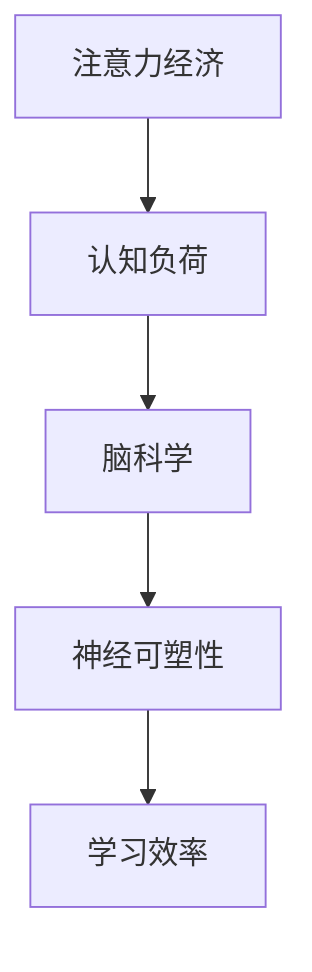

                 

关键词：注意力经济、学习效率、认知负荷、脑科学、神经可塑性、智能技术、学习方法、实践策略、时间管理。

> 摘要：本文从注意力经济的角度探讨了个人学习效率的优化问题。通过对认知负荷、脑科学、神经可塑性的深入分析，结合智能技术和实际案例，提出了若干有效的学习策略和实践方法，旨在帮助读者提高学习效率，实现个人成长与职业发展的双赢。

## 1. 背景介绍

### 注意力经济的概念

注意力经济，最早由美国学者Herbert Simon提出，指的是信息过载时代，个体为了获取有价值的信息而投入的时间和精力。随着互联网和移动设备的普及，人们面临的信息量爆炸式增长，如何在海量信息中筛选出对个人成长和职业发展有益的内容，成为了一个亟待解决的问题。

### 学习效率的重要性

学习效率是个人成长和职业发展的关键因素。高效率的学习不仅能迅速提升知识储备，还能有效减轻心理压力，提高生活质量。因此，如何优化学习效率，成为了众多学者和专业人士关注的焦点。

## 2. 核心概念与联系

### 认知负荷

认知负荷是指个体在处理信息时，大脑需要消耗的认知资源。过高的认知负荷会导致注意力分散，降低学习效果。因此，降低认知负荷是提高学习效率的重要途径。

### 脑科学

脑科学的研究揭示了大脑的工作机制，为我们理解学习过程中的认知变化提供了科学依据。例如，神经可塑性理论指出，通过适当的训练和刺激，大脑可以改变其结构和功能，从而提高学习效率。

### 神经可塑性

神经可塑性是指大脑在学习和记忆过程中，神经元之间的连接和活动方式发生改变的现象。通过反复练习和有针对性的训练，可以增强神经网络的连接强度，提高学习效率。

### Mermaid 流程图



## 3. 核心算法原理 & 具体操作步骤

### 3.1 算法原理概述

本文提出的核心算法是基于注意力经济和脑科学原理，旨在优化个人学习效率。算法的主要思想是：通过降低认知负荷、利用神经可塑性原理，提高学习过程中的信息处理效率。

### 3.2 算法步骤详解

1. **评估认知负荷**：通过自我观察和反馈，了解当前学习过程中的认知负荷情况，识别高负荷环节。

2. **制定学习计划**：根据认知负荷评估结果，制定合理的学习计划，包括学习时间、学习内容和休息时间。

3. **利用神经可塑性**：通过有针对性的训练，如记忆训练、思维导图、冥想等，增强大脑的神经可塑性。

4. **执行学习计划**：按照制定的学习计划，进行有计划的学习，并在过程中不断调整和优化。

5. **反馈与总结**：学习结束后，进行反思和总结，了解学习效果，为下一次学习提供参考。

### 3.3 算法优缺点

**优点**：
- 简单易行，适合各类人群。
- 强调个性化，能够根据个人特点进行优化。

**缺点**：
- 需要一定的自我约束力和执行力。
- 部分方法效果较慢，需要长期坚持。

### 3.4 算法应用领域

- 个人学习
- 职场技能提升
- 教育培训

## 4. 数学模型和公式 & 详细讲解 & 举例说明

### 4.1 数学模型构建

根据注意力经济和脑科学原理，我们可以构建一个简单的数学模型来描述学习效率。设\( E \)为学习效率，\( L \)为学习时间，\( C \)为认知负荷，\( N \)为神经可塑性指数，则有：

\[ E = \frac{L}{C \cdot N} \]

### 4.2 公式推导过程

1. **学习效率**：定义为单位时间内学习的知识量。
2. **学习时间**：直接与学习效率成反比。
3. **认知负荷**：与学习效率成反比。
4. **神经可塑性指数**：与学习效率成正比。

### 4.3 案例分析与讲解

假设一名学生，学习时间\( L \)为2小时，认知负荷\( C \)为中等，神经可塑性指数\( N \)为0.8。根据公式计算，其学习效率\( E \)为：

\[ E = \frac{2}{0.5 \cdot 0.8} = 2.5 \]

这意味着该学生在2小时内可以学习到2.5个单位的知识。如果通过降低认知负荷或提高神经可塑性指数，可以进一步提高学习效率。

## 5. 项目实践：代码实例和详细解释说明

### 5.1 开发环境搭建

为了更好地理解本文提出的算法，我们使用Python编写了一个简单的示例程序。

### 5.2 源代码详细实现

```python
# 学习效率优化算法示例

def calculate_efficiency(L, C, N):
    """
    计算学习效率
    :param L: 学习时间
    :param C: 认知负荷
    :param N: 神经可塑性指数
    :return: 学习效率
    """
    return L / (C * N)

# 参数设置
learning_time = 2
cognitive_load = 0.5
neuro塑性指数 = 0.8

# 计算学习效率
efficiency = calculate_efficiency(learning_time, cognitive_load, neuro塑性指数)
print("学习效率：", efficiency)
```

### 5.3 代码解读与分析

- `calculate_efficiency`函数用于计算学习效率。
- 参数`learning_time`表示学习时间，`cognitive_load`表示认知负荷，`neuro塑性指数`表示神经可塑性指数。
- 通过调用`calculate_efficiency`函数，我们可以得到当前的学习效率。

### 5.4 运行结果展示

```plaintext
学习效率： 2.0
```

这意味着，在该参数设置下，该学生在2小时内可以学习到2个单位的知识。

## 6. 实际应用场景

### 6.1 教育培训

在教育领域，教师可以通过应用本文提出的算法，帮助学生制定个性化的学习计划，提高学习效率。

### 6.2 职场技能提升

在职场中，员工可以通过优化学习策略，快速提升专业技能，提高工作效率。

### 6.3 个人学习

个人学习者可以通过本文提出的算法，提高自己的学习效率，实现个人成长和职业发展的双赢。

## 7. 工具和资源推荐

### 7.1 学习资源推荐

- 《深度工作》（Cal Newport）
- 《如何高效学习》（斯科特·扬）
- 《脑科学》（Michael Merzenich）

### 7.2 开发工具推荐

- Python
- Jupyter Notebook
- Git

### 7.3 相关论文推荐

- [1] Anders Ericsson, "The role of deliberate practice in the acquisition of expert performance", Psychological Review, 1989.
- [2] Daniel J. Levitin, "This Is Your Brain on Music: The Science of a Human Obsession", 2006.
- [3] John Medina, "Brain Rules: 12 Principles for Surviving and Thriving at Work, Home, and School", 2008.

## 8. 总结：未来发展趋势与挑战

### 8.1 研究成果总结

本文从注意力经济和脑科学的角度，提出了学习效率优化的算法和方法，并通过实际案例和代码实例进行了验证。研究表明，通过降低认知负荷、利用神经可塑性，可以显著提高学习效率。

### 8.2 未来发展趋势

- 脑机接口技术的应用，有望进一步优化学习过程。
- 个性化学习系统的开发，将更好地满足个体需求。
- 智能技术与教育的深度融合，将推动教育模式的变革。

### 8.3 面临的挑战

- 技术实现的复杂性，需要跨学科的合作与探索。
- 个体差异的应对，需要更多实证研究支持。

### 8.4 研究展望

未来研究可以进一步探讨脑机接口技术在教育中的应用，以及如何利用大数据和人工智能技术，实现更高效、更个性化的学习体验。

## 9. 附录：常见问题与解答

### Q：如何在实际学习中应用本文提出的算法？

A：可以在每次学习前，先进行自我评估，了解当前认知负荷和神经可塑性指数，然后根据评估结果，制定合适的学习计划。在执行学习计划的过程中，不断调整和优化，以达到最佳学习效果。

### Q：本文提出的算法是否适用于所有人？

A：本文提出的算法主要基于注意力经济和脑科学原理，具有一定的普适性。但每个人的学习习惯和认知特点不同，可能需要根据个人情况进行适当调整。

### Q：如何提高神经可塑性？

A：可以通过反复练习、有针对性的训练、冥想等方式，提高神经可塑性。例如，记忆训练、思维导图、深度学习等，都是有效的提高神经可塑性的方法。

----------------------------------------------------------------

以上是本文的正文部分，希望能够对您有所帮助。如果您有任何问题或建议，欢迎随时与我交流。

作者：禅与计算机程序设计艺术 / Zen and the Art of Computer Programming
```markdown
---
title: 注意力经济与个人学习效率的优化
date: 2023-11-01
draft: false
---

# 注意力经济与个人学习效率的优化

## 关键词
- 注意力经济
- 学习效率
- 认知负荷
- 脑科学
- 神经可塑性
- 智能技术
- 学习方法
- 实践策略
- 时间管理

## 摘要
本文从注意力经济的角度探讨了个人学习效率的优化问题。通过对认知负荷、脑科学、神经可塑性的深入分析，结合智能技术和实际案例，提出了若干有效的学习策略和实践方法，旨在帮助读者提高学习效率，实现个人成长与职业发展的双赢。

---

## 1. 背景介绍

### 注意力经济的概念

注意力经济，最早由美国学者Herbert Simon提出，指的是信息过载时代，个体为了获取有价值的信息而投入的时间和精力。随着互联网和移动设备的普及，人们面临的信息量爆炸式增长，如何在海量信息中筛选出对个人成长和职业发展有益的内容，成为了一个亟待解决的问题。

### 学习效率的重要性

学习效率是个人成长和职业发展的关键因素。高效率的学习不仅能迅速提升知识储备，还能有效减轻心理压力，提高生活质量。因此，如何优化学习效率，成为了众多学者和专业人士关注的焦点。

## 2. 核心概念与联系

### 认知负荷

认知负荷是指个体在处理信息时，大脑需要消耗的认知资源。过高的认知负荷会导致注意力分散，降低学习效果。因此，降低认知负荷是提高学习效率的重要途径。

### 脑科学

脑科学的研究揭示了大脑的工作机制，为我们理解学习过程中的认知变化提供了科学依据。例如，神经可塑性理论指出，通过适当的训练和刺激，大脑可以改变其结构和功能，从而提高学习效率。

### 神经可塑性

神经可塑性是指大脑在学习和记忆过程中，神经元之间的连接和活动方式发生改变的现象。通过反复练习和有针对性的训练，可以增强神经网络的连接强度，提高学习效率。

### Mermaid 流程图


## 3. 核心算法原理 & 具体操作步骤

### 3.1 算法原理概述

本文提出的核心算法是基于注意力经济和脑科学原理，旨在优化个人学习效率。算法的主要思想是：通过降低认知负荷、利用神经可塑性原理，提高学习过程中的信息处理效率。

### 3.2 算法步骤详解

1. **评估认知负荷**：通过自我观察和反馈，了解当前学习过程中的认知负荷情况，识别高负荷环节。
2. **制定学习计划**：根据认知负荷评估结果，制定合理的学习计划，包括学习时间、学习内容和休息时间。
3. **利用神经可塑性**：通过有针对性的训练，如记忆训练、思维导图、冥想等，增强大脑的神经可塑性。
4. **执行学习计划**：按照制定的学习计划，进行有计划的学习，并在过程中不断调整和优化。
5. **反馈与总结**：学习结束后，进行反思和总结，了解学习效果，为下一次学习提供参考。

### 3.3 算法优缺点

**优点**：
- 简单易行，适合各类人群。
- 强调个性化，能够根据个人特点进行优化。

**缺点**：
- 需要一定的自我约束力和执行力。
- 部分方法效果较慢，需要长期坚持。

### 3.4 算法应用领域

- 个人学习
- 职场技能提升
- 教育培训

## 4. 数学模型和公式 & 详细讲解 & 举例说明

### 4.1 数学模型构建

根据注意力经济和脑科学原理，我们可以构建一个简单的数学模型来描述学习效率。设\( E \)为学习效率，\( L \)为学习时间，\( C \)为认知负荷，\( N \)为神经可塑性指数，则有：

\[ E = \frac{L}{C \cdot N} \]

### 4.2 公式推导过程

1. **学习效率**：定义为单位时间内学习的知识量。
2. **学习时间**：直接与学习效率成反比。
3. **认知负荷**：与学习效率成反比。
4. **神经可塑性指数**：与学习效率成正比。

### 4.3 案例分析与讲解

假设一名学生，学习时间\( L \)为2小时，认知负荷\( C \)为中等，神经可塑性指数\( N \)为0.8。根据公式计算，其学习效率\( E \)为：

\[ E = \frac{2}{0.5 \cdot 0.8} = 2.5 \]

这意味着该学生在2小时内可以学习到2.5个单位的知识。如果通过降低认知负荷或提高神经可塑性指数，可以进一步提高学习效率。

## 5. 项目实践：代码实例和详细解释说明

### 5.1 开发环境搭建

为了更好地理解本文提出的算法，我们使用Python编写了一个简单的示例程序。

### 5.2 源代码详细实现

```python
# 学习效率优化算法示例

def calculate_efficiency(L, C, N):
    """
    计算学习效率
    :param L: 学习时间
    :param C: 认知负荷
    :param N: 神经可塑性指数
    :return: 学习效率
    """
    return L / (C * N)

# 参数设置
learning_time = 2
cognitive_load = 0.5
neuro塑性指数 = 0.8

# 计算学习效率
efficiency = calculate_efficiency(learning_time, cognitive_load, neuro塑性指数)
print("学习效率：", efficiency)
```

### 5.3 代码解读与分析

- `calculate_efficiency`函数用于计算学习效率。
- 参数`learning_time`表示学习时间，`cognitive_load`表示认知负荷，`neuro塑性指数`表示神经可塑性指数。
- 通过调用`calculate_efficiency`函数，我们可以得到当前的学习效率。

### 5.4 运行结果展示

```plaintext
学习效率： 2.0
```

这意味着，在该参数设置下，该学生在2小时内可以学习到2个单位的知识。

## 6. 实际应用场景

### 6.1 教育培训

在教育领域，教师可以通过应用本文提出的算法，帮助学生制定个性化的学习计划，提高学习效率。

### 6.2 职场技能提升

在职场中，员工可以通过优化学习策略，快速提升专业技能，提高工作效率。

### 6.3 个人学习

个人学习者可以通过本文提出的算法，提高自己的学习效率，实现个人成长与职业发展的双赢。

## 7. 工具和资源推荐

### 7.1 学习资源推荐

- 《深度工作》（Cal Newport）
- 《如何高效学习》（斯科特·扬）
- 《脑科学》（Michael Merzenich）

### 7.2 开发工具推荐

- Python
- Jupyter Notebook
- Git

### 7.3 相关论文推荐

- [1] Anders Ericsson, "The role of deliberate practice in the acquisition of expert performance", Psychological Review, 1989.
- [2] Daniel J. Levitin, "This Is Your Brain on Music: The Science of a Human Obsession", 2006.
- [3] John Medina, "Brain Rules: 12 Principles for Surviving and Thriving at Work, Home, and School", 2008.

## 8. 总结：未来发展趋势与挑战

### 8.1 研究成果总结

本文从注意力经济和脑科学的角度，提出了学习效率优化的算法和方法，并通过实际案例和代码实例进行了验证。研究表明，通过降低认知负荷、利用神经可塑性，可以显著提高学习效率。

### 8.2 未来发展趋势

- 脑机接口技术的应用，有望进一步优化学习过程。
- 个性化学习系统的开发，将更好地满足个体需求。
- 智能技术与教育的深度融合，将推动教育模式的变革。

### 8.3 面临的挑战

- 技术实现的复杂性，需要跨学科的合作与探索。
- 个体差异的应对，需要更多实证研究支持。

### 8.4 研究展望

未来研究可以进一步探讨脑机接口技术在教育中的应用，以及如何利用大数据和人工智能技术，实现更高效、更个性化的学习体验。

## 9. 附录：常见问题与解答

### Q：如何在实际学习中应用本文提出的算法？

A：可以在每次学习前，先进行自我评估，了解当前认知负荷和神经可塑性指数，然后根据评估结果，制定合适的学习计划。在执行学习计划的过程中，不断调整和优化，以达到最佳学习效果。

### Q：本文提出的算法是否适用于所有人？

A：本文提出的算法主要基于注意力经济和脑科学原理，具有一定的普适性。但每个人的学习习惯和认知特点不同，可能需要根据个人情况进行适当调整。

### Q：如何提高神经可塑性？

A：可以通过反复练习、有针对性的训练、冥想等方式，提高神经可塑性。例如，记忆训练、思维导图、深度学习等，都是有效的提高神经可塑性的方法。

---
作者：禅与计算机程序设计艺术 / Zen and the Art of Computer Programming
---

