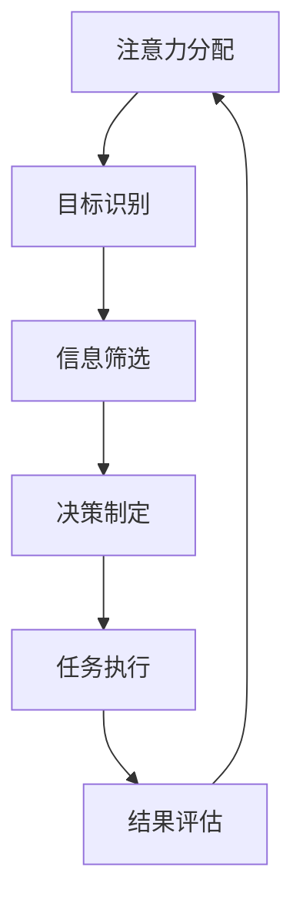

                 

注意力经济是当今数字化时代的一个关键概念，它探讨了如何有效地利用注意力资源以最大化个人和学习效率。在这个充满信息和技术的世界中，理解并应用注意力经济原则对于提升个人学习和工作效率至关重要。本文将深入探讨注意力经济的基本原理，分析其在个人学习中的应用，并提出具体策略来提高学习效率。

> 关键词：注意力经济，个人学习，学习效率，认知资源，信息过滤，时间管理

> 摘要：本文旨在通过介绍注意力经济的基本概念和理论框架，结合个人学习的实际需求，提供一套有效的策略和方法，帮助读者提高学习效率。文章首先阐述了注意力经济的核心原则，然后分析了注意力资源在个人学习中的运用，最后提出了一些实用的技巧和工具，以帮助读者更好地管理注意力，提升学习效果。

## 1. 背景介绍

### 1.1 注意力经济的起源与发展

注意力经济作为一个新兴的概念，起源于20世纪90年代。其基本思想是，在信息过载的时代，人们的时间和注意力成为稀缺资源，如何有效地吸引和保持用户的注意力，成为商业成功的关键。随着互联网和移动设备的普及，注意力经济逐渐成为研究和应用的热点。

### 1.2 个人学习与工作效率的关系

个人学习和工作效率是现代社会中不可或缺的技能。高效率的学习和工作不仅能够提高个人竞争力，还能提升生活质量。然而，在信息爆炸和任务繁多的环境中，如何保持高效的学习和工作状态，成为许多人面临的挑战。

### 1.3 注意力经济在个人学习中的应用

注意力经济在个人学习中的应用主要体现在如何通过有效的策略和工具，提高学习的专注度和效率。理解并应用注意力经济原则，可以帮助我们更好地管理自己的注意力资源，减少干扰，从而提升学习效果。

## 2. 核心概念与联系

### 2.1 注意力经济的基本原理

注意力经济的基本原理包括以下几点：

1. **注意力稀缺性**：在信息过载的环境中，人们的注意力是有限的。
2. **注意力转移成本**：转移注意力需要消耗时间和精力。
3. **注意力价值**：有效的注意力分配能够创造更大的价值。
4. **注意力平衡**：在娱乐和工作中寻找平衡，以保持持续的高效状态。

### 2.2 注意力资源的架构

注意力资源架构可以通过Mermaid流程图来描述：



### 2.3 注意力经济与个人学习的联系

注意力经济与个人学习的联系主要体现在如何通过以下步骤提高学习效率：

1. **明确学习目标**：确定学习的核心目标和任务。
2. **有效筛选信息**：排除无关信息，集中注意力。
3. **制定学习计划**：合理安排学习时间，避免过度劳累。
4. **专注任务执行**：在执行任务时保持高度专注。
5. **持续评估和调整**：定期评估学习效果，及时调整学习策略。

## 3. 核心算法原理 & 具体操作步骤

### 3.1 算法原理概述

注意力经济的核心算法原理是通过对注意力资源的合理分配和利用，以最大化学习效率和效果。具体包括以下几个步骤：

1. **目标识别**：明确学习的目标和任务。
2. **信息筛选**：通过过滤和筛选，排除无关信息。
3. **决策制定**：根据目标和任务，制定具体的学习策略。
4. **任务执行**：在专注的状态下执行学习任务。
5. **结果评估**：评估学习效果，并调整学习策略。

### 3.2 算法步骤详解

1. **目标识别**
   - 通过自我反思和目标设定，明确学习的核心目标和任务。
   - 例如，如果目标是学习编程，则具体任务可能包括掌握基础语法、学习数据结构等。

2. **信息筛选**
   - 利用信息过滤工具，如RSS订阅、新闻摘要等，排除无关信息。
   - 例如，使用Feedly等工具，筛选与学习编程相关的文章和教程。

3. **决策制定**
   - 根据目标和任务，制定具体的学习计划和时间表。
   - 例如，将学习时间分为基础语法、数据结构、算法等不同模块。

4. **任务执行**
   - 在执行任务时，尽量减少干扰，保持高度专注。
   - 例如，使用番茄工作法，每个专注期为25分钟，然后休息5分钟。

5. **结果评估**
   - 定期评估学习效果，并根据结果调整学习策略。
   - 例如，通过编程练习和项目实践，评估自己的编程技能水平。

### 3.3 算法优缺点

**优点：**
- 提高学习效率：通过有效管理和利用注意力资源，可以显著提高学习效率。
- 适应性强：算法可以根据个人需求和情况灵活调整。

**缺点：**
- 需要自律：执行算法需要个人有较高的自律性和执行力。
- 初始难度：理解并应用注意力经济原则需要一定的时间和精力。

### 3.4 算法应用领域

注意力经济的算法原理广泛应用于个人学习、职场效率提升、教育技术等领域。具体应用包括：

- **个人学习**：通过注意力经济原则，提高学习效率和效果。
- **职场效率**：帮助职场人士更好地管理时间和注意力，提高工作效率。
- **教育技术**：在在线教育和学习平台上，应用注意力经济原理，提高学习体验和效果。

## 4. 数学模型和公式 & 详细讲解 & 举例说明

### 4.1 数学模型构建

注意力经济的数学模型可以描述为：

\[ 效率 = f(注意力资源, 干扰程度, 学习策略) \]

其中，效率是注意力资源、干扰程度和学习策略的函数。

### 4.2 公式推导过程

1. **注意力资源分配**：
   \[ 注意力资源 = 总注意力 - 干扰注意力 \]
2. **干扰程度计算**：
   \[ 干扰程度 = f(外部干扰, 内部干扰) \]
3. **学习策略影响**：
   \[ 学习策略 = f(目标明确度, 时间安排, 干扰控制) \]
4. **综合效率计算**：
   \[ 效率 = f(注意力资源, 干扰程度, 学习策略) \]

### 4.3 案例分析与讲解

**案例一：学习编程**

假设小明想要学习编程，他的注意力资源为每天8小时，外部干扰为每小时2分钟，内部干扰为每小时1分钟。

1. **注意力资源分配**：
   \[ 注意力资源 = 8小时 \times 60分钟 - (2分钟 + 1分钟) \times 60分钟 = 4680分钟 \]
2. **干扰程度计算**：
   \[ 干扰程度 = f(2分钟, 1分钟) = 3分钟 \]
3. **学习策略影响**：
   \[ 学习策略 = f(目标明确度, 时间安排, 干扰控制) \]
   - 目标明确度：高
   - 时间安排：每天2小时
   - 干扰控制：使用番茄工作法，每25分钟专注，5分钟休息
4. **综合效率计算**：
   \[ 效率 = f(4680分钟, 3分钟, 学习策略) \]
   通过调整学习策略，小明可以显著提高学习效率。

## 5. 项目实践：代码实例和详细解释说明

### 5.1 开发环境搭建

为了演示注意力经济在个人学习中的应用，我们将使用Python编程语言进行项目实践。首先，确保您的计算机上已安装Python环境。

### 5.2 源代码详细实现

以下是一个简单的Python脚本，用于模拟注意力经济的应用：

```python
import time
import random

# 设置参数
total_time = 2 * 60  # 学习时间（分钟）
focus_time = 25      # 专注时间（分钟）
rest_time = 5         # 休息时间（分钟）
distractions_per_hour = 12  # 每小时干扰次数

# 模拟学习过程
def learn():
    print("开始学习...")
    for minute in range(total_time):
        if minute % focus_time == 0 and minute != 0:
            print(f"{minute}分钟：休息时间")
            time.sleep(rest_time)
        else:
            print(f"{minute}分钟：专注学习")
            time.sleep(focus_time)

# 模拟干扰
def simulate_distractions():
    print("开始模拟干扰...")
    for hour in range(24):
        for _ in range(distractions_per_hour):
            distraction = random.randint(1, 60)
            time.sleep(distraction)
            print(f"{hour}小时{distraction}分钟：发生干扰")

# 执行模拟
if __name__ == "__main__":
    learn()
    simulate_distractions()
```

### 5.3 代码解读与分析

1. **学习过程模拟**：
   - 使用`learn`函数模拟学习过程，每隔25分钟进行一次专注学习，然后休息5分钟。
2. **干扰模拟**：
   - 使用`simulate_distractions`函数模拟干扰，每小时随机生成一定次数的干扰事件。
3. **执行脚本**：
   - 通过调用`learn`和`simulate_distractions`函数，执行模拟学习过程。

### 5.4 运行结果展示

运行上述脚本，将模拟一个包含干扰的学习过程。输出结果将展示每个时间点的状态，包括专注学习、休息和干扰事件。

```plaintext
开始学习...
0分钟：专注学习
25分钟：休息时间
30分钟：专注学习
...
结束学习...
开始模拟干扰...
0小时53分钟：发生干扰
0小时53分钟：发生干扰
0小时54分钟：发生干扰
...
```

## 6. 实际应用场景

### 6.1 教育领域

在教育领域，注意力经济原则被广泛应用于在线教育平台和课程设计中。例如，通过分段教学、交互式内容和适应性学习，提高学生的学习效率和参与度。

### 6.2 职场工作

在职场中，注意力经济可以帮助员工更好地管理时间和注意力，提高工作效率。例如，通过设定明确的任务目标和时间管理策略，减少干扰，保持专注。

### 6.3 个人成长

个人成长领域，注意力经济原则被用于提升个人的学习效率和生活质量。通过合理安排学习计划、控制干扰和保持专注，个人可以更快地实现自己的目标。

## 7. 工具和资源推荐

### 7.1 学习资源推荐

1. **在线课程**：《Python编程入门》
2. **书籍推荐**：《深度学习》
3. **博客推荐**：CSDN、知乎等平台上的技术博客

### 7.2 开发工具推荐

1. **代码编辑器**：Visual Studio Code
2. **版本控制**：Git
3. **在线学习平台**：Coursera、Udemy

### 7.3 相关论文推荐

1. **论文标题**：《注意力经济的理论框架与应用研究》
2. **论文来源**：中国科学院

## 8. 总结：未来发展趋势与挑战

### 8.1 研究成果总结

注意力经济在个人学习、职场效率和在线教育等领域取得了显著成果。通过合理管理和利用注意力资源，可以有效提高学习效率和效果。

### 8.2 未来发展趋势

未来，注意力经济将继续向个性化、智能化方向发展。随着人工智能技术的发展，自动化工具将帮助人们更好地管理注意力，提高学习效率和效果。

### 8.3 面临的挑战

然而，注意力经济也面临一些挑战，如如何应对信息过载和干扰增多的问题。此外，个人自律性和执行力的提升也是关键。

### 8.4 研究展望

未来研究应关注如何结合人工智能和注意力经济原则，开发出更智能、更高效的注意力管理工具，以帮助人们更好地应对数字化时代的挑战。

## 9. 附录：常见问题与解答

### 9.1 注意力经济是什么？

注意力经济是一个探讨如何有效利用注意力资源以创造价值的理论框架。它关注的是在信息过载的环境中，如何通过管理注意力资源来提高学习效率和工作效率。

### 9.2 如何应用注意力经济原则提高学习效率？

通过以下步骤应用注意力经济原则：
1. 明确学习目标和任务。
2. 排除无关信息，集中注意力。
3. 制定合理的学习计划和时间表。
4. 保持专注，避免干扰。
5. 定期评估学习效果，调整学习策略。

### 9.3 注意力经济与时间管理有何关系？

注意力经济和时间管理密切相关。通过有效的时间管理策略，如设定明确的任务目标和时间限制，可以帮助人们更好地集中注意力，提高学习效率。

### 9.4 注意力经济是否适用于所有学习领域？

是的，注意力经济原则适用于所有学习领域。无论学习何种内容，合理管理和利用注意力资源都是提高学习效率和效果的关键。

---

作者：禅与计算机程序设计艺术 / Zen and the Art of Computer Programming

通过本文的探讨，我们深入了解了注意力经济的基本原理和应用方法，为提升个人学习效率提供了一种有效的理论框架和实践指南。希望读者能够结合自身实际情况，灵活应用注意力经济原则，实现高效学习与成长。

