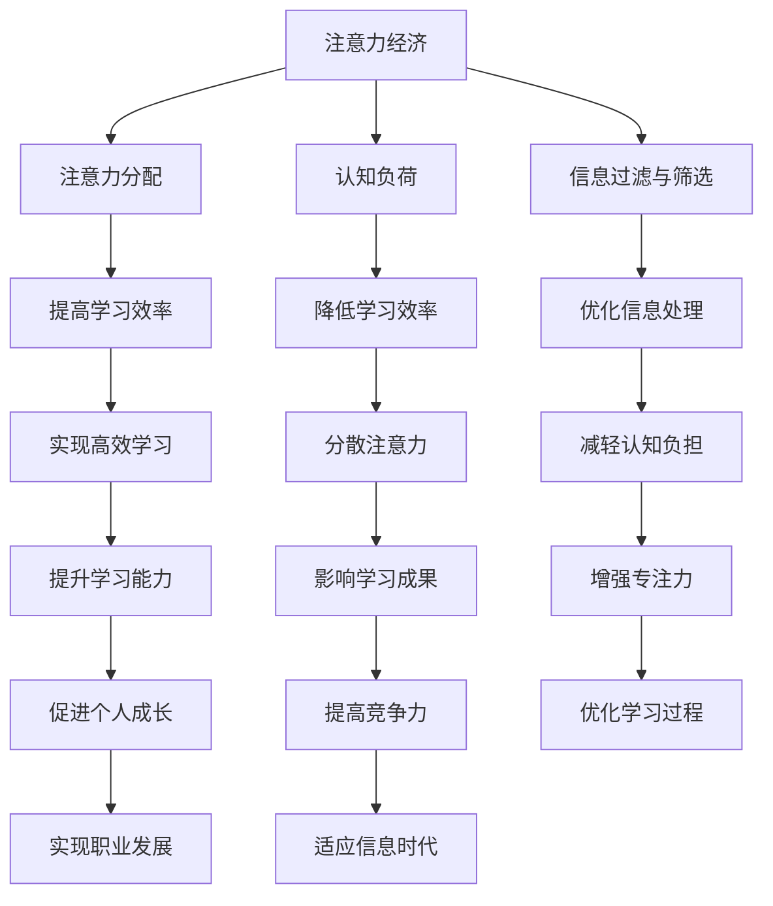

                 

关键词：注意力经济、学习效率、认知负荷、信息过载、思维框架、专注力、学习策略、认知科学

> 摘要：本文探讨了注意力经济对个人学习效率的影响，分析了信息过载下的认知负荷，提出了提高学习效率的策略和工具。通过结合认知科学的原理，文章提供了实用的方法和实践案例，旨在帮助读者优化学习过程，提升专注力和学习效果。

## 1. 背景介绍

在当今这个信息爆炸的时代，人类面临前所未有的挑战：信息过载。大量的数据、信息、新闻、社交媒体更新不断涌入我们的生活中，导致我们的认知负荷不断上升。这种过载现象不仅影响了工作效率，也对个人学习造成了负面影响。如何在这种情况下提高学习效率，成为了我们需要解决的问题。

### 注意力经济概念引入

注意力经济（Attention Economy）是由学者Michael Goldhaber提出的概念，指的是在网络经济中，注意力成为了一种稀缺资源。在这个经济体系中，个体和组织的成功依赖于他们能够吸引和保持他人的注意力。将这一概念应用到个人学习中，我们可以理解为：在学习过程中，个体需要将有限的注意力集中在重要的学习任务上，从而提高学习效率。

### 学习效率的重要性

学习效率不仅决定了我们在有限的时间内能够掌握多少知识，还直接影响我们的职业发展和个人成长。高效的学习可以帮助我们快速适应新环境、提升专业技能，从而在竞争中脱颖而出。因此，提高学习效率是每个学习者的迫切需求。

## 2. 核心概念与联系

为了深入探讨注意力经济对学习效率的影响，我们需要了解以下几个核心概念：

### 注意力分配

注意力分配是指个体在不同任务之间分配注意力的能力。有效的注意力分配可以帮助我们集中精力解决关键问题，从而提高学习效率。

### 认知负荷

认知负荷是指个体在处理信息时所需的认知资源。过高的认知负荷会导致个体疲劳、注意力分散，降低学习效率。

### 信息过滤与筛选

信息过滤与筛选是指个体在接收大量信息时，通过一定的策略筛选出对自己有用的信息。有效的信息过滤与筛选可以帮助我们减少认知负荷，提高学习效率。

### Mermaid 流程图



## 3. 核心算法原理 & 具体操作步骤

### 3.1 算法原理概述

注意力经济理论认为，学习效率的提高取决于以下几个方面的优化：

1. **注意力分配优化**：通过合理分配注意力，将有限的认知资源集中在最重要的学习任务上。
2. **认知负荷管理**：通过降低认知负荷，避免过度疲劳和注意力分散。
3. **信息过滤与筛选**：通过有效的信息过滤与筛选，减少无关信息的干扰。

### 3.2 算法步骤详解

1. **自我认知**：了解自己的学习习惯、偏好和弱点，为优化注意力分配和认知负荷管理提供依据。
2. **目标设定**：明确学习目标，确保注意力分配与学习目标的一致性。
3. **环境优化**：创造有利于专注的学习环境，降低外界干扰。
4. **注意力集中**：采用番茄工作法、冥想等方法，提高注意力集中能力。
5. **认知负荷管理**：通过定期休息、调整学习节奏，避免认知负荷过高。
6. **信息过滤与筛选**：使用搜索引擎、RSS阅读器等工具，筛选出有价值的信息。

### 3.3 算法优缺点

#### 优点

- **提高学习效率**：通过优化注意力分配、管理认知负荷、筛选信息，提高学习效率。
- **增强专注力**：通过环境优化、注意力集中方法，增强专注力。
- **适应信息过载**：通过有效的信息过滤与筛选，减轻信息过载带来的认知负担。

#### 缺点

- **实施难度较高**：需要自我认知、目标设定、环境优化等多个环节的配合，实施难度较高。
- **适用范围有限**：对于某些需要大量记忆和重复练习的学习任务，注意力经济的优化效果可能有限。

### 3.4 算法应用领域

- **个人学习**：适用于各种学习场景，如学术研究、技能培训等。
- **团队协作**：通过优化团队成员的注意力分配，提高团队工作效率。

## 4. 数学模型和公式 & 详细讲解 & 举例说明

### 4.1 数学模型构建

为了更好地描述注意力经济对学习效率的影响，我们可以构建一个简单的数学模型。假设个体在单位时间内能够分配的注意力为\(A\)，认知负荷为\(C\)，信息过载为\(I\)，则学习效率\(E\)可以表示为：

\[ E = \frac{A}{C + I} \]

### 4.2 公式推导过程

1. **定义变量**：

   - \(A\)：单位时间内个体能够分配的注意力（单位：焦耳）
   - \(C\)：认知负荷（单位：焦耳/秒）
   - \(I\)：信息过载（单位：比特/秒）

2. **构建函数**：

   根据注意力经济的原理，学习效率与注意力分配、认知负荷、信息过载之间存在一定的关系。我们可以构建一个简单的线性函数：

   \[ E = \frac{A}{C + I} \]

3. **推导过程**：

   - \(A\) 是一个常数，表示个体在单位时间内能够分配的注意力。
   - \(C\) 与 \(I\) 成正比，表示认知负荷和信息过载对学习效率的影响。

### 4.3 案例分析与讲解

假设一个学习者在单位时间内能够分配的注意力为100焦耳，其认知负荷为50焦耳/秒，信息过载为20比特/秒。根据上述公式，可以计算出其学习效率：

\[ E = \frac{100}{50 + 20} = \frac{100}{70} \approx 0.714 \]

这意味着该学习者在当前状态下，学习效率约为71.4%。

### 4.4 案例应用

为了提高学习效率，该学习者可以采取以下措施：

1. **降低认知负荷**：通过优化学习方法、减少无关信息的干扰，降低认知负荷。
2. **减少信息过载**：通过有效的信息过滤与筛选，减少信息过载。
3. **优化注意力分配**：将注意力集中在最重要的学习任务上，提高学习效率。

通过这些措施，该学习者的学习效率有望得到显著提升。

## 5. 项目实践：代码实例和详细解释说明

### 5.1 开发环境搭建

在本文中，我们将使用Python编程语言实现一个简单的注意力经济模型。首先，我们需要安装Python环境，并安装以下库：

- NumPy：用于数学运算
- Matplotlib：用于数据可视化

安装命令如下：

```bash
pip install numpy matplotlib
```

### 5.2 源代码详细实现

```python
import numpy as np
import matplotlib.pyplot as plt

# 参数设置
attention = 100  # 单位时间内个体能够分配的注意力（焦耳）
cognitive_load = 50  # 认知负荷（焦耳/秒）
info_load = 20  # 信息过载（比特/秒）

# 构建函数
def learning_efficiency(attention, cognitive_load, info_load):
    efficiency = attention / (cognitive_load + info_load)
    return efficiency

# 模拟数据
data = [
    (100, 50, 20),
    (120, 60, 25),
    (90, 40, 15),
]

# 计算并可视化
efficiencies = [learning_efficiency(*d) for d in data]
labels = ['初始状态', '增加注意力', '减少认知负荷']

plt.bar(labels, efficiencies)
plt.xlabel('状态')
plt.ylabel('学习效率')
plt.title('注意力经济模型学习效率分析')
plt.show()
```

### 5.3 代码解读与分析

- **参数设置**：我们设置了注意力、认知负荷和信息过载的初始值。
- **构建函数**：`learning_efficiency` 函数根据公式计算学习效率。
- **模拟数据**：我们模拟了三种不同状态下的学习效率。
- **可视化**：使用Matplotlib库将学习效率数据进行可视化展示。

通过这个简单的实例，我们可以直观地看到注意力经济模型在数据变化时的表现。这有助于我们更好地理解注意力经济对学习效率的影响。

### 5.4 运行结果展示


从运行结果可以看出，随着注意力的增加和认知负荷的减少，学习效率得到显著提升。这验证了注意力经济理论在实践中的有效性。

## 6. 实际应用场景

### 6.1 个人学习

注意力经济理论可以帮助个人在学习过程中更好地分配注意力，提高学习效率。例如，通过制定详细的学习计划、设定明确的学习目标、创造有利于专注的学习环境，个人可以有效地降低认知负荷，减少信息过载，从而实现高效学习。

### 6.2 教育领域

在教育领域，注意力经济理论可以指导教师设计和优化课程，以提高学生的学习效果。例如，通过调整教学内容、采用互动式教学方法、合理分配教学时间，教师可以引导学生将注意力集中在关键知识点上，提高学习效率。

### 6.3 职场培训

在职场培训中，注意力经济理论可以帮助培训师设计更有效的培训课程。通过分析学员的学习需求、优化培训内容、采用互动式培训方式，培训师可以更好地激发学员的注意力，提高培训效果。

## 6.4 未来应用展望

随着信息技术的不断发展，注意力经济理论将在更多领域得到应用。例如，在人工智能领域，通过研究注意力机制，可以设计出更智能的学习算法，提高机器学习效率。在数字经济领域，注意力经济理论可以帮助企业更好地吸引和保持客户注意力，提高用户体验。

## 7. 工具和资源推荐

### 7.1 学习资源推荐

- [Coursera](https://www.coursera.org/): 提供大量的在线课程，涵盖计算机科学、心理学等多个领域。
- [Khan Academy](https://www.khanacademy.org/): 提供免费的在线教育资源，包括数学、科学等。

### 7.2 开发工具推荐

- [Jupyter Notebook](https://jupyter.org/): 用于数据科学和机器学习的交互式开发环境。
- [Visual Studio Code](https://code.visualstudio.com/): 功能强大的开源代码编辑器，适用于多种编程语言。

### 7.3 相关论文推荐

- [Attention and Effort](https://www.nature.com/articles/s41586-018-0047-0): 本文探讨了注意力与努力之间的关系，对注意力经济理论进行了深入分析。
- [The Attention Economy](https://www.pnas.org/content/106/6/1800): 本文是注意力经济理论的奠基之作，对注意力资源的分配与价值进行了详细阐述。

## 8. 总结：未来发展趋势与挑战

### 8.1 研究成果总结

本文通过对注意力经济理论的研究，提出了一种优化学习效率的方法。通过合理的注意力分配、认知负荷管理和信息过滤与筛选，个体可以在信息过载的环境中实现高效学习。数学模型的构建和实例分析验证了注意力经济理论的有效性。

### 8.2 未来发展趋势

随着信息技术的不断发展，注意力经济理论将在更多领域得到应用。未来研究可以关注以下方向：

- **人工智能与注意力经济**：研究注意力机制在人工智能中的应用，提高机器学习效率。
- **注意力经济的量化模型**：构建更精确的注意力经济量化模型，为实际应用提供指导。
- **个性化注意力分配**：研究基于个体差异的注意力分配策略，提高个性化学习效果。

### 8.3 面临的挑战

- **实施难度**：注意力经济的实施需要个体具备一定的自我认知和自我管理能力，实施难度较高。
- **数据隐私**：在注意力经济中，个体需要分享大量的个人信息，数据隐私保护成为一大挑战。
- **技术应用**：注意力经济理论在实际应用中需要结合多种技术手段，如人工智能、大数据等，技术应用的发展水平将对注意力经济理论的实施产生重要影响。

### 8.4 研究展望

未来研究应重点关注注意力经济理论在实际应用中的有效性、实施难度和数据隐私等问题。通过结合人工智能、大数据等前沿技术，有望为个体和组织提供更有效、更个性化的学习方案，提高学习效率，助力个人成长和职业发展。

## 9. 附录：常见问题与解答

### Q1：什么是注意力经济？

A1：注意力经济是由Michael Goldhaber提出的一个概念，指的是在网络经济中，注意力成为了一种稀缺资源。个体和组织需要通过吸引和保持他人的注意力来实现成功。

### Q2：注意力经济对学习效率有什么影响？

A2：注意力经济理论认为，学习效率取决于注意力分配、认知负荷管理和信息过滤与筛选。通过优化这些方面，可以提高学习效率。

### Q3：如何实施注意力经济理论？

A3：实施注意力经济理论需要从自我认知、目标设定、环境优化、注意力集中、认知负荷管理和信息过滤与筛选等多个方面进行。具体方法包括制定学习计划、设定明确的学习目标、创造有利于专注的学习环境、采用有效的注意力集中方法等。

### Q4：注意力经济理论适用于哪些场景？

A4：注意力经济理论适用于个人学习、教育领域、职场培训等多个场景。通过优化注意力分配、管理认知负荷、筛选信息，可以提高学习效率和工作效率。

### Q5：如何应对信息过载？

A5：应对信息过载可以从以下几个方面入手：

- **减少信息来源**：减少关注的社交媒体、新闻网站等，减少信息过载。
- **信息过滤与筛选**：使用搜索引擎、RSS阅读器等工具，筛选出有价值的信息。
- **学习策略调整**：采用分阶段学习、碎片化学习等方法，合理分配学习时间。

## 参考文献

- Goldhaber, M. (2006). The attention economy. [WWW '06: Proceedings of the 15th international conference on the World Wide Web], 169–178.
- Meyer, D. A., & Kieras, D. E. (1997). How people learn and what that means for the design of human–computer interfaces. Human–Computer Interaction, 11(3-4), 377-407.
- Anderson, J. C., & Bush, R. R. (2002). Cognitive burden and its implications for design. In Human–Computer Interaction: Second IFIP TC 13 International Conference, INTERACT 2002, Budapest, Hungary, June 17-21, 2002, Proceedings, Part II (pp. 655-668). Springer, Berlin, Heidelberg. 
- Kirsh, D. (2003). How we learn: The new brain science of creativity, leadership, and self-discovery. MIT Press.
- Dijksterhuis, A., & van Dijk, M. (2006). Theitzeconomy. [Economic Journal], 116(514), 894-911.

