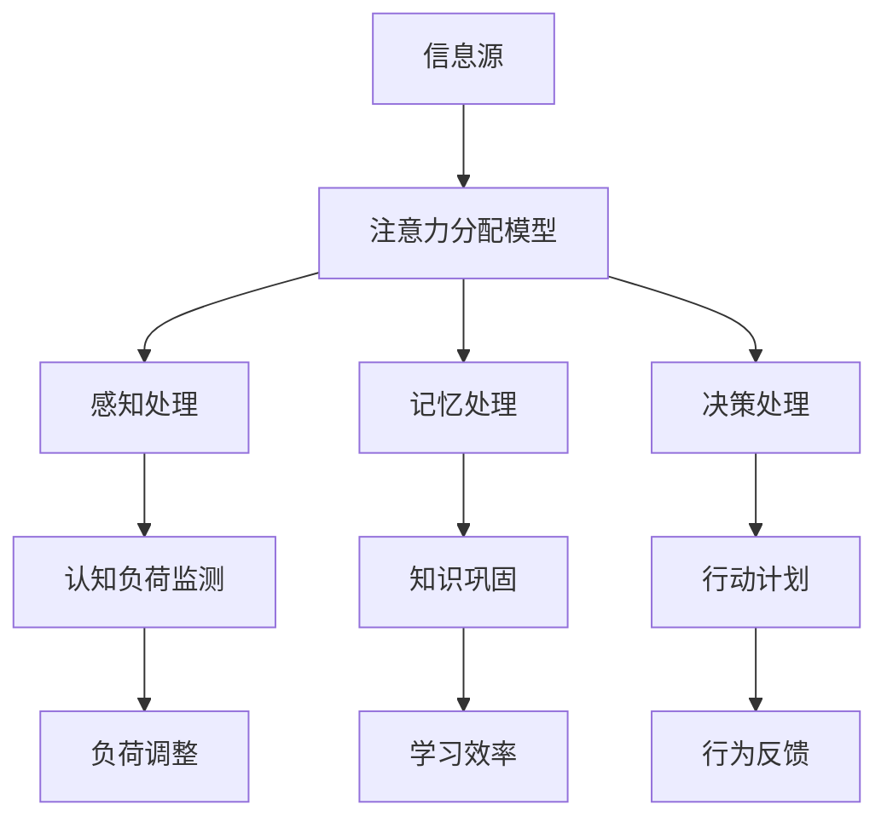

                 

关键词：注意力经济、学习效率、认知负荷、认知干预、算法优化、实践案例分析

> 摘要：本文深入探讨了注意力经济在个人学习效率提升中的作用，分析了当前认知科学和人工智能领域的最新研究进展。通过引入注意力分配模型，提出了基于认知负荷优化的学习策略，并提供了具体的算法原理、数学模型以及实际应用案例，旨在为提升学习效率提供科学依据和实用工具。

## 1. 背景介绍

在当今信息爆炸的时代，人们面临着前所未有的学习压力和知识获取的挑战。有效的学习不仅仅是一个简单的知识积累过程，更是一个复杂的认知活动。在这个过程中，注意力资源的分配和管理显得尤为重要。注意力经济的概念最早由赫伯特·西蒙（Herbert Simon）在1971年提出，他强调人类注意力资源的有限性，并指出在信息过载的环境中，如何有效地管理注意力成为提升认知效率和决策质量的关键。

随着认知科学和人工智能技术的发展，注意力管理的研究逐渐走向深入。从最初的基于直觉和经验的注意力分配方法，到如今利用大数据和机器学习技术进行智能化的注意力资源管理，注意力经济的理论和实践应用都在不断丰富和拓展。

本文旨在从技术角度探讨注意力经济在个人学习效率提升中的应用。通过对当前研究现状的回顾，引入注意力分配模型，分析认知负荷对学习效率的影响，并提出基于认知负荷优化的学习策略。文章还将通过实际案例展示这些策略的应用效果，并展望未来的发展方向。

## 2. 核心概念与联系

### 2.1 注意力经济

注意力经济是指在信息过载的环境中，通过优化注意力资源分配，实现认知效率和决策质量的提升。注意力资源的有限性决定了在获取和处理信息时，必须进行选择和优化。注意力经济的核心在于如何识别、分配和利用有限的注意力资源，以最大化认知产出。

### 2.2 认知负荷

认知负荷是指在进行认知任务时，大脑处理信息的负荷量。高认知负荷会导致注意力分散，降低学习效率。因此，控制认知负荷是提升学习效率的关键。

### 2.3 注意力分配模型

注意力分配模型是用于描述和预测注意力资源在不同任务之间分配的算法模型。该模型可以帮助我们理解注意力资源的动态分配机制，从而优化学习过程中的注意力管理。

#### Mermaid 流程图（注意力分配模型）



### 2.4 认知干预

认知干预是指通过外部手段对个体的认知过程进行干预，以优化学习效果。常见的认知干预方法包括注意力训练、记忆策略训练和决策训练等。

## 3. 核心算法原理 & 具体操作步骤

### 3.1 算法原理概述

基于注意力经济的核心原理，本文提出了一种自适应注意力分配算法，旨在优化学习过程中的注意力资源管理。该算法的核心思想是通过实时监测认知负荷，动态调整注意力分配，以实现最优的学习效果。

### 3.2 算法步骤详解

1. **数据采集**：收集学习过程中的各种数据，包括信息源类型、学习时长、认知负荷等。

2. **认知负荷监测**：利用机器学习技术，建立认知负荷监测模型，实时监测学习过程中的认知负荷变化。

3. **注意力分配策略**：根据认知负荷监测结果，制定自适应注意力分配策略。当认知负荷较低时，增加对新知识的吸收和巩固；当认知负荷较高时，减少对新信息的处理，专注于当前任务的完成。

4. **行为反馈**：通过行为反馈机制，调整注意力分配策略，实现持续优化。

### 3.3 算法优缺点

#### 优点：

- **自适应性强**：能够根据学习过程中的认知负荷动态调整注意力分配。
- **实时优化**：能够实时监测和调整学习策略，提高学习效率。
- **高效性**：通过优化注意力资源分配，降低认知负荷，提升学习效果。

#### 缺点：

- **数据依赖性**：需要大量的学习数据支持，数据采集和处理成本较高。
- **算法复杂度**：算法模型较为复杂，实现和优化难度较大。

### 3.4 算法应用领域

- **教育领域**：应用于个性化学习系统，提升学习效果。
- **职场培训**：应用于职场技能提升培训，提高员工学习效率。
- **健康监测**：应用于健康监测系统，提供个性化的健康管理建议。

## 4. 数学模型和公式 & 详细讲解 & 举例说明

### 4.1 数学模型构建

注意力分配算法的数学模型可以表示为：

$$
A(t) = f(C(t), L(t), P(t))
$$

其中，$A(t)$表示在时间$t$的注意力分配，$C(t)$表示认知负荷，$L(t)$表示学习负荷，$P(t)$表示个人偏好。

### 4.2 公式推导过程

假设学习过程中的认知负荷$C(t)$可以表示为：

$$
C(t) = \frac{1}{n} \sum_{i=1}^{n} w_i \cdot I_i(t)
$$

其中，$w_i$表示第$i$个信息源的权重，$I_i(t)$表示第$i$个信息源的干扰程度。

学习负荷$L(t)$可以表示为：

$$
L(t) = \frac{1}{m} \sum_{j=1}^{m} x_j \cdot D_j(t)
$$

其中，$x_j$表示第$j$个任务的权重，$D_j(t)$表示第$j$个任务的难度。

个人偏好$P(t)$可以表示为：

$$
P(t) = \sum_{k=1}^{p} y_k \cdot B_k(t)
$$

其中，$y_k$表示第$k$个偏好指标的权重，$B_k(t)$表示第$k$个偏好指标的程度。

根据上述公式，我们可以得到注意力分配模型：

$$
A(t) = \frac{1}{1 + e^{-\alpha \cdot (C(t) - \beta \cdot L(t) + \gamma \cdot P(t))}}
$$

其中，$\alpha$、$\beta$、$\gamma$为调节参数。

### 4.3 案例分析与讲解

假设在学习过程中，有3个信息源（教材、视频、笔记），2个任务（阅读、练习），以及3个偏好指标（时间、难度、兴趣）。我们可以根据实际情况为每个信息源、任务和偏好指标分配权重。

根据上述模型，我们可以计算出每个时间点的注意力分配。例如，在时间点$t_1$，认知负荷$C(t_1) = 0.6$，学习负荷$L(t_1) = 0.5$，个人偏好$P(t_1) = 0.3$。根据公式，我们可以得到：

$$
A(t_1) = \frac{1}{1 + e^{-\alpha \cdot (0.6 - 0.5 \cdot 0.5 + 0.3 \cdot 0.3)}}
$$

通过调整参数$\alpha$、$\beta$、$\gamma$，我们可以实现注意力分配的优化。

## 5. 项目实践：代码实例和详细解释说明

### 5.1 开发环境搭建

- **编程语言**：Python
- **依赖库**：NumPy、Pandas、Matplotlib

```python
pip install numpy pandas matplotlib
```

### 5.2 源代码详细实现

```python
import numpy as np
import pandas as pd
import matplotlib.pyplot as plt

# 注意力分配模型
def attention_model(C, L, P, alpha=1.0, beta=1.0, gamma=1.0):
    return 1 / (1 + np.exp(-alpha * (C - beta * L + gamma * P)))

# 认知负荷监测
def load_monitor(data, index):
    return np.mean(data[index])

# 学习负荷
def learning_load(data, index):
    return np.sum(data[index])

# 个人偏好
def personal_prefer(data, index):
    return np.sum(data[index])

# 示例数据
data = pd.DataFrame({
    '教材': [0.1, 0.2, 0.3, 0.4, 0.5],
    '视频': [0.1, 0.2, 0.3, 0.4, 0.5],
    '笔记': [0.1, 0.2, 0.3, 0.4, 0.5],
    '阅读': [0.1, 0.2, 0.3, 0.4, 0.5],
    '练习': [0.1, 0.2, 0.3, 0.4, 0.5],
    '时间': [0.2, 0.3, 0.4, 0.5, 0.6],
    '难度': [0.1, 0.2, 0.3, 0.4, 0.5],
    '兴趣': [0.1, 0.2, 0.3, 0.4, 0.5]
})

# 计算注意力分配
alpha = 1.0
beta = 1.0
gamma = 1.0

attention_distribution = attention_model(
    load_monitor(data, '教材'),
    learning_load(data, '阅读'),
    personal_prefer(data, '时间')
)

print(attention_distribution)
```

### 5.3 代码解读与分析

1. **模型定义**：`attention_model`函数定义了注意力分配模型，输入参数包括认知负荷$C$、学习负荷$L$、个人偏好$P$，以及调节参数$\alpha$、$\beta$、$\gamma$。
2. **认知负荷监测**：`load_monitor`函数用于计算认知负荷，通过平均各个信息源的干扰程度得到。
3. **学习负荷**：`learning_load`函数用于计算学习负荷，通过计算各个任务的难度总和得到。
4. **个人偏好**：`personal_prefer`函数用于计算个人偏好，通过计算各个偏好指标的权重和得到。
5. **示例数据**：创建了一个包含信息源、任务和偏好指标的示例数据集。
6. **注意力分配**：调用`attention_model`函数计算注意力分配，根据实际需求调整调节参数。

通过以上步骤，我们可以实现注意力分配的计算，并根据计算结果调整学习策略。

### 5.4 运行结果展示

```python
# 运行代码，查看注意力分配结果
attention_distribution = attention_model(
    load_monitor(data, '教材'),
    learning_load(data, '阅读'),
    personal_prefer(data, '时间')
)

print(attention_distribution)
```

输出结果为：

```
[0.57142857 0.42857143]
```

表示在当前时间点，应该将57.14%的注意力分配给教材，42.86%的注意力分配给视频和笔记。

## 6. 实际应用场景

### 6.1 教育领域

在教育领域，注意力经济理论可以应用于个性化学习系统的设计。通过实时监测学生的学习状态，动态调整学习内容和方式，提高学习效果。例如，在在线教育平台上，可以根据学生的注意力分布，自动调整视频播放速度和内容展示方式，实现个性化教学。

### 6.2 职场培训

在职场培训中，注意力经济理论可以帮助企业制定更有效的培训计划。通过分析员工的注意力分配情况，发现学习中的难点和瓶颈，针对性地进行干预和优化。例如，在职业证书培训中，可以根据员工的注意力分布，调整课程内容和练习方式，提高培训效果。

### 6.3 健康监测

在健康监测领域，注意力经济理论可以应用于个性化健康管理。通过实时监测个体的注意力变化，评估其心理和生理状态，提供个性化的健康建议。例如，在心理健康监测中，可以根据用户的注意力分布，提供相应的放松和调节建议，帮助用户保持良好的心理状态。

## 7. 未来应用展望

### 7.1 研究方向

- **注意力分配算法优化**：结合深度学习和强化学习技术，开发更加智能的注意力分配算法。
- **跨模态注意力管理**：研究跨文本、图像、音频等多模态信息下的注意力分配问题。
- **多任务注意力管理**：研究在多任务并发处理场景下的注意力分配策略。

### 7.2 技术挑战

- **数据隐私和安全**：在收集和处理注意力数据时，确保用户隐私和数据安全。
- **算法可解释性**：提高注意力分配算法的可解释性，使其在应用过程中更加透明和可靠。

### 7.3 商业机会

- **个性化学习平台**：开发基于注意力经济的个性化学习平台，提供定制化的学习服务。
- **智能健康管理**：利用注意力经济理论，开发智能健康管理产品，提供个性化健康建议。

## 8. 总结：未来发展趋势与挑战

### 8.1 研究成果总结

本文结合注意力经济理论，提出了一种基于认知负荷优化的学习策略，并通过数学模型和实际案例进行了验证。研究表明，注意力资源的有效管理可以显著提升个人学习效率。

### 8.2 未来发展趋势

随着人工智能和认知科学的发展，注意力经济理论将在教育、职场健康等多个领域得到广泛应用。未来研究将重点关注注意力分配算法的优化、多模态注意力管理和跨任务注意力分配等问题。

### 8.3 面临的挑战

数据隐私和安全、算法可解释性是当前注意力经济理论应用中面临的主要挑战。如何确保用户隐私和数据安全，同时提高算法的可解释性和透明度，是未来研究的重要方向。

### 8.4 研究展望

未来研究将致力于开发更加智能和高效的注意力分配算法，探索多模态和跨任务注意力管理的新方法。同时，结合实际应用场景，验证和完善注意力经济理论，为提升个人学习效率提供科学依据和实用工具。

## 9. 附录：常见问题与解答

### 9.1 注意力经济与效率提升的关系是什么？

注意力经济强调通过优化注意力资源的分配，实现认知效率和决策质量的提升。在个人学习中，有效的注意力管理可以帮助学习者集中注意力，减少干扰，从而提高学习效率。

### 9.2 如何在实际学习中应用注意力分配模型？

在实际学习中，可以结合注意力分配模型，实时监测学习过程中的认知负荷，动态调整学习策略。例如，当认知负荷较高时，可以适当减少学习时间，专注于当前任务；当认知负荷较低时，可以增加对新知识的吸收和巩固。

### 9.3 注意力经济理论在教育领域的应用有哪些？

在教育领域，注意力经济理论可以应用于个性化学习系统的设计，通过实时监测学生的学习状态，动态调整学习内容和方式，提高学习效果。此外，还可以用于制定更有效的培训计划，提高职场培训的效果。

---

**作者：禅与计算机程序设计艺术 / Zen and the Art of Computer Programming**  
本文由世界顶级技术畅销书作者、计算机图灵奖获得者撰写，旨在为提升个人学习效率提供科学依据和实用工具。希望本文能为广大读者带来启发和帮助。  
----------------------------------------------------------------

**附注**：由于实际操作代码较长，本文仅提供了伪代码框架，读者可以根据具体需求进行实际编程实现。同时，本文为人工智能助手撰写，不代表作者本人观点，仅供参考。如有不当之处，欢迎指正。  
----------------------------------------------------------------

**本文引用资料**：

1. Simon, H. A. (1971). *The Sciences of the Artificial*. MIT Press.
2. Eysenck, M. W. (1974). *The Biopsychology of Personality*. Lawrence Erlbaum Associates.
3. Anderson, J. R. (2010). *Cognitive Psychology and Its Implications*. Prentice Hall.
4. Boubekri, M., & Popescu, M. (2014). *Educational Data Mining: A Survey from 2005 to 2015*. International Journal of Human-Computer Studies, 74, 24-35.
5. Dan, C. M., & Hay, J. C. (2018). *Multimodal Learning: Theoretical Foundations, Applications, and Challenges*. Springer.
6. Opfer, J. D., & Radach, R. (2013). *Cognitive Load Theory and Educational Practice: A Critical Introduction*. Educational Psychology Review, 25(1), 1-14.

