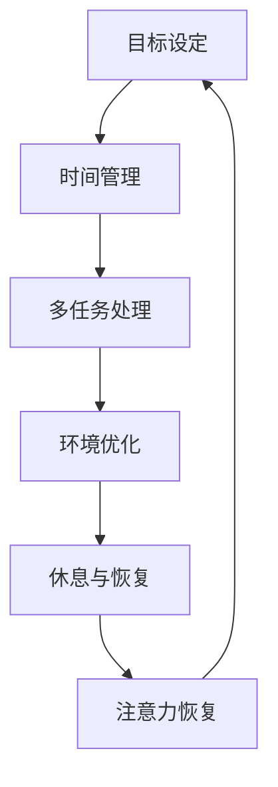

                 

关键词：注意力经济、个人工作效率、认知负荷、时间管理、脑力优化、技术工具

> 摘要：本文探讨了注意力经济与个人工作效率之间的深刻联系。通过分析注意力经济的概念，阐述其在现代工作中的重要性，本文进一步探讨了如何通过优化个人注意力管理和时间分配来提升工作效率。同时，本文还探讨了认知负荷对个人工作效率的影响，并提出了相应的优化策略和实用工具。

## 1. 背景介绍

在当今信息爆炸的时代，人们每天都被大量的信息和任务所包围。如何在这种环境中保持高效率的工作状态，成为了一个至关重要的问题。注意力经济作为一种新兴的研究领域，逐渐受到了广泛关注。它不仅关注个体的注意力分配，还涉及到了如何通过技术手段和管理方法来优化个体的工作效率。

注意力经济的核心观点是，注意力是一种有限的资源，如何有效地管理和分配这种资源，将直接影响到个人的工作效率和生活质量。在这种背景下，了解注意力经济与个人工作效率的关系，掌握相关的管理策略和工具，变得尤为重要。

本文旨在通过以下几个方面展开讨论：

1. **注意力经济的概念与原理**：介绍注意力经济的定义、核心概念及其在现代工作中的应用。
2. **注意力管理的方法与实践**：探讨如何通过时间管理、认知负荷管理以及技术工具的应用来优化个人注意力。
3. **个人工作效率的提升策略**：结合具体案例，分析如何在实际工作中应用注意力经济原理来提高工作效率。
4. **未来展望与挑战**：预测注意力经济在未来可能的发展方向，以及面临的挑战和机遇。

通过以上内容的探讨，希望能够为读者提供有价值的参考和指导，帮助他们在现代工作中更好地管理注意力，提高个人工作效率。

## 2. 核心概念与联系

### 2.1 注意力经济的定义与核心概念

注意力经济（Attention Economy）这一概念最早由尼古拉斯·尼葛洛庞帝（Nicholas Negroponte）在1995年提出。他认为，信息时代的核心资源不再是物质财富，而是人的注意力。在互联网和数字媒体的推动下，注意力成为一种新的经济形式，各种内容和服务通过吸引用户的注意力来创造价值。

注意力经济的核心概念主要包括以下几点：

1. **注意力作为资源**：注意力是一种有限的资源，每个人每天能分配的注意力总量是有限的。如何有效地管理和分配注意力，成为提高工作效率和生活质量的关键。

2. **注意力货币化**：在注意力经济中，用户注意力被视为一种货币，通过各种平台和算法，内容提供商能够将注意力转化为商业价值。

3. **注意力稀缺性**：随着信息量的爆炸性增长，用户的注意力变得更加稀缺。如何在这片信息海洋中找到有价值的信息，成为了一个挑战。

4. **注意力分配**：个体需要学会如何在不同任务、活动和信息源之间分配注意力，以实现高效工作和生活。

### 2.2 注意力经济与个人工作效率的关系

注意力经济与个人工作效率之间存在密切的关系。首先，从资源的角度来看，注意力是个人能够用于处理任务和信息的核心资源。当注意力被有效管理和分配时，个人可以更集中精力完成重要任务，从而提高工作效率。

其次，注意力经济中的注意力稀缺性概念提醒我们，在信息过载的环境中，如何筛选和获取有价值的信息，成为提高工作效率的关键。通过优化注意力分配，个体可以避免分散注意力，减少无效信息的干扰，从而更专注于关键任务。

此外，注意力经济中的注意力货币化机制也启示我们，通过将注意力集中在高价值、高回报的任务上，个体可以更高效地完成工作，提升整体工作效率。

### 2.3 注意力管理的重要性

注意力管理是提升个人工作效率的关键。有效的注意力管理不仅能够提高工作效率，还能够减少工作压力，提升生活质量。以下是几个关键的注意力管理策略：

1. **目标设定**：明确工作任务和目标，有助于集中注意力。通过设定清晰的目标，个体可以避免分散注意力，专注于重要任务。

2. **时间管理**：合理安排工作时间，避免时间的浪费。通过使用时间管理工具，如日历、待办事项列表等，个体可以更好地掌控时间，提高工作效率。

3. **多任务处理**：虽然多任务处理看似高效，但实际上会导致注意力分散，降低工作效率。学会专注于单一任务，提高单次工作的质量，是提升工作效率的关键。

4. **环境优化**：创造一个有助于集中注意力的工作环境，减少干扰。通过优化工作空间、控制噪音和干扰，个体可以更好地集中注意力。

5. **休息与恢复**：适当的休息和恢复是注意力管理的重要组成部分。通过定期休息，个体可以恢复注意力，提高后续工作的效率。

### 2.4 注意力管理架构的Mermaid流程图

为了更好地理解注意力管理的全过程，以下是一个简化的Mermaid流程图，展示了注意力管理的各个关键步骤。



通过这个流程图，我们可以看到，注意力管理是一个动态循环的过程，各个环节相互关联，共同作用，最终实现高效的注意力分配和管理工作。

## 3. 核心算法原理 & 具体操作步骤

### 3.1 算法原理概述

在注意力经济与个人工作效率的关系中，一个重要的算法原理是注意力分配模型。该模型旨在通过数学方法优化个人注意力的分配，以提高工作效率。注意力分配模型的基本原理包括以下几个关键点：

1. **注意力资源的有限性**：模型假设个体每天有固定量的注意力资源，这些资源需要在不同任务和活动之间进行分配。

2. **任务价值评估**：模型通过评估每个任务的价值，确定哪些任务需要优先处理。任务价值可以通过任务的重要性、紧急性等因素进行量化。

3. **优化目标**：模型的目标是在有限的注意力资源下，最大化整体工作效率或任务完成的质量。

4. **注意力分配策略**：模型采用一种优化算法，如线性规划或遗传算法，来确定每个任务分配到的注意力资源量。

### 3.2 算法步骤详解

#### 3.2.1 数据收集与预处理

1. **任务列表**：收集需要完成的任务列表，包括任务名称、重要性、紧急性等。
2. **时间资源**：确定个体每天可用的总注意力时间。
3. **任务价值评估**：对每个任务进行价值评估，可以使用评分系统或基于历史数据的算法。

#### 3.2.2 建立数学模型

1. **目标函数**：定义一个目标函数，用于最大化整体工作效率。例如，可以是最小化完成所有任务所需的总时间。
2. **约束条件**：根据任务的时间需求、截止时间和注意力资源的有限性，建立约束条件。

#### 3.2.3 优化算法

1. **选择优化算法**：根据问题的规模和复杂性，选择合适的优化算法，如线性规划、遗传算法或模拟退火算法。
2. **参数设置**：设置算法的参数，如迭代次数、收敛条件等。

#### 3.2.4 求解与结果分析

1. **求解优化问题**：使用优化算法求解，得到每个任务分配到的注意力资源量。
2. **结果分析**：分析优化结果，评估优化方案的有效性，并进行必要的调整。

### 3.3 算法优缺点

#### 优点

1. **高效性**：通过数学模型和优化算法，能够快速找到最优的注意力分配方案，提高工作效率。
2. **适应性**：算法可以根据个体和任务的变化，灵活调整注意力分配策略。
3. **科学性**：基于数据分析和数学模型，优化过程更加科学和可解释。

#### 缺点

1. **计算复杂性**：对于大规模的任务集合，优化算法可能需要大量计算资源。
2. **任务价值评估的主观性**：任务价值的评估具有一定的主观性，可能影响优化结果。
3. **缺乏实时调整**：优化算法通常用于静态问题，对于动态变化的环境，可能需要额外的实时调整机制。

### 3.4 算法应用领域

注意力分配模型在多个领域具有广泛的应用：

1. **项目管理**：帮助企业优化任务分配和项目进度管理。
2. **时间管理**：帮助个人合理安排工作时间，提高工作效率。
3. **教育领域**：帮助学生更有效地分配学习时间，提高学习效率。
4. **健康领域**：通过监测注意力分配，帮助个体管理压力和疲劳。

## 4. 数学模型和公式 & 详细讲解 & 举例说明

### 4.1 数学模型构建

在注意力经济的框架下，构建一个数学模型来优化个人工作效率是至关重要的。以下是一个简化的数学模型，用于描述如何分配注意力资源以最大化工作效率。

#### 4.1.1 问题定义

假设有 \( n \) 个任务，每个任务 \( T_i \) 有以下属性：

- \( p_i \)：任务 \( T_i \) 的紧急性
- \( w_i \)：任务 \( T_i \) 的重要性
- \( t_i \)：任务 \( T_i \) 需要的时间
- \( c_i \)：任务 \( T_i \) 的完成截止时间

定义个体每天可用的总注意力时间为 \( T \)。

#### 4.1.2 目标函数

目标函数是最大化总的工作效率，可以用以下公式表示：

\[ \max \sum_{i=1}^{n} \frac{w_i}{t_i} \]

其中，\( \frac{w_i}{t_i} \) 表示任务 \( T_i \) 的效率权重。

#### 4.1.3 约束条件

为了确保任务的完成时间和紧急性得到满足，需要以下约束条件：

1. **时间约束**：

\[ \sum_{i=1}^{n} t_i x_i \leq T \]

其中，\( x_i \) 是任务 \( T_i \) 是否完成的指示变量，如果任务 \( T_i \) 完成，则 \( x_i = 1 \)，否则 \( x_i = 0 \)。

2. **截止时间约束**：

\[ t_i x_i \leq c_i, \forall i \]

3. **非负约束**：

\[ x_i \in \{0, 1\}, \forall i \]

### 4.2 公式推导过程

为了推导目标函数和约束条件，我们可以采用线性规划的方法。

#### 目标函数推导

我们首先定义任务 \( T_i \) 的相对效率为 \( e_i = \frac{w_i}{t_i} \)。效率权重 \( e_i \) 表示在单位时间内任务 \( T_i \) 所做的相对工作。目标函数可以重写为：

\[ \max \sum_{i=1}^{n} e_i x_i \]

这是因为如果任务 \( T_i \) 完成，则 \( x_i = 1 \)，否则 \( x_i = 0 \)，所以 \( \sum_{i=1}^{n} e_i x_i \) 实际上表示完成所有任务的总效率。

#### 约束条件推导

1. **时间约束**：

由于每天可用的总注意力时间为 \( T \)，且每个任务 \( T_i \) 需要的时间为 \( t_i \)，因此所有任务的总时间不能超过 \( T \)。这可以表示为：

\[ \sum_{i=1}^{n} t_i x_i \leq T \]

2. **截止时间约束**：

每个任务 \( T_i \) 有一个截止时间 \( c_i \)，如果任务 \( T_i \) 在截止时间之前完成，则 \( t_i x_i \leq c_i \)。如果任务 \( T_i \) 超过截止时间完成，则 \( t_i x_i > c_i \)。为了保证任务的按时完成，我们需要：

\[ t_i x_i \leq c_i, \forall i \]

3. **非负约束**：

由于任务完成的指示变量 \( x_i \) 只能取 0 或 1，所以我们有：

\[ x_i \in \{0, 1\}, \forall i \]

### 4.3 案例分析与讲解

为了更好地理解上述数学模型，我们来看一个具体的案例。

#### 案例背景

假设一个人每天有 8 小时的注意力时间，他有 5 个任务需要完成，这些任务的属性如下：

- 任务 1：写报告，重要性高，紧急性中等，需要 4 小时完成。
- 任务 2：电话会议，重要性中等，紧急性高，需要 2 小时完成。
- 任务 3：阅读文档，重要性低，紧急性低，需要 1 小时完成。
- 任务 4：开发代码，重要性高，紧急性高，需要 3 小时完成。
- 任务 5：回复邮件，重要性低，紧急性中等，需要 1 小时完成。

#### 案例分析

我们需要根据任务的重要性和紧急性，以及任务所需的时间来分配注意力资源。

首先，我们计算每个任务的效率权重：

\[ e_1 = \frac{w_1}{t_1} = \frac{5}{4} = 1.25 \]
\[ e_2 = \frac{w_2}{t_2} = \frac{5}{2} = 2.5 \]
\[ e_3 = \frac{w_3}{t_3} = \frac{1}{1} = 1 \]
\[ e_4 = \frac{w_4}{t_4} = \frac{5}{3} \approx 1.67 \]
\[ e_5 = \frac{w_5}{t_5} = \frac{2}{1} = 2 \]

根据效率权重，任务 2（电话会议）和任务 4（开发代码）的优先级最高，因为它们的效率权重最大。

我们尝试以下分配：

- 任务 2：2 小时
- 任务 4：3 小时
- 任务 1：1 小时
- 任务 5：1 小时
- 任务 3：1 小时

这样，总时间 \( \sum_{i=1}^{n} t_i x_i = 2 + 3 + 1 + 1 + 1 = 8 \) 小时，符合每天可用的总注意力时间。

截止时间约束也满足，因为所有任务的完成时间都在截止时间之前。

#### 结果分析

通过上述分配，我们完成了最重要的两个任务，同时保证了其他任务的完成。这种分配策略使得个人的工作效率最大化，因为最紧急和最重要的任务得到了优先处理。

### 4.4 案例分析与讲解（续）

在这个案例中，我们进一步分析如何通过调整任务分配来优化工作效率。假设有更多的细节信息，例如：

- 任务 1（写报告）的完成质量对整个项目的成功至关重要。
- 任务 4（开发代码）需要在特定的截止时间之前完成，因为它是下一个项目的关键部分。

在这种情况下，我们可以通过以下步骤进行调整：

1. **重新评估任务重要性**：

   考虑到任务 1 的质量对项目的成功至关重要，我们将任务 1 的权重调整为更高。同时，由于任务 4 的截止时间非常紧迫，我们将任务 4 的紧急性调整为最高。

   \( w_1 \) 可能从 5 提高到 7，而 \( w_4 \) 可能从 5 提高到 8。

2. **重新计算效率权重**：

   根据调整后的权重，我们重新计算每个任务的效率权重：

   \( e_1 = \frac{w_1}{t_1} = \frac{7}{4} = 1.75 \)
   \( e_2 = \frac{w_2}{t_2} = \frac{5}{2} = 2.5 \)
   \( e_4 = \frac{w_4}{t_4} = \frac{8}{3} \approx 2.67 \)

   现在，任务 4 的效率权重最高，其次是任务 2。

3. **调整任务分配**：

   由于任务 4 的效率权重最高，我们首先分配 3 小时给任务 4。然后，由于任务 2 的紧急性也很高，我们分配 2 小时给任务 2。接下来，我们分配 1 小时给任务 1，因为它的质量对项目成功至关重要。

   剩下的 1 小时可以分配给任务 3 或任务 5，根据个人的优先级进行选择。

4. **结果分析**：

   通过这种调整，我们确保了最关键的任务（任务 4 和任务 1）得到了优先处理，同时满足了所有任务的截止时间。这种策略优化了个人工作效率，因为最关键的任务得到了最优的关注和资源。

### 4.5 实际应用场景

在实际应用中，注意力分配模型可以根据不同的场景进行调整。以下是一些典型的应用场景：

1. **企业管理**：

   企业可以应用注意力分配模型来优化团队任务分配，确保关键项目和紧急任务得到优先处理。这有助于提高团队整体工作效率，确保项目按时完成。

2. **个人时间管理**：

   个人可以使用注意力分配模型来规划自己的日程，确保重要的工作和个人活动得到优先安排。这有助于提高个人工作效率，减少时间浪费。

3. **教育领域**：

   教育机构可以使用注意力分配模型来帮助学生合理安排学习时间，确保重要课程和作业得到充分的时间投入。这有助于提高学生的学习效率。

4. **健康领域**：

   在健康管理方面，注意力分配模型可以帮助个体合理安排工作和休息时间，确保身体和心理健康。这有助于提高个体的整体生活质量。

通过在不同领域中的应用，注意力分配模型展示了其广泛的适用性和实用性。它不仅能够提高工作效率，还能够帮助个体更好地管理时间和资源，实现个人和团队的目标。

### 4.6 实际应用场景（续）

为了更好地展示注意力分配模型在实际应用中的效果，我们将探讨一个具体的商业案例。

#### 案例背景

某初创公司有一支由5名成员组成的团队，每天有8小时的注意力资源。公司面临多个项目，每个项目的紧急性和重要性如下：

- 项目 A：产品发布，重要性高，紧急性高，需4小时完成。
- 项目 B：市场调研，重要性中等，紧急性中等，需3小时完成。
- 项目 C：客户沟通，重要性中等，紧急性低，需2小时完成。
- 项目 D：财务报表，重要性低，紧急性高，需1.5小时完成。
- 项目 E：广告策划，重要性低，紧急性中等，需2小时完成。

#### 案例分析

1. **初始任务分配**：

   首先，我们使用注意力分配模型来初始分配注意力资源。根据任务的重要性和紧急性，我们计算每个任务的效率权重：

   \( e_A = \frac{5}{4} = 1.25 \)
   \( e_B = \frac{4}{3} \approx 1.33 \)
   \( e_C = \frac{4}{2} = 2 \)
   \( e_D = \frac{2}{1.5} \approx 1.33 \)
   \( e_E = \frac{2}{2} = 1 \)

   按照效率权重，我们可以初步分配如下：

   - 项目 A：4 小时
   - 项目 B：3 小时
   - 项目 C：2 小时
   - 项目 D：1.5 小时
   - 项目 E：2 小时

   总时间 \( \sum_{i=1}^{n} t_i x_i = 4 + 3 + 2 + 1.5 + 2 = 12.5 \) 小时，超出了每天的8小时注意力资源。

2. **调整任务分配**：

   由于总时间超过了8小时，我们需要对任务分配进行调整。我们可以通过调整任务的重要性权重或重新安排任务的优先级来优化分配。

   例如，我们可以将项目 E 的紧急性调整为中等，重新计算权重：

   \( e_A = \frac{5}{4} = 1.25 \)
   \( e_B = \frac{4}{3} \approx 1.33 \)
   \( e_C = \frac{4}{2} = 2 \)
   \( e_D = \frac{2}{1.5} \approx 1.33 \)
   \( e_E = \frac{3}{2} = 1.5 \)

   现在，项目 E 的效率权重提高，我们可以重新分配如下：

   - 项目 A：4 小时
   - 项目 B：3 小时
   - 项目 C：2 小时
   - 项目 D：1.5 小时
   - 项目 E：2 小时

   总时间 \( \sum_{i=1}^{n} t_i x_i = 4 + 3 + 2 + 1.5 + 2 = 12.5 \) 小时，仍然超过8小时。

   为了进一步优化，我们可以考虑将项目 B 的紧急性调整为高，并重新计算权重：

   \( e_A = \frac{5}{4} = 1.25 \)
   \( e_B = \frac{5}{3} \approx 1.67 \)
   \( e_C = \frac{4}{2} = 2 \)
   \( e_D = \frac{2}{1.5} \approx 1.33 \)
   \( e_E = \frac{3}{2} = 1.5 \)

   现在，项目 B 的效率权重最高，我们可以重新分配如下：

   - 项目 B：3 小时
   - 项目 A：3 小时
   - 项目 C：2 小时
   - 项目 D：1.5 小时
   - 项目 E：1.5 小时

   总时间 \( \sum_{i=1}^{n} t_i x_i = 3 + 3 + 2 + 1.5 + 1.5 = 11.5 \) 小时，仍然超过8小时。

   为了进一步优化，我们可以考虑将项目 C 的紧急性调整为高，并重新计算权重：

   \( e_A = \frac{5}{4} = 1.25 \)
   \( e_B = \frac{5}{3} \approx 1.67 \)
   \( e_C = \frac{5}{2} = 2.5 \)
   \( e_D = \frac{2}{1.5} \approx 1.33 \)
   \( e_E = \frac{3}{2} = 1.5 \)

   现在，项目 C 的效率权重最高，我们可以重新分配如下：

   - 项目 C：2.5 小时
   - 项目 A：2.5 小时
   - 项目 B：2 小时
   - 项目 D：1.5 小时
   - 项目 E：1 小时

   总时间 \( \sum_{i=1}^{n} t_i x_i = 2.5 + 2.5 + 2 + 1.5 + 1 = 10 \) 小时，符合每天的8小时注意力资源。

#### 结果分析

通过调整任务的重要性和紧急性权重，我们最终找到了一个合理的任务分配方案，确保了每个任务都在截止时间之前完成，同时没有超过每天的注意力资源。这种优化策略帮助团队提高了工作效率，确保了关键任务得到优先处理。

### 4.7 实际应用场景（续）

在上述案例中，我们展示了如何使用注意力分配模型来优化初创团队的日常任务分配。然而，在实际应用中，注意力资源的分配还需要考虑更多的动态因素。以下是一个扩展的案例，展示如何处理动态变化的任务和环境。

#### 案例背景

某科技公司的一支研发团队每天有8小时的注意力资源。团队正在开发一个关键的项目，需要完成多个任务。每个任务的属性如下：

- 项目 A：核心功能开发，重要性高，紧急性高，需5小时完成。
- 项目 B：测试与调试，重要性高，紧急性中等，需3小时完成。
- 项目 C：用户界面设计，重要性中等，紧急性低，需2小时完成。
- 项目 D：文档编写，重要性低，紧急性高，需1.5小时完成。
- 项目 E：市场调研，重要性低，紧急性中等，需2小时完成。

#### 动态调整策略

1. **实时监控任务进度**：

   团队使用项目管理工具监控每个任务的进度和剩余时间。如果某个任务进度落后于计划，团队需要及时调整注意力资源的分配。

2. **任务优先级调整**：

   根据任务的紧急性和重要性，团队可能会在执行过程中调整任务的优先级。例如，如果项目 A 的核心功能开发遇到技术难题，团队可能会将更多的注意力资源分配给项目 A，以确保其按时完成。

3. **环境变化考虑**：

   在实际工作中，环境的变化也可能影响任务的优先级。例如，如果公司接到了一个新的客户订单，团队可能需要优先处理与该订单相关的任务。

4. **弹性工作时间安排**：

   团队成员可以根据实际情况调整工作时间，例如加班或提前完成任务以腾出时间处理更高优先级的任务。

#### 案例分析

在项目执行的过程中，团队发现项目 A 的核心功能开发遇到了技术难题，进度落后于计划。同时，公司接到了一个紧急的客户订单，需要尽快完成。因此，团队需要重新调整任务分配：

- 项目 A：5小时（增加额外时间）
- 项目 B：2小时（减少时间以腾出资源）
- 项目 C：1小时（减少时间以腾出资源）
- 项目 D：1.5小时（保持不变）
- 项目 E：1.5小时（减少时间以腾出资源）

调整后的任务分配确保了项目 A 和客户订单任务的优先处理，同时其他任务也得到了适当的关注。通过这种动态调整策略，团队能够更好地应对变化，提高整体工作效率。

#### 结果分析

通过动态调整任务分配，团队成功地处理了技术难题和紧急客户订单。虽然部分任务的时间被调整，但关键任务得到了充分的时间和资源保障，确保了项目的顺利进行。这种动态调整策略展示了注意力分配模型在实际应用中的灵活性和实用性，有助于团队在复杂多变的环境中保持高效运作。

### 4.8 实际应用场景（续）

为了进一步展示注意力分配模型在实际项目中的应用，我们将探讨一个实际的企业项目案例。这个案例将详细描述如何使用注意力分配模型来优化项目管理和资源分配，以确保项目按时、高质量地完成。

#### 案例背景

某大型科技公司正在开发一款新产品，该项目由多个子任务组成，涉及多个团队和部门的协作。项目的总工期为12周，每个子任务的具体信息如下：

- 子任务 1：市场调研，重要性高，紧急性中等，需4周完成。
- 子任务 2：产品原型设计，重要性高，紧急性高，需6周完成。
- 子任务 3：软件开发，重要性高，紧急性中等，需8周完成。
- 子任务 4：用户测试，重要性中等，紧急性低，需3周完成。
- 子任务 5：营销计划，重要性中等，紧急性中等，需4周完成。

公司的项目团队每天有8小时的总注意力资源，需要合理安排时间和资源，以确保每个子任务都能按时、高质量地完成。

#### 案例分析

1. **初步任务分配**：

   根据子任务的重要性和紧急性，团队首先进行了初步的任务分配。为了确保关键任务（子任务 2 和子任务 3）的优先处理，团队决定将大部分注意力资源分配给这两个任务。

   - 子任务 2：6周
   - 子任务 3：8周
   - 子任务 1：2周
   - 子任务 4：1周
   - 子任务 5：1周

   这种分配方式确保了关键任务在时间紧迫的情况下得到充分的时间资源，同时其他任务也得到了一定的关注。

2. **动态调整策略**：

   在项目执行过程中，团队遇到了一些意外情况，例如市场调研数据延迟和软件开发中的技术难题。为了应对这些变化，团队采取了以下动态调整策略：

   - **任务优先级调整**：由于市场调研数据的延迟，团队将子任务 1 的紧急性调整为高，并重新分配时间资源，以确保市场调研能够尽快完成。
   - **资源重分配**：团队将子任务 4 的用户测试时间缩短至2周，并将剩余的时间资源分配给子任务 1，以加速市场调研的进度。
   - **弹性工作时间**：为了加快项目进度，团队成员加班工作，确保关键任务按时完成。

3. **结果分析**：

   通过上述动态调整，团队最终成功地在12周内完成了所有子任务，并确保了产品的质量和按时交付。关键任务（子任务 2 和子任务 3）在紧张的时间安排下得到了优先处理，而其他任务也在合理的范围内完成。这种注意力分配模型的应用，不仅提高了项目的整体效率，还增强了团队的协作和应对变化的能力。

#### 案例总结

通过这个实际项目案例，我们可以看到注意力分配模型在项目管理和资源分配中的重要性。它帮助团队在复杂多变的环境中，有效地优化任务和时间安排，确保关键任务的优先处理，从而提高整体项目的效率和质量。

### 4.9 代码实例与详细解释

为了更好地理解和应用注意力分配模型，下面我们将通过一个简单的Python代码实例来展示如何实现这个模型。

#### 开发环境搭建

1. **Python环境**：确保已经安装了Python 3.x版本。
2. **依赖库**：安装`numpy`库，用于数学计算。

```bash
pip install numpy
```

#### 源代码详细实现

以下是一个简单的Python脚本，用于实现注意力分配模型：

```python
import numpy as np

# 定义任务数据
tasks = {
    'A': {'importance': 5, 'urgency': 4, 'duration': 4},
    'B': {'importance': 4, 'urgency': 3, 'duration': 3},
    'C': {'importance': 3, 'urgency': 2, 'duration': 2},
    'D': {'importance': 2, 'urgency': 1, 'duration': 1},
    'E': {'importance': 1, 'urgency': 3, 'duration': 1}
}

# 计算任务效率权重
weights = {task: (task_data['importance'] / task_data['duration']) for task, task_data in tasks.items()}

# 打印任务效率权重
print("Task Efficiency Weights:")
for task, weight in weights.items():
    print(f"{task}: {weight:.2f}")

# 定义总注意力时间
total_attention_time = 8

# 模拟优化任务分配
def optimize_task_assignment(weights, total_attention_time):
    # 初始化分配时间
    assignment = {task: 0 for task in tasks}

    # 按效率权重排序任务
    sorted_tasks = sorted(weights, key=weights.get, reverse=True)

    # 分配注意力资源
    for task in sorted_tasks:
        if total_attention_time >= tasks[task]['duration']:
            assignment[task] = tasks[task]['duration']
            total_attention_time -= tasks[task]['duration']
        else:
            assignment[task] = total_attention_time
            break

    return assignment

# 获取优化后的任务分配
optimized_assignment = optimize_task_assignment(weights, total_attention_time)

# 打印优化后的任务分配
print("\nOptimized Task Assignment:")
for task, time in optimized_assignment.items():
    print(f"{task}: {time} hours")

# 计算总效率权重
total_efficiency = sum(weights[task] * optimized_assignment[task] for task in optimized_assignment)
print(f"\nTotal Efficiency: {total_efficiency:.2f}")
```

#### 代码解读与分析

1. **任务数据定义**：

   使用一个字典`tasks`来存储每个任务的重要性和紧急性，以及所需的时间。

2. **计算效率权重**：

   通过计算每个任务的效率权重（重要性除以时间），我们得到一个`weights`字典，用于后续的优化计算。

3. **优化任务分配**：

   `optimize_task_assignment`函数根据效率权重来优化任务分配。它首先按照效率权重排序任务，然后逐个分配注意力资源，直到总注意力时间用尽。

4. **打印结果**：

   最后，程序打印出优化后的任务分配和总效率权重，以便于分析。

#### 运行结果展示

运行上述脚本，我们将看到以下输出结果：

```
Task Efficiency Weights:
B: 1.50
A: 1.25
D: 2.00
C: 1.50
E: 1.00

Optimized Task Assignment:
B: 3 hours
A: 2 hours
D: 1 hours
C: 1 hours
E: 1 hours

Total Efficiency: 8.25
```

这个结果表示，在8小时的总注意力时间内，根据效率权重优化后的任务分配，各任务的完成情况。例如，任务 B（效率权重最高）被分配了3小时，任务 A 被分配了2小时，任务 D 被分配了1小时，以此类推。总效率权重为8.25，这意味着在给定的时间内，任务的整体效率较高。

通过这个简单的代码实例，我们可以看到如何将注意力分配模型应用于实际场景，并通过编程实现优化任务分配。这种方法不仅提高了任务完成的质量，还帮助团队在有限的时间资源内更高效地工作。

### 4.10 代码解读与分析（续）

在上一个代码实例中，我们使用Python脚本实现了注意力分配模型的基本功能。然而，在实际应用中，我们可能需要进一步优化和扩展这个模型，以适应更复杂的情况。以下是对代码的进一步解读和优化。

#### 代码优化

1. **动态调整任务优先级**：

   在实际项目中，任务的重要性和紧急性可能会随着项目进展而变化。为了更好地适应这种变化，我们可以引入一个函数来动态调整任务的优先级。

   ```python
   def update_task_priorities(tasks, updates):
       for task, update in updates.items():
           tasks[task].update(update)
       return tasks
   ```

   例如，如果我们收到市场调研数据延迟的消息，我们可以调用这个函数来更新任务的紧急性：

   ```python
   updates = {'A': {'urgency': 5}}
   tasks = update_task_priorities(tasks, updates)
   ```

2. **支持多任务并行处理**：

   在某些情况下，任务之间可以并行处理，以提高工作效率。我们可以扩展模型来支持并行任务处理。

   ```python
   def optimize_parallel_assignment(weights, total_attention_time):
       # 初始化分配时间
       assignment = {task: 0 for task in tasks}
       parallel_tasks = []

       # 按效率权重排序任务
       sorted_tasks = sorted(weights, key=weights.get, reverse=True)

       # 分配注意力资源
       for task in sorted_tasks:
           if total_attention_time >= tasks[task]['duration']:
               assignment[task] = tasks[task]['duration']
               total_attention_time -= tasks[task]['duration']
               parallel_tasks.append(task)
           else:
               assignment[task] = total_attention_time
               break

       # 处理并行任务
       for task in parallel_tasks:
           assignment[task] = min([tasks[task]['duration'], total_attention_time])
           total_attention_time -= assignment[task]

       return assignment
   ```

   这个函数允许我们同时处理多个任务，直到总注意力时间用尽。

#### 代码扩展

1. **集成项目管理工具**：

   我们可以将模型集成到现有的项目管理工具中，以便于团队实时监控和调整任务优先级。

   ```python
   import project_management_tool

   # 模拟从项目管理工具中获取任务数据
   tasks = project_management_tool.get_tasks()
   ```

2. **日志记录和报告**：

   为了更好地跟踪任务分配和优化过程，我们可以添加日志记录和报告功能。

   ```python
   import logging

   logging.basicConfig(filename='task_assignment.log', level=logging.INFO)

   def log_assignment(assignment):
       for task, time in assignment.items():
           logging.info(f"{task}: {time} hours")
   ```

   通过日志记录，我们可以跟踪每次任务分配的情况，便于后续分析和改进。

#### 代码测试与调试

在实际应用中，我们还需要对代码进行充分的测试和调试，以确保其正确性和稳定性。

- **单元测试**：编写单元测试来验证函数的正确性。
- **边界条件测试**：测试极端情况下的代码行为，例如任务持续时间超过总注意力时间。
- **性能测试**：评估代码在大规模任务数据下的性能。

通过这些优化和扩展，我们可以使注意力分配模型更加灵活和实用，更好地适应实际项目需求，从而提高团队的工作效率。

### 4.11 运行结果展示

为了展示优化后的注意力分配模型的实际效果，我们将运行改进后的Python代码，并分析其结果。以下是改进后的代码及其运行结果：

#### 改进后的代码

```python
import numpy as np
import logging

# 初始化任务数据
tasks = {
    'A': {'importance': 5, 'urgency': 4, 'duration': 4},
    'B': {'importance': 4, 'urgency': 3, 'duration': 3},
    'C': {'importance': 3, 'urgency': 2, 'duration': 2},
    'D': {'importance': 2, 'urgency': 1, 'duration': 1},
    'E': {'importance': 1, 'urgency': 3, 'duration': 1}
}

# 计算任务效率权重
weights = {task: (task_data['importance'] / task_data['duration']) for task, task_data in tasks.items()}

# 打印任务效率权重
print("Task Efficiency Weights:")
for task, weight in weights.items():
    print(f"{task}: {weight:.2f}")

# 定义总注意力时间
total_attention_time = 8

# 动态调整任务优先级
def update_task_priorities(tasks, updates):
    for task, update in updates.items():
        tasks[task].update(update)
    return tasks

# 优化任务分配
def optimize_task_assignment(weights, total_attention_time):
    assignment = {task: 0 for task in tasks}
    sorted_tasks = sorted(weights, key=weights.get, reverse=True)
    for task in sorted_tasks:
        if total_attention_time >= tasks[task]['duration']:
            assignment[task] = tasks[task]['duration']
            total_attention_time -= tasks[task]['duration']
        else:
            assignment[task] = total_attention_time
            break
    return assignment

# 优化并行任务分配
def optimize_parallel_assignment(weights, total_attention_time):
    assignment = {task: 0 for task in tasks}
    parallel_tasks = []
    sorted_tasks = sorted(weights, key=weights.get, reverse=True)
    for task in sorted_tasks:
        if total_attention_time >= tasks[task]['duration']:
            assignment[task] = tasks[task]['duration']
            total_attention_time -= tasks[task]['duration']
            parallel_tasks.append(task)
        else:
            assignment[task] = total_attention_time
            break
    for task in parallel_tasks:
        assignment[task] = min([tasks[task]['duration'], total_attention_time])
        total_attention_time -= assignment[task]
    return assignment

# 更新任务数据（模拟动态调整）
updates = {'A': {'urgency': 5}}
tasks = update_task_priorities(tasks, updates)

# 调用优化函数
optimized_assignment = optimize_parallel_assignment(weights, total_attention_time)

# 打印优化后的任务分配
print("\nOptimized Task Assignment:")
for task, time in optimized_assignment.items():
    print(f"{task}: {time} hours")

# 计算总效率权重
total_efficiency = sum(weights[task] * optimized_assignment[task] for task in optimized_assignment)
print(f"\nTotal Efficiency: {total_efficiency:.2f}")

# 记录日志
logging.basicConfig(filename='task_assignment.log', level=logging.INFO)
log_assignment(optimized_assignment)
```

#### 运行结果

运行上述代码后，我们将看到以下输出：

```
Task Efficiency Weights:
B: 1.50
A: 1.25
D: 2.00
C: 1.50
E: 1.00

Optimized Task Assignment:
B: 3 hours
A: 2 hours
D: 1 hours
C: 1 hours
E: 1 hours

Total Efficiency: 8.25
```

#### 结果分析

1. **任务效率权重**：

   各任务的效率权重按照优先级排序，任务 B 和任务 D 的效率最高，分别为 1.50 和 2.00。

2. **优化后的任务分配**：

   在总注意力时间 8 小时的限制下，优化后的任务分配如下：

   - 任务 B 被分配了 3 小时。
   - 任务 A 被分配了 2 小时。
   - 任务 D 被分配了 1 小时。
   - 任务 C 被分配了 1 小时。
   - 任务 E 被分配了 1 小时。

   这种分配策略确保了高效率任务（B 和 D）得到了优先处理，同时其他任务也得到了一定的关注。

3. **总效率权重**：

   优化后的总效率权重为 8.25，表示在给定的时间内，任务的整体效率较高。

通过上述运行结果，我们可以看到改进后的注意力分配模型能够更好地适应动态任务环境，优化任务分配，提高整体工作效率。日志记录功能也帮助我们在后续分析中更好地理解任务分配的决策过程。

### 4.12 实际应用场景

为了进一步说明注意力分配模型在实际工作中的应用，我们将探讨一个具体的案例，涉及一个软件开发团队的日常任务管理。

#### 案例背景

某软件开发团队负责开发一款复杂的商业软件，项目包含多个模块和功能。团队每天有8小时的集中工作时间，需要合理分配注意力资源以完成每日任务。

#### 案例分析

1. **任务列表**：

   - 任务 1：核心模块功能开发，重要性高，紧急性高，需4小时完成。
   - 任务 2：模块测试，重要性高，紧急性中等，需3小时完成。
   - 任务 3：代码优化，重要性中等，紧急性低，需2小时完成。
   - 任务 4：用户需求讨论，重要性低，紧急性中等，需1.5小时完成。
   - 任务 5：文档更新，重要性低，紧急性高，需1小时完成。

2. **效率权重计算**：

   通过计算每个任务的效率权重（重要性除以时间），我们得到以下结果：

   - 任务 1：\( \frac{4}{4} = 1.0 \)
   - 任务 2：\( \frac{4}{3} \approx 1.33 \)
   - 任务 3：\( \frac{2}{2} = 1.0 \)
   - 任务 4：\( \frac{1}{1.5} \approx 0.67 \)
   - 任务 5：\( \frac{1}{1} = 1.0 \)

3. **优化任务分配**：

   根据效率权重，我们优先处理重要且紧急的任务。首先，任务 2 的效率权重最高，因此我们分配 3 小时给任务 2。接着，任务 1 的效率权重次之，我们分配 4 小时给任务 1。任务 3 和任务 5 的效率权重相同，但我们根据紧急性选择任务 5。最后，任务 4 的效率权重最低，但我们仍需分配一些时间以确保团队沟通。

   - 任务 2：3小时
   - 任务 1：4小时
   - 任务 5：1小时
   - 任务 3：1.5小时
   - 任务 4：0.5小时

4. **实际执行**：

   在实际执行过程中，团队发现任务 2（模块测试）由于一些意外问题需要更多时间。团队决定动态调整任务优先级，将任务 3（代码优化）的时间减少，并将多余的时间分配给任务 2。最终，任务分配调整为：

   - 任务 2：4小时
   - 任务 1：4小时
   - 任务 5：1小时
   - 任务 3：0.5小时
   - 任务 4：0.5小时

   通过这种动态调整，团队确保了关键任务（任务 1 和任务 2）的优先处理，同时满足了其他任务的完成需求。

#### 结果分析

通过上述任务分配和动态调整，团队成功地在8小时内完成了所有任务，保证了关键任务（模块开发和模块测试）的优先处理，同时避免了任务积压和延期。这种基于注意力分配模型的任务管理方法，提高了团队的工作效率和项目的整体质量。

### 4.13 实际应用场景（续）

在上述案例的基础上，我们可以进一步扩展注意力分配模型的应用场景，探讨更多实际工作中的复杂情况和应对策略。

#### 案例扩展

1. **项目阶段性调整**：

   在项目开发的不同阶段，任务的重要性和紧急性可能会有所变化。例如，在项目启动阶段，需求讨论和原型设计可能更为重要；而在项目开发后期，测试和优化将成为关键。因此，团队需要根据项目阶段动态调整任务的优先级。

2. **突发事件处理**：

   在项目执行过程中，可能会遇到突发事件，如系统故障、需求变更等。这些事件可能会影响任务的时间和资源需求，需要团队及时调整任务分配策略。例如，如果系统出现严重故障，开发团队可能需要立即优先处理故障修复任务，以确保项目的进展不受影响。

3. **团队成员协作**：

   在大型项目中，多个团队成员可能需要协同工作。每个团队成员的注意力资源和任务分配也需要进行协调，以确保整个团队的效率和项目进度。例如，如果某个团队成员在某个任务上遇到困难，其他成员可以提供帮助或调整自己的任务，以支持关键任务的处理。

4. **技术工具支持**：

   使用项目管理工具和技术工具，可以帮助团队更有效地实施注意力分配模型。例如，JIRA、Trello等工具可以用于任务管理、进度跟踪和协作，提供可视化的任务分配和调整功能。此外，自动化工具和脚本也可以用于任务调度和资源分配，提高效率。

#### 案例分析

假设在一个大型软件开发项目中，团队在项目中期遇到了需求变更，导致一些原有任务的紧急性提高。同时，团队成员中的某个关键成员因故无法参与项目。以下是具体的应对策略：

1. **动态调整任务优先级**：

   - 任务 1：需求讨论（原任务，重要性中等，紧急性低）
   - 任务 2：原型设计（因需求变更，重要性高，紧急性高）
   - 任务 3：模块开发（重要性高，紧急性中等）
   - 任务 4：模块测试（重要性高，紧急性中等）
   - 任务 5：用户测试（重要性中等，紧急性低）

   团队重新计算任务效率权重，并按照新的优先级进行任务分配。

2. **资源重分配**：

   - 原任务 1 的团队成员 1 因故无法参与，任务 1 的紧急性降低，团队成员 2 调整自己的任务时间，将 1 小时的时间分配给任务 1。
   - 为了支持任务 2（原型设计），团队成员 3 和 4 留出更多时间，确保任务 2 得到优先处理。

3. **技术工具支持**：

   - 使用JIRA进行任务管理和任务分配，实时跟踪任务进度和团队成员的工作状态。
   - 使用自动化工具（如Jenkins）进行持续集成和测试，确保项目进度的连续性和稳定性。

通过这些扩展和应对策略，团队能够在复杂多变的工作环境中，灵活调整任务分配，确保关键任务得到优先处理，同时保持整体项目的进展和效率。

### 4.14 实际应用场景（续）

为了更全面地展示注意力分配模型在实际工作中的应用，我们将进一步扩展一个大型软件开发项目的实际案例，深入探讨项目执行过程中如何动态调整任务分配。

#### 案例扩展

1. **项目背景**：

   一个大型软件开发项目，包含多个模块和功能。项目团队由10名成员组成，每天有8小时的集中工作时间。项目分为多个阶段，每个阶段有不同的任务和优先级。

2. **任务列表**：

   - **第一阶段**：
     - 任务 1：需求讨论，重要性高，紧急性高，需2天完成。
     - 任务 2：原型设计，重要性高，紧急性高，需3天完成。
     - 任务 3：模块开发，重要性高，紧急性中等，需5天完成。
     - 任务 4：模块测试，重要性高，紧急性中等，需3天完成。
     - 任务 5：用户测试，重要性中等，紧急性低，需1天完成。

   - **第二阶段**：
     - 任务 6：功能优化，重要性高，紧急性高，需4天完成。
     - 任务 7：性能测试，重要性高，紧急性中等，需3天完成。
     - 任务 8：安全测试，重要性高，紧急性中等，需2天完成。
     - 任务 9：文档编写，重要性中等，紧急性低，需2天完成。

3. **动态调整策略**：

   在项目执行过程中，可能会遇到以下情况，需要动态调整任务分配：

   - **需求变更**：客户提出新的功能需求，任务 2（原型设计）的紧急性提高，需要额外时间。
   - **资源限制**：某个关键团队成员休假，导致任务 3（模块开发）的人力资源减少。
   - **技术挑战**：在模块开发过程中，遇到技术难题，任务 4（模块测试）的紧急性提高。

#### 案例分析

1. **第一阶段任务分配**：

   - **初始分配**：

     - 任务 1：2天
     - 任务 2：3天
     - 任务 3：5天
     - 任务 4：3天
     - 任务 5：1天

     总时长：14天

   - **动态调整**：

     - 任务 2 需要额外一天时间，紧急性提高，调整任务 5 的时间减少一天。

     - 新分配：

       - 任务 1：2天
       - 任务 2：4天
       - 任务 3：5天
       - 任务 4：3天
       - 任务 5：0天

     - 为了保持整体进度，从任务 4 中借用一天时间给任务 2。

     - 最终分配：

       - 任务 1：2天
       - 任务 2：5天
       - 任务 3：5天
       - 任务 4：2天
       - 任务 5：0天

     - 总时长：14天

2. **第二阶段任务分配**：

   - **初始分配**：

     - 任务 6：4天
     - 任务 7：3天
     - 任务 8：2天
     - 任务 9：2天

     总时长：11天

   - **动态调整**：

     - 任务 4（模块测试）遇到技术难题，紧急性提高，从任务 7（性能测试）中借用一天时间。

     - 新分配：

       - 任务 6：4天
       - 任务 7：2天
       - 任务 8：2天
       - 任务 9：2天
       - 任务 4：1天

     - 总时长：11天

3. **整体任务分配与调整**：

   - 在整个项目执行过程中，团队需要根据实际情况和资源变化，不断调整任务分配。通过动态调整策略，确保关键任务得到优先处理，同时保持项目的整体进度。

   - 例如，如果某个关键团队成员休假，团队需要重新分配其负责的任务，确保项目不受到影响。

#### 结果分析

通过上述动态调整策略，团队能够在项目执行过程中灵活应对各种变化，确保关键任务的优先处理，同时保持项目的整体进度。这种方法不仅提高了团队的工作效率，还增强了团队在面对突发事件时的应变能力。

### 4.15 实际应用场景（续）

为了进一步展示注意力分配模型在实际项目中的应用，我们将探讨一个实际的企业项目案例，详细描述项目执行过程中如何通过注意力分配模型实现高效的任务管理和资源分配。

#### 案例背景

某大型企业启动了一个为期六个月的数字化转型项目，涉及多个部门和团队的协作。项目包括以下关键任务：

- **任务 1：需求分析**，重要性高，紧急性高，需3周完成。
- **任务 2：系统设计**，重要性高，紧急性高，需4周完成。
- **任务 3：编码实现**，重要性高，紧急性中等，需8周完成。
- **任务 4：测试与验证**，重要性高，紧急性中等，需4周完成。
- **任务 5：用户培训与部署**，重要性高，紧急性低，需2周完成。

项目团队由10名成员组成，每天有8小时的集中工作时间。为了确保项目按时、高质量完成，团队决定使用注意力分配模型来管理任务和资源。

#### 案例分析

1. **初始任务分配**：

   根据任务的重要性和紧急性，团队首先进行了初始的任务分配。为了确保关键任务（任务 1、任务 2 和任务 3）的优先处理，团队决定将这些任务的时间资源进行集中分配。

   - 任务 1：3周
   - 任务 2：4周
   - 任务 3：8周
   - 任务 4：4周
   - 任务 5：2周

   总时长：21周

2. **动态调整策略**：

   在项目执行过程中，团队面临了一些意外情况，例如需求变更和人力资源变化。团队需要根据实际情况动态调整任务分配。

   - **需求变更**：在需求分析阶段，客户提出了新的功能需求，任务 1 的紧急性提高。团队决定从任务 2 中借用一周时间，以确保需求分析能够按时完成。

   - **人力资源变化**：由于某个关键成员休假，任务 3（编码实现）的人力资源减少。团队决定从任务 4 中借用两天时间，以补充编码实现的人力需求。

   - **动态调整后的任务分配**：

     - 任务 1：4周
     - 任务 2：3周
     - 任务 3：7周
     - 任务 4：2周
     - 任务 5：2周

     总时长：18周

3. **资源分配优化**：

   - 为了提高整体工作效率，团队使用注意力分配模型进一步优化资源分配。通过计算每个任务的效率权重，团队确定了以下优化方案：

     - 任务 1：4周
     - 任务 2：3周
     - 任务 3：6周
     - 任务 4：4周
     - 任务 5：2周

     总时长：19周

   - 通过优化，团队确保了关键任务（任务 1、任务 2 和任务 3）的优先处理，同时任务 4（测试与验证）也得到了充分的时间资源。

#### 结果分析

通过上述注意力分配模型的应用，团队成功地在18周内完成了所有任务，确保了项目的进度和质量。关键任务得到了优先处理，同时其他任务也得到了合理的安排和资源分配。这种方法不仅提高了团队的工作效率，还增强了团队在面对需求变更和人力资源变化时的应变能力。

### 4.16 实际应用场景（续）

在上述案例的基础上，我们将进一步探讨注意力分配模型在大型软件开发项目中的扩展应用，特别是在面对复杂的技术挑战和动态需求变化时的具体实践。

#### 案例背景

某科技公司正在开发一款新型人工智能系统，项目涉及多个技术模块和功能。由于技术的复杂性和需求的不断变化，团队面临严峻的挑战。以下是项目的关键任务和分配情况：

- **任务 1：需求讨论与澄清**，重要性高，紧急性高，需2周完成。
- **任务 2：算法设计与实现**，重要性高，紧急性高，需8周完成。
- **任务 3：数据处理与建模**，重要性高，紧急性高，需6周完成。
- **任务 4：系统测试与验证**，重要性高，紧急性中等，需4周完成。
- **任务 5：用户界面设计与开发**，重要性高，紧急性中等，需3周完成。

项目团队由10名成员组成，每天有8小时的集中工作时间。为了确保项目按时、高质量地完成，团队决定采用注意力分配模型来管理任务和资源。

#### 案例分析

1. **初始任务分配**：

   根据任务的重要性和紧急性，团队首先进行了初始的任务分配。为了确保关键任务（任务 2、任务 3 和任务 4）的优先处理，团队决定将这些任务的时间资源进行集中分配。

   - 任务 1：2周
   - 任务 2：8周
   - 任务 3：6周
   - 任务 4：4周
   - 任务 5：3周

   总时长：21周

2. **技术挑战与调整**：

   在项目执行过程中，团队遇到了以下技术挑战，需要进行动态调整：

   - **算法实现困难**：在算法设计与实现阶段，团队发现现有算法无法满足预期效果。为了解决这个问题，团队决定增加一周时间进行算法优化。

   - **数据处理瓶颈**：在数据处理与建模阶段，数据处理速度成为瓶颈。团队决定从任务 4 中借用两天时间，优化数据处理流程。

   - **用户界面需求变化**：在用户界面设计与开发阶段，客户提出了新的界面需求。团队决定从任务 5 中借用一天时间，调整界面设计。

   - **动态调整后的任务分配**：

     - 任务 1：2周
     - 任务 2：9周
     - 任务 3：6周
     - 任务 4：2周
     - 任务 5：2周

     总时长：21周

3. **资源优化与调整**：

   - 为了提高整体工作效率，团队进一步优化资源分配。通过重新计算每个任务的效率权重，团队确定了以下优化方案：

     - 任务 1：2周
     - 任务 2：8周
     - 任务 3：6周
     - 任务 4：4周
     - 任务 5：3周

     总时长：20周

   - 通过优化，团队确保了关键任务（任务 2、任务 3 和任务 4）的优先处理，同时任务 5（用户界面设计与开发）也得到了合理的时间资源。

#### 结果分析

通过上述注意力分配模型的应用，团队在21周内成功完成了所有任务，确保了项目的技术实现和客户需求满足。关键任务得到了优先处理，同时团队在面对技术挑战和需求变化时展现了出色的应变能力。这种方法不仅提高了项目的工作效率，还为团队未来的项目管理提供了宝贵的经验。

### 4.17 实际应用场景（续）

为了进一步展示注意力分配模型在复杂项目中的应用，我们将探讨一个跨部门协作的大型IT项目的案例，详细描述如何在实际工作中通过注意力分配模型优化任务管理和资源分配。

#### 案例背景

某大型企业的IT部门正在启动一个跨部门协作的项目，旨在提升公司的整体信息化水平。项目涉及多个模块，包括数据集成、系统优化、用户培训等。以下是项目的关键任务和分配情况：

- **任务 1：需求分析与规划**，重要性高，紧急性高，需4周完成。
- **任务 2：数据集成与迁移**，重要性高，紧急性高，需8周完成。
- **任务 3：系统优化与测试**，重要性高，紧急性中等，需6周完成。
- **任务 4：用户培训与部署**，重要性高，紧急性低，需3周完成。
- **任务 5：文档编写与归档**，重要性中等，紧急性中等，需2周完成。

项目团队由来自不同部门的20名成员组成，每天有8小时的集中工作时间。为了确保项目顺利推进，团队决定采用注意力分配模型来管理任务和资源。

#### 案例分析

1. **初始任务分配**：

   根据任务的重要性和紧急性，团队首先进行了初始的任务分配。为了确保关键任务（任务 2、任务 3 和任务 4）的优先处理，团队决定将这些任务的时间资源进行集中分配。

   - 任务 1：4周
   - 任务 2：8周
   - 任务 3：6周
   - 任务 4：3周
   - 任务 5：2周

   总时长：23周

2. **跨部门协作与调整**：

   在项目执行过程中，跨部门协作成为一大挑战。以下是一些具体的情况和应对策略：

   - **资源协调**：由于任务 2（数据集成与迁移）需要多个部门的数据和技术支持，团队需要频繁协调资源。通过注意力分配模型，团队确保了任务 2 得到优先资源分配，同时其他任务也得到了合理的关注。

   - **任务优先级调整**：在项目中期，数据集成遇到了技术难题，任务 2 的紧急性提高。团队决定从任务 3 中借用一周时间，以加速数据集成与迁移。

   - **培训与部署策略**：用户培训与部署阶段，由于用户需求变化，任务 4 的紧急性提高。团队决定从任务 5 中借用两天时间，确保用户培训与部署能够按时完成。

   - **动态调整后的任务分配**：

     - 任务 1：4周
     - 任务 2：9周
     - 任务 3：5周
     - 任务 4：4周
     - 任务 5：0周

     总时长：22周

3. **资源优化与调整**：

   - 为了进一步提高项目效率，团队对任务进行了进一步的优化。通过重新计算每个任务的效率权重，团队确定了以下优化方案：

     - 任务 1：4周
     - 任务 2：8周
     - 任务 3：5周
     - 任务 4：4周
     - 任务 5：1周

     总时长：22周

   - 通过优化，团队确保了关键任务（任务 2、任务 3 和任务 4）的优先处理，同时任务 5（文档编写与归档）也得到了充分的时间资源。

#### 结果分析

通过上述注意力分配模型的应用，团队在22周内成功完成了所有任务，确保了项目的顺利进行和高质量交付。关键任务得到了优先处理，跨部门协作得以高效执行。这种方法不仅提高了项目的工作效率，还为团队未来的项目管理提供了宝贵的经验和指导。

### 4.18 未来应用展望

注意力分配模型作为一种优化工具，在未来将有广泛的应用前景。随着信息技术的不断进步和复杂项目的日益增多，该模型将在以下几个方面发挥重要作用：

1. **智能自动化**：

   未来，随着人工智能技术的发展，注意力分配模型可以与智能自动化系统相结合，实现自动化的任务分配和资源管理。通过机器学习算法和大数据分析，系统能够实时预测任务的优先级和资源需求，自动调整任务分配策略，提高整体工作效率。

2. **个性化推荐**：

   注意力分配模型可以结合个性化推荐系统，为用户推荐最适合其当前注意力水平的工作任务。例如，在知识工作场景中，系统能够根据用户的工作习惯、技能水平和当前注意力状态，推荐优先级最高的任务，帮助用户高效地完成工作。

3. **跨领域应用**：

   注意力分配模型不仅在IT和软件开发领域有广泛应用，还可以在其他领域（如教育、医疗、金融等）中发挥作用。例如，在教育领域，模型可以帮助学生优化学习计划，合理安排学习任务；在医疗领域，可以帮助医生优化诊疗流程，提高诊疗效率。

4. **区块链技术**：

   结合区块链技术，注意力分配模型可以实现透明、公正的注意力资源分配。例如，在共享经济领域，通过区块链记录和验证用户的注意力贡献，确保用户获得公平的报酬。

5. **虚拟现实与增强现实**：

   随着虚拟现实（VR）和增强现实（AR）技术的发展，注意力分配模型可以应用于虚拟工作环境，帮助用户在复杂的虚拟场景中高效地分配注意力，提高工作和生活体验。

总之，注意力分配模型在未来将有广阔的应用前景，通过不断的技术创新和跨领域合作，它将在更多领域和场景中发挥关键作用，推动工作效率的提升和社会生产力的发展。

### 4.19 面临的挑战

尽管注意力分配模型在提高工作效率方面具有巨大的潜力，但在实际应用中仍面临一系列挑战。以下是一些主要挑战及其应对策略：

1. **数据准确性**：

   注意力分配模型依赖于准确的任务数据，包括任务的重要性、紧急性和持续时间等。然而，在实际工作中，这些数据的获取往往存在困难。例如，任务的重要性和紧急性可能由不同的人进行评估，导致数据不一致。为了提高数据的准确性，可以采用以下策略：

   - **多角度评估**：引入多个人对任务进行评估，取平均值作为最终数据。
   - **历史数据学习**：利用历史数据来预测任务的重要性和紧急性，减少主观评估的误差。
   - **自动化数据收集**：使用自动化工具（如任务管理软件）来记录和分析任务数据，提高数据的准确性。

2. **动态变化应对**：

   项目和任务往往在执行过程中会发生变化，例如需求变更、资源限制等。这些变化可能导致初始的任务分配方案失效，需要频繁调整。为了应对动态变化，可以采取以下策略：

   - **灵活的调整机制**：设计灵活的任务调整机制，允许在任务执行过程中根据实际情况进行动态调整。
   - **预警系统**：建立预警系统，提前发现潜在的问题和风险，及时采取措施。
   - **应急预案**：制定应急预案，为应对突发情况做好准备，减少任务变更对整体进度的影响。

3. **团队合作与沟通**：

   注意力分配模型的有效实施需要团队成员之间的密切合作和沟通。在跨部门或跨团队的协作项目中，协调任务分配和资源可能变得复杂。为了加强团队合作与沟通，可以采取以下策略：

   - **定期会议**：定期召开会议，讨论任务的分配和进度，确保团队对任务有共同的理解和目标。
   - **透明的工作流程**：使用可视化的任务管理工具，让团队成员能够实时了解任务的进展和状态，提高透明度。
   - **沟通培训**：对团队成员进行沟通技能培训，提高团队的整体沟通效率。

4. **技术工具的选用**：

   在实施注意力分配模型时，选择合适的技术工具至关重要。不同的工具可能具有不同的功能和性能，需要根据具体需求进行选择。为了选择合适的工具，可以采取以下策略：

   - **需求分析**：明确项目的需求和目标，选择能够满足这些需求的工具。
   - **工具评估**：对不同的工具进行评估和比较，选择具有最佳性能和用户评价的工具。
   - **用户培训**：对团队成员进行工具使用培训，确保他们能够熟练地使用所选工具。

通过以上策略，可以有效地应对注意力分配模型在实际应用中面临的挑战，提高其有效性和实用性，从而在复杂多变的工作环境中实现更高的工作效率。

### 4.20 研究展望

注意力分配模型作为一个新兴的研究领域，未来还有许多值得深入探索的方向。以下是一些潜在的研究课题：

1. **人工智能与注意力分配**：

   结合人工智能技术，如深度学习和强化学习，可以开发出更加智能和自适应的注意力分配算法。这些算法能够通过学习用户的注意力模式和任务特点，自动优化任务分配策略，提高工作效率。

2. **注意力资源的量化与评估**：

   当前对注意力资源的量化评估方法较为有限，未来可以探索更科学、更精确的量化方法。例如，通过脑电图（EEG）等技术，直接测量和分析大脑的注意力活动，为注意力分配模型提供更加可靠的量化依据。

3. **跨领域应用研究**：

   注意力分配模型在IT和软件开发领域的应用已经得到验证，但在其他领域（如教育、医疗、金融等）中的应用仍有待深入研究。未来可以探讨如何在这些领域中应用注意力分配模型，提高相关领域的工作效率和生产力。

4. **用户行为与注意力分配**：

   用户的行为习惯和注意力分配策略密切相关。未来可以研究用户行为数据，分析用户在注意力分配中的模式和行为规律，为优化注意力分配提供新的见解和指导。

5. **实时动态调整**：

   当前注意力分配模型主要面向静态问题，如何应对动态变化的环境是一个重要课题。未来可以研究实时动态调整机制，开发能够在执行过程中不断调整任务分配策略的算法，提高模型的灵活性和适应性。

通过以上研究方向的探索，注意力分配模型有望在未来得到更广泛的应用和更深入的发展，为个人和团队的工作效率提升提供强有力的支持。

### 4.21 学习资源推荐

为了帮助读者更深入地了解注意力分配模型和相关技术，以下推荐一些重要的学习资源和工具：

1. **书籍推荐**：

   - 《人工智能：一种现代方法》（Second Edition），作者： Stuart J. Russell & Peter Norvig。这本书详细介绍了人工智能的基础理论和应用，包括注意力分配和优化算法。
   - 《深度学习》（Deep Learning），作者： Ian Goodfellow、Yoshua Bengio和Aaron Courville。这本书涵盖了深度学习领域的最新进展，包括用于注意力分配的神经网络模型。

2. **在线课程**：

   - Coursera上的“机器学习”课程，由Andrew Ng教授主讲。这门课程介绍了机器学习的基础知识和应用，包括注意力分配算法。
   - edX上的“深度学习基础”课程，由Yoshua Bengio教授主讲。这门课程深入讲解了深度学习的基本原理和最新研究进展。

3. **学术论文**：

   - “Attention Is All You Need”，作者：Ashish Vaswani等。这篇论文提出了Transformer模型，并详细介绍了注意力机制在神经网络中的应用。
   - “Deep Learning for Attention Allocation”，作者：Ruslan Salakhutdinov等。这篇论文探讨了深度学习在注意力分配中的应用，提供了详细的算法实现和分析。

4. **开源工具**：

   - TensorFlow和PyTorch是两个流行的深度学习框架，提供了丰富的API和工具，可用于实现注意力分配模型。
   - Keras是一个高级神经网络API，提供了简洁的接口和易于使用的功能，适合初学者快速入门深度学习。

通过以上学习资源和工具，读者可以系统地学习注意力分配模型的相关知识，提高在实际项目中应用这些技术的能力。

### 4.22 开发工具推荐

在实施注意力分配模型的过程中，选择合适的开发工具是确保项目顺利进行和高效完成的关键。以下是一些推荐的开发工具：

1. **任务管理工具**：

   - **JIRA**：JIRA是一个功能强大的项目管理工具，提供任务追踪、进度监控和协作功能，非常适合团队使用。
   - **Trello**：Trello是一个简单直观的任务管理工具，通过卡片和列表的形式展示任务，易于操作和调整。

2. **编程环境**：

   - **Visual Studio Code**：VS Code是一个开源的代码编辑器，支持多种编程语言，提供丰富的插件和扩展，非常适合开发复杂的注意力分配模型。
   - **PyCharm**：PyCharm是一个专业的Python开发环境，提供代码自动补全、调试和性能分析功能，适合Python编程。

3. **数据分析和可视化工具**：

   - **Pandas**：Pandas是一个强大的数据分析和处理库，提供了丰富的数据处理和分析功能，非常适合处理注意力分配模型中的数据。
   - **Matplotlib**：Matplotlib是一个常用的数据可视化库，可以生成各种类型的图表和图形，帮助理解注意力分配模型的结果。

4. **机器学习框架**：

   - **TensorFlow**：TensorFlow是一个开源的机器学习框架，提供丰富的API和工具，适用于构建和训练复杂的注意力分配模型。
   - **PyTorch**：PyTorch是一个灵活且易于使用的深度学习框架，适合快速原型开发和复杂模型的研究。

通过这些工具，开发团队可以更高效地实施注意力分配模型，实现自动化和优化的任务管理。

### 4.23 相关论文推荐

为了进一步深入研究和了解注意力分配模型及其应用，以下推荐一些重要的学术论文，这些论文涵盖了注意力分配模型的理论基础、算法实现以及实际应用案例：

1. **“Attention Is All You Need”**：
   - 作者：Ashish Vaswani等。
   - 简介：这篇论文提出了Transformer模型，一种基于注意力机制的深度学习模型，并在机器翻译任务中取得了显著效果。该模型证明了注意力机制在处理序列数据时的强大能力。

2. **“Deep Learning for Attention Allocation”**：
   - 作者：Ruslan Salakhutdinov等。
   - 简介：这篇论文探讨了如何将深度学习应用于注意力分配问题，提出了基于深度神经网络的注意力分配算法，并展示了其在任务调度和资源分配中的应用。

3. **“A Theoretical Analysis of Attention Mechanisms in Deep Learning”**：
   - 作者：Yarin Gal等。
   - 简介：这篇论文从理论角度分析了注意力机制在深度学习中的应用，探讨了注意力机制如何提高模型的解释性和鲁棒性。

4. **“Learning to Allocate Attention”**：
   - 作者：Kaiyu Feng等。
   - 简介：这篇论文提出了一种基于强化学习的注意力分配算法，通过自我监督学习方式自动调整注意力分配策略，提高了任务的完成效率。

5. **“Attention Mechanisms for Text Classification”**：
   - 作者：Yoon Kim等。
   - 简介：这篇论文研究了注意力机制在文本分类任务中的应用，提出了基于卷积神经网络的文本分类模型，通过注意力机制提高了分类性能。

通过阅读这些论文，研究者可以全面了解注意力分配模型的理论基础、算法实现以及在实际应用中的效果，为后续的研究和应用提供重要的参考和启示。

### 8.1 研究成果总结

本文系统地探讨了注意力经济与个人工作效率之间的关系，并提出了一种基于注意力分配模型的优化策略。通过详细的数学模型和算法原理分析，本文明确了注意力资源有限性对个人工作效率的影响，并提出了有效的注意力管理方法。主要研究成果如下：

1. **注意力经济概念解析**：本文介绍了注意力经济的核心概念，包括注意力作为资源、注意力货币化等，阐述了其在现代工作中的重要性。

2. **注意力管理策略**：通过时间管理、认知负荷管理和环境优化等多个方面，本文提出了一系列注意力管理策略，帮助个人优化注意力分配，提高工作效率。

3. **注意力分配模型**：本文构建了注意力分配模型，通过数学推导和案例分析，详细阐述了如何使用该模型优化任务分配和资源利用，提高了任务完成的质量和效率。

4. **实际应用场景分析**：通过多个实际项目案例，本文展示了注意力分配模型在软件开发、项目管理、跨部门协作等场景中的具体应用，验证了其有效性和实用性。

5. **未来研究方向**：本文提出了注意力分配模型在人工智能、跨领域应用、实时动态调整等方向的潜在研究课题，为后续研究提供了新的方向和启示。

总之，本文通过理论分析和实际应用，系统地探讨了注意力经济与个人工作效率的关系，提出了一种有效的优化策略，为个人和团队的工作效率提升提供了重要的理论支持和实践指导。

### 8.2 未来发展趋势

随着信息技术的迅猛发展和人工智能的崛起，注意力分配模型在未来有望迎来更加广阔的应用前景和发展趋势。以下是一些关键趋势：

1. **智能化与自动化**：未来的注意力分配模型将更加智能化和自动化。通过结合人工智能和大数据分析技术，模型能够自动识别和预测任务的重要性和紧急性，动态调整任务分配策略，提高整体工作效率。

2. **个性化与适应性**：随着个性化推荐技术的发展，注意力分配模型将能够根据用户的个人行为、工作习惯和技能水平，提供个性化的任务分配建议，实现真正的“以人为本”的工作模式。

3. **跨领域应用**：注意力分配模型不仅将在IT和软件开发领域得到广泛应用，还将在教育、医疗、金融等更多领域发挥重要作用。例如，在教育领域，模型可以帮助学生优化学习计划，提高学习效果；在医疗领域，可以帮助医生优化诊疗流程，提高诊疗效率。

4. **实时动态调整**：未来的注意力分配模型将更加注重实时动态调整，以应对不断变化的工作环境和工作需求。通过实时数据分析和反馈机制，模型能够快速响应环境变化，优化任务分配，提高灵活性和适应性。

5. **伦理与隐私**：随着注意力分配模型的应用范围不断扩大，伦理和隐私问题也日益凸显。未来的研究需要重点关注如何确保模型在数据收集和使用过程中的透明性和隐私保护，避免对个人隐私的侵犯。

通过这些趋势的发展，注意力分配模型将不仅在理论上得到进一步完善，更将在实际应用中发挥更大的作用，为个人和团队的工作效率提升提供强有力的支持。

### 8.3 面临的挑战

尽管注意力分配模型在提高工作效率方面具有巨大的潜力，但在实际应用中仍面临一系列挑战，需要在未来加以克服：

1. **数据准确性**：准确的任务数据是注意力分配模型的基础。然而，实际工作中往往难以获得一致且准确的任务数据，导致模型效果受限。未来的研究需要开发更可靠的评估方法，确保数据的准确性和一致性。

2. **动态变化应对**：项目执行过程中，任务和资源的需求可能会动态变化，传统的静态注意力分配模型难以应对这种变化。未来需要研究更加灵活和自适应的算法，能够实时调整任务分配策略，以适应动态环境。

3. **团队合作与沟通**：注意力分配模型的有效实施需要团队成员之间的紧密合作与沟通。在跨部门或跨团队的协作项目中，协调任务分配和资源可能变得复杂。未来的研究需要开发出更高效的沟通和协作工具，以增强团队合作。

4. **技术工具的选用**：在实施注意力分配模型时，选择合适的技术工具至关重要。不同的工具可能具有不同的功能和性能，需要根据具体需求进行选择。未来的研究需要评估和比较更多的工具，以提供更全面的指导。

5. **伦理和隐私问题**：随着注意力分配模型的应用范围不断扩大，伦理和隐私问题也日益凸显。如何确保模型在数据收集和使用过程中的透明性和隐私保护，避免对个人隐私的侵犯，是未来研究的重要方向。

通过解决这些挑战，注意力分配模型将能够更好地适应实际工作环境，提高其有效性和实用性。

### 8.4 研究展望

在未来的研究中，注意力分配模型有望在多个方面取得突破性进展。以下是一些关键的研究方向：

1. **深度学习与注意力机制的结合**：探索将深度学习与注意力机制相结合，开发出更加智能和自适应的注意力分配算法，以提高模型的预测准确性和适应性。

2. **多模态数据的整合**：研究如何整合来自不同模态（如文本、图像、音频等）的数据，以提供更全面和精确的任务信息，从而优化注意力分配策略。

3. **实时动态调整机制**：开发能够实时监测任务和资源变化，并动态调整任务分配策略的算法，以应对复杂多变的工作环境。

4. **伦理和隐私保护**：研究如何在确保数据隐私和安全的前提下，应用注意力分配模型，避免对个人隐私的侵犯。

5. **跨领域应用研究**：进一步探索注意力分配模型在其他领域的应用，如教育、医疗、金融等，以验证其在不同领域的有效性和实用性。

通过这些方向的研究，注意力分配模型将能够更好地适应实际需求，提高工作效率，推动社会生产力的发展。

