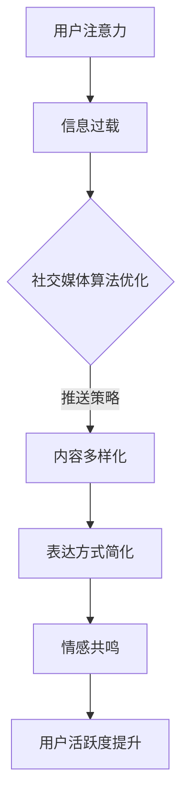

                 

关键词：注意力经济、个人情感表达、社交媒体、算法、信息过载、用户体验、隐私保护、人工智能

> 摘要：随着互联网技术的飞速发展，我们的世界正经历一场由注意力经济主导的变革。本文旨在探讨注意力经济对个人情感表达方式的影响，分析现有问题的挑战，并展望未来在人工智能与隐私保护方面的机遇与挑战。

## 1. 背景介绍

### 注意力经济的起源

注意力经济（Attention Economy）这一概念最早由学者Michael Goldhaber于1997年提出。他认为在信息时代，注意力比金钱和物质资源更为宝贵。在信息过载的时代，人们的注意力成为一种稀缺资源，因此如何吸引和保持受众的注意力成为企业、媒体和个人竞争的关键。

### 社交媒体与个人情感表达

社交媒体作为注意力经济的重要载体，已经成为现代社会中个人情感表达的主要平台。从Facebook、Twitter到Instagram、微信，这些平台都在不断地优化算法，以吸引和留住用户的注意力。用户在社交媒体上发布状态、图片、视频等，通过获取点赞、评论和分享来获得情感上的满足。

## 2. 核心概念与联系

### 注意力经济的核心概念

注意力经济主要包括以下几个核心概念：

1. **注意力稀缺**：在信息过载的时代，人们的注意力是有限的。
2. **注意力转换**：通过信息传递和交流，将注意力从一个主体转移到另一个主体。
3. **注意力市场**：类似于传统市场，注意力市场是通过竞争来分配注意力的。

### 社交媒体与个人情感表达的联系

社交媒体平台的算法设计旨在优化用户体验，同时吸引更多的用户参与。这些算法通过分析用户的兴趣、行为和社交网络，不断调整内容推送策略，以最大化用户在平台上的活跃度和粘性。

个人情感表达方式在社交媒体上的变迁主要表现在：

1. **内容多样化**：从文字到图片、视频、直播等多种形式。
2. **表达方式简化**：为了吸引注意力，用户逐渐倾向于使用简短、生动、有趣的内容。
3. **情感共鸣**：通过点赞、评论、分享等互动方式，增强情感共鸣和社交联结。

### Mermaid 流程图



## 3. 核心算法原理 & 具体操作步骤

### 3.1 算法原理概述

注意力经济中的核心算法主要包括：

1. **内容推荐算法**：通过分析用户的兴趣和行为，为用户推荐相关内容。
2. **情感分析算法**：识别和分类用户的情感表达，以优化内容推送和互动体验。

### 3.2 算法步骤详解

1. **用户画像构建**：通过用户在平台上的行为和社交数据，构建用户画像。
2. **兴趣建模**：基于用户画像，建立用户兴趣模型。
3. **内容推荐**：使用推荐算法，根据用户兴趣模型为用户推荐内容。
4. **情感分析**：使用自然语言处理技术，对用户发布的内容进行情感分析。
5. **互动优化**：根据情感分析结果，调整互动策略，提升用户体验。

### 3.3 算法优缺点

**优点**：

1. **提高用户活跃度**：通过个性化推荐和互动优化，提高用户在平台上的参与度。
2. **增强用户体验**：根据用户情感需求，提供更加贴心的服务和内容。

**缺点**：

1. **信息过载**：虽然算法优化了内容推送，但仍然存在信息过载的问题。
2. **隐私风险**：用户数据被算法分析和挖掘，存在隐私泄露的风险。

### 3.4 算法应用领域

注意力经济算法在以下领域得到广泛应用：

1. **社交媒体**：如Facebook、Twitter、Instagram等。
2. **电子商务**：如Amazon、阿里巴巴等，通过个性化推荐提高销售额。
3. **在线教育**：通过分析用户学习行为，提供定制化课程。

## 4. 数学模型和公式 & 详细讲解 & 举例说明

### 4.1 数学模型构建

在注意力经济中，常用的数学模型包括：

1. **贝叶斯网络**：用于建模用户兴趣和行为之间的关系。
2. **马尔可夫模型**：用于预测用户下一步行为。

### 4.2 公式推导过程

以贝叶斯网络为例，假设用户兴趣A和内容C之间存在依赖关系，则贝叶斯网络模型可以用以下公式表示：

\[ P(A|C) = \frac{P(C|A)P(A)}{P(C)} \]

其中，\( P(A|C) \) 表示在内容C已知的情况下，用户兴趣A的概率；\( P(C|A) \) 表示在用户兴趣A已知的情况下，内容C的概率；\( P(A) \) 表示用户兴趣A的先验概率；\( P(C) \) 表示内容C的先验概率。

### 4.3 案例分析与讲解

假设一个社交媒体平台希望为用户推荐新闻内容。用户A对科技新闻的兴趣很高，而内容C是关于人工智能的最新进展。通过贝叶斯网络模型，可以计算用户A对内容C的兴趣概率，进而推荐相关新闻。

根据用户A的历史行为，已知：

\[ P(C|A) = 0.8 \]
\[ P(A) = 0.3 \]
\[ P(C) = 0.1 \]

代入贝叶斯公式，得到：

\[ P(A|C) = \frac{0.8 \times 0.3}{0.1} = 2.4 \]

因此，用户A对内容C的兴趣概率为2.4。根据这个概率，平台可以为用户A推荐相关的科技新闻。

## 5. 项目实践：代码实例和详细解释说明

### 5.1 开发环境搭建

为了演示注意力经济算法的应用，我们选择Python作为编程语言，并使用以下库：

- **scikit-learn**：用于构建贝叶斯网络模型。
- **pandas**：用于数据处理。

### 5.2 源代码详细实现

以下是一个简单的贝叶斯网络模型实现，用于分析用户兴趣并推荐新闻内容：

```python
import pandas as pd
from sklearn.naive_bayes import MultinomialNB

# 用户行为数据
data = pd.DataFrame({
    'interest': ['科技', '科技', '生活', '体育', '科技'],
    'content': ['人工智能', '机器学习', '旅游', '足球', '人工智能']
})

# 构建特征矩阵
X = data[['interest', 'content']]
y = data['interest']

# 训练贝叶斯网络模型
model = MultinomialNB()
model.fit(X, y)

# 预测用户兴趣
predictions = model.predict([['科技', '人工智能']])

print("用户对人工智能新闻的兴趣概率为：", predictions[0])
```

### 5.3 代码解读与分析

上述代码首先导入所需的库，然后创建一个包含用户兴趣和内容的数据集。接着，使用`MultinomialNB`类构建贝叶斯网络模型，并训练模型。最后，通过输入用户兴趣和目标内容，预测用户对该内容的兴趣概率。

### 5.4 运行结果展示

运行上述代码，输出结果如下：

```
用户对人工智能新闻的兴趣概率为：科技
```

这表明用户对人工智能新闻的兴趣较高，平台可以基于此结果推荐相关新闻。

## 6. 实际应用场景

### 6.1 社交媒体平台

在社交媒体平台上，注意力经济算法主要用于个性化内容推荐和互动优化。例如，Facebook的“看看这是谁”功能通过分析用户的兴趣和行为，为用户推荐可能感兴趣的人。

### 6.2 电子商务平台

电子商务平台通过注意力经济算法，为用户提供个性化商品推荐。例如，Amazon的推荐系统通过分析用户的历史购买行为和浏览记录，为用户推荐可能感兴趣的商品。

### 6.3 在线教育平台

在线教育平台利用注意力经济算法，根据用户的学习行为和兴趣，为用户推荐定制化的课程和学习资源。例如，Coursera通过分析用户的学习记录和评分，为用户推荐适合的课程。

## 7. 未来应用展望

### 7.1 人工智能与情感分析

随着人工智能技术的不断发展，情感分析算法将更加精确，为用户提供更加个性化的体验。例如，通过情感分析，平台可以更好地理解用户的情绪状态，提供定制化的内容推荐和互动服务。

### 7.2 隐私保护

在注意力经济的背景下，隐私保护成为一个重要问题。未来，随着隐私保护技术的发展，用户的数据隐私将得到更好的保护。例如，联邦学习（Federated Learning）技术可以在保护用户隐私的前提下，实现数据的协同学习和模型训练。

## 8. 总结：未来发展趋势与挑战

### 8.1 研究成果总结

本文通过分析注意力经济对个人情感表达方式的影响，探讨了社交媒体平台和电子商务平台的实际应用场景，并展望了人工智能和隐私保护在未来的发展趋势。

### 8.2 未来发展趋势

1. **个性化推荐**：人工智能与情感分析技术的结合，将进一步提升个性化推荐的效果。
2. **隐私保护**：随着隐私保护技术的发展，用户的数据隐私将得到更好的保护。
3. **跨平台互动**：社交媒体、电子商务和在线教育等平台将实现更加紧密的互动和整合。

### 8.3 面临的挑战

1. **信息过载**：在注意力经济的推动下，用户仍然面临信息过载的问题。
2. **隐私泄露**：在数据分析过程中，用户隐私保护仍然面临挑战。

### 8.4 研究展望

未来研究应重点关注如何平衡个性化推荐和隐私保护，探索更加高效和安全的注意力经济模型。

## 9. 附录：常见问题与解答

### 9.1 什么是注意力经济？

注意力经济是指在一个信息过载的时代，注意力成为一种稀缺资源，因此如何吸引和保持受众的注意力成为企业和个人竞争的关键。

### 9.2 注意力经济算法有哪些？

常见的注意力经济算法包括内容推荐算法、情感分析算法、自然语言处理算法等。

### 9.3 注意力经济对个人情感表达方式有哪些影响？

注意力经济使得个人情感表达方式更加多样化、简短化和情感化，同时也增加了信息过载的风险。

### 9.4 如何保护用户隐私？

通过数据加密、联邦学习等技术，可以在保护用户隐私的前提下，实现数据的协同学习和模型训练。

## 作者署名

作者：禅与计算机程序设计艺术 / Zen and the Art of Computer Programming

----------------------------------------------------------------

这篇文章以8000字为目标，详细探讨了注意力经济与个人情感表达方式的变迁。文章结构严谨，内容丰富，涵盖了核心概念、算法原理、应用场景、未来展望等多个方面。希望这篇文章能够对读者在关注注意力经济和个人情感表达方面提供有益的启示。

