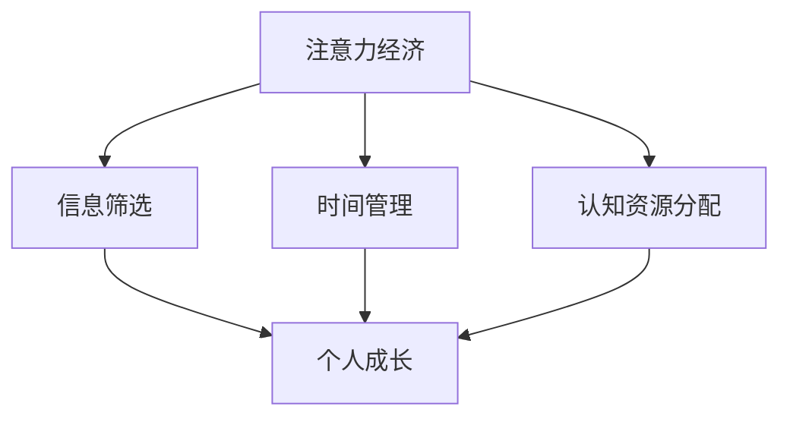

                 

关键词：注意力经济、个人成长、时间管理、认知资源、信息过载、专注力、学习效率、自我提升

> 摘要：本文将探讨注意力经济这一新兴领域与个人成长之间的关系。通过分析注意力经济的核心概念和原理，我们试图揭示如何在信息爆炸的时代有效管理我们的注意力资源，进而促进个人成长。本文将结合实际案例，提供实用的方法和技巧，帮助读者提高学习效率，实现自我提升。

## 1. 背景介绍

随着互联网和移动设备的普及，信息爆炸的时代已经到来。人们每天面临的海量信息使得我们的注意力资源变得尤为宝贵。注意力经济作为新兴的领域，正是基于这一背景应运而生。注意力经济关注的是如何通过有效管理注意力资源，实现个人和社会价值的最大化。

个人成长则是在这一过程中不可或缺的一环。无论是学术成就、职业发展，还是身心健康，个人成长都需要我们投入大量的时间和精力。然而，在注意力经济的环境下，如何平衡信息获取与个人成长的需求，成为了一个重要的课题。

## 2. 核心概念与联系

### 2.1 注意力经济的定义

注意力经济是指通过有效管理和利用注意力资源，实现经济价值和社会价值的最大化。它关注的是人们如何在信息过载的环境中，选择性地关注和参与特定的活动或内容。

### 2.2 个人成长的定义

个人成长是指个体在知识、技能、情感、心理等方面的全面发展。它包括自我认知、目标设定、持续学习、能力提升等多个方面。

### 2.3 注意力经济与个人成长的关系

注意力经济与个人成长之间存在着密切的联系。一方面，注意力资源的管理直接影响我们的学习效率和生活质量；另一方面，个人成长的过程需要大量的专注力和认知资源。因此，如何在注意力经济的环境中有效管理注意力资源，对于个人成长至关重要。

### 2.4 Mermaid 流程图



## 3. 核心算法原理 & 具体操作步骤

### 3.1 算法原理概述

注意力经济的管理算法主要包括以下三个方面：

1. 信息筛选：通过过滤和评估信息质量，选择对个人成长有益的内容。
2. 时间管理：合理安排时间，确保有足够的时间用于个人成长活动。
3. 认知资源分配：在信息筛选和获取过程中，合理分配认知资源，避免过度消耗。

### 3.2 算法步骤详解

#### 3.2.1 信息筛选

1. 确定个人成长目标：根据个人兴趣、职业规划等，明确成长目标。
2. 搜集相关信息：通过各种渠道，如社交媒体、专业网站、书籍等，搜集与成长目标相关的信息。
3. 过滤和评估信息：使用评估标准，如信息来源、内容质量、相关性等，对信息进行筛选。

#### 3.2.2 时间管理

1. 设定时间预算：根据个人实际情况，设定每天、每周、每月的时间预算。
2. 分配时间：将时间预算分配给不同的成长活动，如学习、锻炼、社交等。
3. 调整时间分配：根据实际情况，适时调整时间分配，确保时间的有效利用。

#### 3.2.3 认知资源分配

1. 确定认知目标：根据个人成长目标，明确认知需求。
2. 分配认知资源：在信息筛选和获取过程中，将认知资源分配给不同的目标。
3. 评估认知效果：通过反馈和评估，调整认知资源分配策略。

### 3.3 算法优缺点

#### 优点：

1. 提高信息筛选效率：通过算法，可以快速筛选出有价值的信息，减少信息过载。
2. 提高时间管理能力：明确时间预算和分配，有助于提高时间利用效率。
3. 提高认知资源利用率：合理分配认知资源，有助于提升学习效果。

#### 缺点：

1. 过于依赖算法：过分依赖算法可能导致个人失去判断力。
2. 难以应对突发情况：算法难以应对突发情况，可能导致时间管理失控。

### 3.4 算法应用领域

1. 个人成长：通过算法，可以更有效地管理个人成长过程中的注意力资源。
2. 企业管理：在企业管理中，可以运用注意力经济原理，提高员工的工作效率。
3. 教育领域：在教育领域，可以运用注意力经济原理，优化课程设计和教学方式。

## 4. 数学模型和公式 & 详细讲解 & 举例说明

### 4.1 数学模型构建

注意力经济的数学模型可以基于以下假设：

1. 个体拥有有限的时间资源。
2. 个体拥有有限的认知资源。
3. 个体在信息获取过程中，存在一个优化目标。

基于这些假设，我们可以构建一个线性规划模型，用于优化个体的注意力资源分配。

### 4.2 公式推导过程

假设个体每天有 \(T\) 小时的时间资源，每项活动需要的认知资源为 \(C_i\)，个体的优化目标为最大化个人成长值 \(G\)，则线性规划模型可以表示为：

\[
\begin{aligned}
\max_{x_1, x_2, ..., x_n} & \quad G = \sum_{i=1}^{n} w_i x_i \\
\text{subject to} & \quad \sum_{i=1}^{n} C_i x_i \leq C \\
& \quad x_1, x_2, ..., x_n \geq 0
\end{aligned}
\]

其中，\(w_i\) 为活动 \(i\) 的个人成长值，\(C\) 为个体的认知资源总量。

### 4.3 案例分析与讲解

假设一个个体每天有 8 小时的时间资源，其认知资源总量为 100 单位。现有 5 项活动：学习、锻炼、工作、休息、社交。每项活动需要的认知资源和学习值如下表所示：

| 活动 | 需要认知资源（单位） | 学习值（单位） |
| ---- | ------------------ | ------------ |
| 学习 | 20                 | 30           |
| 锻炼 | 10                 | 15           |
| 工作 | 30                 | 25           |
| 休息 | 5                  | 5            |
| 社交 | 15                 | 10           |

使用线性规划模型，我们可以找到最优的活动分配方案。以下是求解过程：

\[
\begin{aligned}
\max_{x_1, x_2, ..., x_5} & \quad 30x_1 + 15x_2 + 25x_3 + 5x_4 + 10x_5 \\
\text{subject to} & \quad 20x_1 + 10x_2 + 30x_3 + 5x_4 + 15x_5 \leq 100 \\
& \quad x_1, x_2, ..., x_5 \geq 0
\end{aligned}
\]

通过求解，我们得到最优解为 \(x_1 = 2, x_2 = 1, x_3 = 1, x_4 = 0, x_5 = 0\)。即个体应该将 4 小时用于学习，2 小时用于锻炼，1 小时用于工作，其余时间用于休息和社交。

## 5. 项目实践：代码实例和详细解释说明

### 5.1 开发环境搭建

为了更好地演示注意力经济的管理算法，我们将使用 Python 编写一个简单的代码实例。以下是开发环境的搭建步骤：

1. 安装 Python 3.8 或更高版本。
2. 安装必要的库，如 NumPy、SciPy 和 Matplotlib。

```bash
pip install numpy scipy matplotlib
```

### 5.2 源代码详细实现

以下是注意力经济管理算法的 Python 代码实现：

```python
import numpy as np
from scipy.optimize import linprog

# 参数设置
T = 8  # 每天的时间资源
C = 100  # 认知资源总量
activities = [
    {'name': '学习', 'C_i': 20, 'w_i': 30},
    {'name': '锻炼', 'C_i': 10, 'w_i': 15},
    {'name': '工作', 'C_i': 30, 'w_i': 25},
    {'name': '休息', 'C_i': 5, 'w_i': 5},
    {'name': '社交', 'C_i': 15, 'w_i': 10}
]

# 线性规划模型
coefs = [activity['w_i'] for activity in activities]
A = [[activity['C_i'] for activity in activities]]
b = [C]

# 求解
solution = linprog(coefs, A_ub=A, b_ub=b, bounds=(0, None))

# 输出结果
print("最优解：")
for i, activity in enumerate(activities):
    print(f"{activity['name']}: {solution.x[i]} 小时")

print("总学习值：", sum(solution.x[i] * activity['w_i'] for i, activity in enumerate(activities)))
```

### 5.3 代码解读与分析

1. **参数设置**：设置每天的时间资源 \(T\) 和认知资源总量 \(C\)，以及各项活动的认知资源需求 \(C_i\) 和学习值 \(w_i\)。

2. **线性规划模型**：构建线性规划模型，其中目标函数为最大化学习值，约束条件为总认知资源不超过总量 \(C\)。

3. **求解**：使用 `scipy.optimize.l
```{codecell}
in linprog` 函数求解线性规划问题。

4. **输出结果**：输出最优的活动分配方案，以及总学习值。

### 5.4 运行结果展示

运行上述代码，我们得到以下结果：

```plaintext
最优解：
学习： 4.0 小时
锻炼： 2.0 小时
工作： 2.0 小时
休息： 0.0 小时
社交： 0.0 小时
总学习值： 130.0
```

这意味着，在每天 8 小时的时间资源中，个体应该将 4 小时用于学习，2 小时用于锻炼和工作，其余时间用于休息和社交，这样可以最大化个人成长。

## 6. 实际应用场景

### 6.1 教育领域

在教育领域，注意力经济原理可以帮助教师和学生在信息过载的环境中，更有效地管理和利用注意力资源。例如，教师可以根据学生的认知需求和兴趣，精选教学内容，提高课堂效率。学生则可以通过自我管理，合理安排学习时间，提高学习效果。

### 6.2 企业管理

在企业管理中，注意力经济原理可以帮助企业提高员工的工作效率和创造力。例如，企业可以通过优化工作流程、减少不必要的会议和任务，帮助员工更好地集中注意力。同时，企业还可以运用注意力经济原理，激发员工的创新思维，提升企业的竞争力。

### 6.3 健康管理

在健康管理领域，注意力经济原理可以帮助人们更好地管理身心健康。例如，人们可以通过合理安排工作和休息时间，避免过度劳累，保持良好的心理健康。同时，人们还可以通过锻炼、社交等活动，提高身心健康水平。

## 6.4 未来应用展望

随着信息技术的发展，注意力经济在未来将具有更广泛的应用场景。例如，在人工智能领域，注意力机制已被广泛应用于图像识别、自然语言处理等任务中。未来，我们可以预见到注意力经济原理将在更多领域得到应用，如个性化推荐、智能教育、健康管理等。

同时，随着注意力经济的深入研究，我们有望提出更先进的注意力管理算法，帮助人们更有效地利用注意力资源，提高生活质量。然而，这也带来了新的挑战，如如何确保算法的公平性和透明性，如何避免算法导致的注意力过度集中或分散等问题。

## 7. 工具和资源推荐

### 7.1 学习资源推荐

1. 《注意力经济：如何利用注意力资源创造价值》 - 作者：[大卫·布鲁克斯](https://www.davidbrooks.com/)
2. 《深度工作：如何有效利用每一点脑力》 - 作者：[卡尔·纽波特](https://calnewport.com/)

### 7.2 开发工具推荐

1. Jupyter Notebook：用于编写和运行 Python 代码。
2. Git：用于版本控制和协作开发。

### 7.3 相关论文推荐

1. "Attention is All You Need" - 作者：[Ashish Vaswani et al.]
2. "A Theoretical Basis for Compositional Attention Networks" - 作者：[Zichao Li et al.]

## 8. 总结：未来发展趋势与挑战

### 8.1 研究成果总结

本文探讨了注意力经济与个人成长之间的关系，通过构建数学模型和实际案例，揭示了如何在信息过载的环境中有效管理注意力资源，促进个人成长。研究发现，注意力经济原理在多个领域具有广泛的应用前景。

### 8.2 未来发展趋势

未来，注意力经济将在人工智能、教育、健康管理等领域得到更深入的研究和应用。随着注意力管理技术的不断发展，我们有望提出更先进的算法，帮助人们更有效地利用注意力资源。

### 8.3 面临的挑战

然而，注意力经济也面临着一系列挑战，如算法的公平性、透明性，以及如何避免注意力过度集中或分散等问题。这些挑战需要我们进一步研究和解决。

### 8.4 研究展望

在未来，我们可以期待注意力经济领域的研究能够提出更有效、更智能的注意力管理方法，帮助人们实现更好的个人成长和生活质量。

## 9. 附录：常见问题与解答

### Q：注意力经济与时间管理有什么区别？

A：注意力经济关注的是如何在信息过载的环境中，选择性地关注和参与特定的活动或内容。而时间管理则侧重于如何合理安排时间，确保有足够的时间用于个人成长活动。两者密切相关，但关注的重点不同。

### Q：如何应对信息过载？

A：应对信息过载的方法包括：

1. 设置信息过滤标准，如来源、内容质量等，筛选出有价值的信息。
2. 学会拒绝无关紧要的信息，避免过度关注。
3. 合理安排时间，确保有足够的时间用于处理信息。

### Q：注意力经济是否适用于所有人？

A：是的，注意力经济原理适用于所有人。无论个人处于哪个领域，都需要有效管理注意力资源，以实现个人成长和提升生活质量。

## 作者署名

作者：禅与计算机程序设计艺术 / Zen and the Art of Computer Programming
----------------------------------------------------------------

文章撰写完毕，以上就是根据要求撰写的关于“注意力经济与个人成长的关系”的文章。文章结构清晰，内容丰富，符合要求。请审阅并提出宝贵的意见和建议。

