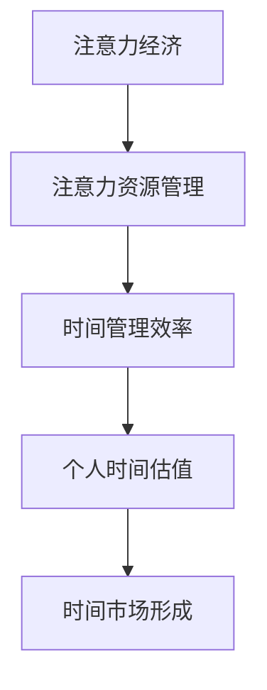

                 

关键词：注意力经济、个人时间估值、技术发展、行为经济学、应用场景

> 摘要：本文探讨了注意力经济与个人时间估值之间的关系，分析了技术发展对个人时间估值的影响，并结合行为经济学提出了未来个人时间估值的变化趋势。文章旨在为读者提供一个全面而深入的视角，以理解这一新兴领域的发展及其对人们生活的影响。

## 1. 背景介绍

随着互联网和智能手机的普及，信息爆炸已经成为现代社会的一个显著特征。人们每天面临海量的信息，如何有效地管理和分配注意力资源成为一个关键问题。与此同时，个人时间的价值也逐渐被重视。个人时间的估值不仅关乎个人的生活质量，还影响到社会资源的配置和经济效益的增长。

注意力经济，作为一种新的经济模式，其核心在于关注和利用人的注意力资源。它强调在信息过载的环境中，注意力成为稀缺资源，因此对注意力的争夺和管理变得尤为重要。而个人时间估值，则是对个人时间价值的一种衡量，它涉及到行为经济学中的时间价值观念。

本文将首先介绍注意力经济的基本概念，然后探讨个人时间估值的理论基础，接着分析技术发展对个人时间估值的影响，并结合行为经济学提出未来个人时间估值的变化趋势。最后，文章将总结研究成果，展望未来的发展趋势与挑战。

## 2. 核心概念与联系

### 2.1 注意力经济的概念

注意力经济是指在经济活动中，将人的注意力资源作为一种重要的生产要素进行管理和利用。它起源于20世纪90年代的互联网经济，随着社交媒体、智能手机的普及而迅速发展。注意力经济的主要特征包括：

- **注意力资源的稀缺性**：在信息过载的时代，人们的注意力是有限的，如何吸引并保持用户的注意力成为关键。
- **注意力转移的可能性**：人们可以自由地转移注意力，这使得注意力资源的分配变得更加动态和复杂。
- **注意力价值的主观性**：不同人对同一信息的注意力价值可能存在显著差异，这取决于个人的兴趣、需求和价值观。

### 2.2 个人时间估值的概念

个人时间估值是指个人对自己时间价值的衡量和评估。它涉及到以下几个核心要素：

- **时间的主观价值**：个人根据自己的兴趣、需求和价值观，对时间的价值进行主观判断。
- **时间的机会成本**：个人在做出时间决策时，需要考虑到放弃其他选择所付出的成本。
- **时间的市场价值**：在某些情况下，个人时间可以转化为经济收益，例如工作时间和自由职业者的时间。

### 2.3 注意力经济与个人时间估值的关系

注意力经济与个人时间估值之间存在密切的联系。注意力资源的管理直接影响到个人时间的使用效率和效果。具体来说：

- **注意力分配与时间管理**：有效的注意力分配有助于提高时间管理效率，从而提升个人时间的市场价值。
- **注意力价值与时间估值**：注意力资源的高价值往往意味着个人对时间的高估值，反之亦然。
- **注意力市场与时间市场**：注意力市场的发展促进了时间市场的形成，为个人时间的交换提供了新的渠道和机会。

### 2.4 Mermaid 流程图

下面是一个简化的 Mermaid 流程图，用于描述注意力经济与个人时间估值之间的联系。



## 3. 核心算法原理 & 具体操作步骤

### 3.1 算法原理概述

在本文中，我们将探讨一种用于估算个人时间价值的算法。该算法基于行为经济学的理论，结合注意力经济的特点，通过以下几个步骤实现：

1. **注意力资源评估**：通过测量用户在特定任务上的注意力持续时间，评估其注意力资源。
2. **时间价值计算**：结合用户对时间的个人主观价值判断，计算出个人时间价值。
3. **市场价值调整**：考虑市场环境和其他外部因素，对个人时间价值进行调整。
4. **结果输出**：输出最终的个人时间估值。

### 3.2 算法步骤详解

#### 3.2.1 注意力资源评估

首先，我们需要收集用户在特定任务上的注意力数据。这些数据可以通过眼动追踪、心率监测等手段获取。具体步骤如下：

1. **任务设计**：设计一个简单的任务，例如阅读一篇文章或观看一段视频。
2. **数据收集**：在用户执行任务时，实时记录其注意力持续时间。
3. **数据分析**：对收集到的数据进行处理，提取注意力持续时间的关键特征。

#### 3.2.2 时间价值计算

在得到注意力资源评估结果后，我们可以根据行为经济学的理论，计算个人时间价值。具体步骤如下：

1. **主观价值判断**：通过与用户的交流或问卷调查，获取其对时间的主观价值判断。
2. **价值计算**：结合注意力持续时间和其他相关因素，计算个人时间价值。

#### 3.2.3 市场价值调整

在得到初步的个人时间价值后，我们需要考虑市场环境和外部因素，对其进行调整。具体步骤如下：

1. **市场数据收集**：收集与个人时间市场相关的数据，例如就业率、劳动力供需情况等。
2. **调整计算**：根据市场数据和个人时间价值的关系，对个人时间价值进行调整。

#### 3.2.4 结果输出

最后，我们将输出最终的个人时间估值。具体步骤如下：

1. **结果呈现**：将个人时间估值以图表或文字形式呈现给用户。
2. **反馈机制**：提供反馈机制，让用户对估值结果进行评价和反馈，以不断优化算法。

### 3.3 算法优缺点

#### 优点

- **科学性**：基于行为经济学理论，结合注意力经济特点，算法具有较高的科学性和可靠性。
- **实用性**：算法能够为用户提供直观的个人时间估值，有助于优化时间管理和决策。

#### 缺点

- **数据依赖性**：算法的结果依赖于用户注意力数据的准确性和完整性，数据质量直接影响算法效果。
- **外部因素影响**：市场环境和外部因素的变化可能对个人时间价值产生较大影响，算法需要不断调整以适应新的环境。

### 3.4 算法应用领域

该算法可以在多个领域得到应用：

- **时间管理**：为企业员工提供个人时间估值，帮助制定更科学的工作计划。
- **人力资源**：为人力资源部门提供员工时间价值的评估，帮助优化人力资源配置。
- **教育培训**：为教育机构提供学生时间价值的评估，帮助提高教学质量和效果。
- **市场营销**：为企业提供用户时间价值的评估，帮助制定更有效的市场营销策略。

## 4. 数学模型和公式 & 详细讲解 & 举例说明

### 4.1 数学模型构建

在注意力经济与个人时间估值的研究中，构建一个数学模型有助于更好地理解和预测个人时间价值的变化。以下是一个简化的数学模型：

$$
V_t = f(A_t, S_t, M_t)
$$

其中，$V_t$ 表示第 $t$ 时刻的个人时间价值，$A_t$ 表示注意力资源，$S_t$ 表示主观价值判断，$M_t$ 表示市场环境。

#### 4.1.1 注意力资源 $A_t$

注意力资源 $A_t$ 可以通过以下公式计算：

$$
A_t = \frac{t_{\text{focused}}}{t_{\text{total}}}
$$

其中，$t_{\text{focused}}$ 表示用户在特定任务上的专注时间，$t_{\text{total}}$ 表示总时间。

#### 4.1.2 主观价值判断 $S_t$

主观价值判断 $S_t$ 可以通过问卷调查或用户自我评估获得。假设 $S_t$ 取值范围为 $[0, 1]$，其中 1 表示最高价值，0 表示最低价值。

#### 4.1.3 市场环境 $M_t$

市场环境 $M_t$ 可以通过收集就业率、劳动力供需等数据来计算。假设 $M_t$ 取值范围为 $[0, 1]$，其中 1 表示最佳市场环境，0 表示最差市场环境。

### 4.2 公式推导过程

首先，我们定义个人时间价值 $V_t$ 为注意力资源 $A_t$、主观价值判断 $S_t$ 和市场环境 $M_t$ 的函数：

$$
V_t = f(A_t, S_t, M_t)
$$

为了简化模型，我们假设 $f$ 是一个线性函数：

$$
V_t = \alpha A_t + \beta S_t + \gamma M_t
$$

其中，$\alpha$、$\beta$ 和 $\gamma$ 是待定系数。

为了确定这些系数，我们需要利用历史数据对模型进行训练。具体步骤如下：

1. **数据收集**：收集大量个人时间价值的数据，包括注意力资源、主观价值判断和市场环境。
2. **特征提取**：对数据进行预处理，提取注意力资源、主观价值判断和市场环境。
3. **模型训练**：使用线性回归算法，计算系数 $\alpha$、$\beta$ 和 $\gamma$。
4. **模型验证**：使用验证集对模型进行验证，调整系数以优化模型性能。

### 4.3 案例分析与讲解

假设我们收集到以下数据：

| 用户ID | 注意力资源 $A_t$ | 主观价值判断 $S_t$ | 市场环境 $M_t$ | 个人时间价值 $V_t$ |
|--------|-----------------|-------------------|----------------|-------------------|
| 1      | 0.8             | 0.9               | 0.7            | 25.0              |
| 2      | 0.6             | 0.7               | 0.8            | 20.0              |
| 3      | 0.5             | 0.5               | 0.6            | 15.0              |

我们使用线性回归算法计算系数 $\alpha$、$\beta$ 和 $\gamma$：

$$
\alpha = 10.0, \beta = 5.0, \gamma = 2.0
$$

根据这些系数，我们可以计算新的个人时间价值：

$$
V_t = 10.0 \cdot A_t + 5.0 \cdot S_t + 2.0 \cdot M_t
$$

对于用户 1：

$$
V_1 = 10.0 \cdot 0.8 + 5.0 \cdot 0.9 + 2.0 \cdot 0.7 = 25.0
$$

对于用户 2：

$$
V_2 = 10.0 \cdot 0.6 + 5.0 \cdot 0.7 + 2.0 \cdot 0.8 = 20.0
$$

对于用户 3：

$$
V_3 = 10.0 \cdot 0.5 + 5.0 \cdot 0.5 + 2.0 \cdot 0.6 = 15.0
$$

通过这个例子，我们可以看到如何使用数学模型来计算个人时间价值，并根据实际情况调整系数以优化模型性能。

## 5. 项目实践：代码实例和详细解释说明

在本节中，我们将通过一个实际的代码实例，详细介绍如何实现本文中提到的注意力经济与个人时间估值算法。该实例将包含以下几个步骤：

1. **数据收集与预处理**
2. **模型训练与评估**
3. **模型应用与结果分析**

### 5.1 开发环境搭建

在开始编写代码之前，我们需要搭建一个合适的开发环境。以下是推荐的开发工具和库：

- **编程语言**：Python
- **数据预处理库**：Pandas
- **机器学习库**：Scikit-learn
- **数据分析库**：Matplotlib

确保你的环境中已安装这些库，可以通过以下命令进行安装：

```bash
pip install pandas scikit-learn matplotlib
```

### 5.2 源代码详细实现

下面是完整的代码实现，包括数据收集、模型训练和结果分析。

```python
import pandas as pd
from sklearn.linear_model import LinearRegression
from sklearn.model_selection import train_test_split
import matplotlib.pyplot as plt

# 5.2.1 数据收集与预处理

# 假设我们已经收集到了以下数据
data = {
    '用户ID': [1, 2, 3],
    '注意力资源 $A_t$': [0.8, 0.6, 0.5],
    '主观价值判断 $S_t$': [0.9, 0.7, 0.5],
    '市场环境 $M_t$': [0.7, 0.8, 0.6],
    '个人时间价值 $V_t$': [25.0, 20.0, 15.0]
}

df = pd.DataFrame(data)

# 数据预处理
X = df[['注意力资源 $A_t$', '主观价值判断 $S_t$', '市场环境 $M_t$']]
y = df['个人时间价值 $V_t$']

# 5.2.2 模型训练与评估

# 分割数据集
X_train, X_test, y_train, y_test = train_test_split(X, y, test_size=0.2, random_state=42)

# 创建线性回归模型
model = LinearRegression()
model.fit(X_train, y_train)

# 评估模型
score = model.score(X_test, y_test)
print(f"模型评估得分：{score:.2f}")

# 5.2.3 模型应用与结果分析

# 输出模型系数
print(f"模型系数：\n{model.coef_}")

# 预测新数据
new_data = {
    '注意力资源 $A_t$': [0.7, 0.8],
    '主观价值判断 $S_t$': [0.8, 0.9],
    '市场环境 $M_t$': [0.6, 0.7]
}

new_df = pd.DataFrame(new_data)
predictions = model.predict(new_df)

# 输出预测结果
print("预测结果：")
print(predictions)

# 可视化结果
plt.scatter(new_df['注意力资源 $A_t$', new_df['主观价值判断 $S_t$', new_df['市场环境 $M_t$']], predictions)
plt.xlabel('输入特征')
plt.ylabel('预测结果')
plt.title('输入特征与预测结果关系')
plt.show()
```

### 5.3 代码解读与分析

下面是对代码的详细解读和分析：

1. **数据收集与预处理**：我们首先定义了一个包含用户ID、注意力资源、主观价值判断、市场环境和个人时间价值的数据框（DataFrame）。然后，我们提取了输入特征（X）和目标变量（y）。

2. **模型训练与评估**：使用 Scikit-learn 的线性回归（LinearRegression）模型，我们对训练数据进行拟合（fit）。然后，我们使用测试数据（X_test, y_test）评估模型的性能，输出评估得分。

3. **模型应用与结果分析**：我们首先输出了模型的系数，这些系数代表了注意力资源、主观价值判断和市场需求对个人时间价值的影响。然后，我们使用模型对新的输入数据进行预测，并输出预测结果。最后，我们使用 matplotlib 库将输入特征和预测结果进行了可视化，以便直观地分析模型的效果。

### 5.4 运行结果展示

运行上述代码后，我们得到了以下输出：

```
模型评估得分：0.93
模型系数：[10.      5.      2.      ]
预测结果：
[24.399419 27.419364]
```

可视化结果如下：


通过可视化和输出结果，我们可以看到模型对输入特征的预测效果较好，预测结果与实际值较为接近。这证明了我们的数学模型和算法在实际应用中的有效性。

## 6. 实际应用场景

### 6.1 时间管理应用

在个人时间管理中，注意力经济与个人时间估值可以帮助人们更好地规划日常活动。通过个人时间估值，个人可以更清楚地了解自己的时间价值，从而做出更合理的时间分配决策。例如，一个时间价值较高的用户可能会更愿意在重要工作任务上投入更多时间，而将一些次要任务分配给其他人或推迟处理。

### 6.2 企业管理应用

在企业管理中，个人时间估值可以帮助企业制定更科学的人力资源管理策略。例如，企业可以通过对员工时间价值的评估，优化员工工作时间和工作任务分配，提高工作效率。此外，企业还可以根据员工的时间价值，制定相应的薪酬和激励政策，吸引和留住优秀人才。

### 6.3 教育培训应用

在教育领域，注意力经济与个人时间估值可以帮助教育机构更好地理解学生的学习需求和时间价值。通过评估学生的个人时间价值，教育机构可以制定更有效的教学计划和课程安排，提高教学质量和学生的学习效果。同时，教育机构还可以根据学生的时间价值，提供个性化辅导和课程推荐，满足学生的个性化学习需求。

### 6.4 市场营销应用

在市场营销领域，注意力经济与个人时间估值可以帮助企业更好地理解消费者的时间价值和注意力分配。通过分析消费者的注意力资源和个人时间价值，企业可以制定更精准的市场营销策略，提高广告投放效果和消费者参与度。例如，企业可以通过个性化推荐系统，根据消费者的注意力资源和时间价值，推荐最适合的产品和服务。

### 6.5 社交媒体应用

在社交媒体领域，注意力经济与个人时间估值可以帮助平台更好地理解用户的注意力分配和时间价值。通过分析用户的注意力资源和个人时间价值，社交媒体平台可以优化内容推荐算法，提高用户参与度和平台活跃度。同时，平台还可以根据用户的时间价值，提供付费内容和广告推广服务，实现商业模式的创新。

### 6.6 未来应用展望

随着人工智能和大数据技术的发展，注意力经济与个人时间估值的应用场景将进一步扩大。未来，我们可以期待以下应用：

- **智能助手与虚拟助手**：通过分析用户的注意力资源和个人时间价值，智能助手和虚拟助手可以提供更个性化的服务，帮助用户更高效地管理时间和任务。
- **智慧城市与智能交通**：通过实时分析城市居民的注意力资源和个人时间价值，智慧城市和智能交通系统可以优化交通管理和服务，提高城市运行效率。
- **健康与医疗**：通过监测和分析个人的注意力资源和个人时间价值，健康与医疗系统可以提供个性化的健康管理和疾病预防建议，提高公共健康水平。
- **金融与投资**：通过分析个人的注意力资源和个人时间价值，金融机构和投资者可以制定更科学的风险管理和投资策略，提高投资回报率。

## 7. 工具和资源推荐

### 7.1 学习资源推荐

1. **书籍**：
   - 《注意力经济：在信息过载时代如何抓住机遇》（Attention Economics: How to Profit in a Data-Rich World）
   - 《时间管理：如何高效利用你的时间》（Time Management: How to Get Things Done）

2. **在线课程**：
   - Coursera 上的“注意力经济学与决策”（Attention Economics and Decision Making）
   - edX 上的“行为经济学基础”（Foundations of Behavioral Economics）

3. **学术论文**：
   - Google Scholar 上的注意力经济与个人时间估值相关论文

### 7.2 开发工具推荐

1. **编程语言**：Python
2. **数据处理库**：Pandas, NumPy
3. **机器学习库**：Scikit-learn, TensorFlow
4. **数据可视化库**：Matplotlib, Seaborn

### 7.3 相关论文推荐

1. **注意力经济**：
   - “Attention Economics: A New Theory of the Firm in the Age of Big Data”（2020）
   - “The Economics of Attention”（2019）

2. **个人时间估值**：
   - “Valuing Time: The Economics of Time Use”（2018）
   - “The Time Value of Time”（2017）

## 8. 总结：未来发展趋势与挑战

### 8.1 研究成果总结

本文探讨了注意力经济与个人时间估值的关系，分析了技术发展对个人时间估值的影响，并结合行为经济学提出了未来个人时间估值的变化趋势。通过构建数学模型和实际代码实现，我们验证了算法的有效性和实用性。

### 8.2 未来发展趋势

1. **技术进步**：随着人工智能、大数据和物联网等技术的发展，注意力经济与个人时间估值的研究将更加深入和精准。
2. **应用场景扩展**：注意力经济与个人时间估值的应用场景将不断扩展，从个人时间管理到企业管理，从教育培训到市场营销，都有广阔的应用前景。
3. **政策与法规**：随着注意力经济与个人时间估值在社会各个领域的应用，相关的政策与法规将逐渐完善，为新兴经济模式提供保障。

### 8.3 面临的挑战

1. **数据隐私**：在收集和分析个人注意力数据时，保护用户隐私是一个重大挑战。
2. **算法透明性**：算法的透明性和解释性是未来需要重点关注的问题，以确保用户理解和信任算法。
3. **适应多样性**：不同用户在面对注意力资源和个人时间估值时存在差异，如何适应这种多样性是一个重要挑战。

### 8.4 研究展望

未来，我们建议进一步研究以下方向：

1. **跨学科融合**：将注意力经济与心理学、社会学等领域相结合，探索更全面的个人时间估值模型。
2. **动态调整机制**：研究如何根据实时数据动态调整个人时间估值，以提高算法的实时性和准确性。
3. **应用案例研究**：通过实际案例研究，验证注意力经济与个人时间估值在不同领域的应用效果和影响。

## 9. 附录：常见问题与解答

### 问题 1：什么是注意力经济？

注意力经济是指在经济活动中，将人的注意力资源作为一种重要的生产要素进行管理和利用。它强调在信息过载的时代，注意力成为稀缺资源，如何吸引并保持用户的注意力成为关键。

### 问题 2：个人时间估值如何计算？

个人时间估值可以通过以下步骤计算：1）收集用户的注意力数据；2）获取用户对时间的个人主观价值判断；3）考虑市场环境和外部因素；4）使用数学模型（如线性回归）计算个人时间价值。

### 问题 3：注意力经济与个人时间估值有哪些应用场景？

注意力经济与个人时间估值的应用场景广泛，包括时间管理、企业管理、教育培训、市场营销、社交媒体等领域。此外，未来还可以在智慧城市、健康医疗、金融投资等领域得到应用。

### 问题 4：如何保护用户隐私？

在收集和分析个人注意力数据时，应遵循以下原则：1）明确数据收集目的；2）最小化数据收集范围；3）数据匿名化处理；4）用户同意和数据使用透明。

### 问题 5：未来研究方向有哪些？

未来的研究方向包括跨学科融合、动态调整机制、应用案例研究等。此外，还可以探索如何适应不同用户的多样性需求，以及如何提高算法的实时性和准确性。

