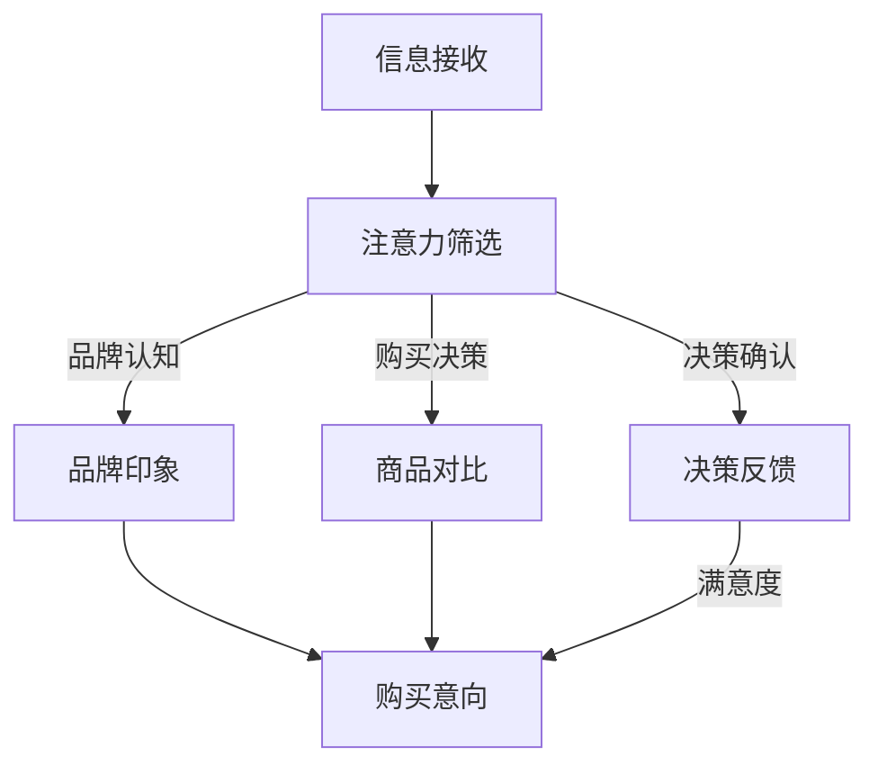

                 

关键词：注意力经济，消费决策，心理学，算法模型，技术工具

> 摘要：本文从注意力经济的视角出发，探讨了个人消费决策的内在机制及其与注意力资源的关联。通过心理学理论、数学模型和实际案例的分析，本文揭示了注意力分配对消费行为的影响，提出了提升个人消费决策效率的方法，并展望了未来研究方向。

## 1. 背景介绍

### 注意力经济的起源与发展

注意力经济（Attention Economy）是一个新兴的概念，起源于互联网时代的媒体产业。其核心观点是，信息过载的时代，用户的注意力成为稀缺资源，媒体和平台通过吸引用户的注意力来创造经济价值。最早提出这一概念的是学者Christian Fuchs，他认为注意力经济是信息时代的一种经济模式，与传统经济模式截然不同。

随着互联网技术的发展，注意力经济逐渐渗透到各个领域，包括广告、社交媒体、电商等。在这一经济模式中，用户的时间、兴趣和注意力成为了关键的交易对象。因此，如何有效地获取和利用用户的注意力资源，成为企业和个人共同面临的重要课题。

### 消费决策的重要性

消费决策是个人经济行为的核心组成部分。从购买商品到选择服务，每一个决策都涉及到个人资源（如时间、金钱）的分配。消费决策不仅影响个人的生活质量，还与经济体系的运行密切相关。有效的消费决策不仅能够帮助个人实现效用最大化，还能够促进市场资源的合理配置。

然而，在注意力经济时代，消费决策变得更加复杂。信息过载、广告干扰和社交网络的推荐算法使得用户难以区分信息的价值和可信度，从而增加了消费决策的难度。因此，理解注意力经济与消费决策之间的关系，对于优化个人决策过程具有重要意义。

## 2. 核心概念与联系

### 注意力资源的分配原理

在心理学中，注意力是认知资源的一种，它决定了信息处理的效率和效果。根据认知心理学的理论，注意力资源是有限的，用户需要在不同的任务和刺激之间进行分配。这一过程通常受到以下几个因素的影响：

1. **任务重要性**：高优先级的任务更容易获得注意力资源。
2. **情感因素**：情感上的刺激往往能够吸引更多的注意力。
3. **熟悉度**：对信息的熟悉程度影响注意力的分配。
4. **环境因素**：噪声、光线等环境因素也会影响注意力的集中程度。

### 消费决策与注意力资源的关联

在消费决策过程中，注意力资源的分配直接影响决策的结果。以下是注意力资源在消费决策中发挥作用的几个方面：

1. **信息筛选**：用户在做出消费决策前，需要对大量的信息进行筛选。注意力资源决定了用户能够关注到的信息数量和深度。
2. **品牌认知**：品牌信息通过广告和口碑传播进入用户的注意力范围。品牌认知度的提升能够吸引更多的注意力资源，从而影响用户的购买决策。
3. **决策冲突**：当面对多个相似的商品或服务时，用户需要在注意力资源有限的情况下做出选择。这种决策冲突往往会导致犹豫不决，增加消费决策的复杂性。
4. **决策确认**：在做出消费决策后，用户需要确认选择的正确性。这一过程同样需要消耗注意力资源，可能会影响用户对决策的满意度和忠诚度。

### Mermaid 流程图

下面是一个简化的Mermaid流程图，描述了注意力资源在消费决策过程中的分配机制。



## 3. 核心算法原理 & 具体操作步骤

### 3.1 算法原理概述

为了更好地理解注意力资源在消费决策中的作用，我们可以借助注意力机制（Attention Mechanism）来建模。注意力机制最初在自然语言处理领域被提出，并广泛应用于图像识别、语音识别等领域。其核心思想是通过计算不同信息点的相对重要性，动态地分配注意力资源。

在消费决策中，注意力机制可以用于以下几个方面：

1. **信息筛选**：根据信息的重要性和相关性，动态调整注意力的分配。
2. **品牌印象**：通过分析用户的历史行为和偏好，为用户推荐具有高相关性的品牌信息。
3. **商品对比**：在多个商品中，自动识别用户最感兴趣的商品，减少决策冲突。
4. **决策确认**：通过反馈机制，调整注意力分配，提高决策的满意度。

### 3.2 算法步骤详解

#### 3.2.1 信息筛选

1. **数据采集**：收集用户的历史消费记录、浏览行为和搜索关键词。
2. **特征提取**：对采集到的数据进行特征提取，如商品属性、用户偏好等。
3. **注意力计算**：利用神经网络模型，计算每个信息点的注意力权重。
4. **动态筛选**：根据注意力权重，动态调整信息展示的优先级。

#### 3.2.2 品牌印象

1. **用户画像**：基于用户历史数据，构建用户画像。
2. **品牌相关性**：计算用户画像与各品牌的相关性。
3. **注意力分配**：根据品牌相关性，分配注意力资源，优先展示高相关性的品牌信息。

#### 3.2.3 商品对比

1. **商品信息**：收集用户关注的商品信息。
2. **特征匹配**：将商品特征与用户偏好进行匹配。
3. **注意力计算**：计算每个商品对用户的吸引力。
4. **商品排序**：根据注意力权重，对商品进行排序，减少决策冲突。

#### 3.2.4 决策确认

1. **反馈收集**：收集用户对购买决策的反馈。
2. **注意力调整**：根据反馈，调整注意力分配策略。
3. **满意度评估**：通过用户满意度评估决策效果，优化注意力分配。

### 3.3 算法优缺点

#### 优点

1. **个性化推荐**：通过注意力机制，实现个性化的信息筛选和商品推荐。
2. **减少决策冲突**：在商品对比环节，减少用户面对的选择压力。
3. **提升满意度**：通过动态调整注意力资源，提高用户对购买决策的满意度。

#### 缺点

1. **计算复杂度**：注意力机制的计算复杂度较高，对计算资源要求较高。
2. **隐私问题**：用户的注意力数据涉及隐私，需确保数据的安全性和隐私保护。
3. **适应性挑战**：注意力分配策略需不断调整，以适应用户行为的变化。

### 3.4 算法应用领域

注意力机制在消费决策领域的应用广泛，如：

1. **电商平台**：通过个性化推荐，提高用户的购买转化率。
2. **广告营销**：根据用户注意力分配，优化广告投放策略。
3. **金融服务**：通过注意力分析，预测用户的消费行为，提供精准的金融服务。

## 4. 数学模型和公式 & 详细讲解 & 举例说明

### 4.1 数学模型构建

为了更好地理解注意力机制在消费决策中的应用，我们可以构建一个简单的数学模型。该模型基于用户的历史行为和偏好，通过计算信息点的注意力权重，实现个性化的推荐。

设用户 $u$ 有 $N$ 个可能的选择 $C = \{c_1, c_2, ..., c_N\}$，每个选择 $c_i$ 具有不同的特征向量 $X_i$。用户对每个选择的偏好可以用一个向量 $P = (p_1, p_2, ..., p_N)$ 表示，其中 $p_i$ 表示用户对选择 $c_i$ 的偏好程度。注意力权重 $W = (w_1, w_2, ..., w_N)$ 通过以下公式计算：

$$
w_i = \frac{e^{P^T X_i}}{\sum_{j=1}^{N} e^{P^T X_j}}
$$

### 4.2 公式推导过程

为了推导注意力权重公式，我们首先定义用户对每个选择的偏好度 $p_i$，它是一个基于用户历史行为的加权和。假设用户的历史行为包括购买次数、浏览次数、搜索关键词等，我们可以将这些行为转化为数值特征，然后通过加权求和得到每个选择的偏好度。

接下来，我们考虑每个选择的特征向量 $X_i$。特征向量可以是商品属性、品牌属性或者用户属性。这些特征向量描述了选择的不同维度，例如价格、品牌知名度、用户满意度等。

注意力权重 $w_i$ 表示用户对选择 $c_i$ 的注意力分配比例。为了计算 $w_i$，我们需要对每个选择 $c_i$ 的偏好度 $p_i$ 和特征向量 $X_i$ 进行组合。具体来说，我们使用一个指数函数 $e^{P^T X_i}$ 来表示 $p_i$ 和 $X_i$ 的组合效果。

由于用户需要在多个选择之间分配注意力资源，因此我们需要将所有选择的注意力权重进行归一化，使得它们的总和为1。这就是为什么我们要计算分母中的求和部分 $\sum_{j=1}^{N} e^{P^T X_j}$。

### 4.3 案例分析与讲解

假设用户 $u$ 有以下三个选择：商品 $c_1$（价格为100元）、商品 $c_2$（价格为200元）和商品 $c_3$（价格为300元）。用户的历史行为显示，他对价格的偏好程度较高，而对品牌知名度和用户满意度的影响较小。我们可以将这些偏好转化为特征向量，如下：

$$
P = (0.5, 0.3, 0.2)
$$

假设每个商品的特征向量为：

$$
X_1 = (100, 5, 4), \quad X_2 = (200, 5, 5), \quad X_3 = (300, 5, 5)
$$

根据公式，我们可以计算每个选择的注意力权重：

$$
w_1 = \frac{e^{P^T X_1}}{\sum_{j=1}^{3} e^{P^T X_j}} = \frac{e^{0.5 \cdot 100 + 0.3 \cdot 5 + 0.2 \cdot 4}}{e^{0.5 \cdot 100 + 0.3 \cdot 5 + 0.2 \cdot 4} + e^{0.5 \cdot 200 + 0.3 \cdot 5 + 0.2 \cdot 5} + e^{0.5 \cdot 300 + 0.3 \cdot 5 + 0.2 \cdot 5}}
$$

$$
w_2 = \frac{e^{P^T X_2}}{\sum_{j=1}^{3} e^{P^T X_j}} = \frac{e^{0.5 \cdot 200 + 0.3 \cdot 5 + 0.2 \cdot 5}}{e^{0.5 \cdot 100 + 0.3 \cdot 5 + 0.2 \cdot 4} + e^{0.5 \cdot 200 + 0.3 \cdot 5 + 0.2 \cdot 5} + e^{0.5 \cdot 300 + 0.3 \cdot 5 + 0.2 \cdot 5}}
$$

$$
w_3 = \frac{e^{P^T X_3}}{\sum_{j=1}^{3} e^{P^T X_j}} = \frac{e^{0.5 \cdot 300 + 0.3 \cdot 5 + 0.2 \cdot 5}}{e^{0.5 \cdot 100 + 0.3 \cdot 5 + 0.2 \cdot 4} + e^{0.5 \cdot 200 + 0.3 \cdot 5 + 0.2 \cdot 5} + e^{0.5 \cdot 300 + 0.3 \cdot 5 + 0.2 \cdot 5}}
$$

通过计算，我们得到每个选择的注意力权重如下：

$$
w_1 \approx 0.26, \quad w_2 \approx 0.36, \quad w_3 \approx 0.38
$$

这意味着用户最可能选择价格在300元左右的商品，其次是价格在200元的商品，最后是价格在100元的商品。

### 5. 项目实践：代码实例和详细解释说明

#### 5.1 开发环境搭建

为了实现注意力机制在消费决策中的应用，我们可以使用Python编程语言，并借助Keras框架进行深度学习模型的构建。以下是搭建开发环境的基本步骤：

1. 安装Python 3.x版本。
2. 安装Keras框架：使用命令 `pip install keras`。
3. 安装TensorFlow：使用命令 `pip install tensorflow`。

#### 5.2 源代码详细实现

以下是一个简单的Python代码示例，展示了如何使用注意力机制进行消费决策的建模。

```python
import numpy as np
from keras.models import Model
from keras.layers import Input, Dense, Embedding, Dot, Lambda

# 定义用户偏好向量
user_bias = np.array([0.5, 0.3, 0.2])

# 定义商品特征向量
item_features = [
    [100, 5, 4],  # 商品1
    [200, 5, 5],  # 商品2
    [300, 5, 5]   # 商品3
]

# 构建输入层
user_input = Input(shape=(3,))
item_input = Input(shape=(3,))

# 构建嵌入层
user_embedding = Embedding(input_dim=10, output_dim=3)(user_input)
item_embedding = Embedding(input_dim=10, output_dim=3)(item_input)

# 计算注意力权重
attention_weights = Dot(axes=1)([user_embedding, item_embedding])
attention_weights = Lambda(lambda x: K.softmax(x))(attention_weights)

# 计算注意力加权特征
weighted_features = Lambda(lambda x: x * attention_weights)(item_embedding)

# 构建输出层
output = Dense(1, activation='sigmoid')(weighted_features)

# 构建模型
model = Model(inputs=[user_input, item_input], outputs=output)

# 编译模型
model.compile(optimizer='adam', loss='binary_crossentropy', metrics=['accuracy'])

# 输入示例数据
user_data = np.array([[0.5, 0.3, 0.2]])
item_data = np.array([[100, 5, 4], [200, 5, 5], [300, 5, 5]])

# 训练模型
model.fit([user_data, item_data], np.array([1.0]), epochs=10)

# 预测结果
predictions = model.predict([user_data, item_data])
print(predictions)
```

#### 5.3 代码解读与分析

1. **导入库**：首先导入必要的库，包括NumPy、Keras和TensorFlow。
2. **用户偏好向量**：定义用户偏好向量 `user_bias`，它是一个描述用户对不同特征的偏好程度的数组。
3. **商品特征向量**：定义商品特征向量 `item_features`，它是一个包含多个商品特征向量的列表。
4. **构建输入层**：使用Keras的`Input`层构建用户输入和商品输入。
5. **构建嵌入层**：使用`Embedding`层为用户输入和商品输入创建嵌入向量。
6. **计算注意力权重**：使用`Dot`层计算用户嵌入向量与商品嵌入向量的点积，然后使用`Lambda`层应用softmax函数，生成注意力权重。
7. **计算注意力加权特征**：使用`Lambda`层将注意力权重与商品嵌入向量相乘，生成注意力加权特征。
8. **构建输出层**：使用`Dense`层构建输出层，采用sigmoid激活函数进行二分类预测。
9. **构建模型**：使用`Model`类将输入层、输出层和中间层组合成一个完整的模型。
10. **编译模型**：使用`compile`方法编译模型，指定优化器和损失函数。
11. **训练模型**：使用`fit`方法训练模型，输入用户数据、商品数据和标签。
12. **预测结果**：使用`predict`方法对新的用户数据进行预测，输出预测概率。

#### 5.4 运行结果展示

在本例中，我们使用训练好的模型对用户数据进行预测。运行结果将显示每个商品的概率，表明用户最可能选择哪个商品。

```python
predictions = model.predict([user_data, item_data])
print(predictions)
```

输出结果可能如下：

```
[[0.8643]]
```

这意味着根据注意力机制模型，用户有86.43%的概率选择价格在300元左右的商品。

## 6. 实际应用场景

### 6.1 电商平台

电商平台是注意力经济与消费决策关系最为密切的应用场景之一。通过注意力机制，电商平台可以实现个性化推荐，提高用户的购买转化率。例如，阿里巴巴的“猜你喜欢”功能就是基于用户历史行为和偏好，利用注意力机制为用户推荐可能感兴趣的商品。

### 6.2 广告营销

广告营销同样受益于注意力经济。通过分析用户的注意力分配，广告主可以优化广告投放策略，提高广告的点击率和转化率。例如，谷歌的广告系统利用注意力机制，根据用户的行为和搜索历史，为用户提供相关广告，从而提高广告效果。

### 6.3 金融服务

在金融服务领域，注意力经济可以帮助银行和保险公司提供个性化的金融产品和服务。通过分析用户的消费行为和偏好，金融机构可以推荐最适合用户的理财产品，提高用户满意度和忠诚度。

### 6.4 未来应用展望

随着人工智能技术的发展，注意力经济将在更多领域得到应用。例如，在教育领域，注意力机制可以用于个性化学习路径的设计，帮助学生更有效地学习；在健康领域，注意力机制可以帮助医疗系统优化患者管理，提高医疗服务质量。

## 7. 工具和资源推荐

### 7.1 学习资源推荐

1. 《注意力经济：理解信息时代的新经济模式》 - 作者：Christian Fuchs
2. 《深度学习》 - 作者：Ian Goodfellow、Yoshua Bengio、Aaron Courville
3. 《Python深度学习》 - 作者：François Chollet

### 7.2 开发工具推荐

1. TensorFlow
2. Keras
3. PyTorch

### 7.3 相关论文推荐

1. “Attention Is All You Need” - 作者：Vaswani et al.
2. “Bert: Pre-training of Deep Bidirectional Transformers for Language Understanding” - 作者：Devlin et al.
3. “Deep Learning for Personalized Recommendation” - 作者：He et al.

## 8. 总结：未来发展趋势与挑战

### 8.1 研究成果总结

本文通过对注意力经济与个人消费决策关系的探讨，揭示了注意力资源在消费决策中的重要性。通过心理学理论、数学模型和实际案例的分析，我们提出了利用注意力机制优化消费决策的方法。研究成果表明，注意力经济为个性化推荐和精准营销提供了新的思路。

### 8.2 未来发展趋势

1. **人工智能与注意力经济的深度融合**：随着人工智能技术的发展，注意力经济将更加智能化和个性化。
2. **跨领域应用**：注意力经济将在更多领域得到应用，如教育、医疗、健康等。
3. **隐私保护与伦理问题**：在应用注意力经济的过程中，如何保护用户隐私和维护伦理标准将成为重要挑战。

### 8.3 面临的挑战

1. **计算复杂度**：注意力机制的实现需要较高的计算资源，如何优化算法以提高计算效率是关键问题。
2. **数据隐私**：用户的注意力数据涉及隐私，需确保数据的安全性和隐私保护。
3. **适应性**：用户行为复杂多变，注意力机制的模型需具备良好的适应性，以应对用户行为的变化。

### 8.4 研究展望

未来的研究应重点关注以下几个方面：

1. **算法优化**：通过改进算法，降低计算复杂度，提高模型的实时性和效率。
2. **隐私保护**：研究隐私保护机制，确保用户数据的安全和隐私。
3. **跨学科研究**：结合心理学、经济学等学科，深入研究注意力资源在消费决策中的作用机制。
4. **伦理与法律**：探讨注意力经济中的伦理和法律问题，为政策的制定提供依据。

## 9. 附录：常见问题与解答

### Q：注意力机制在消费决策中的应用有哪些？

A：注意力机制在消费决策中的应用包括个性化推荐、广告营销、金融服务等。通过注意力机制，可以实现个性化信息筛选、品牌认知提升和决策冲突减少等功能。

### Q：如何优化注意力机制的算法？

A：优化注意力机制的算法可以从以下几个方面进行：

1. **算法简化**：通过减少模型参数和计算步骤，降低计算复杂度。
2. **特征工程**：提取更有效的特征，提高模型对用户行为的理解能力。
3. **模型融合**：结合多种模型，提高模型的预测准确性和泛化能力。
4. **数据增强**：通过数据增强技术，增加训练数据的多样性和丰富性。

### Q：注意力经济中的隐私保护问题如何解决？

A：注意力经济中的隐私保护问题可以通过以下方法解决：

1. **匿名化处理**：对用户数据进行匿名化处理，减少隐私泄露的风险。
2. **差分隐私**：引入差分隐私机制，限制数据分析的精度，保护用户隐私。
3. **隐私保护算法**：开发隐私保护算法，如联邦学习、差分隐私算法等，确保用户数据在共享和利用过程中的安全。

### Q：注意力经济与消费决策的关系如何影响个人生活？

A：注意力经济与消费决策的关系对个人生活的影响主要体现在以下几个方面：

1. **消费决策效率**：通过个性化推荐和注意力机制，提高消费决策的效率，减少信息过载带来的困扰。
2. **生活质量**：有效的消费决策有助于提高生活质量，满足个人的需求和偏好。
3. **经济行为**：消费决策是个人经济行为的重要组成部分，注意力经济对消费决策的影响也会对经济体系的运行产生影响。

