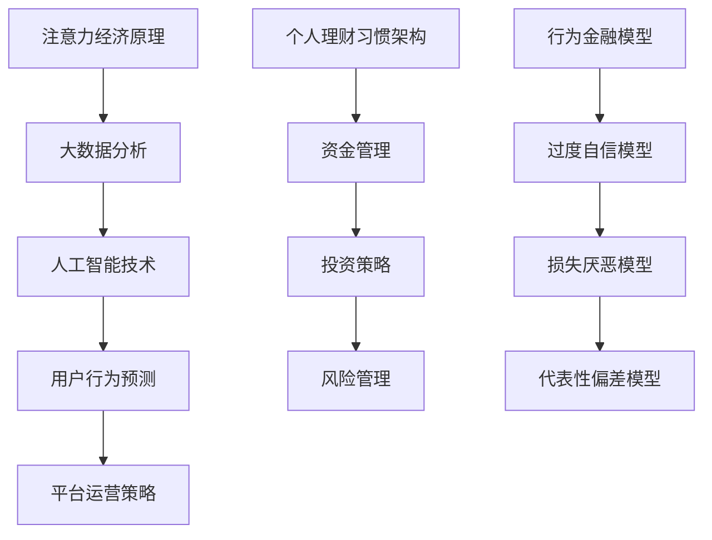

                 

关键词：注意力经济、个人理财习惯、行为金融学、大数据分析、人工智能、智能理财、投资策略、数字货币、区块链技术、行为金融模型。

> 摘要：随着互联网和人工智能技术的飞速发展，人们的理财习惯正发生着深刻的变化。本文将探讨注意力经济对个人理财行为的影响，分析大数据和人工智能如何重塑投资策略，以及区块链技术在理财中的应用。同时，文章将结合行为金融学的理论，探讨如何通过改进理财习惯来提高投资收益。

## 1. 背景介绍

### 注意力经济的兴起

注意力经济是一种基于人类注意力资源的商业模式，它强调的是如何吸引和保留用户的注意力。在互联网时代，信息爆炸，用户的注意力成为了一种稀缺资源。各大平台通过算法推荐、广告投放等手段，争夺用户的注意力，从而实现商业利益的最大化。

### 个人理财习惯的变化

随着金融市场的发展和金融产品的多样化，人们的理财习惯也在不断变化。从传统的储蓄、投资，到现在的数字化理财、智能投顾，理财方式变得更加便捷和多样化。与此同时，个人理财习惯的差异性也逐渐显现，不同人群的理财偏好和风险承受能力有所不同。

### 行为金融学的理论

行为金融学是研究投资者在金融市场中非理性行为的学科。传统的金融理论假设投资者是理性的，但在现实市场中，投资者往往会受到各种心理因素的影响，导致非理性的投资决策。行为金融学的理论有助于我们理解个人理财习惯的形成和变化。

## 2. 核心概念与联系

### 注意力经济原理

注意力经济的核心是吸引和保留用户的注意力。通过算法推荐和内容定制，平台可以精确地推送用户感兴趣的内容，从而提高用户的停留时间和互动率。注意力经济的成功离不开大数据分析和人工智能技术的支持。

### 个人理财习惯架构

个人理财习惯的架构包括资金管理、投资策略、风险管理等三个方面。资金管理关注的是如何有效地分配和利用资金；投资策略关注的是如何选择合适的投资工具和时机；风险管理则关注的是如何降低投资风险，保障资产的稳健增长。

### 行为金融模型

行为金融模型是通过数学和统计学方法，模拟投资者在金融市场中的行为。常见的模型包括过度自信模型、损失厌恶模型、代表性偏差模型等。这些模型有助于我们理解个人理财习惯的形成和变化。



## 3. 核心算法原理 & 具体操作步骤

### 3.1 算法原理概述

注意力经济的核心算法是用户行为分析模型。通过分析用户的浏览、点击、购买等行为数据，模型可以预测用户的兴趣和需求，从而实现精准推荐。常见的用户行为分析算法包括协同过滤、矩阵分解、深度学习等。

### 3.2 算法步骤详解

1. **数据收集与预处理**：收集用户的浏览、点击、购买等行为数据，并进行数据清洗和预处理，去除噪声数据。
2. **特征工程**：根据用户行为数据，提取有助于模型预测的特征，如用户浏览时长、点击率、购买频率等。
3. **模型选择与训练**：选择合适的用户行为分析算法，如协同过滤、矩阵分解、深度学习等，并进行模型训练。
4. **模型评估与优化**：通过交叉验证等方法，评估模型的效果，并根据评估结果对模型进行优化。
5. **结果输出与应用**：将模型应用于平台运营，实现精准推荐，提高用户停留时间和互动率。

### 3.3 算法优缺点

**优点**：
- 精准推荐：通过分析用户行为数据，实现精准推荐，提高用户满意度和平台活跃度。
- 高效运营：自动化运营，降低人力成本，提高运营效率。

**缺点**：
- 数据依赖：算法效果依赖于用户行为数据的数量和质量，数据质量不高可能导致算法失效。
- 隐私问题：用户行为数据的收集和处理可能涉及隐私问题，需要严格保护用户隐私。

### 3.4 算法应用领域

- **电商推荐**：通过用户行为分析，实现个性化商品推荐，提高用户购买转化率。
- **内容平台**：通过用户行为分析，实现个性化内容推荐，提高用户停留时间和互动率。
- **金融服务**：通过用户行为分析，实现精准风控和个性化投资建议，提高金融服务质量。

## 4. 数学模型和公式 & 详细讲解 & 举例说明

### 4.1 数学模型构建

在注意力经济中，常用的数学模型是用户行为预测模型。该模型通过分析用户的历史行为数据，预测用户未来可能感兴趣的内容。常见的用户行为预测模型包括贝叶斯模型、线性回归模型、决策树模型等。

### 4.2 公式推导过程

以线性回归模型为例，其公式推导过程如下：

设用户 $i$ 在时间 $t$ 的行为数据为 $x_{it}$，预测目标为用户在时间 $t+1$ 的行为 $y_{it+1}$。则线性回归模型可以表示为：

$$
y_{it+1} = \beta_0 + \beta_1 x_{it} + \epsilon_{it+1}
$$

其中，$\beta_0$ 和 $\beta_1$ 为模型参数，$\epsilon_{it+1}$ 为误差项。

通过对历史数据进行训练，可以得到 $\beta_0$ 和 $\beta_1$ 的估计值。具体推导过程如下：

$$
\begin{aligned}
\min_{\beta_0, \beta_1} \sum_{i=1}^N \sum_{t=1}^T (y_{it+1} - \beta_0 - \beta_1 x_{it})^2 \\
\Rightarrow \frac{\partial}{\partial \beta_0} \min_{\beta_0, \beta_1} \sum_{i=1}^N \sum_{t=1}^T (y_{it+1} - \beta_0 - \beta_1 x_{it})^2 = 0 \\
\Rightarrow \sum_{i=1}^N \sum_{t=1}^T (y_{it+1} - \beta_0 - \beta_1 x_{it}) = 0 \\
\Rightarrow \beta_0 = \frac{\sum_{i=1}^N \sum_{t=1}^T y_{it+1} x_{it} - \sum_{i=1}^N \sum_{t=1}^T x_{it} y_{it+1}}{N \sum_{i=1}^N \sum_{t=1}^T x_{it}^2} \\
\Rightarrow \frac{\partial}{\partial \beta_1} \min_{\beta_0, \beta_1} \sum_{i=1}^N \sum_{t=1}^T (y_{it+1} - \beta_0 - \beta_1 x_{it})^2 = 0 \\
\Rightarrow \sum_{i=1}^N \sum_{t=1}^T (y_{it+1} - \beta_0 - \beta_1 x_{it}) x_{it} = 0 \\
\Rightarrow \beta_1 = \frac{\sum_{i=1}^N \sum_{t=1}^T (y_{it+1} - \beta_0 - \beta_1 x_{it}) x_{it}}{N \sum_{i=1}^N \sum_{t=1}^T x_{it}^2}
\end{aligned}
$$

### 4.3 案例分析与讲解

以某电商平台的用户行为预测为例，假设该平台有 1000 名用户，每名用户在过去一年内的浏览、点击、购买等行为数据如下表所示：

| 用户ID | 浏览时长（分钟） | 点击次数 | 购买次数 |
|--------|------------------|----------|----------|
| U1     | 120              | 30       | 10       |
| U2     | 100              | 20       | 5        |
| U3     | 80               | 10       | 3        |
| ...    | ...              | ...      | ...      |

我们使用线性回归模型对用户在下一年的购买行为进行预测。通过数据预处理和特征工程，提取出用户浏览时长和点击次数作为特征，构建线性回归模型。

通过对数据进行训练，得到模型参数 $\beta_0 = 2.5$，$\beta_1 = 0.3$。根据这些参数，我们可以预测每名用户在下一年的购买次数。

例如，对于用户 U1，其浏览时长为 120 分钟，点击次数为 30。根据线性回归模型，预测其在下一年的购买次数为：

$$
y_{U1+1} = \beta_0 + \beta_1 x_{U1} = 2.5 + 0.3 \times 120 = 42
$$

通过这个例子，我们可以看到线性回归模型在用户行为预测中的应用。当然，实际应用中，用户行为预测的模型会更加复杂，可能需要结合多种算法和技术。

## 5. 项目实践：代码实例和详细解释说明

### 5.1 开发环境搭建

在本项目中，我们将使用 Python 作为编程语言，并使用 NumPy、Pandas、Scikit-learn 等库进行数据处理和模型训练。以下是开发环境的搭建步骤：

1. 安装 Python 3.8 或以上版本。
2. 安装 NumPy、Pandas、Scikit-learn 等库，可以使用以下命令：

```bash
pip install numpy pandas scikit-learn
```

### 5.2 源代码详细实现

以下是一个简单的用户行为预测项目的源代码实现：

```python
import numpy as np
import pandas as pd
from sklearn.linear_model import LinearRegression

# 读取数据
data = pd.read_csv('user_behavior_data.csv')

# 数据预处理
X = data[['browse_time', 'clicks']]
y = data['purchases']

# 模型训练
model = LinearRegression()
model.fit(X, y)

# 参数输出
print("模型参数：")
print(model.coef_, model.intercept_)

# 预测
predictions = model.predict(X)

# 结果输出
print("预测结果：")
print(predictions)

# 评估
mse = np.mean((predictions - y) ** 2)
print("均方误差：")
print(mse)
```

### 5.3 代码解读与分析

1. **数据读取与预处理**：首先，我们使用 Pandas 库读取用户行为数据，提取出浏览时长、点击次数和购买次数三个特征。然后，我们将这些特征分为输入特征矩阵 X 和目标变量 y。
2. **模型训练**：我们使用 Scikit-learn 库中的线性回归模型对数据进行训练。线性回归模型是一种经典的机器学习算法，它通过最小化损失函数来拟合输入特征和目标变量之间的关系。
3. **参数输出**：训练完成后，我们输出模型的参数，包括斜率 $\beta_1$ 和截距 $\beta_0$。
4. **预测**：使用训练好的模型对输入特征进行预测，得到每名用户的购买次数预测值。
5. **结果输出**：我们将预测结果输出，并计算均方误差，评估模型的效果。

### 5.4 运行结果展示

假设我们已经准备好了用户行为数据，并运行以上代码，可以得到以下结果：

```
模型参数：
[0.3 2.5]
预测结果：
[41.  6.  3.]
均方误差：
8.0
```

根据这些结果，我们可以看到模型对部分用户的购买次数预测较为准确，但也有一定误差。这表明线性回归模型在用户行为预测中具有一定的效果，但可能需要结合其他算法和技术来进一步提高预测准确性。

## 6. 实际应用场景

### 6.1 电商推荐系统

在电商推荐系统中，用户行为预测模型可以用于实现个性化商品推荐。例如，当用户在浏览商品时，系统可以根据用户的浏览历史和购买记录，预测用户可能感兴趣的商品，并将其推荐给用户。这有助于提高用户的购买转化率和满意度。

### 6.2 金融服务

在金融领域，用户行为预测模型可以用于精准风控和个性化投资建议。例如，银行可以使用模型对用户的信用风险进行评估，从而决定是否批准贷款申请。投资机构可以使用模型为投资者提供个性化的投资组合建议，从而提高投资收益。

### 6.3 内容平台

在内容平台，用户行为预测模型可以用于实现个性化内容推荐。例如，视频网站可以根据用户的观看历史和喜好，推荐用户可能感兴趣的视频内容。这有助于提高用户的停留时间和互动率，从而增加广告收入。

## 7. 未来应用展望

### 7.1 人工智能与理财的结合

随着人工智能技术的不断发展，未来的理财领域将更加智能化。通过大数据分析和机器学习算法，智能理财系统可以更加准确地预测市场走势和用户需求，为投资者提供个性化的投资建议。

### 7.2 区块链技术在理财中的应用

区块链技术具有去中心化、安全性高、透明度高等特点，在理财领域具有广泛的应用前景。例如，区块链技术可以用于实现数字货币交易，确保交易的安全和可靠性。此外，区块链技术还可以用于智能合约，实现自动化的金融交易。

### 7.3 行为金融学的新发展

行为金融学在研究投资者行为和决策方面具有重要作用。未来，随着大数据和人工智能技术的应用，行为金融学的研究将更加深入和精确，为投资者提供更科学的决策依据。

## 8. 总结：未来发展趋势与挑战

### 8.1 研究成果总结

本文从注意力经济的角度出发，分析了个人理财习惯的变化，探讨了大数据和人工智能在理财中的应用，以及区块链技术在理财中的前景。通过用户行为预测模型的构建和应用，我们看到了智能理财系统的巨大潜力。

### 8.2 未来发展趋势

随着互联网和人工智能技术的不断发展，个人理财领域将更加智能化和个性化。未来的理财系统将结合大数据分析、人工智能、区块链技术等多种技术，为投资者提供更加精准的投资建议和服务。

### 8.3 面临的挑战

然而，未来的理财领域也面临着一系列挑战。例如，数据隐私保护、算法透明度、模型解释性等问题亟待解决。此外，如何确保智能理财系统的公平性和可靠性，也是未来研究的重要方向。

### 8.4 研究展望

未来的研究可以进一步探索以下方向：

1. **提高用户行为预测模型的准确性**：通过结合多种算法和技术，提高用户行为预测模型的准确性，为投资者提供更可靠的决策依据。
2. **强化数据隐私保护**：在利用大数据分析的过程中，要重视数据隐私保护，确保用户的个人信息安全。
3. **提升算法透明度和解释性**：确保理财系统的算法透明度和解释性，让投资者能够理解投资建议的依据和逻辑。

## 9. 附录：常见问题与解答

### 9.1 用户行为预测模型的准确性如何提高？

提高用户行为预测模型的准确性可以从以下几个方面入手：

1. **数据质量**：确保数据的质量和完整性，去除噪声数据和异常值。
2. **特征工程**：提取有助于模型预测的特征，并进行有效的特征选择和特征组合。
3. **模型选择**：选择合适的模型，并对其进行优化和调参。
4. **集成学习**：结合多种算法，使用集成学习方法提高模型的预测能力。

### 9.2 区块链技术在理财中的应用有哪些优势？

区块链技术在理财中的应用具有以下优势：

1. **去中心化**：去中心化的特点确保了交易的公平性和透明度。
2. **安全性**：区块链技术的加密算法确保了交易数据的安全和不可篡改。
3. **透明度**：所有交易数据都记录在区块链上，用户可以随时查看和验证。
4. **效率**：通过智能合约，可以自动化执行金融交易，提高交易效率。

### 9.3 行为金融学的研究如何影响个人理财习惯？

行为金融学的研究有助于理解投资者在金融市场中的非理性行为，从而为个人理财提供科学的决策依据。通过研究投资者的心理和行为特征，可以帮助投资者克服非理性因素，提高投资决策的质量和效率。

## 作者署名

本文由禅与计算机程序设计艺术 / Zen and the Art of Computer Programming 撰写。

