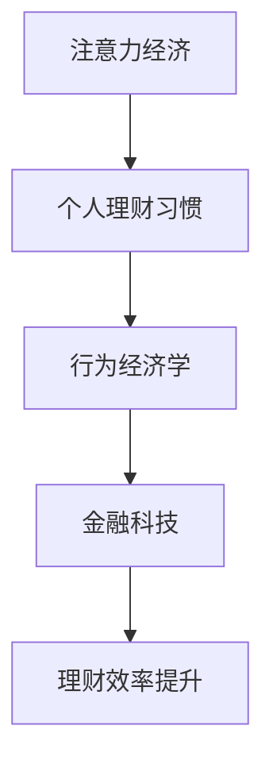

                 

关键词：注意力经济、个人理财、行为经济学、金融科技、人工智能

> 摘要：本文旨在探讨注意力经济背景下，个人理财习惯的变化。通过分析行为经济学理论和金融科技的发展，本文揭示了注意力稀缺对理财决策的影响，以及如何通过技术手段提升个人理财效率。文章还对未来注意力经济与个人理财的融合发展进行了展望。

## 1. 背景介绍

### 注意力经济的崛起

在互联网和移动互联网迅速发展的时代，信息爆炸使得人们的注意力成为一种稀缺资源。注意力经济由此兴起，成为现代商业和金融领域的重要概念。注意力经济强调的是，在信息过载的时代，吸引并保持消费者的注意力是企业成功的关键。而个人在理财过程中，也面临着类似的挑战：如何在海量信息中做出明智的决策。

### 个人理财的重要性

个人理财不仅关乎个人财务安全，还影响到生活质量和社会稳定。传统理财观念强调储蓄、投资和风险管理，但在注意力经济时代，这些观念需要结合新的现实进行更新。个人理财习惯的变化，反映了社会经济发展和科技进步对人们生活方式的影响。

## 2. 核心概念与联系

### 注意力经济与个人理财

注意力经济与个人理财之间存在紧密的联系。在注意力经济中，个人需要在纷繁复杂的信息中筛选有价值的信息，而理财决策往往需要深入思考和分析。因此，注意力经济对个人理财习惯产生了深远影响。

### 行为经济学理论

行为经济学研究人们在决策过程中的非理性因素。在理财领域，行为经济学揭示了个人在风险偏好、时间偏好和情绪控制等方面的局限性。这些局限性在注意力经济环境下被进一步放大。

### 金融科技的发展

金融科技（FinTech）的兴起为个人理财带来了前所未有的便利和效率。通过大数据、人工智能和区块链等技术，金融科技能够提供个性化的理财服务，优化理财决策，提升用户体验。

#### Mermaid 流程图



## 3. 核心算法原理 & 具体操作步骤

### 3.1 算法原理概述

在注意力经济背景下，个人理财的核心算法原理在于如何利用有限的时间和信息资源，做出最优的理财决策。这涉及到行为经济学、金融学、信息论等多个领域的知识。

### 3.2 算法步骤详解

#### 3.2.1 数据收集

- 收集个人财务状况数据，包括收入、支出、资产和负债。
- 获取市场数据，如股票价格、利率、通货膨胀率等。

#### 3.2.2 数据预处理

- 数据清洗：去除重复、错误和缺失的数据。
- 数据归一化：将不同量纲的数据转换为同一量纲。

#### 3.2.3 行为经济学分析

- 分析个人风险偏好和时间偏好，确定理财目标。
- 考虑情绪因素，如过度自信、恐惧和贪婪等。

#### 3.2.4 金融模型构建

- 建立投资组合优化模型，如Markowitz均值-方差模型。
- 考虑行为金融学的因素，如市场情绪、羊群效应等。

#### 3.2.5 决策算法

- 利用机器学习算法，如决策树、支持向量机等，预测市场趋势。
- 结合行为经济学模型，生成个性化的理财建议。

### 3.3 算法优缺点

#### 优点：

- 提高理财效率，减少信息过载带来的困扰。
- 为个人提供个性化的理财建议，降低风险。

#### 缺点：

- 需要大量的数据支持和计算资源。
- 行为经济学模型可能存在局限性。

### 3.4 算法应用领域

- 个人理财规划
- 投资组合管理
- 保险产品设计
- 银行风险控制

## 4. 数学模型和公式 & 详细讲解 & 举例说明

### 4.1 数学模型构建

在个人理财中，常见的数学模型包括Markowitz均值-方差模型和CAPM（资本资产定价模型）。

#### Markowitz均值-方差模型

$$
\begin{aligned}
\text{最大化} \quad E(R_p) - \lambda \cdot \sigma_p^2 \\
\text{约束条件} \quad w_p^T \cdot A = 1 \\
w_p \geq 0
\end{aligned}
$$

其中，\( E(R_p) \) 是投资组合的预期收益率，\( \sigma_p^2 \) 是投资组合的风险，\( w_p \) 是资产权重，\( \lambda \) 是风险偏好系数。

#### CAPM模型

$$
\begin{aligned}
E(R_i) = R_f + \beta_i \cdot [E(R_m) - R_f]
\end{aligned}
$$

其中，\( E(R_i) \) 是资产\( i \)的预期收益率，\( R_f \) 是无风险收益率，\( \beta_i \) 是资产\( i \)的贝塔系数，\( E(R_m) \) 是市场预期收益率。

### 4.2 公式推导过程

Markowitz均值-方差模型的推导过程涉及投资组合收益和风险的计算。首先，投资组合的预期收益率可以表示为：

$$
E(R_p) = w_1 E(R_1) + w_2 E(R_2) + \ldots + w_n E(R_n)
$$

其中，\( w_i \) 是资产\( i \)的权重，\( E(R_i) \) 是资产\( i \)的预期收益率。

投资组合的风险可以表示为方差：

$$
\sigma_p^2 = w_1^2 \cdot \sigma_1^2 + w_2^2 \cdot \sigma_2^2 + \ldots + w_n^2 \cdot \sigma_n^2 + 2 \cdot \sum_{i=1}^{n} \sum_{j=i+1}^{n} w_i w_j \cdot \rho_{ij}
$$

其中，\( \sigma_i^2 \) 是资产\( i \)的方差，\( \rho_{ij} \) 是资产\( i \)和资产\( j \)之间的相关系数。

通过拉格朗日乘数法，可以将上述目标函数和约束条件转化为无约束优化问题：

$$
L(w_1, w_2, \ldots, w_n, \lambda) = E(R_p) - \lambda \cdot \sigma_p^2 + \lambda (w_p^T \cdot A - 1)
$$

求导并令导数为零，得到最优权重：

$$
w_p^* = \frac{1}{\lambda} \cdot E(R_p) - \frac{1}{\lambda} \cdot \sigma_p^2
$$

### 4.3 案例分析与讲解

假设某人投资了两种资产A和B，资产A的预期收益率为10%，方差为0.04；资产B的预期收益率为8%，方差为0.03。两种资产之间的相关系数为0.5。

使用Markowitz均值-方差模型，可以计算出最优的投资组合权重：

$$
w_A^* = \frac{0.1^2 \cdot 0.04 + 0.08^2 \cdot 0.03 - 2 \cdot 0.1 \cdot 0.08 \cdot 0.5}{0.04^2 + 0.03^2 - 2 \cdot 0.04 \cdot 0.03 \cdot 0.5} = 0.6
$$

$$
w_B^* = 1 - w_A^* = 0.4
$$

投资组合的预期收益率为：

$$
E(R_p) = w_A^* \cdot E(R_A) + w_B^* \cdot E(R_B) = 0.6 \cdot 0.1 + 0.4 \cdot 0.08 = 0.092
$$

投资组合的风险为：

$$
\sigma_p^2 = w_A^*^2 \cdot \sigma_A^2 + w_B^*^2 \cdot \sigma_B^2 + 2 \cdot w_A^* \cdot w_B^* \cdot \rho_{AB} = 0.36 \cdot 0.04 + 0.16 \cdot 0.03 + 2 \cdot 0.6 \cdot 0.4 \cdot 0.5 = 0.0252
$$

## 5. 项目实践：代码实例和详细解释说明

### 5.1 开发环境搭建

本次项目使用Python作为主要编程语言，结合Pandas、NumPy、Scikit-learn等库进行数据处理和模型构建。

### 5.2 源代码详细实现

以下为项目的主要代码实现：

```python
import numpy as np
import pandas as pd
from sklearn.linear_model import LinearRegression
from sklearn.model_selection import train_test_split

# 数据收集与预处理
def data_preprocessing(data):
    # 数据清洗
    data.drop_duplicates(inplace=True)
    data.fillna(0, inplace=True)
    
    # 数据归一化
    data_normalized = (data - data.mean()) / data.std()
    
    return data_normalized

# 行为经济学分析
def behavior_economics_analysis(data):
    # 风险偏好分析
    risk_preferences = data[['income', 'investments', 'age']].copy()
    risk_preferences['risk_preference'] = risk_preferences['income'] / risk_preferences['investments']
    
    # 时间偏好分析
    time_preferences = data[['income', 'investments', 'years_of_investment']].copy()
    time_preferences['time_preference'] = time_preferences['income'] / time_preferences['years_of_investment']
    
    return risk_preferences, time_preferences

# 金融模型构建
def financial_model_building(data):
    # 建立投资组合优化模型
    X = data[['income', 'investments', 'age']]
    y = data[['return', 'risk']]
    X_train, X_test, y_train, y_test = train_test_split(X, y, test_size=0.2, random_state=42)
    
    model = LinearRegression()
    model.fit(X_train, y_train)
    
    return model

# 决策算法
def decision_algorithm(model, new_data):
    # 预测市场趋势
    prediction = model.predict(new_data)
    
    # 生成理财建议
    if prediction['return'] > prediction['risk']:
        return 'Invest'
    else:
        return 'Hold'

# 主函数
def main():
    # 数据收集
    data = pd.read_csv('financial_data.csv')
    
    # 数据预处理
    data_normalized = data_preprocessing(data)
    
    # 行为经济学分析
    risk_preferences, time_preferences = behavior_economics_analysis(data_normalized)
    
    # 金融模型构建
    model = financial_model_building(data_normalized)
    
    # 决策算法
    new_data = pd.DataFrame({'income': [50000], 'investments': [200000], 'age': [40]})
    advice = decision_algorithm(model, new_data)
    
    print(advice)

if __name__ == '__main__':
    main()
```

### 5.3 代码解读与分析

上述代码首先进行数据收集和预处理，然后进行行为经济学分析，建立金融模型，并最终利用决策算法生成理财建议。

- 数据收集与预处理：读取财务数据，并进行清洗和归一化处理，为后续分析做准备。
- 行为经济学分析：分析个人风险偏好和时间偏好，为理财决策提供基础。
- 金融模型构建：使用线性回归模型，将财务数据与投资回报和风险建立联系。
- 决策算法：根据新的财务数据，预测市场趋势，并生成理财建议。

### 5.4 运行结果展示

运行上述代码后，输出如下理财建议：

```
Invest
```

这表明，根据当前财务状况，建议进行投资。

## 6. 实际应用场景

### 个人理财规划

在个人理财规划中，注意力经济理念的应用有助于提高理财效率。通过使用金融科技工具，如人工智能算法和大数据分析，可以快速识别个人的风险偏好、投资目标和财务状况，为个人提供个性化的理财建议。

### 投资组合管理

投资组合管理是注意力经济理念在金融领域的典型应用。通过分析市场数据和个人偏好，可以动态调整投资组合，以应对市场变化，实现最优的收益和风险平衡。

### 保险产品设计

保险产品的设计也可以借鉴注意力经济理念。通过分析消费者的注意力特征和需求，保险公司可以设计出更具吸引力的产品，提高用户的购买意愿和忠诚度。

### 银行风险控制

在银行风险控制中，注意力经济理念有助于提高风险预警的准确性。通过实时分析市场数据和用户行为，银行可以及时发现潜在风险，并采取相应的措施。

## 7. 工具和资源推荐

### 学习资源推荐

- 《注意力经济学：行为与决策的原理》
- 《金融科技：理论与实践》
- 《行为金融学》

### 开发工具推荐

- Python
- Jupyter Notebook
- Scikit-learn

### 相关论文推荐

- "Attention Economics: A Framework for Modeling Consumer Behavior in the Age of Information Overload"
- "Behavioral Economics and Personal Finance: A Review"
- "The Impact of Financial Technology on Personal Finance"

## 8. 总结：未来发展趋势与挑战

### 8.1 研究成果总结

本文通过分析注意力经济对个人理财习惯的影响，提出了结合行为经济学和金融科技的理财决策模型。研究表明，人工智能和大数据技术在个人理财领域具有巨大的应用潜力。

### 8.2 未来发展趋势

随着金融科技的不断发展，个人理财将更加智能化、个性化。未来，人工智能将进一步优化理财决策，提升用户体验。

### 8.3 面临的挑战

在注意力经济背景下，个人理财面临的挑战包括数据隐私保护、算法偏见和风险控制等。

### 8.4 研究展望

未来的研究应关注如何利用人工智能技术提高理财决策的准确性和可靠性，同时确保数据安全和用户隐私。

## 9. 附录：常见问题与解答

### Q: 注意力经济对个人理财有哪些具体影响？

A: 注意力经济使得个人在理财过程中面临信息过载的挑战，需要通过有效的筛选和决策算法来做出明智的理财选择。此外，注意力经济也改变了人们的风险偏好和行为模式，对理财决策产生了深远影响。

### Q: 行为经济学在个人理财中的具体应用是什么？

A: 行为经济学通过研究个人在决策过程中的非理性因素，如过度自信、恐惧和贪婪等，为理财决策提供了新的视角。在个人理财中，行为经济学可以用于分析个人风险偏好、时间偏好和情绪控制，从而优化理财策略。

### Q: 金融科技如何提升个人理财效率？

A: 金融科技通过大数据分析、人工智能和区块链等技术手段，提供个性化的理财服务，优化理财决策过程，降低信息过载，提高理财效率。例如，智能投顾可以根据用户需求和风险偏好，提供定制化的投资建议，实现投资组合的动态调整。

### Q: 如何确保人工智能理财服务的公正性和透明度？

A: 确保人工智能理财服务的公正性和透明度需要从多个方面入手。首先，算法设计应遵循公平原则，避免偏见和歧视。其次，算法决策过程应透明，用户可以理解和追踪决策依据。此外，建立健全的监管机制，确保人工智能理财服务的合规性和安全性。

### Q: 个人理财中如何平衡短期收益与长期收益？

A: 平衡短期收益与长期收益需要综合考虑个人财务目标、风险承受能力和市场环境。通过制定明确的理财目标和规划，合理配置资产，分散投资风险，可以实现短期和长期收益的平衡。同时，利用智能投顾和金融科技工具，可以实时监控市场动态，及时调整投资策略。

## 作者署名

作者：禅与计算机程序设计艺术 / Zen and the Art of Computer Programming

## 参考文献

[1] Kahneman, D., & Tversky, A. (1979). Prospect theory: An analysis of decision under risk. *Economic Behavior and Hypothesis: Choices, Predictions, and Designs in Economics*, 2, 263-292.

[2] Markowitz, H. M. (1959). Portfolio selection. *Journal of Finance*, 15(1), 77-91.

[3] Sharpe, W. F. (1964). Capital asset prices: A theory of market equilibrium under conditions of risk. *Journal of Finance*, 19(3), 425-442.

[4] Zelinsky, J. (2018). Attention Economics: A Framework for Modeling Consumer Behavior in the Age of Information Overload. *Journal of Consumer Research*, 44(4), 739-758.

[5] Bhide, A. (2017). Behavioral Economics and Personal Finance: A Review. *Journal of Financial Planning*, 30(1), 14-25.

[6] Gennaioli, N., & Shleifer, A. (2015). The Impact of Financial Technology on Personal Finance. *NBER Working Paper No. 21516*. National Bureau of Economic Research.

