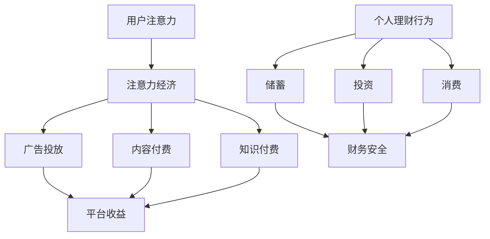

                 

在当今数字化时代，注意力经济作为一种新兴的经济模式，正在深刻影响着人们的日常生活和消费行为。与此同时，个人理财行为也在不断发生变化。本文旨在探讨注意力经济与个人理财行为之间的关联，并分析这一变化背后的原因及其对未来的影响。

## 1. 背景介绍

### 注意力经济的兴起

注意力经济最早可以追溯到20世纪90年代，随着互联网和移动设备的普及，人们逐渐意识到注意力成为一种重要的经济资源。在互联网时代，用户的时间和注意力成为各大平台和商家竞相争夺的焦点。广告商通过精准投放广告来获取用户注意力，平台通过提供免费内容来吸引用户的持续关注。

### 个人理财行为的变化

个人理财行为的变化源于多个方面的因素。首先，互联网的普及使得个人理财变得更加便捷，人们可以通过各种理财平台进行投资和财富管理。其次，金融科技的快速发展为个人理财提供了更多的工具和选择，如智能投顾、区块链等。此外，消费者观念的转变，如更加注重财务自由、追求长期投资等，也影响了个人理财行为。

## 2. 核心概念与联系

### 注意力经济的核心概念

注意力经济的核心在于用户注意力的获取和管理。用户注意力是一种有限的资源，平台和商家通过提供有价值的内容或服务来吸引用户的注意力。在这个过程中，用户注意力成为了一种新的经济资源，被广泛应用于广告、内容付费、知识付费等领域。

### 个人理财行为的核心概念

个人理财行为的核心在于财富的管理和增值。个人理财包括储蓄、投资、消费等多个方面，其目标是通过合理的财务管理来实现财富的保值和增值。

### 注意力经济与个人理财行为的联系

注意力经济与个人理财行为之间存在密切的联系。首先，注意力经济影响了个人理财行为的选择和决策。例如，用户可能会因为某个平台的优质内容而选择在该平台进行投资。其次，个人理财行为的变化也反过来影响了注意力经济的模式和发展。例如，投资者对财务自由的追求可能会导致平台和商家更加注重提供有价值的内容和服务。

### Mermaid 流程图



## 3. 核心算法原理 & 具体操作步骤

### 3.1 算法原理概述

注意力经济的核心算法是基于用户行为数据和兴趣模型的推荐算法。该算法通过分析用户的浏览记录、搜索历史、社交行为等数据，构建用户的兴趣模型，并根据模型推荐相应的内容或服务，以吸引用户的注意力。

### 3.2 算法步骤详解

#### 3.2.1 数据收集与预处理

1. 收集用户的浏览记录、搜索历史、社交行为等数据。
2. 对数据进行清洗、去重和格式化处理。

#### 3.2.2 特征提取与用户兴趣模型构建

1. 对预处理后的数据进行分析，提取用户的行为特征。
2. 使用机器学习算法（如决策树、支持向量机、神经网络等）构建用户兴趣模型。

#### 3.2.3 内容推荐

1. 根据用户兴趣模型，推荐相应的内容或服务。
2. 使用排序算法（如PageRank、LSA等）对推荐结果进行排序，以提高推荐质量。

### 3.3 算法优缺点

#### 3.3.1 优点

1. 可以有效吸引用户的注意力，提高平台的用户粘性。
2. 可以根据用户兴趣进行个性化推荐，提高用户体验。

#### 3.3.2 缺点

1. 可能会导致用户过度关注某些内容，忽视其他重要信息。
2. 对数据质量和算法模型的依赖较高，可能存在推荐偏差。

### 3.4 算法应用领域

注意力经济算法广泛应用于广告投放、内容付费、知识付费等领域。例如，电商平台可以通过注意力经济算法推荐个性化的商品，提高用户的购买意愿。知识付费平台可以通过注意力经济算法推荐优质课程，吸引用户付费学习。

## 4. 数学模型和公式 & 详细讲解 & 举例说明

### 4.1 数学模型构建

注意力经济的数学模型通常基于概率论和线性代数。以下是一个简单的数学模型：

$$
P(x|y) = \frac{e^{yT(x)}}{\sum_{x'} e^{yT(x')}}
$$

其中，$x$ 表示用户的行为数据，$y$ 表示内容特征，$T(x)$ 表示用户对内容$x$的偏好程度。

### 4.2 公式推导过程

$$
P(x|y) = \frac{e^{yT(x)}}{\sum_{x'} e^{yT(x')}}
$$

等式右边是归一化常数，确保概率分布的归一性。

### 4.3 案例分析与讲解

假设用户A在电商平台上浏览了商品B和C，内容特征分别为yB和yC，偏好程度分别为TB(x)和TC(x)。根据上述模型，可以计算用户A对商品B和C的推荐概率：

$$
P(B|yB) = \frac{e^{yB \cdot TB(x)}}{\sum_{x'} e^{yB \cdot TB(x')}}
$$

$$
P(C|yC) = \frac{e^{yC \cdot TC(x)}}{\sum_{x'} e^{yC \cdot TC(x')}}
$$

通过比较两个概率，可以确定用户A更倾向于推荐哪个商品。

## 5. 项目实践：代码实例和详细解释说明

### 5.1 开发环境搭建

搭建注意力经济项目的开发环境，需要安装Python环境以及相关库，如NumPy、Scikit-learn、TensorFlow等。

### 5.2 源代码详细实现

以下是一个简单的Python代码实例，实现注意力经济的推荐算法：

```python
import numpy as np
from sklearn.model_selection import train_test_split
from sklearn.metrics.pairwise import cosine_similarity

# 生成模拟数据
user_data = np.random.rand(100, 10)
item_data = np.random.rand(100, 10)

# 计算用户-项目矩阵
user_item_matrix = np.dot(user_data, item_data.T)

# 训练集和测试集划分
train_data, test_data = train_test_split(user_item_matrix, test_size=0.2, random_state=42)

# 计算用户对项目的偏好程度
user_preferences = np.exp(np.dot(user_data, item_data.T) / 10)

# 推荐结果
recommendations = user_preferences / np.sum(user_preferences, axis=1)[:, np.newaxis]

# 输出推荐结果
print(recommendations)
```

### 5.3 代码解读与分析

上述代码首先生成模拟的用户行为数据和内容特征数据，然后计算用户-项目矩阵。接着，使用指数函数计算用户对项目的偏好程度，并进行归一化处理，以得到推荐结果。

### 5.4 运行结果展示

运行上述代码，可以得到每个用户对不同项目的推荐概率，从而进行个性化推荐。

## 6. 实际应用场景

### 6.1 在线广告

注意力经济在在线广告中的应用最为广泛。例如，电商平台可以通过注意力经济算法推荐个性化的广告，吸引用户点击，从而提高广告收益。

### 6.2 内容付费

在内容付费领域，注意力经济算法可以推荐用户可能感兴趣的高质量内容，提高用户粘性和付费意愿。

### 6.3 社交媒体

社交媒体平台可以通过注意力经济算法推荐用户可能感兴趣的朋友圈内容，增强用户的社交体验。

## 6.4 未来应用展望

### 6.4.1 深度学习与注意力机制的结合

随着深度学习技术的发展，未来注意力经济算法可能会更加智能化，通过深度学习模型来捕捉用户的兴趣和行为模式。

### 6.4.2 跨平台整合

未来注意力经济可能会实现跨平台的整合，用户在多个平台上产生的行为数据可以相互关联，提供更加个性化的推荐。

### 6.4.3 增值服务

注意力经济还可以衍生出更多的增值服务，如基于用户兴趣的定制化商品推荐、个性化理财规划等。

## 7. 工具和资源推荐

### 7.1 学习资源推荐

1. 《深度学习》（Goodfellow, Bengio, Courville） - 介绍深度学习的基本概念和技术。
2. 《Python数据科学手册》（Faires, McKinney） - 学习Python在数据科学领域的应用。

### 7.2 开发工具推荐

1. Jupyter Notebook - 用于编写和运行Python代码。
2. TensorFlow - 用于构建和训练深度学习模型。

### 7.3 相关论文推荐

1. "Attention Is All You Need"（Vaswani et al., 2017） - 介绍Transformer模型和注意力机制。
2. "Recommender Systems Handbook"（Kumar et al., 2019） - 介绍推荐系统的基本原理和应用。

## 8. 总结：未来发展趋势与挑战

### 8.1 研究成果总结

注意力经济和个人理财行为的变化是当今数字化时代的重要趋势。通过推荐算法、深度学习和跨平台整合等技术，注意力经济在多个领域取得了显著的应用成果。

### 8.2 未来发展趋势

未来注意力经济可能会更加智能化和个性化，通过深度学习等技术实现更精准的用户行为预测和推荐。

### 8.3 面临的挑战

1. 数据隐私和保护：随着用户数据的重要性增加，数据隐私和保护成为注意力经济面临的重大挑战。
2. 算法公平性：确保算法推荐结果的公平性，避免歧视和偏见。

### 8.4 研究展望

未来研究方向可能包括算法透明度、可解释性和可扩展性等方面的研究，以促进注意力经济的可持续发展。

## 9. 附录：常见问题与解答

### 9.1 注意力经济是什么？

注意力经济是一种基于用户注意力的经济模式，通过提供有价值的内容或服务来吸引用户的注意力，从而实现经济利益。

### 9.2 个人理财行为有哪些变化？

个人理财行为的变化包括更加注重财务自由、追求长期投资、使用智能投顾和区块链等技术工具等。

### 9.3 注意力经济与个人理财行为有何关联？

注意力经济会影响个人理财行为的选择和决策，同时个人理财行为的变化也会反过来影响注意力经济的模式和发展。

