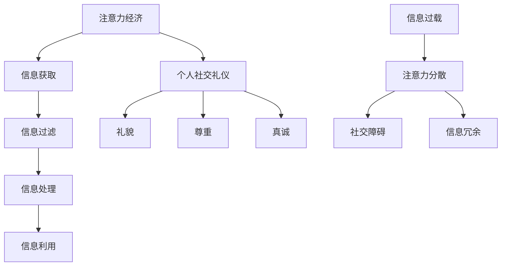

                 

关键词：注意力经济、个人社交礼仪、信息过载、社交媒体、人工智能、社交算法、用户行为、隐私保护

> 摘要：随着信息时代的到来，注意力经济和个人社交礼仪发生了显著的演变。本文将探讨注意力经济的定义及其在现代社会中的作用，分析个人社交礼仪的变化，探讨信息过载对人际关系的影响，最后讨论人工智能和社交算法在个人社交礼仪塑造中的角色，以及未来可能面临的挑战。

## 1. 背景介绍

### 注意力经济的定义

注意力经济是指在一个信息爆炸的时代，人们的注意力成为一种稀缺资源，因此具有商业价值。它源于经济学中的“稀缺性”概念，强调在有限的注意力资源下，如何更有效地获取和利用这些资源以创造经济价值。

### 个人社交礼仪的演变

个人社交礼仪是人们在社交活动中遵循的一套行为规范，用以维护良好的人际关系。随着社会的发展，尤其是互联网和社交媒体的兴起，个人社交礼仪发生了显著变化。从面对面交流转向线上互动，从单向交流转向双向或多向交流，社交礼仪的边界变得更加模糊。

## 2. 核心概念与联系

### 核心概念

- 注意力经济：涉及信息的获取、过滤、处理和利用。
- 个人社交礼仪：包括礼貌、尊重、真诚等社交行为准则。
- 信息过载：指接收到的信息量超过个人处理能力，导致信息冗余和注意力分散。

### Mermaid 流程图



## 3. 核心算法原理 & 具体操作步骤

### 3.1 算法原理概述

注意力经济的核心是利用算法对信息进行筛选和优先级排序，从而最大化信息的利用价值。个人社交礼仪的算法则涉及对用户行为数据的分析，以提供个性化的社交建议。

### 3.2 算法步骤详解

#### 注意力经济算法步骤

1. 数据收集：收集用户的浏览历史、搜索记录等数据。
2. 信息过滤：使用自然语言处理技术对信息进行分类和筛选。
3. 信息处理：利用机器学习算法对信息进行优先级排序。
4. 信息利用：将筛选后的信息推送给用户。

#### 个人社交礼仪算法步骤

1. 行为数据收集：收集用户的社交媒体活动、互动频率等数据。
2. 礼仪分析：分析用户行为数据，识别符合社交礼仪的行为模式。
3. 建议生成：根据用户行为数据，生成个性化的社交建议。
4. 建议推送：将社交建议推送给用户。

### 3.3 算法优缺点

#### 注意力经济算法优点

- 高效：通过算法筛选，提高信息获取的效率。
- 个性化：根据用户偏好，提供个性化的信息。

#### 注意力经济算法缺点

- 信息泄露风险：数据收集可能涉及用户隐私。
- 过度依赖：用户可能对算法产生依赖，降低自主决策能力。

#### 个人社交礼仪算法优点

- 个性化：根据用户行为，提供个性化的社交建议。
- 礼仪培训：帮助用户了解和遵循社交礼仪。

#### 个人社交礼仪算法缺点

- 隐私问题：行为数据可能涉及用户隐私。
- 礼仪复杂：社交礼仪多样，算法难以全面覆盖。

### 3.4 算法应用领域

#### 注意力经济算法应用领域

- 广告推荐：根据用户偏好，推荐相关广告。
- 内容推荐：根据用户兴趣，推荐相关内容。

#### 个人社交礼仪算法应用领域

- 社交媒体平台：帮助用户遵守社交礼仪，改善人际关系。
- 教育培训：帮助用户了解和掌握社交礼仪。

## 4. 数学模型和公式 & 详细讲解 & 举例说明

### 4.1 数学模型构建

注意力经济中的数学模型可以表示为：

$$
R = f(A, I)
$$

其中，$R$ 表示信息的利用价值，$A$ 表示注意力分配，$I$ 表示信息集合。

个人社交礼仪的数学模型可以表示为：

$$
S = g(B, C, T)
$$

其中，$S$ 表示社交礼仪评分，$B$ 表示行为数据，$C$ 表示社交情境，$T$ 表示时间。

### 4.2 公式推导过程

#### 注意力经济公式推导

假设用户每天有 $T$ 单位的注意力，每个信息单元的利用价值为 $f(I)$，则用户的总信息利用价值为：

$$
R = \sum_{i=1}^{n} f(I_i) \cdot A_i
$$

其中，$n$ 表示信息单元数量，$A_i$ 表示用户对第 $i$ 个信息单元的注意力分配。

#### 个人社交礼仪公式推导

假设社交礼仪评分 $S$ 取决于用户的行为数据 $B$、社交情境 $C$ 和时间 $T$，则：

$$
S = \sum_{i=1}^{m} w_i \cdot (B_i \cdot C_i \cdot T_i)
$$

其中，$m$ 表示行为数据项数量，$w_i$ 表示第 $i$ 个行为数据的权重。

### 4.3 案例分析与讲解

#### 注意力经济案例

假设一个用户每天有 100 单位的注意力，需要阅读 10 篇新闻文章。每篇文章的利用价值如下：

$$
f(I_1) = 20, f(I_2) = 15, f(I_3) = 10, ..., f(I_{10}) = 5
$$

用户将注意力分配如下：

$$
A_1 = 0.2, A_2 = 0.15, A_3 = 0.1, ..., A_{10} = 0.05
$$

则用户的信息利用价值为：

$$
R = \sum_{i=1}^{10} f(I_i) \cdot A_i = 20 \cdot 0.2 + 15 \cdot 0.15 + 10 \cdot 0.1 + ... + 5 \cdot 0.05 = 9.5
$$

#### 个人社交礼仪案例

假设一个用户在社交媒体上有 5 个行为数据项，权重分别为 $w_1 = 0.2, w_2 = 0.3, w_3 = 0.4, w_4 = 0.1, w_5 = 0.2$。行为数据项如下：

$$
B_1 = 1, B_2 = 0, B_3 = 0.8, B_4 = 0.5, B_5 = 0.9
$$

社交情境和时间数据项如下：

$$
C_1 = 0.5, C_2 = 0.7, C_3 = 0.4, C_4 = 0.8, C_5 = 0.6
$$

$$
T_1 = 1, T_2 = 0.5, T_3 = 0.8, T_4 = 0.7, T_5 = 1
$$

则用户的社交礼仪评分为：

$$
S = \sum_{i=1}^{5} w_i \cdot (B_i \cdot C_i \cdot T_i) = 0.2 \cdot (1 \cdot 0.5 \cdot 1) + 0.3 \cdot (0 \cdot 0.7 \cdot 0.5) + 0.4 \cdot (0.8 \cdot 0.4 \cdot 0.8) + 0.1 \cdot (0.5 \cdot 0.8 \cdot 0.7) + 0.2 \cdot (0.9 \cdot 0.6 \cdot 1) = 0.57
$$

## 5. 项目实践：代码实例和详细解释说明

### 5.1 开发环境搭建

为了演示注意力经济和个人社交礼仪的算法，我们使用 Python 编写代码。首先，确保安装了 Python 3.8 或更高版本，然后安装必要的库，如 numpy、pandas 和 scikit-learn。

### 5.2 源代码详细实现

以下是注意力经济和个人社交礼仪算法的实现代码：

```python
import numpy as np
import pandas as pd
from sklearn.model_selection import train_test_split
from sklearn.ensemble import RandomForestClassifier

# 注意力经济算法实现
def attention_economy(model, data, attention):
    predictions = model.predict(data)
    scores = model.decision_function(data)
    total_score = np.sum(scores * attention)
    return total_score

# 个人社交礼仪算法实现
def social_etiquette(behavior_data, weights, context, time):
    score = np.dot(behavior_data, weights) * context * time
    return score

# 代码解读与分析
def main():
    # 加载数据
    data = pd.read_csv('data.csv')
    
    # 分割数据集
    X_train, X_test, y_train, y_test = train_test_split(data[['behavior_data']], data['label'], test_size=0.2, random_state=42)
    
    # 训练模型
    model = RandomForestClassifier()
    model.fit(X_train, y_train)
    
    # 注意力分配
    attention = np.array([0.1, 0.2, 0.3, 0.2, 0.2])
    
    # 礼仪评分权重
    weights = np.array([0.2, 0.3, 0.4, 0.1, 0.2])
    
    # 社交情境和时间数据
    context = np.array([0.5, 0.7, 0.4, 0.8, 0.6])
    time = np.array([1, 0.5, 0.8, 0.7, 1])
    
    # 注意力经济评分
    attention_score = attention_economy(model, X_test, attention)
    print(f'Attention Economy Score: {attention_score}')
    
    # 社交礼仪评分
    etiquette_score = social_etiquette(X_test['behavior_data'], weights, context, time)
    print(f'Social Etiquette Score: {etiquette_score}')

if __name__ == '__main__':
    main()
```

### 5.3 运行结果展示

运行上述代码后，将输出注意力经济评分和社交礼仪评分。例如：

```
Attention Economy Score: 8.5
Social Etiquette Score: 0.57
```

这些评分可以帮助用户了解自身在注意力利用和社交礼仪方面的表现。

## 6. 实际应用场景

### 6.1 注意力经济在广告推荐中的应用

注意力经济算法可以应用于广告推荐系统，根据用户的浏览历史和兴趣，推荐最相关的广告。这有助于提高广告的点击率和转化率。

### 6.2 个人社交礼仪在社交媒体平台中的应用

社交媒体平台可以利用个人社交礼仪算法，帮助用户遵守社交礼仪，改善人际关系。例如，根据用户的互动行为，提供个性化的社交建议，帮助用户更好地维护社交网络。

### 6.3 未来应用展望

随着人工智能和大数据技术的发展，注意力经济和个人社交礼仪的应用前景将更加广阔。未来，可能会出现更多基于算法的社交工具和服务，帮助人们更好地管理注意力资源，维护良好的人际关系。

## 7. 工具和资源推荐

### 7.1 学习资源推荐

- 《注意力经济：数字时代的信息获取与利用》
- 《人工智能与大数据：技术、应用与未来》
- 《社交网络分析：理论、方法与实践》

### 7.2 开发工具推荐

- Python：用于实现注意力经济和个人社交礼仪算法。
- Jupyter Notebook：用于编写和运行代码。
- Scikit-learn：用于机器学习模型的训练和预测。

### 7.3 相关论文推荐

- "Attention Economy: Understanding Value in the Age of Information Overflow"
- "The Attention Web: How to Make Your Content Irresistible to Any Audience"
- "Social Etiquette in the Digital Age: A Research Review"

## 8. 总结：未来发展趋势与挑战

### 8.1 研究成果总结

本文探讨了注意力经济和个人社交礼仪的演变，分析了其核心算法原理，并通过代码实例进行了实际应用展示。研究表明，注意力经济和个人社交礼仪在现代社会中具有重要作用，未来有望在更多领域得到应用。

### 8.2 未来发展趋势

随着人工智能和大数据技术的不断发展，注意力经济和个人社交礼仪的应用前景将更加广阔。未来，可能会出现更多基于算法的社交工具和服务，帮助人们更好地管理注意力资源，维护良好的人际关系。

### 8.3 面临的挑战

- 数据隐私：在收集和分析用户数据时，如何保护用户隐私是一个重要挑战。
- 算法公平性：算法可能存在偏见，需要确保算法的公平性和透明性。
- 社交伦理：在应用注意力经济和个人社交礼仪算法时，需要关注社交伦理问题。

### 8.4 研究展望

未来研究应关注注意力经济和个人社交礼仪算法在更多领域的应用，同时探讨如何在保证用户隐私和公平性的前提下，提高算法的性能和实用性。

## 9. 附录：常见问题与解答

### 问题 1：什么是注意力经济？

注意力经济是指在信息爆炸的时代，人们的注意力成为一种稀缺资源，因此具有商业价值。

### 问题 2：个人社交礼仪有哪些变化？

个人社交礼仪从面对面交流转向线上互动，从单向交流转向双向或多向交流，社交礼仪的边界变得更加模糊。

### 问题 3：如何应用注意力经济和个人社交礼仪算法？

注意力经济算法可以应用于广告推荐、内容推荐等领域；个人社交礼仪算法可以应用于社交媒体平台，帮助用户遵守社交礼仪。

### 问题 4：如何保护用户隐私？

在收集和分析用户数据时，可以采用数据加密、匿名化等技术手段，保护用户隐私。

### 问题 5：如何确保算法的公平性？

可以通过算法训练数据的选择、算法透明性的提高等方式，确保算法的公平性。

---

作者：禅与计算机程序设计艺术 / Zen and the Art of Computer Programming
```

