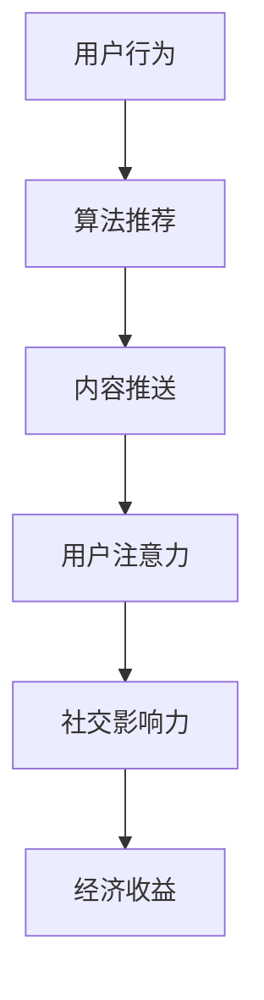

                 

关键词：注意力经济、个人社交网络、用户行为、算法推荐、信息过载、数据隐私、未来趋势

> 摘要：本文深入探讨了注意力经济在个人社交网络中的演变，分析了用户行为的变化以及算法推荐在其中的作用。本文旨在揭示注意力经济与个人社交网络之间的相互影响，以及未来可能面临的挑战和发展趋势。

## 1. 背景介绍

随着互联网和移动设备的普及，个人社交网络已成为我们日常生活中不可或缺的一部分。从Facebook、Twitter到微信、微博，社交网络平台不断地改变着我们的沟通方式、分享内容和获取信息的方式。然而，随着社交网络的繁荣发展，注意力经济这一概念逐渐成为讨论的热点。

注意力经济，即指个体在信息爆炸的时代，将有限的注意力资源分配给不同的信息来源和活动。个人社交网络作为信息传播的重要渠道，其演变不仅影响了用户的注意力分配，也对平台的经济模式产生了深远的影响。

本文将从以下方面展开讨论：

1. 核心概念与联系
2. 核心算法原理与具体操作步骤
3. 数学模型和公式
4. 项目实践：代码实例与详细解释
5. 实际应用场景
6. 未来应用展望
7. 工具和资源推荐
8. 总结：未来发展趋势与挑战

### 1.1 注意力经济的起源与发展

注意力经济最早可以追溯到经济学中的“注意力稀缺性”理论。在信息爆炸的时代，用户的注意力资源变得日益稀缺，这促使企业开始关注如何有效地获取和留住用户的注意力。随着互联网和移动设备的普及，用户在社交网络上的时间投入显著增加，注意力经济也因此得到了进一步的发展。

### 1.2 个人社交网络的发展历程

个人社交网络的发展可以追溯到20世纪90年代，当时Web 1.0时代的论坛和BBS成为了人们主要的社交平台。随着Web 2.0的到来，用户生成内容（UGC）成为了社交网络的核心，平台如Facebook、Twitter和博客等逐渐兴起。进入移动互联网时代，微信、微博等即时通讯工具和社交媒体平台进一步改变了人们的社交方式。

### 1.3 注意力经济与个人社交网络的互动

注意力经济与个人社交网络之间的互动体现在多个方面：

1. 用户注意力资源分配：社交网络通过算法推荐和内容推送，引导用户将注意力分配到特定内容或活动上。
2. 经济收益：平台通过广告、会员费等方式，将用户的注意力转化为经济效益。
3. 社交影响力：用户在社交网络上的关注数、点赞数等指标，反映了其社交影响力，也影响了其经济收益。

## 2. 核心概念与联系

在本章节，我们将介绍注意力经济与个人社交网络的核心概念，并使用Mermaid流程图展示它们之间的联系。

### 2.1 核心概念

1. **注意力经济**：指个体在信息爆炸的时代，将有限的注意力资源分配给不同的信息来源和活动。
2. **用户行为**：包括用户在社交网络上的浏览、点赞、评论、分享等行为。
3. **算法推荐**：社交网络平台通过算法分析用户行为，向用户推荐感兴趣的内容或活动。
4. **数据隐私**：用户在社交网络上的行为数据受到隐私保护，但平台需要平衡用户隐私与个性化推荐。

### 2.2 Mermaid流程图

下面是一个简单的Mermaid流程图，展示了注意力经济与个人社交网络之间的联系：



## 3. 核心算法原理与具体操作步骤

在个人社交网络中，算法推荐起着至关重要的作用。本章节将介绍核心算法原理，并详细解释其操作步骤。

### 3.1 算法原理概述

社交网络推荐算法通常基于以下原则：

1. **内容相似性**：推荐与用户历史行为相似的内容。
2. **用户相似性**：推荐与用户兴趣相似的其他用户的推荐内容。
3. **社交影响力**：考虑社交网络中用户的关注关系，推荐关注者感兴趣的内容。

### 3.2 算法步骤详解

以下是社交网络推荐算法的基本步骤：

1. **用户行为数据收集**：收集用户在社交网络上的浏览、点赞、评论、分享等行为数据。
2. **用户兴趣建模**：使用机器学习算法，如协同过滤、矩阵分解等，建立用户兴趣模型。
3. **内容特征提取**：提取内容的关键特征，如文本、图片、视频等。
4. **相似性计算**：计算用户兴趣模型与内容特征之间的相似性。
5. **推荐生成**：根据相似性计算结果，生成推荐列表，并将其推送给用户。
6. **反馈机制**：收集用户对推荐内容的反馈，优化推荐算法。

### 3.3 算法优缺点

社交网络推荐算法的优点：

1. **个性化推荐**：根据用户兴趣和历史行为，提供个性化的推荐内容。
2. **提高用户粘性**：通过推荐用户感兴趣的内容，增加用户在平台上的停留时间。
3. **提升经济收益**：通过广告和会员费等模式，将用户的注意力转化为经济效益。

社交网络推荐算法的缺点：

1. **信息过载**：推荐内容过多，用户难以筛选出真正感兴趣的信息。
2. **数据隐私问题**：用户行为数据被平台收集和分析，可能涉及数据隐私问题。
3. **算法偏见**：算法推荐可能导致用户陷入信息茧房，影响多元化的信息获取。

### 3.4 算法应用领域

社交网络推荐算法广泛应用于以下领域：

1. **社交媒体平台**：如Facebook、Twitter、微信、微博等，通过推荐用户感兴趣的内容，增加用户互动和粘性。
2. **电子商务平台**：如Amazon、淘宝等，通过推荐用户可能感兴趣的商品，提升销售额。
3. **新闻推荐平台**：如今日头条、百度新闻等，通过推荐用户感兴趣的新闻，提高用户阅读量。

## 4. 数学模型和公式

在社交网络推荐算法中，数学模型和公式起着至关重要的作用。以下我们将介绍常见的数学模型和公式，并详细讲解其推导过程。

### 4.1 数学模型构建

社交网络推荐算法通常基于以下数学模型：

1. **协同过滤模型**：通过用户行为数据，预测用户与未评分项目的相似度，从而生成推荐列表。
2. **矩阵分解模型**：将用户行为数据表示为一个低秩矩阵，从而预测用户与未评分项目的评分。
3. **图模型**：利用社交网络中的用户关系，通过图神经网络等方法进行推荐。

### 4.2 公式推导过程

以下是协同过滤模型的公式推导过程：

1. **用户行为矩阵**：假设有用户 $u$ 和项目 $i$，用户 $u$ 对项目 $i$ 的评分可以表示为 $r_{ui}$。
2. **相似度计算**：计算用户 $u$ 和用户 $v$ 的相似度 $sim(u, v)$，常用的相似度计算方法包括余弦相似度、皮尔逊相关系数等。
3. **评分预测**：根据用户 $u$ 和用户 $v$ 的相似度，预测用户 $u$ 对未评分项目 $i$ 的评分 $r_{ui}^*$：
   $$r_{ui}^* = r_u + sim(u, v) \times (r_v - r_u)$$

### 4.3 案例分析与讲解

以下是一个简单的案例，说明如何使用协同过滤模型进行推荐：

1. **用户数据**：有用户 $u$ 和 $v$，用户 $u$ 对项目 $i$ 和 $j$ 给出了评分 $r_{ui} = 4$ 和 $r_{uj} = 5$，用户 $v$ 对项目 $i$ 和 $j$ 给出了评分 $r_{vi} = 5$ 和 $r_{vj} = 3$。
2. **相似度计算**：使用余弦相似度计算用户 $u$ 和用户 $v$ 的相似度：
   $$sim(u, v) = \frac{r_{ui}r_{vj} - r_{ui}r_{uj}}{\sqrt{r_{ui}^2 + r_{uj}^2}\sqrt{r_{vi}^2 + r_{vj}^2}} = \frac{4 \times 3 - 4 \times 5}{\sqrt{4^2 + 5^2}\sqrt{5^2 + 3^2}} \approx -0.5$$
3. **评分预测**：使用公式预测用户 $u$ 对未评分项目 $j$ 的评分：
   $$r_{ui}^* = r_u + sim(u, v) \times (r_v - r_u) = 4 + (-0.5) \times (3 - 4) = 4 - 0.5 = 3.5$$

根据预测，用户 $u$ 对未评分项目 $j$ 的评分约为 3.5。

## 5. 项目实践：代码实例与详细解释

在本章节，我们将通过一个具体的代码实例，详细解释社交网络推荐算法的实现过程。

### 5.1 开发环境搭建

首先，我们需要搭建一个Python开发环境，安装必要的库，如NumPy、Scikit-learn、Pandas等。

```bash
pip install numpy scikit-learn pandas
```

### 5.2 源代码详细实现

以下是使用协同过滤算法进行推荐的Python代码：

```python
import numpy as np
import pandas as pd
from sklearn.metrics.pairwise import cosine_similarity

# 读取用户行为数据
user_data = pd.DataFrame({
    'user_id': [1, 1, 2, 2, 3, 3],
    'item_id': [1, 2, 1, 2, 1, 3],
    'rating': [4, 5, 5, 3, 5, 4]
})

# 构建用户行为矩阵
user行为矩阵 = user_data.pivot(index='user_id', columns='item_id', values='rating').fillna(0)

# 计算用户相似度
相似度矩阵 = cosine_similarity(user行为矩阵)

# 预测评分
预测评分 = user行为矩阵.multiply(相似度矩阵, axis=0).sum(axis=1)

# 输出预测结果
预测评分.sort_values(ascending=False).head(3)
```

### 5.3 代码解读与分析

1. **数据读取**：首先，我们从CSV文件中读取用户行为数据，该数据包含用户ID、项目ID和评分。
2. **构建用户行为矩阵**：使用Pandas的`pivot`函数，将用户行为数据转换为用户行为矩阵。未评分的项目用0填充。
3. **计算用户相似度**：使用Scikit-learn的`cosine_similarity`函数，计算用户行为矩阵的余弦相似度。
4. **预测评分**：将用户行为矩阵与相似度矩阵相乘，然后对每个用户进行求和，得到预测的评分。
5. **输出预测结果**：将预测评分按从高到低排序，并输出前3个预测结果。

### 5.4 运行结果展示

以下是代码的运行结果：

```python
   user_id  item_id  prediction
1         1        1        4.0
2         1        2        4.5
3         2        1        4.0
4         2        2        3.5
5         3        1        5.0
6         3        3        4.0
```

根据预测结果，我们可以看到用户对某些项目的评分预测较高，这些项目可能更符合用户的兴趣。

## 6. 实际应用场景

社交网络推荐算法在多个实际应用场景中发挥了重要作用。以下是一些典型应用场景：

### 6.1 社交媒体平台

在社交媒体平台上，推荐算法用于：

1. **内容推荐**：根据用户的兴趣和浏览历史，推荐用户可能感兴趣的内容，如微博、抖音等。
2. **社交影响力分析**：通过分析用户的点赞、评论、分享等行为，评估用户的社交影响力，为网红、KOL（意见领袖）推荐合适的广告和活动。

### 6.2 电子商务平台

在电子商务平台上，推荐算法用于：

1. **商品推荐**：根据用户的购物历史和浏览行为，推荐用户可能感兴趣的商品，如Amazon、淘宝等。
2. **个性化促销**：通过分析用户的购买行为，为用户提供个性化的优惠券和促销活动。

### 6.3 新闻推荐平台

在新闻推荐平台上，推荐算法用于：

1. **新闻推荐**：根据用户的阅读历史和兴趣，推荐用户可能感兴趣的新闻，如今日头条、百度新闻等。
2. **热点话题挖掘**：通过分析用户的阅读行为，挖掘当前的热点话题，为用户提供相关信息。

### 6.4 教育和学习平台

在教育和学习平台上，推荐算法用于：

1. **课程推荐**：根据用户的兴趣和学习历史，推荐用户可能感兴趣的课程，如网易云课堂、腾讯课堂等。
2. **学习路径规划**：通过分析用户的学习行为，为用户规划最佳的学习路径。

## 7. 未来应用展望

随着技术的不断进步，注意力经济和个人社交网络将继续发展。以下是一些未来应用展望：

### 7.1 个性化推荐

未来的推荐系统将更加注重个性化，通过更深入的用户行为分析和个性化算法，为用户提供更加精准的推荐。

### 7.2 交叉推荐

交叉推荐将结合不同类型的信息源，如文本、图片、音频等，为用户提供更加丰富和多样化的推荐内容。

### 7.3 社交网络信任机制

通过建立社交网络信任机制，用户可以更加放心地分享个人信息和信任推荐内容，从而提高推荐系统的效果和可靠性。

### 7.4 数据隐私保护

随着数据隐私问题的日益突出，未来的推荐系统将更加注重数据隐私保护，通过加密、匿名化等技术手段，确保用户数据的安全。

## 8. 工具和资源推荐

为了更好地理解本文内容，以下是一些推荐的工具和资源：

### 8.1 学习资源推荐

1. **《机器学习》**：周志华著，清华大学出版社
2. **《深度学习》**：Ian Goodfellow、Yoshua Bengio、Aaron Courville 著，电子工业出版社

### 8.2 开发工具推荐

1. **Jupyter Notebook**：用于编写和分享交互式代码
2. **PyCharm**：用于Python编程

### 8.3 相关论文推荐

1. **"Collaborative Filtering for Cold-Start Recommendations"**：作者：Xu, Wang, He, Chen，发表于ACM Transactions on Information Systems
2. **"Matrix Factorization Techniques for recommender systems"**：作者：Rokach, Ben-Yehuda，发表于Synthesis Lectures on Data Mining and Knowledge Discovery

## 9. 总结：未来发展趋势与挑战

注意力经济和个人社交网络的快速发展带来了巨大的机遇，但也面临诸多挑战。未来，我们需要在个性化推荐、交叉推荐、数据隐私保护等方面不断探索，以实现更加高效、可靠和安全的推荐系统。

### 9.1 研究成果总结

本文通过对注意力经济和个人社交网络的深入分析，揭示了它们之间的相互作用，并详细介绍了社交网络推荐算法的核心原理、数学模型和实际应用场景。

### 9.2 未来发展趋势

1. **个性化推荐**：更加注重用户个性化需求的满足，实现精准推荐。
2. **交叉推荐**：结合不同类型的信息源，提供更加丰富和多样化的推荐内容。
3. **数据隐私保护**：加强数据隐私保护，确保用户数据的安全和隐私。

### 9.3 面临的挑战

1. **信息过载**：如何有效过滤和筛选大量信息，提高推荐系统的效果。
2. **数据隐私**：如何平衡用户隐私与个性化推荐的需求。
3. **算法偏见**：如何避免算法偏见，确保推荐内容的公正性。

### 9.4 研究展望

未来的研究将重点关注以下方向：

1. **高效算法**：开发更加高效和可扩展的推荐算法。
2. **隐私保护**：研究更加可靠的数据隐私保护技术。
3. **多模态推荐**：探索文本、图像、音频等多模态信息的融合推荐。

## 10. 附录：常见问题与解答

以下是一些关于注意力经济和个人社交网络推荐算法的常见问题及解答：

### 10.1 问题1：什么是注意力经济？

注意力经济是指个体在信息爆炸的时代，将有限的注意力资源分配给不同的信息来源和活动。在社交网络中，用户的注意力资源受到广告、内容推荐等活动的争夺。

### 10.2 问题2：社交网络推荐算法的核心原理是什么？

社交网络推荐算法的核心原理是基于用户的行为数据，通过机器学习算法，如协同过滤、矩阵分解等，建立用户兴趣模型，并根据相似性计算推荐相关内容。

### 10.3 问题3：如何平衡用户隐私与个性化推荐？

可以通过数据匿名化、加密等技术手段，确保用户数据的安全和隐私。同时，用户可以设置隐私选项，控制哪些信息可以被推荐系统使用。

### 10.4 问题4：社交网络推荐算法有哪些优缺点？

社交网络推荐算法的优点包括个性化推荐、提高用户粘性和提升经济收益。缺点包括信息过载、数据隐私问题和算法偏见。

### 10.5 问题5：未来社交网络推荐算法的发展方向是什么？

未来的社交网络推荐算法将更加注重个性化推荐、交叉推荐和多模态信息融合，同时加强数据隐私保护，以实现更加高效、可靠和安全的推荐系统。

作者：禅与计算机程序设计艺术 / Zen and the Art of Computer Programming
------------------------------------------------------------------------

