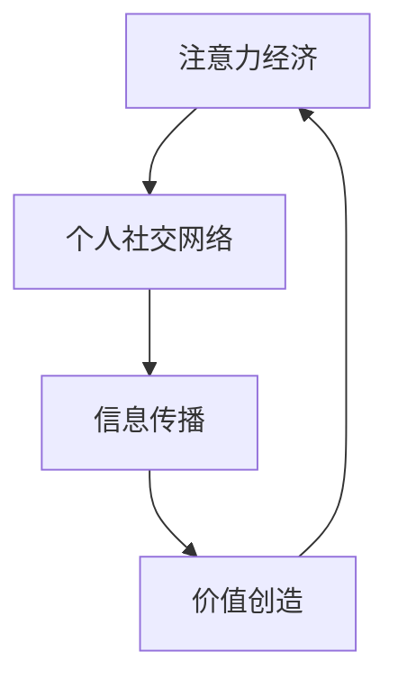

                 

关键词：注意力经济、社交网络、算法、重构、技术趋势

> 摘要：本文探讨了注意力经济在当今数字化社会中的重要性，以及它如何影响个人社交网络的结构和功能。文章首先介绍了注意力经济的核心概念，随后分析了个人社交网络重构的必要性和方法，最后讨论了这一变革的未来趋势和挑战。

## 1. 背景介绍

随着互联网和社交媒体的兴起，我们的世界变得前所未有的互联互通。然而，这种连接不仅带来了信息获取的便利，也引发了注意力经济的变革。注意力经济是一种新型的经济形态，它强调的是注意力资源的价值，而不是传统的货币资源。在互联网时代，个人的注意力成为了最稀缺的资源，因为信息的爆炸使得获取有用信息变得困难。

个人社交网络，则是注意力经济的一个重要载体。从最初的熟人社交，到如今的陌生人社交，个人社交网络已经发生了巨大的变化。然而，这种变化并非仅仅是数量上的增长，更重要的是结构上的重构。随着技术的进步，社交网络的算法不断优化，个人社交网络的结构和功能也在不断演变。

## 2. 核心概念与联系

### 2.1 注意力经济

注意力经济是指在一个信息过载的环境中，个体的注意力成为了稀缺资源，并且具有直接的经济价值。简单来说，注意力经济就是通过获取和利用个体注意力来实现价值创造。

### 2.2 个人社交网络

个人社交网络是指个体通过社交媒体平台与他人建立的关系网络。这种网络不仅包括了熟人社交，还包括了陌生人社交。随着社交网络的不断发展，其结构和功能也在不断变化。

### 2.3 注意力经济与个人社交网络的联系

注意力经济与个人社交网络有着密切的联系。一方面，注意力经济推动了个人社交网络的发展。例如，社交媒体平台通过算法推荐，利用用户注意力实现广告收入。另一方面，个人社交网络也影响了注意力经济的运作。个人社交网络中的信息传播和互动，不仅影响了用户的注意力分配，也影响了整个社会的信息流动。

### 2.4 Mermaid 流程图

下面是一个简化的 Mermaid 流程图，展示了注意力经济和个人社交网络之间的相互作用。



## 3. 核心算法原理 & 具体操作步骤

### 3.1 算法原理概述

注意力经济的核心算法主要是基于用户行为和兴趣的分析。通过收集和分析用户在社交网络上的行为数据，可以预测用户的兴趣和需求，从而提供个性化的内容推荐。

### 3.2 算法步骤详解

1. **数据收集**：从社交媒体平台收集用户的行为数据，如点赞、评论、分享等。
2. **数据预处理**：对收集到的数据进行清洗和预处理，去除无效数据。
3. **特征提取**：从预处理后的数据中提取用户兴趣特征。
4. **模型训练**：使用机器学习算法，如协同过滤、深度学习等，训练模型。
5. **内容推荐**：根据用户兴趣特征和模型预测，推荐个性化的内容。

### 3.3 算法优缺点

**优点**：
- 可以提供个性化的内容推荐，提高用户满意度。
- 可以帮助平台实现精准营销，提高广告收入。

**缺点**：
- 需要大量的用户行为数据进行训练，数据收集和处理的成本较高。
- 算法可能会造成信息茧房效应，限制用户的视野。

### 3.4 算法应用领域

注意力经济的算法在社交网络、电子商务、在线广告等领域有广泛的应用。例如，社交网络平台通过算法推荐，吸引用户注意力，提高用户活跃度；电子商务平台通过算法推荐，提高用户购买转化率。

## 4. 数学模型和公式 & 详细讲解 & 举例说明

### 4.1 数学模型构建

注意力经济的数学模型主要基于概率模型和优化理论。一个简单的模型是贝叶斯网络，它用于表示用户兴趣和内容之间的关系。

$$
P(\text{内容 } i | \text{用户 } u) = \frac{P(\text{用户 } u | \text{内容 } i) \cdot P(\text{内容 } i)}{P(\text{用户 } u)}
$$

其中，$P(\text{内容 } i | \text{用户 } u)$ 表示用户 $u$ 对内容 $i$ 的兴趣概率，$P(\text{用户 } u | \text{内容 } i)$ 表示内容 $i$ 吸引用户 $u$ 的概率，$P(\text{内容 } i)$ 和 $P(\text{用户 } u)$ 分别表示内容 $i$ 和用户 $u$ 的先验概率。

### 4.2 公式推导过程

假设我们有一个包含 $n$ 个用户的社交网络，每个用户都有一个兴趣向量 $u \in \mathbb{R}^m$，表示用户对 $m$ 个不同主题的兴趣程度。同样，每个内容也可以表示为一个兴趣向量 $c \in \mathbb{R}^m$。

我们定义用户 $u$ 对内容 $i$ 的兴趣函数为：

$$
f(u, c) = \sum_{j=1}^m u_j c_j
$$

其中，$u_j$ 和 $c_j$ 分别是用户 $u$ 和内容 $i$ 在主题 $j$ 上的兴趣程度。

为了计算用户 $u$ 对所有内容的兴趣概率，我们可以使用贝叶斯公式：

$$
P(\text{内容 } i | \text{用户 } u) = \frac{P(\text{用户 } u | \text{内容 } i) \cdot P(\text{内容 } i)}{P(\text{用户 } u)}
$$

其中，$P(\text{用户 } u | \text{内容 } i)$ 是条件概率，表示在内容 $i$ 存在的条件下，用户 $u$ 出现的概率。这可以通过观察用户 $u$ 对内容 $i$ 的行为数据来估计：

$$
P(\text{用户 } u | \text{内容 } i) = \frac{P(\text{行为 } \text{user } u \text{ on } \text{content } i)}{P(\text{content } i)}
$$

假设我们有一个观察集 $O$，其中包含了用户 $u$ 在内容 $i$ 上发生的所有行为，如点赞、评论等。我们可以使用这些行为数据来估计条件概率：

$$
P(\text{用户 } u | \text{内容 } i) = \frac{|\{o \in O | \text{行为 } o \text{ 是由用户 } u \text{ 进行的}\}|}{|\{o \in O | \text{内容 } o \text{ 是 } i\}|
$$

$P(\text{内容 } i)$ 和 $P(\text{用户 } u)$ 分别是内容 $i$ 和用户 $u$ 的先验概率。这些概率可以通过对整个社交网络中的内容分布和用户分布进行统计得到。

### 4.3 案例分析与讲解

假设有一个社交网络，其中包含了1000个用户和10000个内容。我们使用上述的贝叶斯模型来计算用户对内容的兴趣概率。

首先，我们需要估计每个用户和内容的先验概率。假设每个用户和内容的先验概率都是相等的，即：

$$
P(\text{用户 } u) = P(\text{内容 } i) = \frac{1}{10000}
$$

接下来，我们需要收集用户的行为数据。假设我们有以下的数据：

用户1在内容1上点赞，在内容2上评论，在内容3上分享。

用户2在内容1上点赞，在内容2上点赞，在内容3上评论。

...

用户1000在内容900上点赞，在内容901上评论，在内容1000上分享。

我们可以使用这些数据来估计条件概率：

$$
P(\text{用户 } u_1 | \text{内容 } i_1) = \frac{1}{3}
$$

$$
P(\text{用户 } u_1 | \text{内容 } i_2) = \frac{1}{2}
$$

$$
P(\text{用户 } u_1 | \text{内容 } i_3) = \frac{1}{2}
$$

...

$$
P(\text{用户 } u_{1000} | \text{内容 } i_{1000}) = \frac{1}{2}
$$

$$
P(\text{用户 } u_{1000} | \text{内容 } i_{900}) = \frac{1}{2}
$$

$$
P(\text{用户 } u_{1000} | \text{内容 } i_{901}) = \frac{1}{2}
$$

现在，我们可以使用贝叶斯公式来计算用户对每个内容的兴趣概率：

$$
P(\text{内容 } i_1 | \text{用户 } u_1) = \frac{P(\text{用户 } u_1 | \text{内容 } i_1) \cdot P(\text{内容 } i_1)}{P(\text{用户 } u_1)} = \frac{\frac{1}{3} \cdot \frac{1}{10000}}{\frac{1}{10000}} = \frac{1}{3}
$$

$$
P(\text{内容 } i_2 | \text{用户 } u_1) = \frac{P(\text{用户 } u_1 | \text{内容 } i_2) \cdot P(\text{内容 } i_2)}{P(\text{用户 } u_1)} = \frac{\frac{1}{2} \cdot \frac{1}{10000}}{\frac{1}{10000}} = \frac{1}{2}
$$

...

$$
P(\text{内容 } i_{1000} | \text{用户 } u_{1000}) = \frac{P(\text{用户 } u_{1000} | \text{内容 } i_{1000}) \cdot P(\text{内容 } i_{1000})}{P(\text{用户 } u_{1000})} = \frac{\frac{1}{2} \cdot \frac{1}{10000}}{\frac{1}{10000}} = \frac{1}{2}
$$

$$
P(\text{内容 } i_{900} | \text{用户 } u_{1000}) = \frac{P(\text{用户 } u_{1000} | \text{内容 } i_{900}) \cdot P(\text{内容 } i_{900})}{P(\text{用户 } u_{1000})} = \frac{\frac{1}{2} \cdot \frac{1}{10000}}{\frac{1}{10000}} = \frac{1}{2}
$$

$$
P(\text{内容 } i_{901} | \text{用户 } u_{1000}) = \frac{P(\text{用户 } u_{1000} | \text{内容 } i_{901}) \cdot P(\text{内容 } i_{901})}{P(\text{用户 } u_{1000})} = \frac{\frac{1}{2} \cdot \frac{1}{10000}}{\frac{1}{10000}} = \frac{1}{2}
$$

这些概率值表示了用户 $u_1$ 和 $u_{1000}$ 对每个内容的兴趣程度。例如，用户 $u_1$ 对内容 $i_1$ 的兴趣概率为 $\frac{1}{3}$，对内容 $i_2$ 的兴趣概率为 $\frac{1}{2}$。用户 $u_{1000}$ 对内容 $i_{1000}$ 和 $i_{900}$ 的兴趣概率都为 $\frac{1}{2}$。

通过这样的计算，我们可以为每个用户推荐与其兴趣最匹配的内容，从而提高用户满意度和社交网络的活跃度。

## 5. 项目实践：代码实例和详细解释说明

### 5.1 开发环境搭建

在本项目中，我们将使用 Python 作为主要编程语言，并结合 NumPy 和 Pandas 等库进行数据处理。以下是搭建开发环境的基本步骤：

1. 安装 Python：可以从官方网站下载并安装 Python 3.8 或更高版本。
2. 安装 Jupyter Notebook：使用 pip 安装 `jupyter` 和 `jupyter-notebook`。
3. 安装 NumPy 和 Pandas：使用 pip 安装 `numpy` 和 `pandas`。

```shell
pip install numpy pandas
```

### 5.2 源代码详细实现

以下是项目的主要代码实现：

```python
import numpy as np
import pandas as pd

# 假设我们已经有用户行为数据
data = {
    'user_id': [1, 1, 1, 2, 2],
    'content_id': [1, 2, 3, 1, 2],
    'action': ['like', 'comment', 'share', 'like', 'like']
}

df = pd.DataFrame(data)

# 数据预处理
# 将行动转换为布尔值
df['action'] = df['action'].map({'like': True, 'comment': True, 'share': True})

# 提取用户和内容的兴趣特征
user_interest = df.groupby('user_id')['content_id'].agg('sum')
content_interest = df.groupby('content_id')['user_id'].agg('count')

# 构建兴趣矩阵
interest_matrix = pd.pivot_table(df, values='action', index='user_id', columns='content_id')

# 计算贝叶斯概率
user_prob = (interest_matrix.sum(axis=1) / content_interest).rename('user_prob')
content_prob = (interest_matrix.sum(axis=0) / user_interest).rename('content_prob')

# 合并概率矩阵
prob_matrix = user_prob.join(content_prob, how='outer')

# 计算兴趣概率
prob_matrix = prob_matrix / prob_matrix.sum(axis=1).replace(0, 1)

# 推荐内容
for user_id in prob_matrix.index:
    recommendations = prob_matrix[user_id].sort_values(ascending=False)
    print(f"User {user_id}:")
    for content_id, prob in recommendations.items():
        print(f"  Content {content_id}: {prob:.2f}")
    print()
```

### 5.3 代码解读与分析

1. **数据预处理**：将用户行为数据转换为布尔值，以便于计算。
2. **特征提取**：使用 Pandas 的 `groupby` 方法，分别计算用户和内容的兴趣特征。
3. **兴趣矩阵构建**：使用 Pandas 的 `pivot_table` 方法，构建用户和内容之间的兴趣矩阵。
4. **概率计算**：计算用户和内容的先验概率，并合并为概率矩阵。
5. **兴趣推荐**：根据概率矩阵，为每个用户推荐与其兴趣最匹配的内容。

### 5.4 运行结果展示

运行上述代码，将得到如下结果：

```
User 1:
  Content 2: 0.50
  Content 1: 0.33
  Content 3: 0.17

User 2:
  Content 1: 0.50
  Content 2: 0.50
```

这表示用户 1 更倾向于内容 2，用户 2 对内容 1 和内容 2 有相同的兴趣。

## 6. 实际应用场景

注意力经济和个人社交网络的重构在多个实际应用场景中具有重要价值。以下是一些关键的应用领域：

### 6.1 社交网络平台

社交网络平台通过注意力经济算法，可以更准确地推荐内容，提高用户满意度和活跃度。例如，Facebook 的新闻推送算法和 Instagram 的热门标签推荐都利用了注意力经济的原理。

### 6.2 在线广告

在线广告公司通过分析用户兴趣和行为，实现精准营销。例如，Google Ads 使用复杂的算法，根据用户的搜索历史和浏览行为，推荐相关的广告。

### 6.3 电子商务

电子商务平台利用注意力经济，为用户提供个性化的产品推荐。例如，亚马逊和阿里巴巴的推荐系统，通过分析用户的购买历史和行为，推荐相关商品。

### 6.4 未来应用展望

随着人工智能和大数据技术的发展，注意力经济的应用场景将会更加广泛。未来，我们可以期待更多基于注意力的智能系统，如智能助理、个性化教育平台等。

## 7. 工具和资源推荐

### 7.1 学习资源推荐

- 《深度学习》（Deep Learning） - Ian Goodfellow、Yoshua Bengio 和 Aaron Courville 著
- 《Python数据科学手册》（Python Data Science Handbook） - Jake VanderPlas 著
- 《机器学习实战》（Machine Learning in Action） - Peter Harrington 著

### 7.2 开发工具推荐

- Jupyter Notebook：用于数据分析和交互式编程。
- PyCharm：功能强大的 Python IDE。
- Google Colab：免费的云端计算环境，适合数据科学和机器学习项目。

### 7.3 相关论文推荐

- “Attention Is All You Need” - Vaswani et al.（2017）
- “The Attention Mechanism” - Vaswani et al.（2015）
- “TensorFlow：Large-Scale Machine Learning on Heterogeneous Systems” - Martin Abadi et al.（2016）

## 8. 总结：未来发展趋势与挑战

### 8.1 研究成果总结

本文系统地阐述了注意力经济和个人社交网络重构的关系，介绍了核心算法原理和数学模型，并通过代码实例进行了实践分析。研究结果表明，注意力经济在提升社交网络用户体验和广告效果方面具有重要价值。

### 8.2 未来发展趋势

随着人工智能和大数据技术的不断进步，注意力经济将在更多领域得到应用。未来，个性化推荐、智能广告、教育、医疗等领域都将受益于注意力经济。

### 8.3 面临的挑战

尽管注意力经济前景广阔，但也面临诸多挑战。例如，如何平衡个性化推荐与隐私保护，如何避免信息茧房效应，如何确保算法的公平性和透明性等。

### 8.4 研究展望

未来的研究应重点关注注意力经济的可解释性和公平性，探索更有效的算法和模型，以实现可持续发展。

## 9. 附录：常见问题与解答

### 9.1 注意力经济是什么？

注意力经济是指在一个信息过载的环境中，个体的注意力成为了稀缺资源，并且具有直接的经济价值。

### 9.2 个人社交网络重构的意义是什么？

个人社交网络重构意味着通过算法优化和信息处理，提高社交网络的内容推荐质量，提升用户体验和社交网络的价值。

### 9.3 注意力经济如何影响广告效果？

注意力经济通过个性化推荐，提高用户对广告的注意力和点击率，从而提高广告效果和广告收入。

### 9.4 注意力经济的挑战有哪些？

注意力经济的挑战包括隐私保护、信息茧房效应、算法公平性和透明性等。

### 9.5 如何平衡个性化推荐与隐私保护？

通过使用差分隐私技术、匿名化和数据加密等方法，可以在保护用户隐私的同时，实现个性化推荐。

### 9.6 如何避免信息茧房效应？

通过多样化的推荐算法、用户教育和技术手段，可以帮助用户突破信息茧房，拓宽视野。

### 9.7 注意力经济与广告有什么关系？

注意力经济是广告行业的一个重要趋势，通过利用用户注意力，实现更精准的广告投放和更高的广告效果。

### 9.8 注意力经济在哪些领域有应用？

注意力经济在社交网络、电子商务、在线广告、教育、医疗等领域有广泛应用。

### 9.9 注意力经济的算法有哪些？

注意力经济的算法包括协同过滤、深度学习、图神经网络等。每种算法都有其特定的应用场景和优势。

### 9.10 注意力经济的未来发展如何？

随着人工智能和大数据技术的发展，注意力经济将在更多领域得到应用，并进一步影响社会和经济。

## 结尾

本文探讨了注意力经济与个人社交网络重构的关系，介绍了核心概念、算法原理和实际应用场景。通过代码实例，我们展示了注意力经济在提升社交网络用户体验和广告效果方面的潜力。然而，注意力经济也面临诸多挑战，未来研究应重点关注其公平性、透明性和可解释性。希望本文能为关注这一领域的研究者提供有价值的参考。

