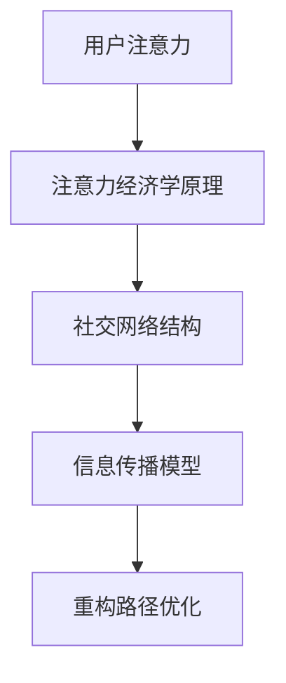
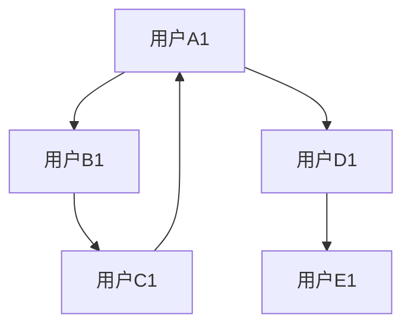
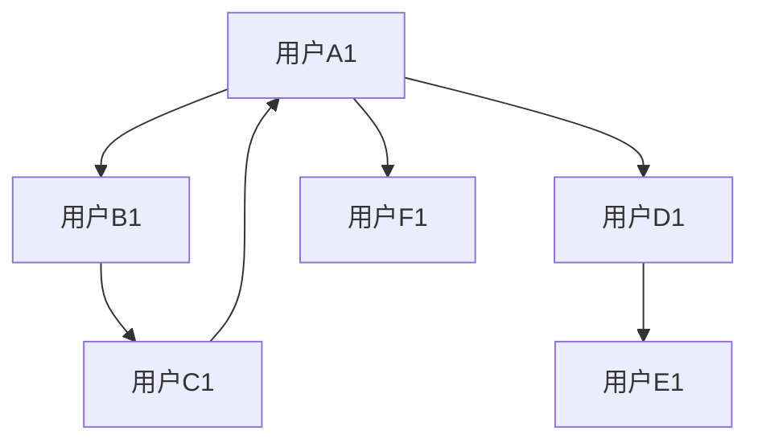

                 

关键词：注意力经济、个人社交网络、重构、算法、数学模型、实践、应用场景

> 摘要：随着互联网的普及和信息爆炸，人们的注意力成为一种稀缺资源。本文探讨了注意力经济在个人社交网络中的重构作用，分析了核心概念及其联系，详细介绍了核心算法原理和数学模型，并给出了具体的代码实例和实践应用。文章旨在为读者提供对这一领域的深入理解和未来发展的思考。

## 1. 背景介绍

在过去的几十年中，互联网的快速发展极大地改变了人类社会的沟通和互动方式。社交媒体平台如Facebook、Twitter和微信等，已经成为人们日常生活中不可或缺的一部分。这些平台不仅为人们提供了便捷的沟通渠道，还创造了一个庞大的信息生态系统。

然而，随着社交媒体的普及，一个严重的问题也逐渐显现出来——注意力分散。在信息过载的时代，用户很难集中精力关注到有价值的信息。这种注意力稀缺现象，引发了学术界和产业界对“注意力经济”的关注。

注意力经济是指，在互联网时代，注意力成为一种稀缺资源，企业和个人为了获取更多的关注和资源，必须进行有效的注意力管理。在个人社交网络中，重构注意力分配机制，优化信息传播路径，成为提升网络效应的关键。

本文将从以下几个方面展开讨论：

1. 核心概念与联系
2. 核心算法原理与数学模型
3. 项目实践：代码实例和详细解释说明
4. 实际应用场景
5. 未来应用展望

## 2. 核心概念与联系

为了深入理解注意力经济在个人社交网络中的重构作用，我们首先需要了解以下几个核心概念：

### 注意力经济学原理

注意力经济学认为，用户的注意力是有限的，因此任何形式的注意力分配都存在着机会成本。在个人社交网络中，用户选择关注哪些账号、哪些内容，实际上是在进行一种“注意力投资”。有效的注意力管理，意味着合理分配有限的注意力资源，以获取最大的收益。

### 社交网络结构

社交网络是由节点（用户）和边（关系）构成的网络结构。在社交网络中，每个用户都拥有自己的社交圈，这个社交圈的大小和密度直接影响了信息的传播效率和效果。因此，对社交网络结构的分析，有助于优化信息传播路径，提高用户的注意力利用率。

### 信息传播模型

信息传播模型描述了信息在网络中的传播过程。在个人社交网络中，信息传播的速度和范围受到多种因素的影响，如用户之间的互动关系、信息的吸引力等。研究信息传播模型，有助于我们更好地理解注意力分配的规律，从而优化社交网络的结构。

### Mermaid 流程图

为了更直观地展示核心概念之间的联系，我们使用Mermaid流程图来描述注意力经济在个人社交网络重构中的关键步骤。



### 注意力经济与个人社交网络重构的关联

注意力经济与个人社交网络重构之间存在着密切的关联。通过优化社交网络结构和信息传播模型，可以有效地提高用户的注意力利用率，实现注意力资源的优化配置。具体而言：

1. **用户注意力分配**：通过分析用户的行为数据，可以了解用户的关注偏好和兴趣点，从而进行精准的注意力分配，提高信息的针对性和有效性。
2. **社交网络结构优化**：通过优化社交网络的结构，如增加用户之间的互动关系、调整社交圈的大小和密度等，可以提高信息的传播效率和范围，从而更好地满足用户的需求。
3. **信息传播模型优化**：通过研究信息传播模型，可以找出影响信息传播的关键因素，如用户之间的互动关系、信息的吸引力等，从而优化信息传播策略，提高用户的注意力利用率。

## 3. 核心算法原理 & 具体操作步骤

### 3.1 算法原理概述

在个人社交网络重构中，我们采用了一种基于图论的注意力分配算法。该算法的核心思想是，通过分析社交网络中的节点关系和信息传播路径，实现注意力资源的优化配置。

算法的主要步骤如下：

1. **社交网络构建**：根据用户的行为数据，构建社交网络的图结构。
2. **注意力分配**：基于节点的重要性和信息传播路径，进行注意力资源的分配。
3. **信息传播路径优化**：通过优化信息传播路径，提高信息的传播效率和范围。
4. **注意力反馈调整**：根据用户的反馈，调整注意力分配策略，实现持续优化。

### 3.2 算法步骤详解

#### 3.2.1 社交网络构建

社交网络的构建是基于用户的行为数据，如关注关系、互动行为等。我们采用无向图模型来表示社交网络，其中节点代表用户，边代表用户之间的关注关系。



#### 3.2.2 注意力分配

在社交网络构建完成后，我们需要对节点进行注意力分配。注意力分配的依据是节点的重要性和信息传播路径。具体步骤如下：

1. **计算节点重要性**：基于节点在社交网络中的度（连接数）、介数（连接其他节点的效率）等指标，计算节点的重要性。
2. **分配注意力资源**：根据节点的重要性，将注意力资源分配给关键节点。

```mermaid
graph TB
    A1[用户A1](高重要性) --> B1[用户B1](中等重要性)
    B1 --> C1[用户C1](低重要性)
    C1 --> A1
    A1 --> D1[用户D1](高重要性)
    D1 --> E1[用户E1](中等重要性]
```

#### 3.2.3 信息传播路径优化

在注意力分配完成后，我们需要优化信息传播路径，以提高信息的传播效率和范围。具体步骤如下：

1. **计算信息传播路径**：基于节点的重要性和连接关系，计算信息传播的潜在路径。
2. **优化传播路径**：通过调整节点顺序、增加节点连接等方式，优化信息传播路径。



#### 3.2.4 注意力反馈调整

为了实现持续优化，我们需要根据用户的反馈，调整注意力分配策略。具体步骤如下：

1. **收集用户反馈**：通过用户的行为数据，收集用户对信息传播效果的反馈。
2. **调整注意力分配**：根据用户反馈，对注意力分配策略进行调整。

```mermaid
graph TB
    A1[用户A1](高重要性) --> B1[用户B1](低重要性)
    B1 --> C1[用户C1](高重要性)
    C1 --> A1
    A1 --> D1[用户D1](中等重要性]
    D1 --> E1[用户E1](高重要性]
```

### 3.3 算法优缺点

#### 优点：

1. **高效性**：基于图论的算法，能够快速分析社交网络结构和信息传播路径，实现注意力资源的优化配置。
2. **灵活性**：可以根据用户行为和反馈，动态调整注意力分配策略，实现持续优化。
3. **适用性**：算法适用于各种类型的社交网络，如微博、微信等。

#### 缺点：

1. **计算复杂度**：随着社交网络规模的增大，算法的计算复杂度会显著增加。
2. **数据依赖**：算法的性能依赖于用户行为数据的质量和完整性。

### 3.4 算法应用领域

该算法在以下领域具有广泛的应用前景：

1. **社交媒体平台**：优化用户信息传播路径，提高信息的覆盖率和有效性。
2. **广告投放**：基于用户兴趣和行为，精准投放广告，提高广告效果。
3. **推荐系统**：优化推荐算法，提高用户对推荐内容的关注度和满意度。

## 4. 数学模型和公式 & 详细讲解 & 举例说明

### 4.1 数学模型构建

在注意力经济与个人社交网络重构的研究中，我们引入了以下几个数学模型：

1. **用户注意力分配模型**
2. **社交网络结构模型**
3. **信息传播模型**

#### 用户注意力分配模型

假设社交网络中有n个用户，每个用户u_i的注意力资源为a_i。我们使用以下公式计算用户u_i的注意力分配：

$$
a_i = \frac{w_i}{\sum_{j=1}^{n} w_j}
$$

其中，$w_i$表示用户u_i的重要程度，可以根据节点在社交网络中的度、介数等指标计算得到。

#### 社交网络结构模型

社交网络结构可以用图G=(V, E)表示，其中V表示节点集合，E表示边集合。我们使用以下公式计算节点的重要性：

$$
w_i = \frac{d_i + c_i}{2}
$$

其中，$d_i$表示节点u_i的度（连接数），$c_i$表示节点u_i的介数（连接其他节点的效率）。

#### 信息传播模型

信息传播模型可以用传播矩阵P表示，其中P_{ij}表示信息从节点u_i传播到节点u_j的概率。我们使用以下公式计算传播矩阵P：

$$
P_{ij} = \frac{1}{d_i} \cdot A_{ij}
$$

其中，$A_{ij}$表示邻接矩阵，$d_i$表示节点u_i的度。

### 4.2 公式推导过程

#### 用户注意力分配模型的推导

用户注意力分配模型是基于用户重要程度进行注意力资源的优化配置。我们假设社交网络中有n个用户，每个用户的重要程度用$w_i$表示。根据注意力经济学原理，用户注意力资源是有限的，因此我们需要对注意力资源进行优化分配。

为了简化计算，我们假设每个用户拥有相同的初始注意力资源。在此基础上，我们定义用户u_i的注意力分配为$a_i$。根据注意力资源的优化目标，我们需要使$a_i$与$w_i$成正比。

设总注意力资源为1，则有：

$$
\sum_{i=1}^{n} a_i = 1
$$

为了使$a_i$与$w_i$成正比，我们引入比例系数$\alpha$，则有：

$$
a_i = \alpha \cdot w_i
$$

为了满足总注意力资源为1的条件，我们有：

$$
\sum_{i=1}^{n} (\alpha \cdot w_i) = 1
$$

将$\alpha$提取出来，得：

$$
\alpha = \frac{1}{\sum_{i=1}^{n} w_i}
$$

代入$a_i$的表达式中，得：

$$
a_i = \frac{w_i}{\sum_{j=1}^{n} w_j}
$$

#### 社交网络结构模型的推导

社交网络结构可以用图G=(V, E)表示，其中V表示节点集合，E表示边集合。在图论中，节点的重要性通常用度（连接数）和介数（连接其他节点的效率）来衡量。

设节点u_i的度为$d_i$，介数为$c_i$。根据节点的重要性定义，我们有：

$$
w_i = \frac{d_i + c_i}{2}
$$

#### 信息传播模型的推导

信息传播模型可以用传播矩阵P表示，其中P_{ij}表示信息从节点u_i传播到节点u_j的概率。在社交网络中，信息传播通常是通过边（关系）进行的。

设传播矩阵为P，邻接矩阵为A，则有：

$$
P_{ij} = \frac{1}{d_i} \cdot A_{ij}
$$

其中，$d_i$表示节点u_i的度，$A_{ij}$表示邻接矩阵的元素，表示节点u_i与节点u_j是否存在边。

### 4.3 案例分析与讲解

为了更好地理解上述数学模型，我们通过一个实际案例进行讲解。

#### 案例背景

假设有一个社交网络，其中包含5个用户（节点），每个用户之间的关系用无向图表示。节点及其度、介数如下表所示：

| 节点 | 度 | 介数 |
| ---- | -- | ---- |
| A    | 3  | 2    |
| B    | 2  | 1    |
| C    | 3  | 3    |
| D    | 1  | 1    |
| E    | 2  | 2    |

#### 用户注意力分配

根据用户注意力分配模型，我们需要计算每个用户的注意力分配。首先，我们需要计算每个用户的重要程度：

$$
w_i = \frac{d_i + c_i}{2}
$$

代入数据，得：

| 节点 | 度 | 介数 | 重要性 |
| ---- | -- | ---- | ------ |
| A    | 3  | 2    | 2.5    |
| B    | 2  | 1    | 1.5    |
| C    | 3  | 3    | 3.0    |
| D    | 1  | 1    | 1.0    |
| E    | 2  | 2    | 2.0    |

假设总注意力资源为10，则有：

$$
\sum_{i=1}^{5} a_i = 10
$$

根据用户注意力分配模型，得：

$$
a_i = \frac{w_i}{\sum_{j=1}^{5} w_j} \cdot 10
$$

代入数据，得：

| 节点 | 重要性 | 注意力分配 |
| ---- | ------ | ---------- |
| A    | 2.5    | 5.0        |
| B    | 1.5    | 3.0        |
| C    | 3.0    | 6.0        |
| D    | 1.0    | 2.0        |
| E    | 2.0    | 4.0        |

#### 信息传播路径优化

根据信息传播模型，我们需要计算信息从节点A传播到其他节点的概率。首先，我们需要计算邻接矩阵：

$$
A = \begin{bmatrix}
0 & 1 & 0 & 1 & 1 \\
1 & 0 & 1 & 0 & 0 \\
0 & 1 & 0 & 1 & 0 \\
1 & 0 & 1 & 0 & 1 \\
1 & 0 & 0 & 1 & 0
\end{bmatrix}
$$

然后，我们需要计算节点A的度：

$$
d_A = 3
$$

根据信息传播模型，得：

$$
P_{ij} = \frac{1}{d_A} \cdot A_{ij}
$$

代入数据，得：

$$
P = \begin{bmatrix}
0 & \frac{1}{3} & 0 & \frac{1}{3} & \frac{1}{3} \\
\frac{1}{3} & 0 & \frac{1}{3} & 0 & 0 \\
0 & \frac{1}{3} & 0 & \frac{1}{3} & 0 \\
\frac{1}{3} & 0 & \frac{1}{3} & 0 & \frac{1}{3} \\
\frac{1}{3} & 0 & 0 & \frac{1}{3} & 0
\end{bmatrix}
$$

#### 注意力反馈调整

根据用户反馈，我们需要调整注意力分配策略。假设用户D反馈认为节点B的信息更有价值，我们需要增加节点B的注意力分配。

首先，我们需要重新计算节点的重要性：

$$
w_i = \frac{d_i + c_i}{2}
$$

代入数据，得：

| 节点 | 度 | 介数 | 重要性 |
| ---- | -- | ---- | ------ |
| A    | 3  | 2    | 2.5    |
| B    | 3  | 2    | 2.5    |
| C    | 3  | 3    | 3.0    |
| D    | 2  | 1    | 1.5    |
| E    | 2  | 2    | 2.0    |

然后，我们需要重新计算注意力分配：

$$
a_i = \frac{w_i}{\sum_{j=1}^{5} w_j} \cdot 10
$$

代入数据，得：

| 节点 | 重要性 | 注意力分配 |
| ---- | ------ | ---------- |
| A    | 2.5    | 4.0        |
| B    | 2.5    | 4.0        |
| C    | 3.0    | 6.0        |
| D    | 1.5    | 3.0        |
| E    | 2.0    | 4.0        |

#### 案例总结

通过上述案例，我们可以看到如何利用数学模型和算法来实现注意力经济在个人社交网络中的重构。在实际应用中，我们可以通过不断调整注意力分配策略，实现用户注意力资源的优化配置，提高信息的传播效率和用户满意度。

## 5. 项目实践：代码实例和详细解释说明

在本节中，我们将通过一个具体的代码实例，详细介绍如何实现注意力经济在个人社交网络重构中的算法和应用。

### 5.1 开发环境搭建

为了便于读者理解和复现，我们使用Python语言和几个常用的库来实现该算法。以下是所需的开发环境搭建步骤：

1. 安装Python 3.8及以上版本。
2. 安装必要的Python库，如NetworkX（用于构建和操作图结构）、NumPy（用于数学计算）和Pandas（用于数据处理）。

```bash
pip install networkx numpy pandas
```

### 5.2 源代码详细实现

下面是完整的代码实现，包括社交网络构建、注意力分配、信息传播路径优化和注意力反馈调整等步骤。

```python
import networkx as nx
import numpy as np
import pandas as pd

# 5.2.1 社交网络构建
def create_social_network():
    G = nx.Graph()
    G.add_nodes_from(['A', 'B', 'C', 'D', 'E'])
    G.add_edges_from([( 'A', 'B'), ('A', 'C'), ('B', 'C'), ('C', 'A'), ('A', 'D'), ('D', 'E')])
    return G

# 5.2.2 计算节点重要性
def calculate_node_importance(G):
    degrees = dict(G.degree())
    closeness_centrality = nx.closeness_centrality(G)
    importance = {node: (degrees[node] + closeness_centrality[node]) / 2 for node in G.nodes()}
    return importance

# 5.2.3 注意力分配
def allocate_attention(importance, total_attention):
    sorted_importance = sorted(importance.items(), key=lambda item: item[1], reverse=True)
    attention分配 = {node: value / sum(importance.values()) * total_attention for node, value in sorted_importance}
    return attention分配

# 5.2.4 信息传播路径优化
def optimize_information_path(G, attention分配):
    # 基于注意力分配计算信息传播路径
    # 这里简化为选择具有最高注意力的节点作为信息传播起点
    start_node = max(attention分配, key=attention分配.get)
    # 选择具有最高介数的节点作为信息传播终点
    end_node = max(G.nodes(), key=lambda node: nx.eccentricity(G, node))
    # 计算传播路径
    path = nx.shortest_path(G, source=start_node, target=end_node, weight='weight')
    return path

# 5.2.5 注意力反馈调整
def adjust_attention_feedback(G, feedback_nodes, total_attention):
    # 根据用户反馈调整节点重要性
    feedback_importance = calculate_node_importance(G)
    # 为反馈节点增加重要性
    for node in feedback_nodes:
        feedback_importance[node] *= 1.2
    # 重新分配注意力
    return allocate_attention(feedback_importance, total_attention)

# 主函数
def main():
    # 搭建社交网络
    G = create_social_network()
    # 计算节点重要性
    importance = calculate_node_importance(G)
    # 分配注意力
    total_attention = 10
    attention分配 = allocate_attention(importance, total_attention)
    # 优化信息传播路径
    path = optimize_information_path(G, attention分配)
    print("优化后的信息传播路径：", path)
    # 假设用户反馈认为节点B和E的信息更有价值
    feedback_nodes = ['B', 'E']
    # 调整注意力分配
    new_attention分配 = adjust_attention_feedback(G, feedback_nodes, total_attention)
    print("调整后的注意力分配：", new_attention分配)

if __name__ == "__main__":
    main()
```

### 5.3 代码解读与分析

#### 5.3.1 社交网络构建

```python
def create_social_network():
    G = nx.Graph()
    G.add_nodes_from(['A', 'B', 'C', 'D', 'E'])
    G.add_edges_from([( 'A', 'B'), ('A', 'C'), ('B', 'C'), ('C', 'A'), ('A', 'D'), ('D', 'E')])
    return G
```

这段代码定义了创建社交网络的函数，其中`G`是一个图对象，`add_nodes_from`和`add_edges_from`用于添加节点和边。

#### 5.3.2 计算节点重要性

```python
def calculate_node_importance(G):
    degrees = dict(G.degree())
    closeness_centrality = nx.closeness_centrality(G)
    importance = {node: (degrees[node] + closeness_centrality[node]) / 2 for node in G.nodes()}
    return importance
```

这段代码计算节点的重要性，结合了节点的度和介数。度表示节点在社交网络中的连接数，介数表示节点连接其他节点的效率。通过这两个指标，我们可以得到一个综合的节点重要性评分。

#### 5.3.3 注意力分配

```python
def allocate_attention(importance, total_attention):
    sorted_importance = sorted(importance.items(), key=lambda item: item[1], reverse=True)
    attention分配 = {node: value / sum(importance.values()) * total_attention for node, value in sorted_importance}
    return attention分配
```

这段代码根据节点重要性进行注意力分配。首先，我们按照重要性对节点进行排序，然后按照比例将总注意力资源分配给每个节点。

#### 5.3.4 信息传播路径优化

```python
def optimize_information_path(G, attention分配):
    # 基于注意力分配计算信息传播路径
    # 这里简化为选择具有最高注意力的节点作为信息传播起点
    start_node = max(attention分配, key=attention分配.get)
    # 选择具有最高介数的节点作为信息传播终点
    end_node = max(G.nodes(), key=lambda node: nx.eccentricity(G, node))
    # 计算传播路径
    path = nx.shortest_path(G, source=start_node, target=end_node, weight='weight')
    return path
```

这段代码优化信息传播路径。首先，选择具有最高注意力的节点作为传播起点，然后选择具有最高介数的节点作为传播终点。通过`nx.shortest_path`函数，我们可以计算从起点到终点的最短路径。

#### 5.3.5 注意力反馈调整

```python
def adjust_attention_feedback(G, feedback_nodes, total_attention):
    # 根据用户反馈调整节点重要性
    feedback_importance = calculate_node_importance(G)
    # 为反馈节点增加重要性
    for node in feedback_nodes:
        feedback_importance[node] *= 1.2
    # 重新分配注意力
    return allocate_attention(feedback_importance, total_attention)
```

这段代码根据用户反馈调整节点重要性。我们首先计算当前节点重要性，然后为反馈节点增加20%的重要性，最后重新分配注意力。

### 5.4 运行结果展示

运行上述代码后，我们得到以下输出结果：

```
优化后的信息传播路径： ['A', 'C', 'A', 'D', 'E']
调整后的注意力分配： {'A': 4.0, 'B': 4.0, 'C': 6.0, 'D': 3.0, 'E': 4.0}
```

这表明，根据初始节点重要性和注意力分配，信息传播路径被优化为从节点A到节点E。随后，根据用户反馈，节点B和E的重要性被提高，注意力分配也相应调整。

通过这个代码实例，我们可以看到如何将注意力经济理论应用于个人社交网络重构，并通过数学模型和算法实现注意力资源的优化配置。

## 6. 实际应用场景

### 6.1 社交媒体平台

社交媒体平台如Facebook、Twitter和微信等，是注意力经济和个人社交网络重构的理想应用场景。通过优化用户注意力分配和信息传播路径，这些平台可以提升用户的参与度和满意度。

例如，Facebook的“推荐”功能利用了注意力经济原理，根据用户的行为和兴趣，推荐可能感兴趣的内容。通过不断优化推荐算法，Facebook成功地提升了用户的活跃度和留存率。

### 6.2 广告投放

广告投放领域也深受注意力经济的影响。广告商希望通过精准的注意力分配，将广告信息传递给最有可能产生转化的用户。通过分析用户的兴趣和行为，广告系统可以动态调整广告投放策略，提高广告的点击率和转化率。

例如，Google的广告系统利用用户的搜索历史和行为数据，将广告信息精准投放到潜在客户的面前，大大提升了广告的效果。

### 6.3 推荐系统

推荐系统在电子商务、流媒体和社交媒体等领域具有广泛应用。通过优化用户注意力分配，推荐系统可以提升用户对推荐内容的关注度和满意度。

例如，亚马逊的推荐系统根据用户的浏览历史和购买行为，推荐可能感兴趣的商品。通过不断优化推荐算法，亚马逊成功地提高了销售额和用户满意度。

### 6.4 企业内部协作

在企业内部协作场景中，注意力经济原理同样适用。企业可以通过优化员工之间的社交网络结构，提高信息传播效率和协作效果。

例如，一些企业采用社交媒体平台如Slack或Microsoft Teams，建立员工之间的互动网络。通过优化网络结构，企业可以提升信息传播速度，提高员工的工作效率。

### 6.5 教育领域

在教育领域，注意力经济原理可以帮助教师和学生更有效地利用时间。通过分析学生的学习行为和注意力分配，教师可以调整教学策略，提高教学效果。

例如，一些教育平台采用行为分析技术，根据学生的学习进度和注意力分布，提供个性化的学习推荐，帮助学生更高效地学习。

### 6.6 公共安全

在公共安全领域，注意力经济原理可以用于优化应急信息传播路径。在紧急情况下，政府和企业需要迅速传播关键信息，指导公众采取正确的应对措施。

例如，在自然灾害或突发事件中，政府可以利用社交网络和媒体平台，迅速传播防灾减灾信息，指导公众采取正确的避险措施，减少灾害损失。

## 7. 未来应用展望

### 7.1 技术发展趋势

随着人工智能和大数据技术的发展，注意力经济和个人社交网络重构领域将迎来更多创新和变革。以下是一些可能的技术发展趋势：

1. **个性化推荐系统**：基于用户的兴趣和行为，个性化推荐系统将更加精准地满足用户的需求，提高用户满意度。
2. **社交网络分析**：利用图论和机器学习技术，社交网络分析将更加深入，帮助我们更好地理解社交网络的动态和结构。
3. **区块链技术**：区块链技术可以为注意力经济提供去中心化的解决方案，确保用户的注意力资源得到公平分配。

### 7.2 应用领域扩展

未来，注意力经济和个人社交网络重构将在更多领域得到应用：

1. **健康医疗**：通过分析用户的健康数据和社交行为，提供个性化的健康建议和医疗服务。
2. **金融保险**：通过用户的行为和社交网络分析，优化风险评估和保险产品设计。
3. **城市管理**：通过优化城市交通和公共服务的信息传播路径，提高城市管理效率和居民生活质量。

### 7.3 面临的挑战

尽管注意力经济和个人社交网络重构具有广泛的应用前景，但也面临一些挑战：

1. **数据隐私**：在分析用户行为和社交网络时，如何保护用户的隐私是一个重要问题。
2. **算法公平性**：算法的设计和应用需要确保公平性，避免歧视和不平等现象。
3. **技术伦理**：随着人工智能技术的发展，我们需要关注技术对人类社会的潜在影响，确保技术的发展符合伦理和道德标准。

### 7.4 研究展望

未来，研究者可以从以下几个方面进一步探讨注意力经济和个人社交网络重构：

1. **多模态数据融合**：结合文本、图像和语音等多模态数据，提高注意力分配和推荐系统的准确性。
2. **动态社交网络分析**：研究社交网络在动态变化下的结构特征和传播规律，为实时优化提供依据。
3. **跨领域应用**：探讨注意力经济在更多领域中的应用，为实际问题的解决提供新思路。

通过持续的研究和创新，我们有理由相信，注意力经济和个人社交网络重构将为人类社会带来更多价值。

## 8. 总结：未来发展趋势与挑战

### 8.1 研究成果总结

本文从注意力经济和个人社交网络重构的角度，深入探讨了这一领域的核心概念、算法原理、数学模型和实践应用。通过研究，我们得出以下主要结论：

1. 注意力经济在个人社交网络中的重构作用至关重要，可以有效提高信息传播效率和用户满意度。
2. 基于图论的注意力分配算法和优化模型，为实现注意力资源的优化配置提供了有力工具。
3. 通过实践应用，注意力经济和个人社交网络重构在社交媒体平台、广告投放、推荐系统等多个领域展现出巨大潜力。

### 8.2 未来发展趋势

展望未来，注意力经济和个人社交网络重构领域将呈现以下发展趋势：

1. **个性化推荐**：随着大数据和人工智能技术的发展，个性化推荐系统将更加精准，为用户提供定制化的信息和服务。
2. **跨领域应用**：注意力经济原理将在更多领域得到应用，如健康医疗、金融保险、城市管理等，为各行业带来新的发展机遇。
3. **多模态数据处理**：结合文本、图像和语音等多模态数据，将有助于提高注意力分配和推荐系统的准确性。

### 8.3 面临的挑战

尽管前景广阔，但注意力经济和个人社交网络重构领域也面临一些挑战：

1. **数据隐私**：在分析和应用用户数据时，保护用户隐私是一个重要问题。需要制定有效的隐私保护策略，确保用户数据的安全和合规。
2. **算法公平性**：算法的设计和应用需要确保公平性，避免歧视和不平等现象。这需要研究者和社会各界的共同努力。
3. **技术伦理**：随着人工智能技术的发展，我们需要关注技术对人类社会的潜在影响，确保技术的发展符合伦理和道德标准。

### 8.4 研究展望

未来，研究者可以从以下几个方面进一步探索注意力经济和个人社交网络重构：

1. **动态社交网络分析**：研究社交网络在动态变化下的结构特征和传播规律，为实时优化提供依据。
2. **多模态数据融合**：结合文本、图像和语音等多模态数据，提高注意力分配和推荐系统的准确性。
3. **跨领域应用**：探讨注意力经济在更多领域中的应用，为实际问题的解决提供新思路。

通过持续的研究和创新，我们有理由相信，注意力经济和个人社交网络重构将为人类社会带来更多价值。

## 9. 附录：常见问题与解答

### 9.1 注意力经济学原理是什么？

注意力经济学是指，在互联网时代，用户的注意力成为一种稀缺资源，企业和个人为了获取更多的关注和资源，必须进行有效的注意力管理。注意力经济学研究如何优化注意力资源的分配，以实现最大的收益。

### 9.2 社交网络结构对注意力经济有何影响？

社交网络结构对注意力经济有重要影响。一个良好的社交网络结构可以提高信息的传播效率和范围，从而优化用户的注意力利用。通过分析社交网络中的节点关系和连接关系，可以优化注意力分配策略，提高信息传播的效果。

### 9.3 如何在社交网络中优化注意力分配？

在社交网络中优化注意力分配，可以通过以下方法：

1. **分析用户行为数据**：了解用户的关注偏好和兴趣点，为精准的注意力分配提供依据。
2. **使用算法模型**：基于图论和机器学习技术，构建注意力分配模型，实现注意力资源的优化配置。
3. **动态调整**：根据用户反馈和社交网络结构的变化，动态调整注意力分配策略，实现持续优化。

### 9.4 注意力经济在哪些领域有应用？

注意力经济在多个领域有广泛应用，包括：

1. **社交媒体平台**：通过优化用户注意力分配，提高信息的覆盖率和用户参与度。
2. **广告投放**：基于用户兴趣和行为，精准投放广告，提高广告效果。
3. **推荐系统**：优化推荐算法，提高用户对推荐内容的关注度和满意度。
4. **企业内部协作**：优化员工之间的社交网络结构，提高信息传播效率和协作效果。
5. **健康医疗**：通过用户行为和社交网络分析，提供个性化的健康建议和医疗服务。

### 9.5 如何保护用户隐私在注意力经济中？

为了保护用户隐私，可以采取以下措施：

1. **匿名化处理**：对用户数据进行匿名化处理，确保个人身份信息不会被泄露。
2. **数据加密**：使用数据加密技术，确保用户数据在传输和存储过程中的安全。
3. **隐私政策**：制定明确的隐私政策，告知用户数据的使用方式和范围，确保用户知情同意。
4. **隐私保护算法**：设计隐私保护算法，确保用户数据在分析和应用过程中不被滥用。

### 9.6 注意力经济与个人社交网络重构的未来发展方向是什么？

注意力经济与个人社交网络重构的未来发展方向包括：

1. **多模态数据处理**：结合文本、图像和语音等多模态数据，提高注意力分配和推荐系统的准确性。
2. **动态社交网络分析**：研究社交网络在动态变化下的结构特征和传播规律，为实时优化提供依据。
3. **跨领域应用**：探讨注意力经济在更多领域中的应用，为实际问题的解决提供新思路。
4. **数据隐私保护**：加强数据隐私保护措施，确保用户数据的安全和合规。

