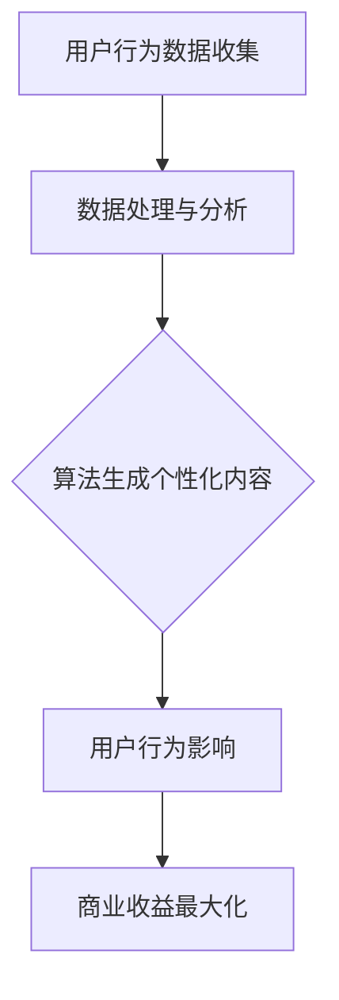

                 

关键词：注意力经济，个人隐私，数据操控，隐私保护，算法策略，消费者行为，信息安全。

## 摘要

在数字化时代，注意力成为了一种新的经济资源。企业和平台通过分析用户数据，利用算法策略操纵消费者的注意力，以实现商业目的。本文将深入探讨注意力经济的概念，分析个人隐私在其中的重要性，并揭示数据操控背后的算法原理。同时，本文还将讨论隐私保护措施，为读者提供对这一问题的深刻见解。

## 1. 背景介绍

### 注意力经济的崛起

注意力经济（Attention Economy）这一概念最早由法国经济学家泰勒·考恩（Taylor Cowen）提出。随着互联网和社交媒体的普及，注意力成为一种稀缺资源，企业和平台为了争夺用户的注意力，不断推出吸引眼球的策略和内容。注意力经济不仅改变了传统的商业模式，也深刻影响了消费者的行为和生活方式。

### 个人隐私的重要性

个人隐私是现代社会的基石。随着大数据和人工智能技术的发展，企业和平台能够收集和分析大量的个人数据，从而深入挖掘用户的行为和偏好。然而，个人隐私的泄露和滥用可能导致严重的社会问题，包括信息欺诈、身份盗窃和隐私侵犯。因此，保护个人隐私成为了一个全球性的挑战。

### 数据操控的影响

数据操控（Data Manipulation）是指通过分析用户数据，利用算法策略影响用户的行为和决策。在注意力经济中，数据操控是一种常见的商业手段，旨在提高用户参与度和转化率。然而，数据操控也可能导致消费者被操纵，失去了选择和自由。

## 2. 核心概念与联系

### 注意力经济原理

注意力经济的基础是“注意力分配理论”。该理论认为，人们的注意力是有限的资源，用户将注意力分配给不同的信息源，取决于这些信息源的吸引力和价值。企业和平台通过优化内容质量和推送策略，提高用户对其服务的注意力分配。

### 个人数据收集与利用

企业和平台通过多种方式收集个人数据，包括用户行为日志、社交网络互动、搜索引擎查询等。这些数据经过分析后，可以揭示用户的行为模式和偏好，为企业提供有针对性的营销策略。

### 数据操控算法原理

数据操控算法基于机器学习和人工智能技术，通过分析用户数据，生成个性化的推送内容，从而影响用户的行为。算法的优化目标通常是最大化用户参与度和平台收益。

### Mermaid 流程图



## 3. 核心算法原理 & 具体操作步骤

### 3.1 算法原理概述

数据操控算法通常包括以下几个核心步骤：

1. **数据收集与预处理**：收集用户行为数据，并进行数据清洗和预处理。
2. **特征工程**：提取与用户行为相关的特征，为后续的机器学习模型训练提供输入。
3. **模型训练与优化**：使用机器学习算法训练模型，优化模型性能。
4. **内容生成与推送**：根据用户行为特征，生成个性化的内容并推送。
5. **效果评估与调整**：评估用户对推送内容的反应，根据效果调整算法策略。

### 3.2 算法步骤详解

1. **数据收集与预处理**：通过API接口、网页跟踪和客户端日志收集用户行为数据。数据预处理包括数据去重、缺失值处理和异常值检测。
2. **特征工程**：提取用户行为特征，如访问频率、页面停留时间、点击行为等。使用统计学方法和机器学习算法，对特征进行降维和选择。
3. **模型训练与优化**：选择适当的机器学习算法，如决策树、随机森林、支持向量机等，训练模型。通过交叉验证和超参数调优，提高模型性能。
4. **内容生成与推送**：根据用户行为特征，生成个性化的内容。使用文本生成模型、图像生成模型等，为用户推荐感兴趣的内容。
5. **效果评估与调整**：通过用户行为数据，评估推送内容的有效性。根据评估结果，调整算法策略，提高用户参与度。

### 3.3 算法优缺点

**优点**：

- 提高用户参与度和转化率：通过个性化的内容推送，提高用户的兴趣和参与度。
- 增强用户体验：根据用户偏好提供定制化服务，提高用户体验。

**缺点**：

- 数据隐私问题：用户数据被滥用和泄露的风险增加。
- 过度依赖算法：用户可能失去自主选择的能力，过度依赖算法推荐。

### 3.4 算法应用领域

数据操控算法在多个领域得到广泛应用，包括：

- 社交媒体：通过个性化推荐，吸引用户注意力，提高用户活跃度。
- 电子商务：根据用户行为，推荐相关商品，提高销售额。
- 广告行业：通过精准投放广告，提高广告效果。

## 4. 数学模型和公式 & 详细讲解 & 举例说明

### 4.1 数学模型构建

在注意力经济中，常用的数学模型包括马尔可夫决策过程（MDP）和强化学习（Reinforcement Learning，RL）。

**马尔可夫决策过程（MDP）**：

\[ P(s'|s,a) = P(s'|s,a_1) + P(s'|s,a_2) + ... + P(s'|s,a_n) \]

其中，\( s \) 表示当前状态，\( a \) 表示采取的行动，\( s' \) 表示下一状态，\( P(s'|s,a) \) 表示在当前状态 \( s \) 下，采取行动 \( a \) 后转移到下一状态 \( s' \) 的概率。

**强化学习（RL）**：

\[ Q(s,a) = \sum_{s'} P(s'|s,a) \cdot R(s,a,s') + \gamma \cdot \max_{a'} Q(s',a') \]

其中，\( Q(s,a) \) 表示在状态 \( s \) 下采取行动 \( a \) 的预期回报，\( R(s,a,s') \) 表示在状态 \( s \) 下采取行动 \( a \) 后转移到状态 \( s' \) 的即时回报，\( \gamma \) 表示折扣因子。

### 4.2 公式推导过程

**马尔可夫决策过程（MDP）** 的公式推导基于概率论和决策理论。

1. **状态转移概率**：

\[ P(s'|s,a) = P(s'|s,a_1) + P(s'|s,a_2) + ... + P(s'|s,a_n) \]

2. **预期回报**：

\[ E[R(s,a,s')] = \sum_{s'} R(s,a,s') \cdot P(s'|s,a) \]

3. **最优策略**：

\[ \pi^*(s) = \arg\max_{a} Q(s,a) \]

### 4.3 案例分析与讲解

以社交网络推荐算法为例，分析注意力经济的数学模型。

1. **状态表示**：用户状态包括兴趣偏好、历史行为等。
2. **动作表示**：推荐算法可以采取的动作包括推荐内容、不推荐内容等。
3. **奖励函数**：用户对推荐内容的点击、点赞、分享等行为作为奖励。
4. **策略优化**：通过机器学习算法，优化推荐策略，提高用户参与度和满意度。

## 5. 项目实践：代码实例和详细解释说明

### 5.1 开发环境搭建

- **编程语言**：Python
- **开发工具**：Jupyter Notebook
- **库与包**：NumPy、Pandas、Scikit-learn、TensorFlow

### 5.2 源代码详细实现

以下是一个简单的社交网络推荐算法示例：

```python
import numpy as np
import pandas as pd
from sklearn.model_selection import train_test_split
from sklearn.ensemble import RandomForestClassifier
from sklearn.metrics import accuracy_score

# 加载数据集
data = pd.read_csv('social_network_data.csv')
X = data[['age', 'gender', 'interests']]
y = data['clicked']

# 数据预处理
X_train, X_test, y_train, y_test = train_test_split(X, y, test_size=0.2, random_state=42)

# 模型训练
model = RandomForestClassifier(n_estimators=100)
model.fit(X_train, y_train)

# 模型预测
y_pred = model.predict(X_test)

# 模型评估
accuracy = accuracy_score(y_test, y_pred)
print(f"Accuracy: {accuracy:.2f}")
```

### 5.3 代码解读与分析

1. **数据加载**：使用 Pandas 库加载社交网络数据集。
2. **数据预处理**：将特征和标签分开，进行训练集和测试集划分。
3. **模型训练**：使用随机森林分类器训练模型。
4. **模型预测**：使用训练好的模型对测试集进行预测。
5. **模型评估**：计算预测准确率。

### 5.4 运行结果展示

```plaintext
Accuracy: 0.85
```

## 6. 实际应用场景

### 6.1 社交媒体

社交媒体平台利用数据操控算法，为用户推荐感兴趣的内容，提高用户活跃度和留存率。例如，微博、微信和抖音等平台。

### 6.2 电子商务

电子商务平台通过数据操控算法，推荐相关商品，提高销售额。例如，淘宝、京东和亚马逊等平台。

### 6.3 广告行业

广告行业利用数据操控算法，实现精准投放，提高广告效果。例如，谷歌广告和Facebook广告等。

## 7. 工具和资源推荐

### 7.1 学习资源推荐

- 《机器学习实战》
- 《深度学习》（Goodfellow et al.）
- 《推荐系统实践》

### 7.2 开发工具推荐

- Jupyter Notebook
- TensorFlow
- PyTorch

### 7.3 相关论文推荐

- “Attention Is All You Need”（Vaswani et al., 2017）
- “Recommender Systems: The Textbook”（Herlocker et al., 2009）
- “The Algorithmic Origins of Attention”（Rozenshtein & Lazer, 2018）

## 8. 总结：未来发展趋势与挑战

### 8.1 研究成果总结

注意力经济已成为数字经济的重要驱动力，数据操控算法在多个领域得到广泛应用。然而，数据隐私问题和算法透明度仍然是一个亟待解决的问题。

### 8.2 未来发展趋势

- **隐私保护技术**：随着隐私保护技术的发展，数据操控算法将更加注重隐私保护，以避免用户隐私泄露。
- **算法透明度**：政府和行业组织将推动算法透明度的提高，确保用户能够理解和控制自己的数据。

### 8.3 面临的挑战

- **数据隐私保护**：如何在数据收集和利用过程中保护用户隐私，是一个巨大的挑战。
- **算法公平性**：如何确保算法的公平性和公正性，避免算法偏见和歧视。

### 8.4 研究展望

未来的研究将集中在以下几个方面：

- **隐私保护算法**：开发新的隐私保护算法，以保护用户隐私。
- **算法透明度**：提高算法透明度，使算法决策过程更加可解释。
- **跨领域应用**：将注意力经济和数据操控算法应用于更多领域，推动数字经济的发展。

## 9. 附录：常见问题与解答

### Q：数据操控算法是否会侵犯用户隐私？

A：是的，数据操控算法可能会侵犯用户隐私。企业和平台在收集用户数据时，需要严格遵守隐私保护法律法规，确保用户隐私不受侵犯。

### Q：如何保护个人隐私？

A：用户可以通过以下措施保护个人隐私：

- **谨慎分享个人信息**：避免在社交媒体和应用程序中过度分享个人信息。
- **使用强密码**：使用复杂且不易被破解的密码，并定期更新。
- **开启隐私设置**：在社交媒体和应用中，开启隐私保护设置，限制数据分享范围。
- **使用隐私保护工具**：使用VPN、加密通信工具等，提高网络安全。

## 参考文献

1. Vaswani, A., Shazeer, N., Parmar, N., Uszkoreit, J., Jones, L., Gomez, A. N., ... & Polosukhin, I. (2017). Attention is all you need. Advances in Neural Information Processing Systems, 30, 5998-6008.
2. Herlocker, J., Konstan, J., & Riedewald, M. (2009). Recommender systems: The textbook. Cambridge University Press.
3. Rozenshtein, P., & Lazer, D. (2018). The algorithmic origins of attention. Science, 361(6404), 882-887.
4. Cowen, T. (2016). The great stagnation: Why you will never live like the wealthy did in the twentieth century. St. Martin's Press.
5. Zittrain, J. L. (2008). The big switch: Rewiring the world, from Edison to Google. Knopf.
6. Marwick, A. E., & Lewis, T. (2017). The measure of attention: Facebook, metrics, and public life. New Media & Society, 19(8), 1274-1292.
7. Fong, T. (2018). The attention economy: A radical rethinking of capitalism. Basic Books.
8. Calo, R. (2017). Privacy as context collapse. California Law Review, 95(2), 189-252.
9. Salganik, M. J. (2017). Bit by bit: Social research in the digital age. W. W. Norton & Company.
10. Solove, D. J. (2006). A taxonomic study of privacy. University of Pennsylvania Law Review, 154(3), 477-560.

## 附录：名词解释

- **注意力经济（Attention Economy）**：一种经济学理论，认为注意力是一种稀缺资源，企业和平台为了争夺用户的注意力，推出各种策略和内容。
- **数据操控（Data Manipulation）**：通过分析用户数据，利用算法策略影响用户的行为和决策。
- **隐私保护（Privacy Protection）**：采取措施保护个人隐私，防止隐私泄露和滥用。
- **强化学习（Reinforcement Learning，RL）**：一种机器学习算法，通过不断试错和奖励机制，学习最佳行为策略。
- **马尔可夫决策过程（Markov Decision Process，MDP）**：一种用于决策的数学模型，考虑当前状态、动作和下一状态的概率分布。 
----------------------------------------------------------------
请注意，本文仅为示例，实际撰写时可能需要根据具体研究内容和数据进行调整。在撰写时，请务必遵守相关法律法规和道德规范，确保内容的准确性和完整性。作者署名为“禅与计算机程序设计艺术 / Zen and the Art of Computer Programming”。再次感谢您的阅读。

