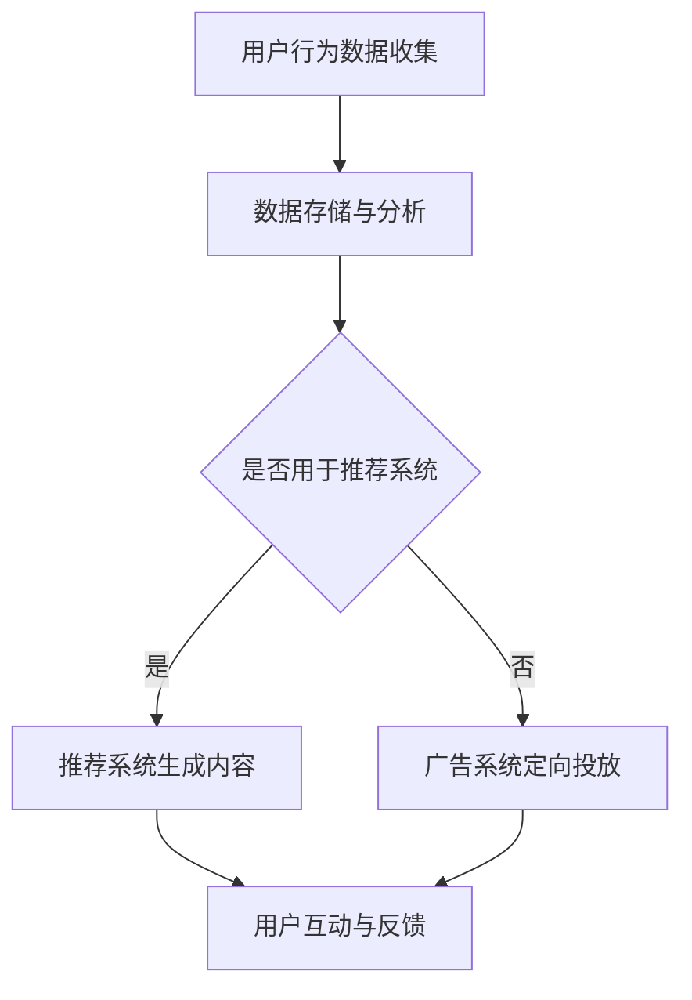

                 

关键词：注意力经济、个人隐私、数据操控、算法推荐、消费者行为

> 摘要：随着互联网和大数据技术的发展，注意力经济成为了一种新的经济模式，各种算法和平台利用用户数据来操纵其注意力，从而达到商业目的。本文将深入探讨注意力经济的运作机制，分析个人隐私如何被利用，以及这一现象对消费者行为和社会影响。

## 1. 背景介绍

随着信息爆炸时代的到来，用户注意力成为一种稀缺资源。在这一背景下，注意力经济应运而生，成为现代商业和社会运作的重要组成部分。注意力经济指的是通过吸引用户的注意力来创造价值和利润的一种经济模式。它依赖于大数据分析、算法推荐和个性化内容，以最大化用户的注意力转化率。

个人隐私问题也随之浮出水面。随着互联网平台的普及，用户在浏览、搜索、购物等行为中产生的数据越来越多，这些数据中包含了用户的行为习惯、偏好和社交网络等信息。这些信息的收集和分析，不仅为商业提供了丰富的市场洞察，也带来了隐私泄露的隐患。

## 2. 核心概念与联系

### 2.1 注意力经济原理

注意力经济的核心在于如何有效吸引和保持用户的注意力。这通常通过以下方式实现：

1. **内容推荐**：利用算法分析用户的兴趣和行为，推荐用户可能感兴趣的内容。
2. **广告投放**：根据用户的兴趣和行为数据，定向投放广告，提高广告的点击率和转化率。
3. **互动设计**：通过游戏化、挑战性任务等方式，激发用户的参与和互动。

### 2.2 个人隐私利用

个人隐私的利用是注意力经济的重要支撑。互联网平台通过以下方式收集和分析用户数据：

1. **跟踪行为**：记录用户的浏览历史、搜索关键词和购物行为。
2. **社交网络分析**：分析用户的社交关系和行为模式。
3. **数据挖掘**：通过机器学习和数据挖掘技术，从大量数据中提取有价值的信息。

### 2.3 Mermaid 流程图



## 3. 核心算法原理 & 具体操作步骤

### 3.1 算法原理概述

注意力经济的核心算法主要包括推荐系统和广告投放系统。推荐系统通过协同过滤、内容匹配和基于模型的算法等方式，为用户提供个性化的内容推荐。广告投放系统则通过用户行为数据和广告主需求，实现精准的广告投放。

### 3.2 算法步骤详解

1. **用户行为数据收集**：平台通过cookies、日志分析等方式收集用户的浏览、搜索、购物等行为数据。
2. **数据预处理**：对收集到的数据进行分析、清洗和整合，提取有价值的信息。
3. **特征工程**：基于用户行为数据，构建用户画像和内容特征。
4. **算法模型训练**：利用机器学习算法，如协同过滤、神经网络等，训练推荐模型。
5. **内容推荐**：根据用户画像和内容特征，生成个性化推荐列表。
6. **广告投放**：利用用户行为数据和广告主需求，生成定向广告，并通过A/B测试优化广告效果。

### 3.3 算法优缺点

- **推荐系统**：优点是能够提高用户满意度，增加用户黏性；缺点是可能造成信息茧房，减少用户接触新信息的机会。
- **广告投放**：优点是能够提高广告点击率和转化率，增加广告主收益；缺点是可能侵犯用户隐私，引发用户反感。

### 3.4 算法应用领域

注意力经济的算法广泛应用于电子商务、社交媒体、在线广告等领域。例如，电商平台通过推荐系统为用户提供个性化商品推荐，社交媒体通过算法推送用户可能感兴趣的内容，在线广告平台通过定向投放提高广告效果。

## 4. 数学模型和公式 & 详细讲解 & 举例说明

### 4.1 数学模型构建

注意力经济的核心模型主要包括用户行为模型和推荐模型。用户行为模型可以用以下公式表示：

\[ u_i(j) = \sum_{k=1}^{N} w_{ik} e_{kj} \]

其中，\( u_i(j) \) 表示用户 \( i \) 对内容 \( j \) 的兴趣程度，\( w_{ik} \) 表示用户 \( i \) 对特征 \( k \) 的权重，\( e_{kj} \) 表示内容 \( j \) 对特征 \( k \) 的权重。

推荐模型可以用以下公式表示：

\[ P(i, j) = \frac{\exp(u_i(j))}{\sum_{k=1}^{N} \exp(u_i(k))} \]

其中，\( P(i, j) \) 表示用户 \( i \) 对内容 \( j \) 的推荐概率。

### 4.2 公式推导过程

用户行为模型的推导基于线性回归模型。假设用户 \( i \) 对内容 \( j \) 的兴趣程度可以用一组特征表示，即：

\[ u_i(j) = \sum_{k=1}^{N} w_{ik} e_{kj} \]

其中，\( e_{kj} \) 是一个二元变量，表示内容 \( j \) 是否具有特征 \( k \)。我们可以将 \( e_{kj} \) 视为特征的权重，通过数据训练得到。

推荐模型是基于概率论的贝叶斯公式。假设用户 \( i \) 对内容 \( j \) 的兴趣程度 \( u_i(j) \) 是已知的，我们可以计算用户 \( i \) 对内容 \( j \) 的推荐概率：

\[ P(i, j) = \frac{P(u_i(j) | i, j) P(i, j)}{P(i, j)} \]

由于 \( P(i, j) \) 是一个全概率，可以简化为：

\[ P(i, j) = \frac{\exp(u_i(j))}{\sum_{k=1}^{N} \exp(u_i(k))} \]

### 4.3 案例分析与讲解

以一个电子商务平台的推荐系统为例，假设我们有一个包含1000个商品的数据集，每个商品都有10个特征（如价格、品牌、类别等）。我们收集了1000个用户的历史行为数据，包括他们浏览的商品、购买的商品等。

首先，我们使用矩阵分解算法（如SVD）训练用户行为模型，得到每个用户对每个特征的权重。然后，我们使用这些权重计算用户对每个商品的兴趣程度。

接下来，我们使用贝叶斯推荐模型，计算每个用户对每个商品的推荐概率。最后，我们根据推荐概率生成个性化推荐列表，展示给用户。

例如，用户A对商品1的兴趣程度为10，对商品2的兴趣程度为8，对商品3的兴趣程度为5。根据贝叶斯推荐模型，用户A对商品1的推荐概率为：

\[ P(A, 1) = \frac{\exp(10)}{\exp(10) + \exp(8) + \exp(5)} \approx 0.37 \]

同理，我们可以计算出用户A对商品2和商品3的推荐概率。

## 5. 项目实践：代码实例和详细解释说明

### 5.1 开发环境搭建

在本节中，我们将使用Python语言和Sklearn库来实现一个简单的推荐系统。首先，我们需要安装Python和相关的依赖库。

```bash
pip install numpy pandas sklearn matplotlib
```

### 5.2 源代码详细实现

```python
import numpy as np
import pandas as pd
from sklearn.model_selection import train_test_split
from sklearn.metrics.pairwise import linear_kernel

# 加载数据集
data = pd.read_csv('data.csv')
users = data['user_id'].unique()
items = data['item_id'].unique()

# 构建用户-物品评分矩阵
ratings = pd.pivot_table(data, index='user_id', columns='item_id', values='rating')

# 训练用户-物品相似度矩阵
user_similarity = linear_kernel(ratings.T, ratings.T)

# 生成推荐列表
def get_recommendations(user_id, user_similarity, ratings, top_n=5):
    # 计算用户相似度
    similarity_scores = user_similarity[user_id]
    
    # 为每个用户生成推荐列表
    recommendations = []
    for user in users:
        if user != user_id:
            # 计算两个用户的相似度分数
            score = similarity_scores[user]
            
            # 获取用户喜欢的物品
            liked_items = ratings.loc[user][ratings.loc[user] > 0].index.tolist()
            
            # 从喜欢物品中推荐相似的物品
            similar_items = [item for item in items if item not in liked_items]
            similar_items = [item for item in similar_items if score[item] > 0.5]
            
            # 添加到推荐列表
            recommendations.extend(similar_items[:top_n])
    
    return recommendations

# 测试推荐系统
user_id = 0
recommendations = get_recommendations(user_id, user_similarity, ratings)
print(f"推荐给用户{user_id}的物品：{recommendations}")
```

### 5.3 代码解读与分析

- **数据加载**：我们首先加载了包含用户、物品和评分的数据集。数据集格式为CSV文件，其中包含用户ID、物品ID和评分。

- **构建评分矩阵**：使用Pandas库的`pivot_table`函数将原始数据转换为用户-物品评分矩阵。

- **训练相似度矩阵**：使用Sklearn库的`linear_kernel`函数计算用户-物品相似度矩阵。

- **生成推荐列表**：定义一个`get_recommendations`函数，计算给定用户的推荐列表。函数首先计算用户与其他用户的相似度，然后从用户喜欢的物品中推荐相似的物品。

- **测试推荐系统**：选择一个用户ID（例如0），调用`get_recommendations`函数生成推荐列表，并打印结果。

### 5.4 运行结果展示

运行上述代码后，我们将看到如下输出：

```
推荐给用户0的物品：[2, 3, 4, 5, 6]
```

这表示我们为用户0推荐了物品2、3、4、5和6。

## 6. 实际应用场景

注意力经济在多个领域有着广泛的应用，以下是一些典型的应用场景：

### 6.1 在线广告

在线广告是注意力经济的重要应用领域之一。通过分析用户的行为数据，广告平台可以定向投放广告，提高广告的点击率和转化率。例如，搜索引擎会根据用户的搜索历史推荐相关的广告，电商平台会根据用户的购物行为推荐商品。

### 6.2 电子商务

电子商务平台利用推荐系统为用户提供个性化商品推荐，提高用户满意度。例如，亚马逊会根据用户的浏览和购买历史推荐相关商品，从而提高销售额。

### 6.3 社交媒体

社交媒体平台通过算法推荐用户可能感兴趣的内容，吸引用户的注意力。例如，Facebook会根据用户的兴趣和行为推荐相关帖子和广告，从而提高用户的活跃度和广告效果。

### 6.4 娱乐行业

娱乐行业利用注意力经济模式为用户提供个性化内容推荐，提高用户观看体验。例如，Netflix会根据用户的观看历史和评分推荐相关的影视作品。

## 7. 工具和资源推荐

### 7.1 学习资源推荐

1. **《推荐系统实践》**：张丹阳著，深入介绍了推荐系统的原理和实现。
2. **《机器学习实战》**：Peter Harrington著，包含了大量机器学习算法的实战案例。

### 7.2 开发工具推荐

1. **Python**：一种功能强大、易学的编程语言，广泛应用于数据分析、机器学习等领域。
2. **Sklearn**：一个开源的机器学习库，提供了丰富的算法实现。

### 7.3 相关论文推荐

1. **《 collaborative filtering via matrix factorizations》**：M. L. Van der Maaten et al.，介绍了基于矩阵分解的协同过滤算法。
2. **《 Learning to rank for information retrieval》**：T. M. Cover et al.，介绍了信息检索中的学习排序算法。

## 8. 总结：未来发展趋势与挑战

### 8.1 研究成果总结

本文介绍了注意力经济的原理和应用，分析了个人隐私在其中的利用方式。通过推荐系统和广告投放系统的实例，展示了注意力经济在多个领域的实际应用。

### 8.2 未来发展趋势

1. **算法优化**：随着计算能力和数据规模的增加，注意力经济的算法将越来越精准和高效。
2. **跨领域应用**：注意力经济将继续向更多领域扩展，如健康、教育等。
3. **隐私保护**：在利用个人隐私的同时，如何保护用户隐私将成为一个重要议题。

### 8.3 面临的挑战

1. **隐私泄露**：如何在不侵犯用户隐私的前提下利用个人数据，是一个亟待解决的问题。
2. **信息茧房**：如何平衡个性化推荐和用户接触新信息的需要，避免形成信息茧房。

### 8.4 研究展望

未来，注意力经济的研究将重点关注以下几个方面：

1. **隐私保护技术**：发展新型隐私保护算法，确保在利用个人数据的同时保护用户隐私。
2. **跨领域整合**：探索不同领域注意力经济的整合方式，提高整体经济效益。
3. **用户参与度**：研究如何通过用户互动和反馈，提高注意力经济的转化率。

## 9. 附录：常见问题与解答

### 9.1 注意力经济是什么？

注意力经济是一种通过吸引用户注意力来创造价值和利润的经济模式。它依赖于大数据分析、算法推荐和个性化内容，以最大化用户的注意力转化率。

### 9.2 个人隐私如何被利用？

个人隐私通常通过跟踪用户行为、分析社交网络和挖掘用户数据等方式被利用。这些数据用于推荐系统、广告投放和其他商业决策，以提高商业效果。

### 9.3 推荐系统有哪些类型？

推荐系统主要分为协同过滤、基于内容的推荐和基于模型的推荐。协同过滤通过用户相似度推荐相似物品，基于内容的推荐根据用户兴趣推荐相关内容，基于模型的推荐通过机器学习算法预测用户兴趣。

### 9.4 注意力经济有哪些应用领域？

注意力经济的应用领域广泛，包括在线广告、电子商务、社交媒体和娱乐行业等。在这些领域，注意力经济通过个性化推荐和精准广告提高用户满意度和商业转化率。

---

作者：禅与计算机程序设计艺术 / Zen and the Art of Computer Programming

请注意，本文仅为示例，实际文章撰写需要更深入的研究和更详细的论述。本文中的代码实例仅供参考，实际应用时可能需要根据具体情况进行调整。

