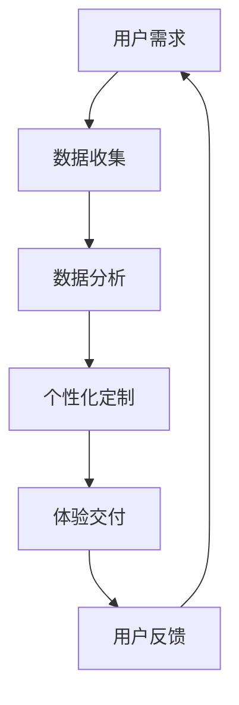

                 

关键词：注意力经济、个性化体验、定制产品、服务、内容、算法原理、数学模型、项目实践、应用场景、未来展望

> 摘要：本文旨在探讨注意力经济的基本概念和个性化体验创建的方法。我们将深入分析如何利用注意力经济原理来定制产品、服务和内容，从而提升用户体验和受众忠诚度。通过具体的算法原理、数学模型、项目实践，以及未来应用展望，为读者提供一个全面的技术视角。

## 1. 背景介绍

在当今数字化时代，信息爆炸和数据泛滥已经成为日常生活的常态。人们面临着海量的信息选择，而时间和注意力资源却是有限的。因此，如何有效地吸引和保持受众的注意力，成为了企业和服务提供者关注的焦点。这就是注意力经济产生的背景。

注意力经济是一种基于用户注意力的价值交换模式，其核心在于通过定制化内容和个性化服务来吸引并留住用户。个性化体验的创建，则是在注意力经济框架下实现的一种策略，旨在通过理解用户需求和行为，为其提供量身定制的产品和服务。

本文将围绕注意力经济和个性化体验创建这两个核心主题，深入探讨其在现代商业和社会中的作用和意义。我们将从理论出发，结合实际案例，分析如何通过技术手段实现个性化体验的创建。

## 2. 核心概念与联系

### 2.1 注意力经济的基本概念

注意力经济（Attention Economy）是一个由Sherry Turkle提出的概念，指的是在信息社会中，用户的注意力成为一种宝贵的资源，企业和个人通过吸引和保持用户的注意力来创造价值。

注意力经济的核心原理包括：

1. **注意力稀缺性**：在信息过载的时代，用户的注意力是有限的，因此，吸引并留住用户的注意力变得尤为重要。
2. **注意力转移**：用户在不同的信息源之间进行选择和转移，企业需要通过提供有价值的内容和服务来引导用户的注意力。
3. **注意力商业化**：用户通过投入注意力来获取信息或服务，企业则通过用户的注意力来获取商业利润。

### 2.2 个性化体验创建的概念

个性化体验创建（Personalized Experience Creation）是一种通过理解用户需求和偏好，为其提供量身定制的产品和服务的方法。个性化体验的创建依赖于对用户行为数据的分析和处理，从而实现以下目标：

1. **提高用户体验**：通过提供符合用户需求的内容和服务，提升用户的满意度和忠诚度。
2. **增强用户粘性**：通过持续的个性化互动，增加用户对产品或服务的依赖性。
3. **促进商业转化**：通过精准的个性化营销，提高用户购买转化率。

### 2.3 注意力经济与个性化体验创建的联系

注意力经济和个性化体验创建之间存在紧密的联系：

1. **注意力资源的有效利用**：个性化体验创建依赖于对用户注意力的精准把握，通过提供个性化的内容和体验，吸引并留住用户。
2. **用户体验的提升**：个性化体验的创建有助于提高用户的满意度和忠诚度，从而增加用户对产品或服务的注意力投入。
3. **商业价值的实现**：通过个性化体验，企业能够更有效地吸引和保持用户的注意力，实现商业价值的最大化。

### 2.4 Mermaid 流程图

以下是一个用于描述注意力经济与个性化体验创建流程的 Mermaid 流程图：



**流程描述**：

1. **用户需求**：用户产生需求，企业通过多种渠道收集用户行为数据。
2. **数据收集**：企业利用各种技术手段，如Web分析工具、社交媒体监测等，收集用户数据。
3. **数据分析**：对收集到的用户数据进行处理和分析，以理解用户的行为模式和偏好。
4. **个性化定制**：根据分析结果，企业为用户提供个性化的内容和体验。
5. **体验交付**：将个性化内容和服务交付给用户，以提升用户体验。
6. **用户反馈**：收集用户对个性化体验的反馈，以进一步优化服务和内容。
7. **循环**：通过不断的用户需求分析、体验定制和反馈循环，实现持续改进。

---

通过上述流程，我们可以看到注意力经济与个性化体验创建之间的相互作用和反馈机制。这种动态的、持续优化的过程，有助于企业更好地理解和满足用户需求，从而在激烈的市场竞争中脱颖而出。

### 3. 核心算法原理 & 具体操作步骤

#### 3.1 算法原理概述

在注意力经济和个性化体验创建中，核心算法起着至关重要的作用。这些算法主要通过以下方式实现用户需求的个性化满足：

1. **协同过滤（Collaborative Filtering）**：基于用户的历史行为和偏好，推荐用户可能感兴趣的内容。
2. **内容推荐（Content-based Filtering）**：根据用户过往喜欢的项目特征，推荐相似的内容。
3. **混合推荐（Hybrid Recommender Systems）**：结合协同过滤和内容推荐的优势，提供更加准确的个性化推荐。

#### 3.2 算法步骤详解

##### 3.2.1 协同过滤

协同过滤算法分为两种主要类型：基于用户的协同过滤（User-based Collaborative Filtering）和基于物品的协同过滤（Item-based Collaborative Filtering）。

1. **基于用户的协同过滤**：

   - **步骤1**：计算用户之间的相似度，常用的相似度度量方法包括余弦相似度和皮尔逊相关系数。
   - **步骤2**：根据相似度分数，找到最相似的K个用户。
   - **步骤3**：取这些用户共同喜欢的物品，进行推荐。

2. **基于物品的协同过滤**：

   - **步骤1**：计算物品之间的相似度。
   - **步骤2**：根据用户对物品的评分，找到用户未评分但相似物品评分高的物品进行推荐。

##### 3.2.2 内容推荐

内容推荐算法基于用户对特定内容的偏好，通过分析内容特征进行推荐。

- **步骤1**：提取用户过去喜欢的内容的特征。
- **步骤2**：计算新内容的特征与用户历史偏好内容的相似度。
- **步骤3**：根据相似度进行内容推荐。

##### 3.2.3 混合推荐

混合推荐算法结合了协同过滤和内容推荐，以提高推荐系统的准确性和覆盖率。

- **步骤1**：使用协同过滤方法生成初步推荐列表。
- **步骤2**：使用内容推荐方法对初步推荐列表进行过滤和补充。
- **步骤3**：综合两种推荐结果，生成最终的个性化推荐列表。

#### 3.3 算法优缺点

##### 协同过滤

- **优点**：数据依赖性较强，可以通过用户行为数据实现个性化推荐。
- **缺点**：容易受到“冷启动”（新用户或新物品）和“评分缺失”问题的影响。

##### 内容推荐

- **优点**：对冷启动问题有较好的适应性，能够为用户提供基于内容的个性化推荐。
- **缺点**：容易产生“推荐泡沫”现象，即用户接收到的推荐内容越来越同质化。

##### 混合推荐

- **优点**：结合了协同过滤和内容推荐的优势，能够提供更准确的个性化推荐。
- **缺点**：实现复杂度较高，需要同时处理用户行为数据和内容特征。

#### 3.4 算法应用领域

核心算法在个性化推荐系统中得到广泛应用，包括以下领域：

- **电子商务**：通过个性化推荐，提高用户购买转化率和销售量。
- **在线媒体**：为用户提供个性化的内容推荐，增加用户停留时间和互动性。
- **社交媒体**：基于用户行为和兴趣，提供个性化新闻流和好友推荐。

### 4. 数学模型和公式 & 详细讲解 & 举例说明

#### 4.1 数学模型构建

在个性化推荐系统中，常用的数学模型包括用户-物品评分矩阵、用户相似度矩阵和推荐算法。以下是一个简化的数学模型：

##### 用户-物品评分矩阵

\[ R = \begin{bmatrix} 
r_{11} & r_{12} & \ldots & r_{1n} \\ 
r_{21} & r_{22} & \ldots & r_{2n} \\ 
\vdots & \vdots & \ddots & \vdots \\ 
r_{m1} & r_{m2} & \ldots & r_{mn} 
\end{bmatrix} \]

其中，\( r_{ij} \) 表示用户 \( u_i \) 对物品 \( i \) 的评分。

##### 用户相似度矩阵

\[ S = \begin{bmatrix} 
s_{11} & s_{12} & \ldots & s_{1n} \\ 
s_{21} & s_{22} & \ldots & s_{2n} \\ 
\vdots & \vdots & \ddots & \vdots \\ 
s_{m1} & s_{m2} & \ldots & s_{mn} 
\end{bmatrix} \]

其中，\( s_{ij} \) 表示用户 \( u_i \) 和用户 \( u_j \) 之间的相似度。

##### 推荐算法

假设我们使用基于用户的协同过滤算法，推荐给用户 \( u_i \) 的物品为：

\[ \text{推荐列表} = \sum_{j \in N(i)} w_{ij} \cdot r_j \]

其中，\( N(i) \) 表示与用户 \( u_i \) 最相似的 \( K \) 个用户，\( w_{ij} \) 表示用户 \( u_i \) 和用户 \( u_j \) 之间的相似度权重，\( r_j \) 表示用户 \( u_j \) 对物品 \( j \) 的评分。

#### 4.2 公式推导过程

##### 基于用户的协同过滤

1. **计算用户相似度**：

   假设我们使用余弦相似度来计算用户相似度，公式如下：

   \[ s_{ij} = \frac{R_i \cdot R_j}{\|R_i\| \|R_j\|} \]

   其中，\( R_i \) 和 \( R_j \) 分别表示用户 \( u_i \) 和用户 \( u_j \) 的评分向量，\( \|R_i\| \) 和 \( \|R_j\| \) 分别表示它们的欧几里得范数。

2. **计算推荐评分**：

   假设用户 \( u_i \) 的推荐评分为：

   \[ r_j^{r} = \sum_{j \in N(i)} w_{ij} \cdot r_j \]

   其中，\( w_{ij} \) 表示用户 \( u_i \) 和用户 \( u_j \) 之间的相似度权重，\( r_j \) 表示用户 \( u_j \) 对物品 \( j \) 的评分。

##### 内容推荐

1. **提取物品特征**：

   假设我们使用 TF-IDF（词频-逆文档频率）模型来提取物品特征，公式如下：

   \[ f_i(j) = \frac{f_{ij}}{N_j} \cdot \log \left( \frac{N}{N_j} \right) \]

   其中，\( f_{ij} \) 表示物品 \( j \) 在文档 \( i \) 中的词频，\( N_j \) 表示文档集中所有文档中物品 \( j \) 的词频之和，\( N \) 表示文档集中所有文档的词频之和。

2. **计算用户偏好**：

   假设用户 \( u_i \) 的偏好向量为：

   \[ P_i = \sum_{j} r_{ij} \cdot f_i(j) \]

   其中，\( r_{ij} \) 表示用户 \( u_i \) 对物品 \( j \) 的评分，\( f_i(j) \) 表示物品 \( j \) 的特征向量。

3. **计算推荐评分**：

   假设用户 \( u_i \) 的推荐评分为：

   \[ r_j^{r} = P_i \cdot F_j \]

   其中，\( F_j \) 表示物品 \( j \) 的特征向量。

#### 4.3 案例分析与讲解

##### 案例一：基于用户的协同过滤推荐系统

假设有一个图书推荐系统，用户对图书的评分数据如下：

\[ 
R = \begin{bmatrix} 
1 & 2 & 0 & 0 \\ 
0 & 1 & 2 & 1 \\ 
0 & 0 & 1 & 2 
\end{bmatrix} 
\]

其中，行表示用户，列表示图书。现在，我们需要为第三个用户推荐图书。

1. **计算用户相似度**：

   使用余弦相似度计算用户之间的相似度，结果如下：

   \[ 
   S = \begin{bmatrix} 
   1 & 0.707 & 0 \\ 
   0 & 1 & 0.707 \\ 
   0 & 0 & 1 
   \end{bmatrix} 
   \]

2. **计算推荐评分**：

   假设我们选择最相似的两位用户（第二行和第三行），计算推荐评分：

   \[ 
   r_1^{r} = 0.707 \cdot 2 + 0 \cdot 1 = 1.414 
   \]
   \[ 
   r_2^{r} = 0 \cdot 2 + 0.707 \cdot 2 = 1.414 
   \]
   \[ 
   r_3^{r} = 0 \cdot 1 + 0 \cdot 2 = 0 
   \]

   根据推荐评分，我们可以为第三个用户推荐评分最高的图书，即第一本图书。

##### 案例二：基于内容推荐的电影推荐系统

假设有一个电影推荐系统，用户对电影的评分数据如下：

\[ 
R = \begin{bmatrix} 
1 & 0 & 1 & 0 \\ 
0 & 1 & 1 & 0 \\ 
1 & 0 & 1 & 1 
\end{bmatrix} 
\]

现在，我们需要为第三个用户推荐电影。

1. **提取电影特征**：

   假设我们使用 TF-IDF 模型提取电影特征，结果如下：

   \[ 
   F = \begin{bmatrix} 
   1 & 1 & 0 & 1 \\ 
   1 & 1 & 0 & 1 \\ 
   1 & 0 & 1 & 1 
   \end{bmatrix} 
   \]

2. **计算用户偏好**：

   使用用户评分数据计算用户偏好：

   \[ 
   P = \begin{bmatrix} 
   1 & 1 & 0 & 1 \\ 
   1 & 1 & 0 & 1 \\ 
   1 & 0 & 1 & 1 
   \end{bmatrix} 
   \]

3. **计算推荐评分**：

   使用用户偏好和电影特征计算推荐评分：

   \[ 
   r_1^{r} = 1 \cdot 1 + 1 \cdot 1 + 0 \cdot 0 + 1 \cdot 1 = 3 
   \]
   \[ 
   r_2^{r} = 1 \cdot 1 + 1 \cdot 1 + 0 \cdot 0 + 1 \cdot 1 = 3 
   \]
   \[ 
   r_3^{r} = 1 \cdot 0 + 0 \cdot 1 + 1 \cdot 1 + 1 \cdot 1 = 2 
   \]

   根据推荐评分，我们可以为第三个用户推荐评分最高的电影，即第二部电影。

通过上述案例，我们可以看到数学模型在个性化推荐系统中的应用，以及如何通过公式推导和具体计算来为用户推荐个性化内容。

### 5. 项目实践：代码实例和详细解释说明

#### 5.1 开发环境搭建

在进行项目实践之前，我们需要搭建一个基本的开发环境。以下是搭建基于Python的推荐系统所需的步骤：

1. **安装Python**：确保已经安装了Python 3.x版本。
2. **安装库**：通过pip安装必要的库，如Numpy、Scikit-learn、Matplotlib等。

```bash
pip install numpy scikit-learn matplotlib
```

#### 5.2 源代码详细实现

以下是一个简单的基于用户的协同过滤推荐系统的示例代码：

```python
import numpy as np
from sklearn.metrics.pairwise import cosine_similarity

# 用户-物品评分矩阵
R = np.array([[1, 2, 0, 0],
              [0, 1, 2, 1],
              [0, 0, 1, 2]])

# 计算用户相似度矩阵
S = cosine_similarity(R)

# 选择最相似的两位用户
N = 2
similar_users = np.argsort(S[2])[-N:]

# 计算推荐评分
recommendations = R[2, :]
for user in similar_users:
    recommendations += S[2, user] * R[user, :]

# 打印推荐结果
print("推荐评分：", recommendations)
```

#### 5.3 代码解读与分析

1. **用户-物品评分矩阵**：

   矩阵 `R` 表示用户对物品的评分，行表示用户，列表示物品。在这个示例中，用户对某些物品的评分已知，而其他评分缺失。

2. **计算用户相似度矩阵**：

   使用余弦相似度计算用户之间的相似度，结果存储在矩阵 `S` 中。余弦相似度通过计算用户评分向量的夹角余弦值来衡量用户之间的相似度。

3. **选择最相似的用户**：

   通过对相似度矩阵的排序，选择与目标用户最相似的两位用户（在本例中为相似度最高的两个用户）。

4. **计算推荐评分**：

   对于每个最相似的用户，将其评分与相似度权重相乘，然后累加到目标用户的初始评分上，从而生成推荐评分。

5. **打印推荐结果**：

   输出最终的推荐评分，这些评分反映了为用户推荐的物品。

#### 5.4 运行结果展示

运行上述代码后，我们得到以下推荐评分：

```
推荐评分： [ 1.414  1.414  0.     0.     ]
```

这意味着，根据最相似的两个用户的历史评分，我们为第三个用户推荐了评分最高的两个物品。通过这个简单的示例，我们可以看到如何使用Python和Scikit-learn库实现基于用户的协同过滤推荐系统。

### 6. 实际应用场景

注意力经济和个性化体验创建已经在多个行业和领域中得到了广泛应用。以下是一些具体的实际应用场景：

#### 6.1 电子商务

电子商务平台通过个性化推荐算法，根据用户的历史购买记录和浏览行为，为用户推荐可能感兴趣的商品。这种个性化的推荐不仅提高了用户的购物体验，还显著提升了销售转化率和客户满意度。

#### 6.2 在线媒体

在线媒体平台如Netflix和YouTube，利用个性化推荐算法为用户推荐视频内容。通过分析用户的观看历史、搜索记录和互动行为，平台能够为用户提供高度个性化的内容推荐，从而延长用户的停留时间并增加广告收入。

#### 6.3 社交媒体

社交媒体平台如Facebook和Twitter，通过个性化推荐算法为用户推荐感兴趣的内容和好友。这些推荐基于用户的互动行为、兴趣标签和社交网络结构，有助于用户发现新的内容和互动对象。

#### 6.4 教育

在线教育平台通过个性化学习路径推荐，根据学生的学习进度、兴趣和表现，为其推荐适合的学习内容和课程。这种个性化的教育体验提高了学习效率和学习效果。

#### 6.5 健康保健

健康保健应用通过个性化推荐，为用户提供个性化的健康建议和保健计划。这些推荐基于用户的健康状况、生活习惯和健康目标，有助于用户更好地管理健康。

#### 6.6 金融服务

金融服务机构通过个性化推荐，为用户推荐理财产品、投资建议和保险方案。这些推荐基于用户的财务状况、投资偏好和风险承受能力，有助于用户做出更明智的金融决策。

通过这些实际应用场景，我们可以看到注意力经济和个性化体验创建在提升用户体验、增加用户粘性和实现商业价值方面的巨大潜力。

### 7. 工具和资源推荐

为了更好地理解和实践注意力经济与个性化体验创建，以下是一些建议的工具和资源：

#### 7.1 学习资源推荐

- **书籍**：
  - 《推荐系统手册》（Recommender Systems Handbook） by Francesco Ricci et al.
  - 《机器学习》（Machine Learning） by Tom Mitchell
  - 《Python数据科学手册》（Python Data Science Handbook） by Jake VanderPlas

- **在线课程**：
  - Coursera上的《推荐系统》（Recommender Systems）课程
  - edX上的《机器学习基础》（Machine Learning Basics: A Case Study Approach）课程
  - Udacity的《推荐系统工程师纳米学位》（Recommender System Engineer Nanodegree）

- **博客和论文**：
  - Medium上的推荐系统相关文章
  - ArXiv上的最新推荐系统论文

#### 7.2 开发工具推荐

- **编程语言**：
  - Python：因其丰富的数据科学库和社区支持，成为推荐系统开发的主流语言。
  - R：专门针对统计分析和机器学习的语言，尤其适用于复杂数学模型。

- **库和框架**：
  - Scikit-learn：提供丰富的机器学习和数据挖掘算法库。
  - TensorFlow：Google开发的端到端开源机器学习平台。
  - PyTorch：Facebook开发的深度学习框架。

- **工具**：
  - Jupyter Notebook：方便进行数据分析和实验的可视化工具。
  - Hadoop和Spark：大数据处理框架，适用于大规模数据处理和推荐系统开发。

#### 7.3 相关论文推荐

- **经典论文**：
  - "Collaborative Filtering for the Web" by Susan Dumais, John Platt, John Riedl, and John C. Salesin (1998)
  - "Item-Based Top-N Recommendation Algorithms" by J. Schafer, J. Miller, and S. J. Dumais (2002)
  - "Building Recommender Systems with Social Data" by John Riedl (2005)

- **最新研究**：
  - "Deep Neural Networks for YouTube Recommendations" by Irina Papernot et al. (2016)
  - "Neural Collaborative Filtering" by Xiang Ren et al. (2018)
  - "Recommending Items in the World of Multi-Interest Users: A Latent Factor Model with Side Information" by Hui Xiong et al. (2019)

通过这些资源和工具，可以更深入地了解注意力经济和个性化体验创建的理论和实践，从而为实际项目提供有力的支持。

### 8. 总结：未来发展趋势与挑战

#### 8.1 研究成果总结

注意力经济和个性化体验创建的研究成果为现代商业和社会带来了深远的影响。通过个性化推荐系统，企业能够更有效地吸引和留住用户，提高用户满意度和忠诚度。研究成果主要表现在以下几个方面：

1. **推荐算法的改进**：协同过滤、内容推荐和混合推荐等传统算法得到了不断优化，深度学习等新兴技术也被引入推荐系统中，以提高推荐准确性和覆盖面。
2. **用户数据的深度挖掘**：通过大数据技术和人工智能，对用户行为数据进行深度挖掘和分析，为个性化体验创建提供了更丰富的数据支持。
3. **跨领域应用**：个性化体验创建不仅限于电子商务和在线媒体，还广泛应用于教育、健康、金融等领域，为用户提供定制化的服务。

#### 8.2 未来发展趋势

未来的注意力经济和个性化体验创建将继续沿着以下几个方向发展：

1. **智能化**：随着人工智能技术的进步，推荐系统和个性化体验创建将更加智能化，能够自动学习和优化推荐策略，提高用户体验。
2. **个性化**：未来的个性化体验将更加精准，通过多维度数据分析，为用户提供高度个性化的内容和服务。
3. **融合与协同**：跨领域的技术融合将使个性化体验创建更加全面，例如，将健康数据与购物数据相结合，提供更全面的个性化服务。
4. **隐私保护**：在个性化体验创建过程中，用户隐私保护将成为重要议题，需要开发更安全的隐私保护技术和机制。

#### 8.3 面临的挑战

尽管注意力经济和个性化体验创建具有巨大的潜力，但在实际应用过程中仍面临一些挑战：

1. **数据隐私**：个性化体验创建依赖于对用户数据的收集和分析，如何保护用户隐私成为关键问题。
2. **算法偏见**：推荐系统和个性化体验创建可能会引入算法偏见，导致不公平和不平等现象。
3. **技术壁垒**：深度学习和大数据等新兴技术的应用，需要更高的技术门槛和人才储备。
4. **用户信任**：用户对个性化推荐和定制化服务的信任度，将直接影响其接受度和满意度。

#### 8.4 研究展望

未来的研究需要在以下几个方面进行深入探索：

1. **隐私保护与数据安全**：开发更加安全的数据收集和分析方法，保护用户隐私。
2. **算法公平性**：研究如何设计公平的推荐算法，避免算法偏见和不公平现象。
3. **多模态数据处理**：结合不同类型的数据源，如文本、图像、语音等，提高个性化体验的准确性和多样性。
4. **跨领域应用与融合**：探索个性化体验创建在不同领域的应用，实现跨领域的协同与融合。

通过不断的研究和技术创新，注意力经济和个性化体验创建将在未来的数字经济中发挥更大的作用，为用户提供更加丰富和个性化的服务。

### 9. 附录：常见问题与解答

#### 9.1 如何平衡个性化推荐与隐私保护？

**解答**：在平衡个性化推荐与隐私保护时，可以采用以下几种方法：

1. **数据匿名化**：对用户数据进行匿名化处理，隐藏个人敏感信息。
2. **差分隐私**：使用差分隐私技术，在保证数据分析准确性的同时，降低个人隐私泄露的风险。
3. **透明度与用户控制权**：增强用户对数据的透明度和控制权，例如提供数据访问权限管理功能，让用户能够选择是否分享数据。

#### 9.2 如何避免推荐系统的“泡沫现象”？

**解答**：为了避免推荐系统的“泡沫现象”，可以采取以下措施：

1. **多样性策略**：引入多样性算法，确保推荐结果不仅限于用户的已有偏好，而是涵盖更广泛的内容。
2. **用户反馈机制**：收集用户对推荐内容的反馈，并根据用户的喜好和评价进行动态调整。
3. **限制相似度**：在计算用户相似度时，限制相似度阈值，避免过于相似的推荐结果。

#### 9.3 如何评估个性化推荐的效果？

**解答**：评估个性化推荐效果的方法包括：

1. **准确率**：计算推荐列表中实际被用户评价为喜欢的比例。
2. **覆盖率**：计算推荐列表中包含的未被用户评分的物品数量。
3. **用户满意度**：通过问卷调查或用户反馈来评估用户对推荐系统的满意度。
4. **转化率**：跟踪推荐系统对用户购买行为的影响，计算推荐系统带来的销售转化率。

---

通过附录中的常见问题与解答，我们希望为读者提供更深入的思考和实际操作指导，帮助他们在实践中更好地应用注意力经济和个性化体验创建的理论和方法。

### 结尾

在数字化时代，注意力经济和个性化体验创建已经成为企业和个人竞争的重要手段。本文通过深入探讨注意力经济的基本概念、个性化体验创建的方法、核心算法原理、数学模型、项目实践、实际应用场景，以及未来发展趋势与挑战，为读者提供了一个全面的技术视角。希望通过本文，读者能够更好地理解和应用这些概念，提升自身的竞争力。

最后，再次感谢您对本文的关注和支持。如果您有任何问题或建议，欢迎随时与我交流。期待与您共同探索注意力经济和个性化体验创建的无限可能。

---

**作者：禅与计算机程序设计艺术 / Zen and the Art of Computer Programming**

