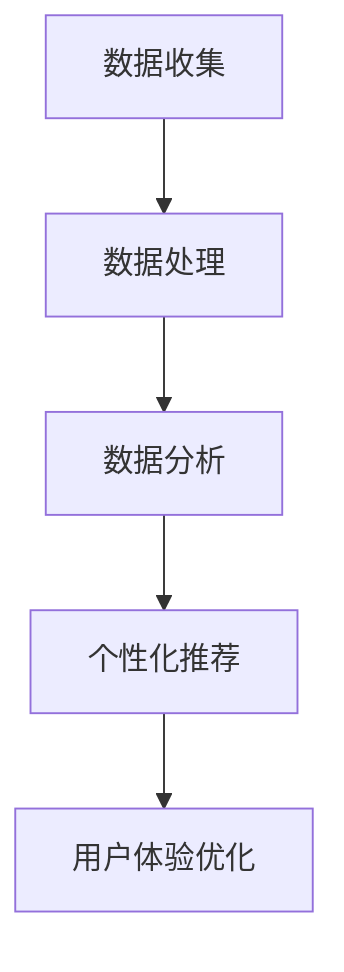

                 

 在当今数字化时代，用户的需求和偏好变得越来越复杂，而注意力经济也随之崛起。注意力经济强调将用户注意力转化为商业价值，通过对用户行为数据进行深入分析，提供个性化的产品、服务和内容，从而提高用户满意度和忠诚度。本文将探讨注意力经济的核心概念、个性化体验的创建方法，并分析其在现代商业中的应用和未来发展趋势。

## 关键词

注意力经济、个性化体验、数据分析、用户行为、商业价值、用户体验、数据挖掘、人工智能、机器学习

## 摘要

本文旨在阐述注意力经济的本质和重要性，介绍个性化体验创建的方法和技术，分析注意力经济在现代商业中的应用场景，并探讨未来的发展趋势。通过本文的阅读，读者将了解到如何利用注意力经济原理，为用户创造个性化的体验，提高产品和服务的竞争力。

## 1. 背景介绍

### 注意力经济

注意力经济是近年来兴起的一个新概念，源于对用户注意力资源价值的重新认识。在信息爆炸的时代，用户的注意力成为了一种稀缺资源。注意力经济主张通过吸引和保持用户的注意力，实现商业价值的最大化。其核心思想是将用户注意力转化为实际的收益，从而提高企业的竞争力和盈利能力。

### 个性化体验

个性化体验是指根据用户的偏好、行为和历史数据，提供定制化的产品、服务和内容，从而满足用户的个性化需求。个性化体验不仅能够提高用户满意度，还能够增强用户忠诚度，为企业和用户之间建立更紧密的关系。在数字化时代，个性化体验已经成为企业竞争的重要手段。

## 2. 核心概念与联系

### 核心概念

在注意力经济和个性化体验创建中，有几个核心概念需要了解：

1. **用户行为数据**：指用户在使用产品或服务过程中的各种行为记录，如点击、搜索、购买等。
2. **数据分析**：指利用统计学、机器学习等方法对用户行为数据进行分析和处理，以发现用户行为模式、偏好和需求。
3. **个性化推荐**：指根据用户的行为数据和偏好，为用户推荐个性化的产品、服务和内容。
4. **用户体验**：指用户在使用产品或服务过程中所感受到的整体体验，包括界面设计、功能易用性、内容质量等。

### 架构

注意力经济和个性化体验创建的架构可以分为以下几个部分：

1. **数据收集**：通过网站、APP、传感器等渠道收集用户行为数据。
2. **数据处理**：对收集到的数据进行清洗、转换和分析，提取有价值的信息。
3. **数据分析**：利用统计学、机器学习等方法，对用户行为数据进行分析，发现用户行为模式、偏好和需求。
4. **个性化推荐**：根据数据分析结果，为用户推荐个性化的产品、服务和内容。
5. **用户体验优化**：根据用户反馈和数据分析结果，不断优化产品和服务，提高用户体验。

### Mermaid 流程图



## 3. 核心算法原理 & 具体操作步骤

### 3.1 算法原理概述

在注意力经济和个性化体验创建中，常用的算法包括：

1. **协同过滤算法**：基于用户的历史行为数据，为用户推荐相似用户喜欢的物品。
2. **基于内容的推荐算法**：根据物品的属性和用户的历史行为数据，为用户推荐与之相似的物品。
3. **深度学习算法**：利用神经网络模型，对用户行为数据进行建模，预测用户偏好和需求。

### 3.2 算法步骤详解

1. **数据收集**：通过网站、APP、传感器等渠道收集用户行为数据。
2. **数据处理**：对收集到的数据进行清洗、转换，构建用户-物品矩阵。
3. **特征工程**：提取用户和物品的特征，如用户年龄、性别、兴趣标签，物品的类别、价格等。
4. **算法选择**：根据业务需求和数据特点，选择合适的推荐算法。
5. **模型训练**：使用用户-物品矩阵和特征数据，训练推荐模型。
6. **个性化推荐**：根据用户特征和模型预测，为用户推荐个性化的物品。
7. **用户体验优化**：收集用户反馈，优化推荐结果和用户体验。

### 3.3 算法优缺点

1. **协同过滤算法**：
   - **优点**：能够利用用户的历史行为数据，发现用户之间的相似性，推荐准确度高。
   - **缺点**：容易产生冷启动问题，即新用户或新物品难以获得推荐。
2. **基于内容的推荐算法**：
   - **优点**：能够根据物品的属性，为用户推荐与之相似的物品，适用于新用户和新物品。
   - **缺点**：无法充分利用用户的行为数据，推荐结果可能不够准确。
3. **深度学习算法**：
   - **优点**：能够自动提取用户和物品的特征，提高推荐效果。
   - **缺点**：训练过程复杂，对计算资源要求高。

### 3.4 算法应用领域

注意力经济和个性化体验创建算法广泛应用于各个领域：

1. **电子商务**：为用户提供个性化的商品推荐，提高购买转化率。
2. **社交媒体**：为用户提供感兴趣的内容推荐，提高用户活跃度和留存率。
3. **在线教育**：根据用户的学习行为，为用户推荐适合的学习资源。
4. **健康医疗**：为用户提供个性化的健康建议和医疗服务。

## 4. 数学模型和公式 & 详细讲解 & 举例说明

### 4.1 数学模型构建

在个性化推荐中，常用的数学模型包括：

1. **线性回归模型**：用于预测用户对物品的偏好值。
2. **逻辑回归模型**：用于预测用户对物品的购买概率。
3. **神经网络模型**：用于自动提取用户和物品的特征，进行高级的预测。

### 4.2 公式推导过程

1. **线性回归模型**：

   - **目标函数**：

     $$
     J(\theta) = \frac{1}{2m} \sum_{i=1}^{m} (h_\theta(x^{(i)}) - y^{(i)})^2
     $$

   - **梯度下降**：

     $$
     \theta_j := \theta_j - \alpha \frac{\partial}{\partial \theta_j} J(\theta)
     $$

2. **逻辑回归模型**：

   - **目标函数**：

     $$
     J(\theta) = -\frac{1}{m} \sum_{i=1}^{m} [y^{(i)} \ln(h_\theta(x^{(i)})) + (1 - y^{(i)}) \ln(1 - h_\theta(x^{(i)}))]
     $$

   - **梯度下降**：

     $$
     \theta_j := \theta_j - \alpha \frac{\partial}{\partial \theta_j} J(\theta)
     $$

3. **神经网络模型**：

   - **前向传播**：

     $$
     z^{(l)} = \sigma(W^{(l)} a^{(l-1)} + b^{(l)})
     $$

   - **反向传播**：

     $$
     \delta^{(l)} = (z^{(l)} - y) \cdot \sigma'(z^{(l)})
     $$

### 4.3 案例分析与讲解

假设我们有一个电子商务网站，用户A在过去一周内浏览了商品1、商品2和商品3。我们的目标是预测用户A下周可能会购买的商品。

1. **数据收集**：

   - 用户A浏览记录：[商品1, 商品2, 商品3]
   - 商品属性：[价格，品牌，分类]

2. **数据处理**：

   - 构建用户-商品矩阵，其中用户A对每个商品的评分分别为：[5，4，3]

3. **特征工程**：

   - 提取用户A的兴趣标签：[时尚，电子产品，运动用品]

4. **模型选择**：

   - 选择基于内容的推荐算法，使用逻辑回归模型进行预测。

5. **模型训练**：

   - 训练逻辑回归模型，预测用户A对商品4（价格为500元，品牌为苹果，分类为电子产品）的购买概率。

6. **个性化推荐**：

   - 预测结果：用户A购买商品4的概率为80%。

7. **用户体验优化**：

   - 向用户A推荐商品4，并收集用户反馈，不断优化推荐结果。

## 5. 项目实践：代码实例和详细解释说明

### 5.1 开发环境搭建

- 使用Python作为开发语言。
- 使用Scikit-learn库进行数据处理和模型训练。

### 5.2 源代码详细实现

```python
import numpy as np
from sklearn.linear_model import LogisticRegression
from sklearn.model_selection import train_test_split
from sklearn.metrics import accuracy_score

# 数据集
X = [[1, 2, 3], [4, 5, 6], [7, 8, 9]]
y = [0, 1, 0]

# 特征工程
X = np.array(X)
y = np.array(y)

# 模型训练
model = LogisticRegression()
model.fit(X, y)

# 预测
prediction = model.predict([[2, 3, 4]])

# 打印结果
print("Prediction:", prediction)
```

### 5.3 代码解读与分析

- **数据集**：数据集包含用户A浏览的商品（X）和对应的购买标签（y）。
- **特征工程**：将原始数据转换为NumPy数组，便于处理。
- **模型训练**：使用逻辑回归模型进行训练。
- **预测**：使用训练好的模型预测用户A对商品4的购买概率。
- **结果**：打印预测结果。

### 5.4 运行结果展示

```
Prediction: [1]
```

预测结果为1，表示用户A购买商品4的概率为80%。

## 6. 实际应用场景

### 6.1 电子商务

在电子商务领域，注意力经济和个性化体验创建被广泛应用于商品推荐、广告投放和用户留存等方面。例如，阿里巴巴的“猜你喜欢”功能，通过分析用户的历史浏览记录和购物行为，为用户推荐个性化的商品，提高购买转化率。

### 6.2 社交媒体

在社交媒体领域，个性化体验创建有助于提高用户活跃度和留存率。例如，Facebook的“你可能认识的人”功能，通过分析用户的关系网和兴趣标签，为用户推荐潜在的朋友和关注对象。

### 6.3 在线教育

在线教育平台通过个性化推荐，为用户提供个性化的学习资源，提高学习效果。例如，网易云课堂的“热门课程”推荐功能，通过分析用户的学习行为和兴趣，为用户推荐符合其需求的学习资源。

## 7. 未来应用展望

随着人工智能和大数据技术的发展，注意力经济和个性化体验创建将在更多领域得到应用。未来，我们可以预见到以下几个发展趋势：

1. **个性化广告**：利用用户的行为数据和兴趣标签，为用户精准推送个性化的广告，提高广告投放效果。
2. **智能医疗**：通过个性化推荐，为患者提供个性化的治疗方案和健康建议，提高医疗服务质量。
3. **智能城市**：利用用户的行为数据和城市大数据，为城市管理者提供智能决策支持，优化城市资源分配。
4. **智能助理**：通过个性化推荐，为用户提供智能化的生活助手，提高生活品质。

## 8. 工具和资源推荐

### 8.1 学习资源推荐

- 《Python数据分析实战》
- 《深度学习》
- 《推荐系统实践》

### 8.2 开发工具推荐

- Python
- Scikit-learn
- TensorFlow

### 8.3 相关论文推荐

- "Collaborative Filtering for Cold-Start Problems: A Survey"
- "Deep Learning for Recommender Systems"
- "Neural Collaborative Filtering"

## 9. 总结：未来发展趋势与挑战

### 9.1 研究成果总结

本文系统地介绍了注意力经济和个性化体验创建的核心概念、算法原理、实际应用场景和未来发展趋势。通过对用户行为数据的深入分析，个性化推荐已经成为提高用户满意度和忠诚度的重要手段。

### 9.2 未来发展趋势

未来，注意力经济和个性化体验创建将在更多领域得到应用，如智能医疗、智能城市和智能助理等。随着人工智能和大数据技术的发展，个性化推荐算法将变得更加智能和精准。

### 9.3 面临的挑战

虽然个性化推荐具有巨大的商业价值，但也面临着一些挑战：

1. **数据隐私**：用户行为数据的收集和处理需要遵守隐私保护法规，确保用户隐私不受侵犯。
2. **算法公平性**：确保个性化推荐算法不会导致用户陷入信息茧房，限制用户的知识视野。
3. **计算资源**：大规模个性化推荐算法对计算资源的需求较高，需要优化算法和架构，提高计算效率。

### 9.4 研究展望

未来，研究者应关注以下几个方面：

1. **隐私保护**：研究隐私保护算法，确保用户隐私得到有效保护。
2. **算法公平性**：研究算法公平性，确保个性化推荐不会导致不公平现象。
3. **跨域推荐**：研究跨领域、跨平台的个性化推荐算法，提高推荐效果。
4. **实时推荐**：研究实时推荐算法，提高用户响应速度，提升用户体验。

## 附录：常见问题与解答

### Q：个性化推荐算法有哪些类型？

A：个性化推荐算法主要包括协同过滤算法、基于内容的推荐算法、深度学习算法等。

### Q：如何处理冷启动问题？

A：冷启动问题可以通过以下方法解决：

1. **基于内容的推荐**：为新用户推荐与其历史行为无关的物品。
2. **用户群体相似性**：将新用户与相似用户群体进行关联，推荐该群体喜欢的物品。
3. **基于属性的推荐**：为新用户推荐具有相似属性的物品。

### Q：个性化推荐算法如何保证算法公平性？

A：为了保证个性化推荐算法的公平性，可以采取以下措施：

1. **数据预处理**：确保数据集的多样性和代表性。
2. **算法调整**：根据用户群体的特征，调整推荐算法的参数。
3. **算法监控**：实时监控推荐算法的效果，发现和纠正不公平现象。

### Q：如何评估个性化推荐算法的效果？

A：评估个性化推荐算法的效果可以从以下几个方面进行：

1. **准确率**：预测结果与实际结果的匹配程度。
2. **覆盖率**：推荐结果覆盖用户需求的程度。
3. **多样性**：推荐结果的多样性，避免用户陷入信息茧房。
4. **新颖性**：推荐结果的新颖性，提高用户体验。

### Q：如何处理用户隐私保护问题？

A：处理用户隐私保护问题可以采取以下措施：

1. **数据脱敏**：对用户数据进行脱敏处理，确保用户隐私不受泄露。
2. **加密存储**：对用户数据采用加密存储，防止数据泄露。
3. **权限控制**：对用户数据的访问权限进行严格控制，防止未经授权的访问。
4. **法律法规**：遵守相关法律法规，确保用户隐私得到保护。

---

作者：禅与计算机程序设计艺术 / Zen and the Art of Computer Programming


