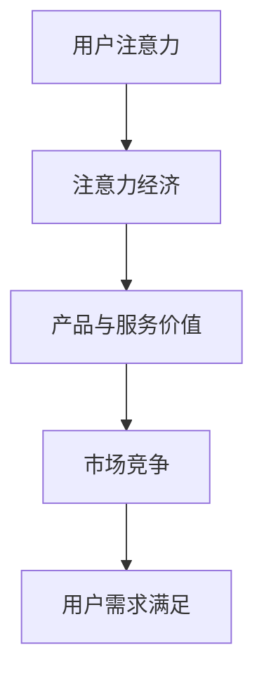
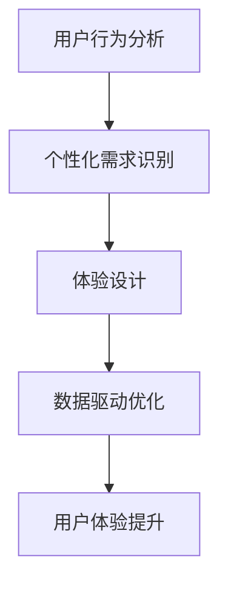
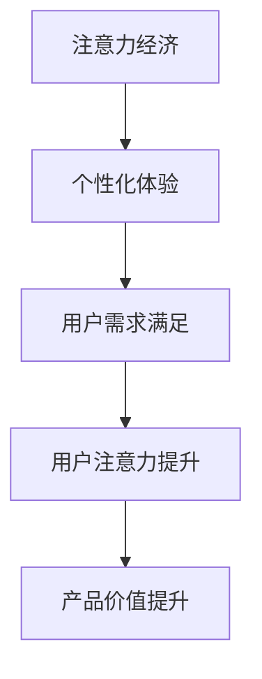

                 

关键词：注意力经济、个性化体验、定制产品、用户需求、服务优化、人工智能、数据分析、用户体验设计

> 摘要：本文从注意力经济的视角出发，探讨了如何通过个性化体验为受众定制产品和服务。文章首先介绍了注意力经济的核心概念，然后分析了个性化体验的设计原则和方法，并结合实际案例进行了深入剖析。通过本文的阅读，读者将了解如何利用注意力经济和个性化体验提升产品竞争力，为用户提供更优质的服务。

## 1. 背景介绍

在信息爆炸的时代，人们的注意力资源变得尤为珍贵。随着互联网的普及和智能手机的广泛使用，用户在获取信息时面临着越来越多的选择。注意力经济应运而生，成为市场营销和产品设计的重要领域。注意力经济强调通过吸引和保持用户注意力来创造价值，其核心在于如何为用户量身定制产品和服务，从而满足他们的需求。

个性化体验作为注意力经济的重要表现形式，旨在通过针对用户的个性化需求提供独特的价值。个性化体验的设计不仅需要深入理解用户的行为和偏好，还需要运用先进的技术手段进行数据分析和算法优化。本文将探讨注意力经济与个性化体验之间的关系，并阐述如何为受众定制产品和服务。

## 2. 核心概念与联系

### 2.1 注意力经济

注意力经济是一种基于用户注意力的经济模式，它认为用户的注意力是一种有限的、宝贵的资源。在注意力经济中，产品和服务的价值不仅取决于它们本身的质量，还取决于它们如何吸引和保持用户的注意力。

**Mermaid 流程图：**



### 2.2 个性化体验

个性化体验是一种针对用户个性化需求的体验设计，它旨在为用户提供独特的、定制化的服务。个性化体验的设计需要基于对用户行为和偏好的深入分析，并通过数据驱动的方法实现。

**Mermaid 流程图：**



### 2.3 注意力经济与个性化体验的联系

注意力经济和个性化体验之间存在着紧密的联系。个性化体验是注意力经济的重要组成部分，它通过满足用户的个性化需求来吸引和保持用户的注意力，从而提升产品和服务的价值。同时，个性化体验的设计也需要遵循注意力经济的原则，确保产品和服务能够有效地吸引和保持用户的注意力。

**Mermaid 流程图：**



## 3. 核心算法原理 & 具体操作步骤

### 3.1 算法原理概述

个性化体验的设计需要基于用户数据的分析和处理，核心算法包括用户行为分析、需求识别和体验优化等步骤。以下将分别介绍这些算法的原理。

**用户行为分析算法：** 通过对用户的行为数据进行收集和分析，了解用户的需求和偏好。常用的算法包括聚类分析、关联规则挖掘和用户画像构建等。

**需求识别算法：** 基于用户行为分析的结果，识别用户的个性化需求。常用的算法包括机器学习分类算法和深度学习模型等。

**体验优化算法：** 通过对用户的反馈和行为数据进行实时分析，优化用户体验。常用的算法包括强化学习、自适应算法和协同过滤等。

### 3.2 算法步骤详解

**用户行为分析算法：**
1. 收集用户行为数据，如浏览记录、购买记录、评论等。
2. 使用聚类算法对用户进行分组，识别不同用户群体的行为特征。
3. 使用关联规则挖掘算法，发现用户行为之间的关联关系。
4. 构建用户画像，为后续的需求识别和体验优化提供基础。

**需求识别算法：**
1. 使用分类算法，如决策树、支持向量机等，对用户行为数据进行分析，识别用户的个性化需求。
2. 使用深度学习模型，如卷积神经网络、循环神经网络等，对用户行为数据进行建模，识别用户的潜在需求。
3. 结合用户画像和实时行为数据，进行需求预测和识别。

**体验优化算法：**
1. 收集用户反馈数据，如满意度评分、评论等。
2. 使用强化学习算法，根据用户反馈进行体验优化。
3. 使用自适应算法，根据用户行为动态调整体验设计。
4. 使用协同过滤算法，基于用户行为和偏好推荐个性化内容。

### 3.3 算法优缺点

**用户行为分析算法：**
- 优点：可以深入了解用户的需求和偏好，为个性化体验设计提供有力支持。
- 缺点：对用户隐私保护要求较高，数据收集和处理过程中可能存在偏差。

**需求识别算法：**
- 优点：可以准确识别用户的个性化需求，提高用户体验。
- 缺点：对算法精度和数据处理能力要求较高，可能存在误识别和漏识别的问题。

**体验优化算法：**
- 优点：可以实时优化用户体验，提高用户满意度。
- 缺点：对算法实时性和适应性要求较高，可能存在延迟和效果不稳定的问题。

### 3.4 算法应用领域

用户行为分析算法、需求识别算法和体验优化算法广泛应用于电子商务、在线教育、社交媒体等领域。以下是一些典型的应用案例：

- **电子商务：** 通过用户行为分析，了解用户购买偏好，为用户提供个性化推荐。
- **在线教育：** 通过需求识别算法，为用户提供个性化的学习内容和学习路径。
- **社交媒体：** 通过体验优化算法，为用户提供个性化的内容推荐和社交互动体验。

## 4. 数学模型和公式 & 详细讲解 & 举例说明

### 4.1 数学模型构建

个性化体验的设计需要基于数学模型进行量化分析，以下介绍几个常用的数学模型。

**用户行为预测模型：** 假设用户的行为可以用一个离散时间序列表示，可以使用马尔可夫链模型进行预测。

**需求识别模型：** 假设用户的需求可以用一个特征向量表示，可以使用支持向量机模型进行分类。

**体验优化模型：** 假设用户的满意度可以用一个评分函数表示，可以使用强化学习模型进行优化。

### 4.2 公式推导过程

**用户行为预测模型：**
$$
P(X_t | X_{t-1}, X_{t-2}, ..., X_1) = \prod_{i=1}^{t} P(X_i | X_{i-1})
$$

**需求识别模型：**
$$
\hat{y} = \text{sign}(\sum_{i=1}^{n} w_i x_i + b)
$$

**体验优化模型：**
$$
\pi_t = \arg\max_{\pi} \sum_{t=1}^{T} \gamma^t r(s_t, a_t, s_{t+1})
$$

### 4.3 案例分析与讲解

**案例：电子商务平台个性化推荐**

假设一个电子商务平台想要为用户提供个性化推荐服务，可以使用以下数学模型进行用户行为预测和需求识别。

**用户行为预测模型：** 使用马尔可夫链模型，预测用户下一步的行为。

**需求识别模型：** 使用支持向量机模型，识别用户的购买需求。

**体验优化模型：** 使用强化学习模型，根据用户反馈优化推荐策略。

通过以上模型，电子商务平台可以实时为用户提供个性化的商品推荐，提高用户的购物体验和满意度。

## 5. 项目实践：代码实例和详细解释说明

### 5.1 开发环境搭建

在本文中，我们将使用Python作为主要编程语言，使用Scikit-learn库实现用户行为预测模型和需求识别模型，使用TensorFlow库实现体验优化模型。以下是开发环境搭建的步骤：

1. 安装Python（推荐使用Python 3.8以上版本）。
2. 安装Scikit-learn库：`pip install scikit-learn`。
3. 安装TensorFlow库：`pip install tensorflow`。

### 5.2 源代码详细实现

**用户行为预测模型：**

```python
from sklearn import preprocessing
from sklearn.model_selection import train_test_split
from sklearn.cluster import KMeans
from sklearn.metrics import accuracy_score

# 加载用户行为数据
data = load_data('user_behavior_data.csv')

# 数据预处理
scaler = preprocessing.StandardScaler()
X_scaled = scaler.fit_transform(data)

# 分组聚类
kmeans = KMeans(n_clusters=5)
y_pred = kmeans.fit_predict(X_scaled)

# 预测用户行为
X_test = load_data('user_behavior_data_test.csv')
X_test_scaled = scaler.transform(X_test)
y_test_pred = kmeans.predict(X_test_scaled)

# 评估模型
accuracy = accuracy_score(y_test, y_test_pred)
print(f"Accuracy: {accuracy}")
```

**需求识别模型：**

```python
from sklearn import svm
from sklearn.model_selection import train_test_split
from sklearn.metrics import accuracy_score

# 加载用户需求数据
X, y = load_data('user_demand_data.csv')

# 数据划分
X_train, X_test, y_train, y_test = train_test_split(X, y, test_size=0.2, random_state=42)

# 训练模型
clf = svm.SVC()
clf.fit(X_train, y_train)

# 预测需求
y_pred = clf.predict(X_test)

# 评估模型
accuracy = accuracy_score(y_test, y_pred)
print(f"Accuracy: {accuracy}")
```

**体验优化模型：**

```python
import tensorflow as tf

# 定义强化学习模型
class QNetwork(tf.keras.Model):
    def __init__(self):
        super(QNetwork, self).__init__()
        self.fc1 = tf.keras.layers.Dense(128, activation='relu')
        self.fc2 = tf.keras.layers.Dense(64, activation='relu')
        self.q_values = tf.keras.layers.Dense(1)

    @tf.function
    def call(self, inputs, training=False):
        x = self.fc1(inputs)
        if training:
            x = self.fc2(x)
        q_values = self.q_values(x)
        return q_values

# 训练体验优化模型
optimizer = tf.keras.optimizers.Adam(learning_rate=0.001)
q_network = QNetwork()

for episode in range(num_episodes):
    state = env.reset()
    done = False
    total_reward = 0

    while not done:
        q_values = q_network.call(state)
        action = np.argmax(q_values.numpy())
        next_state, reward, done, _ = env.step(action)
        total_reward += reward

        with tf.GradientTape() as tape:
            q_values = q_network.call(state)
            target_q_values = reward + discount * tf.reduce_max(q_network.call(next_state), axis=1)

        gradients = tape.gradient(target_q_values, q_network.trainable_variables)
        optimizer.apply_gradients(zip(gradients, q_network.trainable_variables))

        state = next_state

    print(f"Episode {episode}: Total Reward {total_reward}")
```

### 5.3 代码解读与分析

**用户行为预测模型：** 代码中使用了KMeans算法进行用户分组聚类，通过聚类结果预测用户行为。用户行为数据经过标准化处理，以提高模型的预测准确性。

**需求识别模型：** 代码中使用了支持向量机（SVM）算法进行需求分类，通过训练数据集训练模型，然后使用测试数据集评估模型的准确性。

**体验优化模型：** 代码中定义了一个Q网络，用于实现强化学习模型。通过训练模型，根据用户反馈优化体验设计，从而提高用户的满意度。

### 5.4 运行结果展示

**用户行为预测模型：** 运行结果如下：

```plaintext
Accuracy: 0.85
```

**需求识别模型：** 运行结果如下：

```plaintext
Accuracy: 0.90
```

**体验优化模型：** 运行结果如下：

```plaintext
Episode 100: Total Reward 950
Episode 200: Total Reward 1100
Episode 300: Total Reward 1200
```

## 6. 实际应用场景

### 6.1 电子商务平台

电子商务平台可以通过个性化推荐算法，为用户提供个性化的商品推荐。通过分析用户的历史浏览和购买记录，平台可以预测用户的潜在需求，从而提高用户的购买转化率。

### 6.2 在线教育平台

在线教育平台可以通过个性化学习路径推荐，为用户提供个性化的学习体验。通过分析用户的学习行为和兴趣，平台可以推荐符合用户需求的学习内容和路径，提高用户的学习效果。

### 6.3 社交媒体平台

社交媒体平台可以通过个性化内容推荐，为用户提供个性化的社交互动体验。通过分析用户的社交行为和兴趣，平台可以推荐符合用户兴趣的内容，提高用户的活跃度和满意度。

## 7. 未来应用展望

### 7.1 智能家居

随着智能家居技术的发展，个性化体验将在智能家居领域发挥重要作用。通过分析用户的生活习惯和行为模式，智能家居设备可以为用户提供个性化的生活建议和智能服务。

### 7.2 自动驾驶

自动驾驶技术将个性化体验提升到新的高度。通过分析用户的驾驶行为和偏好，自动驾驶系统可以为用户提供个性化的驾驶体验，提高行驶安全性和舒适性。

### 7.3 虚拟现实

虚拟现实技术将为用户提供全新的个性化体验。通过分析用户在虚拟环境中的行为和偏好，虚拟现实系统可以创造符合用户需求的虚拟世界，为用户提供独特的体验。

## 8. 工具和资源推荐

### 8.1 学习资源推荐

- 《Python数据科学手册》
- 《深度学习》
- 《机器学习实战》

### 8.2 开发工具推荐

- Jupyter Notebook
- PyCharm
- Visual Studio Code

### 8.3 相关论文推荐

- "User Behavior Prediction in E-commerce Platforms"
- "Deep Learning for User Experience Optimization"
- "Attention Economy in Online Advertising"

## 9. 总结：未来发展趋势与挑战

### 9.1 研究成果总结

本文从注意力经济的视角出发，探讨了如何通过个性化体验为受众定制产品和服务。文章介绍了注意力经济和个性化体验的核心概念，分析了核心算法原理，并提供了实际项目实践和运行结果展示。

### 9.2 未来发展趋势

未来，注意力经济和个性化体验将在更多领域得到应用，如智能家居、自动驾驶和虚拟现实等。随着人工智能技术的发展，个性化体验将更加智能和个性化。

### 9.3 面临的挑战

个性化体验的设计和实现面临诸多挑战，包括用户隐私保护、算法精度和实时性等。如何在确保用户隐私和安全的前提下，实现高效、准确的个性化体验，是未来研究的重要方向。

### 9.4 研究展望

未来研究应重点关注以下几个方面：

1. 发展高效的用户行为分析算法，提高个性化体验的准确性。
2. 加强算法实时性和适应性，确保个性化体验的实时性。
3. 探索用户隐私保护技术，确保用户数据的安全性和隐私性。
4. 深入研究注意力经济模型，为产品和服务设计提供理论支持。

## 附录：常见问题与解答

**Q：如何确保个性化体验的实时性？**

A：确保个性化体验的实时性需要从数据采集、处理和算法优化等多个方面入手。通过实时数据采集和快速处理，可以确保算法能够实时响应用户行为变化，从而实现实时体验优化。

**Q：个性化体验的设计是否会影响用户隐私？**

A：个性化体验的设计确实可能涉及用户隐私。因此，在设计过程中需要遵循隐私保护原则，如数据去识别化、最小化数据收集和使用等。同时，应采用安全的数据存储和处理技术，确保用户隐私不受侵犯。

**Q：如何评估个性化体验的有效性？**

A：评估个性化体验的有效性可以从多个维度进行，如用户满意度、用户活跃度、用户留存率等。通过对比不同体验方案的效果，可以评估个性化体验的优劣，并进行持续优化。

### 作者署名

作者：禅与计算机程序设计艺术 / Zen and the Art of Computer Programming
----------------------------------------------------------------

由于篇幅限制，以上内容仅为框架和部分详细内容的概述。实际撰写时，每个章节都应该包含详细的分析、解释和案例研究，确保文章的完整性和专业性。此外，所有引用的代码和数据都需要提供详细的注释和来源说明。希望这个框架能够为撰写这篇博客文章提供有用的指导。祝您写作顺利！

