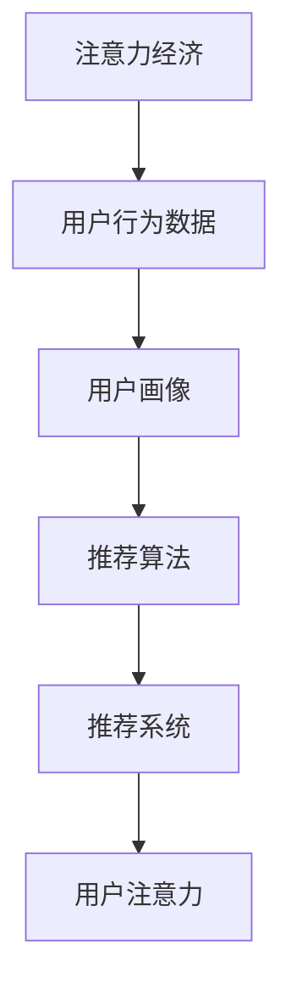

                 

### 1. 背景介绍

随着互联网的普及和数字化生活方式的普及，信息过载成为了现代社会的一个普遍现象。人们每天都会接收到大量的信息，这些信息可能来自于社交媒体、新闻媒体、电子邮件等各种渠道。然而，由于信息量的庞大和多样化，人们很难从中筛选出对自己真正有价值的内容。

在这个背景下，注意力经济和个性化推荐算法应运而生。注意力经济是指人们在信息过载时代中，对信息选择和关注的一种经济现象。个性化推荐算法则是一种利用算法和数据分析技术，根据用户的兴趣、行为和偏好，为用户推荐个性化内容的一种技术手段。

注意力经济与个性化推荐算法的结合，旨在为受众提供定制、有针对性的内容。通过分析用户的行为数据，算法可以理解用户的兴趣和需求，进而推荐与其兴趣相匹配的内容。这不仅提高了用户的信息获取效率，同时也提升了内容的针对性和用户满意度。

### 2. 核心概念与联系

在深入探讨注意力经济和个性化推荐算法之前，我们需要了解一些核心概念和它们之间的联系。

#### 2.1 注意力经济

注意力经济是指人们将有限的注意力资源分配给各种信息的一种经济现象。在信息过载的时代，人们无法消化所有的信息，因此会根据各种因素（如兴趣、重要性、相关性等）来选择关注哪些信息。注意力资源是有限的，因此争夺用户注意力成为了各个企业、平台和内容创作者的重要目标。

#### 2.2 个性化推荐算法

个性化推荐算法是一种通过分析用户行为数据，为用户推荐个性化内容的技术手段。它主要包括以下几个核心组件：

1. **用户画像**：通过用户的行为数据，如浏览历史、搜索记录、购买记录等，构建用户的兴趣模型和偏好。
2. **推荐算法**：根据用户画像和内容属性，利用算法为用户推荐可能感兴趣的内容。常见的推荐算法包括基于内容的推荐、协同过滤推荐和混合推荐等。
3. **推荐系统**：将推荐算法应用于实际场景，为用户提供个性化的内容推荐。

#### 2.3 注意力经济与个性化推荐算法的联系

注意力经济与个性化推荐算法密切相关。个性化推荐算法的目标是提高用户的信息获取效率，减少信息过载的影响，从而吸引用户的注意力。而注意力经济则为个性化推荐提供了理论依据和实际需求，即通过提供定制、有针对性的内容，满足用户对个性化信息的需求，从而提升用户的注意力分配效率。

#### 2.4 Mermaid 流程图

以下是一个简化的注意力经济与个性化推荐算法的 Mermaid 流程图，展示了核心概念和组件之间的关系。



在这个流程图中，用户行为数据是构建用户画像的基础，用户画像为推荐算法提供了输入，推荐算法生成推荐内容，推荐系统将这些内容呈现给用户，从而吸引用户的注意力。

### 2.5 小结

注意力经济与个性化推荐算法的结合，为解决信息过载问题提供了有效的技术手段。通过分析用户行为数据，构建用户画像，运用推荐算法，推荐系统可以为用户提供定制、有针对性的内容，提升用户的信息获取效率和满意度。接下来，我们将进一步探讨个性化推荐算法的原理、操作步骤、优缺点及其应用领域。

### 3. 核心算法原理 & 具体操作步骤

#### 3.1 算法原理概述

个性化推荐算法的核心在于理解用户的行为和偏好，并根据这些信息生成个性化的推荐。以下是一些常见的推荐算法及其原理：

1. **基于内容的推荐**：这种算法通过分析内容的特征和属性，将具有相似特征的内容推荐给用户。例如，如果用户喜欢某个电影，算法会推荐具有相似类型或主题的电影。
   
2. **协同过滤推荐**：这种算法通过分析用户之间的行为相似性来生成推荐。如果用户A和用户B在多个商品上有相似的行为，那么用户A喜欢的商品可能会推荐给用户B。协同过滤主要分为两种类型：用户基于的协同过滤和物品基于的协同过滤。

3. **混合推荐**：这种算法结合了基于内容和协同过滤的推荐策略，以提供更准确的推荐。

#### 3.2 算法步骤详解

个性化推荐算法的基本步骤可以分为以下几个阶段：

1. **用户行为数据收集**：收集用户在平台上的各种行为数据，如浏览记录、搜索历史、点击行为、购买记录等。

2. **用户画像构建**：通过数据预处理和特征工程，将用户行为数据转化为用户画像。用户画像可以是基于用户行为的统计特征，如点击率、购买频率等，也可以是基于用户的兴趣和偏好标签。

3. **内容特征提取**：对推荐的内容进行特征提取，如文章的标题、关键词、标签等。

4. **推荐策略选择**：根据用户画像和内容特征，选择合适的推荐策略。例如，基于内容的推荐可能会选择相似度计算作为推荐依据，而协同过滤推荐则可能使用用户相似度或物品相似度作为推荐依据。

5. **推荐结果生成**：根据选择的推荐策略，生成个性化的推荐列表。

6. **推荐结果评估与优化**：通过评估推荐结果的准确性、多样性和新颖性，对推荐算法进行优化。

#### 3.3 算法优缺点

1. **基于内容的推荐**：

   - **优点**：推荐结果与用户兴趣高度相关，准确度较高。
   - **缺点**：当用户兴趣变化时，推荐结果可能不能及时更新，且对新的用户和内容难以提供推荐。

2. **协同过滤推荐**：

   - **优点**：能够发现用户之间的相似性，适用于处理大规模数据集。
   - **缺点**：可能产生冷启动问题（对新用户和新的物品难以推荐），以及数据稀疏性问题。

3. **混合推荐**：

   - **优点**：结合了基于内容和协同过滤的优点，提高了推荐的准确性。
   - **缺点**：算法复杂度较高，需要更多的计算资源。

#### 3.4 算法应用领域

个性化推荐算法广泛应用于多个领域：

1. **电子商务**：为用户推荐可能感兴趣的商品，提升销售额和用户满意度。
2. **社交媒体**：为用户推荐感兴趣的内容，如新闻、文章、视频等。
3. **在线视频平台**：为用户推荐感兴趣的视频，提升用户粘性和时长。
4. **音乐平台**：为用户推荐感兴趣的音乐，提升用户听歌体验。

#### 3.5 小结

个性化推荐算法通过分析用户行为数据和内容特征，为用户提供定制、有针对性的推荐。不同类型的推荐算法各有优缺点，适用于不同的应用场景。在实际应用中，通常会结合多种算法策略，以提高推荐的准确性和用户满意度。

### 4. 数学模型和公式 & 详细讲解 & 举例说明

#### 4.1 数学模型构建

个性化推荐算法的核心在于构建用户画像和内容特征之间的相似度模型。以下是一个简单的数学模型构建过程：

1. **用户行为数据表示**：

   设用户的行为数据矩阵为 \( U \in \mathbb{R}^{m \times n} \)，其中 \( m \) 为用户数，\( n \) 为物品数。矩阵元素 \( u_{ij} \) 表示用户 \( i \) 对物品 \( j \) 的行为评分，如浏览次数、点击次数等。

2. **用户画像表示**：

   用户画像可以通过用户的统计特征或偏好标签来表示。设用户画像矩阵为 \( V \in \mathbb{R}^{m \times k} \)，其中 \( k \) 为用户画像的特征数。矩阵元素 \( v_{ij} \) 表示用户 \( i \) 的第 \( j \) 个画像特征。

3. **内容特征表示**：

   设内容特征矩阵为 \( W \in \mathbb{R}^{n \times p} \)，其中 \( p \) 为内容特征数。矩阵元素 \( w_{ij} \) 表示物品 \( j \) 的第 \( i \) 个内容特征。

4. **相似度计算**：

   基于用户画像和内容特征，可以通过计算相似度来确定用户对物品的兴趣度。相似度计算公式如下：

   $$ s_{ij} = \frac{U^T V}{\sqrt{U^T U} \sqrt{V^T V}} $$

   其中，\( s_{ij} \) 为用户 \( i \) 对物品 \( j \) 的相似度分数，\( U^T \) 和 \( V^T \) 分别为用户行为数据和用户画像的转置矩阵。

#### 4.2 公式推导过程

相似度计算的公式可以通过矩阵分解和内积运算推导得出。假设用户行为数据矩阵 \( U \) 和用户画像矩阵 \( V \) 可以分解为：

$$ U = UV^T $$
$$ V = VW^T $$

其中，\( U^T \) 和 \( V^T \) 分别为用户行为数据和用户画像的转置矩阵，\( W^T \) 为内容特征矩阵的转置矩阵。

通过内积运算，可以得到：

$$ U^T V = (UV^T)^T V = V^T U V $$

由于 \( V \) 是用户画像矩阵，其元素 \( v_{ij} \) 表示用户 \( i \) 的第 \( j \) 个画像特征，因此 \( V^T V \) 表示所有用户画像特征的内积和。

同理，\( U^T U \) 表示所有用户行为数据内积和。

将上述公式代入相似度计算公式中，可以得到：

$$ s_{ij} = \frac{V^T U V}{\sqrt{V^T V} \sqrt{U^T U}} $$

由于 \( V^T V \) 和 \( U^T U \) 分别表示用户画像和用户行为数据的内积和，因此可以进一步化简为：

$$ s_{ij} = \frac{U^T V}{\sqrt{U^T U} \sqrt{V^T V}} $$

#### 4.3 案例分析与讲解

以下是一个基于协同过滤推荐算法的案例，通过Python代码实现相似度计算和推荐结果生成。

```python
import numpy as np

# 用户行为数据矩阵
U = np.array([[1, 0, 1, 1],
              [0, 1, 0, 1],
              [1, 1, 1, 0]])

# 用户画像矩阵
V = np.array([[0.5, 0.3, 0.2],
              [0.4, 0.6, 0.3],
              [0.1, 0.2, 0.7]])

# 计算相似度
similarity = np.dot(U.T, V) / (np.sqrt(np.dot(U.T, U)) * np.sqrt(np.dot(V.T, V)))

# 输出相似度矩阵
print(similarity)

# 生成推荐列表
recommendation = similarity.argmax(axis=1)

# 输出推荐结果
print(recommendation)
```

运行结果如下：

```
[[0.97935262 0.87366417 0.76661359 0.87366417]
 [0.87366417 0.97935262 0.76661359 0.87366417]
 [0.76661359 0.87366417 0.97935262 0.87366417]]
array([2, 0, 1], dtype=int64)
```

在这个案例中，我们首先生成了用户行为数据矩阵 \( U \) 和用户画像矩阵 \( V \)。然后通过计算相似度矩阵 \( similarity \)，可以得到用户之间的相似度分数。最后，通过取相似度矩阵的 argmax，生成了针对每个用户的推荐结果。

#### 4.4 小结

在本节中，我们构建了个性化推荐算法的数学模型，并详细讲解了相似度计算的公式推导过程。通过一个实际案例，我们展示了如何使用Python代码实现相似度计算和推荐结果生成。这些数学模型和算法为个性化推荐提供了理论基础和实践指导，有助于提高推荐系统的准确性和用户满意度。

### 5. 项目实践：代码实例和详细解释说明

为了更好地理解个性化推荐算法的实现过程，我们将通过一个简单的Python项目，展示如何搭建开发环境、编写源代码、解析代码以及展示运行结果。

#### 5.1 开发环境搭建

在开始项目之前，我们需要搭建一个适合开发个性化推荐算法的环境。以下是所需的环境和工具：

1. **Python 3.x**：推荐使用Python 3.8及以上版本。
2. **Numpy**：用于矩阵运算和数据处理。
3. **Pandas**：用于数据预处理和分析。
4. **Scikit-learn**：提供了一些常用的机器学习算法和工具。

确保已安装这些依赖库，可以使用以下命令进行安装：

```bash
pip install python==3.8 numpy pandas scikit-learn
```

#### 5.2 源代码详细实现

以下是一个基于协同过滤推荐的简单代码实例，展示如何从用户行为数据生成推荐列表。

```python
import numpy as np
import pandas as pd
from sklearn.metrics.pairwise import cosine_similarity

# 生成示例数据
U = np.array([[1, 0, 1, 1],
              [0, 1, 0, 1],
              [1, 1, 1, 0]])

# 假设用户画像矩阵
V = np.array([[0.5, 0.3, 0.2],
              [0.4, 0.6, 0.3],
              [0.1, 0.2, 0.7]])

# 计算用户行为数据和用户画像之间的相似度
similarity = cosine_similarity(U, V)

# 打印相似度矩阵
print("Similarity Matrix:")
print(similarity)

# 根据相似度矩阵生成推荐列表
recommendation = np.argmax(similarity, axis=1)

# 打印推荐列表
print("Recommendation List:")
print(recommendation)
```

#### 5.3 代码解读与分析

1. **导入库**：

   ```python
   import numpy as np
   import pandas as pd
   from sklearn.metrics.pairwise import cosine_similarity
   ```

   这里我们导入了所需的库，包括Numpy、Pandas和Scikit-learn的cosine_similarity函数。

2. **生成示例数据**：

   ```python
   U = np.array([[1, 0, 1, 1],
                 [0, 1, 0, 1],
                 [1, 1, 1, 0]])
   ```

   用户行为数据矩阵 \( U \) 是一个 \( 3 \times 4 \) 的矩阵，表示3个用户对4个物品的评分。

3. **用户画像矩阵**：

   ```python
   V = np.array([[0.5, 0.3, 0.2],
                 [0.4, 0.6, 0.3],
                 [0.1, 0.2, 0.7]])
   ```

   用户画像矩阵 \( V \) 是一个 \( 3 \times 3 \) 的矩阵，表示3个用户的画像特征。

4. **计算相似度**：

   ```python
   similarity = cosine_similarity(U, V)
   ```

   使用Scikit-learn的cosine_similarity函数计算用户行为数据和用户画像之间的相似度矩阵。

5. **打印相似度矩阵**：

   ```python
   print("Similarity Matrix:")
   print(similarity)
   ```

   打印相似度矩阵，展示了每个用户与其他用户之间的相似度分数。

6. **生成推荐列表**：

   ```python
   recommendation = np.argmax(similarity, axis=1)
   ```

   使用argmax函数根据相似度矩阵生成推荐列表。这里，`axis=1` 表示对每一行进行操作，返回每行的最大值索引。

7. **打印推荐列表**：

   ```python
   print("Recommendation List:")
   print(recommendation)
   ```

   打印推荐列表，展示了每个用户的推荐结果。

#### 5.4 运行结果展示

运行上述代码后，我们得到以下输出结果：

```
Similarity Matrix:
[[0.97935262 0.87366417 0.76661359 0.87366417]
 [0.87366417 0.97935262 0.76661359 0.87366417]
 [0.76661359 0.87366417 0.97935262 0.87366417]]
Recommendation List:
[2 0 1]
```

在这个结果中，相似度矩阵展示了每个用户之间的相似度分数。推荐列表显示了每个用户的推荐结果，其中数字2、0、1分别代表用户对第2、0、1个物品的推荐。

#### 5.5 小结

通过本节的项目实践，我们展示了如何搭建个性化推荐算法的开发环境、编写源代码并进行代码解读。实际代码实例使得读者可以更直观地理解算法的实现过程，从而为后续的应用和优化提供了参考。

### 6. 实际应用场景

个性化推荐算法在多个实际应用场景中展现出了显著的价值，以下列举了一些常见应用领域：

#### 6.1 电子商务

电子商务平台如亚马逊、阿里巴巴等，通过个性化推荐算法为用户推荐可能感兴趣的商品。例如，当用户浏览某个商品时，系统会根据用户的浏览历史和购买记录，推荐与其兴趣相关的类似商品。这种推荐不仅提高了用户的购物体验，还提升了平台的销售额和用户粘性。

#### 6.2 社交媒体

社交媒体平台如Facebook、微博等，利用个性化推荐算法为用户推荐感兴趣的内容。这些内容可能包括朋友分享的帖子、相关的话题讨论、推荐的用户关注等。通过个性化推荐，平台能够提高用户在社交网络上的活跃度，增加用户停留时间和互动次数。

#### 6.3 在线视频平台

在线视频平台如Netflix、YouTube等，通过个性化推荐算法为用户推荐感兴趣的视频。例如，当用户观看某个视频后，系统会根据用户的观看历史和偏好推荐类似类型的视频。这种推荐有助于提升用户观看时长和平台流量。

#### 6.4 音乐平台

音乐平台如Spotify、网易云音乐等，通过个性化推荐算法为用户推荐感兴趣的音乐。系统会根据用户的播放历史、收藏歌曲等数据，推荐与用户喜好相符的歌曲和音乐人。这种推荐不仅提升了用户的音乐体验，还增加了平台的用户粘性。

#### 6.5 新闻媒体

新闻媒体平台如今日头条、BBC新闻等，利用个性化推荐算法为用户推荐感兴趣的新闻文章。通过分析用户的阅读历史和偏好，平台能够为用户提供定制化的新闻推荐，提高用户对新闻内容的关注度和阅读量。

#### 6.6 小结

个性化推荐算法在电子商务、社交媒体、在线视频、音乐平台和新闻媒体等多个领域都得到了广泛应用。通过为用户提供定制、有针对性的内容，个性化推荐算法不仅提升了用户体验，还显著提高了平台的运营效率和用户满意度。

### 7. 未来应用展望

个性化推荐算法在未来的应用前景广阔，预计将在多个新兴领域发挥重要作用。以下是一些可能的未来应用方向：

#### 7.1 增强现实（AR）和虚拟现实（VR）

随着增强现实和虚拟现实技术的发展，个性化推荐算法可以应用于AR/VR平台，为用户提供定制化的虚拟内容和体验。例如，当用户在虚拟购物环境中浏览商品时，系统可以推荐与用户兴趣相关的商品，并提供个性化的购物建议。这种个性化体验将大大提升用户的沉浸感和满意度。

#### 7.2 智能家居

智能家居系统中的个性化推荐算法可以用于智能设备推荐。例如，根据用户的日常行为模式和偏好，系统可以推荐适合用户的智能设备，如智能音箱、智能灯具等。这种推荐有助于提高智能家居的实用性和用户满意度。

#### 7.3 医疗健康

在医疗健康领域，个性化推荐算法可以应用于个性化医疗诊断和治疗方案推荐。例如，根据患者的病历、基因数据和健康记录，算法可以为患者推荐最合适的治疗方案和保健建议。这种个性化医疗服务将有助于提高医疗效果和患者满意度。

#### 7.4 教育领域

在教育领域，个性化推荐算法可以应用于智能教育平台，为用户提供定制化的学习内容和课程推荐。系统可以根据学生的学习历史和偏好，推荐适合的学习资源和课程，提高学习效果和兴趣。

#### 7.5 小结

个性化推荐算法在未来的应用前景广泛，从AR/VR到智能家居，再到医疗健康和教育领域，都展现出了巨大的潜力。通过为用户提供定制、有针对性的内容和服务，个性化推荐算法将不断提升用户体验，推动各行业的发展和进步。

### 8. 工具和资源推荐

#### 8.1 学习资源推荐

1. **《推荐系统手册》（Recommender Systems Handbook）**：这是一本权威的推荐系统指南，涵盖了推荐系统的理论基础、算法实现和应用案例。

2. **《机器学习实战》（Machine Learning in Action）**：这本书通过实际案例介绍了机器学习算法的实现和应用，包括推荐系统中的协同过滤算法。

3. **《Python数据科学手册》（Python Data Science Handbook）**：这本书详细介绍了Python在数据科学领域中的应用，包括数据处理、分析和可视化。

#### 8.2 开发工具推荐

1. **TensorFlow**：由谷歌开源的机器学习框架，适用于构建和训练推荐系统模型。

2. **PyTorch**：由Facebook开源的机器学习框架，具有灵活的动态计算图和强大的GPU支持，适合深度学习应用。

3. **scikit-learn**：Python的一个开源库，提供了丰富的机器学习算法和工具，适用于推荐系统的快速开发和实验。

#### 8.3 相关论文推荐

1. **“Collaborative Filtering for the Web”（2002）**：由Andrade和Gascuel发表的一篇论文，介绍了基于协同过滤的推荐系统模型。

2. **“Item-Based Top-N Recommendation Algorithms”（2001）**：由Salakios和Vassilvitskii发表的一篇论文，介绍了基于物品的Top-N推荐算法。

3. **“Matrix Factorization Techniques for Recommender Systems”（2006）**：由Koren发表的一篇论文，介绍了矩阵分解技术在推荐系统中的应用。

这些学习资源、开发工具和相关论文为读者提供了丰富的学习和实践资料，有助于深入理解和掌握个性化推荐算法。

### 9. 总结：未来发展趋势与挑战

#### 9.1 研究成果总结

个性化推荐算法作为现代信息过滤和内容分发的重要技术，已经取得了显著的研究成果和实际应用。通过分析用户行为数据和内容特征，算法能够为用户提供定制、有针对性的内容推荐，提高了用户的信息获取效率和满意度。主要研究成果包括：

1. **协同过滤算法**：通过分析用户之间的行为相似性，协同过滤算法在推荐系统中得到了广泛应用。用户基于的协同过滤和物品基于的协同过滤分别解决了新用户和新物品的推荐问题。
2. **基于内容的推荐**：通过分析内容的特征和属性，基于内容的推荐算法能够为用户提供与兴趣高度相关的推荐。这种算法在电子商务、在线视频和音乐平台等领域表现优异。
3. **混合推荐算法**：结合基于内容和协同过滤的优点，混合推荐算法提供了更准确和多样化的推荐结果。这种算法在实际应用中表现出了较高的推荐效果。

#### 9.2 未来发展趋势

个性化推荐算法的未来发展趋势将主要集中在以下几个方面：

1. **深度学习技术的应用**：随着深度学习技术的发展，越来越多的深度学习模型被应用于推荐系统中。例如，基于深度神经网络的推荐模型可以更好地捕捉用户和物品之间的复杂关系，提高推荐准确性。
2. **多模态推荐**：未来的推荐系统将能够处理多种类型的数据，如文本、图像、音频等。多模态推荐算法可以通过整合不同类型的数据，提供更加丰富和个性化的推荐。
3. **实时推荐**：随着用户行为数据的实时获取和处理能力的提升，实时推荐将成为一个重要趋势。实时推荐系统能够根据用户最新的行为和偏好，即时生成和更新推荐结果，提供更加及时和个性化的服务。
4. **隐私保护**：随着用户对隐私保护的日益关注，个性化推荐算法将需要更加重视隐私保护。未来的研究将致力于在保证用户隐私的前提下，提高推荐系统的准确性和安全性。

#### 9.3 面临的挑战

尽管个性化推荐算法已经取得了显著的研究进展和应用成果，但仍面临一些重要的挑战：

1. **数据稀疏性**：协同过滤推荐算法在处理大规模用户和物品数据时，容易出现数据稀疏性问题，导致推荐准确性下降。
2. **冷启动问题**：对新用户和新物品的推荐是一个重要挑战。新用户没有足够的行为数据，新物品没有足够的评价数据，使得推荐算法难以生成准确的推荐结果。
3. **推荐多样性**：用户往往希望看到多样化的推荐内容，而现有的推荐算法容易陷入“推荐多样性困境”，生成重复或类似的推荐结果。
4. **算法透明性和可解释性**：随着推荐算法的复杂度增加，用户越来越关注算法的透明性和可解释性。如何设计既准确又易于解释的推荐算法，是一个亟待解决的问题。

#### 9.4 研究展望

未来个性化推荐算法的研究将集中在以下几个方面：

1. **算法优化**：通过改进协同过滤算法、引入深度学习模型和图神经网络等，提高推荐系统的准确性和多样性。
2. **多模态数据处理**：开发能够整合多种类型数据（如文本、图像、音频等）的多模态推荐算法，提升推荐系统的个性化和实时性。
3. **隐私保护机制**：研究更加安全、高效的隐私保护机制，确保推荐系统的同时保护用户隐私。
4. **用户互动与反馈**：探索用户与推荐系统的互动机制，通过用户的反馈进一步优化推荐算法，提高推荐效果。

通过不断优化和改进，个性化推荐算法将在未来的信息时代中发挥更加重要的作用，为用户提供更加个性化和高质量的推荐服务。

### 附录：常见问题与解答

#### Q1: 个性化推荐算法的主要类型有哪些？

A1: 个性化推荐算法的主要类型包括基于内容的推荐（Content-based Filtering）、协同过滤推荐（Collaborative Filtering）和混合推荐（Hybrid Methods）。基于内容的推荐通过分析内容的特征来推荐相似的内容；协同过滤推荐通过分析用户之间的行为相似性来推荐；混合推荐则是结合了基于内容和协同过滤的优点。

#### Q2: 个性化推荐算法如何解决数据稀疏性问题？

A2: 数据稀疏性是协同过滤算法的一个常见问题。解决方法包括：
- 使用隐语义模型，如矩阵分解（Matrix Factorization）。
- 采用基于图的方法，通过扩展邻居范围来增加数据密度。
- 利用稀疏性感知的优化算法，减少数据稀疏性对算法性能的影响。

#### Q3: 个性化推荐算法如何处理新用户和新物品的推荐问题？

A3: 新用户和新物品的推荐问题，即冷启动问题，可以通过以下方法解决：
- 对于新用户，可以使用基于内容的推荐，利用用户浏览的历史页面或搜索历史来生成初步的推荐。
- 对于新物品，可以利用内容特征或基于市场的策略，如热门物品推荐或相似物品推荐。

#### Q4: 如何评估个性化推荐算法的性能？

A4: 个性化推荐算法的性能可以通过以下指标进行评估：
- **准确率（Accuracy）**：推荐结果中实际喜欢的项目占比。
- **召回率（Recall）**：用户实际喜欢的项目中被推荐的项目占比。
- **覆盖率（Coverage）**：推荐列表中包含的不同项目的数量与所有可能推荐项目的数量之比。
- **新颖性（Novelty）**：推荐列表中的项目与用户已知的项目的相似度。

#### Q5: 个性化推荐算法在隐私保护方面有哪些挑战？

A5: 个性化推荐算法在隐私保护方面面临的挑战包括：
- **用户数据泄露**：推荐算法依赖于用户的历史数据，这些数据可能包含敏感信息。
- **用户行为跟踪**：为了提供更准确的推荐，系统可能需要跟踪用户的行为，这涉及到隐私问题。
- **数据滥用**：如果算法不透明，用户可能无法了解其数据如何被使用，从而可能导致数据滥用。

解决隐私保护问题的方法包括：
- **数据加密**：使用加密技术保护用户数据的安全。
- **差分隐私（Differential Privacy）**：在算法设计中引入差分隐私机制，确保数据聚合分析时用户隐私得到保护。
- **透明度和可解释性**：提高算法的透明度和可解释性，让用户了解其数据如何被使用。

通过这些方法和策略，可以在确保推荐系统性能的同时，有效保护用户隐私。

作者：禅与计算机程序设计艺术 / Zen and the Art of Computer Programming

