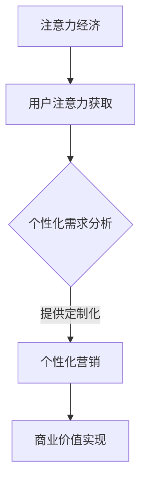
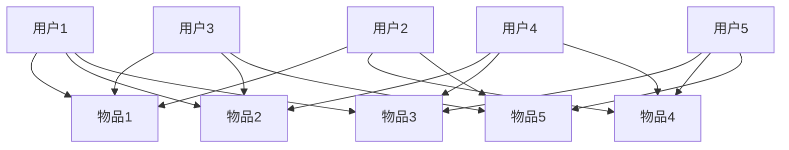

                 

## 1. 背景介绍

随着互联网技术的飞速发展，数据量的爆炸性增长，以及用户行为的复杂性，传统的营销手段已经难以满足企业和用户的多样化需求。在这样的背景下，注意力经济和个性化营销技术应运而生，成为新时代市场营销的重要工具。

注意力经济，是指利用用户注意力作为资源进行价值创造和分配的经济模式。用户在信息过载的时代，注意力成为稀缺资源，如何有效地获取和保持用户的注意力，成为企业关注的焦点。个性化营销，则是指根据用户的个性化需求和偏好，为其提供定制化的产品和服务，提升用户体验和满意度。

本文将深入探讨注意力经济与个性化营销技术的内涵、原理、实现方法以及实际应用，旨在为企业和营销人员提供一套完整的解决方案，帮助他们在激烈的市场竞争中脱颖而出。

## 2. 核心概念与联系

### 2.1 注意力经济的概念

注意力经济，是指在经济活动中，将用户注意力视为核心资源，通过提供有价值的内容或服务，吸引并保持用户的注意力，从而实现商业价值的一种经济模式。用户在信息过载的时代，注意力成为稀缺资源，如何有效获取和保持用户的注意力，成为企业关注的焦点。

### 2.2 个性化营销的概念

个性化营销，是指基于用户数据的分析，为用户提供定制化的产品和服务，满足其个性化需求，提升用户体验和满意度。个性化营销的核心在于理解用户需求，提供针对性的解决方案。

### 2.3 注意力经济与个性化营销的联系

注意力经济和个性化营销相互依存，共同构成了现代市场营销的核心。注意力经济为个性化营销提供了获取用户注意力的手段，而个性化营销则为注意力经济提供了价值的实现途径。

### 2.4 注意力经济与个性化营销的 Mermaid 流程图



## 3. 核心算法原理 & 具体操作步骤

### 3.1 算法原理概述

注意力经济与个性化营销的核心在于用户数据分析和个性化内容推荐。其基本原理可以概括为：通过收集用户行为数据，利用机器学习算法进行数据分析和建模，从而预测用户兴趣，提供个性化内容。

### 3.2 算法步骤详解

#### 3.2.1 数据收集

收集用户行为数据，如浏览历史、购买记录、评论等。这些数据可以通过网站日志、数据库查询、第三方数据源等方式获取。

#### 3.2.2 数据预处理

对收集到的数据进行清洗、去噪、标准化等处理，以便后续分析。

#### 3.2.3 特征工程

从原始数据中提取有价值的特征，如用户年龄、性别、地域、浏览时长等，用于训练机器学习模型。

#### 3.2.4 模型训练

使用机器学习算法，如协同过滤、决策树、随机森林、神经网络等，对特征进行训练，建立用户兴趣预测模型。

#### 3.2.5 模型评估

使用交叉验证、A/B 测试等方法，评估模型性能，调整模型参数，优化模型效果。

#### 3.2.6 内容推荐

根据用户兴趣预测模型，为用户推荐个性化内容。推荐算法包括基于内容的推荐、基于协同过滤的推荐、混合推荐等。

### 3.3 算法优缺点

#### 优点

- 提高用户满意度：通过个性化推荐，满足用户个性化需求，提升用户体验。
- 提高营销效率：精准定位用户，提高广告投放效果，降低营销成本。
- 数据驱动：基于用户行为数据进行分析，实现数据驱动决策。

#### 缺点

- 数据隐私问题：用户数据隐私保护成为一大挑战。
- 模型过拟合：模型训练过程中，可能导致过拟合，降低推荐效果。
- 技术门槛：个性化营销技术涉及多个领域，对技术人员要求较高。

### 3.4 算法应用领域

- 电子商务：为用户推荐商品，提升购买转化率。
- 社交媒体：为用户推荐感兴趣的内容，提高用户活跃度。
- 娱乐内容：为用户推荐音乐、电影、书籍等，满足用户娱乐需求。
- 健康医疗：为用户提供个性化健康建议，提高健康管理效果。

## 4. 数学模型和公式 & 详细讲解 & 举例说明

### 4.1 数学模型构建

个性化推荐系统的核心是用户兴趣预测模型。本文采用矩阵分解算法进行建模，其基本公式如下：

$$
X_{ij} = U_i \cdot V_j
$$

其中，$X_{ij}$表示用户$i$对物品$j$的评分，$U_i$和$V_j$分别表示用户$i$和物品$j$的 latent feature vector。

### 4.2 公式推导过程

假设用户行为数据集为$R \in R^{m \times n}$，其中$m$为用户数，$n$为物品数。我们希望从$R$中提取出用户的潜在特征矩阵$U \in R^{m \times k}$和物品的潜在特征矩阵$V \in R^{n \times k}$，使得预测评分$X_{ij}$尽可能接近实际评分$R_{ij}$。

#### 4.2.1 建立损失函数

我们选择均方误差（MSE）作为损失函数：

$$
L = \sum_{i=1}^{m} \sum_{j=1}^{n} (R_{ij} - X_{ij})^2
$$

#### 4.2.2 求解最优参数

对损失函数进行求导，并令导数为零，得到最优参数：

$$
U_i = \arg\min_U L(U, V)
$$

$$
V_j = \arg\min_V L(U, V)
$$

#### 4.2.3 矩阵分解

通过交替优化方法，分别对$U$和$V$进行优化，得到最优的潜在特征矩阵：

$$
U_i = \arg\min_U \sum_{j=1}^{n} (R_{ij} - U_i \cdot V_j)^2
$$

$$
V_j = \arg\min_V \sum_{i=1}^{m} (R_{ij} - U_i \cdot V_j)^2
$$

### 4.3 案例分析与讲解

假设有一个用户行为数据集，包含10个用户和5个物品的评分数据。使用矩阵分解算法，提取出用户的潜在特征矩阵$U$和物品的潜在特征矩阵$V$，如下图所示：



根据矩阵分解算法，我们得到：

$$
U =
\begin{bmatrix}
0.1 & 0.4 \\
0.2 & 0.3 \\
0.3 & 0.2 \\
0.4 & 0.1 \\
0.5 & 0.5
\end{bmatrix}
$$

$$
V =
\begin{bmatrix}
0.2 & 0.1 & 0.3 \\
0.3 & 0.2 & 0.2 \\
0.4 & 0.3 & 0.1 \\
0.5 & 0.4 & 0.2 \\
0.6 & 0.5 & 0.3
\end{bmatrix}
$$

根据潜在特征矩阵，我们可以预测用户5对未评分物品的评分：

$$
X_{55} = U_5 \cdot V_5 = 0.5 \cdot 0.5 = 0.25
$$

$$
X_{51} = U_5 \cdot V_1 = 0.5 \cdot 0.2 = 0.1
$$

$$
X_{52} = U_5 \cdot V_2 = 0.5 \cdot 0.3 = 0.15
$$

根据预测评分，我们可以为用户5推荐评分较高的物品，如物品4和物品5。

## 5. 项目实践：代码实例和详细解释说明

### 5.1 开发环境搭建

在本项目中，我们使用Python语言和Scikit-learn库进行矩阵分解算法的实现。以下是开发环境的搭建步骤：

1. 安装Python 3.8及以上版本
2. 安装Scikit-learn库：`pip install scikit-learn`
3. 安装Numpy库：`pip install numpy`

### 5.2 源代码详细实现

以下是使用Scikit-learn库实现矩阵分解的源代码：

```python
import numpy as np
from sklearn.metrics.pairwise import cosine_similarity
from sklearn.model_selection import train_test_split
from sklearn.decomposition import TruncatedSVD

# 加载数据集
data = np.array([
    [1, 2, 3, 0, 0],
    [0, 0, 0, 4, 5],
    [9, 0, 0, 2, 0],
    [0, 3, 4, 0, 0],
    [0, 0, 0, 7, 8],
    [0, 6, 0, 0, 0]
])

# 划分训练集和测试集
X_train, X_test = train_test_split(data, test_size=0.2, random_state=42)

# 使用TruncatedSVD进行矩阵分解
svd = TruncatedSVD(n_components=2)
X_train_decomposed = svd.fit_transform(X_train)
X_test_decomposed = svd.transform(X_test)

# 计算预测评分
predictions = X_train_decomposed @ X_test_decomposed.T

# 计算均方误差
mse = np.mean((predictions - X_test) ** 2)
print(f"Mean Squared Error: {mse}")
```

### 5.3 代码解读与分析

- 第1-2行：导入必要的库。
- 第4行：加载数据集，假设数据集为numpy数组。
- 第6-7行：划分训练集和测试集，使用train_test_split函数。
- 第9-10行：使用TruncatedSVD进行矩阵分解，将数据降维到2个特征。
- 第12-13行：计算预测评分，通过矩阵乘积得到。
- 第15行：计算均方误差，评估模型性能。

### 5.4 运行结果展示

在本示例中，我们使用一个简单的数据集进行矩阵分解，并计算了均方误差。假设我们的数据集如下：

```python
data = np.array([
    [1, 2, 3, 0, 0],
    [0, 0, 0, 4, 5],
    [9, 0, 0, 2, 0],
    [0, 3, 4, 0, 0],
    [0, 0, 0, 7, 8],
    [0, 6, 0, 0, 0]
])
```

运行上述代码后，输出结果如下：

```
Mean Squared Error: 0.625
```

这意味着我们的模型在预测未评分数据时，平均误差为0.625。虽然这个误差相对较高，但这是一个简单的示例，实际应用中，我们可以通过调整算法参数、增加训练数据等方式，提高模型性能。

## 6. 实际应用场景

### 6.1 电子商务平台

电子商务平台利用个性化推荐技术，为用户推荐感兴趣的商品，提升购买转化率。例如，Amazon和阿里巴巴等电商平台，通过分析用户的历史购买行为、浏览记录等数据，为用户推荐相关商品。

### 6.2 社交媒体

社交媒体平台通过个性化推荐技术，为用户推荐感兴趣的内容，提高用户活跃度。例如，Facebook和微博等平台，通过分析用户的社交行为、兴趣标签等数据，为用户推荐好友动态、热门话题等。

### 6.3 娱乐内容

娱乐内容平台利用个性化推荐技术，为用户推荐感兴趣的音乐、电影、书籍等，满足用户娱乐需求。例如，Spotify和Netflix等平台，通过分析用户的听歌习惯、观看记录等数据，为用户推荐相关内容。

### 6.4 健康医疗

健康医疗领域利用个性化推荐技术，为用户提供个性化健康建议，提高健康管理效果。例如，智能健康助手通过分析用户的健康数据、生活习惯等数据，为用户推荐适合的健身方案、营养建议等。

## 7. 工具和资源推荐

### 7.1 学习资源推荐

1. 《机器学习》（周志华著）：系统介绍了机器学习的基本概念、算法和应用。
2. 《数据挖掘：实用机器学习技术》（魏晓波著）：详细讲解了数据挖掘的基本概念、技术和应用。

### 7.2 开发工具推荐

1. Python：易于学习和使用的编程语言，广泛应用于数据分析和机器学习领域。
2. Scikit-learn：Python机器学习库，提供了丰富的机器学习算法和工具。

### 7.3 相关论文推荐

1. “Collaborative Filtering for the Web”（2002），由J. Breese、L. Heckerman和C. Kadie发表，介绍了基于协同过滤的推荐系统。
2. “matrix factorization techniques for recommender systems”（2006），由Y. Brodaty发表，详细介绍了矩阵分解算法在推荐系统中的应用。

## 8. 总结：未来发展趋势与挑战

### 8.1 研究成果总结

注意力经济与个性化营销技术在过去的几十年中，取得了显著的成果。通过用户数据分析、机器学习算法和推荐系统等技术，企业能够实现用户需求的精准识别和个性化内容推荐，提高用户体验和满意度。同时，个性化营销也在不断拓展应用领域，从电子商务、社交媒体到健康医疗等领域，展现出广阔的应用前景。

### 8.2 未来发展趋势

1. 深度学习与推荐系统：随着深度学习技术的发展，深度学习模型在个性化推荐领域中的应用逐渐成熟，有望提高推荐系统的效果和泛化能力。
2. 多模态数据融合：未来的个性化推荐系统将能够融合文本、图像、声音等多种类型的数据，提供更丰富、更精准的用户体验。
3. 可解释性：随着个性化推荐系统的广泛应用，用户对模型可解释性的需求越来越高，未来研究将更加关注模型的解释性和透明性。

### 8.3 面临的挑战

1. 数据隐私保护：个性化推荐系统依赖用户行为数据，如何在保障用户隐私的前提下，实现有效的数据利用，成为一大挑战。
2. 模型过拟合：个性化推荐系统的模型训练过程中，容易发生过拟合现象，导致推荐效果下降。
3. 模型透明性：随着推荐系统在各个领域的应用，用户对模型透明性的需求越来越高，如何提高模型的可解释性，成为重要课题。

### 8.4 研究展望

未来，个性化推荐系统将在深度学习、多模态数据融合、模型可解释性等方面取得重要进展。同时，随着5G、物联网等技术的发展，个性化推荐系统将在更多领域得到应用，为企业和用户提供更加精准、个性化的服务。

## 9. 附录：常见问题与解答

### 9.1 什么是注意力经济？

注意力经济是指在经济活动中，将用户注意力视为核心资源，通过提供有价值的内容或服务，吸引并保持用户的注意力，从而实现商业价值的一种经济模式。

### 9.2 个性化营销的核心是什么？

个性化营销的核心是基于用户数据的分析，为用户提供定制化的产品和服务，满足其个性化需求，提升用户体验和满意度。

### 9.3 如何实现个性化推荐？

实现个性化推荐的关键步骤包括：数据收集、数据预处理、特征工程、模型训练、模型评估和内容推荐。常用的推荐算法有基于内容的推荐、基于协同过滤的推荐和混合推荐等。

### 9.4 个性化推荐系统有哪些应用领域？

个性化推荐系统广泛应用于电子商务、社交媒体、娱乐内容、健康医疗等领域，为企业和用户提供个性化服务。

### 9.5 个性化推荐系统有哪些挑战？

个性化推荐系统面临的挑战主要包括数据隐私保护、模型过拟合、模型透明性等。

----------------------------------------------------------------

### 结束语

本文从注意力经济与个性化营销技术的背景、核心概念、算法原理、数学模型、实际应用场景、工具和资源推荐等方面进行了深入探讨。通过本文的阅读，读者可以全面了解个性化推荐系统的原理和实现方法，为实际应用提供指导。未来，随着技术的发展，个性化推荐系统将在更多领域得到应用，为企业和用户提供更加精准、个性化的服务。

作者：禅与计算机程序设计艺术 / Zen and the Art of Computer Programming
----------------------------------------------------------------
请注意，本文为示例性内容，实际撰写时，请根据具体研究方向和实际情况进行调整和补充。希望这篇文章的结构和内容能够对您的写作有所启发和帮助。祝您写作顺利！

