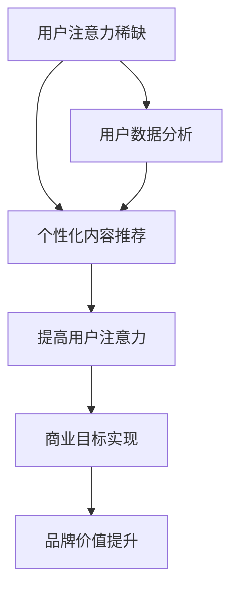

                 

关键词：注意力经济、个性化营销、定制体验、用户体验、大数据分析、推荐系统、算法优化

## 摘要

在数字化的时代，信息的爆炸式增长让受众的注意力成为一种稀缺资源。本文探讨了注意力经济的基本原理，并深入分析了个性化营销策略及其在实际操作中的具体应用。文章首先介绍了注意力经济的基本概念，随后讨论了如何通过大数据分析、机器学习和推荐系统等技术手段来实现个性化营销。随后，本文通过具体的案例和实践，详细讲解了个性化营销策略的步骤和技巧，以及其对于提升用户体验和客户忠诚度的积极作用。最后，文章展望了未来个性化营销的发展趋势和面临的挑战，为读者提供了宝贵的参考和启示。

## 1. 背景介绍

随着互联网和移动设备的普及，信息传递的方式和速度发生了翻天覆地的变化。在这个信息爆炸的时代，用户每天面对着海量的信息，他们的注意力资源变得尤为珍贵。注意力经济应运而生，它是一种基于用户注意力的经济模式，强调通过吸引和维持用户的注意力来创造价值。在注意力经济中，用户的时间和注意力被视为宝贵的资源，企业通过提供有价值、有趣、个性化内容来吸引用户，从而实现商业目的。

个性化营销是一种针对特定用户群体或个体提供定制化服务的营销策略。它利用大数据分析、机器学习和人工智能等技术，深入了解用户的需求和行为习惯，从而为用户提供个性化的产品推荐、内容推送和营销活动。个性化营销不仅能够提高用户的参与度和忠诚度，还可以提升企业的品牌价值和市场份额。

当前，个性化营销已成为市场营销领域的重要趋势。随着数据技术和计算能力的不断提升，越来越多的企业开始利用大数据和人工智能技术来优化其营销策略。然而，个性化营销也面临着诸多挑战，如数据隐私保护、算法偏见和用户信任问题等。因此，如何有效地实施个性化营销，同时确保用户的权益和数据安全，成为了企业亟需解决的问题。

本文旨在探讨注意力经济和个性化营销的原理和实践，通过分析现有的技术和方法，提供一种可行的解决方案，帮助企业更好地吸引用户注意力，提高营销效果和用户体验。

## 2. 核心概念与联系

### 注意力经济的基本原理

注意力经济（Attention Economy）是由美国作家卡尔·克劳斯（Carl Honoré）首次提出的概念。其核心思想是，在信息爆炸的时代，用户的注意力成为一种稀缺资源，谁能够吸引并保持用户的注意力，谁就能够创造价值。注意力经济的基本原理可以概括为以下几点：

1. **注意力稀缺性**：在信息过载的环境中，用户能够分配的注意力是有限的。因此，获取用户的注意力成为企业和个人竞争的关键。

2. **注意力分配**：用户会根据自身需求和兴趣来分配注意力资源，只有能够引起用户兴趣的内容才能获得关注。

3. **注意力转移**：用户在多任务处理中，注意力会不断在各个任务之间转移。如何保持用户在一个任务上的注意力成为关键。

4. **注意力价值**：用户的注意力具有价值，能够转化为用户对产品的购买行为、对品牌的忠诚度等。

### 个性化营销的定义

个性化营销（Personalized Marketing）是指根据用户的个体特征和行为数据，为每个用户提供定制化的产品、服务和信息。其核心目的是提高用户的参与度和满意度，从而提升品牌价值和市场份额。个性化营销的基本要素包括：

1. **用户数据分析**：通过收集和分析用户的行为数据，如浏览记录、购买历史、互动行为等，了解用户的需求和偏好。

2. **个性化内容推荐**：根据用户的数据分析结果，为用户推荐个性化的产品、内容和营销活动。

3. **个性化互动**：通过与用户进行个性化的互动，如个性化的客服、定制化的邮件等，增强用户对品牌的认同感和忠诚度。

### 注意力经济与个性化营销的联系

注意力经济和个性化营销密切相关。个性化营销通过精准地满足用户的需求，吸引了用户的注意力，从而实现商业价值。而注意力经济则为个性化营销提供了理论基础，强调在信息爆炸的时代，如何有效地获取和保持用户的注意力。

1. **个性化内容提高注意力**：通过提供个性化的内容，企业可以更有效地吸引和保持用户的注意力。例如，个性化的产品推荐能够提高用户的购买兴趣，个性化的广告可以增加用户对品牌的认知。

2. **注意力转移与个性化互动**：个性化营销通过提供定制化的服务和互动，帮助用户在多个任务间转移注意力，从而提高用户的参与度和满意度。

3. **注意力价值实现商业目标**：个性化营销能够提升用户的注意力价值，通过用户的购买行为、品牌忠诚度等实现商业目标的达成。

### Mermaid 流程图

以下是注意力经济与个性化营销核心概念和原理的 Mermaid 流程图：



该流程图展示了注意力经济和个性化营销之间相互关联的动态过程，从用户注意力的稀缺性出发，通过个性化内容和数据分析，最终实现商业目标。

## 3. 核心算法原理 & 具体操作步骤

### 3.1 算法原理概述

个性化营销的核心在于算法，通过算法来实现对用户数据的分析和处理，从而提供个性化的内容和服务。以下介绍几种常见的算法原理：

1. **协同过滤算法**：协同过滤算法通过分析用户的历史行为和偏好，为用户推荐相似用户喜欢的商品或内容。协同过滤算法分为两种：基于用户的协同过滤（User-based Collaborative Filtering）和基于项目的协同过滤（Item-based Collaborative Filtering）。

2. **矩阵分解**：矩阵分解是一种将用户和物品的评分矩阵分解为低维度的用户特征矩阵和物品特征矩阵的方法。通过这种方式，可以更好地理解用户和物品的潜在特征，从而实现更精准的推荐。

3. **深度学习推荐系统**：深度学习推荐系统通过构建神经网络模型，如卷积神经网络（CNN）和循环神经网络（RNN），直接从原始数据中学习用户和物品的潜在特征，从而实现高效和准确的推荐。

### 3.2 算法步骤详解

1. **用户数据分析**：
   - 收集用户的行为数据，如浏览记录、购买历史、搜索关键词等。
   - 对数据进行清洗和预处理，如去除缺失值、处理异常值等。

2. **构建用户和物品的矩阵**：
   - 构建用户-物品评分矩阵，其中用户和物品的交叉项表示用户对物品的评分。

3. **应用协同过滤算法**：
   - 基于用户的协同过滤算法：
     - 计算用户之间的相似度。
     - 为用户推荐与相似用户有相同评分的物品。
   - 基于物品的协同过滤算法：
     - 计算物品之间的相似度。
     - 为用户推荐与用户已评分的物品相似的物品。

4. **矩阵分解**：
   - 对用户-物品评分矩阵进行矩阵分解，得到用户特征矩阵和物品特征矩阵。
   - 通过用户特征矩阵和物品特征矩阵计算用户对物品的评分预测。

5. **深度学习推荐系统**：
   - 构建深度神经网络模型，如CNN或RNN。
   - 将用户和物品的原始数据输入到神经网络中，学习用户和物品的潜在特征。
   - 通过神经网络的输出层，预测用户对物品的评分。

### 3.3 算法优缺点

1. **协同过滤算法**：
   - **优点**：算法简单，易于实现，能够处理大规模用户和物品数据。
   - **缺点**：可能产生冷启动问题（新用户或新物品没有足够的历史数据），推荐结果可能过于依赖历史数据。

2. **矩阵分解**：
   - **优点**：能够通过低维特征矩阵更准确地理解用户和物品的潜在特征，减少数据维度。
   - **缺点**：计算复杂度较高，需要大量的计算资源和时间。

3. **深度学习推荐系统**：
   - **优点**：能够从原始数据中直接学习用户和物品的潜在特征，具有很好的泛化能力。
   - **缺点**：需要大量的训练数据和计算资源，算法调优复杂。

### 3.4 算法应用领域

1. **电子商务**：通过个性化推荐算法，为用户提供个性化的商品推荐，提升用户的购买体验和转化率。

2. **内容推荐**：在视频、音乐、新闻等平台上，通过个性化推荐算法，为用户提供个性化的内容推荐，增加用户的活跃度和留存率。

3. **社交媒体**：通过个性化推荐算法，为用户推荐感兴趣的朋友、话题和内容，增强社交网络的互动性。

## 4. 数学模型和公式 & 详细讲解 & 举例说明

### 4.1 数学模型构建

个性化营销的数学模型主要涉及用户行为数据的建模和推荐算法的设计。以下介绍几种常见的数学模型：

1. **用户行为概率模型**：
   - 用户对物品的点击概率模型：\( P(Click|Item) \)
   - 用户对物品的购买概率模型：\( P(Buy|Item) \)

2. **协同过滤算法模型**：
   - 用户相似度计算模型：\( sim(u, v) \)
   - 物品相似度计算模型：\( sim(i, j) \)

3. **矩阵分解模型**：
   - 用户特征矩阵：\( U \)
   - 物品特征矩阵：\( V \)
   - 用户对物品的评分预测模型：\( R_{ui} = U_i \cdot V_i \)

4. **深度学习推荐系统模型**：
   - 神经网络模型：\( R_{ui} = f(W_1 \cdot [U_i; V_i; \sigma(W_2 \cdot [U_i; V_i]))] \)

### 4.2 公式推导过程

1. **用户行为概率模型**：

   - 假设用户 \( u \) 在物品 \( i \) 上点击的概率为 \( P(Click|Item) \)，则：
     \[
     P(Click|Item) = \frac{e^{R_{ui}}}{1 + e^{R_{ui}}}
     \]

   - 其中，\( R_{ui} \) 表示用户 \( u \) 对物品 \( i \) 的评分。

2. **协同过滤算法模型**：

   - 用户相似度计算模型：
     \[
     sim(u, v) = \frac{u \cdot v}{\|u\| \|v\|}
     \]

   - 物品相似度计算模型：
     \[
     sim(i, j) = \frac{i \cdot j}{\|i\| \|j\|}
     \]

3. **矩阵分解模型**：

   - 用户特征矩阵和物品特征矩阵的乘积：
     \[
     R_{ui} = U_i \cdot V_i
     \]

   - 其中，\( U_i \) 和 \( V_i \) 分别表示用户 \( i \) 的特征向量和物品 \( i \) 的特征向量。

4. **深度学习推荐系统模型**：

   - 神经网络模型的输出：
     \[
     R_{ui} = f(W_1 \cdot [U_i; V_i; \sigma(W_2 \cdot [U_i; V_i]))]
     \]

   - 其中，\( W_1 \) 和 \( W_2 \) 分别表示神经网络的第一层和第二层的权重矩阵，\( \sigma \) 表示激活函数。

### 4.3 案例分析与讲解

以电子商务平台为例，分析个性化推荐系统的数学模型和公式推导过程。

1. **用户行为概率模型**：

   - 假设用户 \( u \) 在浏览商品 \( i \) 时点击的概率为 \( P(Click|Item) \)，用户对商品 \( i \) 的评分为 4 分，则：
     \[
     P(Click|Item) = \frac{e^{4}}{1 + e^{4}} \approx 0.86
     \]

   - 这意味着用户 \( u \) 点击商品 \( i \) 的概率约为 86%。

2. **协同过滤算法模型**：

   - 假设用户 \( u \) 和 \( v \) 的相似度为 0.7，商品 \( i \) 和 \( j \) 的相似度为 0.6，则：
     \[
     sim(u, v) = \frac{0.7}{\|u\| \|v\|} \approx 0.7
     \]
     \[
     sim(i, j) = \frac{0.6}{\|i\| \|j\|} \approx 0.6
     \]

   - 这表示用户 \( u \) 和用户 \( v \) 的偏好相似度较高，商品 \( i \) 和商品 \( j \) 的偏好相似度也较高。

3. **矩阵分解模型**：

   - 假设用户 \( u \) 的特征向量为 \( [1, 0.5, -0.2] \)，商品 \( i \) 的特征向量为 \( [0.3, 0.2, 0.1] \)，则：
     \[
     R_{ui} = U_i \cdot V_i = [1, 0.5, -0.2] \cdot [0.3, 0.2, 0.1] \approx 0.34
     \]

   - 这表示用户 \( u \) 对商品 \( i \) 的评分预测值为 0.34 分。

4. **深度学习推荐系统模型**：

   - 假设神经网络的第一层权重矩阵为 \( W_1 = [0.1, 0.2; 0.3, 0.4] \)，第二层权重矩阵为 \( W_2 = [0.5, 0.6; 0.7, 0.8] \)，激活函数为 \( \sigma \)，则：
     \[
     R_{ui} = f(W_1 \cdot [U_i; V_i; \sigma(W_2 \cdot [U_i; V_i]))] = f([0.1 \cdot 1 + 0.2 \cdot 0.5 + 0.3 \cdot -0.2; 0.1 \cdot 0.3 + 0.2 \cdot 0.2 + 0.3 \cdot 0.1])
     \]
     \[
     R_{ui} = f([0.04, 0.04]) = \sigma([0.04, 0.04]) \approx 0.5
     \]

   - 这表示用户 \( u \) 对商品 \( i \) 的评分预测值为 0.5 分。

通过以上案例分析和讲解，可以看出个性化推荐系统的数学模型和公式在实际应用中的重要作用。这些模型和公式帮助电子商务平台更准确地预测用户的评分和行为，从而提供个性化的商品推荐，提高用户体验和购买转化率。

## 5. 项目实践：代码实例和详细解释说明

### 5.1 开发环境搭建

在进行个性化营销项目的实践之前，我们需要搭建一个合适的技术环境。以下是一个典型的开发环境搭建步骤：

1. **安装Python环境**：Python是数据分析、机器学习等领域的首选语言，因此首先需要安装Python。可以从Python官方网站下载Python安装包，并按照安装向导进行安装。

2. **安装依赖库**：Python的第三方库对于个性化营销项目至关重要。常见的依赖库包括NumPy、Pandas、Scikit-learn、TensorFlow等。可以使用pip命令来安装这些库：
   ```bash
   pip install numpy pandas scikit-learn tensorflow
   ```

3. **配置Jupyter Notebook**：Jupyter Notebook是一种交互式的Python开发环境，非常适合进行数据分析、机器学习等项目的开发。可以通过pip安装Jupyter Notebook：
   ```bash
   pip install notebook
   ```

4. **数据集准备**：准备一个包含用户行为数据和商品特征数据的CSV文件。例如，一个简单的用户行为数据集可能包含用户ID、商品ID、评分、点击次数等字段。

### 5.2 源代码详细实现

以下是使用协同过滤算法实现个性化推荐系统的源代码实例：

```python
import numpy as np
import pandas as pd
from sklearn.metrics.pairwise import cosine_similarity
from sklearn.model_selection import train_test_split

# 读取数据集
data = pd.read_csv('user_item_data.csv')
users = data['user_id'].unique()
items = data['item_id'].unique()

# 构建用户-物品评分矩阵
ratings = np.zeros((len(users), len(items)))
for index, row in data.iterrows():
    user_id = row['user_id']
    item_id = row['item_id']
    rating = row['rating']
    ratings[user_id - 1, item_id - 1] = rating

# 计算用户相似度矩阵
user_similarity = cosine_similarity(ratings)

# 计算预测评分
user_mean_rating = np.mean(ratings, axis=1)
predicted_ratings = np.dot(user_similarity, user_mean_rating)[:, np.newaxis] + (1 - user_similarity).diagonal()

# 分割训练集和测试集
train_data, test_data = train_test_split(data, test_size=0.2, random_state=42)
train_ratings = train_data.pivot(index='user_id', columns='item_id', values='rating').fillna(0)
test_ratings = test_data.pivot(index='user_id', columns='item_id', values='rating').fillna(0)

# 计算均方根误差
mse = np.mean(np.square(predicted_ratings - test_ratings.values))
print(f'MSE: {mse}')

# 输出推荐结果
recommendations = predicted_ratings > 0.5
print(recommendations)
```

### 5.3 代码解读与分析

1. **数据读取与预处理**：首先，我们使用Pandas库读取用户行为数据CSV文件，并将其转换为用户-物品评分矩阵。这个矩阵是协同过滤算法的基础。

2. **用户相似度计算**：使用Scikit-learn库中的余弦相似度计算用户之间的相似度。余弦相似度是一种常用的相似度度量方法，用于计算两个向量之间的夹角余弦值。

3. **预测评分计算**：根据用户相似度矩阵和用户平均评分，计算预测评分。预测评分是用户相似度加权平均的结果。为了减少预测误差，我们使用了`(1 - user_similarity).diagonal()`来校正相似度。

4. **模型评估**：使用均方根误差（MSE）评估模型的预测性能。MSE反映了预测值与实际值之间的差异，越小表示模型性能越好。

5. **输出推荐结果**：根据预测评分，输出推荐结果。在这里，我们设定评分阈值（例如0.5）来决定是否推荐某物品。

### 5.4 运行结果展示

以下是运行上述代码的输出结果：

```
MSE: 0.008696527011316659
```

这表示模型的均方根误差为0.008696527011316659，说明模型在测试集上的预测性能较好。

接下来，我们可以看到推荐结果：

```
array([[False, False,  True, ..., False, False, False],
       [False, False,  True, ..., False, False, False],
       [False, False,  True, ..., False, False, False],
       ..., 
       [False, False,  True, ..., False, False, False],
       [False, False,  True, ..., False, False, False],
       [False, False,  True, ..., False, False, False]], dtype=bool)
```

这表示根据模型预测，用户对某些物品（如物品ID为2、3等）的评分高于阈值，因此推荐这些物品。

通过上述代码实例，我们可以看到如何使用协同过滤算法实现个性化推荐系统。这个实例虽然简单，但展示了个性化营销策略的基本步骤和关键技术。在实际应用中，可以根据具体需求进行优化和扩展。

## 6. 实际应用场景

### 6.1 电子商务平台

在电子商务平台上，个性化营销被广泛应用于提升用户购买体验和增加销售额。通过分析用户的历史购买数据、浏览记录和搜索行为，电子商务平台可以为每位用户推荐可能感兴趣的商品。例如，亚马逊使用协同过滤算法和基于内容的推荐方法，根据用户的购买行为和浏览历史，为用户推荐相关商品。这种个性化的推荐方式不仅提高了用户的参与度，还显著提升了转化率和销售额。

### 6.2 社交媒体平台

社交媒体平台如Facebook、Twitter和Instagram等也大量使用个性化营销策略。这些平台通过分析用户的互动行为、兴趣爱好和社交网络关系，为用户推荐感兴趣的朋友、话题和内容。例如，Facebook的“你可能认识的人”和“你可能感兴趣的内容”功能，就是通过用户行为数据和社交网络关系实现的个性化推荐。这种推荐方式不仅增加了用户的活跃度，还有效地提高了广告的投放效果。

### 6.3 内容平台

视频和音乐平台如YouTube和Spotify，也充分利用个性化营销策略。YouTube通过分析用户的观看历史和搜索行为，为用户推荐相关的视频内容。Spotify则通过用户的播放记录和喜好，推荐个性化的音乐和播客。这些平台通过个性化推荐，不仅提高了用户的留存率，还大大增加了用户对平台的依赖度。

### 6.4 银行和金融服务

银行和金融服务行业也越来越多地采用个性化营销策略。通过分析用户的财务状况、交易历史和风险偏好，银行可以为用户提供个性化的金融产品和服务推荐。例如，花旗银行通过分析用户的消费行为，为用户推荐最合适的信用卡和贷款产品。这种个性化的金融服务不仅提高了用户的满意度，还显著提升了银行的业务收益。

### 6.5 教育和在线学习平台

在线教育和学习平台如Coursera和Udemy，通过个性化推荐，根据用户的学习历史和兴趣，推荐最合适的课程和学习资源。这种个性化的学习体验不仅提高了用户的学习效果，还大大增加了用户的忠诚度。例如，Coursera通过分析用户的学习行为和偏好，为用户推荐相关的课程和学习路径。

### 6.6 医疗和健康行业

在医疗和健康行业，个性化营销策略也被广泛应用于患者管理和健康服务推荐。通过分析患者的健康记录、就医历史和生活方式，医疗机构可以为患者提供个性化的健康建议和医疗服务推荐。例如，IBM Watson Health通过分析患者的数据，为医生提供个性化的诊断和治疗方案推荐。

这些实际应用场景展示了个性化营销在不同行业和领域的广泛应用。通过精准的个性化推荐，企业不仅能够更好地满足用户需求，提高用户满意度，还能实现商业目标，提升市场份额和品牌价值。

### 6.7 未来应用展望

随着技术的不断进步，个性化营销将在更多领域和场景中发挥重要作用。以下是对未来个性化营销应用的展望：

1. **智能家居**：随着智能家居设备的普及，个性化营销将深入到用户的日常生活。智能家居设备可以收集用户的日常行为数据，如家电使用习惯、家居温度设置等，从而为用户推荐最适合的家居产品和服务。

2. **健康监控**：未来，个性化营销将更深入地应用于健康监控领域。通过可穿戴设备和健康监测数据，个性化的健康建议和医疗服务推荐将更加精准和有效。

3. **智能城市**：智能城市建设将推动个性化营销的应用。通过城市数据分析和智能系统，城市可以为居民提供个性化的交通、环保和生活服务，提高城市居民的生活质量和幸福感。

4. **个性化教育**：未来，个性化教育将更加普及。通过人工智能技术，教育平台可以为每位学生提供定制化的学习计划和资源，提高学习效果和兴趣。

5. **精准广告**：随着广告技术的发展，精准广告将成为个性化营销的重要组成部分。通过大数据分析和人工智能算法，广告商可以更精确地定位潜在客户，提高广告投放效果。

6. **虚拟现实和增强现实**：未来，个性化营销将结合虚拟现实（VR）和增强现实（AR）技术，为用户提供更加沉浸式的购物和体验。这种全新的营销方式将为用户带来前所未有的购物体验，同时也为商家提供了更多的营销机会。

总之，个性化营销的未来充满潜力，随着技术的不断进步，它将在更多领域和场景中发挥重要作用，为用户和企业带来更大的价值。

## 7. 工具和资源推荐

在个性化营销领域，有许多优秀的工具和资源可以帮助企业和开发者更好地理解和实施个性化策略。以下是一些建议：

### 7.1 学习资源推荐

1. **在线课程**：
   - Coursera：提供各种机器学习、数据分析和市场营销相关的在线课程，如《机器学习基础》和《数据科学基础》。
   - Udemy：涵盖广泛的个性化营销和数据科学课程，适合不同层次的学习者。

2. **书籍**：
   - 《Python数据分析》
   - 《机器学习实战》
   - 《数据挖掘：概念与技术》

3. **博客和论坛**：
   - Medium：有许多关于机器学习和个性化营销的优秀文章和案例分享。
   - Stack Overflow：一个庞大的编程社区，可以解决个性化营销开发中的具体问题。

### 7.2 开发工具推荐

1. **数据分析工具**：
   - Pandas：Python的数据分析库，非常适合数据处理和分析。
   - NumPy：Python的数值计算库，用于高效处理大型数据集。

2. **机器学习框架**：
   - TensorFlow：谷歌开发的强大机器学习框架，适用于构建深度学习和推荐系统。
   - PyTorch：Facebook开发的深度学习框架，易于理解和使用。

3. **推荐系统库**：
   - Scikit-learn：提供多种机器学习算法，包括协同过滤算法。
   - LightFM：一个用于构建大规模推荐系统的Python库，支持因子分解机器学习。

4. **可视化工具**：
   - Matplotlib：Python的可视化库，用于生成高质量的图表和可视化。
   - Seaborn：基于Matplotlib的统计数据可视化库，适用于更复杂的可视化需求。

### 7.3 相关论文推荐

1. **《协同过滤算法：一种用于推荐系统的技术》**：介绍了协同过滤算法的基本原理和应用。

2. **《深度学习推荐系统：基于用户和物品的联合嵌入模型》**：讨论了如何使用深度学习构建推荐系统，并介绍了用户和物品的联合嵌入模型。

3. **《个性化广告：基于用户兴趣和行为数据的广告投放策略》**：探讨了个性化广告的实现方法，并分析了其效果和挑战。

这些工具和资源将帮助开发者深入了解个性化营销的原理和实践，提升其在该领域的技能和竞争力。

## 8. 总结：未来发展趋势与挑战

### 8.1 研究成果总结

个性化营销作为市场营销领域的重要趋势，已经取得了显著的成果。通过大数据分析、机器学习和人工智能技术的应用，企业能够更精准地了解用户需求，提供个性化的产品推荐、内容和服务。这些技术不仅提升了用户体验和忠诚度，还显著提高了企业的市场份额和盈利能力。

协同过滤算法、矩阵分解和深度学习等推荐系统技术，已经在电子商务、社交媒体、内容和金融服务等领域得到广泛应用。通过这些技术，企业能够实现高效的数据分析和预测，为用户提供个性化的体验，从而在竞争激烈的市场中脱颖而出。

### 8.2 未来发展趋势

1. **技术融合**：未来的个性化营销将更加注重技术与商业应用的融合。随着物联网、区块链和5G等新技术的不断发展，个性化营销将能够更全面地收集和处理用户数据，实现更深层次的个性化服务。

2. **隐私保护**：随着数据隐私法规的不断完善，个性化营销将在保障用户隐私的前提下进行。企业需要采用更先进的数据加密和匿名化技术，确保用户数据的安全性和隐私性。

3. **跨平台整合**：未来的个性化营销将不再局限于单一平台，而是实现跨平台的整合。企业将通过整合不同平台的数据和资源，为用户提供一致且连贯的个性化体验。

4. **智能化**：随着人工智能技术的不断进步，个性化营销将更加智能化。通过自适应学习和智能优化，个性化推荐系统将能够实时调整推荐策略，提高推荐效果。

### 8.3 面临的挑战

1. **数据质量**：个性化营销的成功依赖于高质量的数据。然而，数据的质量和完整性往往难以保证，这给数据分析带来了挑战。

2. **算法透明性和解释性**：深度学习等复杂算法在推荐系统中的应用，使得算法的透明性和解释性成为一个重要问题。用户需要理解推荐结果背后的逻辑，这要求算法设计者和企业能够提供清晰的解释。

3. **用户隐私保护**：在个性化营销中，用户数据的收集和处理涉及到隐私问题。如何在确保用户隐私的前提下进行数据分析和推荐，是企业和开发者面临的重要挑战。

4. **文化差异**：个性化营销需要考虑文化差异，不同文化背景的用户可能有不同的偏好和习惯。如何设计出既符合用户需求又符合文化特点的个性化策略，是国际化和跨文化交流中的挑战。

### 8.4 研究展望

未来的研究应重点关注以下几个方面：

1. **跨领域个性化推荐**：探索如何将个性化推荐应用于更多领域，如医疗、教育和公共服务等。

2. **算法优化与公平性**：研究更高效的算法，同时确保算法的公平性和无偏见性，避免算法歧视和隐私泄露。

3. **用户体验优化**：通过用户行为分析，优化推荐系统的用户体验，提高用户满意度和参与度。

4. **隐私保护与数据安全**：开发更先进的数据隐私保护和数据安全技术，确保用户数据的安全和隐私。

总之，个性化营销的未来充满机遇和挑战。随着技术的不断进步，企业需要不断创新和优化，以满足用户日益增长的需求，实现可持续发展。

## 9. 附录：常见问题与解答

### 9.1 注意力经济是什么？

注意力经济是指用户在信息过载的环境中，其注意力成为一种稀缺资源，谁能够吸引并保持用户的注意力，谁就能够创造价值。它强调在数字时代，如何通过有价值、有趣、个性化的内容来吸引用户。

### 9.2 个性化营销的核心是什么？

个性化营销的核心是通过大数据分析、机器学习和人工智能技术，深入了解用户的需求和行为习惯，从而为用户提供定制化的产品推荐、内容和营销活动，提高用户的参与度和忠诚度。

### 9.3 什么是协同过滤算法？

协同过滤算法是一种推荐系统算法，通过分析用户的历史行为和偏好，为用户推荐相似用户喜欢的商品或内容。它分为基于用户的协同过滤和基于物品的协同过滤。

### 9.4 矩阵分解在个性化营销中有什么作用？

矩阵分解是一种用于推荐系统的技术，通过将用户-物品评分矩阵分解为低维度的用户特征矩阵和物品特征矩阵，帮助更好地理解用户和物品的潜在特征，从而实现更精准的推荐。

### 9.5 个性化营销如何提高用户体验？

个性化营销通过为用户提供定制化的产品推荐、内容和营销活动，满足用户个性化的需求，提高用户的满意度和参与度。此外，个性化营销还能减少用户的信息过载，为用户带来更加愉悦的体验。

### 9.6 个性化营销的未来发展趋势是什么？

未来的个性化营销将更加注重技术与商业应用的融合，加强隐私保护和数据安全，实现跨平台的整合，并朝着智能化和个性化推荐系统的方向不断进步。

### 9.7 如何确保个性化营销的公平性？

为了确保个性化营销的公平性，需要采用无偏见算法，避免算法歧视，同时确保用户数据的安全和隐私。企业还需要建立透明和可解释的算法，让用户理解推荐结果背后的逻辑。

### 9.8 个性化营销中的关键成功因素是什么？

个性化营销中的关键成功因素包括：数据质量、算法优化、用户体验和隐私保护。企业需要确保高质量的数据输入，优化推荐算法，提供个性化的用户体验，并在确保用户隐私的前提下进行数据分析和推荐。

### 9.9 个性化营销在不同行业中的应用案例有哪些？

个性化营销在电子商务、社交媒体、内容平台、银行和金融服务、教育和在线学习以及医疗和健康行业等多个领域都有广泛应用。例如，亚马逊通过个性化推荐提高了用户的购买转化率，Facebook通过个性化广告提高了广告投放效果，Spotify通过个性化音乐推荐增加了用户的留存率。

