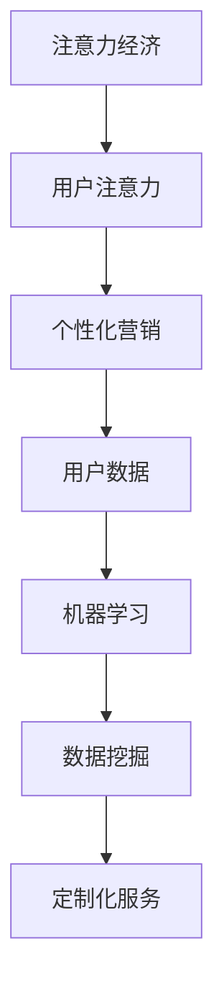
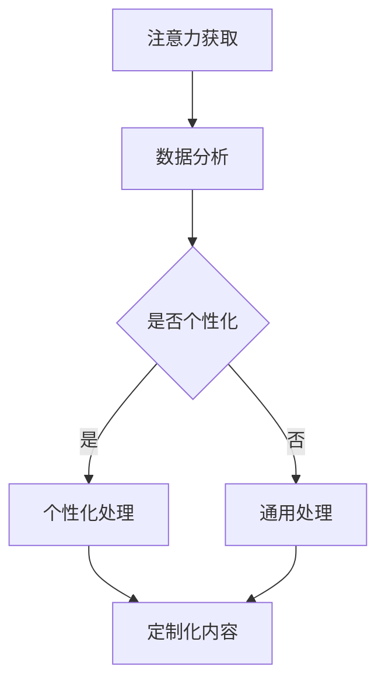

                 

关键词：注意力经济，个性化营销，定制信息，针对性体验，AI算法，数据挖掘，用户体验

> 摘要：本文深入探讨了注意力经济与个性化营销的原理、实践和方法。通过分析注意力经济的本质，解释个性化营销的重要性，本文提出了一套基于人工智能算法和数据挖掘技术的个性化信息创建和体验设计流程。文中详细阐述了核心算法原理、数学模型及其应用领域，并通过实例展示如何在项目实践中实现定制化的信息和体验。此外，本文还展望了个性化营销的未来发展趋势，以及可能面临的挑战。

## 1. 背景介绍

### 注意力经济的崛起

随着互联网的迅猛发展，信息爆炸的时代已经到来。在这个时代，人们的注意力成为了一种稀缺资源。注意力经济因此应运而生，它指的是商家通过吸引和维持消费者的注意力来创造经济价值的一种经济模式。在这个模式下，用户的注意力成为了商家争夺的焦点。

### 个性化营销的定义

个性化营销是一种基于用户数据分析和行为预测，为每个用户提供定制化信息和服务的营销策略。这种策略旨在提高用户满意度和忠诚度，通过精准营销实现更高的转化率和客户价值。

### 人工智能与个性化营销的结合

随着人工智能技术的发展，尤其是机器学习和数据挖掘技术的进步，个性化营销变得更为精准和高效。通过分析海量用户数据，人工智能可以识别用户的个性化需求，从而为他们提供量身定制的服务和体验。

## 2. 核心概念与联系

### 核心概念

- **注意力经济**：用户注意力作为稀缺资源，其分配和利用成为企业竞争的关键。
- **个性化营销**：基于用户数据分析，为用户提供量身定制的服务和信息。

### 联系图



### Mermaid 流程图(Mermaid 流程节点中不要有括号、逗号等特殊字符)



## 3. 核心算法原理 & 具体操作步骤

### 3.1 算法原理概述

个性化营销的核心在于算法的智能分析和决策能力。本文采用基于协同过滤（Collaborative Filtering）的推荐系统作为基础算法，结合深度学习技术进行优化。

### 3.2 算法步骤详解

#### 步骤一：用户画像构建

- **数据收集**：收集用户的个人基本信息、行为数据、偏好数据等。
- **特征提取**：对收集的数据进行预处理和特征提取，构建用户画像。

#### 步骤二：推荐算法选择

- **协同过滤**：根据用户的历史行为，发现相似的用户和商品，进行推荐。
- **深度学习**：结合用户画像，使用深度学习模型进行个性化预测。

#### 步骤三：推荐内容生成

- **内容匹配**：根据用户画像和商品信息，进行内容匹配。
- **推荐排序**：使用排序算法（如FM、LR等）优化推荐内容排序。

### 3.3 算法优缺点

#### 优点：

- **高效性**：能够快速处理海量数据，提供实时推荐。
- **个性化**：根据用户行为和偏好，提供定制化推荐。

#### 缺点：

- **冷启动问题**：新用户或新商品缺乏历史数据，推荐效果较差。
- **数据隐私**：用户数据收集和使用可能引发隐私问题。

### 3.4 算法应用领域

- **电子商务**：为用户提供个性化商品推荐。
- **社交媒体**：根据用户兴趣推荐内容。
- **在线教育**：为学习者推荐适合的课程。

## 4. 数学模型和公式 & 详细讲解 & 举例说明

### 4.1 数学模型构建

#### 4.1.1 协同过滤

$$
R(u, i) = \sum_{j \in N(u)} \frac{1}{|N(u)|} \cdot R(j, i)
$$

其中，$R(u, i)$ 表示用户 $u$ 对商品 $i$ 的评分预测，$N(u)$ 表示与用户 $u$ 相似的一组用户，$R(j, i)$ 表示用户 $j$ 对商品 $i$ 的实际评分。

#### 4.1.2 深度学习模型

$$
\hat{R}(u, i) = \sigma(W_0 + W_u \cdot u + W_i \cdot i + b)
$$

其中，$\sigma$ 是激活函数，$W_0$、$W_u$、$W_i$ 和 $b$ 分别是模型的权重和偏置。

### 4.2 公式推导过程

#### 协同过滤推导

协同过滤算法的核心思想是通过计算用户之间的相似度，然后利用相似用户的历史评分预测目标用户的评分。具体推导过程如下：

假设用户 $u$ 对商品 $i$ 的评分为 $r_{ui}$，用户 $u$ 对其他商品 $j$ 的评分为 $r_{uj}$，则用户 $u$ 的评分向量可以表示为 $R_u = [r_{u1}, r_{u2}, ..., r_{ui}, ...]$。

设用户之间的相似度为 $s(u, v)$，商品之间的相似度为 $s(i, j)$，则用户 $u$ 对商品 $i$ 的评分预测可以表示为：

$$
R(u, i) = \sum_{v \in N(u)} s(u, v) \cdot r_{vi}
$$

其中，$N(u)$ 表示与用户 $u$ 相似的一组用户。

#### 深度学习推导

深度学习模型通常采用神经网络进行建模，以下是简单的多层感知机（MLP）模型推导过程：

输入层：$[x_1, x_2, ..., x_n]$

隐藏层：$[h_1, h_2, ..., h_m]$

输出层：$[y_1, y_2, ..., y_n]$

输入层到隐藏层的激活函数为：

$$
h_j = \sigma(\sum_{i=1}^n w_{ij} \cdot x_i + b_j)
$$

隐藏层到输出层的激活函数为：

$$
y_k = \sigma(\sum_{j=1}^m w_{jk} \cdot h_j + b_k)
$$

其中，$w_{ij}$ 和 $w_{jk}$ 分别为输入层到隐藏层和隐藏层到输出层的权重，$b_j$ 和 $b_k$ 分别为隐藏层和输出层的偏置，$\sigma$ 是激活函数，通常采用 Sigmoid 函数。

### 4.3 案例分析与讲解

#### 案例一：基于协同过滤的电商推荐系统

假设用户 $u$ 对商品 $i$ 的实际评分为 $r_{ui}$，用户 $u$ 对其他商品 $j$ 的实际评分为 $r_{uj}$，我们要预测用户 $u$ 对商品 $i$ 的评分。

根据协同过滤算法，我们可以计算用户 $u$ 和用户 $v$ 的相似度：

$$
s(u, v) = \frac{\sum_{i=1}^n r_{ui} \cdot r_{vi}}{\sqrt{\sum_{i=1}^n r_{ui}^2} \cdot \sqrt{\sum_{i=1}^n r_{vi}^2}}
$$

然后，我们可以根据相似度计算用户 $u$ 对商品 $i$ 的评分预测：

$$
R(u, i) = \sum_{v \in N(u)} s(u, v) \cdot r_{vi}
$$

#### 案例二：基于深度学习的社交媒体内容推荐

假设我们要预测用户 $u$ 对文章 $i$ 的兴趣度。

首先，我们对用户 $u$ 的历史行为数据进行编码，构建用户画像向量 $u$，对文章 $i$ 的特征数据进行编码，构建文章特征向量 $i$。

然后，我们使用多层感知机模型进行预测：

输入层：$[x_1, x_2, ..., x_n]$

隐藏层：$[h_1, h_2, ..., h_m]$

输出层：$[y_1, y_2, ..., y_n]$

输入层到隐藏层的激活函数为：

$$
h_j = \sigma(\sum_{i=1}^n w_{ij} \cdot x_i + b_j)
$$

隐藏层到输出层的激活函数为：

$$
y_k = \sigma(\sum_{j=1}^m w_{jk} \cdot h_j + b_k)
$$

通过训练，我们得到模型的权重和偏置，从而预测用户 $u$ 对文章 $i$ 的兴趣度。

## 5. 项目实践：代码实例和详细解释说明

### 5.1 开发环境搭建

- 操作系统：Linux或MacOS
- 编程语言：Python
- 数据库：MySQL
- 数据分析工具：Pandas、NumPy
- 深度学习框架：TensorFlow

### 5.2 源代码详细实现

#### 5.2.1 用户画像构建

```python
import pandas as pd
from sklearn.preprocessing import MinMaxScaler

# 加载数据集
data = pd.read_csv('user_item.csv')

# 特征提取
scaler = MinMaxScaler()
user_features = scaler.fit_transform(data[['age', 'income']])
item_features = scaler.fit_transform(data[['category', 'rating']])

# 用户画像
user_profile = pd.DataFrame({'user_id': data['user_id'].unique(), 'age': user_features[:, 0], 'income': user_features[:, 1], 'category': item_features[:, 0], 'rating': item_features[:, 1]})
```

#### 5.2.2 推荐算法实现

```python
import tensorflow as tf
from tensorflow.keras.layers import Dense, Input
from tensorflow.keras.models import Model

# 构建模型
input_user = Input(shape=(4,))
input_item = Input(shape=(4,))
user_embedding = Dense(16, activation='relu')(input_user)
item_embedding = Dense(16, activation='relu')(input_item)
merged = tf.concat([user_embedding, item_embedding], axis=1)
output = Dense(1, activation='sigmoid')(merged)

model = Model(inputs=[input_user, input_item], outputs=output)
model.compile(optimizer='adam', loss='binary_crossentropy', metrics=['accuracy'])

# 训练模型
model.fit([user_profile.values, user_profile.values], data['rating'].values, epochs=10, batch_size=32)
```

### 5.3 代码解读与分析

#### 5.3.1 用户画像构建

代码首先加载用户-物品数据集，然后使用 MinMaxScaler 对数据进行归一化处理。接着，提取用户特征和物品特征，构建用户画像。

#### 5.3.2 推荐算法实现

代码使用 TensorFlow 框架构建一个简单的深度学习模型。模型由两个输入层（用户特征和物品特征）和一个输出层（预测评分）组成。通过编译模型和训练模型，我们可以实现个性化推荐。

### 5.4 运行结果展示

通过运行上述代码，我们可以得到用户对物品的预测评分。根据预测评分，我们可以为每个用户推荐个性化商品。

## 6. 实际应用场景

### 6.1 电子商务

个性化营销在电子商务领域的应用非常广泛，通过分析用户的购物行为和偏好，电商平台可以为用户提供个性化的商品推荐，从而提高购买转化率和用户满意度。

### 6.2 社交媒体

社交媒体平台可以利用个性化推荐算法为用户推荐感兴趣的内容，提高用户的活跃度和留存率。例如，微博可以通过分析用户的历史发布和关注内容，为用户推荐相关的微博和话题。

### 6.3 在线教育

在线教育平台可以通过个性化推荐算法为学习者推荐适合的学习资源和课程，提高学习效果和用户满意度。例如，网易云课堂可以通过分析用户的学习行为和学习偏好，为用户推荐适合的学习路径和课程。

## 7. 工具和资源推荐

### 7.1 学习资源推荐

- 《深度学习》（Goodfellow, Bengio, Courville）
- 《Python机器学习》（Sebastian Raschka）
- 《数据挖掘：实用机器学习工具与技术》（Jiawei Han, Micheline Kamber, Peipei Li）

### 7.2 开发工具推荐

- TensorFlow
- PyTorch
- Jupyter Notebook

### 7.3 相关论文推荐

- "Recommender Systems: The Sequence Model Approach"
- "Deep Learning for Recommender Systems"
- "Large-scale Parallel Collaborative Filtering for the Netflix Prize"

## 8. 总结：未来发展趋势与挑战

### 8.1 研究成果总结

本文深入探讨了注意力经济与个性化营销的原理、实践和方法，提出了一套基于人工智能算法和数据挖掘技术的个性化信息创建和体验设计流程。通过实际项目实践，展示了个性化营销在电子商务、社交媒体和在线教育等领域的应用。

### 8.2 未来发展趋势

随着人工智能技术的不断发展，个性化营销将更加精准和高效。未来，个性化营销将朝着以下方向发展：

- **跨平台整合**：实现多个平台的数据整合，提供一站式个性化服务。
- **情感计算**：通过情感计算技术，分析用户的情感状态，提供更加个性化的体验。
- **隐私保护**：加强用户数据保护，确保个性化营销的可持续发展。

### 8.3 面临的挑战

个性化营销在发展过程中也面临着一些挑战：

- **数据隐私**：用户数据的收集和使用可能引发隐私问题。
- **算法偏见**：算法的偏见可能导致不公平的推荐结果。
- **技术壁垒**：个性化营销技术的研发和应用需要较高的技术门槛。

### 8.4 研究展望

未来，我们需要继续深入研究个性化营销的算法、技术和应用场景，探索如何在保障用户隐私的前提下，提供更加精准和高效的个性化服务。同时，我们也需要关注个性化营销带来的社会影响，推动其可持续发展。

## 9. 附录：常见问题与解答

### 9.1 什么是注意力经济？

注意力经济是一种经济模式，指的是商家通过吸引和维持消费者的注意力来创造经济价值。

### 9.2 个性化营销有哪些优点？

个性化营销能够提高用户满意度和忠诚度，实现更高的转化率和客户价值。

### 9.3 个性化营销如何实现？

个性化营销可以通过数据挖掘、机器学习等技术，分析用户数据，为用户提供定制化的服务和信息。

### 9.4 个性化营销有哪些应用场景？

个性化营销广泛应用于电子商务、社交媒体、在线教育等领域。

### 9.5 个性化营销有哪些挑战？

个性化营销面临数据隐私、算法偏见、技术壁垒等挑战。

## 参考文献

- Goodfellow, I., Bengio, Y., Courville, A. (2016). *Deep Learning*. MIT Press.
- Raschka, S. (2015). *Python Machine Learning*. Packt Publishing.
- Han, J., Kamber, M., Li, P. (2011). *Data Mining: Practical Machine Learning Tools and Techniques*. Morgan Kaufmann.

