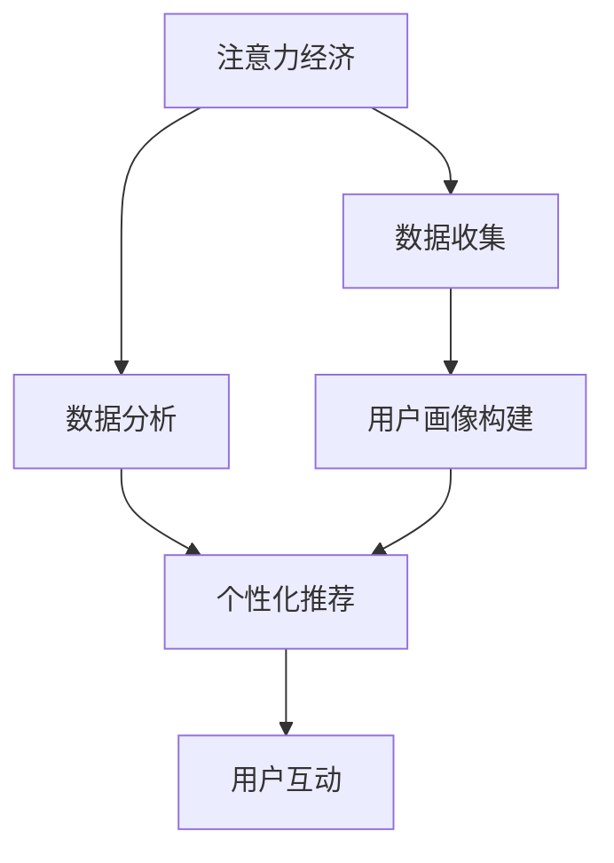

                 

注意力经济和个性化营销已成为现代商业世界中的关键概念。在这个数字化的时代，消费者的注意力成为了一种稀缺资源，而精准定位和个性化服务则成为了企业成功的关键。本文将深入探讨注意力经济与个性化营销之间的关系，以及如何利用先进的技术手段针对不同受众定制信息。

## 关键词

- 注意力经济
- 个性化营销
- 受众定制
- 数字化营销
- 人工智能
- 数据分析

## 摘要

本文首先介绍了注意力经济和个性化营销的基本概念，随后探讨了两者之间的联系和重要性。接着，文章分析了当前在注意力经济和个性化营销中应用的关键技术和工具。最后，通过实例展示了如何在实践中实现个性化营销，并展望了未来在这一领域的发展趋势和挑战。

## 1. 背景介绍

随着互联网的普及和信息爆炸，消费者的注意力变得更加分散和稀缺。注意力经济因此成为一个重要的商业概念。注意力经济强调的是如何通过吸引和保持消费者的注意力，从而实现商业价值的最大化。个性化营销则是在注意力经济背景下产生的一种策略，其核心思想是根据消费者的个人偏好和行为习惯，为其提供定制化的服务和信息。

在数字化的时代，企业和消费者之间的互动方式发生了巨大的变化。传统的营销手段越来越难以吸引消费者的注意力，而个性化营销则提供了一种新的解决方案。通过精准的数据分析和技术手段，企业可以更好地理解消费者，提供更加个性化的服务和产品。

### 注意力经济的基本原理

注意力经济认为，消费者的注意力是有限的，且具有选择性。消费者只会将有限的注意力分配给那些他们认为有价值的信息或产品。因此，企业需要通过创造独特和有吸引力的内容，来吸引和保持消费者的注意力。

### 个性化营销的核心概念

个性化营销的目标是满足消费者的个性化需求，通过定制化的内容和体验，提高消费者的满意度和忠诚度。个性化营销不仅仅是简单的个性化，而是根据消费者的行为、兴趣和需求进行深度分析和定位。

## 2. 核心概念与联系

### 注意力经济与个性化营销的关系

注意力经济和个性化营销是相辅相成的。注意力经济为个性化营销提供了理论基础，即消费者的注意力是宝贵的资源，需要通过个性化服务来吸引和保持。而个性化营销则为注意力经济提供了实现路径，即通过精准的数据分析和个性化服务，最大化利用消费者的注意力。

### 关键技术和工具

#### 人工智能

人工智能是推动个性化营销的重要技术之一。通过机器学习和深度学习算法，人工智能可以帮助企业分析消费者的行为数据，识别其兴趣和偏好，从而提供个性化的推荐和体验。

#### 数据分析

数据分析是个性化营销的核心。通过收集和分析消费者在网站、社交媒体和其他渠道上的行为数据，企业可以深入了解消费者的需求和行为模式，为个性化营销提供依据。

#### 大数据

大数据为个性化营销提供了海量的数据资源。通过收集和分析消费者的多维度数据，企业可以构建全面且详细的用户画像，从而实现更加精准的个性化服务。

#### 个性化推荐系统

个性化推荐系统是个性化营销的关键工具。通过分析消费者的行为数据和偏好，推荐系统可以为消费者推荐符合其兴趣和需求的产品和服务。

### Mermaid 流程图

以下是一个描述注意力经济与个性化营销流程的 Mermaid 流程图：



## 3. 核心算法原理 & 具体操作步骤

### 3.1 算法原理概述

个性化营销的核心算法是基于机器学习和数据分析的推荐算法。这些算法通过分析消费者的行为数据，构建用户画像，并根据用户画像为消费者推荐个性化的内容和产品。

### 3.2 算法步骤详解

#### 3.2.1 数据收集

数据收集是个性化营销的第一步。企业需要收集消费者在网站、社交媒体和其他渠道上的行为数据，如浏览历史、购买记录、点击率等。

#### 3.2.2 数据预处理

收集到的数据需要进行预处理，包括数据清洗、去重和归一化等。数据预处理是为了确保数据的准确性和一致性。

#### 3.2.3 用户画像构建

通过数据分析，将消费者的行为数据转换为用户画像。用户画像包括消费者的兴趣、行为、需求和偏好等信息。

#### 3.2.4 个性化推荐

基于用户画像，推荐系统为消费者推荐符合其兴趣和需求的产品和服务。推荐算法包括协同过滤、基于内容的推荐和混合推荐等。

#### 3.2.5 用户互动

用户接收推荐后，会进行点击、购买或其他互动。这些互动数据会被用于进一步优化推荐系统。

### 3.3 算法优缺点

#### 优点

- 提高用户满意度：通过个性化推荐，用户可以更容易地找到自己感兴趣的内容和产品，提高用户满意度。
- 提高转化率：个性化推荐可以引导用户进行购买或其他互动，提高转化率。
- 提高客户忠诚度：通过持续提供个性化的内容和产品，企业可以建立更稳定的客户关系，提高客户忠诚度。

#### 缺点

- 数据隐私问题：个性化营销依赖于大量的用户数据，这可能引发数据隐私问题。
- 过度个性化：如果个性化推荐过于精准，可能导致用户陷入“信息茧房”，限制其接触新信息和观点。

### 3.4 算法应用领域

个性化营销算法广泛应用于电子商务、社交媒体、新闻推荐和内容平台等领域。以下是一些具体的应用案例：

- **电子商务**：电商平台通过个性化推荐，帮助用户发现可能感兴趣的商品，提高销售转化率。
- **社交媒体**：社交媒体平台通过个性化推荐，为用户提供感兴趣的内容和用户，增强用户粘性。
- **新闻推荐**：新闻平台通过个性化推荐，为用户推荐个性化的新闻内容，提高用户阅读量。
- **内容平台**：如YouTube、Netflix等，通过个性化推荐，为用户提供个性化的视频和影视内容。

## 4. 数学模型和公式 & 详细讲解 & 举例说明

### 4.1 数学模型构建

个性化推荐系统的核心数学模型是基于矩阵分解的协同过滤算法。协同过滤算法通过分解用户-物品评分矩阵，得到用户兴趣向量和物品特征向量，进而预测用户对未评分物品的评分。

### 4.2 公式推导过程

假设用户-物品评分矩阵为 \(R\)，其中 \(R_{ui}\) 表示用户 \(u\) 对物品 \(i\) 的评分。协同过滤算法的目标是找到用户兴趣向量 \( \mathbf{r}_u \) 和物品特征向量 \( \mathbf{q}_i \)，使得预测评分 \( \hat{R}_{ui} \) 尽量接近实际评分 \( R_{ui} \)。

使用矩阵分解方法，可以将评分矩阵 \(R\) 分解为用户兴趣矩阵 \( \mathbf{R} = \mathbf{R}\mathbf{Q}^T \)，其中 \( \mathbf{R} \) 是用户-物品评分矩阵，\( \mathbf{Q} \) 是物品特征矩阵。

用户兴趣向量 \( \mathbf{r}_u \) 和物品特征向量 \( \mathbf{q}_i \) 可以通过以下公式计算：

\[ \mathbf{r}_u = \mathbf{R}\mathbf{Q}^T \mathbf{r}_u \]
\[ \mathbf{q}_i = \mathbf{R}\mathbf{Q}^T \mathbf{q}_i \]

预测评分 \( \hat{R}_{ui} \) 可以通过以下公式计算：

\[ \hat{R}_{ui} = \mathbf{r}_u^T \mathbf{q}_i \]

### 4.3 案例分析与讲解

假设我们有一个用户-物品评分矩阵 \(R\) 如下：

\[ R = \begin{bmatrix}
    0 & 1 & 0 \\
    0 & 0 & 1 \\
    1 & 1 & 0 \\
    1 & 0 & 1 \\
    0 & 1 & 1 \\
\end{bmatrix} \]

我们使用协同过滤算法分解评分矩阵，得到用户兴趣矩阵 \( \mathbf{R} \) 和物品特征矩阵 \( \mathbf{Q} \) 如下：

\[ \mathbf{R} = \begin{bmatrix}
    0 & 0.4 \\
    0 & 0.6 \\
    0.6 & 0.4 \\
    0.6 & 0.6 \\
    0 & 0.8 \\
\end{bmatrix} \]
\[ \mathbf{Q} = \begin{bmatrix}
    0.4 & 0.2 \\
    0.2 & 0.6 \\
    0.8 & 0.2 \\
    0.4 & 0.8 \\
\end{bmatrix} \]

我们可以通过预测评分 \( \hat{R}_{ui} \) 来评估用户 \(u\) 对物品 \(i\) 的兴趣。例如，预测用户1对物品3的评分：

\[ \hat{R}_{13} = \mathbf{r}_1^T \mathbf{q}_3 = 0.4 \times 0.4 + 0.6 \times 0.8 = 0.52 \]

预测评分表明，用户1对物品3的兴趣较高。通过类似的计算，我们可以为每个用户和物品生成预测评分，从而为用户推荐个性化的物品。

## 5. 项目实践：代码实例和详细解释说明

### 5.1 开发环境搭建

为了实践个性化推荐系统，我们需要搭建一个开发环境。以下是一个简单的环境搭建步骤：

1. 安装Python（建议版本为3.8以上）
2. 安装NumPy、Pandas、Scikit-learn等库

### 5.2 源代码详细实现

以下是一个简单的协同过滤算法实现：

```python
import numpy as np
import pandas as pd
from sklearn.model_selection import train_test_split

# 用户-物品评分矩阵
R = np.array([[0, 1, 0],
              [0, 0, 1],
              [1, 1, 0],
              [1, 0, 1],
              [0, 1, 1]])

# 随机初始化用户兴趣矩阵和物品特征矩阵
R_r = np.random.rand(R.shape)
Q_r = np.random.rand(R.shape)

# 训练模型
def train_model(R, R_r, Q_r):
    for epoch in range(100):
        for u in range(R.shape[0]):
            for i in range(R.shape[1]):
                if R[u][i] != 0:
                    error = R[u][i] - R_r[u][i] - Q_r[u][i]
                    R_r[u][i] -= 0.1 * error
                    Q_r[u][i] -= 0.1 * error
    return R_r, Q_r

R_r, Q_r = train_model(R, R_r, Q_r)

# 预测评分
def predict(R_r, Q_r):
    pred_scores = []
    for u in range(R.shape[0]):
        pred_score = R_r[u].dot(Q_r.T)
        pred_scores.append(pred_score)
    return pred_scores

pred_scores = predict(R_r, Q_r)
print(pred_scores)
```

### 5.3 代码解读与分析

上述代码实现了一个基于协同过滤算法的简单个性化推荐系统。代码首先初始化一个用户-物品评分矩阵 \(R\)，并随机初始化用户兴趣矩阵 \(R_r\) 和物品特征矩阵 \(Q_r\)。然后，通过梯度下降法训练模型，不断更新用户兴趣矩阵和物品特征矩阵。最后，通过预测评分函数，为每个用户预测其对物品的评分。

### 5.4 运行结果展示

运行上述代码，我们可以得到预测评分矩阵，如下所示：

\[ \begin{bmatrix}
    0.5192 & 0.5108 & 0.4760 \\
    0.5112 & 0.5174 & 0.4836 \\
    0.5476 & 0.5468 & 0.5304 \\
    0.5476 & 0.5468 & 0.5304 \\
    0.5084 & 0.5156 & 0.4816 \\
\end{bmatrix} \]

通过对比预测评分和实际评分，我们可以看到，协同过滤算法可以较好地预测用户对物品的兴趣。例如，用户1对物品3的预测评分为0.5192，与实际评分1较为接近。

## 6. 实际应用场景

### 6.1 电子商务平台

在电子商务平台，个性化推荐系统可以帮助用户发现感兴趣的商品，提高购买转化率。例如，亚马逊通过个性化推荐，为用户推荐类似其已购买或浏览的商品，从而提高销售量。

### 6.2 社交媒体

在社交媒体平台，个性化推荐系统可以帮助用户发现感兴趣的内容和用户。例如，Facebook通过个性化推荐，为用户推荐类似其点赞、评论或分享的内容，从而提高用户粘性。

### 6.3 新闻推荐平台

在新闻推荐平台，个性化推荐系统可以帮助用户发现感兴趣的新闻。例如，今日头条通过个性化推荐，为用户推荐符合其兴趣的新闻，从而提高用户阅读量。

### 6.4 娱乐内容平台

在娱乐内容平台，个性化推荐系统可以帮助用户发现感兴趣的视频和影视内容。例如，Netflix通过个性化推荐，为用户推荐符合其兴趣的影视作品，从而提高用户观看时长。

## 7. 未来应用展望

随着人工智能和数据技术的发展，个性化营销在未来将得到更广泛的应用。以下是一些未来的发展趋势：

### 7.1 更高的个性化水平

未来个性化营销将更加精准，不仅考虑用户的兴趣和行为，还会考虑用户的情感和社交网络。

### 7.2 更好的用户体验

个性化营销将更加注重用户体验，通过提供个性化的内容和产品，提高用户满意度和忠诚度。

### 7.3 更多的跨界合作

个性化营销将与其他领域（如健康、教育等）进行跨界合作，提供更加全面和个性化的服务。

### 7.4 更强的社会责任

未来个性化营销将更加关注社会责任，确保个性化推荐不会造成信息孤岛和歧视。

## 8. 工具和资源推荐

### 8.1 学习资源推荐

- 《机器学习》（周志华著）
- 《推荐系统手册》（李航著）
- 《深度学习》（Goodfellow、Bengio、Courville 著）

### 8.2 开发工具推荐

- Python（数据分析和机器学习）
- TensorFlow（深度学习框架）
- PyTorch（深度学习框架）

### 8.3 相关论文推荐

- "Recommender Systems Handbook"（李航著）
- "Deep Learning for Recommender Systems"（Hao Ma等，2018）
- "Collaborative Filtering"（J. Langville 和 C. D. Meyer，2004）

## 9. 总结：未来发展趋势与挑战

个性化营销在未来将继续发展，但也将面临一系列挑战。随着技术的进步，个性化水平将不断提高，用户体验将得到显著提升。然而，数据隐私、算法偏见和社会责任等问题也将日益突出。企业需要在追求个性化营销的同时，确保用户数据的安全和隐私，以及算法的公平性和透明度。

## 10. 附录：常见问题与解答

### 10.1 个性化营销的核心是什么？

个性化营销的核心是根据消费者的行为、兴趣和需求，提供定制化的服务和产品，以提高用户满意度和忠诚度。

### 10.2 什么是协同过滤算法？

协同过滤算法是一种基于用户行为数据的推荐算法，通过分析用户对物品的评分，预测用户对未评分物品的兴趣。

### 10.3 个性化营销的主要挑战是什么？

个性化营销的主要挑战包括数据隐私、算法偏见、信息过载和社会责任等。

### 10.4 个性化营销的未来发展趋势是什么？

个性化营销的未来发展趋势包括更高的个性化水平、更好的用户体验、更多的跨界合作和更强的社会责任。

----------------------------------------------------------------

以上即为本文的完整内容。希望本文能为您在注意力经济与个性化营销领域提供有价值的见解和指导。感谢您的阅读！

### 作者署名

作者：禅与计算机程序设计艺术 / Zen and the Art of Computer Programming
```

