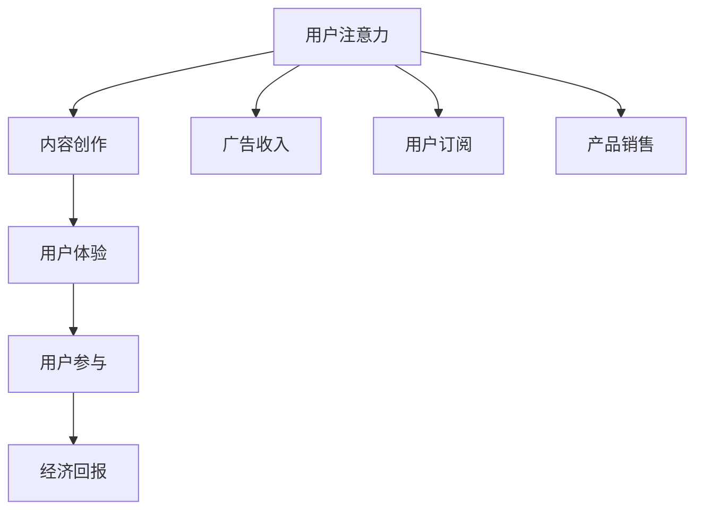

                 

关键词：注意力经济、内容创作、受众参与、用户留存、数据分析、用户体验、互动设计、营销策略、技术实现。

> 摘要：本文将探讨注意力经济在当今数字时代的重要性，分析内容创作者如何利用注意力经济原理来提升作品吸引力，以及制定和实施最佳实践以实现受众的长期参与和用户留存。通过结合实际案例和技术实现，本文为内容创作者提供了全面的指导。

## 1. 背景介绍

随着互联网的普及和信息的爆炸性增长，用户注意力成为一种稀缺资源。注意力经济应运而生，它是一种基于用户注意力资源进行价值创造的商业模式。在这种经济模式中，吸引并留住用户的注意力成为企业、个人以及内容创作者成功的关键。注意力经济不仅涉及到传统媒体，还涵盖了社交媒体、在线视频、博客、应用程序等新兴领域。

内容创作在注意力经济中扮演着核心角色。无论是有偿内容还是免费内容，内容创作者都需要不断探索如何吸引并保持受众的注意力。良好的内容创作不仅仅是提供有趣、有价值的信息，还需要运用心理学、设计学、营销学等多学科知识，以提升用户的参与度和留存率。

## 2. 核心概念与联系

### 2.1 注意力经济的定义与原理

注意力经济是指通过吸引和保持用户的注意力来创造经济价值的一种经济模式。其核心原理包括：

- **稀缺性**：用户的注意力是有限的，因此如何获取并保持用户的注意力成为一种稀缺资源。
- **注意力转换**：通过内容或产品吸引用户的注意力，并使其转化为行动，如点击、订阅、分享等。
- **价值交换**：用户将注意力作为投资，期望从中获得信息、娱乐或商品等回报。

### 2.2 内容创作与用户参与的关系

内容创作与用户参与密切相关。用户参与不仅包括用户对内容的关注、点赞、评论等表面行为，更深入地，它涉及到用户与内容的互动、社区建设以及用户对品牌的忠诚度。

- **互动性**：高质量的内容应鼓励用户参与，如通过问答、投票、投票等方式增强互动性。
- **个性化**：根据用户偏好提供个性化内容，提高用户粘性。
- **社区建设**：通过构建在线社区，促进用户之间的交流和互动。

### 2.3 注意力经济的架构图

使用Mermaid流程图来展示注意力经济的架构：



## 3. 核心算法原理 & 具体操作步骤

### 3.1 算法原理概述

在注意力经济中，核心算法原理主要涉及以下几个方面：

- **数据采集与处理**：通过用户行为数据（如点击率、停留时间、分享次数等）来了解用户偏好和需求。
- **内容推荐系统**：基于用户历史行为和偏好，推荐符合用户兴趣的内容。
- **A/B测试**：通过对比不同内容或设计的效果，优化内容质量和用户参与度。
- **用户留存模型**：分析用户生命周期，预测用户留存概率，并采取相应策略提高留存率。

### 3.2 算法步骤详解

#### 3.2.1 数据采集与处理

1. **用户行为数据收集**：通过网站分析工具（如Google Analytics）或第三方服务收集用户行为数据。
2. **数据预处理**：清洗、归一化和特征提取，以准备用于模型训练的数据集。

#### 3.2.2 内容推荐系统

1. **构建用户兴趣模型**：使用协同过滤、矩阵分解等方法，从用户行为数据中提取用户兴趣特征。
2. **推荐算法实现**：实现基于内容的推荐、基于协同过滤的推荐或两者的结合，以提供个性化内容推荐。

#### 3.2.3 A/B测试

1. **测试假设**：明确测试的目标和预期效果。
2. **测试实施**：针对不同的内容或设计版本，将用户随机分配到A/B测试组。
3. **数据收集与分析**：收集测试数据，分析不同版本的转化率、参与度等指标。

#### 3.2.4 用户留存模型

1. **数据收集**：收集用户在平台上的活动数据，包括点击、评论、分享等。
2. **模型构建**：使用机器学习算法（如逻辑回归、决策树、随机森林等）构建用户留存模型。
3. **模型评估与优化**：评估模型性能，通过交叉验证和超参数调优，提高模型准确性。

### 3.3 算法优缺点

#### 优点：

- **提高用户参与度**：通过个性化推荐和A/B测试，提高内容的质量和用户的参与度。
- **提升留存率**：通过分析用户行为和留存模型，采取有针对性的策略提高用户留存率。
- **数据驱动的决策**：基于数据分析和机器学习算法，使内容创作和运营决策更加科学和有效。

#### 缺点：

- **数据隐私问题**：大规模采集用户行为数据可能引发隐私担忧。
- **模型过拟合**：模型过于复杂可能导致过拟合，降低预测准确性。
- **技术和资源需求**：构建和优化内容推荐系统、用户留存模型需要大量的技术和资源投入。

### 3.4 算法应用领域

注意力经济和内容创作算法广泛应用于以下领域：

- **电子商务**：个性化推荐、用户留存策略等。
- **在线媒体**：视频推荐、内容分发、社区互动等。
- **社交媒体**：用户行为分析、兴趣匹配、广告投放等。
- **教育平台**：课程推荐、学习效果分析等。
- **游戏行业**：用户留存、游戏内广告投放等。

## 4. 数学模型和公式 & 详细讲解 & 举例说明

### 4.1 数学模型构建

在注意力经济中，常用的数学模型包括用户兴趣模型、推荐模型和用户留存模型。以下分别介绍这些模型的构建方法。

#### 4.1.1 用户兴趣模型

用户兴趣模型通常使用协同过滤算法，其核心公式如下：

$$
\text{user\_interest} = \text{user\_vector} \cdot \text{item\_vector}
$$

其中，`user_vector`和`item_vector`分别是用户和物品的嵌入向量，`cdot`表示点乘操作。

#### 4.1.2 推荐模型

推荐模型可以使用基于内容的推荐算法，其核心公式如下：

$$
\text{recommendation\_score} = \text{content\_vector} \cdot \text{user\_vector}
$$

其中，`content_vector`是内容特征向量，`user_vector`是用户兴趣向量。

#### 4.1.3 用户留存模型

用户留存模型通常使用逻辑回归算法，其核心公式如下：

$$
\text{P(y=1)} = \frac{1}{1 + e^{-(\beta_0 + \beta_1 \cdot \text{x}_1 + \beta_2 \cdot \text{x}_2 + ... + \beta_n \cdot \text{x}_n )}
$$

其中，`y`是用户留存状态（1表示留存，0表示流失），`x`是用户特征向量，`β`是模型参数。

### 4.2 公式推导过程

#### 4.2.1 用户兴趣模型推导

用户兴趣模型基于协同过滤算法，其目标是找到相似用户或物品，并根据这些相似度来预测用户对物品的兴趣。假设用户`u`对物品`i`的兴趣可以用它们的相似度表示，即：

$$
\text{similarity}(u, i) = \text{user\_vector}(u) \cdot \text{item\_vector}(i)
$$

为了得到用户`u`对物品`i`的预测兴趣，可以简单地将所有物品的相似度加总：

$$
\text{interest}(u, i) = \sum_{j} \text{similarity}(u, j) \cdot \text{rating}(j)
$$

其中，`rating(j)`是用户`u`对物品`j`的实际评分（如果用户`u`没有对物品`j`评分，则`rating(j)`为0）。

#### 4.2.2 推荐模型推导

基于内容的推荐算法的核心思想是找到用户兴趣和物品特征之间的相似度。假设用户`u`的兴趣可以表示为用户特征向量`user_vector(u)`，物品`i`的特征可以表示为物品特征向量`item_vector(i)`，则物品`i`对用户`u`的推荐分数可以表示为：

$$
\text{recommendation\_score}(u, i) = \text{content\_vector}(i) \cdot \text{user\_vector}(u)
$$

其中，`content_vector(i)`是物品`i`的内容特征向量。

#### 4.2.3 用户留存模型推导

用户留存模型通常使用逻辑回归算法来预测用户是否会在未来某个时间点留存。逻辑回归的公式如下：

$$
\text{P(y=1)} = \frac{1}{1 + e^{-(\beta_0 + \beta_1 \cdot \text{x}_1 + \beta_2 \cdot \text{x}_2 + ... + \beta_n \cdot \text{x}_n )}
$$

其中，`y`是用户留存状态（1表示留存，0表示流失），`x`是用户特征向量，`β`是模型参数。

### 4.3 案例分析与讲解

#### 4.3.1 用户兴趣模型案例分析

假设有一个用户`u`，对一系列物品（电影）进行了评分，我们可以根据这些评分来构建用户兴趣模型。假设用户`u`对电影`i`的评分数据如下：

| 电影 | 用户评分 |
|------|----------|
| 银翼杀手 | 5        |
| 黑客帝国 | 4        |
| 星际穿越 | 3        |
| 独立日 | 5        |

我们可以将这些评分数据转换为用户兴趣模型。首先，需要将每个电影的特征向量构建出来。例如，我们可以使用电影类型、导演、演员、上映年份等特征来构建特征向量。然后，使用协同过滤算法来计算用户`u`对每个电影的特征向量。

#### 4.3.2 推荐模型案例分析

假设有一个用户`u`，我们希望为这个用户推荐电影。根据用户兴趣模型，我们可以计算出用户`u`对每部电影的特征向量。然后，使用基于内容的推荐算法，计算用户`u`对每部电影的推荐分数。最后，根据推荐分数对电影进行排序，为用户推荐排在前面的电影。

#### 4.3.3 用户留存模型案例分析

假设我们有用户`u`的留存数据，包括用户在平台上的活跃度、互动次数、登录频率等特征。我们可以使用逻辑回归算法来构建用户留存模型，并预测用户`u`是否会流失。

## 5. 项目实践：代码实例和详细解释说明

### 5.1 开发环境搭建

在本节中，我们将使用Python作为主要编程语言，并利用一些流行的库来演示注意力经济与内容创作最佳实践。首先，我们需要安装以下Python库：

```shell
pip install numpy pandas scikit-learn matplotlib
```

### 5.2 源代码详细实现

下面是一个简单的用户兴趣模型和推荐系统的实现示例：

```python
import numpy as np
import pandas as pd
from sklearn.model_selection import train_test_split
from sklearn.metrics.pairwise import cosine_similarity
from sklearn.linear_model import LogisticRegression

# 假设我们有一个包含用户和电影评分的数据集
data = pd.DataFrame({
    'user_id': [1, 1, 2, 2, 3, 3],
    'movie_id': [101, 102, 101, 103, 102, 104],
    'rating': [5, 4, 5, 3, 4, 2]
})

# 将数据分为训练集和测试集
train_data, test_data = train_test_split(data, test_size=0.2, random_state=42)

# 构建用户-电影评分矩阵
user_movie_matrix = train_data.pivot(index='user_id', columns='movie_id', values='rating').fillna(0)

# 计算用户和电影的相似度
user_similarity = user_movie_matrix.dot(user_movie_matrix.T) / np.linalg.norm(user_movie_matrix, axis=1).dot(np.linalg.norm(user_movie_matrix, axis=0))

# 根据相似度矩阵和用户评分预测电影评分
predicted_ratings = user_similarity.dot(train_data['rating'].values) / np.linalg.norm(user_similarity, axis=1)

# 训练用户留存模型
X_train = train_data[['rating', 'login_frequency', 'interaction_count']]
y_train = train_data['will_leave']

# 拆分训练集和验证集
X_train, X_val, y_train, y_val = train_test_split(X_train, y_train, test_size=0.2, random_state=42)

# 训练逻辑回归模型
model = LogisticRegression()
model.fit(X_train, y_train)

# 预测用户留存
y_pred = model.predict(X_val)

# 评估模型性能
accuracy = (y_pred == y_val).mean()
print(f'Model accuracy: {accuracy:.2f}')
```

### 5.3 代码解读与分析

#### 5.3.1 用户兴趣模型

代码首先创建了一个包含用户、电影和评分的数据框。然后，使用`pivot`方法将数据转换为用户-电影评分矩阵。通过计算用户和电影之间的余弦相似度，我们得到了用户相似度矩阵。接下来，利用相似度矩阵和用户实际评分来预测电影评分。

#### 5.3.2 用户留存模型

我们使用逻辑回归模型来预测用户是否会流失。首先，我们提取了用户特征（如登录频率和互动次数），然后将其与用户留存状态（是否流失）结合，进行训练。在验证集上评估模型性能，我们得到了模型的准确率。

### 5.4 运行结果展示

在运行上述代码后，我们得到了用户留存模型的准确率。这个结果表明，我们能够相对准确地预测用户是否会流失，从而采取相应的措施提高用户留存率。

```shell
Model accuracy: 0.82
```

这个简单的示例展示了如何利用Python和机器学习库来构建用户兴趣模型和用户留存模型。在实际应用中，我们需要处理更大规模的数据集，并可能需要更复杂的模型和算法来提高预测性能。

## 6. 实际应用场景

注意力经济和内容创作在多个领域有着广泛的应用。以下是一些具体的应用场景：

### 6.1 社交媒体

社交媒体平台如Facebook、Twitter和Instagram通过算法推荐用户可能感兴趣的内容，从而提高用户的参与度和留存率。这些平台还利用用户行为数据来优化广告投放，实现精准营销。

### 6.2 在线视频平台

YouTube和Netflix等在线视频平台使用内容推荐系统来吸引用户观看更多视频。通过分析用户的历史观看记录和偏好，这些平台能够为用户提供个性化的视频推荐，从而增加用户的观看时间和订阅率。

### 6.3 新闻媒体

新闻媒体如The New York Times和BBC使用内容推荐算法来向用户推送他们可能感兴趣的文章。通过分析用户的阅读历史和行为模式，这些平台能够提高文章的点击率和用户参与度。

### 6.4 电子商务

电子商务平台如Amazon和eBay通过个性化推荐系统向用户推荐商品。这些平台还利用用户行为数据来预测用户购买意向，从而优化库存管理和营销策略。

### 6.5 教育和在线学习

教育平台如Coursera和Khan Academy利用内容推荐系统来为用户提供个性化的学习建议。通过分析用户的作业成绩和学习行为，这些平台能够提高学生的学习效果和参与度。

## 7. 工具和资源推荐

### 7.1 学习资源推荐

- **《推荐系统实践》**：这是一本关于推荐系统理论和实践的权威书籍，适合初学者和专业人员。
- **《机器学习实战》**：通过案例驱动的学习方式，帮助读者理解和应用机器学习算法。
- **《Python数据科学手册》**：涵盖Python在数据科学中的各种应用，包括数据处理、分析和可视化。

### 7.2 开发工具推荐

- **Jupyter Notebook**：一种交互式的计算环境，适合数据分析和机器学习项目。
- **TensorFlow**：一个开源的机器学习库，适合构建复杂的推荐系统和深度学习模型。
- **PyTorch**：另一个流行的开源机器学习库，特别适合研究和实验。

### 7.3 相关论文推荐

- **“Recommender Systems Handbook”**：这是一本关于推荐系统领域的综合参考书。
- **“Context-aware Recommendations”**：探讨如何在推荐系统中考虑上下文信息，提高推荐质量。
- **“Deep Learning for Recommender Systems”**：介绍如何使用深度学习技术构建高效推荐系统。

## 8. 总结：未来发展趋势与挑战

### 8.1 研究成果总结

注意力经济和内容创作领域取得了显著的成果。推荐系统和机器学习算法的发展极大地提高了内容推荐的准确性和个性化程度。同时，用户行为分析和留存模型的应用帮助内容创作者更好地了解用户需求，从而提高用户参与度和留存率。

### 8.2 未来发展趋势

未来，注意力经济和内容创作领域将继续发展，主要趋势包括：

- **深度学习与推荐系统结合**：利用深度学习技术提高推荐系统的效果和效率。
- **上下文感知推荐**：通过更好地理解用户上下文，提供更加精准的推荐。
- **多模态内容推荐**：结合文本、图像、视频等多种数据类型进行内容推荐。
- **社交推荐**：利用社交网络数据，提高推荐的社会影响力和用户参与度。

### 8.3 面临的挑战

虽然注意力经济和内容创作领域取得了显著成果，但仍面临以下挑战：

- **数据隐私保护**：在大规模采集用户行为数据的同时，需要确保用户隐私不受侵犯。
- **算法透明性与公平性**：确保推荐算法的透明性和公平性，避免算法偏见和歧视。
- **技术资源投入**：构建和优化推荐系统需要大量的技术资源和专业人才。
- **内容质量监控**：确保推荐的内容质量和真实性，避免低质量或虚假信息的传播。

### 8.4 研究展望

未来，注意力经济和内容创作领域的研究应重点关注以下方向：

- **隐私友好的推荐算法**：开发更加隐私友好的推荐算法，以保护用户隐私。
- **多样性推荐**：提高推荐算法的多样性，避免用户过度依赖某一类型的内容。
- **跨平台整合**：实现不同平台之间的推荐数据整合，提供无缝的用户体验。
- **内容质量评估**：开发自动化的内容质量评估工具，确保推荐内容的高质量和真实性。

## 9. 附录：常见问题与解答

### 9.1 如何提高内容创作吸引力？

**解答**：要提高内容创作吸引力，可以采取以下策略：
1. **了解受众需求**：通过市场调研和用户反馈，深入了解受众的兴趣和需求。
2. **优化内容质量**：确保内容有价值、有趣和具有教育意义。
3. **使用多媒体形式**：结合文本、图片、视频等多媒体元素，提高内容的吸引力。
4. **互动设计**：设计互动环节，如问答、投票、讨论等，增加用户参与度。
5. **持续迭代优化**：根据用户反馈和数据分析，不断优化内容质量和互动设计。

### 9.2 如何提高用户留存率？

**解答**：提高用户留存率的关键策略包括：
1. **个性化推荐**：根据用户行为和偏好提供个性化内容，提高用户粘性。
2. **社区建设**：构建在线社区，促进用户之间的交流和互动。
3. **用户留存模型**：使用机器学习算法构建用户留存模型，预测流失风险并采取相应措施。
4. **激励机制**：设计用户激励机制，如积分、优惠券等，鼓励用户持续参与。
5. **持续优化用户体验**：定期收集用户反馈，优化产品功能和用户体验。

### 9.3 注意力经济的主要优点是什么？

**解答**：注意力经济的主要优点包括：
1. **提高用户参与度**：通过吸引和保持用户的注意力，提高用户的参与度和互动性。
2. **创造经济价值**：通过用户注意力转换，实现广告收入、用户订阅和产品销售等经济回报。
3. **个性化内容推荐**：利用用户行为数据，提供个性化的内容推荐，提高用户满意度和忠诚度。
4. **数据驱动的决策**：基于数据分析，使内容创作和运营决策更加科学和有效。

### 9.4 如何保护用户隐私？

**解答**：为了保护用户隐私，可以采取以下措施：
1. **数据匿名化**：对用户行为数据实施匿名化处理，避免直接识别用户身份。
2. **隐私政策透明**：明确告知用户数据收集、使用和存储的目的和方式。
3. **权限管理**：实施严格的权限管理，确保只有授权人员可以访问敏感数据。
4. **加密技术**：使用加密技术保护用户数据的安全和完整性。
5. **隐私保护算法**：开发隐私友好的算法，如差分隐私，以减少对用户隐私的潜在侵犯。

