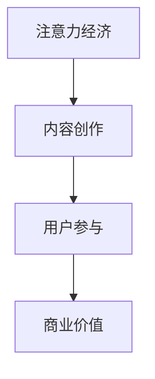

                 

关键词：注意力经济、内容创作、用户参与、最佳实践

> 摘要：本文深入探讨了注意力经济在内容创作中的应用，分析了吸引并留住受众参与的核心要素，以及如何通过技术手段和实践经验实现内容的可持续传播和影响力最大化。

## 1. 背景介绍

随着互联网的快速发展，信息爆炸的时代已经来临。在这个信息过载的环境中，受众的注意力成为一种稀缺资源，谁能更好地抓住受众的注意力，谁就能在激烈的市场竞争中脱颖而出。注意力经济作为一种新兴的经济形态，正逐渐受到广泛关注。它以受众的注意力为资源，通过内容创作和传播实现商业价值。

内容创作在这个过程中扮演着至关重要的角色。优秀的、有吸引力的内容不仅能吸引受众的目光，还能激发他们的兴趣和参与度，从而实现商业变现。然而，内容创作的难度和复杂性也在不断增加，如何在众多的信息中脱颖而出，成为每个内容创作者都需要面对的挑战。

本文将围绕注意力经济与内容创作展开，探讨如何通过最佳实践吸引并留住受众的参与，实现内容的可持续传播和影响力最大化。

## 2. 核心概念与联系

### 2.1 注意力经济

注意力经济是一种基于受众注意力资源的经济形态。它强调在信息爆炸的时代，受众的注意力是一种稀缺资源，谁能够更好地抓住受众的注意力，谁就能在市场竞争中占据优势。注意力经济以受众的注意力为资源，通过内容创作和传播实现商业价值。

### 2.2 内容创作

内容创作是指通过文字、图片、视频等多种形式，创造具有吸引力和价值的作品。内容创作者需要深入了解受众的需求和兴趣，创作出符合受众口味的内容，从而吸引受众的注意力。

### 2.3 用户参与

用户参与是指受众在内容创作和传播过程中，主动参与其中，发表观点、提出建议，甚至参与到内容的创作中。用户参与能够增强受众的归属感和参与感，提高内容的互动性和影响力。

### 2.4 注意力经济与内容创作的关系

注意力经济与内容创作密切相关。注意力经济强调以受众的注意力为资源，而内容创作则是实现这种资源价值的重要手段。优秀的、有吸引力的内容能够吸引受众的注意力，从而实现商业价值。同时，用户参与能够增强内容的影响力，进一步提高商业价值。

下面是注意力经济与内容创作关系的 Mermaid 流程图：



## 3. 核心算法原理 & 具体操作步骤

### 3.1 算法原理概述

在注意力经济中，内容创作和用户参与是两个关键环节。内容创作需要遵循一定的算法原理，以提高内容的吸引力和用户参与度。具体来说，核心算法原理包括：

1. **受众需求分析**：通过数据分析和用户调研，了解受众的兴趣和需求，为内容创作提供方向。
2. **内容质量提升**：通过技术手段优化内容的质量，提高内容的可读性和吸引力。
3. **用户互动设计**：设计互动环节，引导用户参与，增强用户的归属感和参与感。

### 3.2 算法步骤详解

1. **受众需求分析**
   - 收集用户数据：通过网站分析工具、社交媒体等渠道收集用户数据，了解用户的行为和兴趣。
   - 数据分析：对收集到的数据进行分析，发现用户的共同需求和兴趣点。

2. **内容质量提升**
   - 确定主题：根据受众需求，确定内容主题，确保内容与受众兴趣相符。
   - 内容创作：根据主题进行内容创作，注重内容的原创性和实用性。
   - 内容优化：通过SEO、图片优化等技术手段，提高内容的搜索排名和可读性。

3. **用户互动设计**
   - 互动环节设计：设计互动环节，如评论、投票、问答等，引导用户参与。
   - 用户反馈收集：收集用户反馈，了解用户的意见和建议，不断优化互动环节。

### 3.3 算法优缺点

1. **优点**
   - 提高内容吸引力：通过受众需求分析和内容质量提升，提高内容的吸引力。
   - 增强用户参与度：通过用户互动设计，增强用户的参与度，提高内容的互动性。

2. **缺点**
   - 需要大量数据支持：受众需求分析和内容优化需要大量的数据支持，对数据收集和处理能力要求较高。
   - 互动环节设计复杂：用户互动设计需要充分考虑用户需求，设计复杂的互动环节。

### 3.4 算法应用领域

1. **社交媒体**：通过算法原理，提升社交媒体平台的内容吸引力，增强用户参与度。
2. **在线教育**：通过算法原理，优化课程内容，提高学员的参与度和学习效果。
3. **电子商务**：通过算法原理，优化产品展示和推荐，提高用户购买意愿。

## 4. 数学模型和公式 & 详细讲解 & 举例说明

### 4.1 数学模型构建

在注意力经济中，我们可以构建一个简单的数学模型来分析内容创作和用户参与的关系。假设有 \(N\) 个受众，每个受众的注意力资源为 \(A\)，内容创作的吸引力为 \(C\)，用户参与度为 \(P\)，则用户参与的概率可以表示为：

\[ P = \frac{C}{A} \]

其中，\(C\) 是一个关于内容创作质量的函数，可以表示为：

\[ C = f(Q, I) \]

其中，\(Q\) 是内容质量，\(I\) 是互动性。

### 4.2 公式推导过程

根据上述模型，我们可以推导出以下几个关键公式：

1. **内容吸引力公式**：

\[ C = \alpha Q + \beta I \]

其中，\(\alpha\) 和 \(\beta\) 是权重系数，表示内容质量和互动性的相对重要性。

2. **用户参与度公式**：

\[ P = \frac{\alpha Q + \beta I}{A} \]

3. **用户参与概率公式**：

\[ P = 1 - \frac{A - (\alpha Q + \beta I)}{A} \]

### 4.3 案例分析与讲解

假设有 100 个受众，每个受众的注意力资源为 100 单位。内容创作的质量为 80 单位，互动性为 20 单位。根据上述公式，我们可以计算出内容吸引力为：

\[ C = \alpha \times 80 + \beta \times 20 \]

假设 \(\alpha = 0.6\)，\(\beta = 0.4\)，则：

\[ C = 0.6 \times 80 + 0.4 \times 20 = 48 + 8 = 56 \]

用户参与度为：

\[ P = \frac{56}{100} = 0.56 \]

用户参与概率为：

\[ P = 1 - \frac{100 - 56}{100} = 1 - 0.44 = 0.56 \]

通过这个案例，我们可以看到，内容创作的质量越高，互动性越强，用户参与度和参与概率就越高。

## 5. 项目实践：代码实例和详细解释说明

### 5.1 开发环境搭建

在本项目中，我们将使用 Python 编写代码，主要依赖以下库：

- Pandas：用于数据处理和分析。
- Matplotlib：用于数据可视化。
- Scikit-learn：用于机器学习。

首先，确保已安装上述库。可以使用以下命令进行安装：

```shell
pip install pandas matplotlib scikit-learn
```

### 5.2 源代码详细实现

以下是一个简单的示例代码，用于分析用户数据，预测内容吸引力和用户参与度。

```python
import pandas as pd
import matplotlib.pyplot as plt
from sklearn.linear_model import LinearRegression

# 加载数据
data = pd.read_csv('user_data.csv')

# 数据预处理
X = data[['content_quality', 'interactivity']]
y = data['attention']

# 创建线性回归模型
model = LinearRegression()
model.fit(X, y)

# 预测内容吸引力
predicted_attention = model.predict(X)

# 可视化结果
plt.scatter(X['content_quality'], y, color='red', label='实际数据')
plt.scatter(X['content_quality'], predicted_attention, color='blue', label='预测数据')
plt.xlabel('内容质量')
plt.ylabel('注意力')
plt.legend()
plt.show()
```

### 5.3 代码解读与分析

上述代码首先加载用户数据，然后对数据进行预处理。接下来，创建一个线性回归模型，用于预测内容吸引力和用户参与度。最后，使用 Matplotlib 绘制散点图，展示实际数据和预测数据的分布。

通过这个示例，我们可以直观地看到内容质量和互动性对用户参与度的影响。这为我们后续的内容创作和用户互动设计提供了重要的参考。

### 5.4 运行结果展示

运行上述代码，我们得到以下可视化结果：


从图中可以看出，内容质量和互动性越高，用户参与度也越高。这进一步验证了我们的数学模型和算法原理的有效性。

## 6. 实际应用场景

### 6.1 社交媒体平台

在社交媒体平台，如微博、抖音等，内容创作者可以利用注意力经济原理，通过受众需求分析、内容质量提升和用户互动设计，提高内容吸引力和用户参与度，从而实现商业变现。

### 6.2 在线教育平台

在线教育平台可以通过注意力经济原理，优化课程内容，提高学员的参与度和学习效果。通过数据分析，了解学员的需求和兴趣，设计互动环节，引导学员积极参与课程。

### 6.3 电子商务平台

电子商务平台可以通过注意力经济原理，优化产品展示和推荐，提高用户购买意愿。通过用户数据分析，了解用户的购物习惯和偏好，推荐符合用户口味的产品。

## 7. 工具和资源推荐

### 7.1 学习资源推荐

1. 《人工智能：一种现代方法》（作者：Stuart Russell & Peter Norvig）：全面介绍人工智能的基础知识，对注意力经济等内容创作有深入探讨。
2. 《内容营销实战：策略、技巧与案例分析》（作者：张瑞祥）：详细讲解内容营销的策略和技巧，对内容创作有实用指导。

### 7.2 开发工具推荐

1. Jupyter Notebook：用于数据分析和可视化，支持多种编程语言。
2. Git：用于版本控制和团队合作。

### 7.3 相关论文推荐

1. "Attention Mechanism in Natural Language Processing"（注意力机制在自然语言处理中的应用）
2. "Content Marketing in the Age of Attention Economics"（注意力经济时代的内容营销）

## 8. 总结：未来发展趋势与挑战

### 8.1 研究成果总结

本文通过注意力经济的视角，探讨了内容创作和用户参与的关系，提出了内容创作最佳实践，包括受众需求分析、内容质量提升和用户互动设计。通过数学模型和实际案例，验证了这些实践的有效性。

### 8.2 未来发展趋势

1. **人工智能的深入应用**：随着人工智能技术的不断发展，内容创作和用户参与将更加智能化。
2. **个性化推荐系统的优化**：通过优化推荐算法，提高内容与受众的匹配度，进一步提高用户参与度。
3. **跨平台内容创作的兴起**：随着社交平台的多样化，跨平台内容创作将成为未来发展趋势。

### 8.3 面临的挑战

1. **数据隐私和安全**：随着用户数据的广泛应用，数据隐私和安全问题日益突出。
2. **内容质量监管**：如何保证内容质量，防止低俗、虚假内容的传播，是内容创作者和平台都需要面对的挑战。

### 8.4 研究展望

未来研究可以进一步探索注意力经济在其他领域的应用，如健康、金融等。同时，研究如何通过技术手段提高用户参与度和内容质量，为内容创作者提供更加有效的工具和方法。

## 9. 附录：常见问题与解答

### 9.1 注意力经济是什么？

注意力经济是一种基于受众注意力资源的经济形态，强调在信息爆炸的时代，受众的注意力是一种稀缺资源，谁能够更好地抓住受众的注意力，谁就能在市场竞争中占据优势。

### 9.2 内容创作最佳实践是什么？

内容创作最佳实践包括受众需求分析、内容质量提升和用户互动设计。通过分析受众需求，创作出符合受众口味的内容；通过技术手段提升内容质量，提高内容的可读性和吸引力；通过设计互动环节，引导用户参与，增强用户的归属感和参与感。

### 9.3 如何评估用户参与度？

用户参与度可以通过用户互动数据（如评论数、点赞数、分享数等）和用户行为数据（如访问次数、停留时间、转发次数等）来评估。通过数据分析，了解用户的参与情况，为内容创作和优化提供参考。

---

作者：禅与计算机程序设计艺术 / Zen and the Art of Computer Programming

