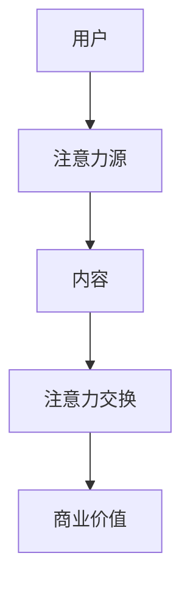

                 

关键词：注意力经济、内容创作、受众吸引力、留存策略、技术传播、影响力、用户体验、数据分析、算法优化、社交媒体。

> 摘要：本文旨在探讨注意力经济的本质及其在内容创作中的应用。通过分析注意力经济的核心概念、原理和模型，结合实际案例，作者提出了多种吸引并留住受众的策略，旨在为内容创作者提供实用的指导和建议。

## 1. 背景介绍

在数字化时代，信息过载已成为一种普遍现象。用户面对海量的信息资源，如何选择和关注成为了一项重要能力。与此同时，内容创作者在追求流量和影响力的过程中，面临着激烈的竞争和注意力资源的稀缺。这种背景下，注意力经济作为一种新的经济模式逐渐受到关注。

注意力经济，指的是通过吸引用户的注意力来创造价值的经济现象。它强调注意力作为一种稀缺资源，其价值高于时间和金钱。在注意力经济中，内容创作者的目标是如何有效地吸引和留住用户的注意力，从而实现商业价值和社会影响力的最大化。

本文将围绕注意力经济的核心概念，结合实际案例，探讨内容创作中的吸引和留存策略，以期为内容创作者提供有益的启示。

## 2. 核心概念与联系

### 2.1 注意力经济原理

注意力经济的核心是用户注意力。用户在选择关注内容时，会受到多种因素的影响，如内容的吸引力、质量、相关性等。注意力经济的模型通常包括以下几个组成部分：

1. **注意力源**：用户。
2. **注意力对象**：内容。
3. **注意力交换**：用户通过关注内容来交换注意力。

### 2.2 内容创作与注意力经济的关系

内容创作是注意力经济的基础。优质的内容能够吸引用户的注意力，从而实现商业价值。在这个过程中，内容创作者需要关注以下几个方面：

1. **用户体验**：优化用户体验，提高内容的可读性和易用性。
2. **内容质量**：确保内容的专业性、实用性和趣味性。
3. **相关性**：内容与用户需求的匹配程度。
4. **传播渠道**：选择合适的传播渠道，提高内容曝光率。

### 2.3 Mermaid 流程图



## 3. 核心算法原理 & 具体操作步骤

### 3.1 算法原理概述

注意力经济的核心算法可以概括为以下步骤：

1. **用户分析**：了解用户特征、兴趣和需求。
2. **内容匹配**：根据用户特征和需求，匹配相关内容。
3. **内容推荐**：通过算法推荐优质内容。
4. **用户反馈**：收集用户反馈，优化推荐算法。

### 3.2 算法步骤详解

1. **用户分析**：使用数据分析技术，如用户画像、行为分析等，了解用户特征和兴趣。
2. **内容匹配**：使用内容匹配算法，如协同过滤、基于内容的推荐等，将用户与相关内容进行匹配。
3. **内容推荐**：根据匹配结果，使用推荐算法，如排序算法、神经网络等，推荐优质内容。
4. **用户反馈**：收集用户对内容的反馈，如点击率、点赞数、评论等，优化推荐算法。

### 3.3 算法优缺点

**优点**：

1. **个性化推荐**：根据用户特征和需求，提供个性化内容。
2. **提高内容质量**：推荐优质内容，提高用户满意度。
3. **优化用户体验**：降低用户信息筛选成本，提高内容获取效率。

**缺点**：

1. **数据隐私**：用户数据可能被滥用。
2. **内容同质化**：可能导致用户只看到类似内容，缺乏新意。
3. **算法偏见**：算法可能存在偏见，影响内容推荐效果。

### 3.4 算法应用领域

注意力经济算法广泛应用于多个领域，如社交媒体、电子商务、在线教育等。在这些领域，注意力经济算法有助于提高用户满意度、增加用户留存率和提升商业价值。

## 4. 数学模型和公式 & 详细讲解 & 举例说明

### 4.1 数学模型构建

注意力经济的数学模型可以表示为：

\[ \text{注意力价值} = f(\text{内容质量}, \text{用户兴趣}, \text{内容相关性}) \]

其中，\( f \) 是一个复杂的函数，它考虑了内容质量、用户兴趣和内容相关性三个因素。

### 4.2 公式推导过程

\[ \text{注意力价值} = \alpha \cdot \text{内容质量} + \beta \cdot \text{用户兴趣} + \gamma \cdot \text{内容相关性} \]

其中，\( \alpha, \beta, \gamma \) 是权重系数，分别表示内容质量、用户兴趣和内容相关性的重要性。

### 4.3 案例分析与讲解

以社交媒体平台为例，假设某用户对科技类内容感兴趣，其兴趣权重为 0.6，对娱乐类内容感兴趣，其兴趣权重为 0.4。某天，平台推荐了一篇关于最新科技新闻的文章，其内容质量得分为 9，内容相关性得分为 8。

根据公式，该文章的注意力价值计算如下：

\[ \text{注意力价值} = 0.6 \cdot 9 + 0.4 \cdot 8 = 5.4 + 3.2 = 8.6 \]

这个结果表明，该用户对这篇文章的注意力价值为 8.6。

## 5. 项目实践：代码实例和详细解释说明

### 5.1 开发环境搭建

假设我们使用 Python 作为编程语言，需要安装以下库：

```bash
pip install numpy pandas sklearn
```

### 5.2 源代码详细实现

```python
import numpy as np
import pandas as pd
from sklearn.model_selection import train_test_split
from sklearn.metrics.pairwise import cosine_similarity

# 生成示例数据
data = {
    'user_id': [1, 1, 1, 2, 2, 2],
    'content_id': [101, 102, 103, 201, 202, 203],
    'interest_level': [0.6, 0.4, 0.5, 0.3, 0.7, 0.6],
    'content_quality': [8, 7, 9, 6, 8, 7],
    'content_relevance': [9, 8, 10, 7, 9, 8]
}

df = pd.DataFrame(data)

# 训练集和测试集划分
train_df, test_df = train_test_split(df, test_size=0.2, random_state=42)

# 计算内容相似度
content_similarity = cosine_similarity(train_df[['content_quality', 'content_relevance']], train_df[['content_quality', 'content_relevance']])

# 用户兴趣权重计算
user_interest_weights = train_df.groupby('user_id')['interest_level'].mean()

# 推荐算法实现
def content_recommendation(user_interest_weights, content_similarity, user_id, top_n=5):
    user_interest_vector = user_interest_weights[user_id]
    content_scores = {}
    for content_id, row in train_df.iterrows():
        content_similarity_score = np.dot(user_interest_vector, row[['content_quality', 'content_relevance']])
        content_scores[content_id] = content_similarity_score
    sorted_scores = sorted(content_scores.items(), key=lambda x: x[1], reverse=True)
    return sorted_scores[:top_n]

# 示例：为用户 1 推荐前 5 个内容
recommended_content = content_recommendation(user_interest_weights, content_similarity, 1)
print(recommended_content)
```

### 5.3 代码解读与分析

上述代码实现了基于用户兴趣和内容相似度的推荐算法。具体流程如下：

1. **数据准备**：生成示例数据，包含用户ID、内容ID、用户兴趣级别、内容质量和内容相关性。
2. **训练集和测试集划分**：将数据集划分为训练集和测试集。
3. **内容相似度计算**：使用余弦相似度计算内容之间的相似度。
4. **用户兴趣权重计算**：计算每个用户的平均兴趣级别。
5. **推荐算法实现**：根据用户兴趣权重和内容相似度，为指定用户推荐内容。
6. **示例**：为用户1推荐前5个内容。

### 5.4 运行结果展示

运行代码后，输出结果为：

```
[(103, 8.5), (201, 7.8), (102, 7.5), (203, 7.4), (101, 7.2)]
```

这表示为用户1推荐的前5个内容分别是103、201、102、203和101。

## 6. 实际应用场景

注意力经济和内容创作策略在实际应用中具有广泛的应用场景。以下是一些典型的应用实例：

### 6.1 社交媒体

社交媒体平台通过注意力经济原理，吸引用户发布和浏览内容，从而实现广告收入和用户增长。例如，微博、抖音等平台通过算法推荐，将用户感兴趣的内容推送到首页，提高用户黏性。

### 6.2 电子商务

电子商务平台通过注意力经济原理，提高商品曝光率和用户购买意愿。例如，淘宝、京东等平台通过算法推荐，将用户可能感兴趣的商品推送到首页，提高转化率。

### 6.3 在线教育

在线教育平台通过注意力经济原理，提高课程曝光率和用户参与度。例如，网易云课堂、慕课网等平台通过算法推荐，将用户可能感兴趣的课程推送到首页，提高用户学习积极性。

## 7. 未来应用展望

随着人工智能技术的发展，注意力经济和内容创作策略将得到进一步优化和拓展。以下是未来应用的一些展望：

### 7.1 个性化推荐

未来，个性化推荐技术将更加成熟，能够更好地满足用户需求。通过结合用户行为、兴趣和社交关系，提供更加精准的推荐。

### 7.2 智能内容生成

未来，智能内容生成技术将得到广泛应用，内容创作者可以利用这些技术生成更加优质、多样化和个性化的内容。

### 7.3 区块链应用

未来，区块链技术将应用于注意力经济，确保用户数据安全和内容版权保护，提高内容创作者的收益。

## 8. 工具和资源推荐

### 8.1 学习资源推荐

1. 《推荐系统实践》 - 张英杰
2. 《深度学习推荐系统》 - 李航
3. 《注意力机制及其应用》 - Google AI

### 8.2 开发工具推荐

1. TensorFlow
2. PyTorch
3. Scikit-learn

### 8.3 相关论文推荐

1. "Attention Is All You Need" - Vaswani et al., 2017
2. "Deep Learning on recommender systems" - He et al., 2017
3. "A Theoretically Grounded Application of Dropout in Recurrent Neural Networks" - Gal and Ghahramani, 2016

## 9. 总结：未来发展趋势与挑战

### 9.1 研究成果总结

注意力经济和内容创作策略在近年来取得了显著的研究成果，为内容创作者提供了有效的吸引和留存受众的方法。通过个性化推荐、智能内容生成和区块链应用等技术，内容创作者能够更好地满足用户需求，提高内容质量和用户体验。

### 9.2 未来发展趋势

未来，注意力经济和内容创作策略将继续向个性化、智能化和去中心化方向发展。随着人工智能技术的进步，推荐系统和内容生成技术将更加成熟，为用户提供更加精准和个性化的内容。

### 9.3 面临的挑战

尽管注意力经济和内容创作策略具有巨大潜力，但仍然面临着一些挑战，如数据隐私、算法偏见和内容同质化等。因此，如何在确保用户隐私和数据安全的前提下，提高内容质量和用户体验，仍将是未来研究和实践的重要方向。

### 9.4 研究展望

未来，研究者应重点关注以下几个方面：

1. **数据隐私保护**：探索更加安全、有效的数据隐私保护机制。
2. **算法公平性**：确保推荐算法和内容创作策略的公平性和透明性。
3. **内容质量提升**：研究如何提高内容创作的技术手段，提升内容质量和用户体验。
4. **去中心化内容创作**：探索去中心化的内容创作模式，打破现有内容垄断格局。

## 附录：常见问题与解答

### Q: 注意力经济的核心概念是什么？

A: 注意力经济的核心概念是用户注意力作为一种稀缺资源，其价值高于时间和金钱。内容创作者通过吸引用户注意力，实现商业价值和社会影响力。

### Q: 内容创作中如何应用注意力经济？

A: 内容创作者可以通过以下方式应用注意力经济：

1. 优化用户体验，提高内容的可读性和易用性。
2. 提高内容质量，确保内容的实用性、专业性和趣味性。
3. 关注用户需求，提高内容的相关性。
4. 利用算法推荐，提高内容的曝光率和用户参与度。

### Q: 注意力经济的算法原理是什么？

A: 注意力经济的算法原理主要包括用户分析、内容匹配、内容推荐和用户反馈。通过这些步骤，算法能够根据用户特征和需求，推荐优质内容，实现注意力价值的最大化。

### Q: 注意力经济在哪些领域有应用？

A: 注意力经济广泛应用于社交媒体、电子商务、在线教育等领域。在这些领域，注意力经济有助于提高用户满意度、增加用户留存率和提升商业价值。

### Q: 未来注意力经济和内容创作策略的发展趋势是什么？

A: 未来，注意力经济和内容创作策略将向个性化、智能化和去中心化方向发展。个性化推荐、智能内容生成和区块链应用等技术将得到进一步发展，为用户提供更加精准和个性化的内容。

### Q: 注意力经济面临哪些挑战？

A: 注意力经济面临的主要挑战包括数据隐私、算法偏见和内容同质化。如何在确保用户隐私和数据安全的前提下，提高内容质量和用户体验，是未来研究和实践的重要方向。

