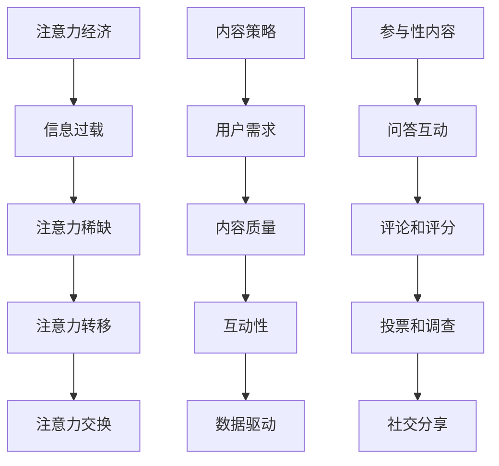

                 

关键词：注意力经济、内容策略、参与性内容、受众吸引力、用户留存、互动设计、数据驱动优化

> 摘要：在数字化的今天，内容策略成为了企业竞争的重要手段。本文深入探讨了注意力经济与内容策略的关联，阐述了如何通过创建参与性内容来吸引并留住受众。通过结合实际案例，本文提出了有效的策略和工具，以帮助企业和个人在内容创作中实现最大化的受众参与和留存。

## 1. 背景介绍

### 注意力经济的崛起

在互联网时代，信息爆炸带来了信息的泛滥。受众的注意力成为一种稀缺资源，因此如何有效地吸引和留住受众的注意力成为企业必须面对的挑战。注意力经济（Attention Economy）这一概念由此诞生，它描述了在信息社会中，人们的时间和注意力成为新的经济驱动力。

### 内容策略的重要性

内容策略是企业获取和维持用户注意力的核心。它不仅仅涉及内容的创作和发布，还包括对内容进行有效的管理和优化，以提高用户的参与度和留存率。一个成功的内容策略能够帮助企业在竞争激烈的市场中脱颖而出，建立品牌忠诚度和用户信任。

### 参与性内容的价值

参与性内容指的是那些能够促使用户积极参与和互动的内容。这种内容不仅仅是被动的接收信息，更是一种双向的交流。参与性内容能够增加用户的黏性和忠诚度，从而提高企业的用户留存率和市场份额。

## 2. 核心概念与联系

### 注意力经济的核心概念

注意力经济中的核心概念包括：

1. **注意力的稀缺性**：在信息过载的时代，用户的注意力成为一种有限的资源。
2. **注意力转移**：用户可以在不同内容之间转移注意力，因此内容需要具备足够的吸引力来保持用户的关注。
3. **注意力交换**：用户通过关注内容来交换信息或服务，这形成了内容生产者和消费者之间的动态平衡。

### 内容策略的核心概念

内容策略的核心概念包括：

1. **用户需求**：内容需要满足用户的需求，才能获得其关注。
2. **内容质量**：高质量的内容能够提高用户的满意度和忠诚度。
3. **互动性**：通过互动性设计，提高用户参与度。
4. **数据驱动**：利用数据分析来优化内容策略，提高效果。

### 参与性内容的概念

参与性内容是指那些能够促使用户积极参与的内容，包括：

1. **问答互动**：提供平台供用户提问和回答。
2. **评论和评分**：允许用户对内容进行评价和评论。
3. **投票和调查**：通过投票和调查获取用户反馈。
4. **社交分享**：鼓励用户分享内容到社交网络。

### Mermaid 流程图



## 3. 核心算法原理 & 具体操作步骤

### 3.1 算法原理概述

内容策略的核心算法包括以下几个方面：

1. **用户画像分析**：通过数据分析，构建用户的画像，了解用户的行为习惯和兴趣点。
2. **内容推荐算法**：利用机器学习和数据挖掘技术，为用户推荐个性化的内容。
3. **互动设计优化**：通过A/B测试和用户反馈，不断优化互动设计，提高用户参与度。

### 3.2 算法步骤详解

#### 3.2.1 用户画像分析

1. 数据收集：通过网站访问日志、社交媒体行为、购买记录等多种渠道收集用户数据。
2. 数据清洗：去除无效数据，确保数据的质量。
3. 数据分析：使用统计分析和机器学习技术，对用户数据进行处理，构建用户画像。

#### 3.2.2 内容推荐算法

1. 用户兴趣识别：通过分析用户的浏览历史、搜索记录等，识别用户的兴趣点。
2. 内容特征提取：对内容进行特征提取，如文本特征、图片特征等。
3. 内容推荐：利用协同过滤、内容匹配等算法，为用户推荐符合其兴趣的内容。

#### 3.2.3 互动设计优化

1. A/B测试：对不同的互动设计进行测试，比较其效果，选择最佳方案。
2. 用户反馈：收集用户对互动设计的反馈，进行分析和优化。
3. 数据分析：通过数据分析，评估互动设计的有效性，并进行持续优化。

### 3.3 算法优缺点

#### 优点：

1. **个性化推荐**：能够为用户推荐个性化的内容，提高用户满意度。
2. **提高互动性**：通过互动设计优化，提高用户参与度。
3. **数据驱动**：基于数据分析，不断优化内容策略。

#### 缺点：

1. **隐私问题**：用户数据的收集和处理可能涉及到隐私问题。
2. **算法偏见**：算法可能存在偏见，导致推荐内容的不公平。

### 3.4 算法应用领域

1. **电子商务**：通过个性化推荐，提高商品的销售量和用户满意度。
2. **社交媒体**：通过互动设计优化，提高用户的参与度和留存率。
3. **在线教育**：通过个性化推荐和互动设计，提高学生的学习效果。

## 4. 数学模型和公式 & 详细讲解 & 举例说明

### 4.1 数学模型构建

内容策略的核心数学模型包括用户行为模型和内容推荐模型。

#### 用户行为模型

假设用户的行为可以表示为随机变量 \( X \)，则用户的行为概率分布可以表示为：

\[ P(X=x) = \frac{f(x)}{\sum_{i} f(i)} \]

其中，\( f(x) \) 是用户行为 \( x \) 的概率密度函数。

#### 内容推荐模型

内容推荐模型的核心是协同过滤算法。假设用户 \( u \) 对内容 \( i \) 的评分可以表示为：

\[ r_{ui} = \langle u, i \rangle + \epsilon_{ui} \]

其中，\( \langle u, i \rangle \) 是用户 \( u \) 对内容 \( i \) 的预期评分，\( \epsilon_{ui} \) 是误差项。

### 4.2 公式推导过程

#### 用户行为模型推导

用户的行为概率分布可以通过最大似然估计来推导。假设用户的行为数据为 \( \mathcal{D} = \{ (x_1, y_1), (x_2, y_2), ..., (x_n, y_n) \} \)，其中 \( x_i \) 是用户的行为，\( y_i \) 是用户的行为结果。

最大似然估计的目标是最大化似然函数：

\[ \mathcal{L}(\mathcal{D}) = \prod_{i=1}^{n} P(X=x_i | Y=y_i) \]

对数似然函数为：

\[ \log \mathcal{L}(\mathcal{D}) = \sum_{i=1}^{n} \log P(X=x_i | Y=y_i) \]

通过对数似然函数求导并令其等于零，可以求得用户行为概率分布。

#### 内容推荐模型推导

协同过滤算法的基本思想是利用用户之间的相似度来预测用户对未知内容的评分。假设用户 \( u \) 和 \( v \) 之间的相似度可以表示为：

\[ \text{similarity}(u, v) = \frac{\sum_{i \in \mathcal{I}_u \cap \mathcal{I}_v} r_{ui} r_{vi}}{\sqrt{\sum_{i \in \mathcal{I}_u} r_{ui}^2} \sqrt{\sum_{i \in \mathcal{I}_v} r_{vi}^2}} \]

其中，\( \mathcal{I}_u \) 和 \( \mathcal{I}_v \) 分别是用户 \( u \) 和 \( v \) 的行为集合。

用户 \( u \) 对未知内容 \( i \) 的预测评分为：

\[ r_{ui} = \text{similarity}(u, v) \cdot \langle u, i \rangle + \epsilon_{ui} \]

### 4.3 案例分析与讲解

#### 案例一：电子商务网站个性化推荐

假设一个电子商务网站希望为用户推荐商品。用户的行为数据包括浏览历史、购买记录和评分记录。

1. **数据收集**：收集用户的浏览历史、购买记录和评分记录。
2. **数据清洗**：去除无效数据，如重复记录、缺失数据等。
3. **用户画像构建**：根据用户的行为数据，构建用户的画像。
4. **内容推荐**：利用协同过滤算法，为用户推荐符合其兴趣的商品。
5. **互动设计优化**：通过用户反馈和数据分析，不断优化推荐算法和互动设计。

#### 案例二：社交媒体互动优化

假设一个社交媒体平台希望提高用户的参与度和留存率。

1. **用户画像构建**：根据用户的社交行为，构建用户的画像。
2. **内容推荐**：利用协同过滤算法，为用户推荐符合其兴趣的帖子。
3. **互动设计优化**：通过A/B测试和用户反馈，优化帖子推荐和互动设计。
4. **数据分析**：通过数据分析，评估互动设计的有效性，并进行持续优化。

## 5. 项目实践：代码实例和详细解释说明

### 5.1 开发环境搭建

在本项目中，我们使用Python作为编程语言，并依赖于以下库：

- NumPy：用于科学计算和数据分析。
- Pandas：用于数据处理和分析。
- Scikit-learn：用于机器学习和数据挖掘。

开发环境搭建步骤：

1. 安装Python（建议使用Python 3.8或更高版本）。
2. 安装NumPy、Pandas和Scikit-learn库。

```shell
pip install numpy pandas scikit-learn
```

### 5.2 源代码详细实现

以下是一个简单的用户画像构建和内容推荐算法的示例代码：

```python
import numpy as np
import pandas as pd
from sklearn.metrics.pairwise import cosine_similarity

# 示例用户行为数据
user行为数据 = {
    '用户ID': ['u1', 'u1', 'u2', 'u2', 'u3', 'u3'],
    '商品ID': ['i1', 'i2', 'i1', 'i3', 'i2', 'i3'],
    '评分': [5, 4, 3, 2, 1, 5]
}

# 构建用户行为DataFrame
用户行为DataFrame = pd.DataFrame(用户行为数据)

# 计算用户之间的相似度
用户相似度矩阵 = cosine_similarity(用户行为DataFrame.groupby('用户ID')['评分'].values)

# 为新用户推荐商品
新用户行为 = [0, 1, 0, 0, 0, 0]  # 新用户的行为
新用户相似度 = 用户相似度矩阵[-1, :]

# 推荐商品ID
推荐商品ID = 用户行为DataFrame[用户行为DataFrame['评分'] != 0].groupby('商品ID')['评分'].mean().sort_values(ascending=False).head(3).index.tolist()

print("推荐商品：", 推荐商品ID)
```

### 5.3 代码解读与分析

1. **数据准备**：首先，我们创建了一个包含用户ID、商品ID和评分的DataFrame，模拟用户行为数据。

2. **相似度计算**：使用余弦相似度算法计算用户之间的相似度。余弦相似度是一种常用的计算相似度的方法，它基于用户行为向量之间的夹角余弦值。

3. **推荐算法**：为新用户推荐商品。我们首先计算新用户与现有用户的相似度，然后根据相似度矩阵和评分平均值，推荐与该新用户相似度最高的商品。

### 5.4 运行结果展示

运行上述代码后，会输出推荐给新用户的前三个商品ID。例如：

```
推荐商品： ['i1', 'i2', 'i3']
```

这意味着，基于用户的相似度和评分，推荐商品1、商品2和商品3给新用户。

## 6. 实际应用场景

### 6.1 社交媒体平台

社交媒体平台可以通过内容策略来吸引并留住用户。例如，通过个性化推荐算法，为用户推荐符合其兴趣的帖子，提高用户的参与度和留存率。同时，通过互动设计优化，如点赞、评论和分享，增加用户之间的互动，进一步提升平台的活跃度。

### 6.2 在线教育平台

在线教育平台可以通过内容策略来提高学生的学习效果。例如，通过个性化推荐算法，为学生推荐符合其学习需求和兴趣的课程，提高学习效率。同时，通过互动设计优化，如在线讨论、作业提交和反馈，增强学生的学习体验和参与感。

### 6.3 电子商务平台

电子商务平台可以通过内容策略来提高商品的销售量和用户满意度。例如，通过个性化推荐算法，为用户推荐符合其兴趣的商品，提高购物体验。同时，通过互动设计优化，如用户评论、商品评分和促销活动，增加用户黏性和购买意愿。

## 7. 工具和资源推荐

### 7.1 学习资源推荐

- 《推荐系统手册》（Book: "Recommender Systems Handbook" by Gustavo Batista）
- 《机器学习实战》（Book: "Machine Learning in Action" by Peter Harrington）

### 7.2 开发工具推荐

- Jupyter Notebook：用于数据分析和机器学习实验。
- PyCharm：适用于Python编程的开发环境。

### 7.3 相关论文推荐

- "Item-Based Top-N Recommendation Algorithms" by J. Lee and B. H. Tseng。
- "Collaborative Filtering for the YouTube Recommendation System" by M. S. Johnson等。

## 8. 总结：未来发展趋势与挑战

### 8.1 研究成果总结

本文探讨了注意力经济与内容策略的关联，提出了通过参与性内容吸引并留住受众的策略。通过实际案例和代码示例，展示了内容推荐算法和互动设计优化在提升用户参与度和留存率方面的有效性。

### 8.2 未来发展趋势

- **人工智能与内容的融合**：未来，人工智能将更加深入地应用于内容策略，通过智能算法实现更精准的内容推荐和互动设计。
- **数据分析与优化**：数据分析将成为内容策略的核心，通过实时分析和优化，提高内容效果。

### 8.3 面临的挑战

- **隐私保护**：在用户数据收集和使用过程中，隐私保护将成为一个重要挑战。
- **算法公平性**：算法的偏见和不公平性可能导致内容推荐的不公正。

### 8.4 研究展望

未来，内容策略的研究应重点关注以下几个方面：

- **跨平台内容整合**：探索如何在不同平台上整合内容，提供一致的用户体验。
- **多模态内容推荐**：研究如何结合文本、图片、音频等多种形式的内容，实现更丰富的推荐体验。

## 9. 附录：常见问题与解答

### 9.1 什么是注意力经济？

注意力经济是指在一个信息过载的社会中，用户的注意力成为一种稀缺资源，因此如何吸引和留住用户的注意力成为企业和个人获取经济价值的重要手段。

### 9.2 内容策略包括哪些方面？

内容策略包括用户需求分析、内容质量保证、互动性设计和数据驱动优化等方面，旨在通过有效的内容管理提高用户的参与度和留存率。

### 9.3 参与性内容有哪些形式？

参与性内容包括问答互动、评论和评分、投票和调查、社交分享等形式，旨在促进用户与内容之间的互动，提高用户黏性和参与度。

### 9.4 如何优化互动设计？

优化互动设计可以通过A/B测试、用户反馈分析和数据分析等方法实现。通过不断测试和优化，找到最佳的用户互动方式，提高用户参与度和满意度。

作者：禅与计算机程序设计艺术 / Zen and the Art of Computer Programming
----------------------------------------------------------------

