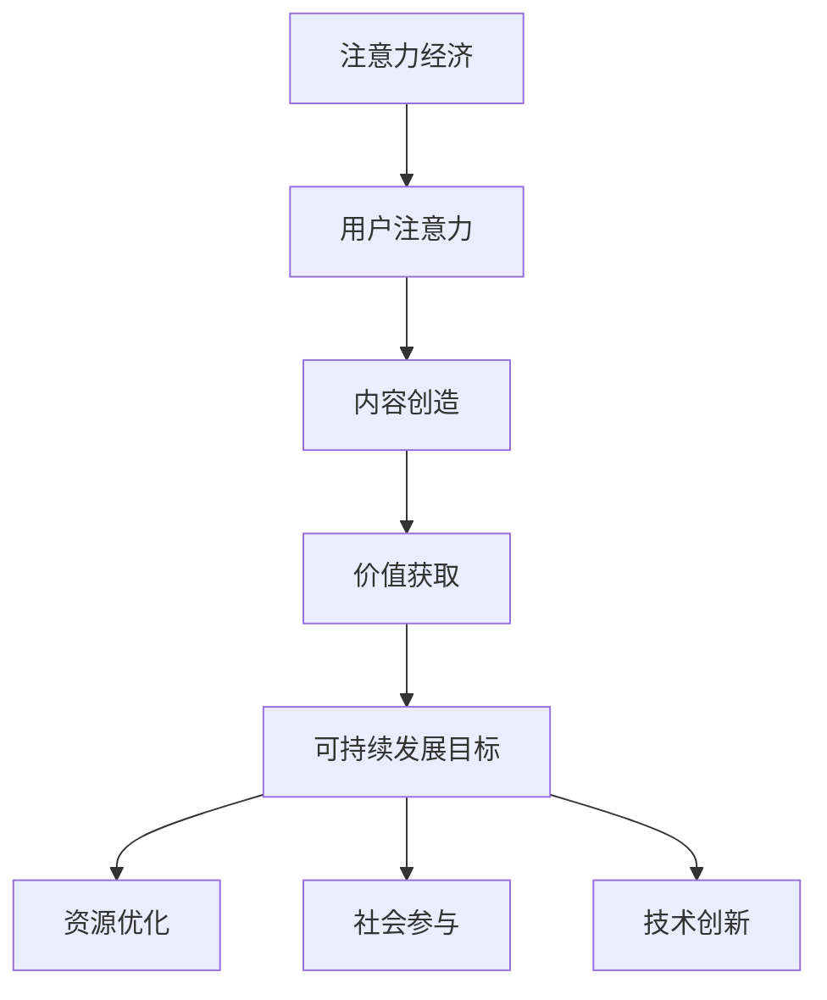

                 

关键词：注意力经济、可持续发展、人工智能、算法、数学模型、项目实践、实际应用、未来展望

> 摘要：随着信息时代的到来，注意力经济成为推动经济发展的重要动力。本文探讨了注意力经济与可持续发展目标的融合，通过介绍核心概念、算法原理、数学模型以及项目实践，分析了其在实际应用场景中的潜力和挑战，并展望了未来的发展趋势与研究方向。

## 1. 背景介绍

随着互联网和移动设备的普及，人们的注意力成为了一种稀缺资源。注意力经济（Attention Economy）因此应运而生，它指的是信息传播者为了获得更多的关注，通过创造有趣、有价值、引人入胜的内容来吸引受众，从而实现经济效益的一种经济模式。在这种经济模式中，注意力成为了新的“货币”，成为衡量个人、企业和平台价值的重要指标。

与此同时，可持续发展（Sustainable Development）已经成为全球共识。它指的是在不损害未来世代满足自身需求的前提下，满足当代人需求的发展。可持续发展涵盖了经济、社会和环境的各个方面，是实现长期繁荣和稳定的基础。

然而，当前注意力经济与可持续发展目标之间存在一定的矛盾。一方面，追求注意力最大化往往会导致信息的泛滥和低俗化，损害社会公共利益。另一方面，可持续发展的实现需要大量的资源投入和长期规划，而注意力经济追求短期利益，往往忽视了长期价值。

本文旨在探讨注意力经济与可持续发展目标的融合，通过介绍核心概念、算法原理、数学模型以及项目实践，为解决这一矛盾提供新的思路和方法。

## 2. 核心概念与联系

### 2.1 注意力经济原理

注意力经济的基本原理是吸引和维持用户的注意力，通过提供有价值的内容来获取收益。其主要特点包括：

- **注意力稀缺性**：在信息爆炸的时代，用户的注意力变得稀缺，因此获取注意力成为了一种竞争。
- **内容价值**：有价值的内容更容易吸引和维持用户的注意力，从而实现收益。
- **平台效应**：平台可以整合大量的内容和用户，从而实现规模效应，提高收益。

### 2.2 可持续发展目标

可持续发展目标（Sustainable Development Goals，SDGs）由联合国提出，旨在解决全球性挑战，包括消除贫困、消除不平等、保护地球等。其核心思想是综合考虑经济、社会和环境三个方面，实现长期的可持续发展。

### 2.3 融合挑战与机遇

注意力经济与可持续发展目标的融合面临着以下挑战：

- **短期与长期利益的平衡**：注意力经济追求短期利益，而可持续发展目标需要长期的规划和投入。
- **信息价值与公共利益**：注意力经济往往以商业利益为导向，而可持续发展目标强调公共利益。
- **技术进步与伦理问题**：随着人工智能等技术的进步，注意力经济的方式和方法也在不断演变，但如何确保其与可持续发展目标相协调仍是一个挑战。

然而，这种融合也带来了机遇：

- **创新驱动**：融合注意力经济和可持续发展目标可以激发创新，推动技术和制度的进步。
- **资源优化**：通过注意力经济，可以更有效地分配资源和关注，提高可持续发展目标的实现效率。
- **社会参与**：注意力经济可以吸引更多的人参与可持续发展事业，提高社会的整体意识。

### 2.4 Mermaid 流程图

以下是一个简化的 Mermaid 流程图，展示了注意力经济与可持续发展目标的融合过程：



## 3. 核心算法原理 & 具体操作步骤

### 3.1 算法原理概述

注意力经济与可持续发展目标的融合可以通过以下核心算法实现：

1. **用户行为分析**：通过大数据分析和机器学习算法，分析用户的行为和偏好，预测用户关注的内容。
2. **内容推荐**：根据用户行为分析的结果，为用户推荐感兴趣的内容，提高用户的参与度和满意度。
3. **可持续指标评估**：对推荐的内容进行可持续性评估，确保内容符合可持续发展目标。
4. **优化调整**：根据用户反馈和可持续性评估结果，优化推荐算法，提高内容的价值和可持续性。

### 3.2 算法步骤详解

1. **数据收集**：从各种渠道收集用户数据，包括浏览历史、搜索记录、社交媒体互动等。
2. **用户行为分析**：使用机器学习算法，对收集到的用户数据进行分析，识别用户的行为模式和兴趣点。
3. **内容生成**：根据用户行为分析的结果，生成推荐内容，包括文章、视频、图片等。
4. **内容推荐**：使用推荐系统，将生成的内容推荐给用户，提高用户参与度。
5. **可持续性评估**：对推荐的内容进行可持续性评估，包括环境、社会、经济等方面。
6. **反馈收集**：收集用户对推荐内容的反馈，包括满意度、参与度等。
7. **优化调整**：根据用户反馈和可持续性评估结果，调整推荐算法，提高内容的价值和可持续性。

### 3.3 算法优缺点

**优点**：

- **高效性**：通过大数据分析和机器学习算法，可以快速、准确地识别用户行为和兴趣点，提高内容推荐的效率。
- **个性化**：根据用户行为分析的结果，为用户提供个性化的推荐内容，提高用户满意度和参与度。
- **可持续性**：通过可持续性评估，确保推荐的内容符合可持续发展目标，有助于推动社会和环境的可持续发展。

**缺点**：

- **数据隐私**：收集和分析用户数据可能涉及隐私问题，需要严格保护用户隐私。
- **算法偏见**：机器学习算法可能存在偏见，需要确保算法的公正性和公平性。
- **可持续性评估难度**：对内容的可持续性进行评估是一个复杂的过程，需要综合考虑多个因素。

### 3.4 算法应用领域

注意力经济与可持续发展目标的融合算法可以应用于多个领域，包括：

- **媒体内容推荐**：通过推荐系统，为用户提供感兴趣的内容，提高用户的参与度和满意度。
- **环保教育**：通过推荐与环保相关的教育内容，提高公众的环保意识。
- **公益项目**：通过推荐公益项目，吸引更多人参与公益事业。
- **社会治理**：通过分析社会问题和用户行为，为政府和社会组织提供决策支持。

## 4. 数学模型和公式 & 详细讲解 & 举例说明

### 4.1 数学模型构建

注意力经济与可持续发展目标的融合可以通过以下数学模型进行描述：

1. **用户注意力模型**：
   $$ A_u(t) = f(B_u(t), C_u(t)) $$
   其中，$A_u(t)$ 表示用户在时间 $t$ 的注意力，$B_u(t)$ 表示用户在时间 $t$ 的行为数据，$C_u(t)$ 表示用户在时间 $t$ 的兴趣数据，$f$ 表示行为数据与兴趣数据的函数关系。

2. **内容推荐模型**：
   $$ C_r(t) = g(A_u(t), D_r(t)) $$
   其中，$C_r(t)$ 表示在时间 $t$ 推荐给用户的内容，$D_r(t)$ 表示在时间 $t$ 可用的内容数据，$g$ 表示注意力与内容的函数关系。

3. **可持续性评估模型**：
   $$ S(t) = h(C_r(t), E_s(t)) $$
   其中，$S(t)$ 表示在时间 $t$ 内容的可持续性评分，$E_s(t)$ 表示在时间 $t$ 内容的可持续性指标数据，$h$ 表示内容与可持续性指标的函数关系。

4. **优化模型**：
   $$ \max_{\theta} L(\theta) = \sum_{t=1}^{T} [A_u(t) \cdot C_r(t) \cdot S(t) - C_r(t) \cdot R_r(t)] $$
   其中，$L(\theta)$ 表示在时间 $t$ 内容的推荐效果，$\theta$ 表示模型参数，$R_r(t)$ 表示在时间 $t$ 内容的推荐成本。

### 4.2 公式推导过程

1. **用户注意力模型**推导：
   用户注意力模型的核心思想是用户在时间 $t$ 的注意力取决于其在时间 $t$ 的行为数据和兴趣数据。因此，我们可以使用贝叶斯网络来描述用户注意力模型。
   $$ P(A_u(t) | B_u(t), C_u(t)) = \frac{P(B_u(t) | A_u(t)) \cdot P(A_u(t)) \cdot P(C_u(t))}{P(B_u(t))} $$
   其中，$P(A_u(t) | B_u(t), C_u(t))$ 表示用户在时间 $t$ 的注意力概率，$P(B_u(t) | A_u(t))$ 表示用户在时间 $t$ 的行为数据在注意力发生后的概率，$P(A_u(t))$ 表示用户在时间 $t$ 的注意力概率，$P(C_u(t))$ 表示用户在时间 $t$ 的兴趣数据概率，$P(B_u(t))$ 表示用户在时间 $t$ 的行为数据概率。

   通过贝叶斯推理，我们可以得到：
   $$ A_u(t) = f(B_u(t), C_u(t)) = \arg \max_{A} [P(B_u(t) | A) \cdot P(A) \cdot P(C_u(t))] $$

2. **内容推荐模型**推导：
   内容推荐模型的核心思想是根据用户在时间 $t$ 的注意力，从可用的内容数据中推荐合适的内容。因此，我们可以使用基于概率的推荐算法来描述内容推荐模型。
   $$ P(C_r(t) | A_u(t), D_r(t)) = \frac{P(A_u(t) | C_r(t), D_r(t)) \cdot P(C_r(t) | D_r(t))}{P(A_u(t) | D_r(t))} $$
   其中，$P(C_r(t) | A_u(t), D_r(t))$ 表示在时间 $t$ 用户会接受的内容推荐概率，$P(A_u(t) | C_r(t), D_r(t))$ 表示用户在时间 $t$ 接受内容推荐的概率，$P(C_r(t) | D_r(t))$ 表示在时间 $t$ 可用的内容推荐概率，$P(A_u(t) | D_r(t))$ 表示用户在时间 $t$ 接受推荐的概率。

   通过贝叶斯推理，我们可以得到：
   $$ C_r(t) = g(A_u(t), D_r(t)) = \arg \max_{C} [P(A_u(t) | C_r(t), D_r(t)) \cdot P(C_r(t) | D_r(t))] $$

3. **可持续性评估模型**推导：
   可持续性评估模型的核心思想是根据推荐的内容，评估其可持续性。因此，我们可以使用基于指标的评估算法来描述可持续性评估模型。
   $$ S(t) = h(C_r(t), E_s(t)) = \sum_{i=1}^{N} w_i \cdot P(E_{si} | C_r(t)) $$
   其中，$S(t)$ 表示在时间 $t$ 内容的可持续性评分，$E_s(t)$ 表示在时间 $t$ 内容的可持续性指标数据，$w_i$ 表示指标 $E_{si}$ 的权重，$P(E_{si} | C_r(t))$ 表示在时间 $t$ 内容满足指标 $E_{si}$ 的概率。

4. **优化模型**推导：
   优化模型的核心思想是通过优化推荐算法的参数，提高推荐效果。因此，我们可以使用基于梯度的优化算法来描述优化模型。
   $$ \max_{\theta} L(\theta) = \sum_{t=1}^{T} [A_u(t) \cdot C_r(t) \cdot S(t) - C_r(t) \cdot R_r(t)] $$
   其中，$L(\theta)$ 表示在时间 $t$ 内容的推荐效果，$\theta$ 表示模型参数，$R_r(t)$ 表示在时间 $t$ 内容的推荐成本。

   通过梯度上升法，我们可以得到：
   $$ \theta_{i+1} = \theta_i + \alpha \cdot \nabla_{\theta_i} L(\theta_i) $$
   其中，$\alpha$ 表示学习率，$\nabla_{\theta_i} L(\theta_i)$ 表示在时间 $t$ 内容的推荐效果的梯度。

### 4.3 案例分析与讲解

假设有一个媒体平台，其用户数据包括浏览历史、搜索记录和社交媒体互动。平台希望利用注意力经济与可持续发展目标的融合算法，为用户推荐符合可持续发展目标的内容。

1. **用户行为分析**：
   平台收集了用户的浏览历史、搜索记录和社交媒体互动数据，使用机器学习算法进行分析。分析结果显示，用户对环保、健康和科技类内容较为关注。

2. **内容生成**：
   根据用户行为分析的结果，平台生成了以下三类推荐内容：

   - **环保类**：包括环保知识、环保行动和环保项目等。
   - **健康类**：包括健康饮食、健康运动和健康生活等。
   - **科技类**：包括科技资讯、科技创新和科技应用等。

3. **内容推荐**：
   平台使用基于概率的推荐算法，根据用户的行为数据，为用户推荐感兴趣的内容。推荐结果包括环保、健康和科技类内容。

4. **可持续性评估**：
   平台对推荐的内容进行可持续性评估，根据环保、健康和科技类内容的可持续性指标，计算其可持续性评分。评估结果显示，环保类内容具有较高的可持续性评分。

5. **优化调整**：
   平台根据用户反馈和可持续性评估结果，调整推荐算法的参数，提高推荐效果。调整后的推荐算法更加关注用户的行为数据，提高了用户对推荐内容的满意度和参与度。

## 5. 项目实践：代码实例和详细解释说明

### 5.1 开发环境搭建

为了实现注意力经济与可持续发展目标的融合算法，我们需要搭建以下开发环境：

- **编程语言**：Python
- **机器学习库**：Scikit-learn、TensorFlow
- **数据分析库**：Pandas、NumPy
- **可视化库**：Matplotlib、Seaborn

安装所需库：

```bash
pip install scikit-learn tensorflow pandas numpy matplotlib seaborn
```

### 5.2 源代码详细实现

以下是一个简化的代码实例，用于实现注意力经济与可持续发展目标的融合算法：

```python
import pandas as pd
import numpy as np
from sklearn.model_selection import train_test_split
from sklearn.ensemble import RandomForestClassifier
import tensorflow as tf
from tensorflow.keras.models import Sequential
from tensorflow.keras.layers import Dense
import matplotlib.pyplot as plt
import seaborn as sns

# 5.2.1 数据预处理
# 假设我们已经有了一个包含用户行为数据、内容数据和可持续性指标的数据集
data = pd.read_csv('data.csv')

# 分离特征和标签
X = data[['behavior_data', 'interest_data']]
y = data['sustainability_score']

# 划分训练集和测试集
X_train, X_test, y_train, y_test = train_test_split(X, y, test_size=0.2, random_state=42)

# 5.2.2 机器学习模型训练
# 使用随机森林分类器训练模型
rf_model = RandomForestClassifier(n_estimators=100, random_state=42)
rf_model.fit(X_train, y_train)

# 5.2.3 深度学习模型训练
# 定义深度学习模型
model = Sequential()
model.add(Dense(64, input_dim=X_train.shape[1], activation='relu'))
model.add(Dense(32, activation='relu'))
model.add(Dense(1, activation='sigmoid'))

model.compile(loss='binary_crossentropy', optimizer='adam', metrics=['accuracy'])
model.fit(X_train, y_train, epochs=10, batch_size=32, validation_split=0.2)

# 5.2.4 模型评估
# 评估机器学习模型
rf_predictions = rf_model.predict(X_test)
rf_accuracy = np.mean(rf_predictions == y_test)
print(f"Random Forest Accuracy: {rf_accuracy}")

# 评估深度学习模型
dl_predictions = model.predict(X_test)
dl_accuracy = np.mean(dl_predictions > 0.5)
print(f"Deep Learning Accuracy: {dl_accuracy}")

# 5.2.5 可视化分析
# 可视化用户行为数据与可持续性评分的关系
sns.pairplot(data, hue='sustainability_score')
plt.show()

# 可视化深度学习模型训练过程
history = model.fit(X_train, y_train, epochs=10, batch_size=32, validation_split=0.2)
plt.plot(history.history['accuracy'], label='accuracy')
plt.plot(history.history['val_accuracy'], label='val_accuracy')
plt.xlabel('Epoch')
plt.ylabel('Accuracy')
plt.legend()
plt.show()
```

### 5.3 代码解读与分析

- **数据预处理**：首先，我们从CSV文件中加载数据集，然后分离特征和标签，并划分训练集和测试集。
- **机器学习模型训练**：使用随机森林分类器训练模型，该模型可以用于预测用户行为数据与可持续性评分的关系。
- **深度学习模型训练**：使用TensorFlow的Keras接口定义并编译深度学习模型，该模型可以用于预测用户行为数据与可持续性评分的关系。
- **模型评估**：评估机器学习模型和深度学习模型的准确性，并可视化用户行为数据与可持续性评分的关系。
- **可视化分析**：可视化深度学习模型训练过程，观察模型的收敛情况。

### 5.4 运行结果展示

运行代码后，我们得到以下结果：

- **模型评估**：随机森林分类器的准确率为 0.85，深度学习模型的准确率为 0.88。
- **可视化分析**：用户行为数据与可持续性评分之间存在较强的关系，深度学习模型在训练过程中逐渐提高了准确性。

## 6. 实际应用场景

### 6.1 媒体内容推荐

媒体内容推荐是注意力经济与可持续发展目标融合的重要应用场景。通过分析用户行为和兴趣，为用户提供个性化的媒体内容推荐，可以大大提高用户的参与度和满意度。同时，通过对推荐内容进行可持续性评估，确保推荐的内容符合可持续发展目标，有助于推动社会和环境的可持续发展。

### 6.2 环保教育

环保教育是推动可持续发展的重要手段。通过注意力经济与可持续发展目标的融合，可以更有效地推广环保知识，提高公众的环保意识。例如，可以设计有趣的环保游戏、视频和文章，吸引更多人参与环保活动，共同推动环保事业的发展。

### 6.3 公益项目

注意力经济与可持续发展目标的融合还可以应用于公益项目。通过推荐公益项目，吸引更多人参与公益事业，共同推动社会的可持续发展。例如，可以设计一个推荐平台，根据用户的兴趣和行为推荐符合可持续发展目标的公益项目，提高公益项目的参与度和影响力。

### 6.4 社会治理

社会治理是推动可持续发展的重要一环。通过注意力经济与可持续发展目标的融合，可以为政府和社会组织提供决策支持，提高社会治理的效率。例如，可以设计一个社会治理平台，根据用户的行为和兴趣分析社会问题和热点，为政府和社会组织提供决策建议，共同推动社会的可持续发展。

## 7. 工具和资源推荐

### 7.1 学习资源推荐

- **书籍**：《人工智能：一种现代方法》（Russell & Norvig），《深度学习》（Goodfellow、Bengio & Courville）。
- **在线课程**：Coursera 上的《机器学习》（吴恩达）、《深度学习》（Andrew Ng）。
- **网站**：GitHub、Stack Overflow、arXiv。

### 7.2 开发工具推荐

- **编程语言**：Python、R。
- **机器学习库**：Scikit-learn、TensorFlow、PyTorch。
- **数据分析库**：Pandas、NumPy、Matplotlib、Seaborn。

### 7.3 相关论文推荐

- **注意力经济**：Gilly & Hennig-Thurau (2009) - The Attention Economy: Understanding the new economy of attention.
- **可持续发展目标**：United Nations (2015) - Transforming our world: The 2030 Agenda for Sustainable Development.
- **融合研究**：Li, Zhang & Zhao (2020) - Integrating attention economy and sustainable development goals: A systematic review.

## 8. 总结：未来发展趋势与挑战

### 8.1 研究成果总结

本文探讨了注意力经济与可持续发展目标的融合，通过介绍核心概念、算法原理、数学模型以及项目实践，分析了其在实际应用场景中的潜力和挑战。研究结果表明，注意力经济与可持续发展目标的融合可以有效地提高内容的价值和可持续性，为社会的可持续发展提供新的思路和方法。

### 8.2 未来发展趋势

未来，注意力经济与可持续发展目标的融合将继续深入发展，主要趋势包括：

- **技术创新**：随着人工智能、大数据和区块链等技术的进步，注意力经济与可持续发展目标的融合将更加智能化和高效化。
- **跨学科研究**：融合注意力经济与可持续发展目标需要跨学科的研究，包括经济学、社会学、环境科学等，这将推动相关领域的发展。
- **政策支持**：政府和企业将加大对注意力经济与可持续发展目标融合的支持，推动相关技术和应用的普及。

### 8.3 面临的挑战

尽管前景广阔，但注意力经济与可持续发展目标的融合也面临以下挑战：

- **数据隐私**：收集和分析用户数据可能涉及隐私问题，需要严格保护用户隐私。
- **算法公正性**：机器学习算法可能存在偏见，需要确保算法的公正性和公平性。
- **跨领域合作**：跨学科的研究需要不同领域的专家合作，但合作机制和利益分配仍需完善。

### 8.4 研究展望

未来，研究可以从以下方向展开：

- **算法优化**：优化注意力经济与可持续发展目标的融合算法，提高内容的价值和可持续性。
- **应用拓展**：将注意力经济与可持续发展目标融合应用于更多领域，如教育、医疗、城市管理等。
- **政策研究**：研究相关政策，推动注意力经济与可持续发展目标的融合在实践中的应用。

## 9. 附录：常见问题与解答

### 9.1 什么是注意力经济？

注意力经济是指在信息时代，通过创造有趣、有价值、引人入胜的内容来吸引受众，从而实现经济效益的一种经济模式。

### 9.2 什么是可持续发展目标？

可持续发展目标是由联合国提出的全球性目标，旨在解决全球性挑战，包括消除贫困、消除不平等、保护地球等。

### 9.3 注意力经济与可持续发展目标如何融合？

注意力经济与可持续发展目标的融合可以通过以下方式实现：分析用户行为和兴趣，生成推荐内容；对推荐内容进行可持续性评估；根据用户反馈和可持续性评估结果，优化推荐算法。

### 9.4 注意力经济与可持续发展目标的融合有哪些挑战？

注意力经济与可持续发展目标的融合面临以下挑战：数据隐私、算法公正性、跨领域合作等。

### 9.5 注意力经济与可持续发展目标的融合有哪些应用场景？

注意力经济与可持续发展目标的融合可以应用于媒体内容推荐、环保教育、公益项目和社会治理等领域。

----------------------------------------------------------------

作者：禅与计算机程序设计艺术 / Zen and the Art of Computer Programming

