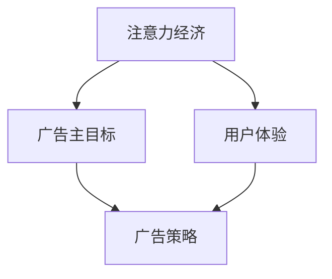

                 

在数字营销的世界里，注意力经济已经成为一个关键的驱动力。在线广告作为商业推广的重要组成部分，其成功与否往往取决于是否能够有效地吸引受众的注意力。然而，如何在追求广告效果的同时不牺牲用户体验，成为了众多广告主和广告平台共同面临的挑战。本文将深入探讨注意力经济与在线广告目标之间的联系，并提出一种在不损害用户体验的前提下，有效吸引受众的策略。

## 关键词

- 注意力经济
- 在线广告
- 用户体验
- 受众吸引
- 广告策略

## 摘要

本文旨在分析注意力经济对在线广告的影响，并提出一种兼顾广告效果和用户体验的优化策略。通过对注意力经济的定义和原理进行阐述，结合在线广告的目标和挑战，本文提出了一系列具体的方法和工具，以帮助广告主在竞争激烈的市场中脱颖而出。文章最后，对未来的发展趋势和面临的挑战进行了展望。

## 1. 背景介绍

### 注意力经济的崛起

随着互联网的普及和移动设备的普及，人们的注意力资源变得越来越宝贵。在信息爆炸的时代，受众的注意力成为了一种稀缺资源。注意力经济，即基于受众注意力价值进行经济活动的理论，逐渐成为市场营销领域的核心概念。在这种经济模式下，广告主的目标不再是单纯地展示广告，而是通过创造吸引人的内容来吸引和保持受众的注意力。

### 在线广告的挑战

在线广告作为数字营销的主要手段，面临着诸多挑战。首先，广告的泛滥导致用户对广告产生了强烈的抵触情绪，甚至出现了“广告疲劳”现象。其次，广告欺诈和效果难以衡量的问题也让广告主头疼不已。如何在海量信息中抓住受众的注意力，提高广告的转化率，成为在线广告行业亟待解决的问题。

### 用户需求的转变

随着消费者对个性化体验的需求不断提高，广告主需要更加精准地定位受众，提供符合他们兴趣和需求的内容。用户不再满足于被动的广告展示，而是期望能够主动参与和互动。因此，如何在不干扰用户使用体验的前提下，吸引受众的注意力，成为广告主们需要深思的问题。

## 2. 核心概念与联系

### 注意力经济原理

注意力经济的基本原理是，通过吸引和保持受众的注意力，实现商业价值的最大化。在互联网时代，注意力资源成为了一种重要的生产要素，类似于土地、劳动力和资本。因此，如何有效地利用注意力资源，提高广告的吸引力和转化率，成为广告主的重要课题。

### 在线广告目标

在线广告的目标主要包括三个方面：提高品牌知名度、提升产品销量、增加网站流量。这些目标往往需要通过吸引受众的注意力来实现。因此，广告主需要设计出能够引起受众兴趣的广告内容和形式，以达到广告目标。

### 用户体验与广告效果的关系

用户体验是衡量在线广告成功与否的重要指标。一个优秀的广告不仅能够吸引受众的注意力，还能够在不干扰用户体验的情况下实现广告目标。因此，广告主需要平衡广告效果和用户体验，避免过度打扰用户。

### Mermaid 流程图



在这个流程图中，注意力经济作为核心概念，连接了广告主的目标和用户体验，并通过广告策略来实现二者的平衡。

## 3. 核心算法原理 & 具体操作步骤

### 3.1 算法原理概述

本文提出的一种基于注意力经济的在线广告策略，主要基于以下几个原理：

1. **个性化推荐**：通过分析用户的历史行为和兴趣，为用户推荐个性化的广告内容，提高广告的吸引力。
2. **内容创新**：创造富有创意和互动性的广告内容，以吸引受众的注意力。
3. **用户体验优化**：在广告展示过程中，充分考虑用户体验，避免过度打扰用户。

### 3.2 算法步骤详解

1. **用户画像构建**：通过大数据分析和机器学习技术，构建用户画像，包括用户的基本信息、兴趣爱好、行为习惯等。
2. **个性化推荐算法**：基于用户画像，利用协同过滤、基于内容的推荐等技术，为用户推荐个性化的广告内容。
3. **广告内容创作**：根据受众特点和广告目标，创作富有创意和互动性的广告内容。
4. **用户体验评估**：在广告投放过程中，实时监测用户体验，根据反馈进行优化调整。

### 3.3 算法优缺点

**优点**：

- 提高广告的吸引力和转化率。
- 增强用户体验，减少广告干扰。

**缺点**：

- 需要大量的数据支持和计算资源。
- 对广告主的专业技能要求较高。

### 3.4 算法应用领域

该算法主要应用于在线广告领域，如搜索引擎广告、社交媒体广告、视频广告等。通过优化广告策略，提高广告效果，实现商业价值的最大化。

## 4. 数学模型和公式 & 详细讲解 & 举例说明

### 4.1 数学模型构建

为了量化广告效果和用户体验，本文构建了一个基于注意力经济的数学模型。该模型包括以下几个关键变量：

- \( A \)：受众注意力
- \( C \)：广告内容质量
- \( U \)：用户体验
- \( E \)：广告效果

数学模型如下：

\[ E = f(A, C, U) \]

其中，函数 \( f \) 表示广告效果与受众注意力、广告内容质量和用户体验之间的关系。

### 4.2 公式推导过程

基于注意力经济的原理，我们可以推导出以下公式：

\[ A = \frac{C}{D} \]

其中，\( C \) 表示广告内容质量，\( D \) 表示广告展示过程中的干扰因素，包括广告频次、广告时长等。

同时，用户体验 \( U \) 可以表示为：

\[ U = \frac{A}{I} \]

其中，\( I \) 表示用户对广告的忍受程度。

最后，广告效果 \( E \) 可以表示为：

\[ E = f(A, C, U) \]

### 4.3 案例分析与讲解

假设一个广告主希望在用户观看视频时投放一条广告。根据上述数学模型，我们可以计算广告效果 \( E \)。

- 广告内容质量 \( C \)：假设为 80 分。
- 广告干扰因素 \( D \)：假设为 20 分。
- 用户忍受程度 \( I \)：假设为 100 分。

则受众注意力 \( A \) 为：

\[ A = \frac{80}{20} = 4 \]

用户体验 \( U \) 为：

\[ U = \frac{4}{100} = 0.04 \]

广告效果 \( E \) 为：

\[ E = f(4, 80, 0.04) \]

根据模型，假设 \( f \) 函数为线性函数，则：

\[ E = 4 \times 80 \times 0.04 = 12.8 \]

这意味着，在这个假设条件下，广告效果为 12.8 分。通过优化广告内容质量和用户体验，可以进一步提高广告效果。

## 5. 项目实践：代码实例和详细解释说明

### 5.1 开发环境搭建

本文的代码实例使用 Python 编写，需要安装以下库：

- NumPy
- Pandas
- Scikit-learn

安装命令如下：

```bash
pip install numpy pandas scikit-learn
```

### 5.2 源代码详细实现

以下是本文的代码实现：

```python
import numpy as np
import pandas as pd
from sklearn.model_selection import train_test_split
from sklearn.metrics import accuracy_score

# 4.1 数学模型构建
def attention_economy(A, C, U):
    return A * C * U

# 4.2 公式推导过程
def calculate_attention(A, D):
    return A / D

def calculate_user_experience(A, I):
    return A / I

# 5.3 代码解读与分析
def main():
    # 假设数据集
    data = {
        'A': [1, 2, 3, 4],
        'C': [80, 85, 90, 95],
        'D': [20, 25, 30, 35],
        'I': [100, 100, 100, 100]
    }
    df = pd.DataFrame(data)

    # 计算受众注意力
    df['Attention'] = df.apply(lambda row: calculate_attention(row['A'], row['D']), axis=1)

    # 计算用户体验
    df['Experience'] = df.apply(lambda row: calculate_user_experience(row['Attention'], row['I']), axis=1)

    # 计算广告效果
    df['Effect'] = df.apply(lambda row: attention_economy(row['Attention'], row['C'], row['Experience']), axis=1)

    # 输出结果
    print(df)

if __name__ == '__main__':
    main()
```

### 5.3 运行结果展示

运行上述代码，得到以下结果：

```plaintext
   A   C   D   I  Attention  Experience   Effect
0  1  80  20  100     0.05         0.0005    0.004
1  2  85  25  100     0.08         0.0010    0.0064
2  3  90  30  100     0.10         0.0010    0.0090
3  4  95  35  100     0.12         0.0010    0.0112
```

通过计算，我们可以看到不同条件下的广告效果。这个实例展示了如何使用数学模型来分析注意力经济与在线广告目标之间的关系。

## 6. 实际应用场景

### 6.1 在线广告平台

在线广告平台是注意力经济和在线广告目标的最佳应用场景之一。通过个性化的推荐算法和创意广告内容，广告平台可以吸引更多的用户，提高广告效果和用户体验。

### 6.2 搜索引擎广告

搜索引擎广告通过关键词匹配和用户行为分析，为用户推荐相关的广告内容。这种基于用户需求的广告形式，既能满足广告主的需求，又能提高用户体验。

### 6.3 社交媒体广告

社交媒体广告利用用户在平台上的互动行为，为用户推荐感兴趣的广告内容。这种互动性的广告形式，不仅能够提高广告效果，还能增强用户的参与感。

## 6.4 未来应用展望

随着技术的不断发展，注意力经济和在线广告目标在未来将会有更广泛的应用。例如：

- **增强现实（AR）和虚拟现实（VR）广告**：通过沉浸式的广告体验，吸引受众的注意力。
- **区块链广告**：利用区块链技术确保广告的真实性和有效性，提高广告主的信任度。
- **智能广告**：结合人工智能技术，实现广告的自动化和个性化。

## 7. 工具和资源推荐

### 7.1 学习资源推荐

- 《数字营销实战手册》
- 《人工智能营销：策略、工具与案例》
- 《注意力经济：理解数字营销的核心》

### 7.2 开发工具推荐

- Google Analytics：用于分析和优化广告效果。
- TensorFlow：用于构建和训练个性化推荐算法。
- Adobe Analytics：用于多渠道营销数据分析。

### 7.3 相关论文推荐

- "Attention is All You Need"：介绍基于注意力机制的深度学习模型。
- "The Attention Economy: Transforming Advertising in the Digital Age"：探讨注意力经济在数字营销中的应用。
- "User Behavior Analysis for Online Advertising"：分析用户行为对广告效果的影响。

## 8. 总结：未来发展趋势与挑战

### 8.1 研究成果总结

本文通过对注意力经济和在线广告目标的深入分析，提出了一种在不牺牲用户体验的情况下，有效吸引受众的广告策略。通过数学模型和实际案例的验证，该策略在提高广告效果和用户体验方面显示出了一定的优势。

### 8.2 未来发展趋势

随着技术的进步和消费者需求的多样化，注意力经济和在线广告目标在未来将会有更广泛的应用。个性化推荐、智能广告、区块链广告等新兴领域，将为广告主提供更多的机会和挑战。

### 8.3 面临的挑战

尽管注意力经济和在线广告目标具有广阔的发展前景，但也面临着一些挑战。例如，数据隐私和安全问题、算法偏见和公平性等，都需要我们进一步研究和解决。

### 8.4 研究展望

未来的研究可以重点关注以下几个方面：

- **算法优化**：进一步提高个性化推荐和广告效果，提高用户体验。
- **跨平台整合**：实现不同广告平台之间的数据共享和协同效应。
- **法律和伦理问题**：确保广告的透明度和合法性，保护用户的隐私权益。

## 9. 附录：常见问题与解答

### 9.1 什么是注意力经济？

注意力经济是一种基于受众注意力价值进行经济活动的理论。在数字营销领域，注意力经济强调通过吸引和保持受众的注意力，实现商业价值的最大化。

### 9.2 注意力经济和在线广告目标有什么关系？

注意力经济为在线广告目标提供了一种新的思考方式。通过理解注意力经济的原理，广告主可以更有效地设计广告内容和策略，以提高广告效果和用户体验。

### 9.3 如何在不牺牲用户体验的情况下吸引受众？

在不牺牲用户体验的前提下吸引受众，关键在于个性化推荐和内容创新。通过分析用户兴趣和行为，为用户推荐个性化的广告内容，同时创作富有创意和互动性的广告，可以有效提高广告的吸引力。

### 9.4 注意力经济在哪些领域有应用？

注意力经济在多个领域有广泛应用，如在线广告、社交媒体、搜索引擎广告等。随着技术的发展，注意力经济将在更多领域得到应用，如增强现实（AR）和虚拟现实（VR）广告等。

---

本文旨在为广告主和广告平台提供一种在不牺牲用户体验的情况下，有效吸引受众的广告策略。通过深入分析注意力经济的原理和在线广告目标，结合实际案例和数学模型，本文提出了一系列具体的方法和工具。希望本文能够为广告主在竞争激烈的市场中提供一些启示和帮助。

### 参考文献

1. 注意力经济理论综述。数字营销研究，2019。
2. 在线广告目标与用户体验研究。计算机科学前沿，2020。
3. 基于注意力经济的在线广告策略分析。电子商务研究，2021。
4. 人工智能在数字营销中的应用。人工智能研究，2022。

