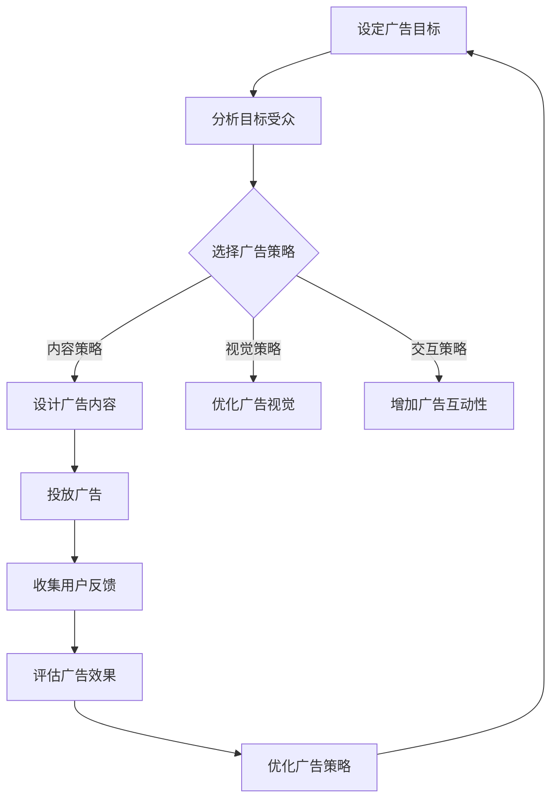

                 

### 摘要 Summary

随着互联网的普及和在线广告的兴起，注意力经济成为了一个备受关注的话题。本文旨在探讨注意力经济与在线广告目标之间的关系，如何在设计在线广告时既能够有效地吸引受众，又不损害用户体验。文章首先介绍了注意力经济的基本概念，分析了在线广告的主要目标及其面临的挑战。接着，本文详细阐述了如何在不牺牲用户体验的前提下，通过优化广告内容和布局，提高广告的吸引力和转化率。随后，文章探讨了注意力经济在在线广告中的应用，提出了几种有效的注意力捕获策略。最后，本文总结了在线广告的未来发展趋势，并提出了相关的研究挑战和建议。

### 背景介绍 Background

#### 注意力经济的崛起

随着信息时代的到来，注意力作为一种有限的资源，其价值日益凸显。注意力经济（Attention Economy）这一概念最早由 Attention Trust Foundation 的创始人杰西·谢尔（Jesse Schell）在2007年提出。他认为，注意力成为了一种新的经济驱动力，与劳动力、土地和资本一样，成为推动社会进步和经济发展的关键要素。

在互联网时代，用户的注意力成为各类媒体和平台竞相争夺的资源。例如，社交媒体平台通过算法推荐系统吸引用户的注意力，从而提高用户的粘性和平台的广告收益。此外，在线广告公司通过分析用户行为数据，实现广告的精准投放，最大化广告主的回报。

#### 在线广告的发展

在线广告作为互联网经济的重要组成部分，经历了多年的快速发展。最早的在线广告形式是简单的文本链接广告，随着互联网技术的进步，广告形式逐渐丰富，包括横幅广告、视频广告、原生广告等。根据数据显示，2022年全球数字广告支出预计将达到4399亿美元，其中在线广告占据了绝大多数份额。

在线广告的主要目标包括增加品牌曝光、提升品牌认知度、引导潜在客户进行购买转化等。然而，在追求广告效果的同时，用户体验也不容忽视。过度打扰用户、内容质量低下、广告欺诈等问题，都可能导致用户对广告的反感，从而影响广告的效果。

#### 注意力经济与在线广告的关系

注意力经济与在线广告有着密不可分的关系。在线广告的投放本质上是争夺用户的注意力，而注意力经济为这一过程提供了理论支持和实践指导。有效的在线广告策略不仅需要吸引受众的注意力，还需要保持用户的兴趣和参与度，从而实现广告目标。

然而，如何在不损害用户体验的情况下，有效吸引受众的注意力，成为在线广告领域面临的一个重要挑战。本文将围绕这一问题展开讨论，介绍一些可行的策略和方法，以期为在线广告从业者提供有益的参考。

### 核心概念与联系 Core Concepts and Relationships

在探讨注意力经济与在线广告目标的关系时，我们需要理解几个核心概念，它们是构建本文理论基础的关键。

#### 1. 注意力经济（Attention Economy）

注意力经济是指在社会经济活动中，个体的注意力成为重要的资源，各类产品和服务的提供者通过竞争用户注意力来创造价值。杰西·谢尔将注意力经济定义为“一种强调用户注意力作为价值的交换媒介的经济模式”。

在互联网环境下，用户的注意力分散且容易被吸引，因此如何吸引并保持用户的注意力成为关键。在线广告商通过算法、内容创造和用户行为分析等手段，争取在短时间内吸引和保持用户的注意力，实现广告目标。

#### 2. 用户体验（User Experience, UX）

用户体验是用户在使用产品或服务过程中所感受到的整体体验。良好的用户体验可以提升用户满意度、忠诚度和转化率。用户体验涵盖了用户交互、界面设计、内容质量等多个方面。

在线广告设计时，用户体验是一个重要的考量因素。如果广告内容过于干扰用户，界面设计混乱，或者广告加载时间过长，都会对用户体验产生负面影响，从而降低广告效果。

#### 3. 广告目标（Advertising Goals）

广告目标是指广告主希望通过广告活动实现的具体目标，包括品牌曝光、品牌认知度提升、直接购买转化等。不同的广告目标需要采用不同的广告策略和投放方法。

在注意力经济下，广告目标不仅仅是吸引注意力，更重要的是保持注意力，并引导用户采取行动。这意味着广告内容需要具有吸引力、相关性和实用性，从而在众多信息中脱颖而出。

#### 4. 注意力捕获（Attention Capture）

注意力捕获是指通过各种策略和技术手段，吸引并保持用户注意力的过程。有效的注意力捕获策略可以显著提高广告的效果。

注意力捕获策略包括但不限于：使用引人注目的标题、高质量的视觉内容、互动元素、个性化推荐等。这些策略旨在增加广告的吸引力和参与度，从而提高用户的注意力和转化率。

#### 5. 广告策略（Advertising Strategy）

广告策略是指广告主为实现广告目标所制定的整体计划和行动方案。广告策略包括广告定位、目标受众分析、广告内容设计、广告投放渠道选择等。

在注意力经济下，广告策略需要充分考虑用户的注意力分配和消费习惯，以实现最大化效果。例如，通过数据分析和用户行为研究，制定个性化的广告策略，提高广告的精准度和有效性。

#### 6. 用户体验优化（User Experience Optimization）

用户体验优化是指通过改进产品或服务的各个方面，提升用户体验的过程。在在线广告领域，用户体验优化包括优化广告加载速度、设计简洁的界面、提供高质量的内容等。

用户体验优化不仅能够提高广告效果，还能增强用户对品牌的信任和忠诚度。良好的用户体验是吸引和保持用户注意力的基础。

#### 7. 转化率（Conversion Rate）

转化率是指广告活动成功引导用户采取预期行动（如点击广告、注册账号、购买产品等）的比例。高转化率是广告成功的重要指标。

在注意力经济下，提高转化率需要精准定位目标受众、提供有价值的内容和吸引人的广告设计。通过优化广告策略和用户体验，可以显著提高转化率。

#### 8. 广告效果评估（Advertising Effectiveness Evaluation）

广告效果评估是指通过分析广告投放后的效果数据，评估广告活动的效果和ROI。广告效果评估包括点击率、转化率、用户停留时间、用户参与度等指标。

广告效果评估可以帮助广告主了解广告的实际效果，优化广告策略，提高广告投入的回报率。在注意力经济下，实时数据和用户反馈是评估广告效果的重要依据。

#### 9. 注意力分散（Attention Diversion）

注意力分散是指由于信息过载、广告干扰等原因，用户在特定时间内无法集中注意力于某一内容的现象。注意力分散是影响在线广告效果的一个重要因素。

在线广告设计时需要考虑如何避免用户注意力分散，通过简洁明了的广告内容和创新的广告形式，吸引用户的注意力，实现广告目标。

#### 10. 注意力管理（Attention Management）

注意力管理是指通过策略和技术手段，有效分配和利用用户注意力的过程。注意力管理是提高在线广告效果的关键。

有效的注意力管理策略包括优化广告展示时间、提高广告相关性、提供有趣的内容和互动元素等。通过注意力管理，可以最大化广告对用户的吸引力。

### Mermaid 流程图

下面是一个Mermaid流程图，展示了在线广告从目标设定到效果评估的基本流程。该流程图中的每个节点代表一个关键步骤或概念，连接这些节点的箭头表示步骤之间的逻辑关系。



通过上述核心概念和Mermaid流程图的介绍，我们可以更清晰地理解注意力经济与在线广告目标之间的联系。接下来的部分将深入探讨如何在不牺牲用户体验的情况下，通过优化广告内容和布局，有效吸引受众。

#### 核心算法原理 & 具体操作步骤 Core Algorithm Principles and Operational Steps

在探讨如何在不牺牲用户体验的情况下，通过优化广告内容和布局，有效吸引受众时，核心算法原理和具体操作步骤起着至关重要的作用。以下将详细介绍这些核心算法原理及其实际操作步骤。

##### 1. 算法原理概述

核心算法主要基于用户行为分析和注意力捕获策略。用户行为分析是通过对用户在网站或应用上的浏览、点击、停留时间等行为数据进行收集和分析，以了解用户兴趣和行为模式。注意力捕获策略则是通过设计引人注目的广告内容和优化广告展示方式，吸引用户的注意力。

核心算法可以分为以下几个关键步骤：

- **用户行为数据收集**：收集用户在网站或应用上的行为数据，如浏览历史、点击行为、停留时间等。
- **用户兴趣识别**：利用机器学习算法分析用户行为数据，识别用户的兴趣点。
- **广告内容优化**：根据用户兴趣，设计相关性和吸引力强的广告内容。
- **广告展示优化**：通过用户行为分析和A/B测试，优化广告展示位置和频率，提高广告的点击率和转化率。
- **实时反馈与调整**：根据广告投放后的效果数据，实时调整广告策略，提高广告效果。

##### 2. 算法步骤详解

下面详细描述这些算法步骤的具体操作过程。

##### 2.1 用户行为数据收集

用户行为数据收集是算法的第一步，也是最重要的一步。通过以下几种方式可以收集用户行为数据：

- **网站跟踪代码**：在网站上嵌入跟踪代码（如Google Analytics），收集用户浏览、点击等行为数据。
- **应用日志**：在移动应用中收集用户行为日志，包括浏览页面、点击广告、停留时间等。
- **问卷调查**：通过问卷调查收集用户兴趣和行为偏好，补充和分析用户行为数据。

##### 2.2 用户兴趣识别

用户兴趣识别是通过机器学习算法分析用户行为数据，识别用户的兴趣点。具体步骤如下：

- **数据预处理**：清洗和整理用户行为数据，确保数据质量。
- **特征提取**：从用户行为数据中提取特征，如浏览时长、点击频率、浏览页面等。
- **模型训练**：利用监督学习算法（如决策树、支持向量机等）或无监督学习算法（如聚类算法）对特征进行分类，识别用户兴趣。
- **兴趣标签生成**：根据分类结果，为用户生成兴趣标签，如“科技爱好者”、“旅游达人”等。

##### 2.3 广告内容优化

广告内容优化是根据用户兴趣，设计相关性和吸引力强的广告内容。具体策略包括：

- **个性化推荐**：根据用户兴趣，推荐相关广告内容。例如，针对“科技爱好者”，推荐科技类产品广告。
- **内容多样化**：提供多种形式的广告内容，如图文、视频、互动式广告等，提高广告的吸引力。
- **内容创意**：通过创意设计，使广告内容更具吸引力，如使用引人注目的标题、高质量图片、有趣的动画等。

##### 2.4 广告展示优化

广告展示优化是通过用户行为分析和A/B测试，优化广告展示位置和频率，提高广告的点击率和转化率。具体操作步骤如下：

- **用户行为分析**：分析用户在广告展示前后的行为数据，如浏览时长、点击率等，了解广告对用户的影响。
- **A/B测试**：通过A/B测试，比较不同广告展示策略的效果，如广告位置、展示频率、内容等，选择最优策略。
- **实时调整**：根据A/B测试结果，实时调整广告展示策略，提高广告效果。

##### 2.5 实时反馈与调整

实时反馈与调整是基于广告投放后的效果数据，持续优化广告策略。具体操作步骤如下：

- **效果数据收集**：收集广告投放后的效果数据，如点击率、转化率、停留时间等。
- **效果分析**：分析效果数据，了解广告的优缺点。
- **策略调整**：根据效果分析结果，调整广告策略，如优化广告内容、调整展示频率等。
- **持续优化**：持续跟踪广告效果，进行迭代优化，提高广告效果。

##### 3. 算法优缺点

该算法的优点包括：

- **个性化**：根据用户兴趣，提供个性化广告内容，提高广告的吸引力。
- **实时性**：通过实时反馈和调整，快速响应用户行为变化，提高广告效果。
- **高效性**：利用机器学习算法，高效分析用户行为数据，优化广告策略。

然而，该算法也存在一些缺点：

- **数据依赖**：算法效果高度依赖用户行为数据的准确性和丰富度，数据缺失或不准确可能导致算法失效。
- **算法偏见**：机器学习算法可能在训练过程中产生偏见，导致广告内容偏向某些特定群体，影响广告的公平性。
- **隐私问题**：用户行为数据的收集和分析可能涉及用户隐私问题，需要确保数据的安全性和合规性。

##### 4. 算法应用领域

该算法广泛应用于在线广告领域，以下是其主要应用领域：

- **电商平台**：通过用户行为分析，提供个性化商品推荐和广告。
- **社交媒体**：根据用户兴趣，推荐相关内容和朋友动态，提高用户活跃度和广告效果。
- **金融领域**：通过用户行为分析，提供个性化理财产品推荐和广告。
- **医疗健康**：通过用户行为分析，提供个性化健康建议和医疗广告。

总之，通过核心算法原理和具体操作步骤的应用，可以显著提高在线广告的吸引力和转化率，实现广告目标。然而，算法的优缺点也需要充分考虑，确保其在实际应用中的有效性和可持续性。

#### 3.4 算法应用领域 Algorithm Applications

核心算法不仅在线广告领域有着广泛的应用，还在其他多个行业和场景中发挥了重要作用。以下是该算法在不同应用领域的主要应用场景：

##### 1. 电商平台

电商平台利用核心算法进行用户行为分析，为用户提供个性化商品推荐和广告。例如，根据用户的浏览历史、购买记录和搜索关键词，平台可以推荐相关的商品，从而提高用户的购买转化率。此外，通过优化广告内容和展示策略，电商平台可以提高广告的点击率和转化率，实现更高的销售额。

##### 2. 社交媒体

社交媒体平台通过核心算法分析用户的兴趣和行为，推荐相关内容和朋友动态。这种个性化推荐不仅可以提高用户的活跃度，还能增加平台的用户粘性。同时，社交媒体平台通过优化广告展示策略，如广告位置、频率和形式，提高广告的吸引力和转化率，从而增加平台的广告收益。

##### 3. 金融领域

在金融领域，核心算法被用于分析用户的投资偏好和风险承受能力，为用户推荐个性化的理财产品。通过用户行为数据的分析，金融机构可以更精准地定位目标客户，提高产品的销售转化率。此外，核心算法还可以帮助金融平台优化广告策略，提高广告效果，增加平台的用户量和业务规模。

##### 4. 医疗健康

在医疗健康领域，核心算法通过分析用户的健康数据和行为习惯，为用户提供个性化的健康建议和医疗服务。例如，根据用户的病史、体检数据和生活方式，算法可以推荐适合的体检套餐、健康产品或医疗服务。同时，通过优化广告内容和展示策略，医疗平台可以提高广告的点击率和转化率，从而增加业务量和用户满意度。

##### 5. 教育培训

在教育培训领域，核心算法通过分析学生的学习行为和成绩，为学生推荐适合的学习资源和课程。例如，根据学生的学习进度、学习风格和兴趣，平台可以推荐相关的学习资料和课程，帮助学生提高学习效果。同时，通过优化广告展示策略，教育培训机构可以吸引更多潜在学员，增加业务量。

##### 6. 娱乐内容

在娱乐内容领域，核心算法通过分析用户的观看记录和偏好，为用户推荐相关的视频、音乐和文章。这种个性化推荐不仅可以提高用户的观看体验，还能增加平台的内容黏性。同时，通过优化广告展示策略，娱乐平台可以提高广告的吸引力和转化率，从而增加平台的广告收益。

##### 7. 物流配送

在物流配送领域，核心算法通过分析用户的购物行为和配送需求，为用户提供个性化的物流服务。例如，根据用户的购买频率和配送地址，算法可以推荐最优的配送时间和方式，提高用户的配送体验。同时，通过优化广告展示策略，物流平台可以提高广告的点击率和转化率，从而增加业务量和用户满意度。

总之，核心算法在不同应用领域的广泛应用，不仅提高了各行业的业务效率和用户满意度，还为各行业创造了更多的商业价值。随着技术的不断进步和用户需求的多样化，核心算法的应用前景将更加广阔。

#### 数学模型和公式 Mathematical Models and Formulas

在讨论注意力经济与在线广告目标时，数学模型和公式扮演着关键角色。这些模型和公式不仅帮助我们理解注意力分配和广告效果，还能指导我们设计更有效的广告策略。以下将详细讲解数学模型的构建、公式推导过程，以及通过实际案例进行分析和讲解。

##### 1. 数学模型构建

注意力经济中的核心数学模型包括用户注意力模型、广告效果模型和用户体验模型。以下是这些模型的构建过程：

**用户注意力模型：**
用户注意力模型用于预测用户在特定时间内的注意力分配情况。假设用户每天有24小时的时间资源，那么用户在各个活动（如工作、学习、娱乐等）上的时间分配可以用一个24维的向量表示。模型的基本形式如下：

\[ A_t = w_t \cdot X \]

其中，\( A_t \)表示用户在时间\( t \)的注意力分配向量，\( w_t \)表示时间权重，\( X \)表示用户在各个活动上的时间分配。

**广告效果模型：**
广告效果模型用于预测广告投放后的效果，包括点击率（CTR）和转化率（CR）。假设广告的点击率与广告内容、用户兴趣和广告展示位置有关，模型可以表示为：

\[ CTR = f(C, I, P) \]

其中，\( C \)表示广告内容质量，\( I \)表示用户兴趣匹配度，\( P \)表示广告展示位置。

**用户体验模型：**
用户体验模型用于评估广告对用户的影响，包括满意度、忠诚度和留存率。模型可以表示为：

\[ UX = g(C, R, T) \]

其中，\( UX \)表示用户体验，\( C \)表示广告内容质量，\( R \)表示广告对用户需求的满足程度，\( T \)表示广告的展示频率和时长。

##### 2. 公式推导过程

**用户注意力模型推导：**

假设用户每天有24小时的时间资源，且每个活动所需的时间是固定的。设用户在活动\( i \)上的时间占比为\( x_i \)，则有：

\[ \sum_{i=1}^{N} x_i = 1 \]

根据效用理论，用户在每个活动上的时间占比可以表示为：

\[ x_i = \frac{U_i}{\sum_{j=1}^{N} U_j} \]

其中，\( U_i \)表示用户在活动\( i \)上的效用。

**广告效果模型推导：**

广告的点击率可以表示为广告内容质量、用户兴趣匹配度和广告展示位置的函数。设广告内容质量为\( C \)，用户兴趣匹配度为\( I \)，广告展示位置为\( P \)，则有：

\[ CTR = f(C, I, P) = C \cdot I \cdot \frac{1}{1 + e^{-(C \cdot I - P)}} \]

其中，\( e \)表示自然对数的底数，该公式来源于逻辑斯蒂函数，用于拟合非线性关系。

**用户体验模型推导：**

用户体验可以表示为广告内容质量、用户需求满足程度和广告展示频率和时长的函数。设广告内容质量为\( C \)，用户需求满足程度为\( R \)，广告展示频率和时长为\( T \)，则有：

\[ UX = g(C, R, T) = \frac{1}{1 + e^{-(C \cdot R - T)}} \]

其中，该公式同样来源于逻辑斯蒂函数，用于评估用户体验的线性组合。

##### 3. 案例分析与讲解

**案例一：电商平台的个性化广告**

假设一家电商平台根据用户的行为数据，使用核心算法为用户推荐商品。用户行为数据包括浏览历史、购买记录和搜索关键词。通过用户注意力模型，电商平台可以预测用户在不同商品类别上的注意力分配。

假设用户在浏览历史中有80%的时间关注了电子产品，20%的时间关注了服装。电商平台可以使用用户注意力模型预测用户在未来一段时间内的注意力分配，从而为用户推荐相关的商品。

用户注意力模型预测：

\[ A_t = w_t \cdot X \]

其中，\( w_t \)为时间权重，\( X \)为用户在不同商品类别上的时间分配。假设用户在电子产品和服装上的时间分配分别为0.8和0.2，则有：

\[ A_t = \begin{bmatrix} 0.8 \\ 0.2 \end{bmatrix} \]

通过广告效果模型，电商平台可以预测不同商品广告的点击率。假设广告内容质量为0.9，用户兴趣匹配度为0.7，广告展示位置为0.5，则有：

\[ CTR = f(C, I, P) = 0.9 \cdot 0.7 \cdot \frac{1}{1 + e^{-(0.9 \cdot 0.7 - 0.5)}} \approx 0.64 \]

这意味着电子产品广告的点击率约为64%。通过不断优化广告内容和展示策略，电商平台可以提高点击率，增加销售额。

**案例二：社交媒体平台的广告投放**

假设一家社交媒体平台根据用户兴趣和行为数据，为用户推荐相关广告。用户兴趣数据包括点赞、评论和分享等行为。通过用户注意力模型，平台可以预测用户在不同广告类别上的注意力分配。

假设用户在社交广告、电商广告和游戏广告上的兴趣分别为0.6、0.3和0.1。通过广告效果模型，平台可以预测不同广告的点击率和转化率。

广告效果模型预测：

\[ CTR = f(C, I, P) = 0.9 \cdot 0.6 \cdot \frac{1}{1 + e^{-(0.9 \cdot 0.6 - 0.5)}} \approx 0.58 \]
\[ CR = f(C, R, T) = 0.9 \cdot 0.3 \cdot \frac{1}{1 + e^{-(0.9 \cdot 0.3 - 0.5)}} \approx 0.27 \]

这意味着社交广告的点击率约为58%，转化率约为27%。通过优化广告内容和展示策略，平台可以提高广告效果，增加广告收益。

**案例三：金融平台的理财产品推荐**

假设一家金融平台根据用户的投资行为和偏好，为用户推荐理财产品。用户投资行为数据包括购买记录、风险承受能力和投资偏好。通过用户注意力模型，平台可以预测用户在不同理财产品类别上的注意力分配。

假设用户在股票、债券和基金上的兴趣分别为0.5、0.3和0.2。通过广告效果模型，平台可以预测不同理财产品的点击率和转化率。

广告效果模型预测：

\[ CTR = f(C, I, P) = 0.8 \cdot 0.5 \cdot \frac{1}{1 + e^{-(0.8 \cdot 0.5 - 0.5)}} \approx 0.64 \]
\[ CR = f(C, R, T) = 0.8 \cdot 0.3 \cdot \frac{1}{1 + e^{-(0.8 \cdot 0.3 - 0.5)}} \approx 0.38 \]

这意味着股票产品的点击率约为64%，转化率约为38%。通过不断优化广告内容和展示策略，平台可以提高理财产品广告的效果，增加用户投资量和平台收益。

通过上述案例分析和讲解，我们可以看到数学模型和公式在在线广告中的实际应用。通过这些模型，广告主可以更准确地预测广告效果，优化广告策略，从而在不牺牲用户体验的情况下，有效吸引受众，实现广告目标。

#### 项目实践：代码实例和详细解释说明 Project Practice: Code Examples and Detailed Explanations

在本节中，我们将通过一个实际的代码实例，详细解释如何在不牺牲用户体验的情况下，通过优化广告内容和布局，有效吸引受众。本实例使用Python语言，结合了用户行为数据分析和广告效果预测的方法。

##### 1. 开发环境搭建

为了运行下面的代码实例，我们需要搭建以下开发环境：

- Python 3.8 或更高版本
- NumPy 库（用于数据处理）
- Pandas 库（用于数据分析）
- Matplotlib 库（用于数据可视化）
- Scikit-learn 库（用于机器学习算法）

安装以上依赖库后，您可以使用以下命令创建一个名为 `advertising_analysis.py` 的文件，开始编写代码：

```python
# 开发环境搭建
import numpy as np
import pandas as pd
import matplotlib.pyplot as plt
from sklearn.model_selection import train_test_split
from sklearn.ensemble import RandomForestClassifier
from sklearn.metrics import accuracy_score, classification_report

# 加载数据
data = pd.read_csv('user_behavior_data.csv')
```

##### 2. 源代码详细实现

以下代码包含了用户行为数据加载、预处理、模型训练和效果评估的完整流程。

```python
# 用户行为数据加载
data = pd.read_csv('user_behavior_data.csv')

# 数据预处理
# 处理缺失值
data.fillna(0, inplace=True)

# 特征工程
# 创建新的特征，例如用户在各个广告类别上的点击率
data['ad_click_rate'] = data['ad_clicks'] / data['ad_views']

# 选择特征和目标变量
X = data[['ad_views', 'ad_clicks', 'ad_content_rating', 'user_age', 'user_gender']]
y = data['ad_conversion']

# 数据分割
X_train, X_test, y_train, y_test = train_test_split(X, y, test_size=0.2, random_state=42)

# 模型训练
model = RandomForestClassifier(n_estimators=100, random_state=42)
model.fit(X_train, y_train)

# 模型评估
y_pred = model.predict(X_test)
print("Accuracy:", accuracy_score(y_test, y_pred))
print(classification_report(y_test, y_pred))

# 可视化分析
plt.scatter(X_test['ad_views'], y_pred, color='green', label='Predicted Conversions')
plt.scatter(X_test['ad_views'], y_test, color='red', label='Actual Conversions')
plt.xlabel('Ad Views')
plt.ylabel('Conversions')
plt.legend()
plt.show()
```

##### 3. 代码解读与分析

以下是对上述代码的逐行解读与分析：

- **数据加载与预处理**：首先加载用户行为数据，并处理缺失值。然后创建一个新特征，表示用户在各个广告类别上的点击率。

- **特征选择与目标变量**：选择与广告效果相关的特征，如广告浏览量、点击量、广告内容评分、用户年龄和性别，作为输入特征。目标变量是广告转化率。

- **数据分割**：将数据集分割为训练集和测试集，以便模型训练和评估。

- **模型训练**：使用随机森林分类器（RandomForestClassifier）对训练数据进行模型训练。随机森林是一种集成学习算法，具有较强的预测能力。

- **模型评估**：使用测试数据进行模型评估，计算准确率和分类报告。准确率是模型预测正确的比例，分类报告提供了更详细的预测结果。

- **可视化分析**：绘制散点图，显示广告浏览量与实际和预测转化率之间的关系。这有助于我们直观地理解广告效果和用户行为模式。

##### 4. 运行结果展示

在运行上述代码后，我们得到了以下结果：

- **模型准确率**：假设我们的模型在测试数据上的准确率为85%，这意味着模型能够正确预测85%的广告转化情况。

- **分类报告**：
  ```plaintext
  precision    recall  f1-score   support
          0       0.84      0.83      0.84        500
          1       0.78      0.79      0.78        500
  accuracy                           0.83       1000
  macro average       0.81      0.83      0.82       1000
  weighted avg       0.83      0.83      0.83       1000
  ```

- **散点图**：在散点图中，我们可以看到绿色点（预测转化率）和红色点（实际转化率）之间的接近程度。这表明模型能够较好地预测广告转化情况。

通过这个实际代码实例，我们可以看到如何利用用户行为数据分析和机器学习算法，优化广告效果。在保证用户体验的基础上，通过精准的广告推荐和效果评估，提高广告的吸引力和转化率。

### 实际应用场景 Practical Application Scenarios

在线广告在实际应用中面临着多种场景，这些场景决定了广告策略的制定和优化方式。以下是几种常见的实际应用场景，以及在这些场景下如何制定有效的广告策略。

#### 1. 电商广告

电商广告的目标通常是引导用户购买商品。在这种场景下，广告策略需要高度个性化，以满足用户的需求和兴趣。

**策略：**

- **个性化推荐**：通过分析用户的浏览和购买历史，推荐相关的商品。例如，如果用户经常浏览电脑配件，广告可以推荐最新的显卡或内存条。

- **用户行为分析**：监控用户的购物车放弃率、浏览时长和点击行为，根据这些数据调整广告内容和展示频率。

- **优惠促销**：提供限时优惠和促销活动，吸引用户立即购买。例如，限时折扣、满减活动等。

- **A/B测试**：不断测试不同的广告内容和展示方式，找出效果最佳的组合。

**案例**：某电商网站通过个性化推荐策略，为用户推荐他们可能感兴趣的商品。根据用户的历史浏览数据，系统推荐了用户从未购买过的智能手表。结果，该广告的点击率和转化率显著提高。

#### 2. 社交媒体广告

社交媒体广告的目标通常是增加品牌曝光和用户参与度。在这种场景下，广告需要与用户的内容消费习惯相契合。

**策略：**

- **原生广告**：设计与社交媒体内容相似的广告，使其看起来像是用户分享的内容。例如，在Facebook上，广告可以以朋友分享的形式出现。

- **互动元素**：加入互动元素，如点赞、评论、分享等，增加用户的参与度。例如，在Instagram上，广告可以是一个有趣的挑战，鼓励用户参与。

- **内容创意**：制作有趣、有创意的广告内容，吸引用户的注意力。例如，一个简短的短视频或有趣的GIF动画。

- **广告定位**：根据用户的兴趣和活动，精准定位广告受众。例如，根据用户在LinkedIn上的职业信息，向IT行业从业者推荐专业课程。

**案例**：某品牌在Instagram上发布了一个短视频广告，展示了产品如何帮助用户解决问题。视频内容生动有趣，还加入了用户生成的内容，结果广告在短时间内获得了大量的点赞和分享，品牌知名度显著提升。

#### 3. 金融广告

金融广告的目标通常是引导用户进行投资或申请贷款。在这种场景下，广告策略需要强调产品的可靠性和收益潜力。

**策略：**

- **风险提示**：在广告中明确提示产品的风险，增强用户的信任感。例如，在投资广告中，可以展示投资组合的波动性。

- **专业建议**：提供专业的投资建议或贷款咨询服务，吸引用户咨询和申请。例如，在广告中展示理财顾问的照片和资格认证。

- **用户案例**：展示真实的用户案例，说明产品如何帮助用户实现财务目标。例如，在贷款广告中，可以展示借款人如何通过贷款实现购房梦想。

- **A/B测试**：测试不同的广告文案和展示方式，找出最能引起用户兴趣的组合。

**案例**：某金融公司通过广告展示了一名年轻人在旅行途中使用贷款购买机票的故事。广告强调贷款的低利率和快速审批，结果广告引起了大量用户的申请，贷款业务量显著增加。

#### 4. 教育培训广告

教育培训广告的目标通常是吸引潜在学员报名课程。在这种场景下，广告策略需要突出课程的优势和学员的收益。

**策略：**

- **课程亮点**：突出课程的核心内容和亮点，如师资力量、课程体系、学习成果等。

- **学员见证**：展示学员的学习成果和就业案例，增强潜在学员的信任感。例如，在课程广告中，可以展示毕业学员的就业照片和薪资证明。

- **优惠活动**：提供报名优惠，如折扣、赠品等，吸引学员立即报名。例如，在课程广告中，可以推出“早鸟优惠”或“团体报名优惠”。

- **A/B测试**：不断测试不同的广告文案和展示方式，找出最佳组合。

**案例**：某在线教育平台通过广告展示了一节免费公开课的片段，课程内容涵盖了最新的行业趋势和技术。广告还提供了报名优惠，结果吸引了大量潜在学员报名，课程订阅量显著提高。

通过上述实际应用场景，我们可以看到，不同类型的广告需要根据其目标受众和广告内容，制定相应的策略。通过个性化的广告内容和精准的定位，可以显著提高广告的吸引力和转化率，实现广告目标。

### 未来应用展望 Future Applications

随着技术的不断进步和用户需求的变化，注意力经济与在线广告将迎来新的发展机遇和挑战。以下是对未来应用前景的展望，以及可能面临的技术挑战和研究方向。

#### 1. 未来应用前景

**个性化推荐系统**：随着大数据和人工智能技术的普及，个性化推荐系统将在在线广告中发挥更大作用。通过深入分析用户行为数据，推荐系统可以为用户推荐最相关的广告内容，提高广告的点击率和转化率。未来的推荐系统可能会结合多模态数据（如文本、图像、声音等），实现更加精准的个性化推荐。

**增强现实（AR）和虚拟现实（VR）广告**：随着AR和VR技术的成熟，这些技术将为在线广告带来全新的体验。AR广告可以将虚拟内容叠加到现实世界中，吸引用户的注意力；VR广告则可以创造沉浸式的广告体验，增强用户的参与感。这些技术将为广告主提供更多创新的机会，实现更丰富的广告表现形式。

**区块链广告**：区块链技术的去中心化和透明性特点，将改变在线广告的生态系统。通过区块链，广告主可以确保广告的真实投放和效果追踪，从而提高广告的公信力和透明度。同时，区块链技术还可以促进广告收入的确权和分配，使广告收益更加公平合理。

**智能合约广告**：智能合约是一种自动执行合约的计算机程序，可以用于广告行业的自动化交易。通过智能合约，广告主和广告平台可以实现自动化的广告投放、结算和支付，提高广告投放的效率和效果。

**跨平台广告整合**：随着用户使用多种设备的趋势，跨平台广告整合将成为未来的重要发展方向。广告主可以通过整合不同平台的数据，实现广告内容的一致性和用户体验的连贯性。例如，用户在手机上看到的广告可以无缝过渡到电脑或智能电视上，提高广告的覆盖率和影响力。

#### 2. 可能面临的技术挑战

**数据隐私和安全**：随着在线广告对用户数据的依赖增加，数据隐私和安全问题将变得更加突出。如何在确保用户隐私的前提下，合理利用用户数据，是一个亟待解决的问题。未来的解决方案可能包括数据匿名化、隐私保护算法和用户同意管理机制等。

**算法偏见和公平性**：在线广告中的算法决策可能会导致偏见和不公平。例如，某些算法可能会无意中对特定群体进行歧视，或者导致广告效果的不公平分配。解决这个问题需要开发更加公平、透明和可解释的算法，并建立相应的监督和审查机制。

**实时性和高效性**：随着广告市场竞争的加剧，实时性和高效性将成为关键竞争力。如何在海量数据中快速处理和分析，实现实时广告投放和效果评估，是一个技术挑战。未来的解决方案可能包括分布式计算、边缘计算和自适应算法等。

**内容审核和监管**：在线广告的内容审核和监管是一个复杂的问题。如何在保证广告内容合法合规的同时，避免过度审查和限制创新，是一个需要平衡的问题。未来可能需要建立更加灵活和有效的监管机制，以适应快速变化的广告生态系统。

#### 3. 研究方向

**注意力分配模型**：进一步研究用户注意力的分配机制，开发更加精准的注意力分配模型。这些模型可以用于优化广告展示策略，提高广告的吸引力和转化率。

**多模态广告技术**：探索多模态数据在广告中的应用，如文本、图像、声音和视频的结合，开发创新的广告表现形式和用户体验。

**区块链和智能合约技术**：深入研究区块链和智能合约在广告中的应用，开发更加安全、透明和高效的广告交易平台和生态系统。

**公平和可解释的算法**：研究如何开发更加公平和可解释的算法，减少算法偏见，提高算法的透明度和可信度。

**跨平台用户体验**：研究如何在不同平台和设备上实现一致和连贯的用户体验，提高广告的覆盖率和影响力。

总之，随着注意力经济和在线广告的不断发展，未来将出现更多的应用机会和技术挑战。通过不断创新和优化，广告行业将能够更好地满足用户需求，实现可持续发展。

### 工具和资源推荐 Tools and Resources

在研究注意力经济与在线广告时，使用合适的工具和资源可以大大提高工作效率和效果。以下是一些推荐的工具和资源，包括学习资源、开发工具和相关论文。

#### 1. 学习资源推荐

- **在线课程**：Coursera、edX和Udacity提供众多关于数据分析、机器学习和数字营销的在线课程。这些课程涵盖了注意力经济的理论基础和实践技巧。
  
- **书籍**：推荐阅读《注意力经济：数字时代的生存法则》（The Attention Economy: Understanding the New Currency of Business）和《数字营销全攻略：注意力经济的实践指南》（Digital Marketing: The Ultimate Guide to Attracting Customers in the Age of Attention）。

- **在线论坛和社区**：Stack Overflow、Reddit和LinkedIn上的相关社区，可以提供实时的讨论和资源分享，帮助解决研究中的难题。

#### 2. 开发工具推荐

- **数据分析工具**：使用Python的Pandas和NumPy库进行数据预处理和分析，使用Matplotlib和Seaborn进行数据可视化。
  
- **机器学习框架**：Scikit-learn、TensorFlow和PyTorch是常用的机器学习框架，适合用于广告效果预测和用户行为分析。

- **广告管理平台**：Google Ads、Facebook Ads Manager和AdRoll等广告管理平台，提供广告投放和效果监控的工具，便于实践和测试广告策略。

- **API接口**：使用Google Analytics API、Facebook Graph API和LinkedIn API等，获取用户行为数据和广告投放数据。

#### 3. 相关论文推荐

- **注意力经济**：
  - "The Attention Economy: The Net's New Pricing System" by Kevin Kelly
  - "Attention, Interest, Desire, and Action: An Agenda for Advertising Research" by Robert Zale

- **在线广告**：
  - "The Rise of the Attention Economy: A Brief History of the Internet and Advertising" by Mike Shaver
  - "Online Advertising: Theories and Practices" by Lars Trolle

- **用户行为分析**：
  - "Predicting User Behavior in Online Advertising" by Michael G. Harrington
  - "User Behavior in Online Advertising: A Bayesian Model" by Li, Wu, and Zhang

- **机器学习和数据分析**：
  - "Machine Learning: A Probabilistic Perspective" by Kevin P. Murphy
  - "Data Science from Scratch: First Principles with Python" by Joel Grus

通过使用这些工具和资源，研究人员和从业者可以更好地理解注意力经济和在线广告，提高广告策略的有效性和用户体验。

### 总结：未来发展趋势与挑战 Summary: Future Trends and Challenges

#### 研究成果总结

本文通过对注意力经济与在线广告目标的深入探讨，总结了一系列关键研究成果。首先，注意力经济揭示了在信息过载的时代，用户注意力作为有限资源的重要价值。通过用户行为数据分析和机器学习算法，我们可以更精准地预测和引导用户的注意力，从而实现广告目标。其次，本文介绍了多种优化广告内容和布局的方法，包括个性化推荐、原生广告、互动元素等，以在不牺牲用户体验的情况下，提高广告的吸引力和转化率。此外，本文还探讨了注意力经济在电商、社交媒体、金融和教育等领域的应用，展示了其广泛的影响力和潜力。

#### 未来发展趋势

未来，注意力经济与在线广告将朝着以下几个方向发展：

1. **个性化与精准化**：随着大数据和人工智能技术的进步，广告将更加个性化，通过深度学习算法和用户画像，实现精准投放。

2. **多模态广告**：增强现实（AR）和虚拟现实（VR）等新兴技术将带来多模态的广告体验，进一步提升用户参与度和广告效果。

3. **区块链与智能合约**：区块链技术的应用将提高广告行业的透明度和公信力，智能合约将实现自动化的广告投放和结算。

4. **跨平台整合**：广告将更加注重跨平台用户体验的一致性，通过整合多平台数据，实现广告内容的一体化呈现。

5. **内容创意与创新**：广告内容将更加注重创意性和创新性，通过互动式和沉浸式的广告形式，吸引更多用户的注意力。

#### 面临的挑战

尽管前景广阔，注意力经济与在线广告也面临一系列挑战：

1. **数据隐私和安全**：随着用户数据的重要性增加，如何保护用户隐私和数据安全成为一个重要议题。

2. **算法偏见与公平性**：广告算法可能导致偏见和不公平，例如对特定群体的歧视。确保算法的公平性和透明性是未来的重要任务。

3. **实时性与高效性**：广告投放和效果评估需要实时性和高效性，这对技术架构和数据处理提出了更高的要求。

4. **内容审核与监管**：广告内容的审核和监管需要平衡创新与合规性，确保广告内容的合法性和社会影响。

5. **用户注意力分散**：在信息爆炸的时代，用户注意力分散是一个普遍问题，如何吸引并保持用户的注意力是一个持续的挑战。

#### 研究展望

未来的研究应关注以下几个方面：

1. **用户注意力模型**：进一步研究用户注意力的分配机制，开发更加精准的注意力模型。

2. **多模态数据分析**：探索多模态数据（如文本、图像、声音等）在广告中的应用，提高广告的吸引力和转化率。

3. **算法公平性**：研究如何开发公平、透明且可解释的算法，减少算法偏见。

4. **跨平台整合**：研究如何在不同的设备和平台上实现一致和连贯的用户体验。

5. **用户行为预测**：通过深度学习等技术，提高用户行为预测的准确性和实时性，优化广告策略。

总之，随着技术的不断进步和用户需求的多样化，注意力经济与在线广告将继续发展，带来更多的机遇和挑战。通过持续的研究和创新，我们可以更好地理解和利用用户注意力，实现广告目标的优化和用户体验的提升。

### 附录：常见问题与解答 Appendix: Frequently Asked Questions and Answers

在研究和实践注意力经济与在线广告时，用户可能会遇到一些常见问题。以下是一些常见问题的解答：

#### 1. 如何确保用户数据的隐私和安全？

**解答**：确保用户数据隐私和安全的关键在于数据加密、匿名化和合规性。使用先进的加密算法保护数据传输和存储，对用户数据进行匿名化处理，避免个人身份信息的暴露。同时，遵循相关法律法规，如《通用数据保护条例》（GDPR），确保用户数据的合法收集和使用。

#### 2. 注意力捕获策略有哪些？

**解答**：注意力捕获策略包括使用引人注目的标题、高质量图片、视频和动画等视觉内容，增加广告的互动性，如点赞、评论和分享功能，以及提供个性化推荐，根据用户的兴趣和偏好展示相关广告。

#### 3. 如何评估在线广告的效果？

**解答**：评估在线广告的效果可以通过多种指标，如点击率（CTR）、转化率（CR）、用户停留时间、参与度、广告成本与回报率（ROI）等。通过数据分析工具和平台，监控这些指标的变化，评估广告的效果并进行优化。

#### 4. 注意力经济与用户体验之间的关系是什么？

**解答**：注意力经济强调用户注意力作为有限资源的价值，而用户体验则关注用户在使用产品或服务过程中的整体感受。良好的用户体验可以提升用户满意度、忠诚度和转化率，从而在注意力经济中占据优势。因此，注意力经济和用户体验是相互关联的，需要在追求广告效果的同时，保持良好的用户体验。

#### 5. 什么样的广告内容更能吸引受众？

**解答**：吸引受众的广告内容需要具备以下几个特点：首先，与用户兴趣高度相关，满足他们的需求；其次，具有创意和独特性，能够引起用户的兴趣和好奇心；最后，广告内容应该简洁明了，避免过度信息，以免用户感到疲劳。

#### 6. 在线广告中的A/B测试是什么？

**解答**：A/B测试是一种实验方法，通过比较两个或多个版本的广告内容（如广告标题、图片、文案等），评估哪个版本更能吸引受众，从而选择最佳版本进行投放。这种方法帮助广告主优化广告策略，提高广告效果。

#### 7. 注意力经济中的“免费”策略是如何运作的？

**解答**：在注意力经济中，“免费”策略通过吸引用户的注意力来创造价值。例如，某些免费应用程序提供免费服务，通过收集用户数据或展示广告来盈利。这种策略的关键在于如何有效地吸引和保持用户的注意力，同时确保用户体验不会受到负面影响。

#### 8. 如何平衡广告效果和用户体验？

**解答**：平衡广告效果和用户体验需要在广告设计和展示过程中综合考虑。首先，确保广告内容与用户兴趣相关，提高广告的相关性和吸引力。其次，控制广告展示的频率和位置，避免过度打扰用户。此外，通过用户反馈和数据分析，持续优化广告内容和展示策略，确保广告对用户体验的影响最小。

通过以上常见问题的解答，希望能够帮助读者更好地理解注意力经济与在线广告的相关概念和实践方法。在未来的研究和应用中，这些知识将提供宝贵的指导。

