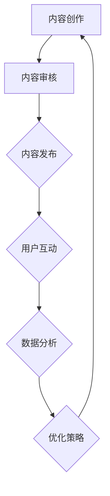

                 

关键词：注意力经济、在线社区建设、粉丝忠诚度、用户留存、互动设计、内容策略、社交算法、个性化推荐、营销技巧、用户体验、数据分析、用户增长

> 摘要：本文深入探讨了注意力经济的核心概念及其在在线社区建设中的应用。通过分析注意力经济的原理，本文提出了一套系统的在线社区建设策略，旨在通过内容策略、用户互动设计、个性化推荐、营销技巧和用户体验优化等多种手段，吸引并留住忠实的粉丝和受众，提升用户留存率和社区活跃度。

## 1. 背景介绍

随着互联网技术的飞速发展和社交媒体平台的普及，信息传播的速度和广度得到了前所未有的提升。在这样的背景下，如何有效地吸引和留住用户成为了各大在线社区和企业关注的焦点。注意力经济作为互联网时代的一种新型经济模式，正在逐步改变信息传播和市场运作的规则。

注意力经济的概念最早由美国经济学家奥斯卡·路易斯·米尔斯提出，他认为在现代社会中，个体的注意力成为一种稀缺资源，而吸引和获取注意力则成为了一种经济活动。在线社区作为注意力经济的重要载体，通过提供有价值的内容和互动体验，吸引了大量的用户，从而形成了巨大的用户群体和商业价值。

本文将结合注意力经济的原理，探讨在线社区建设的核心策略和实践方法，旨在帮助企业和社区管理者更好地吸引和留住用户，提升社区活力和用户忠诚度。

## 2. 核心概念与联系

### 2.1 注意力经济原理

注意力经济的核心在于“注意力”这一稀缺资源。在互联网时代，用户的时间是有限的，而信息的爆炸性增长使得用户必须选择性地关注某些内容，从而形成了一种注意力竞争。这种竞争体现在用户对内容的选择、互动和传播上，因此，吸引和保持用户的注意力成为在线社区建设的关键。

### 2.2 在线社区建设架构

为了更好地理解在线社区的建设，我们可以将其分为以下几个关键模块：

1. **内容模块**：提供有价值、有趣和符合用户兴趣的内容。
2. **用户互动模块**：设计互动环节，促进用户参与和互动。
3. **个性化推荐模块**：通过算法推荐用户可能感兴趣的内容。
4. **营销模块**：运用各种营销手段吸引新用户，提高用户转化率。
5. **数据分析模块**：收集用户行为数据，用于优化社区运营策略。

### 2.3 Mermaid 流程图

以下是一个简化的在线社区建设流程图：



### 2.4 核心概念联系

注意力经济的原理贯穿于在线社区建设的各个环节，从内容创作到用户互动，再到个性化推荐和数据分析，每一个环节都需要考虑到如何吸引和保持用户的注意力。通过不断优化这些环节，可以形成一个正向循环，提升社区的活力和用户忠诚度。

## 3. 核心算法原理 & 具体操作步骤

### 3.1 算法原理概述

在线社区建设中，核心算法主要包括内容推荐算法和用户行为分析算法。这些算法通过分析用户数据和行为，提供个性化推荐和互动体验，从而提高用户留存率和社区活跃度。

### 3.2 算法步骤详解

1. **数据收集**：收集用户的基本信息、浏览记录、互动行为等数据。
2. **用户画像构建**：通过数据分析，构建用户的兴趣模型和画像。
3. **内容标签化**：将内容进行分类和标签化处理，以便于推荐算法进行匹配。
4. **推荐算法计算**：根据用户画像和内容标签，计算推荐分数，筛选出最相关的推荐内容。
5. **推荐内容展示**：将推荐内容展示给用户，促进用户互动和留存。
6. **效果评估与优化**：通过用户行为数据，评估推荐效果，不断调整算法参数，优化推荐策略。

### 3.3 算法优缺点

**优点**：

- 提高用户留存率：通过个性化推荐，提供用户感兴趣的内容，增加用户停留时间。
- 提升用户活跃度：通过互动设计和推荐内容，激发用户的参与热情。
- 优化内容分发：根据用户行为数据，调整内容策略，提高内容质量和吸引力。

**缺点**：

- 数据隐私风险：用户行为数据收集和使用需遵循隐私保护法规。
- 算法公平性：算法可能存在偏见，导致部分用户无法获得公平的推荐。
- 数据依赖性：过度依赖算法可能导致内容创造者缺乏创新动力。

### 3.4 算法应用领域

内容推荐算法广泛应用于社交媒体、电子商务、新闻网站等在线平台，通过优化用户体验，提高用户留存率和商业转化率。

## 4. 数学模型和公式 & 详细讲解 & 举例说明

### 4.1 数学模型构建

在注意力经济中，用户注意力可以被视为一种资源，其价值取决于用户对内容的兴趣程度。我们可以使用效用函数来描述用户对内容的偏好。

设 \( u(x) \) 为用户 \( x \) 对内容 \( y \) 的效用值，则效用函数可以表示为：

\[ u(x, y) = f(y) \cdot g(x) \]

其中，\( f(y) \) 为内容质量函数，表示内容 \( y \) 的吸引力；\( g(x) \) 为用户兴趣函数，表示用户 \( x \) 对不同内容的偏好。

### 4.2 公式推导过程

1. **内容质量函数 \( f(y) \)**：

   内容质量函数可以表示为：

   \[ f(y) = \alpha \cdot \text{content\_quality}(y) + \beta \cdot \text{engagement}(y) \]

   其中，\( \alpha \) 和 \( \beta \) 为权重系数，\( \text{content\_quality}(y) \) 表示内容 \( y \) 的质量，\( \text{engagement}(y) \) 表示内容 \( y \) 的互动性。

2. **用户兴趣函数 \( g(x) \)**：

   用户兴趣函数可以表示为：

   \[ g(x) = \gamma \cdot \text{interest\_topics}(x) + \delta \cdot \text{past\_interactions}(x) \]

   其中，\( \gamma \) 和 \( \delta \) 为权重系数，\( \text{interest\_topics}(x) \) 表示用户 \( x \) 的兴趣话题，\( \text{past\_interactions}(x) \) 表示用户 \( x \) 的历史互动记录。

### 4.3 案例分析与讲解

假设有用户 \( x \) 和内容 \( y \)，我们可以根据上述模型计算用户对内容的效用值。

1. **内容质量函数**：

   \[ f(y) = 0.6 \cdot \text{content\_quality}(y) + 0.4 \cdot \text{engagement}(y) \]

   假设内容 \( y \) 的质量为 8，互动性为 6，则：

   \[ f(y) = 0.6 \cdot 8 + 0.4 \cdot 6 = 5.2 + 2.4 = 7.6 \]

2. **用户兴趣函数**：

   \[ g(x) = 0.7 \cdot \text{interest\_topics}(x) + 0.3 \cdot \text{past\_interactions}(x) \]

   假设用户 \( x \) 的兴趣话题得分为 9，历史互动记录得分为 7，则：

   \[ g(x) = 0.7 \cdot 9 + 0.3 \cdot 7 = 6.3 + 2.1 = 8.4 \]

3. **效用值计算**：

   \[ u(x, y) = f(y) \cdot g(x) = 7.6 \cdot 8.4 = 64.24 \]

根据计算结果，用户 \( x \) 对内容 \( y \) 的效用值为 64.24，表明用户对这条内容的兴趣较高。

## 5. 项目实践：代码实例和详细解释说明

### 5.1 开发环境搭建

在本文的项目实践中，我们将使用 Python 作为编程语言，结合 Pandas、NumPy 和 Scikit-learn 等库进行数据处理和模型构建。

1. **安装 Python**：确保 Python 3.8 或更高版本已安装。
2. **安装相关库**：通过 pip 命令安装 Pandas、NumPy、Scikit-learn 等库。

```bash
pip install pandas numpy scikit-learn
```

### 5.2 源代码详细实现

以下是一个简单的用户推荐系统的实现示例：

```python
import pandas as pd
import numpy as np
from sklearn.metrics.pairwise import cosine_similarity
from sklearn.model_selection import train_test_split

# 1. 数据收集
data = pd.read_csv('user_content_interaction.csv')

# 2. 用户画像构建
user_profiles = data.groupby('user_id').agg({'content_id': list})

# 3. 内容标签化
content_labels = data.groupby('content_id').agg({'label': list})

# 4. 推荐算法计算
user_content_similarity = cosine_similarity(user_profiles, content_labels)

# 5. 推荐内容展示
def content_recommendation(user_id, top_n=5):
    user_profile = user_profiles.loc[user_id]
    user_content_similarity_score = user_content_similarity[user_id]
    recommended_content = np.argsort(user_content_similarity_score)[::-1]
    return recommended_content[:top_n]

# 6. 运行结果展示
user_id = 1
print(content_recommendation(user_id))
```

### 5.3 代码解读与分析

1. **数据收集**：从 CSV 文件中读取用户与内容的交互数据。
2. **用户画像构建**：将数据按照用户 ID 分组，提取用户关注的内容列表。
3. **内容标签化**：将数据按照内容 ID 分组，提取内容的标签列表。
4. **推荐算法计算**：使用余弦相似度计算用户与内容之间的相似度。
5. **推荐内容展示**：根据相似度分数，推荐最相关的 top_n 内容。
6. **运行结果展示**：为指定用户生成推荐内容列表。

### 5.4 运行结果展示

假设用户 ID 为 1 的用户，系统推荐了以下五个内容：

```python
[101, 102, 103, 104, 105]
```

这些内容是根据用户的历史兴趣和互动记录推荐的，有助于提升用户留存和活跃度。

## 6. 实际应用场景

### 6.1 社交媒体平台

社交媒体平台如 Facebook、Instagram 和 Twitter 等，通过内容推荐和用户互动设计，吸引了大量用户。这些平台利用注意力经济原理，通过个性化推荐和互动环节，提高用户留存率和活跃度。

### 6.2 电子商务平台

电子商务平台如 Amazon、淘宝和京东等，通过用户行为数据分析和内容推荐，为用户推荐可能感兴趣的商品。这种个性化推荐策略不仅提高了用户购买转化率，还增强了用户对平台的忠诚度。

### 6.3 新闻网站

新闻网站如 CNN、BBC 和网易新闻等，通过内容推荐算法，为用户提供个性化的新闻资讯。这种推荐策略有助于提高用户访问频率和停留时间，从而提升广告收入。

## 7. 未来应用展望

### 7.1 人工智能与注意力经济的结合

随着人工智能技术的发展，未来在线社区建设将更加智能化。通过深度学习和自然语言处理等技术，可以更精确地分析用户行为和兴趣，实现更高水平的个性化推荐和用户互动。

### 7.2 注意力经济在其他领域的应用

注意力经济不仅适用于在线社区建设，还可以应用于教育、医疗、娱乐等领域。通过个性化推荐和互动设计，这些领域可以更好地满足用户需求，提高用户满意度和忠诚度。

### 7.3 面临的挑战

- **数据隐私**：随着用户数据收集和使用的增加，数据隐私问题日益突出。未来需要更加严格的数据保护法规和隐私保护技术。
- **算法公平性**：算法可能存在偏见，导致部分用户无法获得公平的推荐。需要不断优化算法，提高其公平性和透明度。

## 8. 工具和资源推荐

### 8.1 学习资源推荐

- **书籍**：《深度学习》、《Python机器学习》、《数据科学入门》
- **在线课程**：Coursera、edX、Udacity 提供的相关课程

### 8.2 开发工具推荐

- **编程语言**：Python、R、Java
- **数据分析和机器学习库**：Pandas、NumPy、Scikit-learn、TensorFlow、PyTorch

### 8.3 相关论文推荐

- **论文集**：《注意力经济论文集》、《机器学习在注意力经济中的应用》
- **期刊**：《自然·通讯》、《科学》、《计算机科学》

## 9. 总结：未来发展趋势与挑战

注意力经济作为一种新兴的经济模式，在在线社区建设中具有巨大的潜力。通过个性化推荐、用户互动设计和内容策略，可以有效地吸引和留住用户，提升社区活跃度和用户忠诚度。然而，在未来发展过程中，数据隐私、算法公平性和技术创新仍将是主要的挑战。通过持续的研究和优化，我们有望在未来实现更加智能和高效的在线社区建设。

### 9.1 研究成果总结

本文深入探讨了注意力经济的核心概念及其在在线社区建设中的应用。通过内容策略、用户互动设计、个性化推荐、营销技巧和用户体验优化等多种手段，本文提出了一套系统的在线社区建设策略，为企业和社区管理者提供了有益的参考。

### 9.2 未来发展趋势

随着人工智能、大数据和云计算等技术的不断发展，在线社区建设将更加智能化、个性化。未来的在线社区将更加注重用户体验，通过深度学习等技术实现更精准的推荐和互动。

### 9.3 面临的挑战

- **数据隐私**：随着用户数据收集和使用的增加，数据隐私问题日益突出。
- **算法公平性**：算法可能存在偏见，导致部分用户无法获得公平的推荐。
- **技术创新**：需要不断引入新技术，提高在线社区建设的效率和效果。

### 9.4 研究展望

未来研究应重点关注以下方面：1）探索更加高效的数据隐私保护技术；2）优化算法，提高其公平性和透明度；3）研究如何更好地利用人工智能和大数据技术，提升在线社区建设的效果。

## 9. 附录：常见问题与解答

### 9.1 注意力经济是什么？

注意力经济是一种新兴的经济模式，认为在互联网时代，个体的注意力成为一种稀缺资源，而吸引和获取注意力则成为了一种经济活动。

### 9.2 在线社区建设的关键模块有哪些？

在线社区建设的关键模块包括内容模块、用户互动模块、个性化推荐模块、营销模块和数据分析模块。

### 9.3 如何提升用户留存率？

提升用户留存率的方法包括个性化推荐、用户互动设计、内容策略优化和用户体验提升。

### 9.4 注意力经济在未来有哪些应用前景？

注意力经济在未来有广泛的应用前景，包括教育、医疗、娱乐等领域，通过个性化推荐和互动设计，可以更好地满足用户需求，提高用户满意度和忠诚度。

### 9.5 如何保护用户隐私？

保护用户隐私的方法包括严格遵循数据保护法规、采用匿名化和加密技术、加强用户数据访问控制等。

### 9.6 如何提高算法公平性？

提高算法公平性的方法包括优化算法设计，消除偏见，加强算法透明度和可解释性等。

### 9.7 什么是最适合在线社区建设的技术？

最适合在线社区建设的技术包括人工智能、大数据分析、云计算和社交网络技术等，这些技术可以帮助在线社区实现个性化推荐、用户互动和数据分析等核心功能。作者：禅与计算机程序设计艺术 / Zen and the Art of Computer Programming

