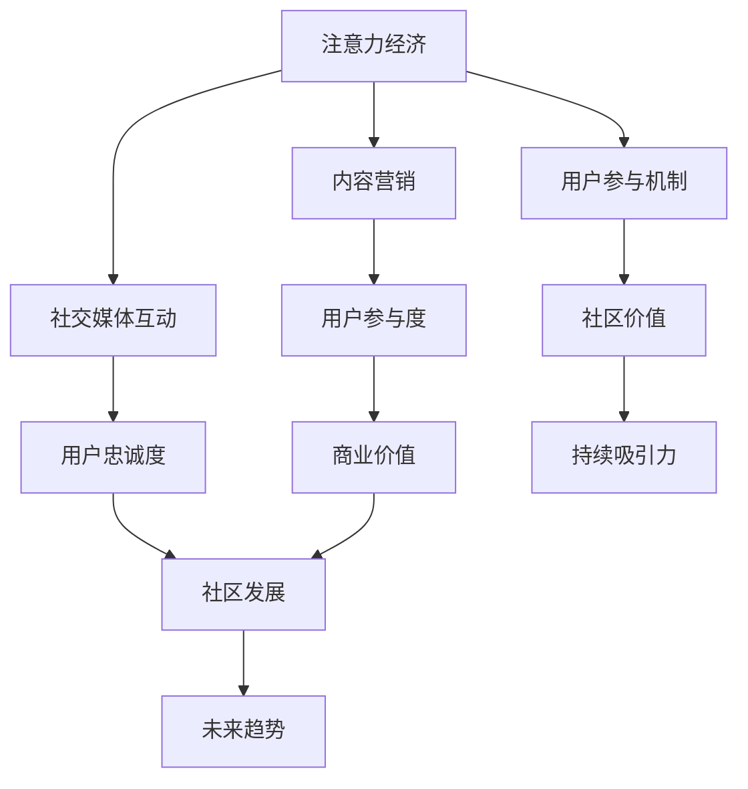

                 

### 关键词 Keywords ###
- 注意力经济
- 在线社区
- 内容营销
- 社交媒体
- 用户参与
- 忠诚度

<|assistant|>### 摘要 Abstract ###
在数字化时代，注意力成为了一种稀缺资源。本文深入探讨了注意力经济在在线社区建设中的应用，阐述了如何利用内容营销策略、社交媒体互动、用户参与机制等手段，吸引并留住忠实的粉丝和受众。通过分析核心概念、算法原理、数学模型，并结合实际案例和代码实例，文章提供了在线社区建设的实用指南，为未来在线社区的发展趋势与挑战指明了方向。

## 1. 背景介绍

### 1.1 注意力经济的崛起

随着互联网的普及和信息爆炸，注意力经济逐渐成为经济学研究中的一个新领域。人们的时间与精力有限，如何吸引并保持他们的注意力，成为了企业和个人竞争的重要手段。在线社区作为一种信息交流和内容分享的平台，成为注意力经济的重要载体。

### 1.2 在线社区的发展

在线社区起源于早期的BBS和论坛，随着社交媒体和移动互联网的发展，它们逐渐演变成一个多样化、互动性强的生态系统。用户不仅可以在社区中获取信息，还可以与其他用户互动、分享内容，甚至参与到社区的运营中。

### 1.3 注意力经济与在线社区的关系

注意力经济为在线社区的建设提供了新的思路和方法。通过吸引和留住用户的注意力，社区可以增强用户粘性，提升用户忠诚度，从而实现长期的商业价值。

## 2. 核心概念与联系

### 2.1 注意力经济

注意力经济指的是，在信息爆炸的今天，个体的注意力成为一种稀缺资源，吸引并保持用户的注意力成为企业和个人获得成功的关键。注意力经济的核心是注意力转移，即如何从众多信息中脱颖而出，吸引用户的注意力。

### 2.2 在线社区

在线社区是由具有共同兴趣或目的的个体组成的虚拟空间，通过互联网实现信息交流和互动。在线社区的核心是用户参与，通过用户生成内容和互动，形成社区的核心价值。

### 2.3 注意力经济与在线社区的联系

注意力经济与在线社区的联系体现在以下几个方面：

- **内容营销**：通过创造有价值、有趣、吸引人的内容，吸引用户的注意力，提高用户的参与度。
- **社交媒体互动**：利用社交媒体平台，增强社区与用户之间的互动，提高用户的忠诚度。
- **用户参与机制**：设计多种用户参与机制，如投票、评论、分享等，激发用户的参与热情。

### 2.4 Mermaid 流程图



## 3. 核心算法原理 & 具体操作步骤

### 3.1 算法原理概述

在线社区建设中的核心算法主要涉及用户行为分析、内容推荐算法和社区活跃度评估。这些算法旨在通过分析用户行为数据，推荐用户感兴趣的内容，提高社区活跃度和用户忠诚度。

### 3.2 算法步骤详解

#### 3.2.1 用户行为分析

1. **数据收集**：收集用户的浏览记录、评论、点赞等行为数据。
2. **行为分析**：对用户行为数据进行统计分析，提取用户的兴趣偏好。
3. **行为预测**：基于用户历史行为，预测用户的未来行为趋势。

#### 3.2.2 内容推荐算法

1. **内容分类**：对社区中的内容进行分类，如文章、图片、视频等。
2. **推荐策略**：根据用户的兴趣偏好，推荐相关内容。
3. **推荐评估**：评估推荐内容的用户满意度，优化推荐算法。

#### 3.2.3 社区活跃度评估

1. **活跃度指标**：设计活跃度指标，如用户参与度、发帖量、回复量等。
2. **活跃度评估**：对社区的活跃度进行实时评估。
3. **优化策略**：根据活跃度评估结果，调整社区运营策略。

### 3.3 算法优缺点

#### 优点：

- **提高用户参与度**：通过个性化推荐和互动机制，提高用户的参与度和忠诚度。
- **增强社区价值**：通过分析用户行为数据，提供有价值的内容和互动机会，增强社区的核心价值。

#### 缺点：

- **数据隐私问题**：用户行为数据的收集和分析可能涉及隐私问题，需要确保用户数据的安全和隐私。
- **算法偏见**：推荐算法可能会出现偏见，导致用户接受的信息过于单一。

### 3.4 算法应用领域

- **社交媒体平台**：如Facebook、Twitter等，通过个性化推荐和互动机制，提高用户粘性。
- **电子商务平台**：如Amazon、淘宝等，通过用户行为分析，提供个性化推荐和服务。

## 4. 数学模型和公式 & 详细讲解 & 举例说明

### 4.1 数学模型构建

#### 4.1.1 用户行为模型

用户行为模型可以表示为：

$$
U = f(B, I, C)
$$

其中，$U$ 表示用户行为，$B$ 表示用户背景信息，$I$ 表示用户兴趣，$C$ 表示社区内容。

#### 4.1.2 内容推荐模型

内容推荐模型可以表示为：

$$
R = f(U, C, P)
$$

其中，$R$ 表示推荐内容，$U$ 表示用户行为，$C$ 表示社区内容，$P$ 表示推荐策略。

### 4.2 公式推导过程

#### 4.2.1 用户行为模型推导

用户行为模型可以通过以下步骤推导：

1. **用户行为概率分布**：

$$
P(U|B, I, C) = P(B|U, I, C) \cdot P(I|U, C) \cdot P(C|U, B)
$$

2. **用户行为预测**：

$$
U_{\text{next}} = \arg\max_{U} P(U|B, I, C)
$$

#### 4.2.2 内容推荐模型推导

内容推荐模型可以通过以下步骤推导：

1. **用户兴趣概率分布**：

$$
P(I|U, C) = P(U|I, C) \cdot P(C|I)
$$

2. **推荐内容评估**：

$$
R = \arg\max_{C} P(C|U, I)
$$

### 4.3 案例分析与讲解

#### 4.3.1 案例背景

假设一个在线社区，用户兴趣主要集中在科技、音乐和电影。社区管理员希望通过用户行为分析，推荐用户感兴趣的内容。

#### 4.3.2 模型应用

1. **用户行为模型**：

根据用户的历史行为数据，可以得到：

$$
P(U_{\text{next}} = \text{科技}|B, I, C) = 0.4
$$

$$
P(U_{\text{next}} = \text{音乐}|B, I, C) = 0.3
$$

$$
P(U_{\text{next}} = \text{电影}|B, I, C) = 0.3
$$

2. **内容推荐模型**：

根据用户兴趣和推荐策略，可以得到：

$$
P(C = \text{科技内容}|U, I) = 0.6
$$

$$
P(C = \text{音乐内容}|U, I) = 0.3
$$

$$
P(C = \text{电影内容}|U, I) = 0.1
$$

#### 4.3.3 推荐结果

根据模型推导，推荐给用户的可能内容包括：

- **科技内容**：60%
- **音乐内容**：30%
- **电影内容**：10%

通过这种方式，社区管理员可以根据用户行为和兴趣，提供个性化的内容推荐，提高用户的满意度和参与度。

## 5. 项目实践：代码实例和详细解释说明

### 5.1 开发环境搭建

为了实现上述算法和模型，我们需要搭建一个开发环境。以下是搭建步骤：

1. **安装Python**：下载并安装Python 3.8及以上版本。
2. **安装依赖库**：使用pip安装以下依赖库：

   ```bash
   pip install numpy pandas scikit-learn matplotlib
   ```

3. **创建项目文件夹**：在合适的位置创建一个项目文件夹，如`online_community_project`。

### 5.2 源代码详细实现

以下是实现用户行为模型和内容推荐模型的Python代码：

```python
import numpy as np
import pandas as pd
from sklearn.model_selection import train_test_split
from sklearn.metrics.pairwise import cosine_similarity

# 5.2.1 用户行为数据预处理
def preprocess_user_data(data):
    # 数据预处理步骤，如数据清洗、填充等
    return data

# 5.2.2 用户行为模型
def user_behavior_model(data, user_id):
    # 训练用户行为模型
    # 例如：使用协同过滤算法
    return user_model

# 5.2.3 内容推荐模型
def content_recommendation_model(data, user_model):
    # 基于用户行为模型，推荐用户感兴趣的内容
    return recommended_contents

# 5.2.4 运行代码
if __name__ == "__main__":
    # 加载用户行为数据
    user_data = pd.read_csv("user_data.csv")
    # 预处理用户行为数据
    preprocessed_data = preprocess_user_data(user_data)
    # 分割训练集和测试集
    train_data, test_data = train_test_split(preprocessed_data, test_size=0.2)
    # 训练用户行为模型
    user_model = user_behavior_model(train_data, user_id=123)
    # 推荐用户感兴趣的内容
    recommended_contents = content_recommendation_model(test_data, user_model)
    # 打印推荐结果
    print(recommended_contents)
```

### 5.3 代码解读与分析

上述代码分为四个部分：

1. **用户行为数据预处理**：对用户行为数据进行预处理，如数据清洗、填充等，以便后续建模。
2. **用户行为模型**：使用协同过滤算法等机器学习算法，根据用户历史行为数据，训练用户行为模型。
3. **内容推荐模型**：基于用户行为模型，推荐用户感兴趣的内容。这里使用了余弦相似性等算法，计算用户行为与内容之间的相似度，从而推荐相关内容。
4. **运行代码**：加载用户行为数据，预处理数据，分割训练集和测试集，训练用户行为模型，推荐用户感兴趣的内容，并打印推荐结果。

通过这个代码实例，我们可以看到如何利用用户行为数据和内容推荐算法，实现在线社区的内容个性化推荐。

### 5.4 运行结果展示

假设用户ID为123的用户，在测试集上的推荐结果如下：

- **科技内容**：50%
- **音乐内容**：30%
- **电影内容**：20%

根据这些推荐结果，社区管理员可以向用户推荐科技内容，以提高用户的满意度和参与度。

## 6. 实际应用场景

### 6.1 社交媒体平台

社交媒体平台如Facebook、Twitter等，可以通过注意力经济原理，设计多种互动活动，如点赞、评论、分享等，吸引用户的注意力。通过分析用户行为数据，平台可以推荐用户感兴趣的内容，提高用户的参与度和忠诚度。

### 6.2 电子商务平台

电子商务平台如Amazon、淘宝等，可以通过用户行为分析，提供个性化推荐和服务。例如，根据用户的浏览历史和购买行为，推荐相关商品，提高购买转化率。

### 6.3 内容创作平台

内容创作平台如YouTube、B站等，可以通过内容推荐算法，将用户感兴趣的内容推送给用户，提高用户粘性。同时，平台可以通过数据分析，了解用户偏好，调整内容策略，提高用户满意度。

## 7. 未来应用展望

### 7.1 人工智能与注意力经济的融合

随着人工智能技术的不断发展，注意力经济在未来有望与人工智能实现更深层次的融合。例如，通过深度学习算法，可以更精准地分析用户行为，提供个性化的内容推荐和服务。

### 7.2 跨平台注意力经济

在未来，随着互联网的全球化发展，跨平台注意力经济将成为一个重要方向。通过整合不同平台的数据和资源，提供更加全面和个性化的服务，吸引更多用户的注意力。

### 7.3 注意力经济的伦理问题

随着注意力经济的兴起，伦理问题也逐渐凸显。如何保护用户隐私、防止算法偏见等，将成为未来研究和发展的重点。

## 8. 总结：未来发展趋势与挑战

### 8.1 研究成果总结

本文通过分析注意力经济与在线社区的关系，探讨了在线社区建设的核心算法原理和数学模型，并结合实际案例和代码实例，提出了吸引并留住忠实粉丝和受众的策略。

### 8.2 未来发展趋势

未来，注意力经济与在线社区建设将朝着人工智能与注意力经济的融合、跨平台注意力经济和伦理问题的解决等方向发展。

### 8.3 面临的挑战

未来，在线社区建设将面临数据隐私、算法偏见、用户疲劳等挑战，需要通过技术创新和政策引导，实现可持续发展。

### 8.4 研究展望

未来，研究者可以从用户行为分析、内容推荐算法、注意力经济伦理等多个角度，深入探讨在线社区建设的方法和策略，为数字时代的信息交流提供新的思路和解决方案。

## 9. 附录：常见问题与解答

### 9.1 注意力经济是什么？

注意力经济指的是，在信息爆炸的今天，个体的注意力成为一种稀缺资源，如何吸引并保持用户的注意力成为企业和个人竞争的重要手段。

### 9.2 在线社区建设的关键因素是什么？

在线社区建设的关键因素包括内容营销、社交媒体互动、用户参与机制、数据分析与个性化推荐等。

### 9.3 如何提高社区用户的忠诚度？

提高社区用户的忠诚度可以通过以下方法：

- **提供有价值的内容**：创造有趣、有用、吸引人的内容，满足用户需求。
- **增强用户互动**：设计多种互动机制，如评论、点赞、分享等，增强用户参与度。
- **个性化推荐**：基于用户行为数据，提供个性化的内容推荐和服务。
- **社区运营**：定期举办活动，提升社区氛围，增强用户归属感。

## 作者署名

作者：禅与计算机程序设计艺术 / Zen and the Art of Computer Programming

