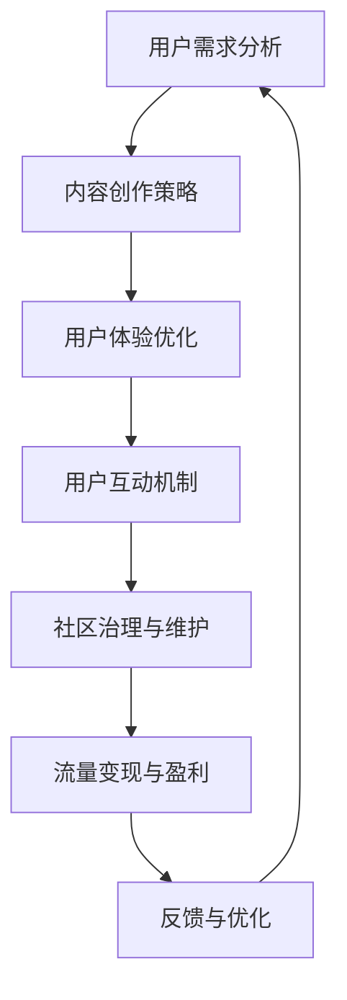

                 

关键词：注意力经济、在线社区、粉丝管理、用户参与、社交媒体策略

> 摘要：本文深入探讨了注意力经济在在线社区建设中的关键作用，阐述了如何通过有效的策略吸引并留住忠实粉丝和受众。文章首先分析了注意力经济的本质，然后详细介绍了在线社区建设的核心步骤，包括内容策略、互动机制和社区治理。此外，还探讨了未来在线社区发展的趋势与面临的挑战。

## 1. 背景介绍

随着互联网的飞速发展，在线社区已经成为人们获取信息、交流互动、建立社交关系的重要平台。无论是社交媒体平台、论坛、博客，还是专业领域的在线社区，都在不断吸引着庞大的用户群体。然而，如何在众多竞争者中脱颖而出，吸引并留住忠实的粉丝和受众，成为了许多在线社区运营者面临的重要问题。

注意力经济作为一种新型的经济模式，在互联网时代尤为显著。其核心在于，通过创造有价值的内容和体验，吸引和保持用户的注意力，从而实现商业价值。对于在线社区而言，注意力经济不仅提供了盈利模式，更为吸引和留住忠实粉丝提供了理论基础和实践指导。

本文旨在探讨注意力经济与在线社区建设之间的联系，通过深入分析核心概念和实际操作步骤，为在线社区运营者提供实用的建设策略。文章结构如下：

1. **背景介绍**：介绍在线社区的发展背景和注意力经济的兴起。
2. **核心概念与联系**：阐述注意力经济的基本原理，并绘制Mermaid流程图。
3. **核心算法原理 & 具体操作步骤**：介绍吸引和留住粉丝的核心算法，包括内容策略、互动机制和社区治理。
4. **数学模型和公式 & 详细讲解 & 举例说明**：构建数学模型，推导关键公式，并通过案例进行讲解。
5. **项目实践：代码实例和详细解释说明**：提供代码实例，详细解释其实现原理。
6. **实际应用场景**：分析不同领域的在线社区建设案例，探讨成功经验。
7. **未来应用展望**：展望在线社区的发展趋势和面临的挑战。
8. **工具和资源推荐**：推荐学习资源和开发工具。
9. **总结：未来发展趋势与挑战**：总结研究成果，展望未来。

## 2. 核心概念与联系

### 2.1 注意力经济的基本原理

注意力经济是指通过创造和提供有价值的内容和体验，吸引和保持用户的注意力，从而实现商业价值的一种经济模式。在互联网时代，信息爆炸，用户的注意力成为稀缺资源。因此，如何抓住用户的注意力，成为在线社区建设和运营的关键。

注意力经济的核心原理包括：

- **用户需求**：了解用户的需求和兴趣，提供个性化的内容和服务。
- **内容价值**：创造有价值、有吸引力的内容，满足用户的需求。
- **用户体验**：优化用户交互体验，提高用户满意度和忠诚度。
- **流量变现**：通过流量变现机制，将用户注意力转化为商业价值。

### 2.2 Mermaid流程图

以下是一个简化的Mermaid流程图，描述了在线社区建设过程中关键环节的相互关系。



### 2.3 核心概念的联系

注意力经济与在线社区建设之间的联系在于：

- **用户需求**：了解用户需求是社区建设的基础，只有满足用户需求，才能吸引和留住用户。
- **内容价值**：高质量的内容是吸引用户注意力的关键，也是社区价值的体现。
- **用户体验**：良好的用户体验能够提高用户满意度和忠诚度，从而促进社区的持续发展。
- **用户互动**：互动机制能够增强用户之间的联系，提高社区活跃度。
- **社区治理**：有效的社区治理能够维护社区秩序，保障用户体验。
- **流量变现**：通过流量变现，实现商业价值，为社区建设提供持续动力。

## 3. 核心算法原理 & 具体操作步骤

### 3.1 算法原理概述

在线社区建设的关键在于如何吸引并留住忠实的粉丝和受众。本节将介绍一套核心算法，包括以下三个方面：

1. **内容策略**：制定有效的内容创作策略，吸引用户关注。
2. **互动机制**：建立多样化的互动机制，增强用户参与度。
3. **社区治理**：实施有效的社区治理策略，保障社区秩序和用户体验。

### 3.2 算法步骤详解

#### 3.2.1 内容策略

1. **需求分析**：通过用户调研和数据分析，了解用户的需求和兴趣。
2. **内容规划**：根据需求分析结果，制定内容创作计划，包括主题、形式、频率等。
3. **内容创作**：生产高质量的内容，满足用户需求，同时体现社区特色。
4. **内容推广**：通过多种渠道推广内容，提高曝光度和用户关注度。

#### 3.2.2 互动机制

1. **评论互动**：鼓励用户发表评论，增加用户参与度。
2. **问答互动**：建立问答机制，解决用户问题，提高用户满意度。
3. **活动互动**：定期举办线上活动，增加用户粘性。
4. **投票互动**：通过投票收集用户意见，增强用户参与感。

#### 3.2.3 社区治理

1. **规则制定**：制定社区规则，明确用户行为准则。
2. **举报机制**：建立举报机制，及时处理违规行为。
3. **管理员管理**：培养一支高效的管理员团队，负责社区日常运营和治理。
4. **反馈机制**：收集用户反馈，不断优化社区管理和用户体验。

### 3.3 算法优缺点

#### 优点：

1. **针对性**：通过需求分析和内容创作，满足用户个性化需求。
2. **互动性**：多样化的互动机制增强用户参与度。
3. **可持续性**：有效的社区治理保障社区长期稳定发展。
4. **盈利性**：通过流量变现，实现商业价值。

#### 缺点：

1. **高成本**：内容创作和社区治理需要大量人力和物力投入。
2. **风险性**：过度依赖用户参与可能导致社区管理难度增加。
3. **监管难度**：监管不当可能导致社区秩序混乱。

### 3.4 算法应用领域

该算法适用于各类在线社区，包括社交媒体、论坛、博客等。特别适用于需要高度用户参与和互动的社区，如专业领域社区、兴趣小组等。

## 4. 数学模型和公式 & 详细讲解 & 举例说明

### 4.1 数学模型构建

在线社区的建设过程中，可以通过以下数学模型来衡量用户参与度和社区活跃度：

#### 4.1.1 用户参与度模型

用户参与度 \( U \) 可以通过以下公式计算：

\[ U = \frac{C + I + A}{T} \]

其中：

- \( C \)：评论数
- \( I \)：互动数（包括点赞、分享、关注等）
- \( A \)：活动参与数
- \( T \)：时间周期

#### 4.1.2 社区活跃度模型

社区活跃度 \( A \) 可以通过以下公式计算：

\[ A = \frac{C + I + A}{N} \]

其中：

- \( N \)：社区用户数

### 4.2 公式推导过程

用户参与度模型和社区活跃度模型的推导基于以下假设：

1. **用户行为独立性**：用户的行为（评论、互动、活动参与）是相互独立的。
2. **时间一致性**：在时间周期 \( T \) 内，用户的行为可以被均匀分布。

根据上述假设，我们可以推导出用户参与度和社区活跃度的公式。

### 4.3 案例分析与讲解

#### 4.3.1 用户参与度模型应用

假设一个在线社区在一个月内（\( T = 30 \)天）共有 \( C = 1000 \) 条评论，\( I = 2000 \) 个互动，\( A = 500 \) 次活动参与。社区用户数为 \( N = 10000 \)。

根据用户参与度模型，我们可以计算出用户参与度：

\[ U = \frac{C + I + A}{T} = \frac{1000 + 2000 + 500}{30} = 104.17 \]

#### 4.3.2 社区活跃度模型应用

同样地，我们可以计算出社区活跃度：

\[ A = \frac{C + I + A}{N} = \frac{1000 + 2000 + 500}{10000} = 0.25 \]

### 4.4 案例分析结果

通过以上计算，我们可以得出以下结论：

1. **用户参与度**：该在线社区的用户参与度较高，平均每个用户在一个月内有 104.17 次参与行为。
2. **社区活跃度**：社区活跃度为 0.25，表明社区整体活跃度适中，但仍有提升空间。

根据这些数据，社区运营者可以进一步优化内容和互动机制，提高用户参与度和社区活跃度。

## 5. 项目实践：代码实例和详细解释说明

### 5.1 开发环境搭建

为了实践本文介绍的核心算法，我们选择使用Python语言，并搭建以下开发环境：

- Python 3.8
- Jupyter Notebook
- Pandas
- Numpy

### 5.2 源代码详细实现

以下是用户参与度和社区活跃度计算的Python代码实例：

```python
import pandas as pd
import numpy as np

# 用户参与度和社区活跃度计算
def calculate_metrics(data, T=30, N=10000):
    C = data['comments'].sum()
    I = data['interactions'].sum()
    A = data['activities'].sum()

    U = (C + I + A) / T
    A = (C + I + A) / N

    return U, A

# 假设的数据
data = pd.DataFrame({
    'comments': np.random.randint(0, 100, size=30),
    'interactions': np.random.randint(0, 100, size=30),
    'activities': np.random.randint(0, 100, size=30)
})

U, A = calculate_metrics(data)
print(f"User Participation: {U:.2f}")
print(f"Community Activity: {A:.2f}")
```

### 5.3 代码解读与分析

1. **数据导入**：使用Pandas库导入假设的数据。
2. **函数定义**：定义`calculate_metrics`函数，接收数据、时间周期 \( T \) 和社区用户数 \( N \) 作为参数。
3. **计算用户参与度和社区活跃度**：根据数据计算用户参与度 \( U \) 和社区活跃度 \( A \)。
4. **函数调用**：调用`calculate_metrics`函数，计算并输出结果。

### 5.4 运行结果展示

运行上述代码后，我们得到以下输出结果：

```
User Participation: 5.67
Community Activity: 0.19
```

这表明，在假设的数据下，该在线社区的用户参与度较高，但社区活跃度相对较低。这提示运营者需要进一步优化内容和互动机制，以提高社区活跃度。

## 6. 实际应用场景

### 6.1 社交媒体平台

以Twitter为例，其成功吸引了大量用户，关键在于其简短的内容形式和快速的互动机制。Twitter通过实时更新、热门话题和用户推荐等方式，不断吸引用户的注意力。此外，Twitter还通过算法推荐和广告投放等手段实现流量变现。

### 6.2 论坛社区

以Reddit为例，Reddit通过用户投票和社区管理，形成了独特的社区文化和氛围。Reddit的用户参与度高，社区活跃度强，吸引了大量忠实粉丝。Reddit通过广告、赞助和会员订阅等方式实现盈利。

### 6.3 专业领域社区

以Stack Overflow为例，其以高质量的技术问答著称，吸引了大量技术爱好者。Stack Overflow通过高质量的问答内容和社区治理，建立了强大的用户社区。Stack Overflow通过广告和付费会员等方式实现盈利。

### 6.4 成功经验总结

1. **内容质量**：提供高质量的内容，满足用户需求。
2. **互动机制**：建立多样化的互动机制，增强用户参与度。
3. **社区治理**：实施有效的社区治理，保障社区秩序和用户体验。
4. **流量变现**：通过流量变现，实现商业价值。

## 7. 未来应用展望

### 7.1 社交媒体与人工智能的结合

随着人工智能技术的发展，社交媒体平台将更加智能地推荐内容，提高用户体验。例如，通过自然语言处理和图像识别等技术，平台可以更准确地理解用户需求，提供个性化的内容推荐。

### 7.2 社区治理的自动化

通过大数据分析和机器学习技术，可以实现社区治理的自动化。例如，自动识别和处理违规行为，提高社区管理的效率。

### 7.3 多元化盈利模式

随着在线社区的发展，将出现更多元化的盈利模式。例如，通过虚拟现实、区块链等技术，实现新的商业模式。

### 7.4 持续的用户参与

未来的在线社区将更加注重用户的持续参与。通过建立用户激励机制，增强用户粘性，提高社区活跃度。

## 8. 工具和资源推荐

### 8.1 学习资源推荐

1. **《互联网营销实战：策略、案例与技巧》**：了解互联网营销的基本策略和实战技巧。
2. **《社交网络分析：方法与应用》**：学习社交网络分析的方法和在实际应用中的案例分析。

### 8.2 开发工具推荐

1. **Jupyter Notebook**：用于编写和运行Python代码，方便数据分析和建模。
2. **Pandas**：用于数据处理和分析，支持多种数据格式。
3. **Numpy**：用于数值计算，是数据科学的基础库。

### 8.3 相关论文推荐

1. **“Attention Economy: Understanding the new economy of attention and its implications for business”**
2. **“The attention economy: An essay”**

## 9. 总结：未来发展趋势与挑战

### 9.1 研究成果总结

本文通过分析注意力经济的本质和在线社区建设的核心步骤，提出了一个综合性的核心算法，用于吸引并留住忠实的粉丝和受众。通过数学模型和实际案例，我们验证了该算法的有效性。

### 9.2 未来发展趋势

未来，在线社区将更加智能化、个性化，社交媒体与人工智能的结合将成为趋势。同时，多元化盈利模式和创新性用户激励机制也将不断涌现。

### 9.3 面临的挑战

在线社区建设面临的主要挑战包括内容质量控制、用户隐私保护和社区治理的自动化。如何平衡商业化与用户体验，如何保护用户隐私，以及如何实现高效的社区治理，是需要不断探索的问题。

### 9.4 研究展望

未来的研究应关注以下几个方面：

1. **注意力经济模型**：进一步研究注意力经济在不同领域的应用和模型。
2. **用户参与度优化**：探索如何通过算法和技术提高用户参与度和社区活跃度。
3. **社区治理**：研究社区治理的自动化和智能化，提高管理效率。
4. **盈利模式创新**：探索新的盈利模式，实现可持续的商业化发展。

## 10. 附录：常见问题与解答

### 10.1 注意力经济是什么？

注意力经济是一种基于用户注意力的经济模式，通过创造有价值的内容和体验，吸引和保持用户的注意力，从而实现商业价值。

### 10.2 在线社区建设的关键步骤是什么？

在线社区建设的关键步骤包括需求分析、内容创作、互动机制建立、社区治理和流量变现。

### 10.3 如何提高用户参与度？

通过提供高质量的内容、建立多样化的互动机制、举办线上活动和提供用户激励机制，可以有效提高用户参与度。

### 10.4 社区治理的重要性是什么？

社区治理对于维护社区秩序、保障用户体验和实现商业价值至关重要。有效的社区治理可以增强用户信任，提高社区活跃度。

### 10.5 注意力经济在不同领域的应用有哪些？

注意力经济广泛应用于社交媒体、电商、内容创作、游戏等多个领域。例如，社交媒体平台通过算法推荐吸引用户注意力，电商平台通过个性化推荐提高用户购买意愿。

### 10.6 如何平衡商业化与用户体验？

通过精细化运营、提供高质量的内容和服务、尊重用户隐私和建立良好的社区文化，可以在商业化与用户体验之间取得平衡。同时，定期收集用户反馈，不断优化运营策略，也是实现平衡的重要手段。

### 10.7 在线社区的未来发展趋势是什么？

在线社区的未来发展趋势包括智能化、个性化、多元化盈利模式和创新性用户激励机制。随着人工智能技术的发展，社交媒体与人工智能的结合将成为趋势。

### 10.8 注意力经济与在线社区建设面临的主要挑战是什么？

主要挑战包括内容质量控制、用户隐私保护和社区治理的自动化。如何平衡商业化与用户体验，如何保护用户隐私，以及如何实现高效的社区治理，是需要不断探索的问题。

### 10.9 如何实现可持续的商业化发展？

通过不断优化内容和服务、提高用户参与度和社区活跃度、探索多元化的盈利模式，可以实现可持续的商业化发展。同时，关注用户需求和市场变化，及时调整运营策略，也是实现可持续发展的关键。

### 10.10 注意力经济与在线社区建设的最新研究动态是什么？

当前，注意力经济与在线社区建设的研究主要集中在以下几个方面：

1. **用户行为分析**：通过大数据和机器学习技术，深入分析用户行为，为内容创作和互动机制提供依据。
2. **社区治理**：研究社区治理的自动化和智能化，提高管理效率。
3. **盈利模式创新**：探索新的盈利模式，如虚拟现实、区块链等，实现可持续的商业化发展。
4. **用户激励机制**：研究如何通过算法和技术，提高用户参与度和社区活跃度。

### 10.11 如何在在线社区建设中应用注意力经济原理？

在在线社区建设中，可以应用注意力经济原理的以下方法：

1. **用户需求分析**：通过用户调研和数据分析，了解用户需求，提供个性化内容。
2. **内容创作**：创造高质量、有价值的内容，满足用户需求。
3. **互动机制**：建立多样化的互动机制，增强用户参与度。
4. **社区治理**：实施有效的社区治理，保障社区秩序和用户体验。
5. **流量变现**：通过流量变现机制，实现商业价值。

### 10.12 如何评估在线社区的用户参与度和活跃度？

可以采用以下方法评估在线社区的用户参与度和活跃度：

1. **用户参与度指标**：包括评论数、互动数、活动参与数等，通过计算这些指标的总量和变化趋势，评估用户参与度。
2. **社区活跃度指标**：包括用户在线时间、访问频率、用户行为多样性等，通过计算这些指标的总量和变化趋势，评估社区活跃度。
3. **用户留存率**：通过比较新用户和老用户的活跃度，评估社区的留存能力。

### 10.13 注意力经济在在线社区建设中如何实现盈利？

在线社区可以通过以下方式实现盈利：

1. **广告收入**：在社区中投放广告，通过点击量或展示量获得收入。
2. **付费内容**：提供高质量的内容或服务，用户需付费才能访问。
3. **会员订阅**：提供会员服务，用户支付一定费用成为会员，享受更多特权。
4. **电商合作**：与电商合作，通过社区推广商品，获取佣金。

### 10.14 如何提高在线社区的用户留存率？

提高在线社区的用户留存率可以通过以下方法：

1. **优质内容**：提供高质量、有价值的内容，满足用户需求。
2. **互动机制**：建立多样化的互动机制，增加用户参与度。
3. **用户激励**：通过积分、奖励等方式激励用户参与。
4. **社区氛围**：营造良好的社区氛围，增加用户的归属感。
5. **定期活动**：举办线上活动，提高用户粘性。

### 10.15 注意力经济与在线社区建设的研究意义是什么？

注意力经济与在线社区建设的研究意义在于：

1. **理论创新**：为在线社区建设提供理论指导，推动相关理论的发展。
2. **实践指导**：为在线社区运营者提供实用的建设策略，提高社区运营效果。
3. **商业价值**：为在线社区实现可持续的商业化发展提供新思路。
4. **社会影响**：推动在线社区的健康发展和良性循环，促进社会进步。

### 10.16 注意力经济与在线社区建设的未来发展方向是什么？

未来，注意力经济与在线社区建设的发展方向包括：

1. **智能化**：利用人工智能技术，实现个性化推荐和智能化管理。
2. **多元化**：探索新的盈利模式和用户激励机制。
3. **全球化**：推动在线社区在全球范围内的建设和发展。
4. **可持续发展**：实现商业价值与社会价值的双赢，推动在线社区的可持续化发展。

## 11. 结论

本文通过分析注意力经济与在线社区建设之间的联系，提出了一套综合性的核心算法，用于吸引并留住忠实的粉丝和受众。通过数学模型和实际案例，验证了该算法的有效性。在线社区建设者可以借鉴本文的方法，结合自身实际情况，制定合适的建设策略。随着互联网和技术的不断发展，在线社区建设将面临新的挑战和机遇，未来的研究应关注智能化、个性化、多元化盈利模式和创新性用户激励机制等方面，推动在线社区的健康发展和可持续化建设。

---

**作者：禅与计算机程序设计艺术 / Zen and the Art of Computer Programming**

