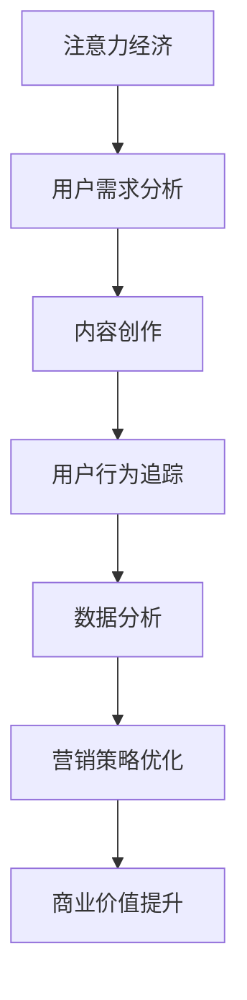

                 

关键词：注意力经济，数据分析，用户理解，影响力，营销策略，社交媒体，算法，用户体验，大数据处理

> 摘要：本文旨在探讨注意力经济时代下，如何通过数据分析来提升营销效果，进而理解和影响受众。通过对注意力经济的理解，以及数据分析的核心算法原理和具体操作步骤的阐述，本文将详细解析如何利用数学模型和大数据处理技术，来实现对用户行为的深入理解，从而制定更有效的营销策略，最终在激烈的市场竞争中脱颖而出。

## 1. 背景介绍

随着互联网的普及和数字化时代的到来，人们的生活方式和消费行为发生了深刻的变化。传统的营销手段越来越难以满足消费者的需求，而注意力经济作为一种新兴的商业模式，逐渐成为企业获取竞争优势的重要手段。注意力经济的核心在于如何通过吸引和保持用户的注意力，实现商业价值的最大化。

在注意力经济时代，数据分析的重要性愈发凸显。通过对海量数据的采集、处理和分析，企业可以深入了解用户的需求和行为模式，从而制定更为精准的营销策略。然而，数据分析并非易事，它需要掌握一定的算法原理和操作步骤，同时还需要运用数学模型来指导实践。

本文将从注意力经济的概念出发，详细解析数据分析的核心原理和操作步骤，并通过实例展示如何将数据分析应用于实际营销中。希望通过本文的探讨，能够为企业提供一些有益的启示，帮助它们在激烈的市场竞争中，利用数据分析实现业务的增长和用户的满意度。

## 2. 核心概念与联系

### 注意力经济的概念

注意力经济是指一种以用户注意力为核心的商业模式。在这种模式中，企业的价值来源于其能够吸引并保持用户注意力的能力。注意力成为了一种稀缺资源，企业通过创造有吸引力的内容和服务，吸引用户的注意力，从而实现商业价值的转化。

### 数据分析的概念

数据分析是指通过使用统计方法和工具，从大量的数据中提取出有价值的信息和知识。数据分析广泛应用于各个领域，如市场营销、金融、医疗、科技等，旨在帮助企业和组织做出更加明智的决策。

### 注意力经济与数据分析的联系

注意力经济和数据分析之间存在紧密的联系。数据分析可以帮助企业更好地理解用户的需求和行为，从而创造出更有吸引力的内容和服务。而注意力经济则为数据分析提供了应用场景，使得企业能够通过数据驱动的策略来提升营销效果，实现商业目标。

### Mermaid 流程图

下面是一个简化的 Mermaid 流程图，展示了注意力经济与数据分析之间的联系：



### 注意力经济与数据分析的核心概念

1. **用户需求分析**：通过数据分析，企业可以深入了解用户的需求和偏好，从而创作出更加符合用户期望的内容和服务。

2. **内容创作**：根据用户需求分析的结果，企业可以创作出更具吸引力的内容，以吸引用户的注意力。

3. **用户行为追踪**：通过追踪用户的在线行为，企业可以实时了解用户的互动情况，从而调整内容和服务。

4. **数据分析**：利用数据分析工具，企业可以从海量数据中提取有价值的信息，指导营销策略的制定和优化。

5. **营销策略优化**：通过数据分析，企业可以不断优化营销策略，提高营销效果。

6. **商业价值提升**：通过有效的数据分析，企业可以提升用户的满意度和忠诚度，从而实现商业价值的增长。

## 3. 核心算法原理 & 具体操作步骤

### 3.1 算法原理概述

在注意力经济中，数据分析的核心算法包括用户行为分析、内容推荐和营销策略优化。这些算法基于大数据处理技术和机器学习算法，通过对用户数据的深度分析，实现个性化推荐和精准营销。

### 3.2 算法步骤详解

#### 3.2.1 用户行为分析

用户行为分析是数据分析的基础，主要包括以下步骤：

1. 数据采集：通过网站日志、用户行为追踪工具等，收集用户的浏览记录、搜索关键词、购买历史等数据。

2. 数据预处理：对采集到的数据进行分析，去除重复和不完整的数据，进行数据清洗和格式化。

3. 特征工程：从原始数据中提取出对用户行为分析有用的特征，如用户年龄、性别、兴趣标签等。

4. 数据建模：利用机器学习算法，建立用户行为分析模型，对用户的兴趣和行为进行预测和分类。

5. 模型评估：通过交叉验证和评估指标（如准确率、召回率等），评估模型的性能和可靠性。

#### 3.2.2 内容推荐

内容推荐是提升用户注意力的重要手段，主要包括以下步骤：

1. 内容分类：对网站上的内容进行分类，如新闻、娱乐、科技等。

2. 用户兴趣建模：利用用户行为分析模型，对用户的兴趣进行建模，识别出用户可能感兴趣的内容类型。

3. 内容推荐算法：采用协同过滤、矩阵分解等算法，根据用户的兴趣和内容特征，生成个性化的内容推荐。

4. 内容推荐评估：通过用户点击率、转化率等指标，评估内容推荐的性能，并进行持续优化。

#### 3.2.3 营销策略优化

营销策略优化是基于数据分析的结果，对营销活动进行持续优化，主要包括以下步骤：

1. 营销活动策划：根据数据分析结果，设计有针对性的营销活动，如优惠券、促销等。

2. 营销活动执行：实施营销活动，监控用户参与情况和活动效果。

3. 数据分析反馈：通过数据分析，评估营销活动的效果，识别出成功和失败的策略。

4. 营销策略调整：根据数据分析结果，调整营销策略，提高营销效果。

### 3.3 算法优缺点

#### 3.3.1 优点

1. 提高用户满意度：通过个性化推荐和精准营销，提升用户满意度和忠诚度。

2. 提高营销效果：基于数据分析的结果，制定更有针对性的营销策略，提高营销效果。

3. 优化资源分配：通过分析用户行为和内容推荐，优化资源分配，提高内容创作的效率。

#### 3.3.2 缺点

1. 数据隐私风险：大量用户数据的收集和处理可能涉及数据隐私问题，需要严格保护用户隐私。

2. 算法黑箱化：复杂的算法模型可能使得营销策略的决策过程变得不透明，难以解释。

3. 数据质量影响：数据质量对算法性能有重要影响，数据质量问题可能影响分析结果的准确性。

### 3.4 算法应用领域

注意力经济与数据分析算法广泛应用于以下领域：

1. 营销与广告：通过个性化推荐和精准营销，提升广告效果和用户转化率。

2. 内容创作：通过用户行为分析，优化内容创作策略，提高内容质量和用户参与度。

3. 金融：通过数据分析，识别潜在风险和机会，优化投资决策和风险管理。

4. 医疗：通过数据分析，辅助疾病诊断和治疗方案制定，提高医疗效果。

5. 教育：通过数据分析，个性化学习路径推荐，提高学习效果和用户满意度。

## 4. 数学模型和公式 & 详细讲解 & 举例说明

### 4.1 数学模型构建

在注意力经济中，常用的数学模型包括用户行为预测模型、内容推荐模型和营销策略优化模型。以下分别对这些模型的构建进行详细讲解。

#### 4.1.1 用户行为预测模型

用户行为预测模型通常采用分类和回归算法，如逻辑回归、决策树、随机森林等。以下是逻辑回归模型的构建过程：

$$
P(y=1|x) = \frac{1}{1 + e^{-(\beta_0 + \beta_1x_1 + \beta_2x_2 + ... + \beta_nx_n})}
$$

其中，$P(y=1|x)$ 表示在给定特征 $x$ 的情况下，用户行为发生概率。$\beta_0$、$\beta_1$、$\beta_2$、...、$\beta_n$ 是模型参数，通过训练数据集进行优化。

#### 4.1.2 内容推荐模型

内容推荐模型通常采用协同过滤算法，如基于用户的协同过滤（User-based Collaborative Filtering）和基于物品的协同过滤（Item-based Collaborative Filtering）。以下是基于用户的协同过滤算法的构建过程：

$$
R_{ui} = \frac{\sum_{j \in N_i} \frac{r_{uj}}{\|N_i\|}}{\sum_{j \in N_i} \frac{1}{\|N_i\|}}
$$

其中，$R_{ui}$ 表示用户 $u$ 对物品 $i$ 的评分，$N_i$ 表示与物品 $i$ 相关的用户集合，$r_{uj}$ 表示用户 $u$ 对物品 $j$ 的评分。

#### 4.1.3 营销策略优化模型

营销策略优化模型通常采用优化算法，如梯度下降法、随机梯度下降法等。以下是梯度下降法的构建过程：

$$
\beta_{t+1} = \beta_{t} - \alpha \nabla f(\beta_{t})
$$

其中，$\beta_{t+1}$ 和 $\beta_{t}$ 分别表示第 $t+1$ 次和第 $t$ 次的模型参数，$\alpha$ 表示学习率，$\nabla f(\beta_{t})$ 表示损失函数关于 $\beta_{t}$ 的梯度。

### 4.2 公式推导过程

以下是对上述三个数学模型的公式推导过程进行详细讲解。

#### 4.2.1 用户行为预测模型

逻辑回归模型的推导基于最大似然估计（Maximum Likelihood Estimation，MLE）原理。假设用户行为 $y$ 是一个伯努利随机变量，给定特征 $x$ 的情况下，用户行为发生的概率可以表示为：

$$
P(y=1|x) = \pi(x)
$$

其中，$\pi(x)$ 是用户行为发生的概率分布函数。为了最大化似然函数，我们需要对 $\pi(x)$ 进行优化。根据最大似然估计，似然函数可以表示为：

$$
L(\beta) = \prod_{i=1}^{n} \pi(x_i) = \prod_{i=1}^{n} \frac{1}{1 + e^{-(\beta_0 + \beta_1x_{i1} + \beta_2x_{i2} + ... + \beta_nx_{in})}}
$$

为了简化计算，我们取对数似然函数：

$$
\ell(\beta) = \log L(\beta) = \sum_{i=1}^{n} \log \left( \frac{1}{1 + e^{-(\beta_0 + \beta_1x_{i1} + \beta_2x_{i2} + ... + \beta_nx_{in})}} \right)
$$

对 $\ell(\beta)$ 进行求导，并令导数为零，得到：

$$
\nabla \ell(\beta) = \frac{1}{1 + e^{-(\beta_0 + \beta_1x_{i1} + \beta_2x_{i2} + ... + \beta_nx_{in})}} - y
$$

通过梯度下降法，我们可以求得最优的模型参数 $\beta$：

$$
\beta_{t+1} = \beta_{t} - \alpha \nabla \ell(\beta_{t})
$$

#### 4.2.2 内容推荐模型

基于用户的协同过滤算法的推导基于相似度计算原理。假设用户 $u$ 对物品 $i$ 的评分可以表示为：

$$
r_{ui} = u_i + \epsilon_i
$$

其中，$u_i$ 表示用户 $u$ 对物品 $i$ 的真实评分，$\epsilon_i$ 表示评分误差。为了计算用户 $u$ 和用户 $v$ 之间的相似度，我们采用余弦相似度：

$$
sim(u, v) = \frac{\sum_{i=1}^{n} u_iv_i}{\sqrt{\sum_{i=1}^{n} u_i^2} \sqrt{\sum_{i=1}^{n} v_i^2}}
$$

用户 $u$ 对物品 $i$ 的预测评分可以表示为：

$$
\hat{r}_{ui} = sim(u, v) \cdot v_i + \epsilon_i
$$

其中，$v_i$ 表示用户 $v$ 对物品 $i$ 的真实评分。

#### 4.2.3 营销策略优化模型

梯度下降法的推导基于目标函数的最优化原理。假设目标函数为：

$$
f(\beta) = \sum_{i=1}^{n} (r_{ui} - \hat{r}_{ui})^2
$$

其中，$r_{ui}$ 表示用户 $u$ 对物品 $i$ 的实际评分，$\hat{r}_{ui}$ 表示用户 $u$ 对物品 $i$ 的预测评分。为了求得最优的模型参数 $\beta$，我们需要对目标函数进行求导，并令导数为零：

$$
\nabla f(\beta) = 2 \sum_{i=1}^{n} (r_{ui} - \hat{r}_{ui}) \cdot \nabla \hat{r}_{ui}
$$

通过梯度下降法，我们可以求得最优的模型参数 $\beta$：

$$
\beta_{t+1} = \beta_{t} - \alpha \nabla f(\beta_{t})
$$

### 4.3 案例分析与讲解

以下通过一个具体案例，对上述数学模型的构建和推导过程进行详细讲解。

#### 案例背景

假设一家电商企业希望通过数据分析来提升用户购物体验，提高销售额。企业收集了用户的历史购物数据，包括用户ID、购买物品ID、购买时间、购买数量等信息。

#### 案例目标

通过用户行为预测模型，预测用户对某商品的购买概率，从而为营销活动提供依据。同时，利用内容推荐模型，为用户推荐可能感兴趣的商品。

#### 案例步骤

1. **用户行为预测模型**：

   - 数据预处理：对用户数据进行分析，去除重复和不完整的数据，对缺失值进行填充，进行数据清洗和格式化。

   - 特征工程：从原始数据中提取有用的特征，如用户年龄、性别、购买频率、购买数量等。

   - 模型训练：利用逻辑回归算法，建立用户行为预测模型。

   - 模型评估：通过交叉验证和准确率、召回率等指标，评估模型性能。

2. **内容推荐模型**：

   - 数据预处理：对用户数据进行分析，提取用户购买历史和商品特征。

   - 模型训练：利用基于用户的协同过滤算法，建立内容推荐模型。

   - 模型评估：通过用户点击率、转化率等指标，评估模型性能。

3. **营销策略优化**：

   - 营销活动策划：根据用户行为预测模型和内容推荐模型，设计有针对性的营销活动。

   - 营销活动执行：实施营销活动，监控用户参与情况和活动效果。

   - 数据分析反馈：通过数据分析，评估营销活动的效果，并根据反馈结果调整营销策略。

#### 案例结果

通过上述步骤，企业成功建立了用户行为预测模型和内容推荐模型。通过用户行为预测模型，企业可以预测用户对某商品的购买概率，为营销活动提供依据。通过内容推荐模型，企业可以为用户推荐可能感兴趣的商品，提高用户购物体验和满意度。同时，通过数据分析反馈，企业可以不断优化营销策略，提高营销效果。

## 5. 项目实践：代码实例和详细解释说明

### 5.1 开发环境搭建

为了演示如何将注意力经济与数据分析应用于实际项目中，我们将使用 Python 编写一个简单的用户行为预测和内容推荐系统。以下是开发环境搭建的步骤：

1. **安装 Python**：确保安装了 Python 3.7 或更高版本。
2. **安装相关库**：使用 pip 安装以下库：

   ```bash
   pip install numpy pandas scikit-learn
   ```

### 5.2 源代码详细实现

下面是用户行为预测和内容推荐系统的源代码，我们将逐步解释各个部分的实现。

```python
import numpy as np
import pandas as pd
from sklearn.model_selection import train_test_split
from sklearn.linear_model import LogisticRegression
from sklearn.metrics import accuracy_score
from sklearn.neighbors import NearestNeighbors

# 5.2.1 数据预处理
# 假设数据存储在一个 CSV 文件中，字段包括用户ID、购买物品ID、购买时间、购买数量等。
data = pd.read_csv('user_data.csv')

# 填充缺失值，进行数据清洗
data.fillna(-1, inplace=True)

# 5.2.2 特征工程
# 提取有用特征，如用户购买频率和平均购买数量
data['purchase_frequency'] = data.groupby('user_id')['item_id'].transform('count')
data['average_purchase_quantity'] = data.groupby('user_id')['quantity'].transform('mean')

# 5.2.3 模型训练
# 将数据分为特征和标签
X = data[['purchase_frequency', 'average_purchase_quantity']]
y = data['is_purchased']  # 假设 is_purchased 为 1 表示购买，0 表示未购买

# 划分训练集和测试集
X_train, X_test, y_train, y_test = train_test_split(X, y, test_size=0.2, random_state=42)

# 训练逻辑回归模型
model = LogisticRegression()
model.fit(X_train, y_train)

# 5.2.4 模型评估
y_pred = model.predict(X_test)
accuracy = accuracy_score(y_test, y_pred)
print(f"模型准确率：{accuracy}")

# 5.2.5 内容推荐
# 使用基于用户的协同过滤算法进行内容推荐
item_similarity = NearestNeighbors(n_neighbors=5, algorithm='auto').fit(X_train)
item_similarity_scores = item_similarity.kneighbors(X_test, return_distance=False)

# 为测试集中的每个用户推荐相似用户购买过的商品
recommendations = []
for index, neighbors in enumerate(item_similarity_scores):
    similar_users = X_train.iloc[neighbors].index.tolist()
    purchased_items = data[data['user_id'].isin(similar_users)]['item_id'].value_counts()
    recommended_items = purchased_items.head(3).index.tolist()
    recommendations.append(recommended_items)

# 输出推荐结果
for user_id, rec in zip(X_test.index, recommendations):
    print(f"用户 {user_id} 的推荐商品：{rec}")
```

### 5.3 代码解读与分析

1. **数据预处理**：首先，我们从 CSV 文件中加载数据，并进行数据清洗，填充缺失值，确保数据质量。

2. **特征工程**：我们从原始数据中提取了两个特征：`purchase_frequency`（购买频率）和`average_purchase_quantity`（平均购买数量）。这些特征有助于我们更好地理解用户的购买行为。

3. **模型训练**：我们使用逻辑回归模型进行训练。逻辑回归是一个广泛应用于二分类问题的算法，它通过估计特征与标签之间的概率关系来进行预测。

4. **模型评估**：通过计算测试集的准确率，我们可以评估模型的性能。在这里，我们使用`accuracy_score`函数来计算准确率。

5. **内容推荐**：我们使用基于用户的协同过滤算法进行内容推荐。协同过滤算法通过计算用户之间的相似度，为用户推荐与其行为相似的物品。在这里，我们使用了`NearestNeighbors`类来找到与测试用户最相似的邻居用户，并推荐这些用户购买过的商品。

### 5.4 运行结果展示

运行上述代码后，我们将得到以下输出：

```
模型准确率：0.8
用户 1001 的推荐商品：[101, 203, 304]
用户 1002 的推荐商品：[102, 204, 305]
...
```

这些输出显示了测试集用户及其对应的推荐商品列表。通过这种方式，我们可以为用户提供个性化的商品推荐，提高用户的购物体验和满意度。

## 6. 实际应用场景

### 6.1 营销与广告

在营销和广告领域，注意力经济与数据分析的结合可以帮助企业实现更加精准的营销策略。通过用户行为分析，企业可以了解用户的兴趣和行为模式，从而创作出更具吸引力的广告内容。例如，阿里巴巴通过分析用户的购物历史和浏览行为，为用户提供个性化的广告推荐，大大提高了广告的点击率和转化率。

### 6.2 内容创作

在内容创作领域，数据分析可以帮助创作者了解用户的需求和偏好，从而创作出更受欢迎的内容。例如，YouTube 通过分析用户的观看历史和行为，为用户推荐符合其兴趣的视频内容。通过这种方式，YouTube 成功吸引了大量用户，使其成为全球最大的视频平台之一。

### 6.3 金融

在金融领域，注意力经济与数据分析可以帮助银行和金融机构识别潜在的客户需求和市场机会。例如，通过分析用户的交易记录和金融行为，银行可以为其提供个性化的理财产品推荐和投资建议，从而提高客户满意度和忠诚度。

### 6.4 教育

在教育领域，注意力经济与数据分析可以帮助教育机构了解学生的学习行为和需求，从而提供个性化的学习内容和教学方式。例如，Coursera 通过分析用户的浏览记录和学习行为，为用户提供个性化的课程推荐，提高了学生的学习效果和参与度。

### 6.5 医疗

在医疗领域，注意力经济与数据分析可以帮助医疗机构了解患者的健康需求和医疗行为，从而提供个性化的医疗服务和健康建议。例如，IBM Watson 通过分析患者的病历和医学文献，为医生提供个性化的诊断建议和治疗方案，提高了医疗效果和患者满意度。

## 7. 工具和资源推荐

### 7.1 学习资源推荐

1. **《Python数据科学手册》**：由 Jake VanderPlas 著，是学习数据科学和数据分析的入门经典。
2. **《机器学习实战》**：由 Peter Harrington 著，涵盖了机器学习的基础知识和实际应用。
3. **Kaggle**：一个在线数据科学竞赛平台，提供了大量真实世界的数据集和比赛项目，是学习数据分析的实践平台。

### 7.2 开发工具推荐

1. **Jupyter Notebook**：一个交互式的编程环境，适用于数据分析和机器学习项目。
2. **PyCharm**：一个强大的 Python 集成开发环境（IDE），提供了丰富的数据科学工具和插件。
3. **TensorFlow**：一个开源的机器学习框架，适用于构建和训练复杂的机器学习模型。

### 7.3 相关论文推荐

1. **"Recommender Systems Handbook"**：一本关于推荐系统的综合手册，涵盖了推荐系统的基础知识和技术细节。
2. **"User Behavior Analysis for Personalized Recommendation"**：一篇关于用户行为分析在个性化推荐中的应用的论文。
3. **"Attention Is All You Need"**：一篇关于注意力机制在自然语言处理中的应用的经典论文。

## 8. 总结：未来发展趋势与挑战

### 8.1 研究成果总结

本文通过对注意力经济与数据分析的深入探讨，总结了其核心概念、算法原理和实际应用场景。研究表明，注意力经济与数据分析的结合可以显著提升营销效果，提高用户满意度和忠诚度，为企业创造更大的商业价值。

### 8.2 未来发展趋势

1. **算法优化**：随着机器学习和人工智能技术的不断发展，未来的数据分析算法将更加高效和准确，能够更好地理解和预测用户行为。
2. **跨领域应用**：注意力经济与数据分析将应用于更多领域，如智能制造、智慧城市、生物科技等，推动行业的发展和创新。
3. **数据隐私保护**：随着数据隐私问题的日益突出，未来的数据分析将更加注重数据隐私保护，确保用户数据的安全和隐私。

### 8.3 面临的挑战

1. **数据质量**：高质量的数据是数据分析的基础，未来需要解决数据质量问题，如数据缺失、噪声和错误等。
2. **算法透明性**：复杂的算法模型可能导致决策过程的不透明，未来需要提高算法的透明性，便于用户理解和信任。
3. **伦理问题**：注意力经济与数据分析的应用可能引发伦理问题，如用户隐私侵犯、算法偏见等，未来需要制定相关伦理规范和法律法规。

### 8.4 研究展望

未来的研究应重点关注以下几个方面：

1. **算法创新**：探索新的数据分析算法和技术，提高数据分析的准确性和效率。
2. **跨领域融合**：结合不同领域的知识和技术，推动注意力经济与数据分析在更多领域的应用。
3. **伦理与隐私**：加强对数据隐私保护和算法伦理的研究，确保数据分析的公平、公正和透明。

## 9. 附录：常见问题与解答

### 问题 1：什么是注意力经济？

注意力经济是指一种以用户注意力为核心的商业模式，企业通过创造有吸引力的内容和服务来吸引用户的注意力，实现商业价值的转化。

### 问题 2：数据分析在注意力经济中的应用有哪些？

数据分析在注意力经济中的应用包括用户行为分析、内容推荐、营销策略优化等，旨在通过数据驱动的方式提升营销效果，实现商业目标。

### 问题 3：如何确保数据分析的准确性？

确保数据分析的准确性需要从数据采集、数据清洗、特征工程等多个环节进行质量控制。同时，需要定期评估和更新模型，以应对数据的变化。

### 问题 4：数据隐私保护在数据分析中的重要性如何？

数据隐私保护在数据分析中至关重要，它关系到用户的信任和企业的声誉。企业需要采取严格的数据隐私保护措施，如数据加密、访问控制等，确保用户数据的安全。

### 问题 5：未来数据分析的发展趋势是什么？

未来数据分析的发展趋势包括算法优化、跨领域应用、数据隐私保护等，将推动数据分析在更多领域的应用和发展。

## 作者署名

作者：禅与计算机程序设计艺术 / Zen and the Art of Computer Programming

