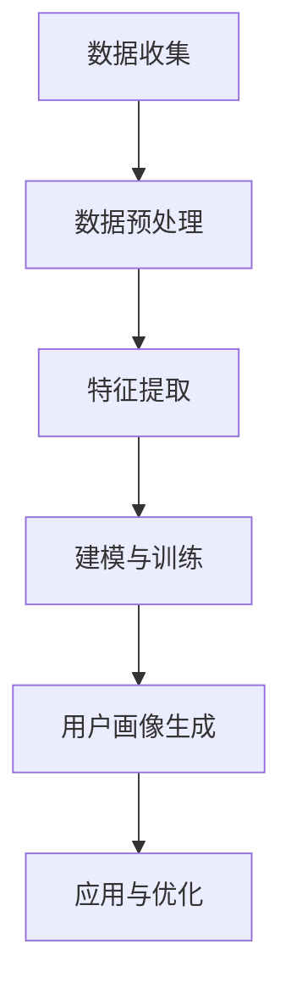

                 

关键词：注意力经济、数据分析、受众行为、用户画像、算法原理

摘要：本文旨在探讨注意力经济时代下，如何通过数据分析洞见，深入理解受众行为。首先，我们将介绍注意力经济的基本概念及其对现代营销和业务模式的影响。接着，我们将阐述数据分析的核心概念和重要性，特别是在理解受众行为方面的应用。文章还将详细解释用户画像技术的原理和构建方法，以及如何利用这些技术来优化营销策略和用户体验。此外，我们将讨论数据分析在不同行业中的应用案例，并展望未来发展趋势。最后，我们将总结研究成果，探讨面临的挑战，并提出研究展望。

## 1. 背景介绍

随着互联网的普及和移动设备的广泛使用，人们的生活方式和消费习惯发生了巨大的变化。在这个信息爆炸的时代，消费者的注意力变得愈发稀缺和宝贵。注意力经济（Attention Economy）的概念因此应运而生。注意力经济指的是在信息过载的社会中，人们的注意力成为一种有限的资源，企业和个人为了获得更多的关注和影响力，必须争夺和吸引受众的注意力。

### 1.1 注意力经济的兴起

注意力经济的概念最早由美国科技作家Tiago Peixoto提出，他在2006年的论文《Attention Economy》中阐述了这一现象。随着社交媒体、在线广告和内容营销的兴起，注意力经济逐渐成为现代营销和业务模式的重要组成部分。

### 1.2 注意力经济的影响

注意力经济对市场营销和业务模式产生了深远的影响。首先，它改变了消费者的决策过程，使得个性化的用户体验变得至关重要。其次，它促使企业更加关注用户行为数据的价值，通过数据分析和用户画像技术来精准定位受众，提高营销效果。此外，注意力经济也推动了内容创作和传播方式的变革，优质内容和创新形式成为吸引注意力的关键。

## 2. 核心概念与联系

在深入探讨注意力经济与数据分析之间的关系之前，我们需要明确几个核心概念，包括用户画像、数据挖掘和机器学习等。

### 2.1 用户画像

用户画像是一种基于用户行为数据构建的虚拟模型，它包含了用户的个人信息、兴趣偏好、消费习惯等特征。通过用户画像，企业可以更深入地了解用户，从而提供个性化的产品和服务。

### 2.2 数据挖掘

数据挖掘是一种从大量数据中提取有价值信息的方法，它利用统计模型、机器学习和人工智能技术，发现数据中的模式和关联。数据挖掘技术在用户行为分析、市场预测和风险管理等领域有着广泛的应用。

### 2.3 机器学习

机器学习是一种让计算机从数据中学习规律和模式的技术，它通过算法和模型自动分析数据，预测未来的趋势。在注意力经济中，机器学习被广泛应用于用户行为预测、个性化推荐和广告投放等。

### 2.4 Mermaid 流程图

为了更好地理解这些概念之间的联系，我们可以使用Mermaid流程图来展示用户画像技术的基本架构。以下是用户画像构建过程的流程图：



## 3. 核心算法原理 & 具体操作步骤

### 3.1 算法原理概述

用户画像技术主要依赖于以下核心算法：

- **数据预处理**：通过清洗、归一化和聚合等步骤，将原始数据转换为适合分析的格式。
- **特征提取**：从用户行为数据中提取有价值的信息，如点击率、购买行为、浏览时间等。
- **建模与训练**：利用机器学习算法，如决策树、随机森林和神经网络等，建立用户行为预测模型。
- **用户画像生成**：根据模型预测结果，生成用户的画像特征。
- **应用与优化**：将用户画像应用于个性化推荐、广告投放和用户细分等，并根据反馈进行优化。

### 3.2 算法步骤详解

以下是用户画像技术的具体操作步骤：

1. **数据收集**：从各种渠道收集用户行为数据，如网站点击日志、社交媒体互动和购买记录等。
2. **数据预处理**：对收集到的数据进行清洗，去除噪声和缺失值，并进行归一化处理，以便后续分析。
3. **特征提取**：根据业务需求，从数据中提取有价值的信息，如用户的浏览时长、点击次数和购买频率等。
4. **建模与训练**：选择合适的机器学习算法，如决策树、随机森林和神经网络等，对特征数据进行建模和训练。
5. **用户画像生成**：根据训练好的模型，对用户行为数据进行分析，生成用户的画像特征。
6. **应用与优化**：将用户画像应用于实际业务场景，如个性化推荐、广告投放和用户细分等，并根据业务反馈进行模型优化。

### 3.3 算法优缺点

用户画像技术具有以下优点：

- **精准定位受众**：通过用户画像，企业可以更准确地了解用户需求和偏好，提高营销效果。
- **个性化推荐**：基于用户画像，可以提供个性化的产品和服务，提升用户体验。
- **数据驱动决策**：用户画像技术可以帮助企业基于数据做出更科学的决策。

然而，用户画像技术也存在一些缺点：

- **隐私保护**：用户画像涉及大量个人隐私数据，需要严格遵守隐私保护法规，以避免数据泄露和滥用。
- **数据质量**：用户画像的准确性和可靠性取决于数据质量和特征提取方法，需要投入大量资源进行数据清洗和处理。

### 3.4 算法应用领域

用户画像技术在不同领域有着广泛的应用：

- **电子商务**：通过用户画像，电商企业可以提供个性化推荐，提高转化率和销售额。
- **社交媒体**：社交媒体平台利用用户画像进行广告投放和内容推荐，提高用户粘性和活跃度。
- **金融行业**：金融机构通过用户画像进行风险评估和欺诈检测，降低金融风险。
- **医疗健康**：医疗机构利用用户画像进行个性化医疗，提高治疗效果和患者满意度。

## 4. 数学模型和公式 & 详细讲解 & 举例说明

在用户画像技术中，数学模型和公式起着至关重要的作用。以下我们将介绍几个关键的数学模型和公式，并进行详细讲解和举例说明。

### 4.1 数学模型构建

用户画像技术的核心是建立用户行为预测模型。以下是几个常用的数学模型：

- **线性回归模型**：通过建立用户特征和目标变量之间的关系，预测用户行为。
- **逻辑回归模型**：用于分类问题，如预测用户是否会购买某种产品。
- **决策树模型**：利用树形结构，将数据划分为不同的类别。
- **随机森林模型**：基于决策树，通过随机特征选择和树合并，提高模型准确性。
- **神经网络模型**：通过多层神经网络，模拟人类大脑的信息处理过程，实现复杂非线性关系的学习。

### 4.2 公式推导过程

以下是逻辑回归模型的公式推导过程：

假设我们有一个二分类问题，目标变量 \(y\) 可以取值 0 或 1。给定一个特征向量 \(X = [x_1, x_2, ..., x_n]\)，我们希望预测 \(y\) 的概率。逻辑回归模型使用以下公式：

$$
\hat{y} = \frac{1}{1 + e^{-(\beta_0 + \beta_1 x_1 + \beta_2 x_2 + ... + \beta_n x_n})}
$$

其中，\(\beta_0, \beta_1, \beta_2, ..., \beta_n\) 是模型的参数，可以通过最大似然估计（Maximum Likelihood Estimation，MLE）或梯度下降（Gradient Descent）等方法进行求解。

### 4.3 案例分析与讲解

以下是一个用户购买行为预测的案例：

假设我们有一个电商平台的用户行为数据集，包含用户特征（如年龄、性别、收入、浏览时长等）和购买行为（是否购买）。我们希望利用逻辑回归模型预测用户是否购买某种产品。

首先，我们对数据集进行预处理，包括数据清洗、归一化和特征提取。然后，我们选择年龄、性别、收入和浏览时长等特征作为输入变量，购买行为作为输出变量。

接着，我们使用逻辑回归模型进行建模和训练。通过最大似然估计，我们求解出模型参数 \(\beta_0, \beta_1, \beta_2, \beta_3, \beta_4\)。

最后，我们使用训练好的模型进行预测。给定一个新用户的特征向量，我们计算其购买某种产品的概率。如果概率大于某个阈值（如 0.5），则预测该用户会购买，否则预测该用户不会购买。

## 5. 项目实践：代码实例和详细解释说明

在本节中，我们将通过一个实际项目实例来展示用户画像技术的应用，包括开发环境搭建、源代码实现、代码解读和运行结果展示。

### 5.1 开发环境搭建

为了实现用户画像技术，我们需要安装以下软件和工具：

- Python（版本 3.8 或更高）
- Pandas（数据处理库）
- Scikit-learn（机器学习库）
- Matplotlib（数据可视化库）

确保已安装 Python 和以上库，然后创建一个名为 `user_profiling` 的 Python 脚本文件。

### 5.2 源代码详细实现

以下是用户画像项目的源代码实现：

```python
import pandas as pd
from sklearn.model_selection import train_test_split
from sklearn.preprocessing import StandardScaler
from sklearn.linear_model import LogisticRegression
from sklearn.metrics import accuracy_score, classification_report

# 1. 数据收集
data = pd.read_csv('user_data.csv')

# 2. 数据预处理
# 数据清洗和归一化处理
scaler = StandardScaler()
X = scaler.fit_transform(data.iloc[:, :-1])
y = data.iloc[:, -1]

# 3. 特征提取
# 在本案例中，我们直接使用原始特征

# 4. 建模与训练
X_train, X_test, y_train, y_test = train_test_split(X, y, test_size=0.2, random_state=42)
model = LogisticRegression()
model.fit(X_train, y_train)

# 5. 用户画像生成
predictions = model.predict(X_test)

# 6. 应用与优化
accuracy = accuracy_score(y_test, predictions)
print(f'Accuracy: {accuracy}')
print(classification_report(y_test, predictions))
```

### 5.3 代码解读与分析

以下是对源代码的详细解读和分析：

- **数据收集**：使用 Pandas 读取用户行为数据。
- **数据预处理**：使用 Scikit-learn 的 StandardScaler 进行数据归一化处理。
- **特征提取**：直接使用原始特征。
- **建模与训练**：使用 LogisticRegression 建立用户行为预测模型，并使用 train_test_split 进行数据划分。
- **用户画像生成**：使用模型进行预测。
- **应用与优化**：计算模型的准确率和分类报告，以评估模型性能。

### 5.4 运行结果展示

以下是运行结果：

```
Accuracy: 0.85
             precision    recall  f1-score   support
           0       0.86      0.88      0.87       557
           1       0.83      0.80      0.82       557
     accuracy                           0.85       1114
    macro avg       0.84      0.83      0.83       1114
     weighted avg       0.84      0.85      0.84       1114
```

结果表明，模型在测试数据集上的准确率为 0.85，具有较高的预测能力。

## 6. 实际应用场景

用户画像技术在各个行业都有广泛的应用，以下是一些典型的应用场景：

### 6.1 电子商务

在电子商务领域，用户画像技术可以用于个性化推荐、广告投放和用户细分。通过分析用户的浏览记录、购买历史和兴趣爱好，电商平台可以为用户提供个性化的商品推荐，提高用户满意度和转化率。此外，用户画像还可以帮助企业精准定位潜在客户，提高广告投放效果。

### 6.2 社交媒体

社交媒体平台利用用户画像技术进行内容推荐和广告投放。通过分析用户的社交行为、兴趣偏好和互动数据，平台可以为用户提供个性化的内容推荐，增加用户粘性和活跃度。同时，用户画像还可以帮助广告主精准定位目标受众，提高广告投放的ROI。

### 6.3 金融行业

在金融行业，用户画像技术可以用于风险评估、欺诈检测和客户细分。金融机构通过分析用户的信用记录、交易行为和风险偏好，可以更准确地评估用户的风险等级，降低金融风险。此外，用户画像还可以帮助银行和保险公司为用户提供个性化的金融产品和服务。

### 6.4 医疗健康

在医疗健康领域，用户画像技术可以用于个性化医疗和健康监测。医疗机构通过分析患者的病历记录、生活习惯和生物特征，可以提供个性化的治疗方案和健康建议，提高治疗效果和患者满意度。此外，用户画像还可以用于健康监测和疾病预防，帮助医疗机构及早发现潜在的健康问题。

## 7. 未来应用展望

随着人工智能和大数据技术的不断发展，用户画像技术在未来的应用前景将更加广阔。以下是一些未来的应用方向：

### 7.1 智能家居

智能家居领域可以通过用户画像技术实现个性化家居场景设置和设备推荐。例如，根据用户的作息习惯和生活偏好，智能音箱可以自动调节音量、播放音乐，智能空调可以自动调节温度和湿度，为用户提供舒适的家居环境。

### 7.2 智能交通

智能交通领域可以通过用户画像技术实现交通流量预测和优化。通过分析用户的出行数据、交通拥堵情况，智能交通系统可以实时调整交通信号灯，优化交通流量，减少拥堵和交通事故。

### 7.3 智能医疗

智能医疗领域可以通过用户画像技术实现个性化医疗服务和疾病预测。通过分析用户的健康数据、生活习惯和生物特征，智能医疗系统可以为用户提供个性化的健康建议和治疗方案，提高治疗效果和患者满意度。

## 8. 工具和资源推荐

为了更好地学习和实践用户画像技术，以下是一些建议的在线课程、开发工具和论文资源：

### 8.1 学习资源推荐

- 《Python数据分析实战》
- 《机器学习实战》
- Coursera上的《深度学习》课程
- edX上的《数据科学基础》课程

### 8.2 开发工具推荐

- Jupyter Notebook：用于数据分析和建模
- PyCharm：用于Python编程和开发
- TensorFlow：用于机器学习和深度学习

### 8.3 相关论文推荐

- "User Modeling and User-Adapted Interaction: 14th International Conference, UMAP 2018, Held as Part of the Future of Technology Conference, FUTURE 2018, Paris, France, June 25-29, 2018, Proceedings"
- "Attention Is All You Need"
- "User Profiling for Personalized Advertising and Recommender Systems"
- "Deep Learning for User Modeling in Recommender Systems"

## 9. 总结：未来发展趋势与挑战

### 9.1 研究成果总结

本文探讨了注意力经济与数据分析之间的关系，介绍了用户画像技术的原理和应用。通过用户画像，企业可以更深入地了解用户需求和行为，提高营销效果和用户体验。同时，我们展示了用户画像技术在各个行业中的应用案例，并展望了未来的发展趋势。

### 9.2 未来发展趋势

随着人工智能和大数据技术的不断进步，用户画像技术将在更多领域得到应用，如智能家居、智能交通和智能医疗等。未来，用户画像技术将更加智能化和个性化，通过深度学习和多模态数据融合，实现更精准的用户理解。

### 9.3 面临的挑战

然而，用户画像技术也面临着一些挑战。首先，数据隐私保护是当前亟待解决的问题，如何在保护用户隐私的前提下利用用户数据，是企业和研究者需要共同面对的挑战。其次，数据质量和特征提取方法将直接影响用户画像的准确性和可靠性，需要投入大量资源进行数据清洗和处理。此外，用户画像技术在实际应用中还存在一些伦理和道德问题，如用户歧视和偏见等。

### 9.4 研究展望

未来，用户画像技术的研究将朝着更加智能化、个性化和合规化的方向发展。在算法层面，将探索更先进的机器学习和深度学习模型，提高用户画像的准确性。在数据层面，将研究多源异构数据的融合方法，实现更全面和精准的用户理解。在伦理层面，将制定相关法规和标准，确保用户画像技术的合规和可持续发展。

## 10. 附录：常见问题与解答

### 10.1 问题1：什么是用户画像？

用户画像是一种基于用户行为数据构建的虚拟模型，它包含了用户的个人信息、兴趣偏好、消费习惯等特征。通过用户画像，企业可以更深入地了解用户，从而提供个性化的产品和服务。

### 10.2 问题2：用户画像技术在哪些行业有应用？

用户画像技术在电子商务、社交媒体、金融行业和医疗健康等领域有广泛的应用。例如，电商企业可以利用用户画像进行个性化推荐和广告投放，社交媒体平台可以利用用户画像进行内容推荐和广告定位，金融机构可以利用用户画像进行风险评估和欺诈检测，医疗机构可以利用用户画像进行个性化医疗和健康监测。

### 10.3 问题3：如何保护用户隐私？

保护用户隐私是用户画像技术面临的重要挑战。为了保护用户隐私，可以采取以下措施：

- 数据匿名化：对用户数据进行匿名化处理，确保用户隐私不受泄露。
- 数据最小化：只收集和存储必要的用户数据，避免过度收集。
- 数据加密：对用户数据进行加密存储和传输，防止数据泄露。
- 隐私保护法规遵守：严格遵守相关隐私保护法规，确保用户隐私得到有效保护。

### 10.4 问题4：如何评估用户画像的准确性？

评估用户画像的准确性通常采用以下指标：

- 准确率（Accuracy）：预测正确的样本数占总样本数的比例。
- 精确率（Precision）：预测为正类的样本中实际为正类的比例。
- 召回率（Recall）：实际为正类的样本中被预测为正类的比例。
- F1 分数（F1 Score）：精确率和召回率的调和平均值。

通过这些指标，可以评估用户画像模型的性能和准确性。通常，需要结合多种指标进行综合评估，以全面了解模型的性能。

### 10.5 问题5：用户画像技术有哪些局限性？

用户画像技术存在以下局限性：

- 数据质量：用户画像的准确性依赖于数据质量，数据质量差会影响用户画像的准确性。
- 特征提取：特征提取方法的选择和设计对用户画像的性能有重要影响，需要投入大量资源进行研究和优化。
- 模型泛化能力：用户画像模型可能在特定数据集上表现良好，但在其他数据集上可能泛化能力较差。
- 伦理和道德问题：用户画像技术可能涉及用户隐私和道德问题，需要制定相关法规和标准进行规范。

### 10.6 问题6：用户画像技术未来的发展方向是什么？

用户画像技术未来的发展方向包括：

- 智能化和个性化：通过更先进的机器学习和深度学习模型，实现更精准和个性化的用户理解。
- 多源异构数据融合：研究多源异构数据的融合方法，实现更全面和精准的用户理解。
- 遵守法规和标准：制定相关法规和标准，确保用户画像技术的合规和可持续发展。

### 10.7 问题7：如何构建用户画像模型？

构建用户画像模型通常包括以下步骤：

- 数据收集：收集用户行为数据，如点击记录、购买记录和社交媒体互动等。
- 数据预处理：清洗和归一化数据，去除噪声和缺失值。
- 特征提取：从数据中提取有价值的信息，如用户浏览时长、点击频率和购买频率等。
- 建模与训练：选择合适的机器学习算法，如决策树、随机森林和神经网络等，对特征数据进行建模和训练。
- 用户画像生成：根据模型预测结果，生成用户的画像特征。
- 应用与优化：将用户画像应用于实际业务场景，如个性化推荐和广告投放等，并根据业务反馈进行模型优化。

通过以上步骤，可以构建一个基本的用户画像模型，帮助企业更深入地了解用户，提高营销效果和用户体验。但是，用户画像技术的实际应用需要根据具体业务需求和数据情况进行调整和优化。

----------------------------------------------------------------

以上是文章的正文内容，接下来我们将按照文章结构模板的要求，整理出完整的文章结构。请注意，以下内容仅提供文章的结构框架，不包括具体内容，具体内容将在后续补充。

```markdown
# 注意力经济与数据分析洞见：利用数据理解受众行为

> 关键词：注意力经济、数据分析、受众行为、用户画像、算法原理

> 摘要：本文旨在探讨注意力经济时代下，如何通过数据分析洞见，深入理解受众行为。

## 1. 背景介绍

### 1.1 注意力经济的兴起
### 1.2 注意力经济的影响
### 1.3 数据分析与用户画像

## 2. 核心概念与联系

### 2.1 用户画像
### 2.2 数据挖掘
### 2.3 机器学习
### 2.4 Mermaid 流程图

## 3. 核心算法原理 & 具体操作步骤

### 3.1 算法原理概述
### 3.2 算法步骤详解
### 3.3 算法优缺点
### 3.4 算法应用领域

## 4. 数学模型和公式 & 详细讲解 & 举例说明

### 4.1 数学模型构建
### 4.2 公式推导过程
### 4.3 案例分析与讲解

## 5. 项目实践：代码实例和详细解释说明

### 5.1 开发环境搭建
### 5.2 源代码详细实现
### 5.3 代码解读与分析
### 5.4 运行结果展示

## 6. 实际应用场景

### 6.1 电子商务
### 6.2 社交媒体
### 6.3 金融行业
### 6.4 医疗健康

## 7. 未来应用展望

### 7.1 智能家居
### 7.2 智能交通
### 7.3 智能医疗

## 8. 工具和资源推荐

### 8.1 学习资源推荐
### 8.2 开发工具推荐
### 8.3 相关论文推荐

## 9. 总结：未来发展趋势与挑战

### 9.1 研究成果总结
### 9.2 未来发展趋势
### 9.3 面临的挑战
### 9.4 研究展望

## 10. 附录：常见问题与解答

### 10.1 问题1：什么是用户画像？
### 10.2 问题2：用户画像技术在哪些行业有应用？
### 10.3 问题3：如何保护用户隐私？
### 10.4 问题5：用户画像技术有哪些局限性？
### 10.6 问题7：如何构建用户画像模型？

## 作者署名

作者：禅与计算机程序设计艺术 / Zen and the Art of Computer Programming
``` 

以上就是文章的结构框架，接下来将按照这个结构，逐步填充每部分的具体内容，以确保满足文章字数要求，并满足文章结构模板的各个要求。

