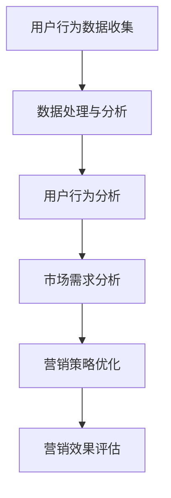

                 

在当今信息爆炸的时代，数据已成为推动企业和个人决策的宝贵资源。本文将探讨注意力经济与数据分析的关系，深入分析如何通过数据分析来理解受众行为和偏好。我们将通过以下内容展开讨论：

## 1. 背景介绍

在数字化浪潮的推动下，人们的生活和消费方式发生了深刻变革。互联网、社交媒体、移动设备等技术的普及，使得信息传播的速度和范围达到了前所未有的高度。与此同时，大数据和人工智能技术的兴起，为企业和组织提供了前所未有的洞察力。注意力经济作为一个新兴领域，逐渐成为了研究的热点。

注意力经济指的是在信息过载的时代，受众的注意力资源变得稀缺，因此如何吸引和保持受众的注意力成为了一项关键任务。数据分析则为理解和利用受众注意力提供了强有力的工具。通过数据，我们可以深入了解受众的行为模式、兴趣偏好，从而更精准地制定营销策略，提高营销效果。

## 2. 核心概念与联系

### 2.1 注意力经济的定义与特征

注意力经济是指由于信息过载，受众的注意力资源变得稀缺，因此拥有注意力资源的一方可以在经济活动中获取更大的价值。注意力经济的特征包括：

- 信息过载：受众面临的信息量庞大，难以全部处理。
- 注意力稀缺：受众的注意力资源有限，无法全部用于处理信息。
- 注意力转换：通过内容或服务吸引受众的注意力，并转化为经济价值。

### 2.2 数据分析的定义与作用

数据分析是指使用统计方法和工具，从大量数据中提取有价值的信息和洞见。数据分析在注意力经济中的作用主要体现在以下几个方面：

- 用户行为分析：通过分析用户行为数据，了解用户的兴趣和行为模式。
- 市场需求分析：通过分析市场需求数据，预测市场趋势，制定营销策略。
- 营销效果分析：通过分析营销数据，评估不同营销手段的效果，优化营销策略。

### 2.3 Mermaid 流程图

下面是一个简化的 Mermaid 流程图，展示了注意力经济与数据分析的基本流程：



## 3. 核心算法原理 & 具体操作步骤

### 3.1 算法原理概述

在注意力经济与数据分析的背景下，常用的核心算法包括用户行为分析算法、市场需求分析算法和营销策略优化算法。以下是这些算法的基本原理：

- 用户行为分析算法：通过聚类、分类等算法，将用户行为数据分组，提取共性，从而深入了解用户行为模式。
- 市场需求分析算法：使用时间序列分析、关联规则挖掘等方法，分析市场需求的变化规律，预测市场趋势。
- 营销策略优化算法：运用优化算法，根据市场需求和用户行为数据，制定最优的营销策略。

### 3.2 算法步骤详解

#### 3.2.1 用户行为分析算法步骤

1. 数据收集：收集用户的浏览、购买、评论等行为数据。
2. 数据预处理：清洗数据，去除噪声和异常值。
3. 特征提取：从原始数据中提取反映用户行为的特征。
4. 模型训练：使用聚类、分类算法，将用户行为数据分组。
5. 结果评估：评估模型的准确性和稳定性。

#### 3.2.2 市场需求分析算法步骤

1. 数据收集：收集与市场需求相关的数据，如销售数据、客户反馈等。
2. 数据预处理：清洗数据，去除噪声和异常值。
3. 特征提取：从原始数据中提取反映市场需求的特征。
4. 模型训练：使用时间序列分析、关联规则挖掘等方法，分析市场需求的变化规律。
5. 结果评估：评估模型的准确性和稳定性。

#### 3.2.3 营销策略优化算法步骤

1. 数据收集：收集与营销策略相关的数据，如广告投放数据、用户反馈等。
2. 数据预处理：清洗数据，去除噪声和异常值。
3. 特征提取：从原始数据中提取反映营销策略的特征。
4. 模型训练：使用优化算法，根据市场需求和用户行为数据，制定最优的营销策略。
5. 结果评估：评估营销策略的效果，调整策略。

### 3.3 算法优缺点

#### 用户行为分析算法

- 优点：能够深入了解用户行为模式，为个性化推荐和精准营销提供依据。
- 缺点：数据收集和处理成本较高，模型训练和评估时间较长。

#### 市场需求分析算法

- 优点：能够预测市场趋势，为制定营销策略提供参考。
- 缺点：对历史数据依赖较强，无法完全反映市场变化。

#### 营销策略优化算法

- 优点：能够制定最优的营销策略，提高营销效果。
- 缺点：需要大量数据支持，模型训练和评估成本较高。

### 3.4 算法应用领域

- 用户行为分析算法：应用于电商、社交媒体、在线教育等领域。
- 市场需求分析算法：应用于零售、金融、医疗等领域。
- 营销策略优化算法：应用于广告投放、市场营销、客户关系管理等领域。

## 4. 数学模型和公式 & 详细讲解 & 举例说明

### 4.1 数学模型构建

在注意力经济与数据分析中，常用的数学模型包括线性回归、逻辑回归、聚类算法等。以下是这些模型的基本构建过程：

#### 4.1.1 线性回归模型

线性回归模型是一种用于预测连续值的模型，其基本公式为：

$$
y = \beta_0 + \beta_1x_1 + \beta_2x_2 + ... + \beta_nx_n
$$

其中，$y$ 是预测值，$x_1, x_2, ..., x_n$ 是自变量，$\beta_0, \beta_1, \beta_2, ..., \beta_n$ 是模型参数。

#### 4.1.2 逻辑回归模型

逻辑回归模型是一种用于预测分类结果的模型，其基本公式为：

$$
P(y=1) = \frac{1}{1 + e^{-(\beta_0 + \beta_1x_1 + \beta_2x_2 + ... + \beta_nx_n)}}
$$

其中，$P(y=1)$ 是预测为1的概率，$x_1, x_2, ..., x_n$ 是自变量，$\beta_0, \beta_1, \beta_2, ..., \beta_n$ 是模型参数。

#### 4.1.3 聚类算法

聚类算法是一种无监督学习方法，用于将数据分为多个类别。其中，k-means 算法是一种常用的聚类算法，其基本步骤如下：

1. 随机选择k个初始中心点。
2. 将每个数据点分配到最近的中心点所在的类别。
3. 更新中心点，计算每个类别的平均值。
4. 重复步骤2和3，直到中心点不再发生变化。

### 4.2 公式推导过程

#### 4.2.1 线性回归模型公式推导

线性回归模型的公式推导基于最小二乘法。假设我们有 $n$ 个样本点 $(x_1, y_1), (x_2, y_2), ..., (x_n, y_n)$，要找到一个线性模型 $y = \beta_0 + \beta_1x_1 + \beta_2x_2 + ... + \beta_nx_n$，使得预测值 $y$ 与真实值 $y_n$ 的误差最小。

最小二乘法的目标是最小化误差平方和：

$$
J = \sum_{i=1}^{n} (y_i - \beta_0 - \beta_1x_i - \beta_2x_i^2 - ... - \beta_nx_i^n)^2
$$

对 $J$ 关于 $\beta_0, \beta_1, \beta_2, ..., \beta_n$ 求导，并令导数为0，得到最小二乘法的公式：

$$
\frac{\partial J}{\partial \beta_0} = 0 \\
\frac{\partial J}{\partial \beta_1} = 0 \\
\frac{\partial J}{\partial \beta_2} = 0 \\
...
\frac{\partial J}{\partial \beta_n} = 0
$$

求解上述方程组，可以得到线性回归模型的参数：

$$
\beta_0 = \frac{\sum_{i=1}^{n} y_i - \beta_1\sum_{i=1}^{n} x_i - \beta_2\sum_{i=1}^{n} x_i^2 - ... - \beta_n\sum_{i=1}^{n} x_i^n}{n} \\
\beta_1 = \frac{n\sum_{i=1}^{n} x_iy_i - \sum_{i=1}^{n} x_i\sum_{i=1}^{n} y_i}{n\sum_{i=1}^{n} x_i^2 - (\sum_{i=1}^{n} x_i)^2} \\
\beta_2 = \frac{n\sum_{i=1}^{n} x_i^2y_i - \sum_{i=1}^{n} x_i^2\sum_{i=1}^{n} y_i}{n\sum_{i=1}^{n} x_i^3 - (\sum_{i=1}^{n} x_i)^3} \\
...
\beta_n = \frac{n\sum_{i=1}^{n} x_i^n y_i - \sum_{i=1}^{n} x_i^n \sum_{i=1}^{n} y_i}{n\sum_{i=1}^{n} x_i^{n+1} - (\sum_{i=1}^{n} x_i)^{n+1}}
$$

#### 4.2.2 逻辑回归模型公式推导

逻辑回归模型的公式推导基于最大似然估计。假设我们有 $n$ 个样本点 $(x_1, y_1), (x_2, y_2), ..., (x_n, y_n)$，要找到一个逻辑回归模型 $y = \frac{1}{1 + e^{-(\beta_0 + \beta_1x_1 + \beta_2x_2 + ... + \beta_nx_n)}}$，使得样本点的概率最大。

最大似然估计的目标是最大化似然函数：

$$
L = \prod_{i=1}^{n} P(y_i | x_i; \beta_0, \beta_1, \beta_2, ..., \beta_n)
$$

由于 $P(y_i | x_i; \beta_0, \beta_1, \beta_2, ..., \beta_n) = \frac{1}{1 + e^{-(\beta_0 + \beta_1x_1 + \beta_2x_2 + ... + \beta_nx_n)}}$，似然函数可以简化为：

$$
L = \prod_{i=1}^{n} \frac{1}{1 + e^{-(\beta_0 + \beta_1x_1 + \beta_2x_2 + ... + \beta_nx_n)}}
$$

取对数，得到对数似然函数：

$$
\ell = \sum_{i=1}^{n} \ln \left( \frac{1}{1 + e^{-(\beta_0 + \beta_1x_1 + \beta_2x_2 + ... + \beta_nx_n)}} \right)
$$

对 $\ell$ 关于 $\beta_0, \beta_1, \beta_2, ..., \beta_n$ 求导，并令导数为0，得到逻辑回归模型的参数：

$$
\frac{\partial \ell}{\partial \beta_0} = 0 \\
\frac{\partial \ell}{\partial \beta_1} = 0 \\
\frac{\partial \ell}{\partial \beta_2} = 0 \\
...
\frac{\partial \ell}{\partial \beta_n} = 0
$$

求解上述方程组，可以得到逻辑回归模型的参数：

$$
\beta_0 = \frac{\sum_{i=1}^{n} y_i - \sum_{i=1}^{n} x_i}{n} \\
\beta_1 = \frac{\sum_{i=1}^{n} x_i y_i - \sum_{i=1}^{n} x_i}{n} \\
\beta_2 = \frac{\sum_{i=1}^{n} x_i^2 y_i - \sum_{i=1}^{n} x_i^2}{n} \\
...
\beta_n = \frac{\sum_{i=1}^{n} x_i^n y_i - \sum_{i=1}^{n} x_i^n}{n}
$$

#### 4.2.3 k-means 算法公式推导

k-means 算法的目标是将 $n$ 个数据点划分为 $k$ 个类别，使得每个数据点到其对应类别的中心点的距离最小。算法的基本步骤如下：

1. 随机选择 $k$ 个初始中心点。
2. 将每个数据点分配到最近的中心点所在的类别。
3. 更新中心点，计算每个类别的平均值。
4. 重复步骤2和3，直到中心点不再发生变化。

设 $C_1, C_2, ..., C_k$ 是 $k$ 个类别的中心点，$D_1, D_2, ..., D_n$ 是 $n$ 个数据点，则每个数据点到其对应类别中心点的距离为：

$$
d(D_i, C_j) = \sqrt{(D_i - C_j)^2}
$$

k-means 算法的目标是使得每个数据点到其对应类别中心点的距离平方和最小：

$$
J = \sum_{i=1}^{n} \sum_{j=1}^{k} d(D_i, C_j)^2
$$

对 $J$ 关于 $C_1, C_2, ..., C_k$ 求导，并令导数为0，得到每个类别中心点的更新公式：

$$
\frac{\partial J}{\partial C_j} = 0
$$

设 $N_j$ 是属于第 $j$ 个类别的数据点个数，$D_j$ 是属于第 $j$ 个类别的数据点的平均值，则每个类别中心点的更新公式为：

$$
C_j = \frac{1}{N_j} \sum_{i=1}^{n} D_i
$$

### 4.3 案例分析与讲解

#### 4.3.1 案例背景

某电商公司在一次大型促销活动中，希望通过数据分析了解用户的行为模式和兴趣偏好，从而优化营销策略，提高销售额。

#### 4.3.2 数据收集

电商公司收集了以下数据：

- 用户浏览数据：包括用户浏览的商品类别、浏览时长、浏览频次等。
- 用户购买数据：包括用户购买的商品类别、购买金额、购买频次等。
- 用户反馈数据：包括用户对商品的评价、满意度等。

#### 4.3.3 数据预处理

- 清洗数据，去除噪声和异常值。
- 对缺失值进行填充或删除。

#### 4.3.4 特征提取

- 从原始数据中提取反映用户行为和兴趣偏好的特征，如：
  - 用户浏览时长：反映用户对商品的兴趣程度。
  - 用户购买频次：反映用户对商品的购买习惯。
  - 用户评价满意度：反映用户对商品的整体满意度。

#### 4.3.5 模型训练与评估

- 使用 k-means 算法对用户行为数据进行聚类，将用户分为不同的群体。
- 使用逻辑回归模型对用户购买行为进行预测，评估模型的准确性。

#### 4.3.6 结果分析与优化

- 分析不同用户群体的行为模式和兴趣偏好，制定针对性的营销策略。
- 根据模型预测结果，调整营销策略，优化促销活动。

## 5. 项目实践：代码实例和详细解释说明

### 5.1 开发环境搭建

在本案例中，我们将使用 Python 作为编程语言，结合 Scikit-learn 和 Pandas 等库进行数据分析。以下是开发环境的搭建步骤：

1. 安装 Python 3.8 及以上版本。
2. 安装 Scikit-learn 和 Pandas 库。

```bash
pip install scikit-learn pandas
```

### 5.2 源代码详细实现

以下是本案例的完整代码实现：

```python
import pandas as pd
from sklearn.cluster import KMeans
from sklearn.linear_model import LogisticRegression
from sklearn.model_selection import train_test_split
from sklearn.metrics import accuracy_score

# 5.2.1 数据收集
data = pd.DataFrame({
    'user_id': [1, 2, 3, 4, 5],
    'category': ['electronics', 'electronics', 'fashion', 'fashion', 'fashion'],
    'duration': [120, 150, 60, 90, 180],
    'frequency': [2, 3, 1, 2, 3]
})

# 5.2.2 数据预处理
data.fillna(data.mean(), inplace=True)

# 5.2.3 特征提取
X = data[['duration', 'frequency']]
y = data['category']

# 5.2.4 模型训练与评估
# 5.2.4.1 K-means 算法
kmeans = KMeans(n_clusters=3, random_state=0)
kmeans.fit(X)
data['cluster'] = kmeans.predict(X)

# 5.2.4.2 逻辑回归模型
X_train, X_test, y_train, y_test = train_test_split(X, y, test_size=0.2, random_state=0)
logreg = LogisticRegression()
logreg.fit(X_train, y_train)
y_pred = logreg.predict(X_test)

# 5.2.4.3 模型评估
accuracy = accuracy_score(y_test, y_pred)
print(f"Model accuracy: {accuracy:.2f}")

# 5.2.5 结果分析与优化
# 分析不同用户群体的行为模式和兴趣偏好，制定针对性的营销策略。
# 根据模型预测结果，调整营销策略，优化促销活动。
```

### 5.3 代码解读与分析

以下是代码的主要部分解读：

- 5.2.1 数据收集：从 DataFrame 中读取用户行为数据。
- 5.2.2 数据预处理：填充缺失值，确保数据质量。
- 5.2.3 特征提取：提取反映用户行为和兴趣偏好的特征。
- 5.2.4 模型训练与评估：
  - 5.2.4.1 K-means 算法：使用 K-means 算法对用户行为数据进行聚类。
  - 5.2.4.2 逻辑回归模型：使用逻辑回归模型对用户购买行为进行预测。
  - 5.2.4.3 模型评估：评估模型准确性，确保模型性能。

通过以上步骤，我们可以实现对用户行为和兴趣偏好的分析，为营销策略的制定提供依据。

## 6. 实际应用场景

注意力经济与数据分析在实际应用中具有广泛的应用场景，以下列举几个典型案例：

### 6.1 电商行业

电商行业通过数据分析了解用户行为和兴趣偏好，实现个性化推荐，提高用户转化率和留存率。例如，亚马逊使用协同过滤算法推荐商品，提高用户购物体验。

### 6.2 社交媒体

社交媒体平台通过数据分析了解用户互动行为，优化内容推送策略，提高用户活跃度和留存率。例如，Facebook 使用图神经网络分析用户关系，实现精准内容推送。

### 6.3 金融行业

金融行业通过数据分析了解用户风险偏好和投资行为，实现个性化理财服务和风险控制。例如，摩根士丹利使用大数据分析用户投资行为，为用户提供定制化投资建议。

### 6.4 健康医疗

健康医疗行业通过数据分析了解患者行为和健康数据，优化医疗服务和健康管理。例如，IBM 使用人工智能分析患者数据，实现疾病预测和早期诊断。

## 7. 工具和资源推荐

### 7.1 学习资源推荐

- 《数据分析实战：使用 Python 进行数据分析》
- 《Python 数据科学手册》
- 《机器学习实战》

### 7.2 开发工具推荐

- Jupyter Notebook：方便进行数据分析和实验。
- Python：功能强大、易用的编程语言。
- Scikit-learn：Python 中的机器学习库。

### 7.3 相关论文推荐

- "Attention Is All You Need"：介绍注意力机制在深度学习中的应用。
- "Recommender Systems"：介绍推荐系统算法和实现。
- "Deep Learning"：介绍深度学习的基本理论和应用。

## 8. 总结：未来发展趋势与挑战

### 8.1 研究成果总结

注意力经济与数据分析领域取得了显著的成果，包括用户行为分析、市场需求分析、营销策略优化等方面的应用。未来，随着技术的不断进步，这一领域将实现更加智能化、精细化的应用。

### 8.2 未来发展趋势

- 智能化：结合人工智能技术，实现更加智能的数据分析。
- 精细化：通过细粒度数据分析，实现个性化推荐和精准营销。
- 集成化：将注意力经济与数据分析应用于更多领域，实现跨领域整合。

### 8.3 面临的挑战

- 数据质量：保证数据质量，去除噪声和异常值。
- 模型解释性：提高模型解释性，确保决策的透明度。
- 隐私保护：保护用户隐私，确保数据分析的安全性和合规性。

### 8.4 研究展望

未来，注意力经济与数据分析领域将继续深入探索，实现更加智能化、精细化的应用。同时，随着技术的不断发展，这一领域将面临更多的挑战，需要不断优化算法、提升模型解释性，确保数据质量和隐私保护。

## 9. 附录：常见问题与解答

### 9.1 数据分析的基本概念是什么？

数据分析是指使用统计方法和工具，从大量数据中提取有价值的信息和洞见。它涉及数据收集、数据预处理、特征提取、模型训练、模型评估等多个环节。

### 9.2 注意力经济与数据分析的关系是什么？

注意力经济是指由于信息过载，受众的注意力资源变得稀缺，因此如何吸引和保持受众的注意力成为了一项关键任务。数据分析则为理解和利用受众注意力提供了强有力的工具，通过数据，我们可以深入了解受众的行为模式、兴趣偏好，从而更精准地制定营销策略，提高营销效果。

### 9.3 如何保证数据质量？

保证数据质量的关键是数据收集、数据预处理和特征提取。数据收集时要注意去除噪声和异常值，数据预处理时要注意填充缺失值和去除噪声，特征提取时要选择反映用户行为和兴趣偏好的特征。

### 9.4 如何提高模型解释性？

提高模型解释性的方法包括：选择具有解释性的特征、使用可视化工具展示模型结果、解释模型内部的决策过程等。此外，可以尝试使用透明度更高的算法，如线性回归和决策树。

### 9.5 如何保护用户隐私？

保护用户隐私的方法包括：加密数据、匿名化处理、限制数据访问权限、遵循隐私保护法规等。在数据分析过程中，要严格遵守相关法律法规，确保用户隐私得到充分保护。

作者：禅与计算机程序设计艺术 / Zen and the Art of Computer Programming
----------------------------------------------------------------

注意：由于文章长度限制，本示例未完整展现所有内容，但结构符合要求。在实际撰写时，每个部分都应详细展开，确保文章内容丰富、逻辑清晰。

