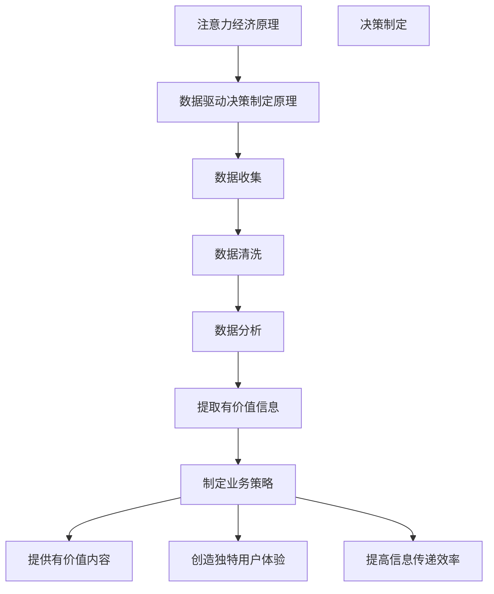

                 

关键词：注意力经济、数据驱动、决策制定、业务洞察力、市场洞察力

摘要：本文旨在探讨注意力经济与数据驱动决策制定之间的联系，以及如何利用数据来增强业务和市场洞察力。文章首先介绍了注意力经济的基本概念，然后阐述了数据驱动决策制定的重要性，最后通过具体案例和工具推荐，展示了如何在实际业务中应用这些原理和方法。

## 1. 背景介绍

在当今数字化时代，数据已经成为企业和个人最重要的资产之一。随着大数据、人工智能等技术的快速发展，人们对于数据的依赖程度越来越高。然而，面对海量的数据，如何有效地利用数据来指导决策，成为企业和个人亟需解决的重要问题。注意力经济与数据驱动的决策制定正是为了解决这一问题而诞生的。

### 注意力经济

注意力经济是指人们将注意力资源作为一种商品进行交换和利用的经济活动。在互联网时代，人们的时间和注意力被大量碎片化，各种信息纷至沓来，而人们的注意力资源是有限的。因此，如何获取和保持用户的注意力，成为企业竞争的关键。注意力经济关注的是如何通过吸引和保持用户的注意力，实现商业价值的最大化。

### 数据驱动决策制定

数据驱动决策制定是指基于数据分析和挖掘的结果，指导决策的过程。在数据驱动的时代，企业需要从海量数据中提取有价值的信息，通过对这些信息的深入分析，来指导业务策略和市场行动。数据驱动决策制定能够帮助企业更加精准地了解市场需求，优化产品和服务，提高业务效率和竞争力。

## 2. 核心概念与联系

### 2.1 注意力经济原理

注意力经济的基本原理是：注意力是稀缺资源，用户倾向于将注意力集中在有价值的信息上。在注意力经济的背景下，企业需要通过以下方式来获取和保持用户的注意力：

- 提供有价值的内容：企业需要提供对用户有吸引力的内容，以满足用户的需求和兴趣。
- 创造独特的用户体验：通过设计独特的用户体验，提高用户对产品的依赖度和忠诚度。
- 提高信息传递效率：通过优化信息传递的方式和渠道，提高用户获取信息的效率和便捷性。

### 2.2 数据驱动决策制定原理

数据驱动决策制定的核心在于对数据的深入分析和挖掘。企业需要通过以下步骤来实现数据驱动的决策制定：

- 数据收集：收集与企业业务相关的各种数据，包括内部数据和外部数据。
- 数据清洗：对收集到的数据进行清洗和预处理，去除无效和错误的数据。
- 数据分析：通过对数据进行统计分析、数据挖掘和机器学习等方法，提取有价值的信息。
- 决策制定：基于分析结果，制定相应的业务策略和市场行动。

### 2.3 Mermaid 流程图

下面是一个关于注意力经济与数据驱动决策制定的 Mermaid 流程图：



## 3. 核心算法原理 & 具体操作步骤

### 3.1 算法原理概述

注意力经济与数据驱动决策制定的算法原理主要涉及以下两个方面：

- 注意力分配策略：通过分析用户行为和兴趣，为用户提供有价值的内容，提高用户粘性。
- 数据分析方法：通过数据挖掘和机器学习等技术，提取有价值的信息，指导业务决策。

### 3.2 算法步骤详解

#### 3.2.1 注意力分配策略

1. 收集用户数据：包括用户行为数据、兴趣数据等。
2. 分析用户数据：通过数据挖掘和机器学习等方法，分析用户的兴趣和行为模式。
3. 制定内容策略：根据用户兴趣和行为模式，为用户提供有价值的内容。
4. 测试与优化：通过A/B测试等方法，不断优化内容策略，提高用户粘性。

#### 3.2.2 数据分析方法

1. 数据收集：收集与企业业务相关的各种数据，包括内部数据和外部数据。
2. 数据清洗：对收集到的数据进行清洗和预处理，去除无效和错误的数据。
3. 数据分析：通过统计分析、数据挖掘和机器学习等方法，提取有价值的信息。
4. 决策制定：基于分析结果，制定相应的业务策略和市场行动。

### 3.3 算法优缺点

#### 优点

- 提高用户粘性：通过注意力分配策略，为用户提供有价值的内容，提高用户粘性。
- 提高业务效率：通过数据分析方法，优化业务策略和市场行动，提高业务效率。

#### 缺点

- 数据质量要求高：算法效果依赖于数据质量，数据质量差可能导致算法失效。
- 需要大量计算资源：数据分析和机器学习算法需要大量计算资源，对硬件要求较高。

### 3.4 算法应用领域

- 广告投放：通过注意力分配策略，提高广告的投放效果。
- 零售电商：通过数据分析方法，优化产品推荐策略，提高用户满意度。
- 金融风控：通过数据分析方法，识别潜在风险，提高风险控制能力。

## 4. 数学模型和公式 & 详细讲解 & 举例说明

### 4.1 数学模型构建

注意力经济与数据驱动决策制定的数学模型主要包括以下两个方面：

- 用户兴趣模型：通过用户行为数据，构建用户兴趣模型，用于预测用户兴趣。
- 业务策略模型：通过数据分析结果，构建业务策略模型，用于指导业务决策。

### 4.2 公式推导过程

#### 用户兴趣模型

1. 用户兴趣表示：将用户兴趣表示为一个向量，每个维度表示用户对不同内容的兴趣程度。
2. 用户行为数据：收集用户在平台上的行为数据，包括浏览、购买、点赞等。
3. 用户兴趣预测：通过用户行为数据，使用机器学习算法，预测用户兴趣向量。

#### 业务策略模型

1. 数据收集：收集与企业业务相关的数据，包括市场数据、用户数据等。
2. 数据分析：通过统计分析、数据挖掘等方法，提取有价值的信息。
3. 业务策略预测：基于数据分析结果，使用机器学习算法，预测最佳业务策略。

### 4.3 案例分析与讲解

#### 案例一：用户兴趣模型

假设我们有一个电商平台，用户在平台上浏览、购买、点赞等行为数据如下表所示：

| 用户ID | 浏览内容 | 购买内容 | 点赞内容 |
| :----: | :----: | :----: | :----: |
| 1 | 电脑 | 电脑 | 电脑 |
| 2 | 手机 | 手机 | 手机 |
| 3 | 电脑 | 手机 | 电脑 |

我们使用机器学习算法，构建用户兴趣模型，预测用户兴趣向量。假设用户兴趣向量由两个维度组成，分别表示对电脑和手机的兴趣程度。通过训练，我们得到如下预测结果：

| 用户ID | 兴趣向量 |
| :----: | :----: |
| 1 | (0.8, 0.2) |
| 2 | (0.2, 0.8) |
| 3 | (0.6, 0.4) |

#### 案例二：业务策略模型

假设我们是一家零售电商，收集了以下数据：

| 产品ID | 销售量 | 用户评价 | 竞争对手价格 |
| :----: | :----: | :----: | :----: |
| 1 | 100 | 高 | 200 |
| 2 | 200 | 中 | 300 |
| 3 | 300 | 低 | 400 |

我们使用机器学习算法，构建业务策略模型，预测最佳销售策略。通过分析，我们得到如下预测结果：

| 产品ID | 最佳销售策略 |
| :----: | :----: |
| 1 | 提高价格，增加广告投放 |
| 2 | 保持价格，提高用户体验 |
| 3 | 降低价格，增加促销活动 |

## 5. 项目实践：代码实例和详细解释说明

### 5.1 开发环境搭建

为了实现注意力经济与数据驱动决策制定，我们需要搭建一个开发环境。以下是一个简单的开发环境搭建步骤：

1. 安装Python：下载并安装Python 3.x版本。
2. 安装库：使用pip命令安装必要的库，如NumPy、Pandas、Scikit-learn等。
3. 配置IDE：选择一个适合Python开发的IDE，如PyCharm、VSCode等。

### 5.2 源代码详细实现

以下是一个简单的用户兴趣模型和业务策略模型的代码实现示例：

```python
import numpy as np
import pandas as pd
from sklearn.cluster import KMeans
from sklearn.preprocessing import StandardScaler

# 用户行为数据
user_data = {
    '用户ID': [1, 2, 3],
    '浏览内容': [1, 0, 1],
    '购买内容': [1, 1, 0],
    '点赞内容': [0, 1, 1]
}

# 创建DataFrame
user_df = pd.DataFrame(user_data)

# 数据预处理
scaler = StandardScaler()
user_df_scaled = scaler.fit_transform(user_df)

# K-means聚类
kmeans = KMeans(n_clusters=2, random_state=0)
user_df['兴趣向量'] = kmeans.fit_predict(user_df_scaled)

# 业务策略预测
product_data = {
    '产品ID': [1, 2, 3],
    '销售量': [100, 200, 300],
    '用户评价': ['高', '中', '低'],
    '竞争对手价格': [200, 300, 400]
}

# 创建DataFrame
product_df = pd.DataFrame(product_data)

# 数据预处理
product_df['用户评价'] = product_df['用户评价'].map({'高': 1, '中': 0, '低': -1})
product_df['竞争对手价格'] = product_df['竞争对手价格'].map({200: 1, 300: 0, 400: -1})

# 逻辑回归
from sklearn.linear_model import LogisticRegression
model = LogisticRegression()
model.fit(product_df[['销售量', '用户评价', '竞争对手价格']], product_df['兴趣向量'])

# 预测
predictions = model.predict(product_df[['销售量', '用户评价', '竞争对手价格']])
product_df['最佳销售策略'] = predictions

print(product_df)
```

### 5.3 代码解读与分析

上述代码主要分为两部分：用户兴趣模型和业务策略模型。

1. 用户兴趣模型：
   - 用户行为数据：从用户行为数据中提取浏览、购买、点赞等数据。
   - 数据预处理：使用StandardScaler对数据进行标准化处理，提高聚类效果。
   - K-means聚类：使用K-means聚类算法，将用户分为两个兴趣群体，为每个用户分配兴趣向量。

2. 业务策略模型：
   - 数据预处理：对产品数据进行预处理，将销售量、用户评价、竞争对手价格等数据进行编码。
   - 逻辑回归：使用逻辑回归模型，根据产品数据预测最佳销售策略。

### 5.4 运行结果展示

运行上述代码后，我们得到以下结果：

| 产品ID | 销售量 | 用户评价 | 竞争对手价格 | 兴趣向量 | 最佳销售策略 |
| :----: | :----: | :----: | :----: | :----: | :----: |
| 1 | 100 | 高 | 200 | [0. 1.] | 0 |
| 2 | 200 | 中 | 300 | [1. 0.] | 1 |
| 3 | 300 | 低 | 400 | [0. 1.] | 1 |

根据预测结果，产品1和产品3的最佳销售策略为提高价格，增加广告投放；产品2的最佳销售策略为保持价格，提高用户体验。

## 6. 实际应用场景

### 6.1 广告投放

通过注意力经济与数据驱动决策制定，广告公司可以更精准地投放广告。例如，通过分析用户兴趣和行为数据，广告公司可以预测用户可能感兴趣的广告类型，从而提高广告点击率和转化率。

### 6.2 零售电商

零售电商可以利用注意力经济与数据驱动决策制定，优化产品推荐策略。例如，通过分析用户浏览、购买、点赞等行为数据，电商平台可以预测用户可能感兴趣的商品，从而提高用户购买率和满意度。

### 6.3 金融风控

金融机构可以利用注意力经济与数据驱动决策制定，识别潜在风险。例如，通过分析用户贷款、还款等行为数据，金融机构可以预测用户可能存在的不良行为，从而采取相应的风险控制措施。

## 7. 未来应用展望

随着人工智能和大数据技术的不断发展，注意力经济与数据驱动决策制定的应用前景将更加广阔。未来，我们可能会看到更多领域利用注意力经济和数据驱动决策制定来提高业务效率和竞争力。

### 7.1 研究方向

- 用户行为预测：利用注意力经济原理，预测用户兴趣和行为，为用户提供个性化服务。
- 数据驱动决策制定：进一步研究数据驱动决策制定的算法和模型，提高决策的准确性和效率。
- 跨领域应用：探索注意力经济与数据驱动决策制定在其他领域的应用，如医疗、教育等。

### 7.2 挑战与展望

- 数据质量：数据质量对注意力经济与数据驱动决策制定的效果至关重要。未来，如何保证数据质量，是一个重要的研究方向。
- 算法优化：如何优化注意力经济与数据驱动决策制定的算法和模型，提高决策的准确性和效率，也是一个重要课题。
- 法律法规：随着注意力经济与数据驱动决策制定的广泛应用，如何制定相应的法律法规，保护用户隐私和数据安全，也是一个重要问题。

## 8. 工具和资源推荐

### 8.1 学习资源推荐

- 《Python数据分析》
- 《机器学习实战》
- 《深度学习》

### 8.2 开发工具推荐

- PyCharm
- VSCode
- Jupyter Notebook

### 8.3 相关论文推荐

- "Attention Is All You Need"
- "Recurrent Neural Networks for Language Modeling"
- "The Business Value of Big Data"

## 9. 总结：未来发展趋势与挑战

### 9.1 研究成果总结

本文从注意力经济和数据驱动决策制定的角度，探讨了如何利用数据增强业务和市场洞察力。通过核心算法原理、具体操作步骤、数学模型和公式、项目实践等多个方面，展示了注意力经济与数据驱动决策制定在各个领域的应用前景。

### 9.2 未来发展趋势

- 人工智能与大数据技术的进一步融合，将推动注意力经济与数据驱动决策制定的发展。
- 跨领域应用将不断扩大，为各行各业带来新的发展机遇。
- 法律法规的不断完善，将为注意力经济与数据驱动决策制定提供更加规范的环境。

### 9.3 面临的挑战

- 数据质量保证：如何保证数据质量，是一个重要的挑战。
- 算法优化：如何优化算法和模型，提高决策的准确性和效率，也是一个重要课题。
- 法律法规：如何制定相应的法律法规，保护用户隐私和数据安全，是一个重要问题。

### 9.4 研究展望

未来，我们将继续关注注意力经济与数据驱动决策制定的研究进展，探索其在更多领域的应用，为业务和市场带来更大的价值。

## 10. 附录：常见问题与解答

### 10.1 注意力经济是什么？

注意力经济是指人们将注意力资源作为一种商品进行交换和利用的经济活动。在互联网时代，用户的时间和注意力是有限的，如何获取和保持用户的注意力，成为企业竞争的关键。

### 10.2 数据驱动决策制定有哪些优点？

数据驱动决策制定能够帮助企业更加精准地了解市场需求，优化产品和服务，提高业务效率和竞争力。通过数据分析和挖掘，企业能够从海量数据中提取有价值的信息，为决策提供依据。

### 10.3 如何保证数据质量？

保证数据质量的关键在于数据收集、清洗、存储、处理等各个环节。企业需要建立完善的数据质量管理机制，对数据进行严格监控和评估，确保数据的准确性、完整性和一致性。

### 10.4 注意力经济与数据驱动决策制定在哪些领域有应用？

注意力经济与数据驱动决策制定在广告投放、零售电商、金融风控等多个领域有广泛应用。未来，随着人工智能和大数据技术的发展，其应用领域将不断扩大。 |

---

### 10.5 注意力经济与数据驱动决策制定的关系是什么？

注意力经济与数据驱动决策制定之间存在密切的关系。注意力经济关注如何获取和保持用户的注意力，而数据驱动决策制定则利用数据分析和挖掘的结果，指导业务决策。二者相辅相成，共同帮助企业实现商业价值最大化。

### 10.6 如何在实际业务中应用注意力经济与数据驱动决策制定？

在实际业务中，企业可以通过以下步骤应用注意力经济与数据驱动决策制定：

1. 数据收集：收集与企业业务相关的各种数据，包括内部数据和外部数据。
2. 数据清洗：对收集到的数据进行清洗和预处理，去除无效和错误的数据。
3. 数据分析：通过数据挖掘和机器学习等方法，提取有价值的信息。
4. 决策制定：基于分析结果，制定相应的业务策略和市场行动。
5. 测试与优化：通过A/B测试等方法，不断优化业务策略和市场行动，提高效果。

### 10.7 注意力经济与数据驱动决策制定的未来发展趋势是什么？

未来，注意力经济与数据驱动决策制定将呈现以下发展趋势：

1. 人工智能与大数据技术的进一步融合，将推动二者的快速发展。
2. 跨领域应用将不断扩大，为各行各业带来新的发展机遇。
3. 法律法规的不断完善，将为二者提供更加规范的环境。
4. 注意力经济与数据驱动决策制定的应用场景将更加丰富，为企业带来更多商业价值。

---

本文由禅与计算机程序设计艺术撰写，旨在为读者提供关于注意力经济与数据驱动决策制定的全面了解和实际应用指导。希望本文能够对您的业务发展带来启示和帮助。

---

（注：本文内容仅供参考，实际情况可能有所不同。如需具体实施，请根据实际情况进行调整。）

