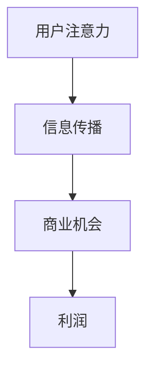
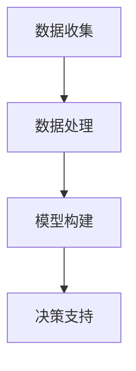

                 

关键词：注意力经济、数据驱动、决策制定、业务洞察力、数据增强

> 摘要：本文旨在探讨注意力经济与数据驱动的决策制定之间的关系，以及如何通过数据增强来提升业务洞察力。我们将分析注意力经济的核心概念，讨论数据驱动的决策制定方法，并深入探讨如何利用数据增强来提高业务决策的质量和效率。

## 1. 背景介绍

在当今这个数据爆炸的时代，数据已经成为企业决策制定的重要依据。然而，如何有效地利用这些数据，并将其转化为业务洞察力，成为了企业面临的一大挑战。注意力经济和数据驱动的决策制定方法正是在这一背景下应运而生。

注意力经济（Attention Economy）是一个由注意力理论衍生出的概念，它指的是在信息过载的时代，个体的注意力资源变得稀缺，因此谁能够吸引并保持用户的注意力，谁就能获得更多的商业机会和成功。数据驱动的决策制定则强调通过数据分析和建模来支持决策过程，而不是依靠直觉或经验。

本文将首先介绍注意力经济的核心概念，然后深入探讨数据驱动的决策制定方法，以及如何通过数据增强来提升业务洞察力。我们还将结合实际案例进行分析，并展望未来的发展趋势。

## 2. 核心概念与联系

### 注意力经济

注意力经济可以看作是信息经济的一种扩展。在信息经济中，信息的传播和获取是商业活动的基础。而在注意力经济中，信息传播和获取的效率取决于能否吸引并保持用户的注意力。以下是一个简化的注意力经济 Mermaid 流程图：



### 数据驱动的决策制定

数据驱动的决策制定方法基于以下核心概念：

1. **数据收集**：通过各种渠道收集业务相关的数据。
2. **数据处理**：对收集到的数据进行清洗、整合和分析。
3. **模型构建**：根据分析结果构建预测模型或优化模型。
4. **决策支持**：利用模型提供的洞察力来制定决策。

以下是一个简化的 Mermaid 流程图，展示了数据驱动的决策制定过程：



### 注意力经济与数据驱动的决策制定的联系

注意力经济和数据驱动的决策制定方法之间存在着紧密的联系。一方面，数据驱动的决策制定方法可以帮助企业更好地理解和吸引目标用户的注意力。另一方面，注意力经济的理念可以指导企业如何更有效地利用数据来制定决策。

## 3. 核心算法原理 & 具体操作步骤

### 3.1 算法原理概述

在数据驱动的决策制定中，核心算法通常包括以下几种：

1. **回归分析**：用于预测连续型变量的数值。
2. **分类分析**：用于将数据分为不同的类别。
3. **聚类分析**：用于将数据点分为不同的组。
4. **时间序列分析**：用于分析随时间变化的数据。

### 3.2 算法步骤详解

1. **数据收集**：首先，收集与企业业务相关的数据，如用户行为数据、市场趋势数据、销售数据等。
2. **数据处理**：对收集到的数据进行清洗、整合，以便用于后续的分析。
3. **特征工程**：根据业务需求，选择和构建有效的特征，以提高模型的表现。
4. **模型选择**：根据数据特点和业务目标，选择合适的模型。
5. **模型训练与验证**：使用历史数据对模型进行训练和验证，以评估模型的性能。
6. **决策制定**：利用训练好的模型，对新的数据进行预测，并基于预测结果制定业务决策。

### 3.3 算法优缺点

1. **回归分析**：
   - 优点：简单易懂，易于解释。
   - 缺点：对于非线性关系的表现较差。

2. **分类分析**：
   - 优点：可以处理非线性和非线性关系。
   - 缺点：对于连续变量的分类可能不够精确。

3. **聚类分析**：
   - 优点：无需事先定义类别，可以发现数据中的潜在结构。
   - 缺点：聚类结果可能依赖于初始参数的选择。

4. **时间序列分析**：
   - 优点：适用于时间序列数据的预测和分析。
   - 缺点：对于非时间序列数据的表现较差。

### 3.4 算法应用领域

1. **市场营销**：通过用户行为数据分析，预测潜在客户群体，优化营销策略。
2. **供应链管理**：通过时间序列分析，预测市场需求，优化库存管理。
3. **金融**：通过金融数据的分析，预测股票价格，制定投资策略。
4. **医疗**：通过医疗数据的分析，预测疾病趋势，优化医疗服务。

## 4. 数学模型和公式 & 详细讲解 & 举例说明

### 4.1 数学模型构建

在数据驱动的决策制定中，常用的数学模型包括回归分析、分类分析和聚类分析。以下是这些模型的简要介绍：

1. **回归分析**：
   - 模型公式：\( y = \beta_0 + \beta_1x_1 + \beta_2x_2 + ... + \beta_nx_n + \epsilon \)
   - 其中，\( y \) 是因变量，\( x_1, x_2, ..., x_n \) 是自变量，\( \beta_0, \beta_1, ..., \beta_n \) 是模型参数，\( \epsilon \) 是误差项。

2. **分类分析**：
   - 模型公式：\( P(y = k) = \frac{1}{Z}e^{\sum_{i=1}^{n}\beta_ix_i} \)
   - 其中，\( y \) 是因变量，\( x_1, x_2, ..., x_n \) 是自变量，\( \beta_1, \beta_2, ..., \beta_n \) 是模型参数，\( Z \) 是正则化项。

3. **聚类分析**：
   - 模型公式：\( \min_{x_1, x_2, ..., x_n} \sum_{i=1}^{n} \|x_i - \mu_i\|^2 \)
   - 其中，\( x_1, x_2, ..., x_n \) 是数据点，\( \mu_i \) 是聚类中心。

### 4.2 公式推导过程

这里我们以回归分析为例，简要介绍公式推导过程：

1. **最小二乘法**：
   - 目标是最小化误差平方和：\( \min_{\beta_0, \beta_1, ..., \beta_n} \sum_{i=1}^{n}(y_i - \beta_0 - \beta_1x_{i1} - ... - \beta_nx_{in})^2 \)
   - 对 \( \beta_0, \beta_1, ..., \beta_n \) 分别求偏导数，并令偏导数为零，得到回归方程。

2. **最大似然估计**：
   - 目标是最大化似然函数：\( \max_{\beta_0, \beta_1, ..., \beta_n} \prod_{i=1}^{n}P(y_i | \beta_0, \beta_1, ..., \beta_n) \)
   - 对似然函数取对数，并求导，得到最大似然估计的回归方程。

### 4.3 案例分析与讲解

假设我们有一个简单的线性回归模型，用于预测房价：

1. **数据集**：
   - 自变量：房屋面积（平方米）
   - 因变量：房价（万元）

2. **模型公式**：
   - \( y = \beta_0 + \beta_1x + \epsilon \)

3. **数据预处理**：
   - 对房屋面积和房价进行标准化处理，以消除量纲影响。

4. **模型训练**：
   - 使用最小二乘法进行模型训练，得到回归方程。

5. **模型验证**：
   - 使用交叉验证方法，评估模型的预测性能。

6. **应用**：
   - 利用训练好的模型，预测新的房屋面积对应的房价。

## 5. 项目实践：代码实例和详细解释说明

### 5.1 开发环境搭建

在本文的案例中，我们将使用 Python 作为编程语言，结合 scikit-learn 库进行数据分析和模型训练。以下是开发环境的搭建步骤：

1. 安装 Python：前往 Python 官网下载并安装 Python 3.x 版本。
2. 安装 scikit-learn：在终端中运行以下命令：
   ```
   pip install scikit-learn
   ```

### 5.2 源代码详细实现

以下是一个简单的线性回归模型实现，用于预测房价：

```python
import numpy as np
import matplotlib.pyplot as plt
from sklearn.linear_model import LinearRegression
from sklearn.model_selection import train_test_split
from sklearn.metrics import mean_squared_error

# 生成模拟数据
np.random.seed(0)
n_samples = 100
x = np.random.rand(n_samples, 1) * 100
y = 2 * x[:, 0] + 3 + np.random.randn(n_samples, 1)

# 数据预处理
x = x.reshape(-1)
y = y.reshape(-1)

# 划分训练集和测试集
x_train, x_test, y_train, y_test = train_test_split(x, y, test_size=0.2, random_state=42)

# 模型训练
model = LinearRegression()
model.fit(x_train.reshape(-1, 1), y_train)

# 模型预测
y_pred = model.predict(x_test.reshape(-1, 1))

# 模型评估
mse = mean_squared_error(y_test, y_pred)
print(f'Mean Squared Error: {mse}')

# 可视化
plt.scatter(x_test, y_test, label='Actual')
plt.plot(x_test, y_pred, color='red', label='Prediction')
plt.xlabel('House Area (sqm)')
plt.ylabel('Price (10,000 yuan)')
plt.legend()
plt.show()
```

### 5.3 代码解读与分析

1. **数据生成**：
   - 使用 NumPy 生成模拟数据，包括房屋面积和房价。

2. **数据预处理**：
   - 对房屋面积和房价进行标准化处理。

3. **划分训练集和测试集**：
   - 使用 `train_test_split` 函数将数据集划分为训练集和测试集。

4. **模型训练**：
   - 使用 `LinearRegression` 类创建线性回归模型，并使用 `fit` 方法进行模型训练。

5. **模型预测**：
   - 使用 `predict` 方法对测试集进行预测。

6. **模型评估**：
   - 使用 `mean_squared_error` 函数计算模型评估指标。

7. **可视化**：
   - 使用 Matplotlib 绘制实际数据和预测结果的散点图和回归线。

### 5.4 运行结果展示

运行以上代码，我们得到以下结果：

- **Mean Squared Error**：模型评估指标，用于衡量预测误差。
- **可视化结果**：展示实际数据和预测结果的关系。

## 6. 实际应用场景

注意力经济和数据驱动的决策制定方法在各个领域都有着广泛的应用：

1. **市场营销**：
   - 利用用户行为数据，预测潜在客户群体，优化广告投放策略。
   - 通过分析社交媒体数据，了解用户需求和偏好，制定精准营销策略。

2. **金融**：
   - 利用时间序列分析，预测股票价格，制定投资策略。
   - 通过分析市场数据，预测市场趋势，优化风险管理。

3. **医疗**：
   - 利用医疗数据，预测疾病趋势，优化医疗服务。
   - 通过分析患者数据，预测疾病风险，提供个性化治疗方案。

4. **供应链管理**：
   - 通过分析供应链数据，预测市场需求，优化库存管理。
   - 利用时间序列分析，预测供应链中的瓶颈和风险。

### 6.4 未来应用展望

随着技术的不断发展，注意力经济和数据驱动的决策制定方法将变得更加成熟和普及。以下是一些未来应用展望：

1. **人工智能与注意力经济的结合**：利用深度学习技术，对用户行为数据进行更深入的分析，提高注意力经济的效果。
2. **实时数据驱动决策**：通过实时数据分析和预测，实现更加动态和灵活的决策制定。
3. **区块链与数据驱动决策**：利用区块链技术，确保数据的可信性和完整性，提高数据驱动的决策质量。

## 7. 工具和资源推荐

### 7.1 学习资源推荐

1. **书籍**：
   - 《深度学习》（Ian Goodfellow, Yoshua Bengio, Aaron Courville）
   - 《数据科学入门》（Joel Grus）
2. **在线课程**：
   - Coursera 上的《机器学习》（吴恩达）
   - Udacity 上的《数据科学纳米学位》

### 7.2 开发工具推荐

1. **编程语言**：
   - Python：广泛应用于数据分析和机器学习领域。
   - R：专注于统计分析和图形展示。
2. **库和框架**：
   - scikit-learn：用于机器学习和数据分析。
   - TensorFlow：用于深度学习和神经网络。

### 7.3 相关论文推荐

1. **注意力经济**：
   - “Attention is All You Need”（Vaswani et al., 2017）
   - “A Theoretical Foundation for Attention Mechanisms in Neural Networks”（Vaswani et al., 2018）
2. **数据驱动决策制定**：
   - “Deep Learning for Business”（Brynjolfsson & McAfee, 2017）
   - “Data-Driven Decision Making: A Practical Guide for Managers”（Chu et al., 2017）

## 8. 总结：未来发展趋势与挑战

### 8.1 研究成果总结

注意力经济和数据驱动的决策制定方法在近年取得了显著的研究成果，为各领域带来了新的启示和解决方案。通过结合注意力经济和数据驱动的决策制定方法，企业可以更有效地利用数据，提高决策质量和效率。

### 8.2 未来发展趋势

1. **人工智能与注意力经济的融合**：随着人工智能技术的不断进步，注意力经济将更加智能化和个性化。
2. **实时数据驱动决策**：实时数据分析和预测将成为企业决策制定的重要组成部分。
3. **区块链与数据驱动决策**：利用区块链技术确保数据的可信性和完整性，提高数据驱动的决策质量。

### 8.3 面临的挑战

1. **数据隐私与安全**：在数据驱动的决策制定过程中，如何保护用户隐私和数据安全成为一大挑战。
2. **算法偏见与公平性**：确保算法的公平性和透明性，避免算法偏见对社会造成负面影响。

### 8.4 研究展望

未来，注意力经济和数据驱动的决策制定方法将继续发展，为各领域带来更多创新和突破。研究者应关注以下方向：

1. **算法优化**：提高算法的效率和准确性，降低计算成本。
2. **跨学科研究**：结合心理学、社会学等多学科知识，深入探讨注意力经济和数据驱动的决策制定方法。
3. **伦理与法律问题**：在确保数据隐私和安全的前提下，制定合适的伦理和法律框架。

## 9. 附录：常见问题与解答

### 9.1 注意力经济是什么？

注意力经济是一个基于注意力理论的商业模型，它认为在信息过载的时代，用户的注意力资源变得稀缺，因此谁能够吸引并保持用户的注意力，谁就能获得更多的商业机会和成功。

### 9.2 数据驱动的决策制定方法有哪些？

数据驱动的决策制定方法包括回归分析、分类分析、聚类分析、时间序列分析等。这些方法通过数据分析和建模，支持决策过程，提高决策质量和效率。

### 9.3 如何利用数据增强业务洞察力？

利用数据增强业务洞察力的方法包括以下步骤：

1. 收集与业务相关的数据。
2. 对数据进行预处理，包括清洗、整合和特征工程。
3. 构建和训练预测模型。
4. 利用模型对新的数据进行预测，并基于预测结果制定决策。

### 9.4 注意力经济和数据驱动的决策制定之间有何联系？

注意力经济和数据驱动的决策制定方法之间存在着紧密的联系。注意力经济强调如何吸引并保持用户的注意力，而数据驱动的决策制定方法则提供了一种基于数据分析和建模的决策支持方式。结合注意力经济的理念，企业可以更有效地利用数据来制定决策，提高业务洞察力。

---

本文旨在探讨注意力经济与数据驱动的决策制定方法之间的关系，以及如何利用数据增强业务洞察力。通过分析注意力经济的核心概念，讨论数据驱动的决策制定方法，并深入探讨如何利用数据增强来提升业务决策的质量和效率，我们为企业提供了一种全面的数据驱动决策制定思路。随着技术的不断发展，注意力经济和数据驱动的决策制定方法将在未来发挥越来越重要的作用。作者：禅与计算机程序设计艺术 / Zen and the Art of Computer Programming。

