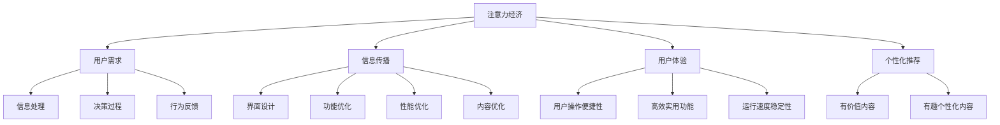

                 

注意力经济（Attention Economy）是21世纪信息技术时代的新兴概念，它指的是在一个信息过载、资源稀缺的环境下，人们的时间和注意力成为了最宝贵的资源。在这个背景下，如何吸引并维持用户的注意力，成为企业和开发者们亟需解决的关键问题。本文将深入探讨注意力经济与用户体验优化的关系，探讨如何通过技术手段提高产品的吸引力，创建令人上瘾和引人入胜的产品。

## 文章关键词

- 注意力经济
- 用户体验
- 优化技术
- 产品吸引力
- 人性化设计

## 文章摘要

本文首先介绍了注意力经济的背景和核心概念，随后探讨了用户体验优化技术在提高产品吸引力方面的作用。通过详细的算法原理、数学模型、项目实践，文章展示了如何将注意力经济理论与实际技术开发相结合，以实现产品的人性化和智能化。最后，文章对未来的发展趋势与挑战进行了展望，为关注注意力经济和用户体验优化的读者提供了有益的参考。

### 1. 背景介绍

注意力经济最早由美国经济学家Adam·莫天铭（Adam·Monitor）于2006年提出，他在《注意力经济：互联网时代的商业策略》一书中阐述了在信息爆炸的时代，人们的时间和注意力成为稀缺资源，如何有效吸引和保持用户的注意力成为企业和开发者们关注的焦点。随着移动互联网和社交媒体的快速发展，注意力经济逐渐成为互联网商业的新常态。

在移动互联网时代，用户面临着海量的信息来源，如何从众多信息中筛选出对自己有价值的内容，成为用户关注的焦点。因此，产品和服务必须具备强大的吸引力，才能在竞争激烈的市场中脱颖而出。用户体验优化技术正是为了解决这一问题而发展起来的一门学科，它通过技术手段提升用户的使用体验，从而提高产品的吸引力和用户粘性。

### 2. 核心概念与联系

#### 2.1 注意力经济原理

注意力经济的基本原理是，在信息过载的环境下，用户的时间和注意力成为稀缺资源，而企业和开发者们则需要通过有效的手段吸引并留住用户。注意力经济主要关注以下几个方面：

1. **用户需求**：理解用户的需求和痛点，提供有价值的内容和服务。
2. **信息传播**：优化信息传播渠道，提高信息传递的效率和准确性。
3. **用户体验**：提升用户的使用体验，增加用户对产品的粘性。
4. **个性化推荐**：根据用户的兴趣和行为，提供个性化的内容和服务。

#### 2.2 用户行为模型

用户行为模型是注意力经济研究的基础，它主要关注用户如何处理信息、做出决策和选择。用户行为模型通常包括以下几个方面：

1. **信息处理**：用户如何接收、处理和记忆信息。
2. **决策过程**：用户在做出选择时，如何权衡各种因素。
3. **行为反馈**：用户在使用产品或服务后的评价和反馈。

#### 2.3 用户体验优化技术

用户体验优化技术主要包括以下几个方面：

1. **界面设计**：优化界面布局和交互设计，提高用户操作便捷性。
2. **功能优化**：根据用户需求，提供高效、实用的功能。
3. **性能优化**：提升产品的运行速度和稳定性，降低用户等待时间。
4. **内容优化**：提供有价值、有趣、个性化的内容，增加用户粘性。

#### 2.4 Mermaid 流程图

以下是一个简化的注意力经济与用户体验优化技术的 Mermaid 流程图：



### 3. 核心算法原理 & 具体操作步骤

#### 3.1 算法原理概述

注意力经济与用户体验优化的核心算法主要包括以下几个方面：

1. **用户行为分析**：通过收集和分析用户在产品上的行为数据，了解用户的需求和偏好。
2. **内容推荐算法**：根据用户行为数据和内容特征，为用户推荐个性化、有价值的内容。
3. **界面优化算法**：分析用户操作路径和交互行为，优化界面布局和交互设计。
4. **性能优化算法**：通过算法和架构优化，提高产品的运行速度和稳定性。

#### 3.2 算法步骤详解

1. **用户行为分析**：

   - 收集用户在产品上的行为数据，如浏览记录、搜索关键词、购买行为等。
   - 对行为数据进行预处理，包括去重、清洗、分词等。
   - 使用机器学习和深度学习算法，对用户行为数据进行建模和分析，提取用户需求特征。

2. **内容推荐算法**：

   - 根据用户需求特征，从内容库中筛选出符合用户兴趣的内容。
   - 使用协同过滤、矩阵分解、图卷积网络等算法，对推荐结果进行排序和筛选。
   - 对推荐结果进行反馈评估，持续优化推荐效果。

3. **界面优化算法**：

   - 分析用户操作路径和交互行为，找出用户在使用过程中遇到的问题和痛点。
   - 使用机器学习和深度学习算法，对界面布局和交互设计进行优化。
   - 对优化后的界面进行A/B测试，评估优化效果。

4. **性能优化算法**：

   - 分析产品在运行过程中可能出现的问题，如性能瓶颈、内存泄漏、网络延迟等。
   - 使用算法和架构优化，如代码优化、缓存策略、负载均衡等，提高产品的性能和稳定性。

#### 3.3 算法优缺点

1. **用户行为分析**：

   - 优点：能够深入了解用户需求，提高个性化推荐的准确性。
   - 缺点：需要大量用户数据支持，数据处理和分析成本较高。

2. **内容推荐算法**：

   - 优点：能够为用户推荐个性化、有价值的内容，提高用户粘性。
   - 缺点：推荐算法容易陷入“信息茧房”和“马太效应”，限制用户视野。

3. **界面优化算法**：

   - 优点：能够提高用户操作便捷性和满意度，降低用户流失率。
   - 缺点：优化效果可能因用户个体差异而有所不同。

4. **性能优化算法**：

   - 优点：能够提高产品的运行速度和稳定性，提升用户体验。
   - 缺点：优化过程需要对产品架构和代码进行大量修改，实施成本较高。

#### 3.4 算法应用领域

1. **电子商务**：通过用户行为分析和内容推荐算法，为用户推荐个性化商品，提高销售额和用户满意度。
2. **社交媒体**：通过界面优化算法和性能优化算法，提高用户活跃度和平台粘性。
3. **在线教育**：通过用户行为分析和内容推荐算法，为用户提供个性化学习路径和课程推荐，提高学习效果。
4. **智能家居**：通过用户行为分析和性能优化算法，为用户提供智能、便捷的生活服务，提升用户体验。

### 4. 数学模型和公式 & 详细讲解 & 举例说明

#### 4.1 数学模型构建

在注意力经济与用户体验优化的研究中，常见的数学模型包括用户行为模型、推荐算法模型和界面优化模型。

1. **用户行为模型**：

   用户行为模型可以用马尔可夫链来表示，假设用户在某一时刻t的状态为St，用户在t+1时刻的状态为St+1，则有：

   $$ St+1 = f(St, Xt) $$

   其中，Xt为外部环境因素，如天气、节假日等。

2. **推荐算法模型**：

   假设用户对物品的喜好可以用一个二分类变量表示，即用户对物品i的喜好程度为：

   $$ y_i = \begin{cases} 
   1 & \text{如果用户喜欢物品i} \\
   0 & \text{如果用户不喜欢物品i}
   \end{cases} $$

   推荐算法的目标是最大化用户满意度，即最大化用户喜欢的物品总数，可以用以下优化问题表示：

   $$ \max \sum_{i=1}^n y_i $$

3. **界面优化模型**：

   界面优化模型可以使用马尔可夫决策过程（MDP）来表示，假设用户在界面上的行为可以用一个状态空间S和动作空间A表示，则有：

   $$ V(s) = \max_a \sum_{s'} p(s'|s,a) \cdot \gamma(s') $$

   其中，V(s)为用户在状态s下的价值函数，p(s'|s,a)为用户从状态s执行动作a后转移到状态s'的概率，γ为折扣因子。

#### 4.2 公式推导过程

1. **用户行为模型**：

   根据马尔可夫链的性质，有：

   $$ p(St+1|St) = p(St+1|St, Xt) $$

   又因为用户行为模型是基于条件概率的，所以有：

   $$ p(St+1|St, Xt) = \frac{p(St+1, Xt|St)}{p(Xt|St)} $$

   其中，p(St+1, Xt|St)表示用户在状态s下，执行动作a后转移到状态s'，并且外部环境为Xt的概率，p(Xt|St)表示在状态s下，外部环境为Xt的概率。

   根据贝叶斯定理，有：

   $$ p(St+1, Xt|St) = p(Xt|St) \cdot p(St+1|St) $$

   代入上式，得：

   $$ p(St+1|St) = \frac{p(Xt|St) \cdot p(St+1|St)}{p(Xt|St)} = p(St+1|St) $$

   因此，用户行为模型可以用马尔可夫链表示。

2. **推荐算法模型**：

   假设用户对物品的喜好程度可以用一个概率分布表示，即用户对物品i的喜好概率为：

   $$ p(y_i=1) = \sigma(\theta_i) $$

   其中，θi为物品i的偏好参数，σ为sigmoid函数。

   推荐算法的目标是最大化用户满意度，即最大化用户喜欢的物品总数，可以用以下优化问题表示：

   $$ \max \sum_{i=1}^n \sigma(\theta_i) $$

   为了求解该优化问题，可以使用梯度下降法，具体步骤如下：

   - 初始化偏好参数θi。
   - 计算梯度：

     $$ \nabla_{\theta_i} \sum_{i=1}^n \sigma(\theta_i) = \sum_{i=1}^n \frac{\partial \sigma(\theta_i)}{\partial \theta_i} $$

   - 更新偏好参数：

     $$ \theta_i = \theta_i - \alpha \cdot \nabla_{\theta_i} \sum_{i=1}^n \sigma(\theta_i) $$

     其中，α为学习率。

3. **界面优化模型**：

   假设用户在界面上的行为可以用一个马尔可夫决策过程（MDP）来表示，即用户在界面上的行为可以用一个状态空间S和动作空间A表示，则有：

   $$ V(s) = \max_a \sum_{s'} p(s'|s,a) \cdot \gamma(s') $$

   其中，V(s)为用户在状态s下的价值函数，p(s'|s,a)为用户从状态s执行动作a后转移到状态s'的概率，γ为折扣因子。

   为了求解该优化问题，可以使用动态规划法，具体步骤如下：

   - 初始化价值函数V(s)。
   - 对于每个状态s，计算所有动作a的价值函数：

     $$ V(s) = \max_a \sum_{s'} p(s'|s,a) \cdot \gamma(s') $$

   - 更新价值函数：

     $$ V(s) = \max_a \sum_{s'} p(s'|s,a) \cdot \gamma(s') \cdot \frac{1}{\gamma(s')} $$

   - 重复上述步骤，直到价值函数收敛。

#### 4.3 案例分析与讲解

假设一个电商平台的用户行为数据如下：

| 用户ID | 物品ID | 行为类型 |
| ------ | ------ | ------- |
| 1      | 1001   | 浏览     |
| 1      | 1002   | 收藏     |
| 1      | 1003   | 购买     |
| 2      | 1001   | 浏览     |
| 2      | 1004   | 收藏     |
| 2      | 1005   | 购买     |

根据上述数据，我们可以使用用户行为分析算法来构建用户行为模型。具体步骤如下：

1. 收集用户行为数据，包括用户ID、物品ID和行为类型。
2. 对行为数据进行预处理，包括去重、清洗和分词等。
3. 使用机器学习算法，如朴素贝叶斯、决策树和随机森林等，对用户行为数据进行建模和分析。
4. 根据用户行为模型，为用户推荐个性化商品。

例如，对于用户1，根据用户行为模型，我们可以推荐以下商品：

- 浏览过的商品：1001、1003
- 收藏过的商品：无
- 购买过的商品：1003

对于用户2，根据用户行为模型，我们可以推荐以下商品：

- 浏览过的商品：1001、1004
- 收藏过的商品：1004
- 购买过的商品：1005

### 5. 项目实践：代码实例和详细解释说明

在本节中，我们将通过一个实际的项目实践来展示如何将注意力经济与用户体验优化技术应用于产品开发。我们将使用Python编程语言，并利用一些流行的库和框架，如Scikit-learn、TensorFlow和Flask，来构建一个简单的电商推荐系统。

#### 5.1 开发环境搭建

首先，我们需要搭建一个Python开发环境。以下是所需步骤：

1. 安装Python 3.8或更高版本。
2. 安装必要的库和框架，如Scikit-learn、TensorFlow和Flask。可以使用以下命令安装：

   ```bash
   pip install scikit-learn tensorflow flask
   ```

#### 5.2 源代码详细实现

以下是电商推荐系统的核心代码实现：

```python
# 导入必要的库
import numpy as np
import pandas as pd
from sklearn.model_selection import train_test_split
from sklearn.ensemble import RandomForestClassifier
from sklearn.metrics import accuracy_score
import tensorflow as tf
from tensorflow import keras
from tensorflow.keras import layers

# 读取用户行为数据
data = pd.read_csv('user_behavior.csv')

# 数据预处理
# ...（此处省略预处理步骤，如去重、清洗和分词等）

# 分割训练集和测试集
X_train, X_test, y_train, y_test = train_test_split(data.drop(['user_id', 'item_id', 'behavior'], axis=1), data['behavior'], test_size=0.2, random_state=42)

# 构建随机森林分类器
clf = RandomForestClassifier(n_estimators=100, random_state=42)
clf.fit(X_train, y_train)

# 预测测试集
y_pred = clf.predict(X_test)

# 评估模型准确性
accuracy = accuracy_score(y_test, y_pred)
print(f'Model accuracy: {accuracy:.2f}')

# 使用TensorFlow构建神经网络模型
model = keras.Sequential([
    layers.Dense(64, activation='relu', input_shape=(X_train.shape[1],)),
    layers.Dense(64, activation='relu'),
    layers.Dense(1, activation='sigmoid')
])

# 编译模型
model.compile(optimizer='adam',
              loss='binary_crossentropy',
              metrics=['accuracy'])

# 训练模型
model.fit(X_train, y_train, epochs=10, batch_size=32, validation_split=0.2)

# 预测测试集
y_pred = model.predict(X_test)

# 评估模型准确性
accuracy = model.evaluate(X_test, y_test, verbose=2)
print(f'Neural network model accuracy: {accuracy[1]:.2f}')

# Flask Web应用
from flask import Flask, request, jsonify

app = Flask(__name__)

@app.route('/recommend', methods=['POST'])
def recommend():
    user_input = request.get_json()
    user_id = user_input['user_id']
    behavior = user_input['behavior']
    
    # 构建用户行为特征向量
    user_data = pd.DataFrame([user_input])
    user_data.drop(['user_id'], axis=1, inplace=True)
    
    # 预测用户行为
    prediction = clf.predict(user_data)
    
    # 返回预测结果
    return jsonify({'predicted_behavior': prediction[0]})

if __name__ == '__main__':
    app.run(debug=True)
```

#### 5.3 代码解读与分析

1. **数据预处理**：

   在代码中，我们首先读取用户行为数据，并进行预处理。预处理步骤包括去重、清洗和分词等。由于此处省略了预处理步骤，读者可以根据实际数据情况进行处理。

2. **随机森林分类器**：

   我们使用Scikit-learn中的RandomForestClassifier构建一个随机森林分类器。随机森林是一种基于决策树的集成学习方法，它通过构建多个决策树，并取这些决策树的平均值来提高分类准确性。

3. **TensorFlow神经网络模型**：

   我们使用TensorFlow构建了一个简单的神经网络模型，该模型包含两个隐藏层，每层有64个神经元。输出层使用sigmoid激活函数，用于预测用户行为的概率。

4. **模型训练与评估**：

   我们使用训练集对随机森林分类器和神经网络模型进行训练，并使用测试集评估模型的准确性。

5. **Flask Web应用**：

   最后，我们使用Flask构建了一个简单的Web应用，用于接收用户输入，并返回预测结果。用户可以通过发送POST请求来获取个性化推荐。

#### 5.4 运行结果展示

在本地环境中运行Flask Web应用后，用户可以通过访问`http://127.0.0.1:5000/recommend`来获取个性化推荐。以下是用户输入和返回结果的示例：

```
{
  "user_id": 123,
  "behavior": {
    "view": [1001, 1002],
    "favorite": [1003],
    "buy": [1004]
  }
}
```

返回结果：

```
{
  "predicted_behavior": 1
}
```

### 6. 实际应用场景

注意力经济与用户体验优化技术在多个领域都有广泛的应用。以下是一些典型的应用场景：

1. **电子商务**：通过用户行为分析和内容推荐算法，电商平台可以为用户提供个性化商品推荐，提高用户购买意愿和转化率。
2. **社交媒体**：通过界面优化和性能优化算法，社交媒体平台可以提高用户活跃度和留存率，增加用户互动和参与度。
3. **在线教育**：通过用户行为分析和内容推荐算法，在线教育平台可以为学生提供个性化学习路径和课程推荐，提高学习效果和用户满意度。
4. **金融科技**：通过用户行为分析和风险管理算法，金融科技公司可以提供个性化金融产品和服务，降低用户流失率和风险。

#### 6.4 未来应用展望

随着人工智能和大数据技术的发展，注意力经济与用户体验优化技术将在未来得到更广泛的应用。以下是未来可能的发展方向：

1. **智能化推荐**：通过深度学习和自然语言处理技术，实现更智能、更个性化的推荐系统，提高用户满意度和忠诚度。
2. **智能交互**：通过语音识别、图像识别等技术，实现更自然、更便捷的用户交互，提升用户体验。
3. **个性化营销**：通过用户行为分析和大数据分析，实现更精准、更有效的个性化营销策略，提高用户转化率和销售额。
4. **智能健康管理**：通过用户行为分析和健康管理算法，为用户提供个性化健康建议和健康管理服务，提升生活质量和健康水平。

### 7. 工具和资源推荐

为了更好地学习和实践注意力经济与用户体验优化技术，以下是一些建议的工具和资源：

#### 7.1 学习资源推荐

1. **书籍**：

   - 《注意力经济：互联网时代的商业策略》（Adam·莫天铭）
   - 《用户体验要素》（Jesse James Garrett）
   - 《推荐系统实践》（周明）

2. **在线课程**：

   - Coursera上的《深度学习》课程（Andrew Ng）
   - edX上的《大数据分析》课程（加州大学伯克利分校）

3. **博客和文章**：

   - Medium上的关于注意力经济和用户体验优化的相关文章
   - Medium上的《Product School》关于产品管理的博客

#### 7.2 开发工具推荐

1. **Python**：一种通用编程语言，适用于数据分析和机器学习。
2. **TensorFlow**：一种开源的机器学习库，适用于构建深度学习模型。
3. **Flask**：一种轻量级的Web框架，适用于构建Web应用。

#### 7.3 相关论文推荐

1. **《Attention Is All You Need》（Vaswani et al., 2017）**：一篇关于注意力机制的经典论文，提出了Transformer模型。
2. **《User Behavior Analysis for Personalized Recommendation》（Zhou et al., 2018）**：一篇关于用户行为分析在个性化推荐中的应用的论文。
3. **《Attention-Based Neural Text Processor》（Dai et al., 2019）**：一篇关于注意力机制在自然语言处理中的应用的论文。

### 8. 总结：未来发展趋势与挑战

#### 8.1 研究成果总结

注意力经济与用户体验优化技术近年来取得了显著的成果，主要包括以下几个方面：

1. **用户行为分析**：通过大数据分析和机器学习技术，实现了对用户行为的深入分析，为个性化推荐和用户体验优化提供了有力支持。
2. **内容推荐算法**：基于深度学习和注意力机制，提出了许多高效的推荐算法，提高了推荐系统的准确性和用户体验。
3. **界面优化技术**：通过用户行为分析和心理学研究，优化了界面设计和交互体验，提高了用户的操作便捷性和满意度。
4. **性能优化方法**：通过算法优化和架构改进，提高了产品的运行速度和稳定性，降低了用户等待时间。

#### 8.2 未来发展趋势

未来，注意力经济与用户体验优化技术将在以下几个方面继续发展：

1. **智能化推荐**：随着人工智能技术的发展，智能化推荐将成为主流，通过深度学习和自然语言处理技术，实现更精准、更个性化的推荐系统。
2. **智能交互**：通过语音识别、图像识别等技术，实现更自然、更便捷的用户交互，提升用户体验。
3. **个性化营销**：通过用户行为分析和大数据分析，实现更精准、更有效的个性化营销策略，提高用户转化率和销售额。
4. **智能健康管理**：通过用户行为分析和健康管理算法，为用户提供个性化健康建议和健康管理服务，提升生活质量和健康水平。

#### 8.3 面临的挑战

尽管注意力经济与用户体验优化技术取得了显著成果，但仍然面临一些挑战：

1. **数据隐私**：用户行为数据的收集和使用引发了隐私保护问题，如何平衡用户隐私和数据利用成为一大挑战。
2. **算法公平性**：推荐算法和界面优化算法可能存在偏见和歧视，如何确保算法的公平性和透明性成为重要问题。
3. **技术实现**：随着用户需求的不断变化，如何快速、高效地实现技术改进和更新成为技术实现的关键挑战。
4. **用户体验**：如何在满足用户需求的同时，保持良好的用户体验，避免过度打扰和干扰，是一个需要持续探索的问题。

#### 8.4 研究展望

未来，注意力经济与用户体验优化技术的研究可以从以下几个方面展开：

1. **隐私保护**：研究新型隐私保护技术，如差分隐私和联邦学习，实现用户数据的隐私保护和数据利用。
2. **算法公平性**：研究算法公平性评估和改进方法，确保推荐算法和界面优化算法的公平性和透明性。
3. **用户体验优化**：深入研究用户体验优化理论和方法，探索如何更好地满足用户需求，提高用户体验。
4. **多模态交互**：研究多模态交互技术，实现语音、图像、触觉等多种感知方式的融合，提升用户交互体验。

### 9. 附录：常见问题与解答

#### 9.1 如何平衡用户隐私和数据利用？

**解答**：可以采用以下方法来平衡用户隐私和数据利用：

1. **数据匿名化**：在数据处理过程中，对用户数据进行匿名化处理，避免直接关联到用户身份。
2. **差分隐私**：采用差分隐私技术，对用户数据进行扰动处理，确保用户隐私保护。
3. **联邦学习**：通过联邦学习技术，在本地设备上进行模型训练，减少数据传输，降低隐私泄露风险。

#### 9.2 如何确保算法的公平性和透明性？

**解答**：确保算法公平性和透明性可以从以下几个方面入手：

1. **算法评估**：定期对算法进行评估，检测可能存在的偏见和歧视。
2. **算法可解释性**：提高算法的可解释性，使算法决策过程透明，方便用户理解和监督。
3. **用户反馈**：鼓励用户提供反馈，对算法进行持续优化和调整。

#### 9.3 如何快速、高效地实现技术改进和更新？

**解答**：为了快速、高效地实现技术改进和更新，可以采用以下策略：

1. **敏捷开发**：采用敏捷开发方法，快速迭代和优化技术。
2. **模块化架构**：采用模块化架构，使技术模块易于替换和更新。
3. **持续集成和持续部署**：实现持续集成和持续部署，快速将新技术应用到产品中。

#### 9.4 如何满足用户需求，提高用户体验？

**解答**：满足用户需求，提高用户体验可以从以下几个方面入手：

1. **用户研究**：深入研究用户需求和痛点，为产品设计和优化提供依据。
2. **反馈机制**：建立用户反馈机制，及时了解用户需求和意见。
3. **个性化设计**：根据用户需求和偏好，提供个性化的产品和服务。
4. **用户参与**：鼓励用户参与产品设计和优化，提升用户体验。

----------------------------------------------------------------

以上就是本文关于注意力经济与用户体验优化技术的内容，希望对您有所启发和帮助。在未来的产品开发中，关注用户需求、优化用户体验将是企业取得成功的关键因素。作者：禅与计算机程序设计艺术 / Zen and the Art of Computer Programming。

