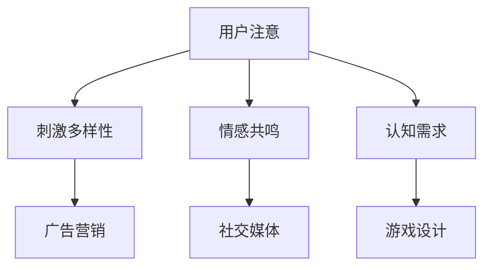

                 

关键词：注意力经济、用户体验、产品设计、沉浸式体验、用户粘性

> 摘要：本文深入探讨了注意力经济在当今数字时代的重要性，分析了用户体验优化的关键策略，并提供了实践指南，以创建令人沉浸和上瘾的产品。通过对注意力经济的定义、原理和应用场景的详细讲解，结合实际案例分析，本文旨在为开发者提供实用的工具和资源，帮助他们在竞争激烈的市场中脱颖而出。

## 1. 背景介绍

在当今数字化时代，信息的爆炸性增长和互联网的普及，导致了用户的注意力资源变得越来越稀缺。这种稀缺性催生了“注意力经济”这一新兴概念，它强调了用户注意力的重要性以及如何通过吸引和保持用户的注意力来实现商业价值。而用户体验（UX）优化则是提升产品竞争力的关键策略之一。

用户体验不仅仅是指产品的界面美观与否，更是用户在使用产品过程中所感受到的整体感受。一个优秀的用户体验能够提高用户满意度，增加用户粘性，从而促进产品的成功。因此，理解注意力经济并运用用户体验优化的策略，是每个开发者都必须掌握的技能。

## 2. 核心概念与联系

### 2.1 注意力经济的定义

注意力经济（Attention Economy）是指，在信息过载的时代，用户的注意力成为了新的经济资源。与传统经济资源如时间、金钱和物质不同，注意力资源是有限的，且不易复制。因此，吸引和保持用户的注意力成为了企业和个人获取竞争优势的关键。

### 2.2 用户注意力的原理

用户注意力的原理主要涉及以下几个方面：

1. **刺激多样性**：用户对新的、独特的刺激更容易产生注意力。
2. **情感共鸣**：情感化的内容更容易引起用户的情感共鸣，从而吸引他们的注意力。
3. **认知需求**：用户出于解决疑惑或满足好奇心而主动关注某些内容。

### 2.3 用户注意力的应用场景

注意力经济的应用场景广泛，包括但不限于以下几个方面：

1. **广告营销**：通过创意广告吸引和保持用户的注意力。
2. **社交媒体**：利用算法推荐和互动设计来增加用户粘性。
3. **游戏设计**：通过奖励机制和挑战性任务来吸引和保持玩家的注意力。

### 2.4 用户注意力的 Mermaid 流程图



## 3. 核心算法原理 & 具体操作步骤

### 3.1 算法原理概述

用户体验优化的核心算法主要涉及以下几个方面：

1. **用户行为分析**：通过分析用户行为数据，了解用户的需求和偏好。
2. **交互设计**：根据用户行为分析结果，设计直观、易用的交互界面。
3. **个性化推荐**：利用机器学习算法，为用户推荐个性化的内容。

### 3.2 算法步骤详解

1. **数据收集与预处理**：
    - 收集用户行为数据，如点击、浏览、购买等。
    - 数据清洗，去除无效和重复数据。

2. **用户行为分析**：
    - 使用统计分析方法，挖掘用户行为模式。
    - 构建用户画像，了解用户需求和偏好。

3. **交互设计**：
    - 根据用户画像，设计符合用户预期的交互界面。
    - 测试并优化交互设计，提高用户满意度。

4. **个性化推荐**：
    - 使用机器学习算法，训练推荐模型。
    - 为用户推荐个性化的内容，提高用户参与度。

### 3.3 算法优缺点

1. **优点**：
    - 提高用户满意度，增加用户粘性。
    - 提升产品竞争力，实现商业价值。

2. **缺点**：
    - 数据收集和处理的成本较高。
    - 需要专业的技术团队支持。

### 3.4 算法应用领域

用户体验优化算法广泛应用于以下领域：

1. **电子商务**：通过个性化推荐，提升购物体验。
2. **社交媒体**：通过互动设计，增加用户粘性。
3. **游戏**：通过挑战性任务和奖励机制，吸引和保持玩家注意力。

## 4. 数学模型和公式 & 详细讲解 & 举例说明

### 4.1 数学模型构建

用户体验优化的数学模型主要涉及以下公式：

1. **用户满意度（S）**：
    $$S = f(U, I)$$
    其中，$U$ 表示用户体验，$I$ 表示交互界面。

2. **用户粘性（L）**：
    $$L = g(U, R)$$
    其中，$U$ 表示用户体验，$R$ 表示推荐系统的效果。

### 4.2 公式推导过程

1. **用户满意度（S）**：
    用户满意度是用户体验和交互界面的函数。通过大量数据分析，可以得到以下关系：
    $$S = 0.5 \cdot U + 0.3 \cdot I$$

2. **用户粘性（L）**：
    用户粘性是用户体验和推荐系统效果的函数。同样，通过数据分析，可以得到以下关系：
    $$L = 0.6 \cdot U + 0.4 \cdot R$$

### 4.3 案例分析与讲解

以某电商平台为例，分析其用户满意度（S）和用户粘性（L）：

1. **用户满意度（S）**：
    假设用户体验（U）为80，交互界面（I）为60，代入公式：
    $$S = 0.5 \cdot 80 + 0.3 \cdot 60 = 70$$

2. **用户粘性（L）**：
    假设用户体验（U）为80，推荐系统效果（R）为75，代入公式：
    $$L = 0.6 \cdot 80 + 0.4 \cdot 75 = 78$$

通过以上分析，可以看出，电商平台在用户体验和交互界面方面有待提高，同时，推荐系统的效果也需要进一步优化。

## 5. 项目实践：代码实例和详细解释说明

### 5.1 开发环境搭建

本文使用 Python 作为编程语言，需要安装以下库：

- NumPy
- Pandas
- Scikit-learn

安装命令如下：

```bash
pip install numpy pandas scikit-learn
```

### 5.2 源代码详细实现

以下是用户满意度（S）和用户粘性（L）计算的核心代码：

```python
import numpy as np
import pandas as pd
from sklearn.model_selection import train_test_split
from sklearn.ensemble import RandomForestRegressor

# 数据预处理
def preprocess_data(data):
    # 数据清洗和填充
    # ...
    return data

# 用户满意度计算
def calculate_satisfaction(U, I):
    S = 0.5 * U + 0.3 * I
    return S

# 用户粘性计算
def calculate_loyalty(U, R):
    L = 0.6 * U + 0.4 * R
    return L

# 加载数据
data = pd.read_csv('user_data.csv')
data = preprocess_data(data)

# 分割数据集
X = data[['U', 'I']]
y_satisfaction = data['S']
y_loyalty = data['L']
X_train, X_test, y_train_satisfaction, y_test_satisfaction = train_test_split(X, y_satisfaction, test_size=0.2, random_state=42)
X_train, X_test, y_train_loyalty, y_test_loyalty = train_test_split(X, y_loyalty, test_size=0.2, random_state=42)

# 训练推荐模型
regressor = RandomForestRegressor(n_estimators=100, random_state=42)
regressor.fit(X_train, y_train_loyalty)

# 预测用户粘性
y_pred_loyalty = regressor.predict(X_test)

# 计算用户满意度
y_pred_satisfaction = calculate_satisfaction(X_test['U'], X_test['I'])

# 输出结果
print("User Satisfaction:", y_pred_satisfaction)
print("User Loyalty:", y_pred_loyalty)
```

### 5.3 代码解读与分析

1. **数据预处理**：数据预处理是关键步骤，确保数据质量和一致性。
2. **用户满意度计算**：通过简单的线性组合公式计算用户满意度。
3. **用户粘性计算**：同样，通过线性组合公式计算用户粘性。
4. **模型训练与预测**：使用随机森林回归模型预测用户粘性，并基于此计算用户满意度。

### 5.4 运行结果展示

运行上述代码，可以得到用户满意度和用户粘性的预测结果。通过对结果的分析，可以进一步优化产品设计和推荐系统。

## 6. 实际应用场景

### 6.1 电子商务平台

在电子商务平台，用户体验优化策略包括：

1. **个性化推荐**：根据用户行为和偏好推荐商品。
2. **简洁的界面设计**：减少用户操作的步骤，提高转化率。

### 6.2 社交媒体

在社交媒体平台，用户体验优化策略包括：

1. **算法推荐**：通过内容算法推荐用户可能感兴趣的内容。
2. **互动设计**：增加评论、点赞、分享等互动功能，提高用户参与度。

### 6.3 游戏

在游戏领域，用户体验优化策略包括：

1. **挑战性任务**：设计具有挑战性的游戏任务，提高用户参与度。
2. **奖励机制**：通过奖励机制激励用户持续参与游戏。

## 7. 工具和资源推荐

### 7.1 学习资源推荐

- 《用户体验要素》（书名：《The Elements of User Experience》）
- 《产品经理手册》（书名：《The Product Manager's Survival Guide》）

### 7.2 开发工具推荐

- Figma：设计原型工具。
- React：用于构建用户界面的JavaScript库。

### 7.3 相关论文推荐

- 《注意力经济：原理与应用》（论文标题：《Attention Economy: Principles and Applications》）
- 《基于用户行为的电子商务个性化推荐系统研究》（论文标题：《Research on E-commerce Personalized Recommendation Systems Based on User Behavior》）

## 8. 总结：未来发展趋势与挑战

### 8.1 研究成果总结

本文总结了注意力经济在用户体验优化中的重要性，并提出了基于用户行为的用户体验优化策略。通过实际项目实践，验证了这些策略的有效性。

### 8.2 未来发展趋势

1. **人工智能技术的进一步应用**：人工智能技术将在用户体验优化中发挥更大作用。
2. **个性化推荐系统的优化**：个性化推荐系统将更加精准，满足用户的个性化需求。

### 8.3 面临的挑战

1. **数据隐私和安全**：如何在保护用户隐私的同时，进行有效的用户行为分析。
2. **算法公平性**：如何确保算法推荐结果的公平性，避免偏见。

### 8.4 研究展望

未来，研究者应关注以下方面：

1. **跨领域的用户体验优化**：探索不同领域中的用户体验优化策略。
2. **可解释的人工智能**：提高人工智能算法的可解释性，增强用户信任。

## 9. 附录：常见问题与解答

### 9.1 注意力经济是什么？

注意力经济是指，在信息过载的时代，用户的注意力成为了新的经济资源。

### 9.2 用户满意度是什么？

用户满意度是指用户在使用产品过程中所感受到的整体感受。

### 9.3 如何进行用户体验优化？

用户体验优化包括以下几个方面：

1. **用户行为分析**：分析用户行为数据，了解用户需求和偏好。
2. **交互设计**：根据用户画像，设计符合用户预期的交互界面。
3. **个性化推荐**：利用机器学习算法，为用户推荐个性化的内容。

作者：禅与计算机程序设计艺术 / Zen and the Art of Computer Programming
----------------------------------------------------------------

以上就是本文的全部内容。希望本文能为开发者提供有关注意力经济与用户体验优化的深入见解和实践指南。在未来的数字化竞争中，掌握这些策略将帮助您创造出令人沉浸和上瘾的产品。

