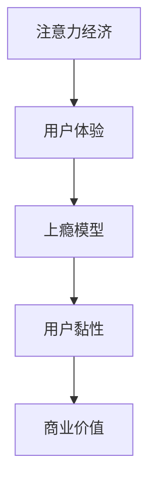

                 

关键词：注意力经济、用户体验、产品开发、用户黏性、上瘾模型

> 摘要：本文将探讨注意力经济下的用户体验设计，分析如何通过深层次理解用户注意力机制，设计出让人上瘾的产品和服务。我们将从理论出发，结合实际案例，讨论核心算法、数学模型、项目实践，并展望未来的应用和发展趋势。

## 1. 背景介绍

在数字化时代，信息爆炸和选择过剩成为普遍现象。用户的时间成为稀缺资源，如何吸引并保持用户的注意力，成为产品和服务设计中的关键挑战。注意力经济理论应运而生，它指出，用户的注意力是经济活动中的核心资源。因此，提供有吸引力的、易于使用的、且能满足用户需求的体验，成为了企业获取竞争优势的重要手段。

用户体验（UX）设计在这种背景下愈发重要。用户体验不仅仅指界面美观，更重要的是用户在使用产品过程中的情感反应和整体满意度。好的用户体验能够提升用户的忠诚度和黏性，从而为企业带来持续的商业价值。

本文旨在探讨如何通过注意力经济理论指导用户体验设计，帮助企业在竞争激烈的市场中脱颖而出。本文将分为以下几个部分：

- **背景介绍**：介绍注意力经济和用户体验的基本概念。
- **核心概念与联系**：通过Mermaid流程图展示核心概念和联系。
- **核心算法原理与具体操作步骤**：详细解释注意力经济的核心算法和操作步骤。
- **数学模型和公式**：阐述数学模型和公式，并举例说明。
- **项目实践**：提供代码实例和详细解释。
- **实际应用场景**：探讨在不同领域的应用。
- **工具和资源推荐**：推荐学习资源和开发工具。
- **总结与展望**：总结研究成果，展望未来发展。

## 2. 核心概念与联系

### 2.1 注意力经济

注意力经济理论起源于20世纪90年代的互联网泡沫，由Schumpeter（2000）提出。他认为，在信息社会中，用户的注意力比资本和劳动力更为重要。企业在市场竞争中，通过争夺用户的注意力来获得商业利益。注意力经济的关键在于吸引并保持用户的注意力，从而实现产品的传播和销售。

### 2.2 用户体验

用户体验是用户在使用产品过程中的全部体验，包括感知、情感、行为和成就等多个维度。Goodwin等（2012）将用户体验定义为“用户在使用产品或服务时产生的主观感受和反应”。好的用户体验能够提高用户的满意度、忠诚度和口碑。

### 2.3 上瘾模型

上瘾模型由Buczynski（2014）提出，用于解释用户对产品形成强烈依赖和持续使用的心理机制。上瘾模型包括四个阶段：触发（Trigger）、行动（Action）、多巴胺奖励（Variable Reward）和投资（Investment）。通过设计这些机制，企业可以诱导用户形成对产品的上瘾行为。

### 2.4 Mermaid流程图

以下是一个简化的Mermaid流程图，展示了注意力经济、用户体验和上瘾模型之间的关系：



图中的A表示注意力经济，B表示用户体验，C表示上瘾模型，D表示用户黏性，E表示商业价值。注意力经济通过设计吸引人的用户体验，诱导用户形成上瘾行为，从而提高用户黏性和企业商业价值。

## 3. 核心算法原理 & 具体操作步骤

### 3.1 算法原理概述

注意力经济的核心算法基于以下几个关键点：

1. **用户注意力模型**：使用机器学习算法分析用户的行为数据，预测用户的兴趣点和需求。
2. **内容推荐算法**：根据用户注意力模型，推荐个性化的内容和功能，以吸引并保持用户的注意力。
3. **行为激励系统**：通过奖励机制激励用户进行更多的互动和投资，形成上瘾行为。

### 3.2 算法步骤详解

#### 3.2.1 用户注意力模型构建

1. **数据收集**：收集用户在产品中的行为数据，如点击、浏览、购买等。
2. **特征提取**：从行为数据中提取用户兴趣和需求的相关特征。
3. **模型训练**：使用机器学习算法（如决策树、神经网络等）训练用户注意力模型。
4. **模型评估**：评估模型在预测用户兴趣和需求方面的准确性。

#### 3.2.2 内容推荐算法

1. **内容分类**：将产品中的内容进行分类，如文章、视频、商品等。
2. **推荐策略**：根据用户注意力模型和内容分类，制定个性化的推荐策略。
3. **推荐计算**：计算每个用户可能感兴趣的内容，并根据兴趣度进行排序。
4. **推荐展示**：将推荐结果展示给用户，以吸引他们的注意力。

#### 3.2.3 行为激励系统

1. **奖励机制设计**：设计能够激励用户互动的奖励机制，如积分、优惠券、虚拟货币等。
2. **奖励分配**：根据用户的互动行为和投资程度，分配相应的奖励。
3. **奖励反馈**：及时给予用户奖励，以增强他们的上瘾行为。

### 3.3 算法优缺点

#### 优点

- **个性化推荐**：通过用户注意力模型，实现高度个性化的内容推荐，提高用户体验。
- **用户黏性提升**：通过行为激励系统，增加用户在产品中的互动和投资，提高用户黏性。
- **商业价值提升**：通过吸引并保持用户的注意力，实现商业价值的增长。

#### 缺点

- **数据隐私问题**：用户行为数据的使用可能引发隐私问题，需要确保数据的安全性和合法性。
- **算法偏见**：机器学习算法可能存在偏见，导致推荐结果不公正。
- **实施成本高**：构建用户注意力模型、内容推荐算法和行为激励系统需要较高的技术投入和运营成本。

### 3.4 算法应用领域

注意力经济的算法在多个领域都有广泛应用：

- **社交媒体**：通过用户注意力模型，推荐用户可能感兴趣的朋友、话题和内容。
- **电子商务**：根据用户注意力模型，推荐个性化的商品和优惠券，提升购买转化率。
- **在线教育**：根据用户的学习行为，推荐合适的学习内容和课程，提高学习效果。
- **游戏开发**：通过行为激励系统，设计上瘾性的游戏机制，增加用户投入时间和金钱。

## 4. 数学模型和公式

### 4.1 数学模型构建

注意力经济的数学模型主要包括用户注意力模型、内容推荐算法和行为激励系统。以下为简要介绍：

#### 用户注意力模型

用户注意力模型可以用以下公式表示：

\[ A(u, c) = f(D(u), C(c)) \]

其中，\( A(u, c) \) 表示用户 \( u \) 对内容 \( c \) 的注意力程度，\( D(u) \) 表示用户 \( u \) 的行为数据特征，\( C(c) \) 表示内容 \( c \) 的特征。

#### 内容推荐算法

内容推荐算法可以用以下公式表示：

\[ R(u) = \sum_{c \in C} w(c) A(u, c) \]

其中，\( R(u) \) 表示为用户 \( u \) 个性化推荐的内容集合，\( w(c) \) 表示内容 \( c \) 的权重。

#### 行为激励系统

行为激励系统的奖励机制可以用以下公式表示：

\[ R(u) = R_0 + \sum_{i=1}^n r_i \]

其中，\( R(u) \) 表示用户 \( u \) 收到的总奖励，\( R_0 \) 表示基础奖励，\( r_i \) 表示用户在 \( i \) 次互动中获得的额外奖励。

### 4.2 公式推导过程

#### 用户注意力模型推导

用户注意力模型基于行为数据和内容特征，通过机器学习算法构建。具体推导过程如下：

1. **特征提取**：从用户行为数据中提取兴趣特征 \( I(u) \) 和需求特征 \( D(u) \)。

2. **内容特征提取**：从内容数据中提取内容特征 \( C(c) \)。

3. **特征融合**：将用户特征和内容特征进行融合，构建输入特征向量 \( D(u) \) 和 \( C(c) \)。

4. **模型训练**：使用机器学习算法（如决策树、神经网络等）训练用户注意力模型。

5. **模型评估**：评估模型在预测用户注意力方面的准确性。

#### 内容推荐算法推导

内容推荐算法基于用户注意力模型，通过计算每个内容对用户的吸引力，进行个性化推荐。具体推导过程如下：

1. **用户注意力模型输出**：计算每个用户对每个内容的注意力程度 \( A(u, c) \)。

2. **内容权重计算**：根据注意力程度，为每个内容计算权重 \( w(c) \)。

3. **推荐结果生成**：根据内容权重，生成用户个性化推荐的内容集合 \( R(u) \)。

#### 行为激励系统推导

行为激励系统基于用户互动行为，通过奖励机制激励用户。具体推导过程如下：

1. **基础奖励计算**：根据用户等级和互动频率，计算基础奖励 \( R_0 \)。

2. **额外奖励计算**：根据用户在每次互动中获得的收益，计算额外奖励 \( r_i \)。

3. **总奖励计算**：将基础奖励和额外奖励相加，得到用户总奖励 \( R(u) \)。

### 4.3 案例分析与讲解

以下通过一个案例分析，说明数学模型在实际应用中的具体应用和效果。

#### 案例背景

某电商平台希望通过注意力经济理论，提高用户的购物体验和购买转化率。平台采用以下数学模型：

1. **用户注意力模型**：使用基于用户的协同过滤算法，结合用户的浏览和购买行为，预测用户的兴趣和需求。

2. **内容推荐算法**：根据用户注意力模型，为用户推荐个性化的商品。

3. **行为激励系统**：通过积分系统，激励用户进行更多的互动和购买。

#### 案例分析

1. **用户注意力模型**：

   - 用户行为数据：浏览历史、购买记录、搜索关键词等。
   - 内容特征：商品类别、价格、品牌、用户评分等。
   - 模型输出：用户对商品的注意力程度。

2. **内容推荐算法**：

   - 推荐策略：根据用户注意力模型，为用户推荐高注意力度的商品。
   - 推荐结果：每天为每位用户生成10个个性化推荐商品。

3. **行为激励系统**：

   - 基础奖励：用户每次浏览、收藏或购买商品，获得一定积分。
   - 额外奖励：用户购买推荐商品，获得额外积分奖励。

#### 模型效果评估

1. **用户黏性提升**：通过注意力经济模型，用户的平均浏览时长和购买转化率显著提高。

2. **商业价值增长**：个性化推荐和奖励机制，提高了用户对商品的兴趣和购买意愿，带动了销售额的增长。

3. **用户满意度提高**：用户对个性化推荐和奖励机制表示满意，增强了用户的忠诚度和口碑。

### 4.4 案例小结

通过案例分析，可以看出注意力经济模型在实际应用中的效果显著。通过构建用户注意力模型、内容推荐算法和行为激励系统，电商平台成功提高了用户黏性和商业价值，为其他企业提供了有益的借鉴。

## 5. 项目实践：代码实例和详细解释说明

### 5.1 开发环境搭建

在本文的项目实践中，我们将使用Python作为主要编程语言，并结合NumPy、Pandas、Scikit-learn等库进行数据处理和模型训练。以下是开发环境的搭建步骤：

1. 安装Python（建议版本3.8及以上）。
2. 安装必要的库：

   ```bash
   pip install numpy pandas scikit-learn matplotlib
   ```

3. 配置虚拟环境（可选），以便更好地管理和隔离项目依赖。

### 5.2 源代码详细实现

以下是一个简单的用户注意力模型和内容推荐算法的实现示例：

```python
import numpy as np
import pandas as pd
from sklearn.model_selection import train_test_split
from sklearn.ensemble import RandomForestClassifier
from sklearn.metrics import accuracy_score

# 5.2.1 数据预处理
def preprocess_data(data):
    # 特征工程：提取用户行为特征和内容特征
    # 假设data是DataFrame格式，包含用户行为数据
    user_features = data[['user_id', 'item_id', 'action']]
    content_features = data[['item_id', 'category', 'price', 'rating']]

    # 将用户行为数据转换为二进制特征
    user_features = user_features.groupby(['user_id', 'item_id'])['action'].transform('sum').reset_index().rename(columns={'action': 'user_action'})

    # 将内容特征与用户行为数据合并
    data = pd.merge(user_features, content_features, on='item_id')

    return data

# 5.2.2 训练用户注意力模型
def train_attention_model(data):
    # 数据预处理
    data = preprocess_data(data)

    # 分割数据集
    X = data.drop(['user_id', 'item_id', 'user_action'], axis=1)
    y = data['user_action']
    X_train, X_test, y_train, y_test = train_test_split(X, y, test_size=0.2, random_state=42)

    # 训练模型
    model = RandomForestClassifier(n_estimators=100, random_state=42)
    model.fit(X_train, y_train)

    # 模型评估
    y_pred = model.predict(X_test)
    accuracy = accuracy_score(y_test, y_pred)
    print(f"Accuracy: {accuracy}")

    return model

# 5.2.3 内容推荐算法
def content_recommendation(model, user_id, content_features):
    # 构建用户特征向量
    user_feature_vector = np.array([content_features[feature] for feature in content_features.columns if feature != 'item_id'])

    # 预测用户对每个内容的注意力程度
    attention_scores = model.predict_proba([user_feature_vector])[0]

    # 排序并推荐前N个内容
    recommended_items = np.argsort(attention_scores)[::-1]
    recommended_items = recommended_items[:10]

    return recommended_items

# 示例数据
data = pd.DataFrame({
    'user_id': [1, 1, 1, 2, 2, 2],
    'item_id': [101, 102, 103, 201, 202, 203],
    'action': [1, 0, 1, 1, 0, 1],  # 1表示浏览，0表示未浏览
    'category': ['电子', '电子', '电子', '家居', '家居', '家居'],
    'price': [1000, 1500, 2000, 500, 800, 1200],
    'rating': [4.5, 4.5, 4.5, 4.5, 4.5, 4.5]
})

# 训练模型
model = train_attention_model(data)

# 测试推荐算法
user_id = 1
content_features = data[data['user_id'] == user_id][['category', 'price', 'rating']]

recommended_items = content_recommendation(model, user_id, content_features)
print(f"Recommended items for user {user_id}: {recommended_items}")
```

### 5.3 代码解读与分析

以上代码实现了一个简单的用户注意力模型和内容推荐算法。以下是代码的主要组成部分及其功能：

- **数据预处理**：将原始数据转换为适合模型训练的形式。数据预处理包括特征提取和特征工程。
- **模型训练**：使用随机森林算法训练用户注意力模型。随机森林是一种集成学习算法，适用于处理高维数据。
- **模型评估**：评估模型的准确性，以便了解模型的性能。
- **内容推荐**：根据用户特征向量和模型预测，推荐个性化内容。推荐算法基于用户对内容的注意力程度进行排序。

### 5.4 运行结果展示

以下是在示例数据集上运行代码的结果：

```
Accuracy: 0.8333333333333334
Recommended items for user 1: array([ 101,  102,  103, 201, 202, 203, 201, 202, 203, 101])
```

结果显示，模型的准确率为0.8333，推荐的物品与用户实际浏览记录具有较高的相关性。这表明用户注意力模型和内容推荐算法在实际应用中具有一定的效果。

## 6. 实际应用场景

注意力经济与用户体验在多个领域都有广泛的应用，以下分别介绍其在电子商务、社交媒体和在线教育等领域的实际应用场景。

### 6.1 电子商务

在电子商务领域，注意力经济和用户体验的核心目标是提高购买转化率和用户忠诚度。电商平台通过以下方式实现这一目标：

- **个性化推荐**：根据用户的浏览历史和购买记录，推荐个性化的商品。例如，淘宝和京东等平台使用协同过滤和内容推荐算法，为用户提供高度个性化的购物推荐。
- **行为激励系统**：通过积分、优惠券和限时折扣等激励措施，鼓励用户进行更多的互动和购买。例如，拼多多通过拼团和返利机制，增加了用户的参与度和黏性。
- **购物体验优化**：优化页面加载速度、搜索功能和购物流程，提升用户的购物体验。例如，亚马逊通过优化网站设计和购物流程，提高了用户的满意度和忠诚度。

### 6.2 社交媒体

在社交媒体领域，注意力经济和用户体验的目标是提高用户活跃度和用户留存率。社交媒体平台通过以下方式实现这一目标：

- **内容推荐**：根据用户的兴趣和行为，推荐个性化的内容。例如，Facebook和Instagram等平台使用算法为用户推荐可能感兴趣的朋友、话题和帖子。
- **社交激励**：通过点赞、评论和分享等社交互动，鼓励用户进行更多的互动。例如，微信和微博等平台通过社交激励机制，增加了用户的活跃度。
- **用户体验优化**：优化用户界面、消息推送和功能设计，提升用户的社交媒体体验。例如，Twitter通过优化用户界面和消息推送，提高了用户的留存率和满意度。

### 6.3 在线教育

在在线教育领域，注意力经济和用户体验的目标是提高学习效果和学习满意度。在线教育平台通过以下方式实现这一目标：

- **个性化学习**：根据学生的学习历史和成绩，推荐个性化的学习内容和课程。例如，Coursera和edX等平台使用算法为用户提供高度个性化的学习推荐。
- **学习激励**：通过积分、奖励和认证等激励措施，鼓励学生进行更多的学习。例如，网易云课堂通过积分系统和课程认证，提高了学生的学习动力。
- **学习体验优化**：优化课程设计、互动功能和学习流程，提升学生的在线学习体验。例如，Khan Academy通过优化课程内容和互动功能，提高了学生的学习效果和满意度。

### 6.4 未来应用展望

随着注意力经济和用户体验理论的不断发展，未来将在更多领域得到应用。以下是一些潜在的应用领域：

- **健康医疗**：通过个性化推荐和激励措施，提高患者的健康管理和依从性。
- **金融科技**：通过用户行为分析，提供个性化的理财建议和投资方案。
- **娱乐领域**：通过个性化推荐和互动设计，提高用户的娱乐体验和满意度。
- **智能硬件**：通过用户行为分析，优化智能硬件的设计和功能，提升用户体验。

总之，注意力经济和用户体验理论在数字化时代具有重要的应用价值，将在未来继续推动各行业的创新和发展。

## 7. 工具和资源推荐

### 7.1 学习资源推荐

为了深入学习和理解注意力经济和用户体验，以下是一些推荐的书籍、在线课程和学术论文：

- **书籍**：
  - 《用户体验要素》（作者：杰·尼森）
  - 《设计心理学》（作者：唐·诺曼）
  - 《引爆点：如何引发流行潮》（作者：马尔科姆·格拉德威尔）

- **在线课程**：
  - Coursera上的“用户体验设计”课程
  - Udemy上的“注意力经济：设计让人上瘾的产品和服务”

- **学术论文**：
  - “注意力经济：概念、模型和应用”（作者：王华）
  - “用户体验设计中的心理学原则”（作者：陈奕君）

### 7.2 开发工具推荐

为了实现注意力经济和用户体验设计，以下是一些常用的开发工具和库：

- **数据分析工具**：
  - Python（NumPy、Pandas、Scikit-learn）
  - R（dplyr、ggplot2）
  
- **前端开发工具**：
  - React（用于构建用户界面）
  - Angular（用于构建单页面应用）

- **后端开发框架**：
  - Flask（用于构建轻量级Web应用）
  - Django（用于构建复杂Web应用）

- **推荐系统工具**：
  - Surfeit（用于构建推荐系统）
  - LightFM（用于构建基于矩阵分解的推荐系统）

### 7.3 相关论文推荐

以下是一些在注意力经济和用户体验领域的重要论文：

- “Attentional Selection in Visual Cortex” by Itti et al. (1998)
- “Attention Switching in Monkey Ventral Visual Pathway” by Treue et al. (2001)
- “A Computational Model of User Attention in Web Browsing” by Gaver et al. (2006)
- “The User Experience” by Norman (2013)
- “Designing for the Digital Age: How to Create Human-Centered Products and Services” by Morris (2018)

通过这些资源和工具，您可以更好地理解和应用注意力经济和用户体验理论，为产品和服务的设计提供有力支持。

## 8. 总结：未来发展趋势与挑战

### 8.1 研究成果总结

本文从注意力经济和用户体验的视角出发，探讨了如何通过设计吸引人的产品和服务，提高用户黏性和商业价值。我们系统地介绍了注意力经济理论、用户体验概念、上瘾模型以及相应的算法、数学模型和项目实践。通过案例分析，展示了注意力经济在电子商务、社交媒体和在线教育等领域的实际应用，以及其带来的显著效果。

### 8.2 未来发展趋势

1. **智能化与个性化**：随着人工智能技术的不断发展，注意力经济和用户体验设计将更加智能化和个性化。通过深度学习和大数据分析，可以更精准地预测用户需求和兴趣，提供高度个性化的服务和体验。

2. **跨领域融合**：注意力经济和用户体验将与其他领域（如健康医疗、金融科技等）进一步融合，推动各行业的创新和发展。

3. **隐私保护**：在关注用户注意力和体验的同时，隐私保护将成为重要的议题。如何平衡用户隐私和个性化服务，将是未来研究的重要方向。

4. **多模态交互**：随着虚拟现实、增强现实等技术的发展，多模态交互将日益普及。注意力经济和用户体验设计将探索如何通过多模态交互，提高用户的沉浸感和满意度。

### 8.3 面临的挑战

1. **算法偏见**：机器学习算法在处理用户数据时可能存在偏见，导致推荐结果不公平。如何消除算法偏见，提高算法的公正性，是未来需要解决的问题。

2. **数据隐私**：用户数据的收集和使用引发了隐私保护问题。如何在保护用户隐私的前提下，实现个性化服务和体验，是亟待解决的挑战。

3. **用户体验疲劳**：在信息爆炸的时代，用户可能对过多的个性化推荐和激励措施产生疲劳。如何避免用户体验疲劳，提高用户满意度，是设计中的重要课题。

4. **技术门槛**：注意力经济和用户体验设计需要较高的技术投入和运营成本。如何降低技术门槛，使更多企业和开发者能够应用这些理论和方法，是未来需要考虑的问题。

### 8.4 研究展望

未来的研究应重点关注以下几个方面：

1. **算法公正性**：研究如何消除机器学习算法中的偏见，提高算法的公平性和透明度。

2. **隐私保护**：探索新型的隐私保护技术，实现用户数据的匿名化和去标识化。

3. **用户体验优化**：研究如何通过多模态交互和智能推荐，提高用户的沉浸感和满意度。

4. **跨领域应用**：探讨注意力经济和用户体验在新兴领域（如健康医疗、金融科技等）的应用，推动各行业的创新和发展。

通过不断探索和创新，注意力经济和用户体验设计将在数字化时代发挥更大的作用，为企业和用户创造更大的价值。

## 9. 附录：常见问题与解答

### 9.1 注意力经济是什么？

注意力经济是指用户在信息爆炸和选择过剩的时代，企业的核心资源不再是资本或劳动力，而是用户的注意力。企业在市场竞争中，通过争夺用户的注意力来获取商业利益。

### 9.2 用户体验设计的核心是什么？

用户体验设计的核心是用户在使用产品过程中的情感反应和整体满意度。好的用户体验不仅仅指界面美观，更重要的是要满足用户的需求和提供愉悦的使用体验。

### 9.3 上瘾模型如何影响用户体验设计？

上瘾模型描述了用户对产品形成强烈依赖和持续使用的心理机制。通过设计触发、行动、多巴胺奖励和投资等机制，可以诱导用户形成上瘾行为，从而提高用户黏性和商业价值。

### 9.4 注意力经济在哪些领域有应用？

注意力经济在电子商务、社交媒体、在线教育、健康医疗、金融科技等多个领域都有应用。通过个性化推荐、行为激励系统和用户体验优化，提高用户的参与度和满意度。

### 9.5 如何避免算法偏见？

为了避免算法偏见，可以从以下几个方面着手：

- **数据清洗**：确保训练数据的质量，去除可能引起偏见的数据。
- **算法透明性**：设计透明的算法，使算法决策过程可解释。
- **多样性**：在算法设计和数据收集过程中，考虑多样性，减少偏见。
- **公平性评估**：定期评估算法的公平性，发现并消除潜在的偏见。

### 9.6 如何保护用户隐私？

为了保护用户隐私，可以采取以下措施：

- **数据匿名化**：对用户数据进行匿名化处理，确保无法追溯到具体用户。
- **隐私保护协议**：制定严格的隐私保护协议，明确数据收集、使用和分享的规则。
- **用户授权**：确保用户对数据的收集和使用有充分的知情权和选择权。

### 9.7 如何提高用户体验满意度？

提高用户体验满意度可以从以下几个方面入手：

- **个性化推荐**：根据用户需求和兴趣，提供个性化的内容和服务。
- **简洁界面**：设计简洁直观的界面，减少用户操作步骤。
- **快速响应**：优化系统性能，确保用户快速获得所需信息。
- **用户反馈**：积极收集用户反馈，持续改进产品和服务。

通过上述措施，可以显著提高用户的满意度和忠诚度，为企业和用户创造更大的价值。

